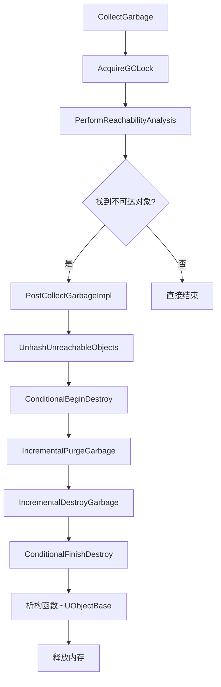

> [[00-UE全解析主索引|← 返回 UE全解析主索引]]

# UE-CoreUObject-源码解析：GC 与对象生命周期

## 模块定位

- **UE 模块路径**：`Engine/Source/Runtime/CoreUObject/`
- **Build.cs 文件**：`CoreUObject.Build.cs`
- **核心依赖**：`Core`（基础类型、容器、原子操作）、`TraceLog`（性能追踪）
- **Private 依赖**：`Projects`、`Json`、`AutoRTFM`
- **模块职责**：UE 对象系统的基石，负责 UObject 的创建、查找、反射、序列化，以及**垃圾回收（Garbage Collection）与对象生命周期管理**。所有 UObject 的内存安全都依赖该模块的 GC 子系统。

> 文件：`Engine/Source/Runtime/CoreUObject/CoreUObject.Build.cs`，第 1~69 行

---

## 接口梳理（第 1 层）

### GC 相关公共头文件

| 头文件 | 核心类/结构 | 职责 |
|--------|------------|------|
| `Public/UObject/GarbageCollection.h` | `FGCScopeGuard`、`FGCObject`、`FGarbageReferenceInfo` | GC 锁保护、非 UObject 对象的 GC 桥接 |
| `Public/UObject/GCObject.h` | `UGCObjectReferencer`、`FGCObject` | 代理 UObject 与非 UObject 之间的引用收集 |
| `Public/UObject/UObjectGlobals.h` | `CollectGarbage`、`TryCollectGarbage`、`IncrementalPurgeGarbage` | 全局 GC 入口函数 |
| `Public/UObject/UObjectBaseUtility.h` | `UObjectBaseUtility` | `MarkAsGarbage`、`AddToRoot`、`RemoveFromRoot` 等生命周期控制 API |
| `Public/UObject/Object.h` | `UObject` | `ConditionalBeginDestroy`、`ConditionalFinishDestroy` 等销毁虚函数 |
| `Public/UObject/ObjectMacros.h` | `EObjectFlags`、`EInternalObjectFlags` | UObject 标志位与 GC 状态标志定义 |
| `Public/UObject/ReachabilityAnalysis.h` | `FStats`、`FUnreachableObject` | 增量可达性分析配置与统计 |

### 核心类职责

#### 1. `UObject` — 所有 UE 对象的基类

`UObject` 在 `Object.h` 中声明了对象销毁的核心虚函数接口：

> 文件：`Engine/Source/Runtime/CoreUObject/Public/UObject/Object.h`，第 362~387 行

```cpp
// 开始异步销毁，子类可重写以释放渲染线程资源等
COREUOBJECT_API virtual void BeginDestroy();

// 检查异步清理是否完成（如等待 Render Thread fence）
virtual bool IsReadyForFinishDestroy() { return true; }

// 完成销毁，属性在此阶段被释放
COREUOBJECT_API virtual void FinishDestroy();
```

同时提供了安全封装：

> 文件：`Engine/Source/Runtime/CoreUObject/Public/UObject/Object.h`，第 1179~1186 行

```cpp
// 安全入口：设置 RF_BeginDestroyed 标志后调用 BeginDestroy()
COREUOBJECT_API bool ConditionalBeginDestroy();

// 安全入口：设置 RF_FinishDestroyed 标志后调用 FinishDestroy()
COREUOBJECT_API bool ConditionalFinishDestroy();
```

#### 2. `UObjectBaseUtility` — 底层标志与 GC 状态操作

> 文件：`Engine/Source/Runtime/CoreUObject/Public/UObject/UObjectBaseUtility.h`，第 179~225 行

```cpp
// 将对象标记为逻辑垃圾（禁止在 Rooted 对象上调用）
inline void MarkAsGarbage()
{
    check(!IsRooted());
    AtomicallySetFlags(RF_MirroredGarbage);
    GUObjectArray.IndexToObject(InternalIndex)->SetGarbage();
    AtomicallyClearInternalFlags(EInternalObjectFlags::Async);
}

// 加入根集，阻止 GC 回收
UE_FORCEINLINE_HINT void AddToRoot()
{
    GUObjectArray.IndexToObject(InternalIndex)->SetRootSet();
}

// 从根集移除
UE_FORCEINLINE_HINT void RemoveFromRoot()
{
    GUObjectArray.IndexToObject(InternalIndex)->ClearRootSet();
}
```

#### 3. `FGCObject` — 非 UObject 的 GC 桥接

引擎中存在大量原生 C++ 对象（如 Slate、渲染器）持有 UObject 引用，它们通过继承 `FGCObject` 并注册到全局 `UGCObjectReferencer` 来参与 GC。

> 文件：`Engine/Source/Runtime/CoreUObject/Public/UObject/GCObject.h`，第 127~215 行

```cpp
class FGCObject
{
public:
    static COREUOBJECT_API UGCObjectReferencer* GGCObjectReferencer;
    
    FGCObject() { RegisterGCObject(); }
    virtual ~FGCObject() { UnregisterGCObject(); }
    
    // 子类必须实现：通过 Collector 报告所有引用的 UObject
    virtual void AddReferencedObjects(FReferenceCollector& Collector) = 0;
    virtual FString GetReferencerName() const = 0;
};
```

`UGCObjectReferencer` 是一个特殊的 `UObject`，它的 `AddReferencedObjects` 会被 GC 调用，进而遍历所有注册的 `FGCObject` 实例，确保非 UObject 持有的强引用也能保护 UObject 不被回收。

---

## 数据结构（第 2 层）

### UObject 标志位体系

UObject 的 GC 状态由两组标志协同维护：

#### `EObjectFlags`（Public 标志，32-bit）

> 文件：`Engine/Source/Runtime/CoreUObject/Public/UObject/ObjectMacros.h`，第 551~600 行

```cpp
enum EObjectFlags
{
    RF_NoFlags              = 0x00000000,
    RF_Public               = 0x00000001,  // 包外可见
    RF_MarkAsNative         = 0x00000004,  // 原生对象（构造时设置）
    RF_MarkAsRootSet        = 0x00000002,  // 根集（已废弃，改用 InternalFlags）
    RF_Transactional        = 0x00000008,
    RF_ClassDefaultObject   = 0x00000010,
    RF_ArchetypeObject      = 0x00000020,
    
    // GC 相关标志
    RF_TagGarbageTemp       = 0x00000100,  // 工具临时标记
    RF_NeedInitialization   = 0x00000200,
    RF_NeedLoad             = 0x00000400,
    RF_NeedPostLoad         = 0x00001000,
    RF_BeginDestroyed       = 0x00008000,  // ConditionalBeginDestroy 已调用
    RF_FinishDestroyed      = 0x00010000,  // ConditionalFinishDestroy 已调用
    RF_MirroredGarbage      = 0x40000000,  // 逻辑垃圾（与 EInternalObjectFlags::Garbage 镜像）
    RF_AllocatedInSharedPage= 0x80000000,
};
```

#### `EInternalObjectFlags`（Internal 标志，32-bit）

> 文件：`Engine/Source/Runtime/CoreUObject/Public/UObject/ObjectMacros.h`，第 630~667 行

```cpp
enum class EInternalObjectFlags : int32
{
    None                = 0,
    ReachabilityFlag0   = 1 << 14, // GC 可达性状态位 0
    ReachabilityFlag1   = 1 << 15, // GC 可达性状态位 1
    ReachabilityFlag2   = 1 << 16, // GC 可达性状态位 2
    Garbage             = 1 << 21, // 逻辑垃圾（与 RF_MirroredGarbage 镜像）
    AsyncLoadingPhase1  = 1 << 22, // 异步加载中
    ReachableInCluster  = 1 << 23, // Cluster 内存在外部引用
    ClusterRoot         = 1 << 24, // Cluster 根节点
    Native              = 1 << 25, // UClass 专用
    Async               = 1 << 26, // 存在于非 Game Thread
    AsyncLoadingPhase2  = 1 << 27,
    Unreachable         = 1 << 28, // 可达性分析后标记为不可达
    RootSet             = 1 << 30, // 根集，GC 永不回收
    PendingConstruction = 1 << 31, // 仅调用了 UObjectBase 构造
};
```

**镜像设计**：`RF_MirroredGarbage` 与 `EInternalObjectFlags::Garbage` 表示同一语义。外部代码持有 `UObject*` 时可快速检查 `RF_MirroredGarbage`；GC 内部遍历 `FUObjectArray` 时可直接读取 `FUObjectItem` 的 `InternalFlags`，避免指针解引用，提升缓存命中率。

### `UObjectBase` 内存布局

> 文件：`Engine/Source/Runtime/CoreUObject/Public/UObject/UObjectBase.h`，第 58~140 行

```cpp
class UObjectBase
{
protected:
    EObjectFlags    ObjectFlags;      // 公共对象标志
    int32           InternalIndex;    // GUObjectArray 索引（ very private ）
    TNonAccessTrackedObjectPtr<UClass> ClassPrivate;
    FNameAndObjectHashIndex NamePrivate;
    TNonAccessTrackedObjectPtr<UObject> OuterPrivate;
};
```

- **`InternalIndex`**：对象在全局 `GUObjectArray` 中的固定索引。GC 遍历时不通过 `UObject*` 解引用，而是直接扫描 `FUObjectItem` 数组，极大提升遍历效率。
- **`OuterPrivate`**：对象的 Outer 层级（Package → World → Actor → Component）。GC 可达性分析会沿着 `UPROPERTY` 引用和 Outer 链进行传播。

### FGCObject 的注册结构

`FGCObject` 实例在构造时通过 `RegisterGCObject()` 加入全局单例 `UGCObjectReferencer::GGCObjectReferencer`。该 `UGCObjectReferencer` 本身是一个 `UObject`，并被显式加入根集（`RF_RootSet`）。因此：

1. `UGCObjectReferencer` 永远不会被 GC 回收。
2. GC 在可达性分析阶段会调用 `UGCObjectReferencer::AddReferencedObjects`。
3. 后者遍历所有注册的 `FGCObject`，调用其 `AddReferencedObjects`，将其持有的 UObject 引用标记为可达。

---

## 行为分析（第 3 层）

### GC 整体流程：`CollectGarbage` → `Purge`

UE 的 GC 采用**可达性分析（Reachability Analysis）+ 增量清理（Incremental Purge）**的两阶段模型：



#### Step 1：GC 入口与锁机制

> 文件：`Engine/Source/Runtime/CoreUObject/Private/UObject/GarbageCollection.cpp`，第 6203~6219 行

```cpp
void CollectGarbage(EObjectFlags KeepFlags, bool bPerformFullPurge)
{
    if (GIsInitialLoad)
    {
        UE_LOG(LogGarbage, Log, TEXT("Skipping CollectGarbage() call during initial load. It's not safe."));
        return;
    }
    AcquireGCLock();                              // 阻止其他线程操作 UObject
    UE::GC::CollectGarbageInternal(KeepFlags, bPerformFullPurge);
    // GC lock 在 reachability analysis 后内部释放
}
```

`AcquireGCLock()` 通过 `FGCCSyncObject` 实现，确保 GC 期间没有其他线程在创建/删除 UObject 或修改 UObject 哈希表。

#### Step 2：可达性分析（Reachability Analysis）

`CollectGarbageImpl` 创建 `FRealtimeGC` 实例并执行可达性分析：

> 文件：`Engine/Source/Runtime/CoreUObject/Private/UObject/GarbageCollection.cpp`，第 5680~5691 行

```cpp
void CollectGarbageImpl(EObjectFlags KeepFlags)
{
    {
        const EGCOptions Options = GetReferenceCollectorOptions(bPerformFullPurge);
        FRealtimeGC GC;
        GC.PerformReachabilityAnalysis(KeepFlags, Options);
    }
}
```

`PerformReachabilityAnalysis` 的核心逻辑（在 `FastReferenceCollector.h/.cpp` 中实现，本篇不做展开）遵循以下步骤：

1. **初始化**：将所有非根集对象标记为 `MaybeUnreachable`。
2. **根集播种（Root Set）**：从 `EInternalObjectFlags::RootSet` 对象、`KeepFlags` 对象、以及 `FGCObject` 引用出发。
3. **引用传播**：利用每个 `UClass` 预生成的 **Token Stream**（由 UHT 生成，描述对象内存布局中所有 `UPROPERTY` 引用的偏移），并行扫描所有对象的引用关系，将可达对象标记为 `Reachable`。
4. **Cluster 处理**：对于注册了 Cluster 的对象组，如果 Cluster Root 不可达，则整个 Cluster 被标记为不可达。

#### Step 3：后处理与不可达对象收集

> 文件：`Engine/Source/Runtime/CoreURuntime/CoreUObject/Private/UObject/GarbageCollection.cpp`，第 5694~5788 行（`PostCollectGarbageImpl`）

```cpp
void PostCollectGarbageImpl(EObjectFlags KeepFlags)
{
    // 溶解需要拆散的 Cluster
    if (GUObjectClusters.ClustersNeedDissolving())
    {
        GUObjectClusters.DissolveClusters();
    }
    
    // 收集所有不可达对象到 GUnreachableObjects 数组
    GatherUnreachableObjects(GatherOptions, /*TimeLimit=*/ 0.0);
    
    // 释放 UObject 哈希表锁，允许 StaticFindObject / StaticAllocateObject
    GIsGarbageCollectingAndLockingUObjectHashTables = false;
    UnlockUObjectHashTables();
    ReleaseGCLock();
    
    // 对不可达对象调用 BeginDestroy
    if (bPerformFullPurge || !GIncrementalBeginDestroyEnabled)
    {
        UnhashUnreachableObjects(/*bUseTimeLimit=*/ false);
    }
    
    // 标记需要 Purge
    GObjPurgeIsRequired = true;
    
    // 若请求 full purge，立即执行增量清理（无时间限制）
    if (bPerformFullPurge)
    {
        IncrementalPurgeGarbage(false);
    }
}
```

**关键设计**：在可达性分析完成后，GC **主锁被释放**。这意味着 `BeginDestroy`、`FinishDestroy`、析构函数和回调中可以安全地调用 `StaticFindObject`、`StaticAllocateObject` 等 UObject 操作，而不会死锁。

#### Step 4：`UnhashUnreachableObjects` — BeginDestroy 阶段

> 文件：`Engine/Source/Runtime/CoreUObject/Private/UObject/GarbageCollection.cpp`，第 6095~6192 行

```cpp
bool UnhashUnreachableObjects(bool bUseTimeLimit, double TimeLimit)
{
    // ...
    {
        TRACE_CPUPROFILER_EVENT_SCOPE(ConditionalBeginDestroy);
        while (GUnrechableObjectIndex < GUnreachableObjects.Num())
        {
            FUObjectItem* ObjectItem = GUnreachableObjects[GUnrechableObjectIndex++].ObjectItem;
            UObject* Object = static_cast<UObject*>(ObjectItem->GetObject());
            Object->ConditionalBeginDestroy();   // 调用 BeginDestroy 虚函数
            
            // 若启用了增量模式，检查时间片是否耗尽
            if (bUseTimeLimit && (FPlatformTime::Seconds() - StartTime) > TimeLimit)
            {
                break;
            }
        }
    }
    return (GUnrechableObjectIndex < GUnreachableObjects.Num());
}
```

`ConditionalBeginDestroy` 的实现：

> 文件：`Engine/Source/Runtime/CoreUObject/Private/UObject/Obj.cpp`，第 1235~1307 行

```cpp
bool UObject::ConditionalBeginDestroy()
{
    check(IsValidLowLevel());
    if (!HasAnyFlags(RF_BeginDestroyed))
    {
        SetFlags(RF_BeginDestroyed);   // 设置标志，防止重复调用
        BeginDestroy();                // 虚函数：子类释放渲染资源、取消异步任务等
        return true;
    }
    return false;
}
```

**为什么拆分为 BeginDestroy / FinishDestroy？**
- `BeginDestroy` 允许对象启动**异步清理**（如向 Render Thread 发送释放 fence）。
- 如果对象在 `BeginDestroy` 后立即被删除，Render Thread 可能仍在使用该资源，导致崩溃。
- GC 通过 `IsReadyForFinishDestroy()` 轮询，确保异步清理完成后再进入 `FinishDestroy`。

#### Step 5：`IncrementalPurgeGarbage` — FinishDestroy 与内存释放

> 文件：`Engine/Source/Runtime/CoreUObject/Private/UObject/GarbageCollection.cpp`，第 4652~4753 行

```cpp
void IncrementalPurgeGarbage(bool bUseTimeLimit, double TimeLimit)
{
    if (!GObjPurgeIsRequired && !GObjIncrementalPurgeIsInProgress)
    {
        return;   // 无待清理对象，直接返回
    }
    
    // 若还有未 Unhash 的对象，先继续执行 BeginDestroy
    if (IsIncrementalUnhashPending())
    {
        bTimeLimitReached = UnhashUnreachableObjects(bUseTimeLimit, TimeLimit);
    }
    
    // 然后执行 IncrementalDestroyGarbage（FinishDestroy + 析构）
    if (!bTimeLimitReached)
    {
        bCompleted = IncrementalDestroyGarbage(bUseTimeLimit, TimeLimit);
    }
}
```

`IncrementalDestroyGarbage` 的核心逻辑：

> 文件：`Engine/Source/Runtime/CoreUObject/Private/UObject/GarbageCollection.cpp`，第 4782~4870 行

```cpp
bool IncrementalDestroyGarbage(bool bUseTimeLimit, double TimeLimit)
{
    // 第一轮：尝试对所有不可达对象调用 ConditionalFinishDestroy
    while (GObjCurrentPurgeObjectIndex < GUnreachableObjects.Num())
    {
        FUObjectItem* ObjectItem = GUnreachableObjects[GObjCurrentPurgeObjectIndex].ObjectItem;
        if (ObjectItem->IsUnreachable())
        {
            UObject* Object = static_cast<UObject*>(ObjectItem->GetObject());
            check(Object->HasAnyFlags(RF_BeginDestroyed) && !Object->HasAnyFlags(RF_FinishDestroyed));
            
            if (Object->IsReadyForFinishDestroy())
            {
                Object->ConditionalFinishDestroy();   // 调用 FinishDestroy
            }
            else
            {
                // 异步清理尚未完成，加入待处理列表，稍后重试
                GGCObjectsPendingDestruction.Add(Object);
                GGCObjectsPendingDestructionCount++;
            }
        }
        ++GObjCurrentPurgeObjectIndex;
        
        // 增量模式检查时间片
        if (bUseTimeLimit && 时间片耗尽) { break; }
    }
    // ... 后续轮询 GGCObjectsPendingDestruction 直到全部完成
}
```

`ConditionalFinishDestroy` 的实现：

> 文件：`Engine/Source/Runtime/CoreUObject/Private/UObject/Obj.cpp`，第 1309~1339 行

```cpp
bool UObject::ConditionalFinishDestroy()
{
    check(IsValidLowLevel());
    if (!HasAnyFlags(RF_FinishDestroyed))
    {
        SetFlags(RF_FinishDestroyed);
        FinishDestroy();                              // 虚函数：销毁 UProperty
        GUObjectArray.ResetSerialNumber(this);        // 弱指针失效
        GUObjectArray.RemoveObjectFromDeleteListeners(this);
        return true;
    }
    return false;
}
```

`FinishDestroy` 执行后，对象的 `UProperty` 已被清理，弱指针序列号被重置（所有 `TWeakObjectPtr` 自动失效）。随后 `UObjectBase` 的析构函数将对象从 `GUObjectArray` 中移除，内存最终通过 `FMemory::Free` 或 `FUObjectAllocator` 归还。

---

### 增量 GC 机制

UE 的 GC 支持**全量模式**与**增量模式**：

| 阶段 | 全量模式 (`bPerformFullPurge=true`) | 增量模式 (`bPerformFullPurge=false`) |
|------|-------------------------------------|--------------------------------------|
| 可达性分析 | 一次性完成 | 实验性支持（`gc.AllowIncrementalReachability`） |
| `BeginDestroy` | 一次性完成 | 按 `gc.IncrementalBeginDestroyEnabled` 分帧执行 |
| `FinishDestroy` | 一次性完成 | 按时间片 `gc.IncrementalBeginDestroyGranularity` 分帧执行 |
| 内存 Trim | 立即执行 | 增量 Purge 完全结束后执行 |

这种设计让 GC 不会造成单帧严重卡顿。对于开放世界或实时性要求高的游戏，通常采用 `TryCollectGarbage`（非阻塞尝试获取锁）+ 增量 Purge 的组合。

---

### 多线程与同步

1. **GC Lock**：`FGCCSyncObject` 在 `CollectGarbage` 开始时获取全局锁，在可达性分析后释放。`BeginDestroy/FinishDestroy/析构` 阶段不再持有该锁，允许其他线程进行 UObject 操作。
2. **哈希表锁**：`FGCHashTableScopeLock` 在可达性分析期间锁定 `UObjectHashTables`，禁止 `StaticFindObjectFast` 等操作。分析结束后立即解锁。
3. **Render Thread 交互**：`BeginDestroy` 常用于发送 `ENQUEUE_RENDER_COMMAND` 释放 GPU 资源。GC 在 Game Thread 调用 `BeginDestroy`，但通过 `IsReadyForFinishDestroy()` 等待 Render Thread fence，实现跨线程安全析构。

---

## 与上下层的关系

### 上层调用者

- **`UEngine::Tick`**：每帧调用 `ConditionalCollectGarbage()`，根据内存压力和对象数量决定是否触发 GC。
- **`UWorld::CleanupWorld`**：切换 Level 或 PIE 结束时调用 `CollectGarbage` 清理旧世界对象。
- **蓝图 VM / 编辑器**：对象被手动删除（如编辑器中 Delete Actor）时调用 `MarkAsGarbage()`，等待下一轮 GC 回收。

### 下层依赖

- **`Core` 模块**：提供 `FPlatformAtomics`、`ParallelFor`、容器等基础设施。
- **`TraceLog` 模块**：GC 各个阶段均插入了 `TRACE_CPUPROFILER_EVENT_SCOPE`，供 UnrealInsights 分析 GC 耗时。
- **`RenderCore/RHI`**：`BeginDestroy` 中释放渲染资源的命令最终下发到 RHI Thread。

---

## 设计亮点与可迁移经验

1. **标志位镜像加速（RF_MirroredGarbage ↔ InternalFlags::Garbage）**
   - 外部代码通过 `UObject*` 检查 `RF_MirroredGarbage` 无需访问 `FUObjectArray`。
   - GC 内部遍历 `FUObjectItem` 数组时直接读取 `InternalFlags`，缓存友好。

2. **Token Stream 驱动的并行引用扫描**
   - UHT 在编译期生成每个 `UClass` 的 GC Token Stream，描述所有 `UPROPERTY` 引用的精确偏移和类型。
   - GC Mark Phase 无需 RTTI，直接按 Token Stream 做内存偏移读取，可大规模并行化（`ParallelFor`）。

3. **两阶段销毁（BeginDestroy / FinishDestroy）**
   - 完美适配多线程引擎架构：Game Thread 发起销毁，Render Thread / Async Loading Thread 异步完成清理，GC 通过 `IsReadyForFinishDestroy` 轮询等待。
   - 借鉴到自研引擎中，可为任何需要异步资源释放的对象系统设计类似的生命周期钩子。

4. **FGCObject 桥接模式**
   - 原生 C++ 对象（非 UObject）通过注册到全局代理对象参与 GC，避免了"所有东西都必须继承自 UObject"的设计僵化。
   - 这是一种**适配器模式**的典范：保持核心 GC 算法纯净，同时通过 `UGCObjectReferencer` 扩展支持边界对象。

5. **增量 GC 的时间片控制**
   - `UnhashUnreachableObjects` 和 `IncrementalDestroyGarbage` 均支持按 `Granularity` 检查时间片，确保 GC 不会独占主线程超过预算。

---

## 关键源码片段

### 对象标记为垃圾

> 文件：`Engine/Source/Runtime/CoreUObject/Public/UObject/UObjectBaseUtility.h`，第 182~191 行

```cpp
inline void MarkAsGarbage()
{
    check(!IsRooted());
    AtomicallySetFlags(RF_MirroredGarbage);
    GUObjectArray.IndexToObject(InternalIndex)->SetGarbage();
    AtomicallyClearInternalFlags(EInternalObjectFlags::Async);
}
```

### GC 主入口

> 文件：`Engine/Source/Runtime/CoreUObject/Private/UObject/GarbageCollection.cpp`，第 6203~6219 行

```cpp
void CollectGarbage(EObjectFlags KeepFlags, bool bPerformFullPurge)
{
    if (GIsInitialLoad)
    {
        UE_LOG(LogGarbage, Log, TEXT("Skipping CollectGarbage() call during initial load. It's not safe."));
        return;
    }
    AcquireGCLock();
    UE::GC::CollectGarbageInternal(KeepFlags, bPerformFullPurge);
}
```

### 不可达对象的 BeginDestroy

> 文件：`Engine/Source/Runtime/CoreUObject/Private/UObject/GarbageCollection.cpp`，第 6138~6167 行

```cpp
{
    TRACE_CPUPROFILER_EVENT_SCOPE(ConditionalBeginDestroy);
    while (GUnrechableObjectIndex < GUnreachableObjects.Num())
    {
        FUObjectItem* ObjectItem = GUnreachableObjects[GUnrechableObjectIndex++].ObjectItem;
        UObject* Object = static_cast<UObject*>(ObjectItem->GetObject());
        Object->ConditionalBeginDestroy();
        // 增量时间片检查 ...
    }
}
```

---

## 关联阅读

- [[UE-CoreUObject-源码解析：UObject 体系总览]] — UObject 的创建、反射与基础类型
- [[UE-CoreUObject-源码解析：反射系统与 UHT]] — Token Stream 的生成原理
- [[UE-构建系统-源码解析：UHT 反射代码生成]] — UHT 如何生成 `AddReferencedObjects` 和 GC Token Stream
- [[UE-Engine-源码解析：World 与 Level 架构]] — World 切换时的 GC 触发场景

---

## 索引状态

- **所属 UE 阶段**：第三阶段 — 核心层 / 3.1 UObject 与组件/场景系统
- **对应 UE 笔记**：[[UE-CoreUObject-源码解析：GC 与对象生命周期]]
- **本轮完成度**：✅ 第一至第三轮（接口层、数据层、逻辑层、关联辐射）
- **更新日期**：2026-04-17
