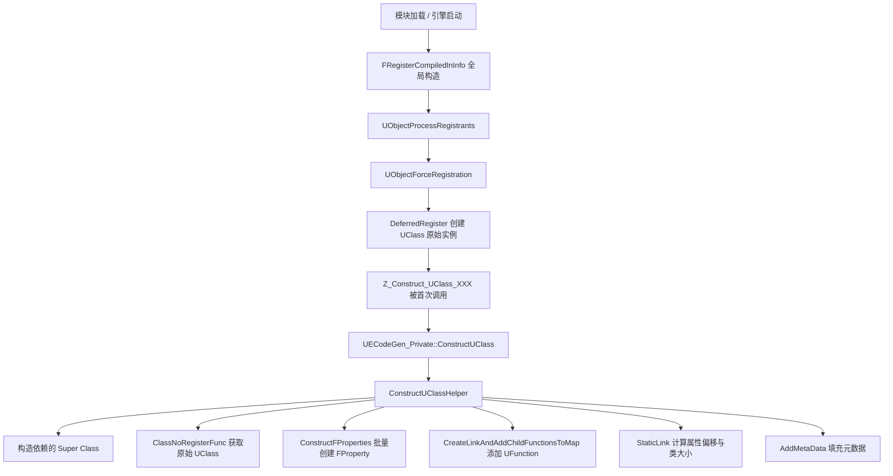

> [← 返回 UE全解析主索引]([[00-UE全解析主索引|UE全解析主索引]])

# UE-CoreUObject-源码解析：反射系统与 UHT

## Why：为什么要理解运行时反射系统？

UHT（Unreal Header Tool）负责在编译期解析 `UCLASS`/`UPROPERTY` 并生成 `.generated.h`/`.gen.cpp`，但**真正让这些反射数据活起来的是 CoreUObject 的运行时反射系统**。`UClass`、`FProperty`、`UFunction` 等元数据对象在引擎启动时被动态构建，形成完整的类型信息图谱，支撑着序列化、网络同步、蓝图交互、编辑器属性面板等几乎所有上层能力。理解运行时反射的构建链路，是从"代码生成"跨越到"元对象运行时"的关键一步。

## What：运行时反射系统是什么？

CoreUObject 的运行时反射系统由两套互补的体系组成：

1. **UObject 反射链**：`UField` → `UStruct` → `UClass`，用于描述类、结构体、枚举、函数的元数据。这些本身是 `UObject`，受 GC 管理。
2. **FField 属性链**：`FField` → `FProperty` → 各具体属性子类，用于描述成员变量和函数参数。这些**不是** `UObject`，是轻量级反射对象，挂载在 `UStruct` 的 `ChildProperties` 链表上。

UHT 生成的 `.gen.cpp` 中包含了大量静态参数结构（如 `FClassParams`、`FPropertyParamsBase`），引擎启动时通过 `UECodeGen_Private::ConstructUClass` 等函数将它们"实例化"为运行时的反射对象。

---

## 模块定位

- **UE 模块路径**：`Engine/Source/Runtime/CoreUObject/`
- **Build.cs 文件**：`CoreUObject.Build.cs`
- **核心依赖**：`Core`、`TraceLog`、`CorePreciseFP`
- **关键目录**：
  - `Public/UObject/` — 运行时反射接口
  - `Private/UObject/` — 反射构造与注册实现

> 文件：`Engine/Source/Runtime/CoreUObject/CoreUObject.Build.cs`，第 26~44 行

```csharp
PublicDependencyModuleNames.AddRange(
    new string[] { "Core", "TraceLog", "CorePreciseFP" }
);
PrivateDependencyModuleNames.AddRange(
    new string[] { "AutoRTFM", "Projects", "Json" }
);
```

---

## 接口梳理（第 1 层）

### 核心头文件一览

| 头文件 | 核心类/结构 | 职责 |
|--------|------------|------|
| `Class.h` | `UField`、`UStruct`、`UClass`、`UFunction` | UObject 反射链核心定义 |
| `Field.h` | `FField`、`FFieldClass`、`FFieldVariant` | 新属性系统基类 |
| `UnrealType.h` | `FProperty` 及全部子类 | 属性类型体系（运行时实际使用） |
| `UnrealTypePrivate.h` | `UProperty` 及旧子类 | 兼容旧代码的属性体系 |
| `ObjectMacros.h` | `UCLASS`、`UFUNCTION`、`UPROPERTY`、`GENERATED_BODY` | 反射宏的原始定义 |
| `UObjectGlobals.h` | `UECodeGen_Private::ConstructUClass` 等 | 代码生成消费接口 |
| `GeneratedCppIncludes.h` | — | UHT 生成 `.gen.cpp` 的聚合头文件 |

### UObject 反射继承链

```
UObject
    └── UField
            ├── UEnum
            └── UStruct (private FStructBaseChain)
                    ├── UScriptStruct
                    ├── UFunction
                    └── UClass
```

> 文件：`Engine/Source/Runtime/CoreUObject/Public/UObject/Class.h`，第 180~210 行

```cpp
class UField : public UObject
{
    GENERATED_BODY()
public:
    typedef UField BaseFieldClass;
    typedef UClass FieldTypeClass;

    /** Next Field in the linked list */
    UPROPERTY(SkipSerialization)
    TObjectPtr<UField> Next;
    // ...
    COREUOBJECT_API virtual void AddCppProperty(FProperty* Property);
    COREUOBJECT_API virtual void Bind();
};
```

`UField` 是整个反射数据对象的基类，核心成员只有一个 `Next` 指针，将所有子字段串成单向链表。

> 文件：`Engine/Source/Runtime/CoreUObject/Public/UObject/Class.h`，第 476~570 行

```cpp
class UStruct : public UField
#if CPP
    , private FStructBaseChain
#endif
{
    GENERATED_BODY()
private:
    UPROPERTY(SkipSerialization)
    TObjectPtr<UStruct> SuperStruct;

public:
    UPROPERTY(SkipSerialization)
    TObjectPtr<UField> Children;
    FField* ChildProperties;

    int32 PropertiesSize;
    int16 MinAlignment;

    /** In memory only: Linked list of properties */
    FProperty* PropertyLink;
    FProperty* RefLink;
    FProperty* DestructorLink;
    FProperty* PostConstructLink;
    // ...
};
```

`UStruct` 同时维护了两套子字段系统：
- `Children`（`UField*`）：旧的 UObject 属性链表，也包含 `UFunction`
- `ChildProperties`（`FField*`）：新的轻量级属性链表，运行时遍历属性主要走这里

> 文件：`Engine/Source/Runtime/CoreUObject/Public/UObject/Class.h`，第 3792~3899 行

```cpp
class UClass : public UStruct
{
    GENERATED_BODY()
public:
    typedef void (*ClassConstructorType)(const FObjectInitializer&);
    typedef UObject* (*ClassVTableHelperCtorCallerType)(FVTableHelper& Helper);
    typedef UClass* (*StaticClassFunctionType)();

    ClassConstructorType ClassConstructor;
    ClassVTableHelperCtorCallerType ClassVTableHelperCtorCaller;
    FUObjectCppClassStaticFunctions CppClassStaticFunctions;

    EClassFlags ClassFlags;
    EClassCastFlags ClassCastFlags;

    UPROPERTY(SkipSerialization)
    TObjectPtr<UClass> ClassWithin;
    // ...
};
```

`UClass` 的关键成员包括：
- `ClassConstructor`：指向 C++ 类构造器的函数指针，`StaticConstructObject_Internal` 最终调用它
- `ClassCastFlags`：用于加速 `IsA` / `Cast` 判断的位标志
- `ClassFlags`：如 `CLASS_Abstract`、`CLASS_Native`、`CLASS_Constructed`

### FField 新属性系统链

```
FField
    └── FProperty
            ├── FNumericProperty
            │       ├── FByteProperty、FIntProperty、FInt64Property...
            ├── FBoolProperty
            ├── FObjectPropertyBase
            │       ├── FObjectProperty、FWeakObjectProperty、FSoftObjectProperty...
            ├── FStructProperty
            ├── FArrayProperty
            ├── FMapProperty
            ├── FSetProperty
            ├── FDelegateProperty / FMulticastDelegateProperty
            └── ...
```

> 文件：`Engine/Source/Runtime/CoreUObject/Public/UObject/Field.h`，第 555~620 行

```cpp
class FField
{
    UE_NONCOPYABLE(FField);
    union
    {
        FFieldClass* ClassPrivate;
        const UTF8CHAR* NameTempUTF8; // 编译期 constinit 用
    };

public:
    FFieldClass* ClassPrivate; // 运行时类型
    FFieldVariant Owner;
    FField* Next;
    FName NamePrivate;
    EObjectFlags FlagsPrivate;
};
```

> 文件：`Engine/Source/Runtime/CoreUObject/Public/UObject/UnrealType.h`，第 173~230 行

```cpp
class FProperty : public FField
{
    DECLARE_FIELD_API(FProperty, FField, CASTCLASS_FProperty, UE_API)

    int32 ArrayDim;
    EPropertyFlags PropertyFlags;
    uint16 RepIndex;
    int32 Offset_Internal;

    FProperty* PropertyLinkNext = nullptr;
    FProperty* NextRef = nullptr;
    FProperty* DestructorLinkNext = nullptr;
    FProperty* PostConstructLinkNext = nullptr;
    // ...
};
```

`FProperty` 是运行时属性访问的真正入口。`Offset_Internal` 是成员变量在对象内存中的偏移，`ArrayDim` 是静态数组维度，`PropertyFlags` 控制序列化、网络复制、蓝图可见性等行为。

### 反射宏原始定义

> 文件：`Engine/Source/Runtime/CoreUObject/Public/UObject/ObjectMacros.h`，第 764~780 行

```cpp
// 对 C++ 编译器是空定义，仅供 UHT 解析
#define UPROPERTY(...)
#define UFUNCTION(...)
#define USTRUCT(...)
#define UENUM(...)

// 代码行拼接宏，引入 UHT 生成的代码块
#define BODY_MACRO_COMBINE_INNER(A,B,C,D) A##B##C##D
#define BODY_MACRO_COMBINE(A,B,C,D) BODY_MACRO_COMBINE_INNER(A,B,C,D)

#define GENERATED_BODY(...)        BODY_MACRO_COMBINE(CURRENT_FILE_ID,_,__LINE__,_GENERATED_BODY);
#define GENERATED_BODY_LEGACY(...) BODY_MACRO_COMBINE(CURRENT_FILE_ID,_,__LINE__,_GENERATED_BODY_LEGACY);
#define UCLASS(...) BODY_MACRO_COMBINE(CURRENT_FILE_ID,_,__LINE__,_PROLOG)
```

`UCLASS(...)` 在预处理阶段会被替换为 `CURRENT_FILE_ID_xx_PROLOG`，这个宏的定义在 `.generated.h` 中由 UHT 提供，负责注入 `StaticClass()`、`DECLARE_CLASS2` 等代码。

---

## 数据结构（第 2 层）

### UClass 运行时构建参数：FClassParams

UHT 生成的 `.gen.cpp` 不会直接 `new UClass()`，而是生成一个静态的 `FClassParams` 结构体，交给 `UECodeGen_Private::ConstructUClass` 统一构造。

> 文件：`Engine/Source/Runtime/CoreUObject/Public/UObject/UObjectGlobals.h`，第 4151~4185 行

```cpp
namespace UECodeGen_Private
{
    struct FClassParams
    {
        UClass* (*ClassNoRegisterFunc)();
        const char* ClassConfigNameUTF8;
        const FCppClassTypeInfoStatic* CppClassInfo;
        UObject* (*const *DependencySingletonFuncArray)();
        const FClassFunctionLinkInfo* FunctionLinkArray;
        const FPropertyParamsBase* const* PropertyArray;
        const FImplementedInterfaceParams* ImplementedInterfaceArray;
        uint32 NumDependencySingletons : 4;
        uint32 NumFunctions : 11;
        uint32 NumProperties : 11;
        uint32 NumImplementedInterfaces : 6;
        uint32 ClassFlags;
#if WITH_METADATA
        uint16 NumMetaData;
        const FMetaDataPairParam* MetaDataArray;
#endif
    };

    COREUOBJECT_API void ConstructUClass(UClass*& OutClass, const FClassParams& Params);
}
```

### FProperty 运行时构建参数：FPropertyParamsBase

> 文件：`Engine/Source/Runtime/CoreUObject/Public/UObject/UObjectGlobals.h`，第 3676~3728 行

```cpp
namespace UECodeGen_Private
{
    struct FPropertyParamsBase
    {
        const char*       NameUTF8;
        const char*       RepNotifyFuncUTF8;
        EPropertyFlags    PropertyFlags;
        EPropertyGenFlags Flags;
        EObjectFlags      ObjectFlags;
        SetterFuncPtr     SetterFunc;
        GetterFuncPtr     GetterFunc;
        uint16            ArrayDim;
    };

    struct FGenericPropertyParams // : FPropertyParamsBaseWithOffset
    {
        const char*       NameUTF8;
        const char*       RepNotifyFuncUTF8;
        EPropertyFlags    PropertyFlags;
        EPropertyGenFlags Flags;
        EObjectFlags      ObjectFlags;
        SetterFuncPtr     SetterFunc;
        GetterFuncPtr     GetterFunc;
        uint16            ArrayDim;
        uint16            Offset;
#if WITH_METADATA
        uint16                     NumMetaData;
        const FMetaDataPairParam*  MetaDataArray;
#endif
    };
}
```

每个 `UPROPERTY` 都会生成一个对应的参数结构体（如 `FIntPropertyParams`、`FObjectPropertyParams`），最终通过 `ConstructFProperties` 批量转换为运行时的 `FProperty` 实例。

### UFunction 的反射表示

> 文件：`Engine/Source/Runtime/CoreUObject/Public/UObject/Class.h`，第 2475~2534 行

```cpp
class UFunction : public UStruct
{
    GENERATED_BODY()
public:
    EFunctionFlags FunctionFlags;
    uint8 NumParms;
    uint16 ParmsSize;
    uint16 ReturnValueOffset;
    uint16 RPCId;
    uint16 RPCResponseId;
    FProperty* FirstPropertyToInit;
    // ...
private:
    FNativeFuncPtr Func; // C++ 函数指针
public:
    UE_FORCEINLINE_HINT FNativeFuncPtr GetNativeFunc() const { return Func; }
    UE_FORCEINLINE_HINT void SetNativeFunc(FNativeFuncPtr InFunc) { Func = InFunc; }
};
```

`UFunction` 继承自 `UStruct`，因此它的参数和局部变量也以 `FProperty` 的形式挂在 `ChildProperties` 上。`Func` 成员存储了 C++ Native 函数的指针，供 `ProcessEvent` / `Invoke` 调用。

---

## 行为分析（第 3 层）

### 运行时反射构建总链路

从 UHT 生成的代码到运行时 `UClass` 可用的完整链路如下：



### ConstructUClassHelper：UClass 的装配工厂

> 文件：`Engine/Source/Runtime/CoreUObject/Private/UObject/UObjectConstructInternal.h`，第 196~265 行

```cpp
template<typename UClassClass, typename ClassParams, typename PostNewFn>
void ConstructUClassHelper(UClass*& OutClass, const ClassParams& Params, PostNewFn&& InPostNewFn)
{
    if (OutClass && (OutClass->ClassFlags & CLASS_Constructed))
    {
        return; // 已构造，幂等
    }

    // 1. 先构造所有依赖的 Singleton（如 SuperClass、InterfaceClass）
    for (UObject* (* const* SingletonFunc)() = Params.DependencySingletonFuncArray, ...)
    {
        (*SingletonFunc)();
    }

    // 2. 获取原始 UClass 实例（由 DeferredRegister 预先创建）
    UClass* NewClass = Params.ClassNoRegisterFunc();
    OutClass = NewClass;

    if (NewClass->ClassFlags & CLASS_Constructed)
    {
        return;
    }

    // 3. 子类自定义后处理（如 VerseClass）
    InPostNewFn(Cast<UClassClass>(NewClass), Params);

    // 4. 强制注册到 GUObjectArray
    UObjectForceRegistration(NewClass);

    // 5. 继承父类的 Inherit 标志
    UClass* SuperClass = NewClass->GetSuperClass();
    if (SuperClass)
    {
        NewClass->ClassFlags |= (SuperClass->ClassFlags & CLASS_Inherit);
    }

    // 6. 设置构造完成标志
    NewClass->ClassFlags |= (EClassFlags)(Params.ClassFlags | CLASS_Constructed);

    // 7. 添加函数链接
    NewClass->CreateLinkAndAddChildFunctionsToMap(Params.FunctionLinkArray, Params.NumFunctions);

    // 8. 批量构造属性
    ConstructFProperties(NewClass, Params.PropertyArray, Params.NumProperties);

    // 9. 设置 Config Name
    if (Params.ClassConfigNameUTF8)
    {
        NewClass->ClassConfigName = FName(UTF8_TO_TCHAR(Params.ClassConfigNameUTF8));
    }

    // 10. 设置 C++ 类型信息
    NewClass->SetCppTypeInfoStatic(Params.CppClassInfo);

    // 11. 添加实现的接口
    if (int32 NumImplementedInterfaces = Params.NumImplementedInterfaces)
    {
        NewClass->Interfaces.Reserve(NumImplementedInterfaces);
        for (...) { ... }
    }

    // 12. 添加元数据
#if WITH_METADATA
    AddMetaData(NewClass, Params.MetaDataArray, Params.NumMetaData);
#endif

    // 13. 链接属性偏移、计算类大小
    NewClass->StaticLink();

    // 14. 设置稀疏类数据
    NewClass->SetSparseClassDataStruct(NewClass->GetSparseClassDataArchetypeStruct());
}
```

`ConstructUClassHelper` 是运行时反射对象的**总装配线**。它的输入是一堆静态参数，输出是一个完全可用的 `UClass` 实例。注意它的**幂等性**：通过 `CLASS_Constructed` 标志确保多次调用不会重复构造。

### ConstructFProperties：从参数到 FProperty 实例

> 文件：`Engine/Source/Runtime/CoreUObject/Private/UObject/UObjectGlobals.cpp`，第 6305~6610 行（节选）

```cpp
void ConstructFProperty(FFieldVariant Outer, const FPropertyParamsBase* const*& PropertyArray, int32& NumProperties)
{
    const FPropertyParamsBase* PropBase = *--PropertyArray;
    uint32 ReadMore = 0;
    FProperty* NewProp = nullptr;

    switch (PropBase->Flags & PropertyTypeMask)
    {
        case EPropertyGenFlags::Byte:
            NewProp = NewFProperty<FByteProperty, FBytePropertyParams>(Outer, *PropBase);
            break;
        case EPropertyGenFlags::Int:
            NewProp = NewFProperty<FIntProperty, FIntPropertyParams>(Outer, *PropBase);
            break;
        case EPropertyGenFlags::Object:
            NewProp = NewFProperty<FObjectProperty, FObjectPropertyParams>(Outer, *PropBase);
            if (EnumHasAllFlags(PropBase->Flags, EPropertyGenFlags::ObjectPtr))
            {
                NewProp->SetPropertyFlags(CPF_TObjectPtrWrapper);
            }
            break;
        case EPropertyGenFlags::Struct:
            NewProp = NewFProperty<FStructProperty, FStructPropertyParams>(Outer, *PropBase);
            break;
        case EPropertyGenFlags::Array:
            NewProp = NewFProperty<FArrayProperty, FArrayPropertyParams>(Outer, *PropBase);
            ReadMore = 1; // 下一个参数是 Inner 元素类型
            break;
        case EPropertyGenFlags::Map:
            NewProp = NewFProperty<FMapProperty, FMapPropertyParams>(Outer, *PropBase);
            ReadMore = 2; // 下两个参数是 Key 和 Value 类型
            break;
        // ... 更多类型分支
    }

    // 递归处理容器类型的内部属性
    for (uint32 i = 0; i < ReadMore; ++i)
    {
        ConstructFProperty(NewProp, PropertyArray, NumProperties);
    }
}
```

`ConstructFProperty` 的核心是一个巨大的 `switch`，根据 `EPropertyGenFlags` 分发到对应的 `FProperty` 子类构造器。对于 `TArray`、`TMap`、`TSet` 这类容器属性，采用**递归构造**的方式先创建容器属性本身，再构造其内部的元素属性，并将 `Outer` 设为容器属性自身。

### StaticLink：计算内存布局

> 文件：`Engine/Source/Runtime/CoreUObject/Private/UObject/Class.cpp`，第 744~748 行

```cpp
void UStruct::StaticLink(bool bRelinkExistingProperties)
{
    FNullArchive ArDummy;
    Link(ArDummy, bRelinkExistingProperties);
}
```

> 文件：`Engine/Source/Runtime/CoreUObject/Private/UObject/Class.cpp`，第 875~935 行（节选）

```cpp
void UStruct::Link(FArchive& Ar, bool bRelinkExistingProperties)
{
    // ...
    PropertiesSize = 0;
    MinAlignment = 1;

    if (InheritanceSuper)
    {
        PropertiesSize = InheritanceSuper->GetPropertiesSize();
        MinAlignment = IntCastChecked<int16>(InheritanceSuper->GetMinAlignment());
    }

    for (FField* Field = ChildProperties; Field; Field = Field->Next)
    {
        if (FProperty* Property = CastField<FProperty>(Field))
        {
            // 计算属性在对象内存中的偏移
            Property->Link(Ar);
            
            // 对齐
            PropertiesSize = Align(PropertiesSize, Property->GetMinAlignment());
            
            // 设置偏移
            Property->SetOffset_Internal(PropertiesSize);
            
            // 累加大小
            PropertiesSize += Property->GetSize();
            
            // 更新全局对齐要求
            MinAlignment = FMath::Max(MinAlignment, Property->GetMinAlignment());
            
            // 挂到各种专用链表上
            PropertyLinkNext = Property;
            NextRef = ...;
            DestructorLinkNext = ...;
        }
    }
    
    // 最终对齐
    PropertiesSize = Align(PropertiesSize, GetMinAlignment());
}
```

`Link()` 是运行时反射的**内存布局阶段**。它遍历 `ChildProperties` 链表，为每个 `FProperty` 计算 `Offset_Internal`，并更新 `UStruct::PropertiesSize`（类总大小）和 `MinAlignment`（最小对齐要求）。这些值后续会被 `StaticAllocateObject` 用于分配对象内存。

### 编译期注册到运行时的触发链路

UHT 生成的 `init.gen.cpp` 中包含类似这样的代码：

```cpp
static FRegisterCompiledInInfo Z_CompiledInDeferPackage_UPackage_CoreUObject(
    Z_Construct_UPackage_CoreUObject, TEXT("CoreUObject"), ...);
```

`FRegisterCompiledInInfo` 是一个全局静态对象，它的构造函数在 `main()` 之前执行，将 `Z_Construct_UPackage_CoreUObject` 注册到一个全局待处理队列中。

> 文件：`Engine/Source/Runtime/CoreUObject/Private/UObject/UObjectBase.cpp`，第 614~634 行

```cpp
void UObjectProcessRegistrants()
{
    SCOPED_BOOT_TIMING("UObjectProcessRegistrants");
    check(UObjectInitialized());

    TArray<FPendingRegistrant> PendingRegistrants;
    DequeuePendingAutoRegistrants(PendingRegistrants);

    for (int32 RegistrantIndex = 0; RegistrantIndex < PendingRegistrants.Num(); ++RegistrantIndex)
    {
        const FPendingRegistrant& PendingRegistrant = PendingRegistrants[RegistrantIndex];
        UObjectForceRegistration(PendingRegistrant.Object, false);
        check(PendingRegistrant.Object->GetClass());
        DequeuePendingAutoRegistrants(PendingRegistrants);
    }
}
```

> 文件：`Engine/Source/Runtime/CoreUObject/Private/UObject/UObjectBase.cpp`，第 636~664 行

```cpp
void UObjectForceRegistration(UObjectBase* Object, bool bCheckForModuleRelease)
{
    TMap<UObjectBase*, FPendingRegistrantInfo>& PendingRegistrants = FPendingRegistrantInfo::GetMap();
    FPendingRegistrantInfo* Info = PendingRegistrants.Find(Object);
    if (Info)
    {
        const TCHAR* PackageName = Info->PackageName;
        const TCHAR* Name = Info->Name;
        UClass* StaticClass = Info->StaticClassFn();
        PendingRegistrants.Remove(Object);
        Object->DeferredRegister(StaticClass, PackageName, Name);
    }
}
```

`DeferredRegister` 会为该对象创建一个最基础的 `UObjectBase` 注册信息（分配 `InternalIndex`、加入 `GUObjectArray`、加入名称哈希表），但**不初始化反射元数据**。真正的 `UClass`/`UProperty`/`UFunction` 构建要等到第一次有人调用 `MyClass::StaticClass()` 时，才会触发 `Z_Construct_UClass_MyClass()` → `ConstructUClassHelper()` 完成完整的反射装配。

---

## 与上下层的关系

### 上层调用者

- **Engine 模块**：`AActor::StaticClass()`、`UWorld::StaticClass()` 等几乎所有 gameplay 代码在首次访问类信息时触发 `Z_Construct_UClass`
- **蓝图 VM**：`UFunction::Invoke`、`ProcessEvent` 依赖 `UFunction` 和 `FProperty` 的参数布局信息
- **编辑器**：属性面板（Details Panel）通过 `TFieldIterator<FProperty>` 遍历类的 `ChildProperties` 来绘制 UI
- **序列化**：`FArchive` 通过 `UClass` 的 `PropertyLink` 遍历属性进行 Load/Save

### 下层依赖

- **UHT（Programs/Shared/EpicGames.UHT）**：生成 `.gen.cpp` 中的 `FClassParams`、`FPropertyParamsBase` 等静态数据
- **Core 模块**：提供 `FMemory`、`FName`、原子操作、对齐宏 `Align()` 等基础设施
- **模块加载器**：`FRegisterCompiledInInfo` 依赖模块加载时全局静态对象的初始化顺序

---

## 设计亮点与可迁移经验

1. **双轨制属性系统：UProperty vs FProperty**
   UE 在 4.25 左右将属性系统从 `UProperty`（GC 对象）迁移到 `FProperty`（轻量非 GC 对象），显著降低了反射元数据的开销。`UStruct` 同时保留 `Children`（旧）和 `ChildProperties`（新）是为了兼容编辑器/热重载。对于需要大量元数据的游戏引擎，将反射字段与 GC 生命周期解耦是值得借鉴的优化方向。

2. **延迟构造 + 幂等装配**
   `ConstructUClassHelper` 不是一次性在启动时构造所有类，而是**按需延迟构造**（第一次调用 `StaticClass()` 时），并通过 `CLASS_Constructed` 标志保证幂等。这种设计让引擎启动时不需要遍历和初始化所有模块的反射数据，显著缩短了冷启动时间。

3. **静态参数表 + 统一工厂函数**
   UHT 只生成纯静态数据结构（`FClassParams`、`FPropertyParamsBase`），运行时通过 `ConstructUClass` / `ConstructFProperty` 统一工厂实例化。这种"数据驱动"的构建方式让运行时与代码生成器解耦：只要参数格式稳定，UHT 的实现细节可以随意演进。

4. **容器属性的递归构造**
   `TArray<T>`、`TMap<K,V>` 的反射表示采用树形结构：`FArrayProperty` 包含一个 `Inner` 指针指向 `FProperty`。`ConstructFProperty` 通过 `ReadMore` 计数器递归处理子属性，这是一种优雅的数据结构嵌套表达。

5. **Link 阶段统一计算内存布局**
   所有 `FProperty` 的偏移在 `Link()` 阶段统一计算，而不是在 UHT 生成时硬编码。这使得运行时可以根据不同平台的对齐规则动态调整布局，同时也支持蓝图编译后的类重链接（`bRelinkExistingProperties`）。

---

## 关键源码片段

### FField 核心成员

> 文件：`Engine/Source/Runtime/CoreUObject/Public/UObject/Field.h`，第 555~600 行

```cpp
class FField
{
    union
    {
        FFieldClass* ClassPrivate;
        const UTF8CHAR* NameTempUTF8;
    };
public:
    FFieldClass* ClassPrivate;
    FFieldVariant Owner;
    FField* Next;
    FName NamePrivate;
    EObjectFlags FlagsPrivate;
};
```

### ConstructUClass 入口

> 文件：`Engine/Source/Runtime/CoreUObject/Private/UObject/UObjectGlobals.cpp`，第 6682~6685 行

```cpp
void ConstructUClass(UClass*& OutClass, const FClassParams& Params)
{
    ConstructUClassHelper<UClass>(OutClass, Params, [](UClass*, const FClassParams&) {});
}
```

### ConstructFProperty Switch 分发

> 文件：`Engine/Source/Runtime/CoreUObject/Private/UObject/UObjectGlobals.cpp`，第 6305~6500 行（节选）

```cpp
void ConstructFProperty(FFieldVariant Outer, const FPropertyParamsBase* const*& PropertyArray, int32& NumProperties)
{
    const FPropertyParamsBase* PropBase = *--PropertyArray;
    uint32 ReadMore = 0;
    FProperty* NewProp = nullptr;

    switch (PropBase->Flags & PropertyTypeMask)
    {
        case EPropertyGenFlags::Int:
            NewProp = NewFProperty<FIntProperty, FIntPropertyParams>(Outer, *PropBase);
            break;
        case EPropertyGenFlags::Object:
            NewProp = NewFProperty<FObjectProperty, FObjectPropertyParams>(Outer, *PropBase);
            break;
        case EPropertyGenFlags::Array:
            NewProp = NewFProperty<FArrayProperty, FArrayPropertyParams>(Outer, *PropBase);
            ReadMore = 1;
            break;
        // ...
    }

    for (uint32 i = 0; i < ReadMore; ++i)
    {
        ConstructFProperty(NewProp, PropertyArray, NumProperties);
    }
}
```

---

## 关联阅读

- [[UE-构建系统-源码解析：UHT 反射代码生成]] — UHT 如何解析头文件、生成 `.gen.cpp` 和 `.generated.h`
- [[UE-CoreUObject-源码解析：UObject 体系总览]] — `UObjectBase`、`GUObjectArray`、生命周期管理
- [[UE-CoreUObject-源码解析：GC 与对象生命周期]] — 反射对象的 GC 可达性分析
- [[UE-CoreUObject-源码解析：Package 与加载]] — `UPackage`、`FLinkerLoad` 与对象加载时序
- [[UE-专题：反射与代码生成]] — 从 UHT 到 UClass 的端到端专题梳理

---

## 索引状态

- **所属 UE 阶段**：第三阶段 — 核心层 / 3.1 UObject 与组件/场景系统
- **对应 UE 笔记**：`UE-CoreUObject-源码解析：反射系统与 UHT`
- **本轮完成度**：✅ 三层分析已完成（接口层 + 数据层 + 逻辑层）
- **更新日期**：2026-04-17
