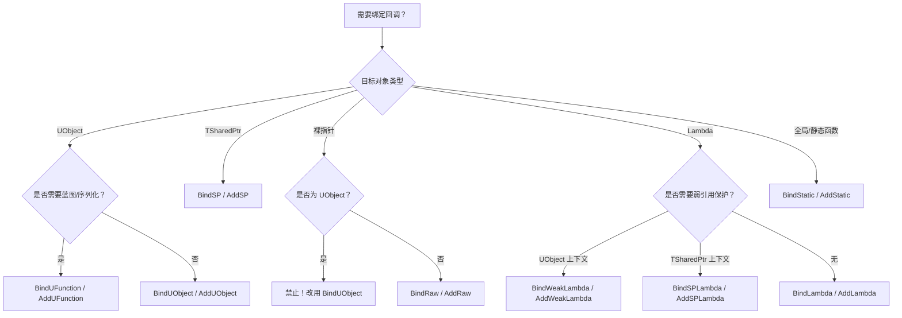

> [[00-UE全解析主索引|← 返回 UE全解析主索引]]

## Why：为什么要学习 UE 委托与事件系统？

在游戏引擎中，**解耦**是架构设计的核心目标之一。UE 的委托（Delegate）与事件系统提供了比传统函数指针更类型安全、更灵活的回调机制，它支撑着引擎从底层到上层的几乎所有异步与通知需求：

- **Core 层**：Timer、TaskGraph、异步 IO 的回调绑定。
- **Engine 层**：`UWorld` 生命周期事件（`OnWorldTickStart`、`OnPostWorldInitialization`）、`AGameModeBase` 游戏规则事件（`OnGameModeInitializedEvent`）。
- **UI 层**：Slate 的交互响应与 UMG 的蓝图书签事件（`FOnButtonClickedEvent`）。
- **反射层**：UHT 生成的动态委托支持蓝图序列化与网络复制。

不理解委托系统，就无法真正理解 UE 的**事件驱动架构**、**弱引用安全模型**以及**蓝图与 C++ 的交互边界**。本篇从 Core 的模板元编程基础设施出发，穿透到 Engine 层的全局事件应用，完整还原 UE 委托体系的三层源码结构。

## What：UE 委托与事件系统是什么？

UE 的委托系统是一个**类型安全的 C++ 回调框架**，它通过宏声明 + 模板实例化的方式，将不同生命周期的对象绑定方式（Raw、SP、UObject、Lambda、UFunction）统一封装为可执行单元。系统包含四大核心类型：

| 类型 | 宏声明 | 调用方式 | 特性 |
|------|--------|----------|------|
| 单播委托 | `DECLARE_DELEGATE*` | `Execute` / `ExecuteIfBound` | 只绑定一个回调，支持返回值 |
| 多播委托 | `DECLARE_MULTICAST_DELEGATE*` | `Broadcast` | 绑定多个回调，无返回值 |
| 线程安全多播 | `DECLARE_TS_MULTICAST_DELEGATE*` | `Broadcast` | 使用 `FThreadSafeDelegateMode` |
| 动态委托 | `DECLARE_DYNAMIC[_MULTICAST]_DELEGATE*` | `Execute` / `Broadcast` | 支持 UObject 反射、序列化、蓝图 |
| 事件 | `DECLARE_EVENT*` | `Broadcast` | 语义上限制仅由 OwningType 触发（已弃用） |

> [!note]
> 从 UE 5.x 开始，`DECLARE_EVENT` 已被标记为 deprecated 语义，官方建议直接使用 `DECLARE_MULTICAST_DELEGATE` 代替。

### 接口层：DECLARE_* 宏与公共模板

所有委托类型都通过 `DelegateCombinations.h` 中的宏进行声明，这些宏最终收敛到 `Delegate.h` 中的底层宏：

```cpp
// Runtime/Core/Public/Delegates/DelegateCombinations.h ~L20
#define DECLARE_DELEGATE( DelegateName ) FUNC_DECLARE_DELEGATE( DelegateName, void )

// Runtime/Core/Public/Delegates/DelegateCombinations.h ~L23
#define DECLARE_MULTICAST_DELEGATE( DelegateName ) FUNC_DECLARE_MULTICAST_DELEGATE( DelegateName, void )

// Runtime/Core/Public/Delegates/DelegateCombinations.h ~L26
#define DECLARE_TS_MULTICAST_DELEGATE( DelegateDelegateName ) FUNC_DECLARE_TS_MULTICAST_DELEGATE( DelegateName, void )

// Runtime/Core/Public/Delegates/DelegateCombinations.h ~L38
#define DECLARE_DYNAMIC_MULTICAST_DELEGATE( DelegateName ) \
    BODY_MACRO_COMBINE(...) FUNC_DECLARE_DYNAMIC_MULTICAST_DELEGATE( DelegateName, ... )
```

底层宏在 `Delegate.h` 中将类型名映射为模板别名：

```cpp
// Runtime/Core/Public/Delegates/Delegate.h ~L208
#define FUNC_DECLARE_DELEGATE( DelegateName, ReturnType, ... ) \
    typedef TDelegate<ReturnType(__VA_ARGS__)> DelegateName;

// Runtime/Core/Public/Delegates/Delegate.h ~L212
#define FUNC_DECLARE_MULTICAST_DELEGATE( MulticastDelegateName, ReturnType, ... ) \
    typedef TMulticastDelegate<ReturnType(__VA_ARGS__)> MulticastDelegateName;

// Runtime/Core/Public/Delegates/Delegate.h ~L216
#define FUNC_DECLARE_TS_MULTICAST_DELEGATE( MulticastDelegateName, ReturnType, ... ) \
    typedef TMulticastDelegate<ReturnType(__VA_ARGS__), FDefaultTSDelegateUserPolicy> MulticastDelegateName;
```

真正暴露给用户可绑定的 API 位于 `DelegateSignatureImpl.inl` 中的 `TDelegateRegistration` 和 `TMulticastDelegateRegistration`：

```cpp
// Runtime/Core/Public/Delegates/DelegateSignatureImpl.inl ~L66
class TDelegateRegistration<InRetValType(ParamTypes...), UserPolicy> : public UserPolicy::FDelegateExtras
{
    // 提供 BindStatic / BindLambda / BindSP / BindUObject 等接口
    // 但删除 Execute / ExecuteIfBound，实现 C# event 式的权限控制
};

// Runtime/Core/Public/Delegates/DelegateSignatureImpl.inl ~L724
class TMulticastDelegateRegistration<void(ParamTypes...), UserPolicy> : public UserPolicy::FMulticastDelegateExtras
{
    // 提供 Add / AddLambda / AddSP / AddUObject 等接口
    // 但删除 Broadcast，实现只注册不广播
};
```

`TDelegate` 和 `TMulticastDelegate` 则分别继承自上述 Registration 类，补全了执行权限：

```cpp
// Runtime/Core/Public/Delegates/DelegateSignatureImpl.inl ~L314
class TDelegate<InRetValType(ParamTypes...), UserPolicy> : public TDelegateRegistration<...>
{
    // 提供 Execute / ExecuteIfBound
};

// Runtime/Core/Public/Delegates/DelegateSignatureImpl.inl ~L1000+
class TMulticastDelegate<void(ParamTypes...), UserPolicy> : public TMulticastDelegateRegistration<...>
{
    // 提供 Broadcast
};
```

### 数据层：委托实例体系与内存布局

#### 委托实例基类

`TDelegateBase` 是单播委托的底层存储，它通过 `FDelegateAllocation` 管理内存：

```cpp
// Runtime/Core/Public/Delegates/DelegateBase.h ~L191
struct FDelegateAllocation
{
    FDelegateAllocatorType::ForElementType<FAlignedInlineDelegateType> DelegateAllocator;
    int32 DelegateSize = 0;
};

// Runtime/Core/Public/Delegates/DelegateBase.h ~L224
class TDelegateBase : public TDelegateAccessHandlerBase<ThreadSafetyMode>, private FDelegateAllocation
{
    // GetDelegateInstanceProtected() 返回 IDelegateInstance*
    // UnbindUnchecked() 调用析构并释放内存
};
```

默认情况下，在 Win64 上 `FAlignedInlineDelegateType` 是 16 字节对齐的 16 字节内联缓冲区，而 `FDelegateAllocatorType` 根据 `NUM_DELEGATE_INLINE_BYTES` 决定使用 `TInlineAllocator` 还是 `FHeapAllocator`（`DelegateBase.h ~L14-L28`）。

#### 绑定类型的内存布局

Core 在 `DelegateInstancesImpl.h` 中为每种绑定方式定义了专门的实例模板：

| 绑定方式 | 实例类 | 核心成员 | 安全模型 |
|---------|--------|----------|----------|
| `BindStatic` | `TBaseStaticDelegateInstance` | `FFuncPtr StaticFuncPtr` | 永远安全 |
| `BindRaw` | `TBaseRawMethodDelegateInstance` | `UserClass* UserObject`, `FMethodPtr MethodPtr` | 无安全检查，用户负责生命周期 |
| `BindSP` | `TBaseSPMethodDelegateInstance` | `TWeakPtr<UserClass, SPMode> UserObject`, `FMethodPtr MethodPtr` | 弱引用检查 |
| `BindUObject` | `TBaseUObjectMethodDelegateInstance` | `TWeakObjectPtr<UserClass> UserObject`, `FMethodPtr MethodPtr` | 弱引用检查 |
| `BindUFunction` | `TBaseUFunctionDelegateInstance` | `TWeakObjectPtr<UserClass> UserObjectPtr`, `FName FunctionName`, `UFunction* CachedFunction` | 弱引用检查 |
| `BindLambda` | `TBaseFunctorDelegateInstance` | `FunctorType Functor` | 永远安全（但捕获需用户负责） |
| `BindWeakLambda` | `TWeakBaseFunctorDelegateInstance` | `TWeakObjectPtr<const UObject> ContextObject`, `FunctorType Functor` | UObject 弱引用检查 |
| `BindSPLambda` | `TBaseSPLambdaDelegateInstance` | `TWeakPtr<const void, SPMode> ContextObject`, `FunctorType Functor` | TWeakPtr 弱引用检查 |

> [!warning]
> `BindRaw` 明确禁止用于 UObject（`DelegateInstancesImpl.h ~L451` 有 `static_assert(!UE::Delegates::Private::IsUObjectPtr(...))`），因为 UObject 可能被 GC 回收，必须使用 `BindUObject` 或 `BindUFunction`。

所有实例类都继承自 `TCommonDelegateInstanceState`，它统一持有 **Payload**（绑定参数）和 **FDelegateHandle**（唯一句柄）：

```cpp
// Runtime/Core/Public/Delegates/DelegateInstancesImpl.h ~L43
class TCommonDelegateInstanceState : protected IBaseDelegateInstance<FuncType, UserPolicy>
{
    TTuple<VarTypes...> Payload;
    FDelegateHandle Handle;
};
```

#### 弱引用安全模型

以 `TBaseUObjectMethodDelegateInstance` 为例，它在 `IsSafeToExecute()` 和 `IsCompactable()` 中检查 `TWeakObjectPtr` 的有效性：

```cpp
// Runtime/Core/Public/Delegates/DelegateInstancesImpl.h ~L658
bool IsSafeToExecute() const final
{
    return !!UserObject.Get();
}

// Runtime/Core/Public/Delegates/DelegateInstancesImpl.h ~L649
bool IsCompactable() const final
{
    return !UserObject.Get(true);  // true 表示允许 unreachable
}
```

`TBaseSPMethodDelegateInstance` 同样通过 `TWeakPtr::IsValid()` 在 `ExecuteIfSafe()` 中决定是否执行（`DelegateInstancesImpl.h ~L311-L331`）。

### 逻辑层：调用链、Compaction 与动态委托序列化

#### 单播执行链

`TDelegate::Execute()` 的逻辑非常直接：获取读锁，通过虚接口调用实例的 `Execute()`：

```cpp
// Runtime/Core/Public/Delegates/DelegateSignatureImpl.inl ~L603
inline RetValType Execute(ParamTypes... Params) const
{
    FReadAccessScope ReadScope = GetReadAccessScope();
    const DelegateInstanceInterfaceType* LocalDelegateInstance = GetDelegateInstanceProtected();
    checkSlow(LocalDelegateInstance != nullptr);
    return LocalDelegateInstance->Execute(Forward<ParamTypes>(Params)...);
}

// Runtime/Core/Public/Delegates/DelegateSignatureImpl.inl ~L623
inline bool ExecuteIfBound(ParamTypes... Params) const requires (std::is_void_v<RetValType>)
{
    FReadAccessScope ReadScope = GetReadAccessScope();
    if (const DelegateInstanceInterfaceType* Ptr = GetDelegateInstanceProtected())
    {
        return Ptr->ExecuteIfSafe(Forward<ParamTypes>(Params)...);
    }
    return false;
}
```

#### 多播 Broadcast 与 Compaction 机制

多播的核心在 `TMulticastDelegateBase::Broadcast()`（`MulticastDelegateBase.h ~L280-L313`）：

```cpp
// Runtime/Core/Public/Delegates/MulticastDelegateBase.h ~L280
template<typename DelegateInstanceInterfaceType, typename... ParamTypes>
void Broadcast(ParamTypes... Params) const
{
    FWriteAccessScope WriteScope = const_cast<TMulticastDelegateBase*>(this)->GetWriteAccessScope();
    bool NeedsCompaction = false;

    LockInvocationList();
    {
        const InvocationListType& LocalInvocationList = GetInvocationList();
        // 逆序遍历，忽略被调用者在广播过程中新增的元素
        for (int32 InvocationListIndex = LocalInvocationList.Num() - 1; InvocationListIndex >= 0; --InvocationListIndex)
        {
            const UnicastDelegateType& DelegateBase = LocalInvocationList[InvocationListIndex];
            const IDelegateInstance* DelegateInstanceInterface = DelegateBase.GetDelegateInstanceProtected();
            if (DelegateInstanceInterface == nullptr || !static_cast<const DelegateInstanceInterfaceType*>(DelegateInstanceInterface)->ExecuteIfSafe(Params...))
            {
                NeedsCompaction = true;
            }
        }
    }
    UnlockInvocationList();

    if (NeedsCompaction)
    {
        const_cast<TMulticastDelegateBase*>(this)->CompactInvocationList();
    }
}
```

这里有两个关键设计：

1. **逆序遍历**：从数组末尾向前遍历，确保在 Broadcast 过程中新 `Add` 的元素不会被本次调用执行，避免无限递归或意外行为。
2. **NeedsCompaction + 延迟清理**：如果某个绑定实例已失效（如 UObject 被 GC）或 `ExecuteIfSafe` 返回 false，不会在遍历中立即删除，而是标记 `NeedsCompaction`，在 Broadcast 结束后统一调用 `CompactInvocationList()` 清理。

`CompactInvocationList()`（`MulticastDelegateBase.h ~L380-L427`）会遍历数组，移除 `nullptr` 或 `IsCompactable()` 的实例，并使用 `RemoveAtSwap` 填充空洞：

```cpp
// Runtime/Core/Public/Delegates/MulticastDelegateBase.h ~L380
void CompactInvocationList(bool CheckThreshold=false)
{
    if (InvocationListLockCount > 0) return;  // 广播中禁止压缩
    // ...
    for (int32 InvocationListIndex = 0; InvocationListIndex < InvocationList.Num();)
    {
        auto& DelegateBaseRef = InvocationList[InvocationListIndex];
        IDelegateInstance* DelegateInstance = DelegateBaseRef.GetDelegateInstanceProtected();
        if (DelegateInstance == nullptr || DelegateInstance->IsCompactable())
        {
            InvocationList.RemoveAtSwap(InvocationListIndex, EAllowShrinking::No);
        }
        else
        {
            InvocationListIndex++;
        }
    }
    CompactionThreshold = FMath::Max(UE_MULTICAST_DELEGATE_DEFAULT_COMPACTION_THRESHOLD, 2 * InvocationList.Num());
}
```

`CompactionThreshold` 是一种**频率控制**：只有当无效槽位累积到一定程度，或者在 `AddDelegateInstance` 时强制检查，才会触发压缩，避免每次 Broadcast 都引起数组抖动（`MulticastDelegateBase.h ~L321-L334`）。

#### 线程安全多播（TS Multicast）

`DECLARE_TS_MULTICAST_DELEGATE` 使用 `FDefaultTSDelegateUserPolicy`，其 `FThreadSafetyMode = FThreadSafeDelegateMode`。`TDelegateAccessHandlerBase` 针对线程安全模式会启用读写锁（或类似的同步原语），使得多线程环境下对委托的 `Add` / `Remove` / `Broadcast` 操作是安全的。

#### 动态委托与序列化

动态委托（`DECLARE_DYNAMIC_DELEGATE` / `DECLARE_DYNAMIC_MULTICAST_DELEGATE`）不直接存储函数指针，而是基于 `TScriptDelegate` / `TMulticastScriptDelegate`，这两个类只保存：

```cpp
// Runtime/Core/Public/UObject/ScriptDelegates.h ~L64
class TScriptDelegate : public TDelegateAccessHandlerBase<...>
{
    WeakPtrType Object;        // FWeakObjectPtr
    FName FunctionName;        // 函数名
};

// Runtime/Core/Public/UObject/ScriptDelegates.h ~L507
class TMulticastScriptDelegate : public TDelegateAccessHandlerBase<...>
{
    TArray<UnicastDelegateType> InvocationList;  // TScriptDelegate 数组
};
```

正因为只存 `(FWeakObjectPtr, FName)`，动态委托可以：
- **被 UHT 识别**并生成蓝图节点；
- **被 FArchive 序列化**到磁盘（`ScriptDelegates.h ~L273-L279` 重载了 `operator<<`）；
- **在网络复制中传输**（配合 `UProperty` 的委托属性类型）。

当执行时，`TScriptDelegate::ProcessDelegate()` 通过 `FindFunctionChecked(FunctionName)` 找到 `UFunction`，再调用 `ProcessEvent()`（`ScriptDelegates.h ~L432-L459`）。这也是动态委托性能低于原生委托的根本原因——每次调用都多了一次反射查找。

## How：如何使用与最佳实践？

### 绑定方式选择决策树



### Engine 层典型应用

#### UWorld 全局事件

`FWorldDelegates` 是 Engine 层使用多播委托的经典范例，它集中定义了 World 生命周期中的所有关键事件：

```cpp
// Runtime/Engine/Classes/Engine/World.h ~L4366
class FWorldDelegates
{
    DECLARE_MULTICAST_DELEGATE_ThreeParams(FOnWorldTickStart, UWorld*, ELevelTick, float);
    static UE_API FOnWorldTickStart OnWorldTickStart;

    DECLARE_TS_MULTICAST_DELEGATE_OneParam(FWorldEvent, UWorld* /*World*/);
    static UE_API FWorldEvent OnPostWorldCreation;

    DECLARE_MULTICAST_DELEGATE_TwoParams(FOnLevelChanged, ULevel*, UWorld*);
    static UE_API FOnLevelChanged LevelAddedToWorld;
};
```

在 `UWorld::Tick()` 中，引擎会在每帧开始时调用：

```cpp
FWorldDelegates::OnWorldTickStart.Broadcast(this, TickType, DeltaSeconds);
```

任何模块（Gameplay、插件、编辑器）都可以订阅这些全局事件，实现极低耦合的横切关注点。

#### GameMode 规则事件

`FGameModeEvents` 则展示了 `DECLARE_EVENT` 的旧用法，它通过 `friend class AGameModeBase` 限制广播权限：

```cpp
// Runtime/Engine/Classes/GameFramework/GameModeBase.h ~L613
class FGameModeEvents
{
    DECLARE_EVENT_OneParam(AGameModeBase, FGameModeInitializedEvent, AGameModeBase* /*GameMode*/);
    static ENGINE_API FGameModeInitializedEvent GameModeInitializedEvent;
};
```

调用时通过访问器获取引用：

```cpp
FGameModeEvents::OnGameModeInitializedEvent().Broadcast(this);
```

> [!tip]
> 在新代码中，建议直接用 `DECLARE_MULTICAST_DELEGATE` + 私有成员变量替代 `DECLARE_EVENT`，以获得更清晰的权限控制和更少的模板开销。

#### Slate / UMG 事件

- **Slate**：使用原生委托，如 `SButton` 中的 `FOnClicked`（`DECLARE_DELEGATE_RetVal(FReply, FOnClicked)`），响应直接通过 `BindSP` 绑定到控件对象的成员函数。
- **UMG**：使用动态多播委托，如 `UButton` 的 `FOnButtonClickedEvent`（`DECLARE_DYNAMIC_MULTICAST_DELEGATE`），支持蓝图在 Details 面板中绑定事件。

### 常见陷阱

1. **在 Broadcast 中 Remove 自己**：由于 `Broadcast` 使用 `InvocationListLockCount` 加锁，在回调中调用 `Remove` 不会立即压缩，而是等到 Broadcast 结束后由 `CompactInvocationList` 清理。这是安全的。
2. **Lambda 捕获裸指针**：`BindLambda` 不会检查捕获对象的生命周期，如果捕获了 `this` 且 `this` 是一个裸指针，应改用 `BindSPLambda` 或 `BindWeakLambda`。
3. **动态委托的函数查找开销**：高频调用场景（如每帧 Tick）避免使用动态委托，改用原生 `BindUObject` 或 `BindSP`。

## 关联阅读

- [[UE-Core-源码解析：委托与事件系统]] — Core 层基础版本（第二阶段 2.2）
- [[UE-Engine-源码解析：World 与 Level 架构]] — `FWorldDelegates` 的事件触发上下文
- [[UE-Engine-源码解析：Tick 调度与分阶段更新]] — `OnWorldTickStart` / `OnWorldPreActorTick` 的调度时机
- [[UE-Engine-源码解析：GameFramework 与规则体系]] — `FGameModeEvents` 的初始化与网络流程
- [[UE-Slate-源码解析：Slate UI 运行时]] — Slate 原生委托的交互模型
- [[UE-UMG-源码解析：UMG 蓝图与控件]] — 动态多播委托在 UI 蓝图中的绑定

---

## 索引状态

- **所属阶段**：UE 第三阶段 3.3 网络、脚本与事件
- **完成度**：✅
