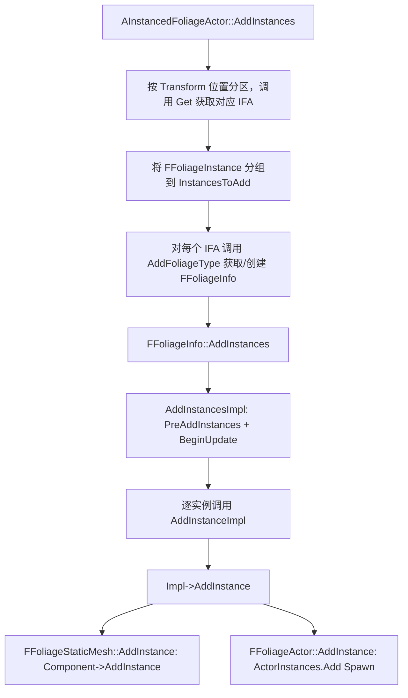
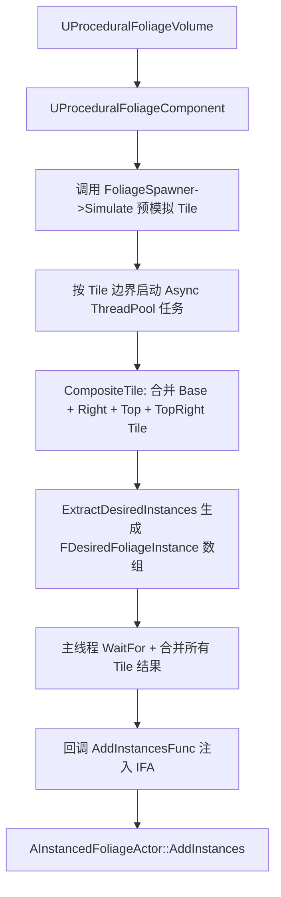

> [[00-UE全解析主索引|← 返回 UE全解析主索引]]

# UE-Foliage-源码解析：植被系统

## Why：为什么要深入理解 Foliage？

Foliage 模块负责 UE 中大规模植被实例的管理与渲染。无论是手刷的树木草丛，还是程序化生成的大世界植被，都依赖该模块进行实例存储、LOD 调度、剔除与渲染透传。理解 Foliage 的 `AInstancedFoliageActor` 中枢、`FFoliageImpl` 多态后端以及与 HISM 的渲染桥接，是优化植被密度、实现运行时植被交互和扩展自定义植被类型的关键。

## What：Foliage 是什么？

- **`AInstancedFoliageActor`**：植被实例管理中枢 Actor，每个 Level 通常一个，持有 `TMap<UFoliageType*, FFoliageInfo>`。
- **`UFoliageType`**：植被类型抽象基类，承载 Painting、Placement、InstanceSettings、Procedural、Scalability 等全部配置数据。
- **`UFoliageInstancedStaticMeshComponent`**：继承自 `UHierarchicalInstancedStaticMeshComponent`，将植被实例注入 GPU Instance 渲染管线。
- **`UGrassInstancedStaticMeshComponent`**：草地专用 HISM，支持在任意线程预构建 ClusterTree。
- **`FFoliageImpl`**：植被类型级别的实例容器多态实现，支持 StaticMesh / Actor / ISMActor 三种后端。

---

## 模块定位

- **UE 模块路径**：`Engine/Source/Runtime/Foliage/`
- **Build.cs 文件**：`Foliage.Build.cs`
- **核心依赖**：
  - `PrivateDependencyModuleNames`：`Core`, `CoreUObject`, `Engine`, `RenderCore`, `RHI`
- **关键目录**：
  - `Classes/`：`AInstancedFoliageActor`、`UFoliageType`、`UProceduralFoliageComponent` 等
  - `Public/`：`FoliageInstance.h`、`FoliageInfo.h` 等结构体定义
  - `Private/`：实例管理、程序化生成、编辑器操作实现

---

## 接口梳理（第 1 层）

### 核心类一览

| 类 | 继承 | 职责 |
|----|------|------|
| `UFoliageType` | `UObject` | 植被类型抽象基类，承载全部配置数据 |
| `UFoliageType_InstancedStaticMesh` | `UFoliageType` | 静态网格植被类型 |
| `UFoliageType_Actor` | `UFoliageType` | Actor 植被类型 |
| `AInstancedFoliageActor` | `AISMPartitionActor` | 植被实例管理中枢 Actor |
| `UFoliageInstancedStaticMeshComponent` | `UHierarchicalInstancedStaticMeshComponent` | 植被版 HISM 组件 |
| `UGrassInstancedStaticMeshComponent` | `UHierarchicalInstancedStaticMeshComponent` | 草地专用 HISM |
| `UProceduralFoliageComponent` | `UActorComponent` | 程序化植被生成入口 |
| `UFoliageStatistics` | `UBlueprintFunctionLibrary` | 蓝图工具库（重叠查询、Transform 读取） |

### 核心结构体

| 结构体 | 说明 |
|--------|------|
| `FFoliageInstance` | 单个植被实例的 Placement 数据（Location、Rotation、Scale、BaseId） |
| `FFoliageInfo` | 植被类型级别的实例容器，内部通过 `FFoliageImpl` 多态实现 |
| `FFoliageTypeObject` | 对 `UFoliageType` 的软引用包装 |

### AInstancedFoliageActor 关键接口

> 文件：`Engine/Source/Runtime/Foliage/Classes/InstancedFoliageActor.h`

```cpp
class FOLIAGE_API AInstancedFoliageActor : public AISMPartitionActor
{
    GENERATED_BODY()
public:
    // 获取/创建 IFA
    static AInstancedFoliageActor* GetInstancedFoliageActorForLevel(ULevel* Level, bool bCreateIfNone);
    static AInstancedFoliageActor* Get(UWorld* InWorld, bool bCreateIfNone);

    // 增删 FoliageType
    TUniqueObj<FFoliageInfo>& AddFoliageInfo(UFoliageType* FoliageType);
    void RemoveFoliageType(UFoliageType** InFoliageType, int32 Num);

    // 实例操作
    UFUNCTION(BlueprintCallable) static void AddInstances(UObject* WorldContextObject, UFoliageType* InFoliageType, const TArray<FTransform>& InTransforms);
    UFUNCTION(BlueprintCallable) static void RemoveAllInstances(UObject* WorldContextObject, UFoliageType* InFoliageType);

    // 空间查询
    int32 GetOverlappingSphereCount(const UFoliageType* FoliageType, const FSphere& Sphere) const;
    int32 GetOverlappingBoxCount(const UFoliageType* FoliageType, const FBox& Box) const;
};
```

### FFoliageImpl 多态接口

> 文件：`Engine/Source/Runtime/Foliage/Public/FoliageImpl.h`（近似）

```cpp
class FFoliageImpl
{
public:
    virtual void Initialize(const UFoliageType* FoliageType) = 0;
    virtual void Uninitialize() = 0;
    virtual void AddInstance(const FFoliageInstance& NewInstance) = 0;
    virtual void RemoveInstance(int32 InstanceIndex) = 0;
    virtual void SetInstanceWorldTransform(int32 InstanceIndex, const FTransform& Transform, bool bTeleport) = 0;
    virtual FTransform GetInstanceWorldTransform(int32 InstanceIndex) const = 0;
    virtual bool NotifyFoliageTypeChanged(UFoliageType* FoliageType, bool bSourceChanged) = 0;
};
```

---

## 数据结构与行为分析（第 2~3 层）

### 植被实例层级

```
Level
└── AInstancedFoliageActor
    └── TMap<UFoliageType*, FFoliageInfo>
        └── FFoliageImpl (多态)
            ├── StaticMesh 后端 → UFoliageInstancedStaticMeshComponent
            ├── Actor 后端      → 生成的 AActor 实例
            └── ISMActor 后端   → 专用 ISM Actor
```

### AInstancedFoliageActor 的 UObject 生命周期

#### 获取与分区定位

> 文件：`Engine/Source/Runtime/Foliage/Private/InstancedFoliage.cpp`，第 3113~3127 行

```cpp
AInstancedFoliageActor* AInstancedFoliageActor::Get(UWorld* InWorld, bool bCreateIfNone, ULevel* InLevelHint, const FVector& InLocationHint)
{
    UActorPartitionSubsystem* ActorPartitionSubsystem = InWorld->GetSubsystem<UActorPartitionSubsystem>();
    return Cast<AInstancedFoliageActor>(
        ActorPartitionSubsystem->GetActor(
            FActorPartitionGetParams(
                AInstancedFoliageActor::StaticClass(),
                bCreateIfNone,
                InLevelHint,
                InLocationHint
            )
        )
    );
}
```

`Get` 不再直接查询 `Level->InstancedFoliageActor`，而是委托给 `UActorPartitionSubsystem`，支持 World Partition 大世界的分区分 Actor 管理。

#### 序列化与加载

> 文件：`Engine/Source/Runtime/Foliage/Private/InstancedFoliage.cpp`，第 4342~4390 行（`Serialize` 核心逻辑）

`AInstancedFoliageActor::Serialize` 的主要职责：
1. 调用 `Super::Serialize(Ar)` 序列化 Actor 基类数据；
2. `WITH_EDITORONLY_DATA` 下序列化 `InstanceBaseCache`（跨关卡 Base Component 引用缓存）；
3. 序列化 `FoliageInfos`（`TMap<TObjectPtr<UFoliageType>, TUniqueObj<FFoliageInfo>>`）。

> 文件：`Engine/Source/Runtime/Foliage/Private/InstancedFoliage.cpp`，第 494~534 行（`FFoliageInfo` 的 `operator<<`）

```cpp
FArchive& operator<<(FArchive& Ar, FFoliageInfo& Info)
{
    Ar << Info.Type;
    if (Ar.IsLoading() || (Ar.IsTransacting() && !Info.Implementation.IsValid()))
    {
        Info.CreateImplementation(Info.Type);
    }
    if (Info.Implementation)
    {
        Info.Implementation->Serialize(Ar);
    }
#if WITH_EDITORONLY_DATA
    if (!Ar.ArIsFilterEditorOnly && !(Ar.GetPortFlags() & PPF_DuplicateForPIE))
    {
        if (Ar.IsTransacting())
        {
            Info.Instances.BulkSerialize(Ar, ...);
        }
        else
        {
            Ar << Info.Instances;
        }
    }
    if (!Ar.ArIsFilterEditorOnly)
    {
        Ar << Info.FoliageTypeUpdateGuid;
    }
    if (Ar.IsTransacting())
    {
        Ar << Info.ComponentHash;
        Ar << Info.SelectedIndices;
    }
#endif
    return Ar;
}
```

加载时，根据反序列化的 `Type` 调用 `CreateImplementation`，重建对应的 `FFoliageImpl` 子对象；随后 `Implementation->Serialize(Ar)` 恢复后端特有数据（如 `FFoliageStaticMesh` 的 `Component` 指针、`FFoliageActor` 的 `ActorInstances` 数组）。编辑器模式下还会恢复 `Instances` 数组、`ComponentHash` 和 `SelectedIndices`。

#### PostLoad 与单 Level 单例校验

> 文件：`Engine/Source/Runtime/Foliage/Private/InstancedFoliage.cpp`，第 4493~4530 行

```cpp
void AInstancedFoliageActor::PostLoad()
{
    Super::PostLoad();
    ULevel* OwningLevel = GetLevel();
    if (OwningLevel && !OwningLevel->bIsPartitioned && !OwningLevel->IsWorldPartitionRuntimeCell())
    {
        if (!OwningLevel->InstancedFoliageActor.IsValid())
        {
            OwningLevel->InstancedFoliageActor = this;
        }
        else
        {
            // MapCheck 警告并提示修复重复 IFA
        }
    }
    // ... 编辑器下处理旧版本数据转换、DetectFoliageTypeChangeAndUpdate 等
}
```

加载完成后，`PostLoad` 会校验单 Level 单例约束（非分区模式），并将自身注册到 `Level->InstancedFoliageActor`。

### FFoliageInfo 如何持有组件并管理实例数据

`FFoliageInfo` 本身不是 `UObject`，但其内部通过 `TUniquePtr<FFoliageImpl> Implementation` 持有后端实现：

> 文件：`Engine/Source/Runtime/Foliage/Public/InstancedFoliage.h`，第 270~320 行

```cpp
struct FFoliageInfo
{
    EFoliageImplType Type;
    TUniquePtr<FFoliageImpl> Implementation;
#if WITH_EDITORONLY_DATA
    AInstancedFoliageActor* IFA;
    FGuid FoliageTypeUpdateGuid;
    TArray<FFoliageInstance> Instances;
    TUniquePtr<FFoliageInstanceHash> InstanceHash;
    TMap<FFoliageInstanceBaseId, TSet<int32>> ComponentHash;
    TSet<int32> SelectedIndices;
#endif
    // ...
};
```

编辑器数据：`Instances` 数组保存每个实例的 Placement 信息；`InstanceHash` 提供空间加速查询；`ComponentHash` 记录每个 Base Component 上附着的实例索引。运行时下，`FFoliageStaticMesh` 后端的实例数据实际存储在 `UHierarchicalInstancedStaticMeshComponent` 的 GPU Instance 缓冲中，`FFoliageInfo` 的 `Instances` 数组在 `WITH_EDITORONLY_DATA` 下才存在。

### FFoliageImpl 的后端切换机制

#### 后端类型判定

> 文件：`Engine/Source/Runtime/Foliage/Private/InstancedFoliage.cpp`，第 2119~2139 行

```cpp
EFoliageImplType FFoliageInfo::GetImplementationType(const UFoliageType* FoliageType) const
{
    if (FoliageType->IsA<UFoliageType_InstancedStaticMesh>())
    {
        return EFoliageImplType::StaticMesh;
    }
    else if (FoliageType->IsA<UFoliageType_Actor>())
    {
        const UFoliageType_Actor* ActorFoliageType = Cast<UFoliageType_Actor>(FoliageType);
        if (ActorFoliageType->bStaticMeshOnly)
        {
            return EFoliageImplType::ISMActor;
        }
        else
        {
            return EFoliageImplType::Actor;
        }
    }
    return EFoliageImplType::Unknown;
}
```

#### 实现创建

> 文件：`Engine/Source/Runtime/Foliage/Private/InstancedFoliage.cpp`，第 2061~2080 行

```cpp
void FFoliageInfo::CreateImplementation(EFoliageImplType InType)
{
    check(InType != EFoliageImplType::Unknown);
    check(!Implementation.IsValid());
    Type = InType;
    if (Type == EFoliageImplType::StaticMesh)
    {
        Implementation.Reset(new FFoliageStaticMesh(this, nullptr));
    }
    else if (Type == EFoliageImplType::Actor)
    {
        Implementation.Reset(new FFoliageActor(this));
    }
    else if (Type == EFoliageImplType::ISMActor)
    {
        Implementation.Reset(new FFoliageISMActor(this));
    }
}
```

#### StaticMesh 后端：组件的创建与销毁

> 文件：`Engine/Source/Runtime/Foliage/Private/InstancedFoliage.cpp`，第 1503~1542 行（`CreateNewComponent`）

```cpp
void FFoliageStaticMesh::CreateNewComponent(const UFoliageType* InSettings)
{
    const UFoliageType_InstancedStaticMesh* FoliageType_InstancedStaticMesh = Cast<UFoliageType_InstancedStaticMesh>(InSettings);
    UClass* ComponentClass = FoliageType_InstancedStaticMesh->GetComponentClass();
    if (ComponentClass == nullptr)
    {
        ComponentClass = UFoliageInstancedStaticMeshComponent::StaticClass();
    }
    AInstancedFoliageActor* IFA = GetIFA();
    UFoliageInstancedStaticMeshComponent* FoliageComponent =
        NewObject<UFoliageInstancedStaticMeshComponent>(IFA, ComponentClass, NAME_None, RF_Transactional);
    IFA->AddInstanceComponent(FoliageComponent);
    Component = FoliageComponent;
    Component->SetStaticMesh(FoliageType_InstancedStaticMesh->GetStaticMesh());
    Component->bSelectable = true;
    Component->bHasPerInstanceHitProxies = true;
    // ... 绑定 Bounds 变化委托、更新渲染设置、Attach/Register
}
```

销毁流程（`Uninitialize`）：

> 文件：`Engine/Source/Runtime/Foliage/Private/InstancedFoliage.cpp`，第 1169~1184 行

```cpp
void FFoliageStaticMesh::Uninitialize()
{
    if (Component != nullptr)
    {
        if (Component->GetStaticMesh() != nullptr)
        {
            Component->GetStaticMesh()->GetOnExtendedBoundsChanged().RemoveAll(this);
        }
        Component->ClearInstances();
        Component->SetFlags(RF_Transactional);
        Component->Modify();
        Component->DestroyComponent();
        Component = nullptr;
    }
}
```

#### Actor 后端：Actor 的生成与销毁

> 文件：`Engine/Source/Runtime/Foliage/Private/FoliageActor.cpp`，第 63~99 行

```cpp
void FFoliageActor::Initialize(const UFoliageType* FoliageType)
{
    check(!IsInitialized());
    const UFoliageType_Actor* FoliageType_Actor = Cast<UFoliageType_Actor>(FoliageType);
    ActorClass = FoliageType_Actor->ActorClass ? FoliageType_Actor->ActorClass.Get() : AActor::StaticClass();
    bShouldAttachToBaseComponent = FoliageType_Actor->bShouldAttachToBaseComponent;
}

AActor* FFoliageActor::Spawn(const FFoliageInstance& Instance)
{
    if (ActorClass == nullptr) return nullptr;
    AInstancedFoliageActor* IFA = GetIFA();
    FActorSpawnParameters SpawnParameters;
    SpawnParameters.ObjectFlags = RF_Transactional;
    SpawnParameters.bHideFromSceneOutliner = true;
    SpawnParameters.bCreateActorPackage = false; // No OFPA
    SpawnParameters.OverrideLevel = IFA->GetLevel();
    AActor* NewActor = IFA->GetWorld()->SpawnActor(ActorClass, nullptr, nullptr, SpawnParameters);
    if (NewActor)
    {
        NewActor->SetActorTransform(Instance.GetInstanceWorldTransform());
        FFoliageHelper::SetIsOwnedByFoliage(NewActor);
    }
    return NewActor;
}
```

销毁时调用 `DestroyActors`，遍历 `ActorInstances` 数组，对每个有效 Actor 调用 `GetWorld()->DestroyActor(Actor)`。

### 关键调用链分析

#### AddInstances 调用链



> 文件：`Engine/Source/Runtime/Foliage/Private/InstancedFoliage.cpp`
> - `AInstancedFoliageActor::AddInstances`：第 4937~4967 行
> - `FFoliageInfo::AddInstances`：第 2282~2285 行
> - `FFoliageInfo::AddInstancesImpl`：第 2293~2313 行
> - `FFoliageStaticMesh::AddInstance`：第 1214~1219 行
> - `FFoliageActor::AddInstance`：`FoliageActor.cpp` 第 132~135 行

#### RemoveAllInstances 调用链

> 文件：`Engine/Source/Runtime/Foliage/Private/InstancedFoliage.cpp`，第 4969~4980 行

```cpp
void AInstancedFoliageActor::RemoveAllInstances(UObject* WorldContextObject, UFoliageType* InFoliageType)
{
    UWorld* World = GEngine->GetWorldFromContextObject(...);
    if (World)
    {
        for (TActorIterator<AInstancedFoliageActor> It(World); It; ++It)
        {
            AInstancedFoliageActor* IFA = (*It);
            IFA->RemoveFoliageType(&InFoliageType, 1);
        }
    }
}
```

`RemoveFoliageType`（第 3898~3920 行）遍历传入的 FoliageType 数组，找到对应 `FFoliageInfo`，调用 `Info->Uninitialize()` 销毁后端（组件或 Actor），然后从 `FoliageInfos` Map 中移除。

#### GetOverlappingSphereCount 调用链

> 文件：`Engine/Source/Runtime/Foliage/Private/InstancedFoliage.cpp`，第 2960~2968 行

```cpp
int32 AInstancedFoliageActor::GetOverlappingSphereCount(const UFoliageType* FoliageType, const FSphere& Sphere) const
{
    if (const FFoliageInfo* Info = FindInfo(FoliageType))
    {
        return Info->GetOverlappingSphereCount(Sphere);
    }
    return 0;
}
```

`FFoliageInfo::GetOverlappingSphereCount`（第 2082~2090 行）将调用转发给 `Implementation->GetOverlappingSphereCount`。对于 `FFoliageStaticMesh` 后端（第 1128~1135 行），在 `Component->IsTreeFullyBuilt()` 为真时，调用 `Component->GetOverlappingSphereCount(Sphere)`，利用 HISM 内部已构建的 ClusterTree 进行加速空间查询。

### 草地（Grass）预构建优化机制

#### BuildTreeAnyThread

> 文件：`Engine/Source/Runtime/Foliage/Private/InstancedGrass.cpp`，第 17~43 行

```cpp
void UGrassInstancedStaticMeshComponent::BuildTreeAnyThread(
    TArray<FMatrix>& InstanceTransforms,
    TArray<float>& InstanceCustomDataFloats,
    int32 NumCustomDataFloats,
    const FBox& MeshBox,
    TArray<FClusterNode>& OutClusterTree,
    TArray<int32>& OutSortedInstances,
    TArray<int32>& OutInstanceReorderTable,
    int32& OutOcclusionLayerNum,
    int32 MaxInstancesPerLeaf,
    bool InGenerateInstanceScalingRange
    )
{
    check(MaxInstancesPerLeaf > 0);
    float DensityScaling = 1.0f;
    int32 InstancingRandomSeed = 1;
    FClusterBuilder Builder(InstanceTransforms, InstanceCustomDataFloats, NumCustomDataFloats, MeshBox, MaxInstancesPerLeaf, DensityScaling, InstancingRandomSeed, InGenerateInstanceScalingRange);
    Builder.BuildTree();
    OutOcclusionLayerNum = Builder.Result->OutOcclusionLayerNum;
    OutClusterTree = MoveTemp(Builder.Result->Nodes);
    OutInstanceReorderTable = MoveTemp(Builder.Result->InstanceReorderTable);
    OutSortedInstances = MoveTemp(Builder.Result->SortedInstances);
}
```

这是一个**纯静态工具函数**，不依赖任何 UObject 状态，因此可以在任意线程安全调用。它使用 `FClusterBuilder` 预先计算 ClusterTree、InstanceReorderTable 和 SortedInstances，避免在主线程进行耗时的树构建。

#### AcceptPrebuiltTree

> 文件：`Engine/Source/Runtime/Foliage/Private/InstancedGrass.cpp`，第 45~92 行

```cpp
void UGrassInstancedStaticMeshComponent::AcceptPrebuiltTree(
    TArray<FClusterNode>& InClusterTree,
    int32 InOcclusionLayerNumNodes,
    int32 InNumBuiltRenderInstances,
    FStaticMeshInstanceData* InSharedInstanceBufferData)
{
    checkSlow(IsInGameThread());
    // ... 清空旧数据 ...
    NumBuiltRenderInstances = InNumBuiltRenderInstances;
    OcclusionLayerNumNodes = InOcclusionLayerNumNodes;
    BuiltInstanceBounds = GetClusterTreeBounds(InClusterTree, FVector::Zero());
    InstanceCountToRender = InNumBuiltRenderInstances;
    if (bMeshIsValid)
    {
        *ClusterTreePtr = MoveTemp(InClusterTree);
        PostBuildStats();
    }
    TUniquePtr<FStaticMeshInstanceData> BuiltInstanceData = MakeUnique<FStaticMeshInstanceData>();
    Swap(*BuiltInstanceData, *InSharedInstanceBufferData);
    PrimitiveInstanceDataManager.MarkForRebuildFromLegacy(MoveTemp(BuiltInstanceData), InstanceReorderTable, ...);
    MarkRenderStateDirty();
}
```

`AcceptPrebuiltTree` 必须在游戏线程执行，负责将外线程预计算好的 `ClusterTree` 和 `FStaticMeshInstanceData` 注入到组件的渲染数据结构中，随后调用 `MarkRenderStateDirty()` 触发渲染状态重建。该机制让 Landscape Grass 在加载时实现**零运行时树构建开销**。

`UGrassInstancedStaticMeshComponent` 还重写了 `BuildTree` 和 `BuildTreeAsync` 为空函数（第 94~102 行），彻底禁用 HISM 默认的运行时树构建路径。

### 程序化植被生成流程



> 文件：`Engine/Source/Runtime/Foliage/Private/ProceduralFoliageComponent.cpp`
> - `GenerateProceduralContent`：第 180~342 行
> - `ResimulateProceduralFoliage`：第 350~377 行
> - `RemoveProceduralContent`：第 379~398 行

核心设计要点：
- **Tile 分块与多线程**：将世界空间按 `FoliageSpawner->TileSize` 划分为网格，每个 Tile 的实例提取任务通过 `Async(EAsyncExecution::ThreadPool, ...)` 派发，主线程通过 `WaitFor(100ms)` 轮询并更新 `GWarn` 进度条。
- **重叠区域合并**：通过 `GetTileRegion` 计算每个 Tile 的有效区域，并拼接相邻 Tile 的重叠部分（Right/Top/TopRight），消除 Tile 边界裂缝。
- **取消机制**：使用 `FThreadSafeCounter LastCancel`，用户点击取消后递增计数器，工作线程对比原始值后提前返回空数组。

### 多线程与性能分析

| 机制 | 作用 | 源码位置 |
|------|------|----------|
| **BuildTreeAnyThread** | 任意线程预构建 Grass 的 ClusterTree | `Foliage/Private/InstancedGrass.cpp:17` |
| **AcceptPrebuiltTree** | 主线程注入预构建树到渲染管线 | `Foliage/Private/InstancedGrass.cpp:45` |
| **HISM ClusterTree** | 运行时按簇进行视锥剔除与遮挡查询 | `Engine/Private/HierarchicalInstancedStaticMesh.cpp` |
| **GPU Instance 渲染** | `DrawIndexedInstanced` 批量绘制，降低 CPU DrawCall | 继承自 `UHierarchicalInstancedStaticMeshComponent` |
| **Async Tile 生成** | 程序化植被的多线程 Tile 模拟 | `Foliage/Private/ProceduralFoliageComponent.cpp:232` |

---

## 上下层关系

### 上层：编辑器交互

| 方向 | 交互模块 | 方式 |
|------|---------|------|
| **上层** | `UnrealEd` / `LandscapeEditor` | 编辑器下通过 Foliage Mode 笔刷操作 IFA 实例；笔刷的 `FDesiredFoliageInstance` 通过 `AInstancedFoliageActor::FoliageTrace` 获取命中信息 |

### 同层：Landscape 弱耦合

Foliage 模块**不直接依赖 Landscape 模块**，而是通过以下两种通用机制实现交互：

1. **Trace 命中**：手刷植被时，调用 `AInstancedFoliageActor::FoliageTrace`（内部执行 `LineTraceSingle`）命中 `UPrimitiveComponent`（包括 `LandscapeComponent`），获取法线、位置与权重，用于实例对齐与放置。
2. **Layer Name 配置过滤**：`UFoliageType::LandscapeLayers`（`TArray<FName>`）保存 Landscape Layer 名称；程序化生成时，通过采样 Landscape Layer 权重决定是否在该位置生成实例。

> 数据流向：
> - **流入 Foliage**：`Landscape` 的表面几何（通过 Trace）→ `FFoliageInstance.Location/Rotation`；Layer 名称配置 → 程序化生成的密度过滤。
> - **流出 Foliage**：Foliage 实例作为独立的 `PrimitiveComponent`（HISM）进入场景，参与渲染与碰撞管线，对 Landscape 无反向数据依赖。

### 下层：Engine（HISM 继承）

`UFoliageInstancedStaticMeshComponent` 直接继承 `UHierarchicalInstancedStaticMeshComponent`：

> 文件：`Engine/Source/Runtime/Foliage/Public/FoliageInstancedStaticMeshComponent.h`，第 20 行

```cpp
class UFoliageInstancedStaticMeshComponent : public UHierarchicalInstancedStaticMeshComponent
```

数据流向：
- **流入 Engine**：`FFoliageStaticMesh::AddInstance` 调用 `Component->AddInstance(...)`，将 `FTransform` 注入 HISM 的 `PerInstanceSMData`；`UpdateComponentSettings` 将 `CullDistance`、`Mobility`、`CastShadow` 等配置透传给 HISM。
- **Engine 内部处理**：HISM 将实例数据上传到 GPU Instance Buffer，构建 ClusterTree，执行视锥剔除、LOD 过渡与批量绘制。

### 下层：RenderCore / RHI（渲染配置透传）

`UFoliageType` 作为配置容器，承载了最终会传递给渲染管线的全部开关：

| 配置项 | 对渲染管线的影响 |
|--------|-----------------|
| `CullDistance` | 通过 `UpdateComponentCullDistance` 设置 HISM 的 `Min/MaxCullDistance` |
| `CastShadow` / `bCastDynamicShadow` / `bCastStaticShadow` | 直接映射到 `UPrimitiveComponent` 的 Shadow 标志 |
| `bAffectDistanceFieldLighting` | 控制是否参与 Distance Field AO/GI |
| `bEvaluateWorldPositionOffset` / `WorldPositionOffsetDisableDistance` | 控制材质 WPO 求值与 LOD 裁剪 |
| `bReceivesDecals` / `TranslucencySortPriority` | 透传到 RHI 渲染状态的 Decal/排序配置 |

这些属性在 `FFoliageStaticMesh::UpdateComponentSettings` 中被批量应用到 `UHierarchicalInstancedStaticMeshComponent`，随后通过 `UPrimitiveComponent` → `FPrimitiveSceneProxy` → `RenderCore` 的路径进入渲染器。

---

## 设计亮点与可迁移经验

1. **FFoliageImpl 多态后端**：通过抽象接口支持 StaticMesh、Actor、ISMActor 三种实例存储方式，为未来扩展新植被后端（如 Nanite Proxy、Procedural Mesh）预留了清晰扩展点。新增后端只需继承 `FFoliageImpl`、注册到 `CreateImplementation`、补充序列化逻辑即可。
2. **AInstancedFoliageActor 单 Level 单例模式**：每个 Level 一个 IFA（非 WorldPartition 模式下），集中管理该关卡内所有植被实例，简化序列化、加载与卸载逻辑。WorldPartition 模式下则通过 `UActorPartitionSubsystem` 自动分区分 Actor 扩展。
3. **HISM 继承实现渲染下沉**：Foliage 模块本身只负责"元数据 + 容器 + 编辑器操作"，真正的高性能渲染完全下沉到 Engine 层的 `UHierarchicalInstancedStaticMeshComponent`，体现了清晰的职责分离。
4. **Grass 的预构建 ClusterTree**：`BuildTreeAnyThread` + `AcceptPrebuiltTree` 是处理大规模实例化对象的经典优化模式——在任意线程预处理数据结构（ClusterTree、InstanceBuffer），再在主线程"注入"结果，彻底消除加载时的树构建卡顿。
5. **与 Landscape 的弱耦合**：Foliage 模块不直接 `#include Landscape` 模块，而是通过通用的 `PrimitiveComponent` Trace + Layer Name 字符串配置实现交互，保持了模块的通用性和可移植性。这种"接口即协议"的弱耦合设计在自研引擎的地形-植被桥接中非常值得借鉴。
6. **程序化生成的 Tile-Async 模式**：将大世界空间切分为固定大小的 Tile，利用线程池并行模拟，主线程仅负责结果合并与状态更新，是 CPU 密集型生成的标准并行范式。

---

## 关键源码片段

> 文件：`Engine/Source/Runtime/Foliage/Classes/InstancedFoliageActor.h`，第 80~120 行（近似）

```cpp
class FOLIAGE_API AInstancedFoliageActor : public AISMPartitionActor
{
    GENERATED_BODY()
public:
    // 植被类型 -> 实例信息的映射
    UPROPERTY()
    TMap<TObjectPtr<UFoliageType>, TUniqueObj<FFoliageInfo>> FoliageInfos;

    static AInstancedFoliageActor* Get(UWorld* InWorld, bool bCreateIfNone);
    UFUNCTION(BlueprintCallable) static void AddInstances(UObject* WorldContextObject, UFoliageType* InFoliageType, const TArray<FTransform>& InTransforms);
};
```

> 文件：`Engine/Source/Runtime/Foliage/Classes/FoliageType.h`，第 60~100 行（近似）

```cpp
UCLASS(abstract, editinlinenew)
class FOLIAGE_API UFoliageType : public UObject
{
    GENERATED_BODY()
public:
    // 植被放置配置
    UPROPERTY(Category = "Placement", EditAnywhere)
    FFoliageVertexColorChannelMask VertexColorMask;

    // 渲染配置透传给底层 HISM
    UPROPERTY(Category = "Instance Settings", EditAnywhere)
    float CullDistance;

    // Landscape Layer 过滤
    UPROPERTY(Category = "Procedural", EditAnywhere)
    TArray<FName> LandscapeLayers;
};
```

> 文件：`Engine/Source/Runtime/Foliage/Classes/GrassInstancedStaticMeshComponent.h`，第 40~70 行（近似）

```cpp
UCLASS()
class FOLIAGE_API UGrassInstancedStaticMeshComponent : public UHierarchicalInstancedStaticMeshComponent
{
    GENERATED_BODY()
public:
    // 在任意线程预构建 ClusterTree
    static void BuildTreeAnyThread(TArray<FMatrix>& InstanceTransforms, TArray<float>& InstanceCustomDataFloats, ...);

    // 接受预构建结果并注入渲染数据结构
    void AcceptPrebuiltTree(TArray<FClusterNode>& InClusterTree, int32 InOcclusionLayerNumNodes, ...);
};
```

---

## 关联阅读

- [[UE-Landscape-源码解析：地形系统|UE-Landscape-源码解析：地形系统]]
- [[UE-Engine-源码解析：Actor 与 Component 模型|UE-Engine-源码解析：Actor 与 Component 模型]]
- [[UE-Engine-源码解析：场景图与变换传播|UE-Engine-源码解析：场景图与变换传播]]
- [[UE-Engine-源码解析：World 与 Level 架构|UE-Engine-源码解析：World 与 Level 架构]]

---

## 索引状态

- **所属阶段**：第三阶段 3.4 空间、物理与导航
- **分析完成度**：第一轮 ✅，第二轮 ✅，第三轮 ✅，整体完成度：骨架扫描 + 数据结构/行为分析 + 关联辐射
