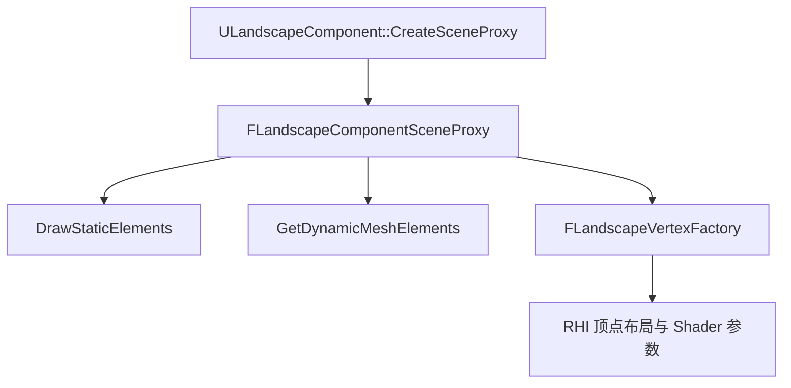

> [← 返回 UE全解析主索引]([[00-UE全解析主索引|UE全解析主索引]])

# UE-Landscape-源码解析：地形系统

## Why：为什么要深入理解 Landscape？

Landscape 是 UE 中支撑开放大世界场景的核心模块。它不仅要管理海量高度图/权重图数据，还要对接渲染管线（LOD、Nanite）、物理碰撞（高度场）、植被生成（Grass）以及编辑器工具链（雕刻、笔刷、Edit Layers）。理解 Landscape 的 Actor/Component 层级、数据索引与渲染代理机制，是进行大世界性能优化和地形工具开发的前提。

## What：Landscape 是什么？

- **`ALandscapeProxy`**：地形抽象基类，管理 `LandscapeComponents`、材质参数、LOD / Nanite 设置。
- **`ALandscape`**：实际地形 Actor，编辑层（Edit Layers）的拥有者，负责组件分割与合并。
- **`ALandscapeStreamingProxy`**：World Partition 大地形分块加载的流送代理。
- **`ULandscapeComponent`**：地形渲染组件，持有 Heightmap / Weightmap 纹理引用，负责创建 `FLandscapeComponentSceneProxy`。
- **`ULandscapeInfo`**：地形元信息中心，维护 `XYtoComponentMap` 等空间索引。
- **`ULandscapeSubsystem`**：世界级地形子系统，负责 Grass Map 构建、Tick 调度、Nanite 构建。

---

## 模块定位

- **UE 模块路径**：`Engine/Source/Runtime/Landscape/`
- **Build.cs 文件**：`Landscape.Build.cs`
- **核心依赖**：
  - `PrivateDependencyModuleNames`：`Core`, `CoreUObject`, `Engine`, `RenderCore`, `RHI`, `Renderer`, `Foliage`, `ImageCore`, `MathCore`, `GeometryCore`, `TraceLog`, `DeveloperSettings`
  - Editor-only：`UnrealEd`, `EditorFramework`, `MaterialUtilities`, `SlateCore`, `Slate`, `MeshUtilities`, `MeshBuilder`, `NaniteBuilder`
  - 内部 Include：`TargetPlatform`, `DerivedDataCache`, `Shaders`
- **关键目录**：
  - `Classes/`：Landscape Actor/Component 声明
  - `Public/`：Info、Subsystem、材质表达式、渲染核心类
  - `Private/`：实现与编辑器桥接

---

## 接口梳理（第 1 层）

### 核心 Actor 层级

| 类 | 继承 | 职责 |
|----|------|------|
| `ALandscapeProxy` | `APartitionActor` | 地形抽象基类，管理组件、材质、LOD、Nanite |
| `ALandscape` | `ALandscapeProxy` | 主地形 Actor，Edit Layers 拥有者 |
| `ALandscapeStreamingProxy` | `ALandscapeProxy` | World Partition 流送代理 |
| `ALandscapeBlueprintBrushBase` | `AActor` | 蓝图笔刷基类，程序化编辑地形 |

### 核心 Component 层级

| 类 | 继承 | 职责 |
|----|------|------|
| `ULandscapeComponent` | `UPrimitiveComponent` | 地形渲染组件，创建 Scene Proxy |
| `ULandscapeHeightfieldCollisionComponent` | `UPrimitiveComponent` | 地形碰撞组件，管理高度场物理体 |
| `ULandscapeMeshCollisionComponent` | — | 网格碰撞组件 |
| `ULandscapeSplinesComponent` | — | 地形样条组件 |
| `ULandscapeNaniteComponent` | — | Nanite 渲染代理组件 |

### 核心管理对象

| 类 | 继承 | 职责 |
|----|------|------|
| `ULandscapeInfo` | `UObject` | 地形元信息中心，维护组件空间索引 |
| `ULandscapeInfoMap` | `UObject` | 全局 `LandscapeGuid -> ULandscapeInfo` 映射 |
| `ULandscapeLayerInfoObject` | `UObject` | 单一层信息（Layer Name、Phys Material） |
| `ULandscapeGrassType` | `UObject` | 草地类型配置 |
| `ULandscapeSubsystem` | `UTickableWorldSubsystem` | 世界级地形子系统，驱动 Grass/Nanite |

### 渲染核心（非 UObject）

| 类 | 继承 | 职责 |
|----|------|------|
| `FLandscapeComponentSceneProxy` | `FPrimitiveSceneProxy` | 渲染线程代理，实现 DrawStaticElements |
| `FLandscapeVertexFactory` | `FVertexFactory` | 地形顶点工厂，管理 LOD 与 Subsection 布局 |
| `FLandscapeSharedBuffers` | `FRefCountedObject` | 跨组件共享的顶点/索引缓冲区 |

---

## 数据结构与行为分析（第 2~3 层）

### Landscape Actor / Component 层级

```
ALandscape (或 ALandscapeStreamingProxy)
├── ULandscapeComponent[]
│   ├── HeightmapTexture
│   ├── WeightmapTextures[]
│   ├── LODTexture
│   └── XYOffsetTexture
├── ULandscapeHeightfieldCollisionComponent[]
├── ULandscapeInfo (UObject)
│   ├── XYtoComponentMap
│   └── XYtoCollisionComponentMap
└── LandscapeMaterial
```

### ULandscapeComponent 的 UObject 生命周期

- **Outer**：`ALandscapeProxy`（Actor）。
- **关键属性**：
  - `TObjectPtr<UTexture2D> HeightmapTexture`：高度图纹理。
  - `TArray<TObjectPtr<UTexture2D>> WeightmapTextures`：权重图纹理数组。
- **渲染入口**：`CreateSceneProxy()` 在 Game Thread 创建 `FLandscapeComponentSceneProxy`，随后由渲染线程接管资源创建与绘制。

### 渲染管线交互



- `DrawStaticElements`：静态地形批次绘制，支持缓存。
- `GetDynamicMeshElements`：动态网格元素收集（LOD 过渡、工具网格）。
- `FLandscapeVertexFactory`：为地形 Shader 提供独特的顶点布局与参数。

### Nanite 与草地生成

- **Nanite**：`ALandscapeProxy` 通过 `ULandscapeNaniteComponent` 与 Nanite Builder 生成网格，实现远处地形的高性能渲染。
- **草地（Grass）**：`ULandscapeSubsystem` 每帧调度 Grass Map 构建，将权重图烘焙为 `UGrassInstancedStaticMeshComponent` 的实例数据，实现大规模草地实例化渲染。

---

## 第二轮：数据结构 + 行为逻辑深化

### 1. LandscapeComponent -> SceneProxy -> RHI 数据流

#### 1.1 CreateSceneProxy 的调用链

> 文件：`Engine/Source/Runtime/Landscape/Private/Landscape.cpp`，第 2084~2100 行

```cpp
FPrimitiveSceneProxy* ULandscapeComponent::CreateSceneProxy()
{
    FPrimitiveSceneProxy* LocalSceneProxy = nullptr;
    ILandscapeModule& LandscapeModule = FModuleManager::GetModuleChecked<ILandscapeModule>("Landscape");
    const UE::Landscape::FCreateLandscapeComponentSceneProxyDelegate& CreateProxyDelegate = LandscapeModule.GetCreateLandscapeComponentSceneProxyDelegate();
    if (CreateProxyDelegate.IsBound())
    {
        LocalSceneProxy = CreateProxyDelegate.Execute(this);
    }
    if (LocalSceneProxy == nullptr)
    {
        LocalSceneProxy = new FLandscapeComponentSceneProxy(this);
    }
    return LocalSceneProxy;
}
```

- **行为分析**：
  - `CreateSceneProxy` 首先尝试通过 `ILandscapeModule` 的委托创建代理，允许插件或渲染模块自定义 SceneProxy。
  - 若委托未绑定或返回空，则直接 `new FLandscapeComponentSceneProxy(this)`。
  - 该函数在 **Game Thread** 执行，但创建的 `FPrimitiveSceneProxy` 对象由 **渲染线程** 接管生命周期。

#### 1.2 FLandscapeComponentSceneProxy 构造函数的数据拷贝

> 文件：`Engine/Source/Runtime/Landscape/Private/LandscapeRender.cpp`，第 1368~1467 行

SceneProxy 在构造时从 `ULandscapeComponent` 大量拷贝只读数据：

| 拷贝的数据 | 来源 |
|-----------|------|
| `HeightmapTexture` | `InComponent->GetHeightmap()` |
| `WeightmapTextures` | `InComponent->GetWeightmapTextures()` / `MobileWeightmapTextures` |
| `AvailableMaterials` | `InComponent->MaterialInstances` / `MaterialInstancesDynamic` / `MobileMaterialInterfaces` |
| `LODIndexToMaterialIndex` | `InComponent->LODIndexToMaterialIndex` |
| `HeightmapScaleBias`, `WeightmapScaleBias` | 组件属性直接拷贝 |
| `SectionBase`, `ComponentSizeQuads`, `SubsectionSizeQuads` | 组件属性直接拷贝 |
| `MaxLOD`, `NumWeightmapLayerAllocations` | 通过计算或组件属性拷贝 |

- **跨线程安全**：所有指针（如 `HeightmapTexture`、`WeightmapTextures`）均为 `UObject` 指针，渲染线程只读使用，不直接修改。UObject 的 GC 由 Game Thread 的引用链保证（通过 `UPROPERTY()` 或 `AddReferencedObjects`）。

#### 1.3 DrawStaticElements 实现

> 文件：`Engine/Source/Runtime/Landscape/Private/LandscapeRender.cpp`，第 2451~2545 行

```cpp
void FLandscapeComponentSceneProxy::DrawStaticElements(FStaticPrimitiveDrawInterface* PDI)
{
    if (AvailableMaterials.Num() == 0) { return; }
    int32 TotalBatchCount = 1 + LastLOD - FirstLOD;
    // Fixed Grid 批次（Runtime Virtual Texture、Water Info、Lumen）
    if (FixedGridVertexFactory != nullptr)
    {
        TotalBatchCount += (1 + LastVirtualTextureLOD - FirstVirtualTextureLOD) * RuntimeVirtualTextureMaterialTypes.Num();
        TotalBatchCount += 1; // Water Info
        TotalBatchCount += 1; // Lumen
    }
    StaticBatchParamArray.Empty(TotalBatchCount);
    PDI->ReserveMemoryForMeshes(TotalBatchCount);
    // ... 提交 Fixed Grid MeshBatch ...
    // ... 提交 Grass MeshBatch（若存在） ...
    for (int32 LODIndex = FirstLOD; LODIndex <= LastLOD; LODIndex++)
    {
        FMeshBatch MeshBatch;
        if (GetStaticMeshElement(LODIndex, false, MeshBatch, StaticBatchParamArray))
        {
            PDI->DrawMesh(MeshBatch, LODIndex == FirstLOD ? FLT_MAX : (FMath::Sqrt(LODScreenRatioSquared[LODIndex]) * 2.0f));
        }
    }
}
```

- **行为要点**：
  - 静态绘制时，每个 LOD 生成一个 `FMeshBatch`，通过 `PDI->DrawMesh` 注册到场景的静态网格列表中。
  - `LODScreenRatioSquared` 决定了每个 LOD 的切换屏幕比例阈值。
  - 若启用了 Runtime Virtual Texture，会额外生成固定网格（Fixed Grid）的批次，使用 `FixedGridVertexFactory`。

#### 1.4 GetDynamicMeshElements 实现

> 文件：`Engine/Source/Runtime/Landscape/Private/LandscapeRender.cpp`，第 2573~2722 行

```cpp
void FLandscapeComponentSceneProxy::GetDynamicMeshElements(const TArray<const FSceneView*>& Views, const FSceneViewFamily& ViewFamily, uint32 VisibilityMap, FMeshElementCollector& Collector) const
{
    // ...
    const FLandscapeRenderSystem& RenderSystem = *LandscapeRenderSystems.FindChecked(LandscapeKey);
    for (int32 ViewIndex = 0; ViewIndex < Views.Num(); ViewIndex++)
    {
        if (VisibilityMap & (1 << ViewIndex))
        {
            FLandscapeElementParamArray& ParameterArray = Collector.AllocateOneFrameResource<FLandscapeElementParamArray>();
            // ...
            int32 LODToRender = static_cast<int32>(RenderSystem.GetSectionLODValue(*View, RenderCoord));
            FMeshBatch& Mesh = Collector.AllocateMesh();
            GetStaticMeshElement(LODToRender, false, Mesh, ParameterArray.ElementParams);
#if WITH_EDITOR
            FMeshBatch& MeshTools = Collector.AllocateMesh();
            GetStaticMeshElement(LODToRender, true, MeshTools, ParameterArray.ElementParams);
            // 根据 GLandscapeViewMode 切换 Debug/LayerDensity/LOD/Wireframe 等可视化模式
            switch (GLandscapeViewMode) { /* ... */ }
#endif
            Collector.AddMesh(ViewIndex, Mesh);
        }
    }
}
```

- **行为要点**：
  - 动态网格元素在每个 View 的每个可见组件上调用，由 `FLandscapeRenderSystem` 根据视角距离计算当前应渲染的 `LODToRender`。
  - Editor 模式下会额外生成工具网格（`MeshTools`），支持 Layer Debug、LOD 可视化、Wireframe On Top 等调试视图。

### 2. ULandscapeComponent 的 UObject 生命周期与内存布局

#### 2.1 关键属性的引用链

> 文件：`Engine/Source/Runtime/Landscape/Classes/LandscapeComponent.h`，第 ~187 行、~190 行

```cpp
UPROPERTY()
TObjectPtr<UTexture2D> HeightmapTexture;

UPROPERTY()
TArray<TObjectPtr<UTexture2D>> WeightmapTextures;
```

- **GC 关系**：`HeightmapTexture` 和 `WeightmapTextures` 均为 `UPROPERTY()` 标记的 `TObjectPtr`，因此：
  - 它们的引用会被 UE 的 GC 扫描到。
  - 只要 `ULandscapeComponent` 存活（Outer 为 `ALandscapeProxy`，而 Actor 在 Level 中注册），纹理对象就不会被 GC 回收。
  - 组件 `BeginDestroy` 或 `DestroyComponent` 时，会从 `ALandscapeProxy::LandscapeComponents` 中移除自身，切断引用链。

#### 2.2 AddReferencedObjects 的额外引用

> 文件：`Engine/Source/Runtime/Landscape/Private/Landscape.cpp`，第 1599~1605 行

```cpp
void ULandscapeComponent::AddReferencedObjects(UObject* InThis, FReferenceCollector* Collector)
{
    Super::AddReferencedObjects(InThis, Collector);
    ThisClass* const TypedThis = Cast<ThisClass>(InThis);
    Collector->AddReferencedObjects(TypedThis->GrassData->WeightOffsets, TypedThis);
}
```

- **分析**：`GrassData` 是一个 `TSharedRef<FLandscapeComponentGrassData, ESPMode::ThreadSafe>`（非 UObject），但其内部 `WeightOffsets` 数组存储了 `UObject` 指针（如 `ULandscapeGrassType`）。通过 `AddReferencedObjects`，这些对象也被纳入 GC 根集合，防止在异步 Grass 任务执行期间被回收。

#### 2.3 跨线程传递机制

`CreateSceneProxy` 在 Game Thread 中将 `ULandscapeComponent` 的指针传给 `FLandscapeComponentSceneProxy` 构造函数，构造函数即时拷贝所有需要的数据。此后：
- **Game Thread** 负责修改 `HeightmapTexture` / `WeightmapTextures`（如编辑地形、切换 Edit Layer）。
- **Render Thread** 只读取 SceneProxy 中缓存的指针和参数。
- 当 Game Thread 修改纹理后，会调用 `MarkRenderStateDirty()`，触发 SceneProxy 的重建或更新。

### 3. ULandscapeInfo 的 XYtoComponentMap 空间索引

#### 3.1 构建与查询

> 文件：`Engine/Source/Runtime/Landscape/Private/Landscape.cpp`，第 6706~6786 行

```cpp
void ULandscapeInfo::RegisterActorComponent(ULandscapeComponent* Component, bool bMapCheck)
{
    FIntPoint ComponentKey = Component->GetSectionBase() / Component->ComponentSizeQuads;
    ULandscapeComponent* RegisteredComponent = XYtoComponentMap.FindRef(ComponentKey);
    if (RegisteredComponent != Component)
    {
        if (RegisteredComponent == nullptr)
        {
            XYtoComponentMap.Add(ComponentKey, Component);
        }
        else if (bMapCheck)
        {
            // Editor: 输出 MapCheck 警告，存在重叠组件
        }
    }
    XYComponentBounds.Include(ComponentKey);
}

void ULandscapeInfo::UnregisterActorComponent(ULandscapeComponent* Component)
{
    FIntPoint ComponentKey = Component->GetSectionBase() / Component->ComponentSizeQuads;
    ULandscapeComponent* RegisteredComponent = XYtoComponentMap.FindRef(ComponentKey);
    if (RegisteredComponent == Component)
    {
        XYtoComponentMap.Remove(ComponentKey);
    }
    // 重新计算 XYComponentBounds
    XYComponentBounds = FIntRect(MAX_int32, MAX_int32, MIN_int32, MIN_int32);
    for (const TPair<FIntPoint, ULandscapeComponent*>& XYComponentPair : XYtoComponentMap)
    {
        XYComponentBounds.Include(XYComponentPair.Key);
    }
}
```

- **索引键**：`ComponentKey = SectionBase / ComponentSizeQuads`，即组件在组件坐标系中的整数网格坐标。
- **查询场景**：`LandscapeEditInterface` 中的笔刷绘制、碰撞更新、邻居查找等均通过 `LandscapeInfo->XYtoComponentMap.FindRef(FIntPoint(X, Y))` 快速定位组件，无需遍历 `LandscapeComponents` 数组。
- **碰撞组件索引**：`XYtoCollisionComponentMap` 同理，用于物理高度场的快速查找。

### 4. ULandscapeSubsystem 驱动 Grass 生成

#### 4.1 RegisterActor / UnregisterActor

> 文件：`Engine/Source/Runtime/Landscape/Private/LandscapeSubsystem.cpp`，第 342~410 行

```cpp
void ULandscapeSubsystem::RegisterActor(ALandscapeProxy* Proxy)
{
    // 防止重复注册
    if (Proxy->bIsRegisteredWithSubsystem) { return; }
    Proxies.Add(Proxy);
    if (ALandscape* LandscapeActor = Cast<ALandscape>(Proxy))
    {
        LandscapeActors.AddUnique(LandscapeActor);
    }
    else if (ALandscapeStreamingProxy* StreamingProxy = Cast<ALandscapeStreamingProxy>(Proxy))
    {
        // 监听流送代理移动事件，以便调整地图
        StreamingProxy->GetRootComponent()->TransformUpdated.AddUObject(this, &ULandscapeSubsystem::OnProxyMoved);
    }
    Proxy->bIsRegisteredWithSubsystem = true;
    Proxy->RegisteredToSubsystem = this;
}

void ULandscapeSubsystem::UnregisterActor(ALandscapeProxy* Proxy)
{
    if (!Proxy->bIsRegisteredWithSubsystem) { return; }
    if (Proxy->RegisteredToSubsystem != this)
    {
        Proxy->RegisteredToSubsystem->UnregisterActor(Proxy);
        return;
    }
    Proxies.Remove(Proxy);
    // 解除移动监听、标记未注册
    Proxy->bIsRegisteredWithSubsystem = false;
    Proxy->RegisteredToSubsystem = nullptr;
}
```

- **设计意图**：`ULandscapeSubsystem` 作为 `UTickableWorldSubsystem`，统一管理世界中所有 `ALandscapeProxy` 的 Grass、Nanite、PhysicalMaterial 等异步任务，避免 Actor 之间直接耦合。

#### 4.2 RegenerateGrass 调度逻辑

> 文件：`Engine/Source/Runtime/Landscape/Private/LandscapeSubsystem.cpp`，第 642~701 行

```cpp
void ULandscapeSubsystem::RegenerateGrass(bool bInFlushGrass, bool bInForceSync, TOptional<TArrayView<FVector>> InOptionalCameraLocations)
{
    if (Proxies.IsEmpty()) { return; }
    if (bInFlushGrass) { RemoveGrassInstances(); }
    TArray<FVector> CameraLocations;
    if (InOptionalCameraLocations.IsSet()) { CameraLocations = *InOptionalCameraLocations; }
    else
    {
        // 优先使用 StreamingManager 的视图位置，回退到 World->ViewLocationsRenderedLastFrame
    }
    for (TObjectPtr<ALandscapeProxy> ProxyPtr : Proxies)
    {
        ProxyPtr->UpdateGrass(CameraLocations, bInForceSync);
    }
}
```

- **调用链**：`ULandscapeSubsystem::Tick` → `Proxy->ShouldTickGrass()` → `Proxy->UpdateGrass(Cameras, ...)` → 逐组件计算相机距离 → 生成/复用 Grass Instance。

#### 4.3 BuildGrassMaps 的异步权重读取

> 文件：`Engine/Source/Runtime/Landscape/Private/LandscapeGrassMapsBuilder.cpp`，第 1789~1849 行、第 1479~1607 行

`FLandscapeGrassMapsBuilder`（由 `ULandscapeSubsystem` 在 `Initialize` 时创建）负责 Grass Map 的异步烘焙：

```cpp
void FLandscapeGrassMapsBuilder::Build(UE::Landscape::EBuildFlags InBuildFlags)
{
    // 遍历所有 Proxy 的 Component，筛选需要重建 GrassMap 的组件
    for (TActorIterator<ALandscapeProxy> ProxyIt(World); ProxyIt; ++ProxyIt)
    {
        for (ULandscapeComponent* Component : Proxy->LandscapeComponents)
        {
            bool bBuildThisComponent =
                Component->UpdateGrassTypes() ||
                (State->Stage != EComponentStage::GrassMapsPopulated);
            if (bBuildThisComponent)
            {
                LandscapeComponentsToBuild.Add(Component);
            }
        }
    }
    BuildGrassMapsNowForComponents(LandscapeComponentsToBuild, &SlowTask, bMarkDirty);
}
```

异步状态机（`EComponentStage`）：
- **NotReady**：初始状态或数据失效。
- **Pending**：已加入待处理堆，等待优先级调度。
- **Streaming**：请求 Heightmap / Weightmap 纹理流送（`TextureStreamingManager.RequestTextureFullyStreamedIn`）。
- **GrassMapsPopulated**：已完成渲染/回读，数据写入 `Component->GrassData`。

> `StartGrassMapGeneration`（第 1479 行）会将组件从 `Pending` 推入 `Streaming`，纹理就绪后启动 GPU 渲染并回读权重数据到 `FLandscapeComponentGrassData`。

### 5. SplitHeightmap 与编辑器交互

#### 5.1 SplitHeightmap

> 文件：`Engine/Source/Runtime/Landscape/Private/LandscapeEdit.cpp`，第 5763~5862 行

```cpp
void ALandscape::SplitHeightmap(ULandscapeComponent* Comp, ALandscapeProxy* TargetProxy, ...)
{
    int32 ComponentSizeVerts = Comp->NumSubsections * (Comp->SubsectionSizeQuads + 1);
    int32 HeightmapSizeU = (1 << FMath::CeilLogTwo(ComponentSizeVerts));
    int32 HeightmapSizeV = (1 << FMath::CeilLogTwo(ComponentSizeVerts));
    // 读取旧高度图数据
    FLandscapeEditDataInterface LandscapeEdit(Info);
    LandscapeEdit.GetHeightDataFast(...);
    // 创建新高度图纹理
    NewHeightmapTexture = DstProxy->CreateLandscapeTexture(...);
    Comp->SetHeightmap(NewHeightmapTexture);
    Comp->UpdateMaterialInstances(...);
}
```

- **作用**：当一个 `LandscapeComponent` 从共享高度图中独立出来时（例如组件移动到新 Proxy），`SplitHeightmap` 会读取原高度图数据，生成一个新的独立 `UTexture2D` 并分配给该组件。

#### 5.2 PostEditChangeProperty

> 文件：`Engine/Source/Runtime/Landscape/Private/Landscape.cpp`，第 7420~7483 行（调用链上下文）

`ALandscapeProxy` 在 `AddTargetLayer`、`SetTargetLayerSettings` 等编辑器操作后触发 `PostEditChangeProperty(PropertyChangedEvent)`。该函数继承自 `AActor`，在 Landscape 模块中主要用于：
- 同步 `LandscapeMaterial`、`TargetLayers` 等属性的变更。
- 触发 `LayerInfoObjectAsset` 的事件重新注册。
- 驱动 `ULandscapeSubsystem` 的 Grass Map / Physical Material 重建标记。

### 6. 多线程 / 性能分析

#### 6.1 渲染代理的异步创建

- `ULandscapeComponent::CreateSceneProxy` 在 **Game Thread** 同步执行，但 `FPrimitiveSceneProxy` 对象创建后通过 `FScene::AddPrimitive` 的 ENQUEUE 命令投递到 **Render Thread** 注册。
- `FLandscapeComponentSceneProxy::CreateRenderThreadResources`（第 1729 行）在 Render Thread 初始化 RHI 资源（Vertex Buffer、Index Buffer、Vertex Factory），避免阻塞 Game Thread。

#### 6.2 Grass Map 的异步构建

- `FLandscapeGrassMapsBuilder` 使用状态机和优先队列管理大量组件的 Grass Map 生成：
  - **纹理流送异步化**：通过 `TextureStreamingManager` 请求纹理，不阻塞等待。
  - **GPU 回读异步化**：渲染到 `UTextureRenderTarget2D` 后使用 `FRDGBuilder` 和异步 Readback 获取 CPU 侧权重数据。
  - **逐帧摊销**：`AmortizedUpdateGrassMaps` 每帧只处理有限数量的组件，避免卡顿。

#### 6.3 Edit Layers 的合并渲染

- Edit Layers 在 Editor 下通过 `BatchedMerge` 将多层高度图/权重图合并到 Final Texture：
  - `RenderMergedTexture`（`Landscape.cpp` 第 3500 行）使用 `FRDGBuilder` 和 Compute Shader（`FLandscapeMergeTexturesPS`）在 GPU 上逐层混合。
  - 合并后的结果写入 `HeightmapTexture` / `WeightmapTextures`，随后触发 `MarkRenderStateDirty` 更新 SceneProxy。

---

## 第三轮：关联辐射

### 上下层关系（细化数据流入流出）

#### 上层：编辑器工具链

| 交互模块 | 数据流入 | 数据流出 |
|---------|---------|---------|
| `UnrealEd` / `LandscapeEditor` | 笔刷操作、属性修改（`PostEditChangeProperty`） | 触发 `MarkRenderStateDirty`、Grass Map 重建、碰撞更新 |
| `LandscapeEditInterface` | 编辑坐标、层权重 | 修改 `HeightmapTexture` / `WeightmapTextures`，更新 `XYtoComponentMap` 查询 |

#### 同层 / 下层：Foliage（草地系统）


- **数据流**：
  1. `ULandscapeComponent` 的权重图和高度图作为输入，由 `FLandscapeGrassMapsBuilder` 异步烘焙为 Grass Map。
  2. 烘焙结果存入 `Component->GrassData`（CPU 可读的密度/变换数据）。
  3. `ALandscapeProxy::UpdateGrass`（`LandscapeGrass.cpp` 第 2535 行）根据相机距离和剔除距离，读取 `GrassData` 生成 `FGrassBuilderBase` 实例。
  4. 最终注入到 `UHierarchicalInstancedStaticMeshComponent`（Foliage 模块）中，由常规 Instanced Rendering 管线绘制。

#### 下层：RenderCore / RHI / Renderer


- **数据流**：
  1. `FLandscapeComponentSceneProxy` 在构造时拷贝 `HeightmapTexture`、`WeightmapTextures`、`MaterialRenderProxy`。
  2. `DrawStaticElements` 生成静态 `FMeshBatch`（含 LOD 切换的 ScreenSize 阈值）。
  3. `GetDynamicMeshElements` 每帧根据 `FLandscapeRenderSystem::GetSectionLODValue` 计算当前 View 的 LOD，动态收集 Mesh。
  4. `FLandscapeVertexFactory`（`LandscapeRender.cpp` 第 3680 行）在 `InitRHI` 中设置地形特有的顶点声明（Local Position、Subsection 偏移等），Shader 中通过 `HeightmapTexture` 采样获取世界高度。

#### 下层：Chaos / PhysicsCore（碰撞系统）


- **数据流**：
  1. `ULandscapeHeightfieldCollisionComponent` 在 `OnRegister` 时从关联的 `ULandscapeComponent` 读取 `CollisionHeightData` 和 `DominantLayerData`。
  2. `GenerateCollisionData`（`LandscapeCollision.cpp` 第 1207 行）将高度数据和物理材质索引转换为 `Chaos::FHeightField`。
  3. 复杂碰撞（Complex）和简单碰撞（Simple）分别生成两个 `FHeightField` 对象，存入全局共享缓存 `GSharedHeightfieldRefs`（以 `HeightfieldGuid` 为键）。
  4. `FHeightfieldGeometryRef` 被绑定到 `FBodyInstance`，最终由 Chaos 物理场景用于射线检测、碰撞响应等。

---

## 设计亮点与可迁移经验

1. **Proxy / StreamingProxy 分离**：`ALandscapeProxy` 作为抽象基类，将主地形与流送代理统一在同一接口下，支撑 World Partition 的大地形势动态加载。
2. **组件级数据切分**：地形按 `SectionSize` 切分为多个 `ULandscapeComponent`，每个组件独立持有 Heightmap/Weightmap 纹理，实现局部更新与 LOD 独立调度。
3. **Info 空间索引**：`ULandscapeInfo` 维护 `XYtoComponentMap`，将二维地块坐标快速映射到对应 Component，避免遍历全部组件。
4. **Edit Layers 架构**：通过图层栈（Layer Stack）实现非破坏性编辑，每层可独立烘焙或混合，是现代 DCC 工具在地形领域的标准实践。
5. **Subsystem 驱动外部系统**：`ULandscapeSubsystem` 作为 `UTickableWorldSubsystem`，解耦了地形与草地/Nanite 的生命周期管理，避免 Actor 直接依赖外部模块。

### 新增可迁移通用设计原理

6. **异步状态机 + 逐帧摊销（GrassMapsBuilder）**：
   - `FLandscapeGrassMapsBuilder` 将大规模异步任务拆分为 `NotReady → Pending → Streaming → Populated` 状态机，每帧只处理高优先级的 N 个组件。
   - **可迁移经验**：对于需要 GPU 回读或纹理流送的大世界数据预处理系统，可采用优先级堆 + 状态机 + 逐帧摊销，避免同步阻塞主线程。

7. **Game Thread 数据拷贝 + Render Thread 只读代理（SceneProxy）**：
   - `FLandscapeComponentSceneProxy` 在构造时一次性拷贝所有需要的数据（纹理指针、材质代理、LOD 参数），之后 Game Thread 和 Render Thread 各自读写不同副本。
   - **可迁移经验**：任何需要跨线程传递 UObject 数据的渲染系统，都应遵循“构造时快照、之后只读”的原则，避免锁竞争和 GC 不安全访问。

8. **全局共享几何缓存 + GUID 去重（Collision Heightfield）**：
   - `GSharedHeightfieldRefs` 以 `FGuid` 为键缓存 `Chaos::FHeightField`，多个 CollisionComponent 可共享同一份物理几何数据，显著降低内存占用。
   - **可迁移经验**：对于由原始数据烘焙生成的中间几何体（NavMesh、Physics Mesh、SDF 等），使用确定性 GUID + 全局缓存池，可实现自动去重和懒加载。

---

## 关键源码片段

> 文件：`Engine/Source/Runtime/Landscape/Classes/LandscapeProxy.h`，第 80~120 行（近似）

```cpp
UCLASS(abstract, hidecategories = (Collision, Physics, Mobility, Networking))
class ALandscapeProxy : public APartitionActor
{
    GENERATED_BODY()
public:
    UPROPERTY()
    TArray<TObjectPtr<ULandscapeComponent>> LandscapeComponents;

    UPROPERTY()
    TArray<TObjectPtr<ULandscapeHeightfieldCollisionComponent>> CollisionComponents;

    UPROPERTY(EditAnywhere, Category = Landscape)
    TObjectPtr<UMaterialInterface> LandscapeMaterial;
};
```

> 文件：`Engine/Source/Runtime/Landscape/Public/LandscapeComponent.h`，第 150~190 行（近似）

```cpp
UCLASS(hidecategories = (Object, Mobility, Physics), MinimalAPI)
class ULandscapeComponent : public UPrimitiveComponent
{
    GENERATED_BODY()
public:
    // 高度图与权重图纹理
    UPROPERTY()
    TObjectPtr<UTexture2D> HeightmapTexture;

    UPROPERTY()
    TArray<TObjectPtr<UTexture2D>> WeightmapTextures;

    // 创建渲染代理
    virtual FPrimitiveSceneProxy* CreateSceneProxy() override;
};
```

> 文件：`Engine/Source/Runtime/Landscape/Public/LandscapeInfo.h`，第 60~90 行（近似）

```cpp
class ULandscapeInfo : public UObject
{
public:
    // 组件空间索引：XY 坐标 -> ULandscapeComponent
    TMap<FIntPoint, ULandscapeComponent*> XYtoComponentMap;

    // 碰撞组件空间索引
    TMap<FIntPoint, ULandscapeHeightfieldCollisionComponent*> XYtoCollisionComponentMap;
};
```

---

## 关联阅读

- [[UE-Foliage-源码解析：植被系统]]
- [[UE-Engine-源码解析：World 与 Level 架构]]
- [[UE-Engine-源码解析：Actor 与 Component 模型]]
- [[UE-Engine-源码解析：场景图与变换传播]]
- [[UE-Chaos-源码解析：Chaos 物理引擎]]

---

## 索引状态

- **所属阶段**：第三阶段 3.4 空间、物理与导航
- **分析完成度**：第一轮骨架扫描 ✅，第二轮 ✅，第三轮 ✅，整体完成度：骨架扫描 + 数据结构/行为分析 + 关联辐射
