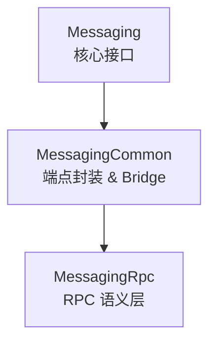
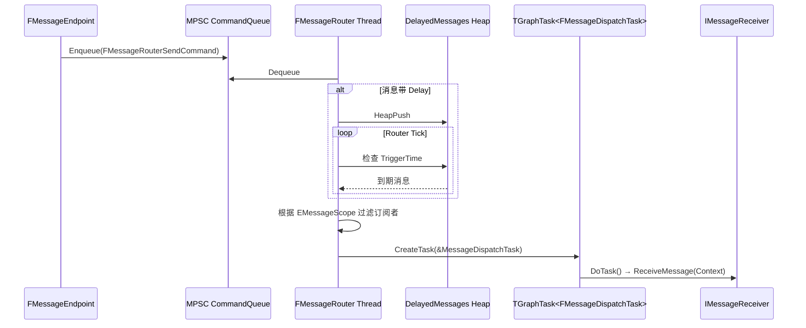
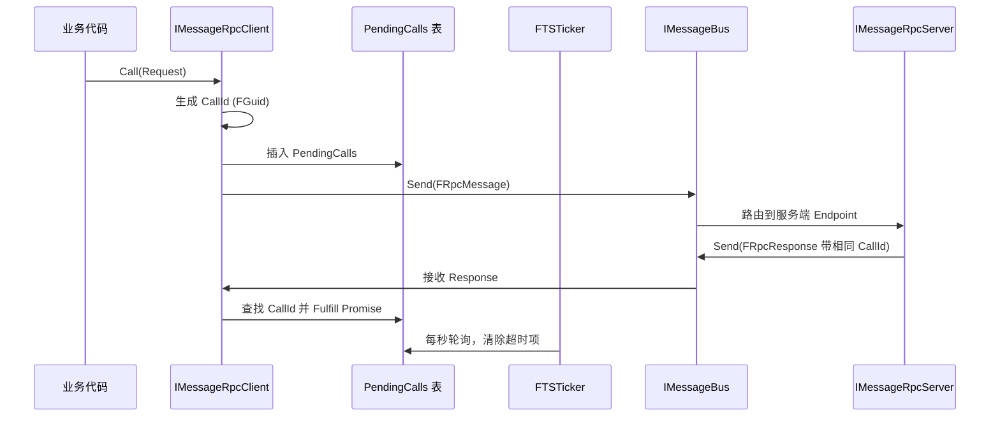

> [← 返回 UE全解析主索引]([[00-UE全解析主索引\|UE全解析主索引]])

## Why：为什么要学习 UE Messaging？

Unreal Engine 是一个**编辑器与运行时一体化**的超大型框架，内部存在大量跨模块、跨线程甚至跨进程的通信需求：

- **CookOnTheFly**：编辑器与运行中游戏之间实时传输 Shader、Texture；
- **SessionServices / TargetDeviceServices**：发现、连接、管理远程设备与调试会话；
- **SlateReflector**：UI 调试工具与 Slate 运行时的双向数据流；
- **Datasmith DirectLink**：CAD 数据在 DCC 与 UE 之间的实时同步；
- **ChaosSolverEngine**：物理集群节点间的任务分发与结果回收。

如果所有这些通信都通过直接函数调用完成，模块之间将形成密不透风的依赖网，任何一处的接口变动都会引发连锁编译失败。UE Messaging 模块提供了一套**基于 UScriptStruct 反射的异步消息总线**，彻底解耦了发送方与接收方，并原生支持**线程安全分发**与**跨进程桥接（Bridge）**。

> [!note] 核心收益
> - **解耦**：发送者只需知道消息类型（UScriptStruct），无需引用接收者模块；
> - **可扩展**：通过 `IMessageTransport` 插件化支持 UDP/TCP/SharedMemory 等传输；
> - **异步**：所有本地消息都通过独立路由器线程调度，避免阻塞 Game 线程；
> - **RPC 语义**：在异步消息之上封装了 Timeout、Retry、Future/Promise 模型。

---

## What：UE Messaging 是什么？

### 核心概念速览

| 概念 | 说明 | 关键源码 |
|------|------|----------|
| `IMessageBus` | 消息总线接口，定义订阅、发送、拦截、Transport 注册等能力 | `Runtime/Messaging/Public/IMessageBus.h` (L1-L200) |
| `IMessageContext` | 消息的元数据上下文（Sender、Scope、TimeSent、Expiration 等） | `Runtime/Messaging/Public/IMessageContext.h` (L1-L180) |
| `FMessageEndpoint` | 高层端点封装，提供 `Send`、`Publish`、`Subscribe`、`Forward` 等易用 API | `Runtime/MessagingCommon/Public/MessageEndpoint.h` (L1-L400) |
| `FMessageRouter` | 独立后台线程，维护 MPSC 命令队列与延迟消息堆 | `Runtime/Messaging/Private/MessageRouter.cpp` (L50-L500) |
| `IMessageTransport` | 跨进程传输抽象（由 `UdpMessaging` 等插件实现） | `Runtime/Messaging/Public/IMessageTransport.h` (L1-L150) |
| `FMessageBridge` | 桥接本地 Bus 与远程 Transport，实现跨进程透明通信 | `Runtime/MessagingCommon/Private/MessageBridge.cpp` (L1-L300) |
| `IMessageRpcClient` / `IMessageRpcServer` | RPC 层客户端与服务端接口 | `Runtime/MessagingRpc/Public/MessageRpcClient.h` (L1-L120) / `MessageRpcServer.h` (L1-L100) |

### EMessageScope：消息的生命周期范围

`EMessageScope` 决定了消息会被路由到哪些收件人（`Runtime/Messaging/Public/IMessageContext.h` L80-L120）：

```cpp
UENUM()
enum class EMessageScope : uint8
{
    Thread,   // 仅当前线程的订阅者
    Process,  // 仅当前进程的订阅者
    Network,  // 仅远程网络的订阅者
    All       // 全部（默认）
};
```

通过 Scope 控制，开发者可以精确地限定消息在**本地线程缓存**、**进程内广播**或**跨进程广播**之间的行为。

---

## How：如何使用与理解 UE Messaging？

下面按照 **UE 三层剥离法** 逐层深入：接口层 → 数据层 → 逻辑层。

### 一、接口层：Messaging / MessagingCommon / MessagingRpc

UE 将 Messaging 能力拆成了三个模块，依赖关系是严格的单向链：



#### 1. Messaging（核心接口）

`Runtime/Messaging/Public/IMessageBus.h` (L1-L200) 定义了总线的完整契约：

```cpp
class MESSAGING_API IMessageBus
{
public:
    virtual FMessageAddress GetAddress() const = 0;
    virtual void Intercept(const TSharedRef<IMessageInterceptor>& Interceptor) = 0;
    virtual void Register(const FName& Name, const TSharedRef<IMessageTransport>& Transport) = 0;
    virtual bool Send(const TSharedRef<IMessageContext>& Message) = 0;
    virtual TSharedPtr<IMessageSubscription, ESPMode::ThreadSafe> Subscribe(...) = 0;
    virtual void Unsubscribe(const TSharedPtr<IMessageSubscription, ESPMode::ThreadSafe>& Subscription) = 0;
    // ...
};
```

关键接口补充：
- `IMessageReceiver`：`ReceiveMessage(const TSharedRef<IMessageContext>& Context)` 是订阅者的统一入口（`Runtime/Messaging/Public/IMessageReceiver.h` L1-L60）；
- `IMessageTransportHandler`：Bridge 实现的回调接口，用于接收来自远程 Transport 的消息（`Runtime/Messaging/Public/IMessageTransportHandler.h` L1-L50）；
- `IMessageInterceptor`：消息拦截器，可在路由前修改或审计消息（`Runtime/Messaging/Public/IMessageInterceptor.h` L1-L50）。

#### 2. MessagingCommon（端点封装）

`FMessageEndpoint` 是日常开发中最常用的类（`Runtime/MessagingCommon/Public/MessageEndpoint.h` L1-L400）。它将底层 `IMessageBus` 的原始指针、弱引用、生命周期管理全部封装好：

```cpp
class FMessageEndpoint
{
public:
    template<typename MessageType>
    void Send(FMessageAddress Recipient, const MessageType& Message);

    template<typename MessageType, typename HandlerType>
    void Subscribe(const HandlerType& Handler);

    void Publish(const TSharedRef<IMessageContext, ESPMode::ThreadSafe>& Message);
    // ...
};
```

- **Builder 模式**：`FMessageEndpointBuilder`（`Runtime/MessagingCommon/Public/MessageEndpointBuilder.h` L1-L150）允许链式配置 Endpoint 名称、接收线程、错误回调、初始订阅等。
- **Handler 适配器**：`TRawMessageHandler` 和 `TFunctionMessageHandler`（`Runtime/MessagingCommon/Public/MessageHandler.h` L1-L120）将 Lambda、成员函数、原始指针统一适配为 `IMessageReceiver`。
- **Bridge 构建器**：`FMessageBridgeBuilder`（`Runtime/MessagingCommon/Public/MessageBridgeBuilder.h` L1-L80）用于快速将本地 Bus 挂载到某个 `IMessageTransport`。

#### 3. MessagingRpc（RPC 语义层）

RPC 模块在普通消息之上增加了 **Call / Return / Timeout / Progress** 语义。核心接口：

- `IMessageRpcClient`（`Runtime/MessagingRpc/Public/MessageRpcClient.h` L1-L120）：发起远程调用，返回 `TSharedPtr<IMessageRpcCall>`（内部封装了 `TPromise<TSharedPtr<const UScriptStruct>>`）。
- `IMessageRpcServer`（`Runtime/MessagingRpc/Public/MessageRpcServer.h` L1-L100）：注册 RPC Handler，自动将 Request 消息路由到对应的服务端函数。
- `DECLARE_RPC` 宏（`Runtime/MessagingRpc/Public/MessageRpcUtilities.h` L50-L150）：利用 UHT 生成一对 `Request` / `Response` 的 `UScriptStruct` 代码。

示例：
```cpp
DECLARE_RPC(ComputeShaderCompile, FShaderCompileRequest, FShaderCompileResponse);
```

该宏会生成 `FShaderCompileRequest` 和 `FShaderCompileResponse` 两个 USTRUCT，供 Endpoint 发送与接收。

---

### 二、数据层：FMessageRouter、MPSC 队列、地址簿与调用状态表

#### 1. FMessageRouter 与 MPSC 命令队列

`FMessageRouter` 是 Messaging 的心脏，运行在独立的后台线程（`Runtime/Messaging/Private/MessageRouter.cpp` L50-L500）。它的核心数据结构是一个 **MPSC（Multi-Producer Single-Consumer）无锁队列**：

```cpp
// Runtime/Messaging/Private/MessageRouter.h (L30-L80)
class FMessageRouter : public FRunnable
{
    TQueue<TSharedPtr<IMessageRouterCommand>, EQueueMode::Mpsc> CommandQueue;
    TArray<TDelayedMessage> DelayedMessages;  // 延迟消息最小堆
    // ...
};
```

所有对 Bus 的写操作（Send、Subscribe、Unsubscribe、RegisterTransport）都会被 Endpoint 或其他调用者**就地构造**为 `IMessageRouterCommand` 的派生对象，然后 `Enqueue` 到该队列中：

```cpp
// Runtime/Messaging/Private/MessageRouter.cpp (L120-L180)
bool FMessageRouter::Send(const TSharedRef<IMessageContext>& Message)
{
    CommandQueue.Enqueue(MakeShared<FMessageRouterSendCommand>(Message));
    return true;
}
```

> [!tip] MPSC 队列的优势
> 多个线程（Game 线程、Render 线程、Background 线程）可以同时向 Bus 发送消息，而无需加锁。只有 FMessageRouter 线程自己负责消费队列，避免了复杂的锁竞争。

#### 2. 地址簿：FMessageAddressBook

`FMessageAddressBook` 负责维护 `FMessageAddress`（本地 Endpoint 标识）与 `FGuid`（节点标识 / NodeId）之间的双向映射（`Runtime/MessagingCommon/Private/MessageAddressBook.cpp` L1-L120）：

```cpp
// Runtime/MessagingCommon/Private/MessageAddressBook.h (L1-L60)
class FMessageAddressBook
{
    TMap<FMessageAddress, FGuid> AddressToNode;
    TMap<FGuid, TArray<FMessageAddress>> NodeToAddresses;
};
```

在跨进程场景下，Bridge 通过地址簿判断一条消息的目标地址是否属于本地进程，还是应当通过 Transport 转发给远程 Node。

#### 3. RPC 调用状态表

RPC Client 内部维护了一张 Pending Call 表（`Runtime/MessagingRpc/Private/MessageRpcClient.cpp` L80-L180）：

```cpp
struct FMessageRpcCallState
{
    FGuid CallId;
    double StartTime;
    double Timeout;
    TPromise<TSharedPtr<const UScriptStruct>> Promise;
};

TMap<FGuid, FMessageRpcCallState> PendingCalls;
```

- `CallId` 是一个 `FGuid`，由客户端在发送 `FRpcMessage` 时生成并写入 Request 的载荷中；
- `Timeout` 默认 **3 秒**；
- `FTSTicker` 以 **1 秒** 为周期轮询该表，超时的 Call 会被设置为异常（`SetValue(nullptr)` 或抛出超时错误）。

#### 4. DelayedMessages 延迟消息堆

对于带有 `Delay` 或 `Expiration` 的消息，Router 不会立即分发，而是将其压入 `TArray<TDelayedMessage> DelayedMessages`，并在每轮循环中按 `TriggerTime` 排序检查（`Runtime/Messaging/Private/MessageRouter.cpp` L200-L300）：

```cpp
struct TDelayedMessage
{
    double TriggerTime;
    TSharedRef<IMessageContext> Message;
    bool operator<(const TDelayedMessage& Other) const { return TriggerTime > Other.TriggerTime; }
};
```

使用 `HeapPush` / `HeapPop` 实现最小堆，保证 $O(\log N)$ 的插入与取出效率。

---

### 三、逻辑层：消息路由流程、RPC 超时重试、跨进程 Bridge

#### 1. 消息路由完整流程



**详细步骤解析**：

1. **发送阶段**：`FMessageEndpoint::Send()` 将消息体（`UScriptStruct`）和 `IMessageContext` 打包为 `FMessageRouterSendCommand`，推入 `CommandQueue`（`Runtime/MessagingCommon/Private/MessageEndpoint.cpp` L150-L220）。
2. **路由阶段**：`FMessageRouter::Run()` 从 MPSC 队列中取出命令（`Runtime/Messaging/Private/MessageRouter.cpp` L250-L350）。如果是发送命令，Router 会遍历当前总线的所有订阅者，并根据 `EMessageScope` 和消息类型做过滤。
3. **延迟处理**：如果消息的 `GetDelay()` > 0，或当前时间尚未到达 `GetTimeSent()`，消息会被插入 `DelayedMessages` 堆，等待下一轮 Tick 处理。
4. **线程分发**：对于命中的订阅者，Router 不会直接调用其 `ReceiveMessage`，而是创建一个 `TGraphTask<FMessageDispatchTask>`（`Runtime/Messaging/Private/MessageDispatchTask.h` L1-L80）：
   ```cpp
   class FMessageDispatchTask
   {
       TWeakPtr<IMessageReceiver, ESPMode::ThreadSafe> Receiver;
       TSharedRef<IMessageContext, ESPMode::ThreadSafe> Context;
   public:
       void DoTask(ENamedThreads::Type CurrentThread, const FGraphEventRef& MyCompletionGraphEvent)
       {
           if (auto Pinned = Receiver.Pin())
           {
               Pinned->ReceiveMessage(Context);
           }
       }
   };
   ```
5. **执行阶段**：`FMessageDispatchTask` 根据订阅时指定的 `ENamedThreads`（如 `GameThread`、`RenderThread`、`AnyBackgroundThread`）被调度到对应线程执行，从而保证线程安全。

> [!warning] 关键约束
> `IMessageReceiver::ReceiveMessage` 的执行线程由订阅时决定，但消息的**构造与入队**可以发生在任意线程。这种设计使得 Messaging 成为 UE 内部跨线程通信的利器，但也要求 Handler 内部注意重入与生命周期管理。

#### 2. RPC 超时与重试机制

RPC 并非独立的网络协议，而是**在普通消息总线上构建的请求-响应协议**。

**客户端流程**（`Runtime/MessagingRpc/Private/MessageRpcClient.cpp` L150-L300）：



**超时控制代码**（`Runtime/MessagingRpc/Private/MessageRpcClient.cpp` L220-L280）：

```cpp
void FMessageRpcClient::Tick(float DeltaTime)
{
    const double Now = FPlatformTime::Seconds();
    for (auto It = PendingCalls.CreateIterator(); It; ++It)
    {
        if (Now - It.Value().StartTime > It.Value().Timeout)
        {
            It.Value().Promise.SetValue(nullptr);  // 超时返回空指针
            It.RemoveCurrent();
        }
    }
}
```

- **轮询间隔**：通过 `FTSTicker::GetCoreTicker().AddTicker(...)` 注册，默认 **1 秒**；
- **默认超时**：3 秒，可在 `Call` 时通过参数覆盖；
- **取消机制**：客户端可发送 `FMessageRpcCancel` 消息，服务端收到后终止处理；
- **进度报告**：长时 RPC 可通过 `FMessageRpcProgress` 向客户端发送中间状态；
- **异常处理**：若服务端找不到对应 Handler，会回复 `FMessageRpcUnhandled`。

#### 3. 跨进程 Bridge：FMessageBridge

`FMessageBridge` 是本地 Bus 与远程 Transport 之间的粘合剂（`Runtime/MessagingCommon/Private/MessageBridge.cpp` L1-L300）。它同时实现了三个接口：

```cpp
class FMessageBridge
    : public IMessageReceiver
    , public IMessageSender
    , public IMessageTransportHandler
{
    // ...
};
```

**工作流程**：

1. **发送外发消息**：本地 Endpoint 通过 Bus 发送一条 `EMessageScope::Network` 的消息。Bus 将该消息投递给所有 `IMessageSender`，其中就包括 Bridge。
2. **Bridge 转发**：`FMessageBridge::Send()` 查询 `FMessageAddressBook`，将目标 `FMessageAddress` 解析为远程 `NodeId`，然后调用 `IMessageTransport::TransportNodeMessage(NodeId, SerializedData)`（`Runtime/MessagingCommon/Private/MessageBridge.cpp` L120-L200）。
3. **序列化**：跨进程前，消息（`UScriptStruct`）需要通过 UObject 反射系统序列化为字节数组。这项工作通常由 Transport 插件内部调用 `TStructOpsTypeTraits` 或 `FMemoryWriter` + `FProperty::Serialize` 完成。具体实现见 `UdpMessaging` 插件，不在 Messaging 核心模块内。
4. **接收远程消息**：远程节点发送的字节流到达后，Transport 插件回调 `IMessageTransportHandler::ReceiveTransportMessage()`，由 `FMessageBridge` 反序列化并重新构造 `IMessageContext`，再通过 `IMessageBus::Send()` 注入本地总线。

> [!note] 序列化与反射的关联
> Messaging 强制要求所有消息必须是 `UScriptStruct`，这意味着它深度依赖 [[UE-CoreUObject-源码解析：反射系统与 UHT]] 的元数据。跨进程序列化本质上是对 `UProperty` / `FProperty` 的遍历与二进制打包，与 [[UE-Serialization-源码解析：Archive 序列化体系]] 共享同一套 `FArchive` 基础设施。

---

## 关联阅读

- [[UE-CoreUObject-源码解析：UObject 继承体系]]：理解 `UScriptStruct` 与 `UObject` 的元数据组织；
- [[UE-CoreUObject-源码解析：反射系统与 UHT]]：Messaging 消息的字段遍历、序列化依赖 UHT 生成的反射表；
- [[UE-Serialization-源码解析：Archive 序列化体系]]：Bridge 跨进程传输时对 `UScriptStruct` 的打包方式；
- [[UE-Core-源码解析：线程、任务与同步原语]]：`FMessageRouter` 的 MPSC 队列、`TGraphTask` 线程调度依赖的 TaskGraph 系统；
- [[UE-Engine-源码解析：Actor 与 Component 模型]]：Gameplay 层通过 Messaging 与编辑器服务通信的典型场景。

---

## 索引状态

- **所属位置**：UE 第三阶段 3.3
- **完成度**：✅
