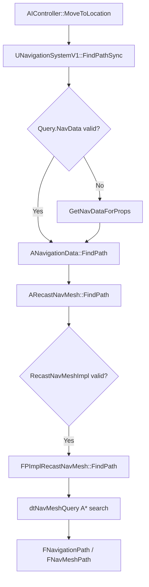
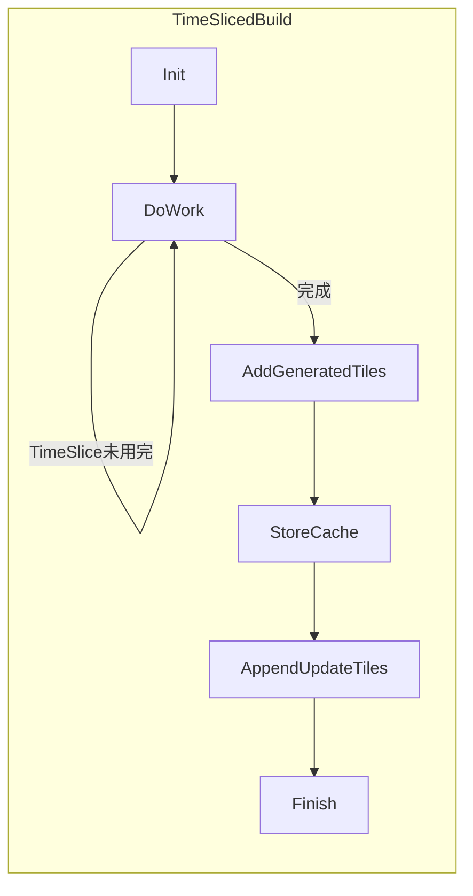

> [[00-UE全解析主索引|← 返回 UE全解析主索引]]

# UE-NavigationSystem-源码解析：导航与寻路

## Why：为什么要深入理解 NavigationSystem？

NavigationSystem 是 UE 中 AI 移动与寻路的 runtime 中枢。无论是简单的地面巡逻，还是复杂的大世界动态寻路，都需要理解导航网格的生成、查询与增量更新机制。掌握该模块的接口层与数据流，是优化 AI 性能、实现运行时动态障碍物与分层区域代价的前提。

## What：NavigationSystem 是什么？

- **`UNavigationSystemV1`**：世界级的导航中枢，管理所有 `ANavigationData` 实例，提供统一的同步/异步寻路、投影、采样 API。
- **`ANavigationData`**：所有导航数据的抽象基类，解耦不同导航后端（RecastNavMesh、NavGraph、AbstractNavData）。
- **`ARecastNavMesh`**：基于 Recast/Detour 的导航网格具体实现，承担 NavMesh 构建、Tile 管理与查询。
- **`FNavigationPath`**：共享路径数据结构，存储路径点、Observer 委托与查询元数据。

---

## 模块定位

- **UE 模块路径**：`Engine/Source/Runtime/NavigationSystem/`
- **Build.cs 文件**：`NavigationSystem.Build.cs`
- **核心依赖**：
  - `PublicDependencyModuleNames`：`Chaos`, `Core`, `CoreUObject`, `Engine`, `GeometryCollectionEngine`
  - `PrivateDependencyModuleNames`：`RHI`, `RenderCore`
  - Editor-only：`EditorFramework`, `UnrealEd`（循环引用）
  - 条件依赖：`Navmesh`（当 `Target.bCompileRecast == true`）
- **关键目录**：
  - `Public/`：55 个头文件，按 `NavAreas/`、`NavFilters/`、`NavGraph/`、`NavMesh/` 子系统划分
  - `Private/`：49 个 `.cpp` 实现文件

---

## 接口梳理（第 1 层）

### 核心头文件一览

| 头文件 | 核心类 | 职责 |
|--------|--------|------|
| `NavigationSystem.h` | `UNavigationSystemV1` | 世界级导航中枢，调度寻路与 NavData 生命周期 |
| `AbstractNavData.h` | `AAbstractNavData` | 抽象/直达路径的轻量实现 |
| `NavigationData.h` | `ANavigationData` | 所有导航数据的抽象基类 |
| `NavigationPath.h` | `FNavigationPath` / `UNavigationPath` | 路径数据结构与 UObject 包装器 |
| `RecastNavMesh.h` | `ARecastNavMesh` | Recast NavMesh 的具体实现 |
| `CrowdManagerBase.h` | `UCrowdManagerBase` | 人群管理抽象基类 |

### UNavigationSystemV1 核心接口

> 文件：`Engine/Source/Runtime/NavigationSystem/Public/NavigationSystem.h`

```cpp
// 同步/异步寻路
FPathFindingResult FindPathSync(const FNavAgentProperties&, FPathFindingQuery Query);
uint32 FindPathAsync(const FNavAgentProperties&, FPathFindingQuery Query, const FNavPathQueryDelegate& ResultDelegate);
bool TestPathSync(FPathFindingQuery Query) const;

// 随机采样
bool GetRandomPoint(FNavLocation& ResultLocation, ANavigationData* NavData = NULL);
bool GetRandomReachablePointInRadius(const FVector& Origin, float Radius, FNavLocation& ResultLocation) const;

// 投影
bool ProjectPointToNavigation(const FVector& Point, FNavLocation& OutLocation, const FVector& Extent = INVALID_NAVEXTENT) const;

// NavData 生命周期
virtual ERegistrationResult RegisterNavData(ANavigationData* NavData);
virtual void UnregisterNavData(ANavigationData* NavData);
virtual ANavigationData* GetNavDataForProps(const FNavAgentProperties& AgentProperties) const;
```

### ANavigationData 纯虚接口

> 文件：`Engine/Source/Runtime/NavigationSystem/Public/NavigationData.h`

```cpp
virtual FBox GetBounds() const PURE_VIRTUAL;
virtual bool ProjectPoint(const FVector& Point, FNavLocation& OutLocation, const FVector& Extent, ...) const PURE_VIRTUAL;
virtual bool GetRandomPoint(FNavLocation& OutLocation, ...) const PURE_VIRTUAL;
virtual bool GetRandomReachablePointInRadius(...) const PURE_VIRTUAL;
virtual ENavigationQueryResult::Type CalcPathCost(...) const PURE_VIRTUAL;
virtual ENavigationQueryResult::Type CalcPathLength(...) const PURE_VIRTUAL;
```

---

## 数据结构与行为分析（第 2 层）

### 导航数据层级

```
UWorld
└── UNavigationSystemV1 (UWorldSubsystem)
    ├── ANavigationData[]  (NavDataSet - UPROPERTY Transient)
    │   ├── AAbstractNavData（直达路径）
    │   ├── ANavigationGraph（图导航）
    │   └── ARecastNavMesh（Recast NavMesh）
    │       └── FPImplRecastNavMesh（PImpl 封装 dtNavMesh）
    │           └── dtNavMesh* DetourNavMesh
    ├── UCrowdManagerBase (TWeakObjectPtr)
    └── NavOctree（脏区管理）
```

### UNavigationSystemV1 的 UObject 生命周期

`UNavigationSystemV1` 继承自 `UNavigationSystemBase`，而后者是 `UWorldSubsystem`，因此其生命周期与 `UWorld` 绑定。

- **创建与初始化**：
  - `InitializeForWorld(UWorld& World, FNavigationSystemRunMode Mode)`（`Engine/Source/Runtime/NavigationSystem/Private/NavigationSystem.cpp`，第 3314~3317 行）调用 `OnWorldInitDone`。
  - `OnWorldInitDone`（第 1321~1483 行）完成实际初始化：设置 `OperationMode`、调用 `DoInitialSetup`、Gather Navigation Bounds、Register Navigation Data Instances、条件触发 `SpawnMissingNavigationData`。

- **GC 引用链**：
  - `NavDataSet`：`UPROPERTY(Transient) TArray<TObjectPtr<ANavigationData>>`，强引用，防止 NavData 被 GC（`Engine/Source/Runtime/NavigationSystem/Public/NavigationSystem.h`，第 426~427 行）。
  - `MainNavData`：`UPROPERTY(Transient) TObjectPtr<ANavigationData>`，指向默认导航数据（第 307~308 行）。
  - `CrowdManager`：`TWeakObjectPtr<UCrowdManagerBase>`，弱引用，由 `CreateCrowdManager` 生成，通常 Outer 为 NavigationSystem 自身或 World（第 443~444 行）。

- **销毁**：
  - `OnBeginTearingDown(UWorld* World)`（`NavigationSystem.cpp`，第 1312~1319 行）在 World  teardown 时触发 `CleanUp(FNavigationSystem::ECleanupMode::CleanupWithWorld)`，解注册 NavData 并清理 Octree。

### ARecastNavMesh 的内存布局

`ARecastNavMesh` 作为 `AActor` 派生类，其运行时导航数据并不直接存放在 Actor 的 UObject 成员中，而是通过 PImpl 模式下沉到 Private 实现：

- **RecastNavMeshImpl**：`FPImplRecastNavMesh* RecastNavMeshImpl`（`Engine/Source/Runtime/NavigationSystem/Public/NavMesh/RecastNavMesh.h`，第 1572 行）。这是 Public 头文件中唯一暴露的 Recast 相关指针，避免 Public 接口直接依赖 Recast/Detour 类型。
- **DetourNavMesh**：`FPImplRecastNavMesh` 内部持有 `dtNavMesh* DetourNavMesh`（`Public/NavMesh/PImplRecastNavMesh.h`，第 274 行），这是 Recast 库原生运行时查询对象。
- **Tile 数据存储位置**：
  - 运行时查询数据：存储在 `dtNavMesh` 内部管理的 Tile Pool 中（通过 `dtAllocNavMesh`、`addTile`、`removeTile` 操作）。
  - 序列化/加载时：`FPImplRecastNavMesh::Serialize`（`Private/NavMesh/PImplRecastNavMesh.cpp`，第 489~557 行）遍历 `DetourNavMesh->getTile(i)` 读写每个 Tile 的 data blob。
  - Compressed Tile Cache：`TMap<FIntPoint, TArray<FNavMeshTileData>> CompressedTileCacheLayers`（`PImplRecastNavMesh.h`，第 277 行）缓存已压缩的 Tile Cache 层，用于增量重建时复用。

> 文件：`Engine/Source/Runtime/NavigationSystem/Private/NavMesh/PImplRecastNavMesh.cpp`，第 451~476 行

```cpp
FPImplRecastNavMesh::FPImplRecastNavMesh(ARecastNavMesh* Owner)
    : NavMeshOwner(Owner)
    , DetourNavMesh(NULL)
{
    check(Owner && "Owner must never be NULL");
    // 统计导航内存占用
    INC_DWORD_STAT_BY(STAT_NavigationMemory, Owner->HasAnyFlags(RF_ClassDefaultObject) == false ? sizeof(*this) : 0);
};

FPImplRecastNavMesh::~FPImplRecastNavMesh()
{
    ReleaseDetourNavMesh();  // 调用 dtFreeNavMesh
    DEC_DWORD_STAT_BY(STAT_NavigationMemory, sizeof(*this));
};
```

### 寻路调用链（FindPathSync）



> 文件：`Engine/Source/Runtime/NavigationSystem/Private/NavigationSystem.cpp`，第 1833~1857 行

```cpp
FPathFindingResult UNavigationSystemV1::FindPathSync(const FNavAgentProperties& AgentProperties, FPathFindingQuery Query, EPathFindingMode::Type Mode)
{
    SCOPE_CYCLE_COUNTER(STAT_Navigation_PathfindingSync);
    if (Query.NavData.IsValid() == false)
    {
        Query.NavData = GetNavDataForProps(AgentProperties, Query.StartLocation);
    }
    FPathFindingResult Result(ENavigationQueryResult::Error);
    if (Query.NavData.IsValid())
    {
        if (Mode == EPathFindingMode::Hierarchical)
        {
            Result = Query.NavData->FindHierarchicalPath(AgentProperties, Query);
        }
        else
        {
            Result = Query.NavData->FindPath(AgentProperties, Query);
        }
    }
    return Result;
}
```

> 文件：`Engine/Source/Runtime/NavigationSystem/Private/NavMesh/RecastNavMesh.cpp`，第 3340~3400 行

```cpp
FPathFindingResult ARecastNavMesh::FindPath(const FNavAgentProperties& AgentProperties, const FPathFindingQuery& Query)
{
    SCOPE_CYCLE_COUNTER(STAT_Navigation_RecastPathfinding);
    const ANavigationData* Self = Query.NavData.Get();
    // ...
    Result.Result = RecastNavMesh->RecastNavMeshImpl->FindPath(
        Query.StartLocation, AdjustedEndLocation, Query.CostLimit,
        Query.bRequireNavigableEndLocation, *NavMeshPath, *NavFilter, Query.Owner.Get());
    // ...
    return Result;
}
```

### GetNavDataForProps 的 NavData 选择逻辑

> 文件：`Engine/Source/Runtime/NavigationSystem/Private/NavigationSystem.cpp`，第 2287~2347 行

```cpp
const ANavigationData* UNavigationSystemV1::GetNavDataForProps(const FNavAgentProperties& AgentProperties) const
{
    if (SupportedAgents.Num() <= 1)
    {
        return MainNavData;  // 快速路径：单 Agent 直接返回主数据
    }
    // 通过 AgentToNavDataMap 查找精确匹配
    const TWeakObjectPtr<ANavigationData>* NavDataForAgent = AgentToNavDataMap.Find(AgentProperties);
    // 未命中时做 Best Fit：比较 AgentRadius/Height 的 Excess 值
    // 优先选择 Radius 和 Height 均非负且最小的配置
    // ...
}
```

### ProjectPoint 调用链

> 文件：`Engine/Source/Runtime/NavigationSystem/Private/NavMesh/RecastNavMesh.cpp`，第 2035~2044 行

```cpp
bool ARecastNavMesh::ProjectPoint(const FVector& Point, FNavLocation& OutLocation, ...) const
{
    bool bSuccess = false;
    if (RecastNavMeshImpl)
    {
        bSuccess = RecastNavMeshImpl->ProjectPointToNavMesh(Point, OutLocation, Extent, GetRightFilterRef(Filter), QueryOwner);
    }
    return bSuccess;
}
```

内部通过 `dtNavMeshQuery::findNearestPoly` 实现投影，批量版本 `BatchProjectPoints` 会复用同一个 `dtNavMeshQuery` 实例以减少构造开销。

### RecastNavMeshGenerator 的 Time-Sliced 构建机制

`FRecastNavMeshGenerator` 是 `ARecastNavMesh` 的构建器，负责将碰撞几何体转换为 Recast Tile 数据。核心构建流程分为异步和同步 Time-Sliced 两条路径：

1. **异步构建**：`ProcessTileTasksAsyncAndGetUpdatedTiles`（`Engine/Source/Runtime/NavigationSystem/Private/NavMesh/RecastNavMeshGenerator.cpp`，第 6936~7056 行）将 Tile 生成任务提交到 `FAsyncTask` 池，在后台线程执行体素化、区域划分、多边形细化，主线程每帧轮询完成结果。
2. **同步 Time-Sliced 构建**：`ProcessTileTasksSyncTimeSlicedAndGetUpdatedTiles`（第 7058~7325 行）使用状态机 `EProcessTileTasksSyncTimeSlicedState` 将单个 Tile 的构建拆分到多帧执行：
   - `Init` → 从 PendingDirtyTiles 创建 `FRecastTileGenerator`
   - `DoWork` → 执行 Tile 构建的一步（受 `TimeSliceManager` 预算控制）
   - `AddGeneratedTiles` → 将构建好的 Tile Data 通过 `dtNavMesh->addTile` 注入
   - `StoreCompessedTileCacheLayers` → 保存压缩层缓存
   - `AppendUpdateTiles` → 收集更新的 Tile Refs
   - `Finish` → 清理状态，返回更新列表



### 多线程/性能分析

#### FindPathAsync 的异步委托机制

> 文件：`Engine/Source/Runtime/NavigationSystem/Private/NavigationSystem.cpp`，第 1917~2050 行

```cpp
uint32 UNavigationSystemV1::FindPathAsync(...)
{
    if (Query.NavData.IsValid())
    {
        FAsyncPathFindingQuery AsyncQuery(Query, ResultDelegate, Mode);
        if (AsyncQuery.QueryID != INVALID_NAVQUERYID)
        {
            AddAsyncQuery(AsyncQuery);  // 加入 GameThread 队列
        }
        return AsyncQuery.QueryID;
    }
    return INVALID_NAVQUERYID;
}

void UNavigationSystemV1::TriggerAsyncQueries(TArray<FAsyncPathFindingQuery>& PathFindingQueries)
{
    // 通过 FSimpleDelegateGraphTask 将 PerformAsyncQueries 派发到 TaskGraph 后台线程
    AsyncPathFindingTask = FSimpleDelegateGraphTask::CreateAndDispatchWhenReady(
        FSimpleDelegateGraphTask::FDelegate::CreateUObject(this, &UNavigationSystemV1::PerformAsyncQueries, PathFindingQueries),
        ...);
}

void UNavigationSystemV1::PerformAsyncQueries(TArray<FAsyncPathFindingQuery> PathFindingQueries)
{
    SCOPE_CYCLE_COUNTER(STAT_Navigation_PathfindingAsync);
    for (FAsyncPathFindingQuery& Query : PathFindingQueries)
    {
        if (const TStrongObjectPtr<const ANavigationData> NavData = Query.NavData.Pin())
        {
            Query.Result = NavData->FindPath(Query.NavAgentProperties, Query);
        }
        // 支持中断请求：若 bAbortAsyncQueriesRequested 为 true 则提前终止
        if (bAbortAsyncQueriesRequested) { break; }
    }
    AsyncPathFindingCompletedQueries.Append(...);  // 结果回传主线程
}
```

- **线程模型**：请求在 GameThread 收集，通过 `FSimpleDelegateGraphTask` 派发至 TaskGraph（通常为 BackgroundThreadPriority），批量执行寻路后再将结果追加到 `AsyncPathFindingCompletedQueries`，由主线程在下一 Tick 派发委托。
- **安全策略**：`Query.NavData` 在派发前被 `Pin()` 为 `TStrongObjectPtr`，防止后台线程执行期间 NavData 被 GC。

#### 脏区重建的预算控制

> 文件：`Engine/Source/Runtime/NavigationSystem/Private/NavigationDirtyAreasController.cpp`，第 54~117 行

```cpp
void FNavigationDirtyAreasController::Tick(const float DeltaSeconds, const TArray<ANavigationData*>& NavDataSet, bool bForceRebuilding)
{
    DirtyAreasUpdateTime += DeltaSeconds;
    const bool bCanRebuildNow = bForceRebuilding || (DirtyAreasUpdateFreq != 0.f && DirtyAreasUpdateTime >= (1.0f / DirtyAreasUpdateFreq));
    if (DirtyAreas.Num() > 0 && bCanRebuildNow)
    {
        // 若启用 ActiveTileGeneration，脏区会与 InvokersSeedBounds 求交后再下发
        for (ANavigationData* NavData : NavDataSet)
        {
            if (NavData) { NavData->RebuildDirtyAreas(...); }
        }
        DirtyAreasUpdateTime = 0.f;
        DirtyAreas.Reset();
    }
}
```

- **频率控制**：`DirtyAreasUpdateFreq` 默认 60，表示每帧都会尝试重建；若降低该值可减少每帧重建开销。
- **空间裁剪**：当启用 `IsActiveTilesGenerationEnabled`（大世界局部导航）时，脏区会与 `InvokersSeedBounds` 做交集，只重建 Invoker 附近的 Tile。
- **NavData 级预算**：实际 Tile 重建在 `FRecastNavMeshGenerator` 中通过 `TimeSliceManager` 限制每帧耗时，避免大脏区造成卡顿。

---

## 上下层关系（第 3 层）

### 数据流入流出路径

| 方向 | 交互模块 | 数据流路径 | 关键文件 |
|------|---------|-----------|---------|
| **上层** | `AIModule` | `AAIController::MoveToLocation/Actor` → `BuildPathfindingQuery` → `UNavigationSystemV1::FindPathSync` → `PathFollowingComponent::RequestMove` | `AIModule/Private/AIController.cpp:573~907` |
| **下层** | `Navmesh` (Recast) | `FRecastNavMeshGenerator` 调用 Recast API 生成 Tile → `FPImplRecastNavMesh` 通过 `dtNavMesh::addTile` 装载 → 查询时调用 `dtNavMeshQuery` | `NavigationSystem/Private/NavMesh/RecastNavMeshGenerator.cpp`, `PImplRecastNavMesh.cpp` |
| **同层** | `Chaos` | `AddLevelCollisionToOctree` 采集 `ULevel::GetStaticNavigableGeometry()` → `FRecastNavMeshGenerator` 通过 `ExportChaosTriMesh` 将 Chaos `FTriangleMeshImplicitObject` 导出为 Recast 顶点/索引缓冲 | `NavigationDataHandler.cpp:570~611`, `RecastNavMeshGenerator.cpp:358` |
| **渲染** | `RHI` / `RenderCore` | `UNavMeshRenderingComponent` 遍历 `ARecastNavMesh` 的 Tile 数据生成 Debug 网格，提交到渲染线程绘制 | `Public/NavMesh/NavMeshRenderingComponent.h` |
| **编辑器** | `UnrealEd` | 编辑器加载世界后触发 `RebuildAll(bIsLoadTime)`；属性变更通过 `SetNavigationAutoUpdateEnabled` 控制自动重建；构建完成广播 `OnNavigationGenerationFinishedDelegate` | `NavigationSystem.cpp:1441~1466`, `Public/NavigationSystem.h:438` |

### 与 AIModule 的详细交互

> 文件：`Engine/Source/Runtime/AIModule/Private/AIController.cpp`，第 573~907 行

```cpp
// 1. 入口：蓝图/脚本调用 MoveToActor 或 MoveToLocation
EPathFollowingRequestResult::Type AAIController::MoveToLocation(const FVector& Dest, ...)
{
    // 构造 FAIMoveRequest
    return MoveTo(MoveReq);
}

// 2. 构建查询
bool AAIController::BuildPathfindingQuery(const FAIMoveRequest& MoveRequest, const FVector& StartLocation, FPathFindingQuery& OutQuery) const
{
    const ANavigationData* NavData = MoveRequest.IsUsingPathfinding()
        ? NavSys->GetNavDataForProps(GetNavAgentPropertiesRef(), GetNavAgentLocation())
        : NavSys->GetAbstractNavData();
    FSharedConstNavQueryFilter NavFilter = UNavigationQueryFilter::GetQueryFilter(*NavData, this, MoveRequest.GetNavigationFilter());
    OutQuery = FPathFindingQuery(*this, *NavData, StartLocation, GoalLocation, NavFilter);
    // PathFollowingComponent 可对 Query 做最后调整
    PathFollowingComponent->OnPathfindingQuery(OutQuery);
    return true;
}

// 3. 执行寻路并移动
void AAIController::FindPathForMoveRequest(const FAIMoveRequest& MoveRequest, FPathFindingQuery& Query, FNavPathSharedPtr& OutPath) const
{
    FPathFindingResult PathResult = NavSys->FindPathSync(Query);
    if (PathResult.IsSuccessful())
    {
        PathResult.Path->EnableRecalculationOnInvalidation(true);
        OutPath = PathResult.Path;
    }
}
// 随后通过 RequestMove(MoveRequest, OutPath) 驱动 PathFollowingComponent 沿路径移动
```

### 与 Chaos 的详细交互

导航网格的输入几何来源于 Chaos 碰撞体。`FRecastNavMeshGenerator` 在构建 Tile 时，从 `FNavigationOctree` 中读取 `FNavigationRelevantData`，其中包含已缓存的碰撞数据：

> 文件：`Engine/Source/Runtime/NavigationSystem/Private/NavMesh/RecastNavMeshGenerator.cpp`，第 358~374 行

```cpp
void ExportChaosTriMesh(const Chaos::FTriangleMeshImplicitObject* const TriMesh, const FTransform& LocalToWorld
    , TNavStatArray<FVector::FReal>& VertexBuffer, TNavStatArray<int32>& IndexBuffer, FBox& UnrealBounds)
{
    using namespace Chaos;
    int32 NumTris = Triangles.Num();
    const Chaos::FTriangleMeshImplicitObject::ParticlesType& Vertices = TriMesh->Particles();
    // 将 Chaos 粒子系统顶点/索引转换为 Recast 坐标系下的缓冲
}
```

Level 级别的静态几何则通过 `AddLevelCollisionToOctree` 注入：

> 文件：`Engine/Source/Runtime/NavigationSystem/Private/NavigationDataHandler.cpp`，第 570~611 行

```cpp
void FNavigationDataHandler::AddLevelCollisionToOctree(ULevel& Level)
{
    const TArray<FVector>* LevelGeom = Level.GetStaticNavigableGeometry();
    FRecastGeometryExport::ExportVertexSoupGeometry(*LevelGeom, *BSPElem.Data);
    OctreeController.NavOctree->AddNode(Bounds, BSPElem);
    DirtyAreasController.AddArea(Bounds, ENavigationDirtyFlag::All, ...);
}
```

### 与 UnrealEd 的详细交互

编辑器模式下，NavigationSystem 的行为与运行时有所差异：

- **自动重建开关**：`bNavigationAutoUpdateEnabled` 控制编辑器中场景变更后是否自动重建导航。
- **加载时重建**：`OnWorldInitDone` 中，若 `FNavigationSystem::IsEditorRunMode(OperationMode)` 为真且自动更新开启，则调用 `RebuildAll(bIsLoadTime = true)`（`NavigationSystem.cpp`，第 1461~1465 行）。
- **构建完成回调**：`OnNavigationGenerationFinished(ANavigationData& NavData)`（第 4909~4922 行）广播 `OnNavigationGenerationFinishedDelegate`，编辑器可订阅此委托更新 UI 或输出 Log。
- **Undo/Redo 保护**：`FPImplRecastNavMesh::Serialize` 中通过 `!Ar.IsTransacting()` 跳过事务期间的 Tile 序列化，防止 Undo 时写入脏数据。

---

## 设计亮点与可迁移经验

1. **ANavigationData 抽象层**：通过纯虚接口将寻路后端与上层 AI 解耦，方便接入自定义导航算法（如流场、体素导航）。
2. **PImpl 模式**：`FPImplRecastNavMesh` 将第三方库（Recast）细节隐藏在 Private 实现中，保持 Public 接口的稳定性与可替换性。
3. **Time-Sliced 构建**：Tile 级增量重建 + 分帧预算控制，使大世界导航网格可以在运行时动态更新而不造成明显卡顿。
4. **NavOctree 脏区管理**：空间八叉树加速脏区聚合，减少重复重建面积。
5. **异步寻路批处理 + 强引用 Pin**：`FindPathAsync` 并非单查询单线程，而是每帧批量收集后通过 `FSimpleDelegateGraphTask` 统一派发；后台线程用 `TStrongObjectPtr` Pin NavData，防止 GC 导致的悬空指针。**可迁移原理**：将高频小任务攒批成低频次批量任务，用强引用锁保证跨线程对象安全。
6. **Agent To NavData 的 Best Fit 匹配**：`GetNavDataForProps` 在精确匹配失败时，通过 excess radius/height 的优先级规则选择最合适的 NavData，而非简单回退到默认值。**可迁移原理**：多 Agent 类型共存时，建立 "精确匹配 → 最小冗余匹配 → 降级匹配" 的分层选择策略，避免错误导航数据导致寻路失败。
7. **World Partition 与 Active Tile Generation 的联动**：脏区重建时通过与 `InvokersSeedBounds` 求交，仅重建 Invoker 附近区域，避免全图遍历。**可迁移原理**：大世界局部更新系统应将 "变更集合" 与 "兴趣区域集合" 做交集过滤，再下发到具体构建器，实现 O(局部) 而非 O(全局) 的更新复杂度。

---

## 关键源码片段

> 文件：`Engine/Source/Runtime/NavigationSystem/Public/NavigationSystem.h`，第 307~308 行、第 426~427 行、第 443~444 行

```cpp
UPROPERTY(Transient)
TObjectPtr<ANavigationData> MainNavData;

UPROPERTY(Transient)
TArray<TObjectPtr<ANavigationData>> NavDataSet;

TWeakObjectPtr<UCrowdManagerBase> CrowdManager;
```

> 文件：`Engine/Source/Runtime/NavigationSystem/Public/NavMesh/RecastNavMesh.h`，第 1570~1573 行

```cpp
/** Engine Private! - Private Implementation details of ARecastNavMesh */
FPImplRecastNavMesh* RecastNavMeshImpl;
```

> 文件：`Engine/Source/Runtime/NavigationSystem/Public/NavMesh/PImplRecastNavMesh.h`，第 271~277 行

```cpp
ARecastNavMesh* NavMeshOwner;
/** Recast's runtime navmesh data that we can query against */
dtNavMesh* DetourNavMesh;
/** Compressed layers data, can be reused for tiles generation */
TMap<FIntPoint, TArray<FNavMeshTileData> > CompressedTileCacheLayers;
```

> 文件：`Engine/Source/Runtime/NavigationSystem/Private/NavigationSystem.cpp`，第 1917~1939 行

```cpp
uint32 UNavigationSystemV1::FindPathAsync(const FNavAgentProperties& AgentProperties, FPathFindingQuery Query, const FNavPathQueryDelegate& ResultDelegate, EPathFindingMode::Type Mode)
{
    SCOPE_CYCLE_COUNTER(STAT_Navigation_RequestingAsyncPathfinding);
    if (Query.NavData.IsValid() == false)
    {
        Query.NavData = GetNavDataForProps(AgentProperties, Query.StartLocation);
    }
    if (Query.NavData.IsValid())
    {
        FAsyncPathFindingQuery AsyncQuery(Query, ResultDelegate, Mode);
        if (AsyncQuery.QueryID != INVALID_NAVQUERYID)
        {
            AddAsyncQuery(AsyncQuery);
        }
        return AsyncQuery.QueryID;
    }
    return INVALID_NAVQUERYID;
}
```

> 文件：`Engine/Source/Runtime/NavigationSystem/Private/NavMesh/RecastNavMeshGenerator.cpp`，第 7058~7063 行

```cpp
TArray<FNavTileRef> FRecastNavMeshGenerator::ProcessTileTasksSyncTimeSlicedAndGetUpdatedTiles()
{
    QUICK_SCOPE_CYCLE_COUNTER(STAT_RecastNavMeshGenerator_ProcessTileTasksSyncTimeSliced);
    CSV_SCOPED_TIMING_STAT(NAVREGEN, ProcessTileTasksSyncTimeSliced);
    LLM_SCOPE(ELLMTag::NavigationRecast);
    check(SyncTimeSlicedData.TimeSliceManager);
    // ...
}
```

---

## 关联阅读

- [[UE-Engine-源码解析：World 与 Level 架构]]
- [[UE-Engine-源码解析：Actor 与 Component 模型]]
- [[UE-AIModule-源码解析：AI 与行为树]]（待产出）
- [[UE-Chaos-源码解析：Chaos 物理引擎]]

---

## 索引状态

- **所属阶段**：第三阶段 3.4 空间、物理与导航
- **分析完成度**：第一轮 ✅，第二轮 ✅，第三轮 ✅，整体完成度：骨架扫描 + 数据结构/行为分析 + 关联辐射
