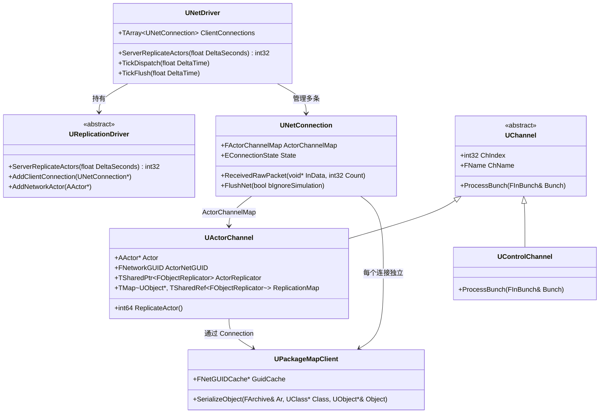
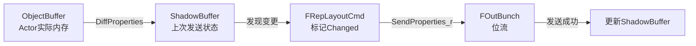
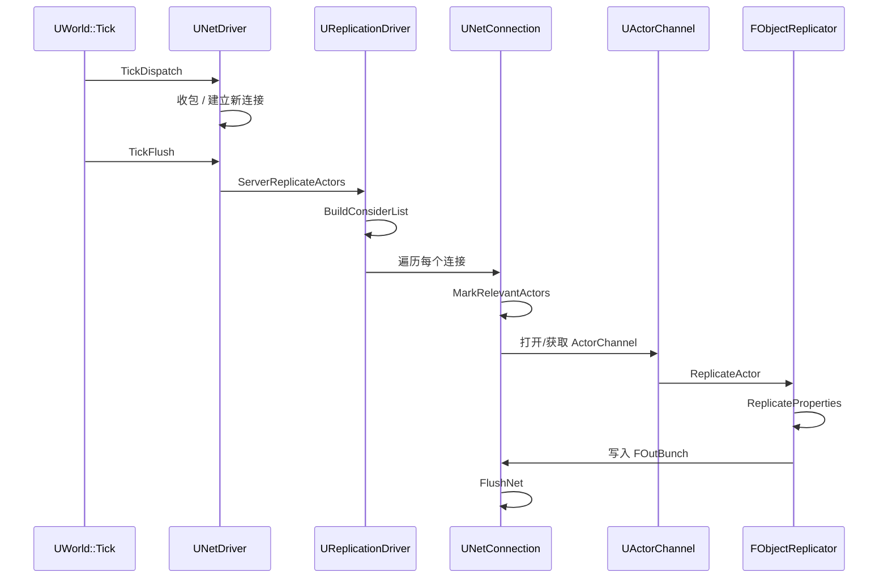
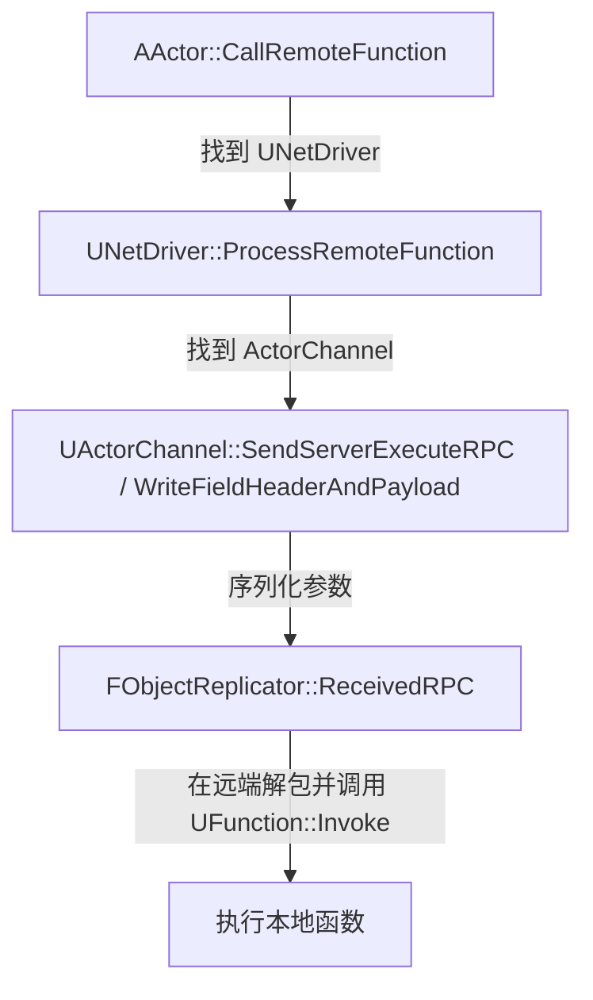
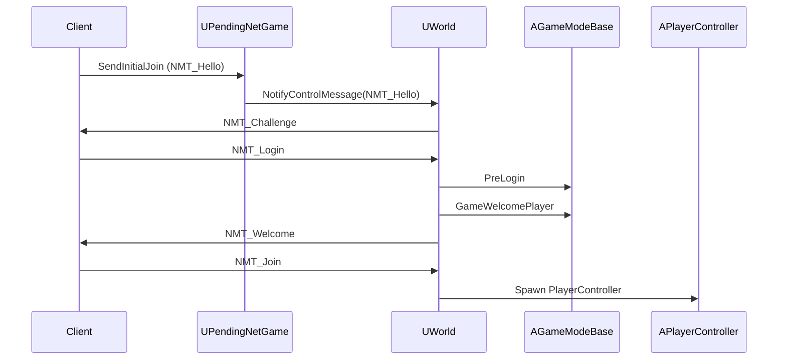

> [← 返回 UE全解析主索引]([[00-UE全解析主索引\|UE全解析主索引]])

# Why：为什么要深入理解 UE Replication？

- **状态一致性是网络游戏的根问题**。单机引擎只需关心一帧内的 Tick 顺序，而网络引擎必须在带宽、延迟、丢包三重约束下，让多个远端终端对世界状态达成可接受的共识。UE 的 Replication 体系是这一共识的底层实现。
- **Replication 打通了反射、序列化、Socket 三层**。不理解 NetDriver→Connection→Channel 的层级关系，就无法定位“为什么某个 Actor 没同步下来”“RPC 为什么丢包”“带宽瓶颈到底卡在哪一帧”。
- **它是自研引擎网络层的最重要参照**。UE 的 Property Replication（基于 ShadowBuffer + Diff）、NetGUID 对象引用序列化、FastArraySerializer、PushModel 等机制，都是历经大型项目验证的工程方案，提取其通用原理可直接迁移到自定义网络架构中。

---

# What：Replication 是什么？—— 接口层剖析

## 模块地图

网络同步功能主要分布在两个模块中：

| 模块 | 路径 | 职责 |
|------|------|------|
| **NetCore** | `Engine/Source/Runtime/Net/Core/` | 提供底层网络抽象：PushModel、FastArraySerializer、NetToken、NetConditionGroup、RepChangedPropertyTracker 等 |
| **Engine** | `Engine/Source/Runtime/Engine/` | 提供高层网络对象：UNetDriver、UNetConnection、UChannel、UActorChannel、UPackageMapClient、UReplicationDriver |

> 文件：`Engine/Source/Runtime/Engine/Source/Engine.Build.cs`，第 85~95 行附近

```cpp
PublicDependencyModuleNames.AddRange(
    new string[] {
        "NetCore",
        // ...
    }
);
PrivateIncludePaths.AddRange(
    new string[] {
        "Runtime/Net/Core/Private",
        // ...
    }
);
```

Engine 模块通过 `PublicDependencyModuleNames` 显式依赖 NetCore，同时通过 `PrivateIncludePaths` 包含 NetCore 的私有实现头，保证高层网络对象能直接调用底层序列化细节。

## 核心 UObject 接口边界

### UNetDriver —— 网络总控

> 文件：`Engine/Source/Runtime/Engine/Classes/Engine/NetDriver.h`，第 31~75 行

```cpp
UCLASS(abstract, transient)
class ENGINE_API UNetDriver : public UObject
{
    GENERATED_BODY()
public:
    /** 当前驱动的所有连接（Server 端为多个 Client，Client 端只有一个 Server） */
    TArray<TObjectPtr<UNetConnection>> ClientConnections;
    
    /** Server 端的核心复制循环 */
    virtual int32 ServerReplicateActors(float DeltaSeconds);
    
    /** 每帧网络分发的入口 */
    virtual void TickDispatch(float DeltaTime);
    
    /** 发送端刷新 */
    virtual void TickFlush(float DeltaTime);
};
```

UNetDriver 是 Replication 的顶层调度器。每个 `UWorld` 通常挂载一个 Game NetDriver（标准游戏流量），Replay 和 Beacon 则使用独立的 NetDriver 实例。

### UNetConnection —— 单条连接的抽象

> 文件：`Engine/Source/Runtime/Engine/Classes/Engine/NetConnection.h`，第 91~100 行

```cpp
enum EConnectionState
{
    USOCK_Invalid   = 0,
    USOCK_Closed    = 1,
    USOCK_Pending   = 2,
    USOCK_Open      = 3,
    USOCK_Closing   = 4,
};
```

```cpp
// 第 64 行
typedef TMap<TWeakObjectPtr<AActor>, UActorChannel*> FActorChannelMap;
```

UNetConnection 代表一条端到端的网络连接，维护 `FActorChannelMap`（Actor 到 Channel 的映射）、可靠缓冲区、分组序列号（PacketId）、带宽限制等。

### UChannel / UActorChannel —— 数据通道

> 文件：`Engine/Source/Runtime/Engine/Classes/Engine/Channel.h`（UChannel 基类）
> 文件：`Engine/Source/Runtime/Engine/Classes/Engine/ActorChannel.h`，第 46~100 行

UActorChannel 的注释直接给出了其 Bunch 的物理布局：

```cpp
/**
 * An ActorChannel bunch looks like this:
 *
 * +----------------------+---------------------------------------------------------------------------+
 * | SpawnInfo            | (Spawn Info) Initial bunch only                                           |
 * |  -Actor Class        |   -Created by ActorChannel                                                |
 * |  -Spawn Loc/Rot      |                                                                           |
 * | NetGUID assigns      |                                                                           |
 * |  -Actor NetGUID      |                                                                           |
 * |  -Component NetGUIDs |                                                                           |
 * +----------------------+---------------------------------------------------------------------------+
 * | NetGUID ObjRef       | (Content chunks) x number of replicating objects (Actor + any components) |
 * |                      |   -Each chunk created by its own FObjectReplicator instance.              |
 * +----------------------+---------------------------------------------------------------------------+
 * | Properties...        |                                                                           |
 * | RPCs...              |                                                                           |
 * +----------------------+---------------------------------------------------------------------------+
 * | </End Tag>           |                                                                           |
 * +----------------------+---------------------------------------------------------------------------+
 */
```

关键成员：

```cpp
// 第 85~86 行
UPROPERTY()
TObjectPtr<AActor> Actor;

// 第 88 行
FNetworkGUID ActorNetGUID;

// 第 130~132 行
TSharedPtr<FObjectReplicator> ActorReplicator;
TMap< UObject*, TSharedRef< FObjectReplicator > > ReplicationMap;
```

### UPackageMapClient —— NetGUID 与对象映射

> 文件：`Engine/Source/Runtime/Engine/Classes/Engine/PackageMapClient.h`，第 1~20 行

```cpp
/**
 * PackageMap implementation that is client/connection specific.
 * On the server, each client will have their own instance of UPackageMapClient.
 *
 * UObject 先被序列化为 <NetGUID, Name/Path> 对。UPackageMapClient 追踪每个 NetGUID 的使用，
 * 知道何时被 ACK。一旦 ACK，对象就仅序列化为 <NetGUID>。
 */
```

NetGUID 是 UE 网络对象引用的核心：首次发送写 `GUID + PathName`，后续只写 `GUID`，极大压缩带宽。

### UReplicationDriver —— 复制策略的抽象

> 文件：`Engine/Source/Runtime/Engine/Classes/Engine/ReplicationDriver.h`，第 46~111 行

```cpp
UCLASS(abstract, transient, config=Engine)
class UReplicationDriver : public UObject
{
    GENERATED_BODY()
public:
    virtual void SetRepDriverWorld(UWorld* InWorld) PURE_VIRTUAL(...);
    virtual void InitForNetDriver(UNetDriver* InNetDriver) PURE_VIRTUAL(...);
    virtual void AddClientConnection(UNetConnection* NetConnection) PURE_VIRTUAL(...);
    virtual void AddNetworkActor(AActor* Actor) PURE_VIRTUAL(...);
    virtual int32 ServerReplicateActors(float DeltaSeconds) PURE_VIRTUAL(...);
};
```

UE 默认的复制策略在 `UNetDriver::ServerReplicateActors` 中实现，但大型项目通常接入 **Replication Graph**（派生自 `UReplicationDriver`）来做分帧、分区域、分优先级的批量复制。

## 接口层类图



---

# How：Replication 如何工作？—— 数据层 + 逻辑层

## 数据层：核心结构与内存布局

### FOutBunch / FInBunch —— 网络数据包的原子单元

> 文件：`Engine/Source/Runtime/Engine/Public/Net/DataBunch.h`，第 20~121 行

```cpp
class FOutBunch : public FNetBitWriter
{
public:
    FOutBunch *Next;
    UChannel *Channel;
    int32 ChIndex;
    FName ChName;
    int32 ChSequence;
    int32 PacketId;
    uint8 bOpen:1;
    uint8 bClose:1;
    uint8 bReliable:1;
    uint8 bPartial:1;
    uint8 bPartialInitial:1;
    uint8 bPartialFinal:1;
    uint8 bHasPackageMapExports:1;
    uint8 bHasMustBeMappedGUIDs:1;
    EChannelCloseReason CloseReason;
    TArray<FNetworkGUID> ExportNetGUIDs;
    TArray<UE::Net::FNetToken> NetTokensPendingExport;
};
```

`FOutBunch` 继承自 `FNetBitWriter`，以**位**为单位写入数据。一个 Packet 可由多个 Bunch 组成，Bunch 可在通道（Channel）层面切分（`bPartialInitial / bPartialFinal`）。

```cpp
// 第 126~148 行
class FInBunch : public FNetBitReader
{
public:
    int32 PacketId;
    FInBunch *Next;
    UNetConnection *Connection;
    int32 ChIndex;
    FName ChName;
    int32 ChSequence;
    uint8 bOpen:1;
    uint8 bClose:1;
    uint8 bReliable:1;
    uint8 bPartial:1;
    uint8 bHasPackageMapExports:1;
    uint8 bHasMustBeMappedGUIDs:1;
    uint8 bIgnoreRPCs:1;
};
```

> [!tip] Bunch vs Packet
> - **Packet**：UDP/TCP 一次发送的物理数据单元，由 NetConnection 组装/解析。
> - **Bunch**：逻辑数据单元，隶属于某个 Channel。一个 Packet 可包含多个 Bunch，一个大的 Bunch 也可拆成多个 Partial Bunch 跨 Packet 发送。

### FRepLayout / FRepState —— 属性复制的元数据与状态

> 文件：`Engine/Source/Runtime/Engine/Public/Net/RepLayout.h`，第 1~170 行

`FRepLayout` 是 UE 网络属性复制的核心数据结构。它基于 `UClass`/`UStruct` 的反射元数据，在运行时构建出一套“扁平化”的复制命令列表（`FRepLayoutCmd`），每个命令对应一个需要网络同步的 `FProperty`。

```cpp
// 第 115~121 行
template<ERepDataBufferType DataType> using TRepDataBuffer = ...;
template<ERepDataBufferType DataType> using TConstRepDataBuffer = ...;
typedef TRepDataBuffer<ERepDataBufferType::ObjectBuffer> FRepObjectDataBuffer;
typedef TRepDataBuffer<ERepDataBufferType::ShadowBuffer> FRepShadowDataBuffer;
```

`FRepLayout` 区分两种内存视图：
- **ObjectBuffer**：对象在 UObject 内存中的实际地址。
- **ShadowBuffer**：按 `FRepLayoutCmd` 紧凑排列的“上次已发送状态”副本，用于 Diff。

> 文件：`Engine/Source/Runtime/Engine/Private/RepLayout.cpp`，第 5142~5160 行（DiffProperties）

```cpp
bool FRepLayout::DiffProperties(
    TArray<FProperty*>* OutChangedProperties,
    TConstRepDataBuffer<DstType> Dst,
    TConstRepDataBuffer<SrcType> Src,
    const EDiffPropertiesFlags DiffFlags) const
{
    // 遍历所有 FRepLayoutCmd，按位比较 ObjectBuffer 与 ShadowBuffer
    // 若值不同，则标记为 Changed 并写入 OutChangedProperties
}
```

### FObjectReplicator —— 单对象复制的执行器

> 文件：`Engine/Source/Runtime/Engine/Public/Net/DataReplication.h`，第 55~170 行

```cpp
class FObjectReplicator
{
public:
    ENGINE_API void InitWithObject(UObject* InObject, UNetConnection* InConnection, bool bUseDefaultState = true);
    ENGINE_API void StartReplicating(class UActorChannel* InActorChannel);
    ENGINE_API bool ReplicateProperties(FOutBunch& Bunch, FReplicationFlags RepFlags);
    ENGINE_API bool ReceivedBunch(FNetBitReader& Bunch, const FReplicationFlags& RepFlags, const bool bHasRepLayout, bool& bOutHasUnmapped);
    ENGINE_API bool ReceivedRPC(FNetBitReader& Reader, TSet<FNetworkGUID>& OutUnmappedGuids, bool& bOutSkippedRpcExec, ...);
};
```

每个被网络复制的对象（Actor 或 Subobject）都会对应一个 `FObjectReplicator`，它持有：
- `FRepLayout* RepLayout`：该对象类型的复制布局。
- `FSendingRepState* SendingRepState`：发送端状态（含 ShadowBuffer、Changlist）。
- `FReceivingRepState* ReceivingRepState`：接收端状态。

### FNetGUIDCache —— 对象到 GUID 的全局映射

> 文件：`Engine/Source/Runtime/Engine/Classes/Engine/PackageMapClient.h`，第 119~141 行

```cpp
class FNetGuidCacheObject
{
public:
    TWeakObjectPtr<UObject> Object;
    FNetworkGUID OuterGUID;
    FName PathName;
    uint32 NetworkChecksum;
    uint8 bNoLoad:1;
    uint8 bIgnoreWhenMissing:1;
    uint8 bIsPending:1;
    uint8 bIsBroken:1;
};
```

`FNetGUIDCache` 维护 `NetworkGUID → FNetGuidCacheObject` 的全局映射。Server 在首次向某个 Client 发送对象引用时，会通过 `UPackageMapClient::SerializeObject` 写出 `NetGUID + OuterGUID + PathName`；Client 收到后通过 PathName 异步加载对象，加载完成后再解析后续只含 NetGUID 的引用。

### ShadowBuffer + Diff 机制

Property Replication 的核心流程：

1. **初始化**：`FObjectReplicator::InitRecentProperties` 将对象当前内存拷贝到 `ShadowBuffer`。
2. **Diff**：每帧调用 `FRepLayout::DiffProperties`，逐 `FRepLayoutCmd` 比较 `ObjectBuffer` 与 `ShadowBuffer`。
3. **发送**：`FRepLayout::SendProperties_r` 将变更属性按位写入 `FOutBunch`。
4. **合并**：发送成功后，`ShadowBuffer` 更新为最新状态，供下一帧 Diff 使用。



## 逻辑层：关键函数调用链

### 1. 服务端 Actor 复制主循环

> 文件：`Engine/Source/Runtime/Engine/Private/NetDriver.cpp`，第 6085~6150 行

```cpp
int32 UNetDriver::ServerReplicateActors(float DeltaSeconds)
{
    // 1. 构建 Consider List（世界中所有可能被复制的 Actor）
    ServerReplicateActors_BuildConsiderList(...);
    
    // 2. 对每个连接，计算 Relevancy 和 Priority
    ServerReplicateActors_MarkRelevantActors(...);
    
    // 3. 对每个连接执行分帧复制
    ServerReplicateActors_ForConnection(...);
    
    // 4. 刷新所有连接的出站包
    for (UNetConnection* Connection : ClientConnections)
    {
        Connection->FlushNet();
    }
}
```

调用链拆解：



### 2. 属性复制调用链

> 文件：`Engine/Source/Runtime/Engine/Private/DataReplication.cpp`，第 1914~1950 行

```cpp
bool FObjectReplicator::ReplicateProperties(FOutBunch& Bunch, FReplicationFlags RepFlags)
{
    FNetBitWriter Writer(Bunch);
    
    // 1. Diff 当前 ObjectBuffer 与 ShadowBuffer
    // 2. 构建 ConditionMap（基于 RepFlags 的 bNetOwner / bNetSimulated 等）
    // 3. 调用 RepLayout->SendProperties_r 序列化变更属性
    RepLayout->SendProperties_r(
        SendingRepState,
        Writer,
        ...
    );
    
    // 4. 将 Writer 的数据追加到 Bunch
    Bunch.SerializeBits(Writer.GetData(), Writer.GetNumBits());
}
```

> 文件：`Engine/Source/Runtime/Engine/Private/RepLayout.cpp`，第 2767~2830 行

```cpp
void FRepLayout::SendProperties_r(
    FRepState* RepState,
    FNetBitWriter& Writer,
    bool bDoChecksum,
    FRepHandleIterator& HandleIterator,
    FRepObjectDataBuffer Data,
    int32 ArrayDepth,
    ...)
{
    // 递归遍历属性树
    // 对数组：先写 ArrayNum，再递归每个元素
    // 对普通属性：写 Handle（或 Name），再写属性值
}
```

### 3. RPC 调用链

RPC（Remote Procedure Call）分为三类：`Client`、`Server`、`NetMulticast`。其底层都走 `FObjectReplicator::ReceivedRPC` 或 `CallRemoteFunction`。

以 Server RPC 为例（Client → Server）：



> [!warning] RPC 可靠性
> - `Reliable` RPC：写入可靠缓冲区，保证按序到达。
> - `Unreliable` RPC：直接发，丢包不补。若 Channel 未打开，不可靠 RPC 会被直接丢弃。

### 4. PushModel —— 从轮询 Diff 到显式脏标记

> 文件：`Engine/Source/Runtime/Net/Core/Public/Net/Core/PushModel/PushModel.h`，第 1~120 行

传统 Replication 的问题是：引擎不知道哪些属性变了，只能每帧全部比较。PushModel 允许开发者在修改属性值时**显式标记脏状态**。

```cpp
// 使用示例（来自 PushModel.h 内注释）
void SetMyReplicatedBool(const bool bNewValue)
{
    bMyReplicatedBool = bNewValue;
    MARK_PROPERTY_DIRTY_FROM_NAME(AMyAwesomeActor, bMyReplicatedBool, this);
}
```

> [!note] PushModel 的边界
> - 仅支持 **Top Level Properties**（Parent Commands）。Struct 或 Array 内部的嵌套属性需标记整个父级为脏。
> - 蓝图 Setter 可自动生成脏标记节点，但原生 C++ 修改必须手动调用宏。

### 5. Fast Array Serializer —— 大数组的增量同步

> 文件：`Engine/Source/Runtime/Net/Core/Classes/Net/Serialization/FastArraySerializer.h`，第 46~135 行

对于 `TArray<UStruct>`，传统的 Generic Delta Replication 会序列化整个数组再 memcmp，效率低下。FastArraySerializer 提供了元素级增量同步：

```cpp
USTRUCT()
struct FExampleItemEntry : public FFastArraySerializerItem
{
    GENERATED_USTRUCT_BODY()
    UPROPERTY() int32 ExampleIntProperty;
};

USTRUCT()
struct FExampleArray : public FFastArraySerializer
{
    GENERATED_USTRUCT_BODY()
    UPROPERTY() TArray<FExampleItemEntry> Items;
    
    bool NetDeltaSerialize(FNetDeltaSerializeInfo& DeltaParms)
    {
        return FFastArraySerializer::FastArrayDeltaSerialize<FExampleItemEntry, FExampleArray>(Items, DeltaParms, *this);
    }
};
```

FastArraySerializer 的核心优势：
- **增删改元素级追踪**：只发送真正变更的元素。
- **删除优化**：数组中间删除元素时，只发送删除指令，无需重排整个数组。
- **客户端事件回调**：支持 `PostReplicatedAdd`、`PreReplicatedRemove`、`PostReplicatedChange`。

### 6. GameFramework 层网络入口

> 文件：`Engine/Source/Runtime/Engine/Classes/GameFramework/PlayerController.h`（大量 RPC 声明）
> 文件：`Engine/Source/Runtime/Engine/Classes/GameFramework/GameModeBase.h`，第 250~280 行

```cpp
UCLASS(config=Game)
class AGameModeBase : public AInfo
{
    // 客户端登录前的校验入口
    UFUNCTION()
    virtual void PreLogin(const FString& Options, const FString& Address, const FUniqueNetIdRepl& UniqueId, FString& ErrorMessage);
    
    // 欢迎玩家，分配 PlayerController
    UFUNCTION()
    virtual void GameWelcomePlayer(UNetConnection* NewPlayer, FString& RedirectURL);
};
```

连接建立后的控制流：



## 多线程交互

UE 的网络系统主要运行在 **Game Thread** 上，但在高并发场景下涉及以下多线程交互：

| 线程/任务 | 职责 | 同步方式 |
|-----------|------|----------|
| **Game Thread** | `UNetDriver::TickDispatch`、`ServerReplicateActors`、`FlushNet` 的主逻辑 | — |
| **Socket Thread**（部分平台） | 底层 UDP/TCP 的 `RecvFrom` / `SendTo` | 通过 `TQueue` 或 `FCriticalSection` 将原始 Packet 交给 Game Thread |
| **Async Loading Thread** | Client 收到 NetGUID 后异步加载资源 | `QueuedBunches` 机制：资源未加载完成前，Bunch 被暂存，加载完成后 `ProcessQueuedBunches` |

> 文件：`Engine/Source/Runtime/Engine/Classes/Engine/ActorChannel.h`，第 135~138 行

```cpp
TArray<class FInBunch*> QueuedBunches;  // 等待 GUID 解析的 Bunch 队列
double QueuedBunchStartTime;
TSet<FNetworkGUID> PendingGuidResolves;
```

当 Client 收到包含未解析 NetGUID 的 Bunch 时，不会立即处理，而是放入 `QueuedBunches`，待 `FNetGUIDCache` 异步加载完成后再触发 `ProcessQueuedBunchesInternal`。

---

# 设计亮点与可迁移经验

1. **NetGUID 解耦对象引用与内存地址**
   - 不要直接序列化指针或对象路径字符串。用一个稳定的 32 位 GUID 做首次握手后的短引用，可显著降低带宽和版本耦合。

2. **ShadowBuffer + Diff 是通用方案**
   - 对于反射驱动的属性同步，`上次状态副本 + 逐属性 Diff` 比全量序列化高效得多。设计自研引擎时，可为每个网络对象维护一份 `LastSentState` 快照。

3. **Channel 化隔离不同数据流**
   - 将网络流量按语义切分为 Control、Actor、Voice 等 Channel，每个 Channel 有独立的可靠序列号和关闭语义，避免单点拥塞拖垮全部通信。

4. **ReplicationDriver 提供策略插槽**
   - 把“哪些 Actor 复制给谁”这一策略从“如何序列化”中抽离出来。自研引擎可借鉴此接口，让项目层自定义 AOI（Area of Interest）或 Replication Graph。

5. **PushModel 与 FastArray 的性能权衡**
   - 轮询 Diff 适合小规模对象和快速原型；PushModel 适合已知修改点的项目代码；FastArray 适合大集合的增量同步。三者可以共存。

---

# 关联阅读

- [[UE-Engine-源码解析：GameFramework 与规则体系]] — 连接建立后的 PreLogin、PlayerController 生成逻辑
- [[UE-Engine-源码解析：Actor 与 Component 模型]] — ActorChannel 中 Actor/Component 的层级与生命周期
- [[UE-Engine-源码解析：World 与 Level 架构]] — UWorld::Listen、UPendingNetGame 的初始化流程
- [[UE-CoreUObject-源码解析：反射系统与 UHT]] — FRepLayout 依赖的 UProperty / UClass 元数据
- [[UE-Serialization-源码解析：Archive 序列化体系]] — FNetBitWriter / FNetBitReader 与 FArchive 的继承关系
- [[UE-Engine-源码解析：Tick 调度与分阶段更新]] — UNetDriver::TickDispatch / TickFlush 在 World Tick 中的插入点

---

# 索引状态

- **所属 UE 阶段**：第三阶段 3.3（网络、脚本与事件）
- **完成度**：✅
