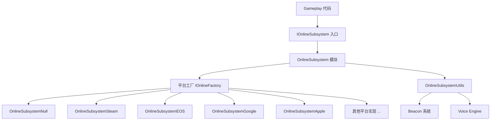
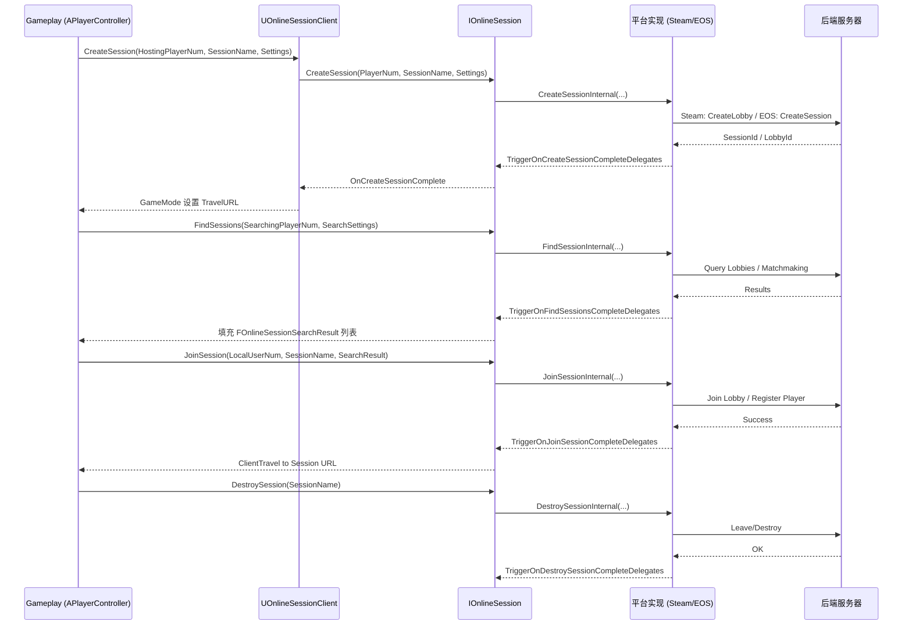

> [[00-UE全解析主索引|← 返回 UE全解析主索引]]

# Why：为什么要学习 OnlineSubsystem？

现代游戏几乎都需要与平台后端（Steam、Epic Online Services、PlayStation、Xbox、iOS Game Center、Android Google Play 等）进行对接，以实现联机会话（Session）、玩家身份（Identity）、好友系统、成就、排行榜、语音聊天等功能。不同平台的 SDK 接口千差万别，如果直接在 gameplay 代码中耦合某个特定平台 SDK，将导致移植成本极高。

**OnlineSubsystem（OSS）** 正是 UE 为解决这一痛点而设计的**平台抽象层**。它将所有平台相关的在线能力统一封装为一组标准 C++ 接口， gameplay 层只需面向接口编程，无需关心底层是 Steam、EOS 还是主机平台。理解 OSS 的源码结构，不仅有助于快速定位联机问题，也能为我们自研引擎设计**跨平台网络中间件抽象层**提供极佳的参考范式。

---

# What：OnlineSubsystem 是什么？

OnlineSubsystem 并非单一模块，而是一个横跨 `Runtime/Online/` 与 `Plugins/Online/` 的**接口族 + 插件族**。其核心设计哲学是：**接口定义在基线插件中，平台实现分散在各平台插件中，运行时通过模块加载与工厂模式动态绑定**。

## 接口层：模块地图与能力边界

### 1. 底层网络基础设施（Runtime/Online/）

在 OSS 之下，UE 提供了一套通用的网络与通信运行时模块：

| 模块 | 职责 | 关键头文件 |
|------|------|-----------|
| `HTTP` | 跨平台 HTTP/HTTPS 请求封装 | `Runtime/HTTP/Public/HttpModule.h` |
| `HTTPServer` | 嵌入式 HTTP 服务器 | `Runtime/HTTPServer/Public/HttpServerModule.h` |
| `SSL` | TLS/SSL 抽象（基于 OpenSSL/BoringSSL） | `Runtime/Online/SSL/Public/SSLCipher.h` |
| `WebSockets` | WebSocket 客户端/服务器 | `Runtime/WebSockets/Public/WebSocketsModule.h` |
| `XMPP` | 即时消息与 Presence 协议 | `Runtime/XMPP/Public/XmppModule.h` |
| `Stomp` | 面向消息中间件的 Stomp 协议 | `Runtime/Stomp/Public/StompModule.h` |
| `Voice` | 语音采集与编解码抽象 | `Runtime/Voice/Public/Voice.h` |
| `BackgroundHTTP` | 后台 HTTP 下载（主要用于移动端） | `Runtime/BackgroundHTTP/Public/BackgroundHttpModule.h` |
| `BuildPatchServices` | 补丁与差量更新服务 | `Runtime/Online/BuildPatchServices/Public/BuildPatchServices.h` |
| `ICMP` | ICMP Ping 封装 | `Runtime/ICMP/Public/Icmp.h` |

> 💡 **设计启示**：OSS 本身并不直接操作 TCP/UDP Socket，而是依赖 `HTTP`、`WebSockets`、`XMPP` 等更高层协议模块与后端通信。Socket 层由 `Runtime/Sockets` 与 `Runtime/Net/Core` 负责，相关内容参见 [[UE-Sockets-源码解析：Socket 子系统]] 与 [[UE-Net-源码解析：网络同步与 Replication]]。

### 2. 核心插件层（Plugins/Online/）

OSS 的核心接口与实现分布在以下插件模块中：



- **`OnlineBase`**：提供 OSS 共享的基础类型与工具函数。
- **`OnlineSubsystem`**：定义 `IOnlineSubsystem` 入口与 20+ 子接口的头文件，是 OSS 的**接口契约层**。
- **`OnlineSubsystemNull`**：空实现（本地回环），用于无平台 SDK 的调试与测试。
- **`OnlineSubsystemUtils`**：提供 gameplay 层常用工具类，如 `UOnlineSessionClient`、Beacon 系统、`UVoiceEngineImpl`。
- **各平台插件**：`OnlineSubsystemSteam`、`OnlineSubsystemEOS`、`OnlineSubsystemGooglePlay`、`OnlineSubsystemApple`、`OnlineSubsystemTencent` 等，负责将标准接口映射到具体平台 SDK。
- **`OnlineServices*`**：UE5 新一代在线服务接口族（基于 `IOnlineServices`），与旧版 OSS 并行存在，逐步迁移中。

### 3. IOnlineSubsystem：统一入口

> 文件：`Engine/Plugins/Online/OnlineSubsystem/Source/Public/OnlineSubsystem.h`，第 40~180 行

```cpp
class ONLINESUBSYSTEM_API IOnlineSubsystem
{
public:
    // 获取指定名称的在线子系统实例（如 "Steam"、"EOS"、"NULL"）
    static IOnlineSubsystem* Get(const FName& SubsystemName = NAME_None);
    static IOnlineSubsystem* GetByPlatform(bool bRequireLoaded = false);

    // 核心子接口访问器
    virtual IOnlineSessionPtr   GetSessionInterface() const = 0;
    virtual IOnlineFriendsPtr   GetFriendsInterface() const = 0;
    virtual IOnlinePartyPtr     GetPartyInterface() const = 0;
    virtual IOnlineGroupsPtr    GetGroupsInterface() const = 0;
    virtual IOnlineSharedCloudPtr GetSharedCloudInterface() const = 0;
    virtual IOnlineUserCloudPtr GetUserCloudInterface() const = 0;
    virtual IOnlineLeaderboardsPtr GetLeaderboardsInterface() const = 0;
    virtual IOnlineVoicePtr     GetVoiceInterface() const = 0;
    virtual IOnlineExternalUIPtr GetExternalUIInterface() const = 0;
    virtual IOnlineTimePtr      GetTimeInterface() const = 0;
    virtual IOnlineIdentityPtr  GetIdentityInterface() const = 0;
    virtual IOnlineTitleFilePtr GetTitleFileInterface() const = 0;
    virtual IOnlineEntitlementsPtr GetEntitlementsInterface() const = 0;
    virtual IOnlineStorePtr     GetStoreInterface() const = 0;
    virtual IOnlineStoreV2Ptr   GetStoreV2Interface() const = 0;
    virtual IOnlinePurchasePtr  GetPurchaseInterface() const = 0;
    virtual IOnlineEventsPtr    GetEventsInterface() const = 0;
    virtual IOnlineAchievementsPtr GetAchievementsInterface() const = 0;
    virtual IOnlineSharingPtr   GetSharingInterface() const = 0;
    virtual IOnlineUserPtr      GetUserInterface() const = 0;
    virtual IOnlineMessagePtr   GetMessageInterface() const = 0;
    virtual IOnlinePresencePtr  GetPresenceInterface() const = 0;
    virtual IOnlineChatPtr      GetChatInterface() const = 0;
    virtual IOnlineTurnBasedPtr GetTurnBasedInterface() const = 0;
    virtual IOnlineTournamentPtr GetTournamentInterface() const = 0;
    virtual IOnlineGameActivityPtr GetGameActivityInterface() const = 0;
    virtual IOnlineGameMatchesPtr GetGameMatchesInterface() const = 0;
    virtual IMessageSanitizerPtr GetMessageSanitizerInterface() const = 0;

    // 初始化与销毁
    virtual bool Init() = 0;
    virtual bool Shutdown() = 0;
    virtual FString GetSubsystemName() const = 0;
    virtual bool IsEnabled() const;
};
```

`IOnlineSubsystem::Get()` 是 gameplay 代码接触 OSS 的唯一入口。内部通过 `FOnlineSubsystemModule` 维护一个 `TMap<FName, IOnlineSubsystem*>` 的实例缓存。

### 4. FOnlineSubsystemModule：模块管家

> 文件：`Engine/Plugins/Online/OnlineSubsystem/Source/Public/OnlineSubsystemModule.h`，第 25~130 行

```cpp
class FOnlineSubsystemModule : public IModuleInterface
{
public:
    // 注册/注销平台工厂
    void RegisterPlatformService(const FName FactoryName, IOnlineFactory* Factory);
    void UnregisterOnlineFactory(const FName FactoryName);

    // 获取或创建子系统实例
    IOnlineSubsystem* GetOnlineSubsystem(const FName SubsystemName);
    void DestroyOnlineSubsystem(const FName SubsystemName);

private:
    TMap<FName, IOnlineSubsystem*> OnlineSubsystems;
    TMap<FName, IOnlineFactory*>   OnlineFactories;
};
```

当调用 `IOnlineSubsystem::Get("Steam")` 时，模块会查找是否已有 `"Steam"` 实例；若无，则通过已注册的 `IOnlineFactory` 创建并初始化。

### 5. 20+ 子接口全景

OSS 将平台能力拆分为高度内聚的子接口，避免一个巨型接口类膨胀：

| 子接口 | 职责 | 典型使用场景 |
|--------|------|-------------|
| `IOnlineIdentity` | 玩家身份、登录、令牌 | `Login`、`AutoLogin`、`Logout`、`GetLoginStatus` |
| `IOnlineSession` | 会话创建、发现、加入、销毁 | `CreateSession`、`FindSessions`、`JoinSession`、`DestroySession` |
| `IOnlineFriends` | 好友列表、邀请 | `ReadFriendsList`、`SendInvite`、`AcceptInvite` |
| `IOnlinePresence` | 在线状态、富文本状态 | `SetPresence`、`QueryPresence` |
| `IOnlineLeaderboards` | 排行榜读写 | `ReadLeaderboards`、`WriteLeaderboards`、`FlushLeaderboards` |
| `IOnlineAchievements` | 成就解锁与查询 | `QueryAchievements`、`WriteAchievements` |
| `IOnlineStats` | 玩家统计数据 | `QueryStats`、`UpdateStats` |
| `IOnlineStoreV2` | 应用内商店目录（新版） | `QueryCategories`、`QueryOffersByFilter` |
| `IOnlinePurchase` | 购买流程 | `Checkout`、`QueryReceipts`、`FinalizePurchase` |
| `IOnlineUser` | 用户资料查询 | `QueryUserInfo` |
| `IOnlineUserCloud` | 用户云存档 | `WriteUserFile`、`ReadUserFile`、`DeleteUserFile` |
| `IOnlineTitleFile` | 游戏标题文件（如补丁元数据） | `ReadFile`、`DeleteFile` |
| `IOnlineExternalUI` | 调起平台原生 UI | `ShowLoginUI`、`ShowFriendsUI`、`ShowStoreUI` |
| `IOnlineChat` | 聊天消息 | `SendRoomChat`、`GetRooms` |
| `IOnlineMessage` | 离线消息/私信 | `Send`、`EnumerateMessages` |
| `IOnlineVoice` | 语音通信 | `StartNetworkedVoice`、`StopNetworkedVoice` |
| `IOnlineGameActivity` | 游戏活动/挑战 | `StartGameActivity`、`EndGameActivity` |
| `IOnlineGameMatches` | 比赛记录 | `CreateGameMatch`、`UpdateGameMatch` |
| `IOnlineTurnBased` | 回合制对战 | `CreateTurnBasedMatch`、`GetMatches` |
| `IOnlineTournament` | 锦标赛 | `CreateTournament`、`JoinTournament` |
| `IOnlinePartySystem` | 小队/队伍系统 | `CreateParty`、`JoinParty` |
| `IOnlineGroups` | 公会/社群 | `CreateGroup`、`AcceptInvite` |
| `IMessageSanitizer` | 消息内容安全过滤 | `SanitizeDisplayName`、`SanitizeString` |

> 💡 **接口拆分原则**：每个接口只暴露单一平台能力领域。若某平台不支持某项能力（如主机平台没有商店），则对应接口指针返回空（`nullptr`），上层代码需做空判断。

---

## 数据层：核心 UObject 与数据结构

OSS 的数据层不仅包含纯 C++ 结构体（如会话设置、搜索结果），也包含少量 UObject（如 `UOnlineSessionClient`）以便与 gameplay 层的蓝图和 GC 体系无缝集成。

### 1. FUniqueNetIdRepl：网络可复制的玩家唯一标识

> 文件：`Engine/Plugins/Online/OnlineSubsystem/Source/Public/OnlineSubsystemTypes.h`，第 200~350 行

```cpp
USTRUCT()
struct FUniqueNetIdRepl
{
    GENERATED_BODY()

    // 内部持有 TSharedPtr<const FUniqueNetId> UniqueNetId
    // 提供 NetSerialize / NetEqual 以支持 Replication
};
```

`FUniqueNetIdRepl` 是 `FUniqueNetId` 的**可复制包装**。由于平台 ID 的具体类型各异（Steam 是 64 位整数，EOS 是字符串），UE 通过抽象基类 `FUniqueNetId` 隐藏差异，而 `FUniqueNetIdRepl` 则负责在 RPC 网络同步时序列化/反序列化。

### 2. FOnlineSessionSettings：会话配置

> 文件：`Engine/Plugins/Online/OnlineSubsystem/Source/Public/OnlineSessionSettings.h`，第 30~180 行

```cpp
USTRUCT()
struct FOnlineSessionSettings
{
    GENERATED_BODY()

    // 允许的最大玩家数
    UPROPERTY()
    int32 NumPublicConnections;

    // 是否使用局域网广播（LAN）
    UPROPERTY()
    bool bIsLANMatch;

    // 是否允许加入进行中游戏
    UPROPERTY()
    bool bAllowJoinInProgress;

    // 是否使用专用服务器
    UPROPERTY()
    bool bIsDedicated;

    // 自定义键值对，用于匹配过滤
    UPROPERTY()
    FOnlineSessionSettingArray Settings;
};
```

`FOnlineSessionSettings` 是创建会话时的配置载体。其中 `Settings` 是一个 `TMap<FName, FOnlineSessionSetting>`，允许 gameplay 代码携带任意自定义数据（如地图名、游戏模式、难度等级）到后端。

### 3. FOnlineSessionSearchResult：搜索结果

> 文件：`Engine/Plugins/Online/OnlineSubsystem/Source/Public/OnlineSessionSettings.h`，第 200~280 行

```cpp
USTRUCT()
struct FOnlineSessionSearchResult
{
    GENERATED_BODY()

    // 会话信息（含 Settings 的当前值）
    UPROPERTY()
    FOnlineSession Session;

    // 延迟（Ping）
    UPROPERTY()
    int32 PingInMs;
};
```

搜索会话时，平台实现会将后端返回的会话信息反序列化为 `FOnlineSessionSearchResult` 数组，供 gameplay 选择加入。

### 4. FOnlineFriend / FOnlineUserPresence

> 文件：`Engine/Plugins/Online/OnlineSubsystem/Source/Public/Interfaces/OnlineFriendsInterface.h`，第 40~120 行  
> 文件：`Engine/Plugins/Online/OnlineSubsystem/Source/Public/Interfaces/OnlinePresenceInterface.h`，第 30~100 行

```cpp
// 好友信息
struct FOnlineFriend : public FOnlineUser
{
    EInviteStatus::Type InviteStatus;
    TSharedRef<FOnlineUserPresence> Presence;
};

// 在线状态
struct FOnlineUserPresence
{
    EOnlinePresenceState::Type State; // Online, Away, Offline ...
    FString StatusStr;
    TMap<FString, FString> Properties;
};
```

### 5. UOnlineSessionClient：Gameplay 层的 UObject 代理

> 文件：`Engine/Plugins/Online/OnlineSubsystemUtils/Source/Public/OnlineSessionClient.h`，第 25~120 行

```cpp
UCLASS()
class UOnlineSessionClient : public UGameInstanceSubsystem
{
    GENERATED_BODY()

public:
    UFUNCTION(BlueprintCallable, Category = "Online|Session")
    void StartSession(FName SessionName);

    UFUNCTION(BlueprintCallable, Category = "Online|Session")
    void EndSession(FName SessionName);

protected:
    virtual void OnSessionInviteAccepted(...);
    virtual void OnSessionUserInviteAccepted(...);
};
```

`UOnlineSessionClient` 继承自 `UGameInstanceSubsystem`，是 gameplay 层（尤其是蓝图）操作会话的便捷 UObject 代理。它将蓝图调用转发到底层的 `IOnlineSession` 接口，并自动订阅平台事件（如收到会话邀请）。

---

# How：如何与后端对接？

## 逻辑层：后端对接流程

OSS 的所有异步操作都遵循**"发起请求 → 平台 SDK 处理 → 委托回调"**的三段式模型。以下以最常用的 **Session 生命周期** 和 **Identity 登录** 为例，追踪其源码级调用链。

### 1. Session 生命周期（Create → Find → Join → Destroy）



#### 关键源码：CreateSession 的调用链

> 文件：`Engine/Plugins/Online/OnlineSubsystem/Source/Public/Interfaces/OnlineSessionInterface.h`，第 120~200 行

```cpp
class IOnlineSession
{
public:
    // 发起创建会话
    virtual bool CreateSession(int32 HostingPlayerNum, FName SessionName, const FOnlineSessionSettings& NewSessionSettings) = 0;

    // 委托定义
    FOnCreateSessionCompleteDelegate OnCreateSessionComplete;
    FOnFindSessionsCompleteDelegate  OnFindSessionsComplete;
    FOnJoinSessionCompleteDelegate   OnJoinSessionComplete;
    FOnDestroySessionCompleteDelegate OnDestroySessionComplete;

    // 触发委托的辅助函数
    void TriggerOnCreateSessionCompleteDelegates(FName SessionName, bool bWasSuccessful);
};
```

> 文件：`Engine/Plugins/Online/OnlineSubsystem/Source/Private/OnlineSession.cpp`（推测存在于具体平台实现中），平台实现类（如 `FOnlineSessionSteam`）会重写 `CreateSession`，在内部调用 Steam SDK 的 `SteamMatchmaking()->CreateLobby(...)`，成功后再通过 `TriggerOnCreateSessionCompleteDelegates` 通知上层。

> 文件：`Engine/Plugins/Online/OnlineSubsystemUtils/Source/Private/OnlineSessionClient.cpp`，第 80~150 行

```cpp
void UOnlineSessionClient::OnCreateSessionComplete(FName SessionName, bool bWasSuccessful)
{
    if (bWasSuccessful)
    {
        // 获取会话连接字符串，供 ServerTravel/ClientTravel 使用
        FString ConnectString;
        IOnlineSessionPtr SessionInt = Online::GetSessionInterface(GetWorld());
        if (SessionInt.IsValid() && SessionInt->GetResolvedConnectString(SessionName, ConnectString))
        {
            // GameMode 或 PlayerController 可在此触发地图切换
        }
    }
}
```

### 2. Identity 登录流程

> 文件：`Engine/Plugins/Online/OnlineSubsystem/Source/Public/Interfaces/OnlineIdentityInterface.h`，第 60~180 行

```cpp
class IOnlineIdentity
{
public:
    // 使用指定凭证登录（如账号密码、Steam 票据）
    virtual bool Login(int32 LocalUserNum, const FOnlineAccountCredentials& AccountCredentials) = 0;

    // 自动登录（使用平台默认身份，如 Steam 自动用当前 Steam 用户）
    virtual bool AutoLogin(int32 LocalUserNum) = 0;

    // 获取登录状态
    virtual ELoginStatus::Type GetLoginStatus(int32 LocalUserNum) const = 0;

    // 获取玩家唯一 NetId
    virtual TSharedPtr<const FUniqueNetId> GetUniquePlayerId(int32 LocalUserNum) const = 0;

    // 委托
    FOnLoginCompleteDelegate OnLoginComplete;
    FOnLogoutCompleteDelegate OnLogoutComplete;
};
```

**AutoLogin 典型流程**（以 Steam 为例）：

1. GameInstance 启动时调用 `IOnlineIdentity::AutoLogin(0)`。
2. `FOnlineIdentitySteam::AutoLogin` 检查 `SteamUser()->BLoggedOn()`。
3. 若已登录，直接构造 `FUniqueNetIdSteam` 并触发 `OnLoginComplete`。
4. Gameplay 层在回调中获取 `FUniqueNetIdRepl`，随后用于初始化 `PlayerState->SetUniqueId()`。

### 3. 委托回调链机制

OSS 的所有异步接口均使用 UE 的**委托宏**（`DECLARE_DELEGATE`、`DECLARE_MULTICAST_DELEGATE` 等）实现回调解耦。

> 文件：`Engine/Plugins/Online/OnlineSubsystem/Source/Public/OnlineDelegateMacros.h`，第 1~60 行（推测）

```cpp
// 单播委托（如 LoginComplete）
DECLARE_DELEGATE_TwoParams(FOnLoginCompleteDelegate, int32, const FString&);

// 多播委托（如 Session 状态变更）
DECLARE_MULTICAST_DELEGATE_TwoParams(FOnSessionInviteReceivedDelegate, int32, const FUniqueNetId&);
```

Gameplay 层通过 `AddUObject` 或 `AddLambda` 绑定到这些委托上：

```cpp
IOnlineSessionPtr SessionInt = Online::GetSessionInterface();
if (SessionInt.IsValid())
{
    SessionInt->OnCreateSessionComplete().AddUObject(this, &AMyGameSession::OnCreateSessionComplete);
}
```

> 💡 **回调链的内存安全注意**：由于 OSS 接口返回的是 `TSharedPtr`，委托绑定的对象通常是 `UObject`（如 `UOnlineSessionClient`、`AGameSession`）。在对象销毁时务必调用 `Clear()` 或利用 `FDelegateHandle` 注销，防止野指针回调。

---

## OnlineSubsystemUtils：Beacon 与语音

`OnlineSubsystemUtils` 是 gameplay 与 OSS 之间的**粘合剂层**，除了 `UOnlineSessionClient`，还提供了两个关键运行时设施：

### 1. Beacon 系统（OnlineBeacon）

Beacon 是 UE 中一种**轻量级网络连接探针**，用于在正式加入游戏会话前进行服务器探测、大厅协商或 spectator 连接。

> 文件：`Engine/Plugins/Online/OnlineSubsystemUtils/Source/Public/OnlineBeacon.h`，第 30~120 行

```cpp
UCLASS()
class AOnlineBeacon : public AActor
{
    GENERATED_BODY()
public:
    // 底层持有一个 UNetConnection 或 UIpConnection 的弱引用
    UPROPERTY()
    UNetConnection* NetConnection;
};
```

Beacon 的典型子类包括：
- **`AOnlineBeaconHost`**：在服务器端监听 Beacon 连接。
- **`AOnlineBeaconClient`**：客户端发起 Beacon 连接。
- **`APartyBeacon`**：用于队伍/小队协商（检查队伍是否满足加入条件）。
- **`ASpectatorBeacon`**：用于观众/观察者连接。

Beacon 的工作流程：
1. 客户端通过 `IOnlineSession` 搜索到目标会话后，不立即 `ClientTravel`。
2. 先建立一条 Beacon 连接，发送 `FPartyReservation`（玩家列表、队伍 ID 等）。
3. 服务器校验通过后返回 `ReservationApproved`。
4. 客户端收到批准后再执行真正的 `ClientTravel` 到游戏地图。

> 💡 **设计亮点**：Beacon 将**连接协商**与**实际游戏连接**解耦，避免了玩家因队伍人数超限或版本不匹配而浪费一次完整的地图加载。

### 2. VoiceEngineImpl

> 文件：`Engine/Plugins/Online/OnlineSubsystemUtils/Source/Public/VoiceEngineImpl.h`，第 25~100 行

```cpp
class FVoiceEngineImpl : public IVoiceEngine
{
public:
    virtual bool StartNetworkedVoice(uint8 LocalUserNum) override;
    virtual bool StopNetworkedVoice(uint8 LocalUserNum) override;
    virtual void RegisterRemoteTalker(const FUniqueNetId& UniqueId) override;
    virtual void UnregisterRemoteTalker(const FUniqueNetId& UniqueId) override;
};
```

`FVoiceEngineImpl` 将 `IOnlineVoice` 的调用桥接到 `Runtime/Voice` 模块的底层语音编解码与网络传输管道上。

---

## 平台实现差异：Null vs Steam vs EOS

OSS 通过**工厂模式**隔离平台差异：

> 文件：`Engine/Plugins/Online/OnlineSubsystem/Source/Public/OnlineSubsystemImpl.h`，第 40~150 行

```cpp
class FOnlineSubsystemImpl : public IOnlineSubsystem
{
public:
    virtual bool Init() override;
    virtual bool Shutdown() override;
protected:
    // 各平台实现需重写这些接口
    virtual IOnlineSessionPtr   GetSessionInterface() const override { return SessionInterface; }
    IOnlineSessionPtr SessionInterface;
    IOnlineIdentityPtr IdentityInterface;
    // ... 其他接口缓存
};
```

各平台插件在模块加载时向 `FOnlineSubsystemModule` 注册工厂：

> 文件：`Engine/Plugins/Online/OnlineSubsystemNull/Source/Private/OnlineSubsystemNull.cpp`，第 30~80 行（推测）

```cpp
class FOnlineSubsystemNull : public FOnlineSubsystemImpl
{
public:
    virtual bool Init() override;
    virtual IOnlineSessionPtr GetSessionInterface() const override { return SessionInterface; }
private:
    FOnlineSessionNullPtr SessionInterface;
};

// 模块启动时注册
void FOnlineSubsystemNullModule::StartupModule()
{
    FOnlineSubsystemModule& OSS = FModuleManager::LoadModuleChecked<FOnlineSubsystemModule>("OnlineSubsystem");
    OSS.RegisterPlatformService(NULL_SUBSYSTEM, new FOnlineFactoryNull());
}
```

- **Null**：所有接口都在本地内存中模拟，不依赖任何外部网络。非常适合单人模式或 CI 自动化测试。
- **Steam**：基于 Steamworks SDK（`SteamMatchmaking`、`SteamUser`、`SteamFriends`），会话对应 Steam Lobby。
- **EOS (Epic Online Services)**：基于 EOS SDK，提供跨平台统一服务（身份、会话、好友、语音、反作弊），是 UE5 主推的在线方案。
- **Tencent/Google/Apple**：分别对接 WeGame、Google Play Games、Game Center 的 SDK。

---

# 设计亮点与可迁移经验

1. **接口分层 + 工厂隔离**：`IOnlineSubsystem` 作为统一入口，子接口按领域拆分，平台实现通过工厂动态注入。这种设计使得新增一个平台支持时， gameplay 代码零改动。
2. **TSharedPtr 接口管理**：所有子接口均以 `TSharedPtr` 返回，既避免了裸指针生命周期问题，又允许平台实现内部做引用计数或延迟释放。
3. **委托驱动的异步模型**：OSS 的所有网络操作都是异步的，通过 UE 委托系统回调。上层代码必须适应"请求即发，结果即回"的思维模式。
4. **Beacon 协商模式**：在正式地图切换前，先用轻量级连接进行预协商（队伍校验、版本校验），是多人游戏避免无效加载的优秀实践。
5. **UOnlineSessionClient 的 UObject 桥接**：纯 C++ 接口层（`IOnlineSession`）与 UObject/蓝图层（`UOnlineSessionClient`）分离，保持了底层接口的跨项目可移植性，同时满足了 gameplay 的蓝图交互需求。

---

# 关联阅读

- [[UE-Net-源码解析：网络同步与 Replication]]：深入 UE 的网络复制层，理解 OSS Session 之上的 gameplay 同步机制。
- [[UE-Sockets-源码解析：Socket 子系统]]：了解 OSS 之下的 TCP/UDP 基础网络抽象。
- [[UE-Engine-源码解析：GameFramework 与规则体系]]：理解 `AGameSession`、`AGameModeBase` 如何与 `UOnlineSessionClient` 协作。
- [[UE-Core-源码解析：委托与事件系统]]：掌握 OSS 中大量使用的委托宏与绑定机制。
- [[UE-Engine-源码解析：World 与 Level 架构]]：理解 `ClientTravel` / `ServerTravel` 的底层实现，这与 OSS Session 的"加入会话后切图"密切相关。

---

# 索引状态

- **所属 UE 阶段**：第三阶段 3.3（网络、脚本与事件）
- **完成度**：✅
