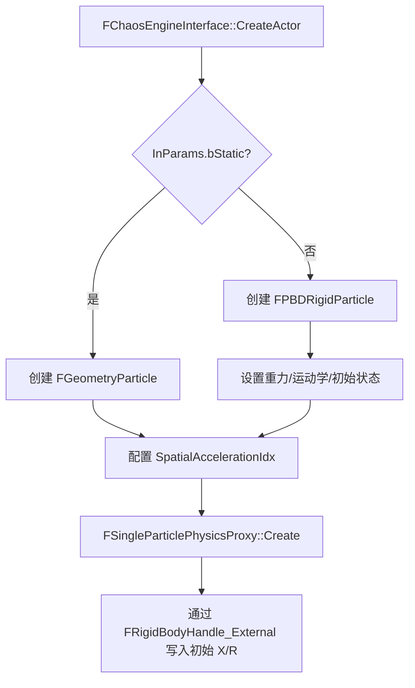
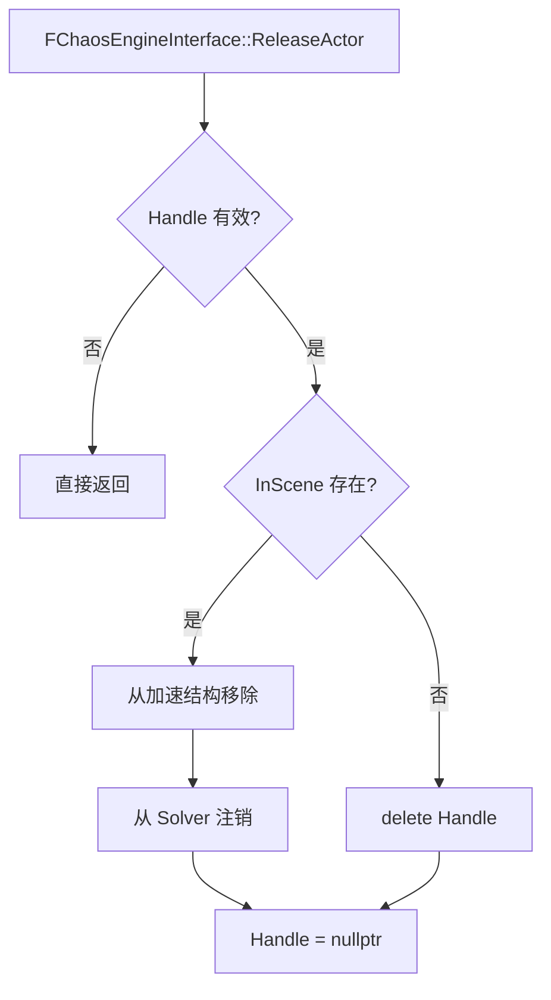
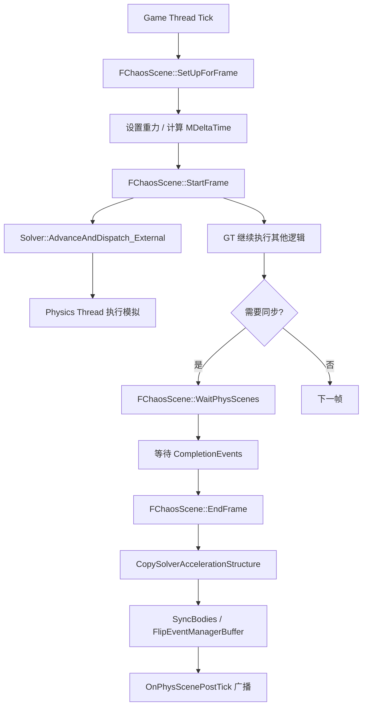
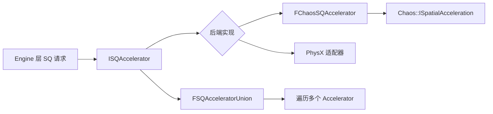

> [[00-UE全解析主索引|← 返回 UE全解析主索引]]

# UE-PhysicsCore-源码解析：物理抽象与接口

## Why：为什么要深入理解 PhysicsCore？

PhysicsCore 是 UE 物理栈的"最小公分母"层。UE5 将底层物理引擎从 PhysX 迁移到 Chaos，上层模块（Engine、Gameplay）仍能以统一的句柄和接口操作物理对象，全靠 PhysicsCore 提供的抽象层。理解该模块的类型别名、静态接口和场景包装器机制，是阅读 Engine 层 `BodyInstance`、`PrimitiveComponent` 物理代码的前提。

## What：PhysicsCore 是什么？

- **`FChaosEngineInterface`**：核心静态接口层，提供 Actor/Shape/Constraint/Material 的生命周期与状态操作，与具体后端解耦。
- **`FChaosScene`**：Chaos 物理场景的包装器，管理 `Chaos::FPhysicsSolver`、空间加速结构、Actor 增删与帧同步。
- **`UBodySetupCore`** / **`FBodyInstanceCore`**：碰撞体配置原型与轻量级实例状态结构。
- **`UPhysicalMaterial`** / **`UChaosPhysicalMaterial`**：通用物理材质与 Chaos 专用材质扩展。

---

## 模块定位

- **UE 模块路径**：`Engine/Source/Runtime/PhysicsCore/`
- **Build.cs 文件**：`PhysicsCore.Build.cs`
- **核心依赖**：
  - `PrivateDependencyModuleNames`：`Core`, `CoreUObject`
  - `PublicDependencyModuleNames`：`DeveloperSettings`
  - 物理支持：调用 `SetupModulePhysicsSupport(Target)` 自动引入物理引擎依赖
- **关键目录**：
  - `Public/`：公共头文件（含 `Public/Chaos/` 子目录）
  - `Private/`：`ChaosScene.cpp`、`ChaosEngineInterface.cpp`、PhysX 桥接文件

---

## 接口梳理（第 1 层）

### 核心头文件一览

| 头文件 | 核心类 | 职责 |
|--------|--------|------|
| `BodySetupCore.h` | `UBodySetupCore` | 碰撞体配置原型（BoneName、PhysicsType、CollisionResponse） |
| `BodyInstanceCore.h` | `FBodyInstanceCore` | 实例级物理状态（bSimulatePhysics、bEnableGravity） |
| `PhysicsSettingsCore.h` | `UPhysicsSettingsCore` | 全局物理配置（DefaultGravityZ、SolverOptions） |
| `PhysicalMaterial.h` | `UPhysicalMaterial` | 通用物理材质（Friction/Restitution、Density） |
| `Chaos/ChaosScene.h` | `FChaosScene` | Chaos 场景包装器 |
| `Chaos/ChaosEngineInterface.h` | `FChaosEngineInterface` | 静态接口层（Actor/Shape/Constraint/SQ） |
| `PhysicsInterfaceDeclaresCore.h` | 类型别名 | `FPhysicsActorHandle`、`FPhysicsShapeHandle` 等通用句柄 |

### 类型别名系统

> 文件：`Engine/Source/Runtime/PhysicsCore/Public/PhysicsInterfaceDeclaresCore.h`

```cpp
// Chaos 后端的统一别名
using FPhysicsActorHandle      = Chaos::FSingleParticlePhysicsProxy*;
using FPhysicsShapeHandle      = Chaos::FPerShapeData*;
using FPhysicsGeometry         = Chaos::FImplicitObject;
using FPhysicsConstraintHandle = FPhysicsConstraintReference_Chaos;
```

### FChaosEngineInterface 核心静态接口

> 文件：`Engine/Source/Runtime/PhysicsCore/Public/Chaos/ChaosEngineInterface.h`，第 346~592 行

```cpp
// Actor 生命周期
static void CreateActor(const FActorCreationParams& InParams, FPhysicsActorHandle& Handle, UObject* InOwner = nullptr);
static void ReleaseActor(FPhysicsActorHandle& InActorReference, FChaosScene* InScene = nullptr, bool bNeverDeferRelease = false);
static void AddActorToSolver(const FPhysicsActorHandle& Handle, Chaos::FPhysicsSolver* Solver);

// 变换与运动学
static void SetGlobalPose_AssumesLocked(const FPhysicsActorHandle& InRef, const FTransform& NewPose, bool bAutoWake = true);
static FTransform GetGlobalPose_AssumesLocked(const FPhysicsActorHandle& InRef);
static void SetIsKinematic_AssumesLocked(const FPhysicsActorHandle& InRef, bool bIsKinematic);

// 力与速度
static void AddForce_AssumesLocked(const FPhysicsActorHandle& InRef, const FVector& Force, bool bAllowSubstepping, bool bAccelChange, bool bIsInternal = false);
static void AddImpulse_AssumesLocked(const FPhysicsActorHandle& InRef, const FVector& Impulse, bool bIsInternal = false);
```

---

## 数据结构与行为分析（第 2~3 层）

### CreateActor 调用链路

> 文件：`Engine/Source/Runtime/PhysicsCore/Private/ChaosEngineInterface.cpp`，第 2419~2507 行



关键实现细节：
- 若 `bStatic` 为真，创建 `FGeometryParticle` 并标记为 `ResimAsFollower`。
- 若为动态，创建 `FPBDRigidParticle`，根据 `bSimulatePhysics` 和 `bStartAwake` 设置为 `Dynamic`、`Sleeping` 或 `Kinematic`。
- 依据全局 CVar（`AccelerationStructureSplitStaticAndDynamic`、`AccelerationStructureIsolateQueryOnlyObjects`）为粒子分配 `FSpatialAccelerationIdx`，决定其进入空间加速结构的哪个桶（Default / Dynamic / QueryOnly）。
- 最终调用 `Chaos::FSingleParticlePhysicsProxy::Create(MoveTemp(Particle), InOwner)` 生成 Proxy，并通过 `Handle->GetGameThreadAPI()` 初始化变换。

### ReleaseActor 调用链路

> 文件：`Engine/Source/Runtime/PhysicsCore/Private/ChaosEngineInterface.cpp`，第 2509~2530 行



实现要点：
- 如果提供了 `FChaosScene`，先调用 `RemoveActorFromAccelerationStructure` 从空间加速结构中剔除，再调用 `RemoveActorFromSolver` 通知 Solver 注销该 Proxy。
- `RemoveActorFromSolver`（第 191~202 行）会检查 `Handle->GetSolverBase() == Solver`，匹配才调用 `Solver->UnregisterObject(Handle)`；否则直接 `delete Handle`。
- 注销后，Game Thread 裸指针 `Handle` 被置空，避免悬空引用。

### FPhysicsActorHandle 的 UObject 生命周期

`FPhysicsActorHandle` 本质是指向 `Chaos::FSingleParticlePhysicsProxy` 的裸指针。Proxy 作为 Game Thread 与 Physics Thread 之间的"桥梁"，其内存布局如下：

> 文件：`Engine/Source/Runtime/Experimental/Chaos/Public/PhysicsProxy/SingleParticlePhysicsProxy.h`，第 57~200 行

```cpp
class FSingleParticlePhysicsProxy : public IPhysicsProxyBase
{
    TUniquePtr<PARTICLE_TYPE> Particle;   // GT 侧粒子数据副本
    FParticleHandle* Handle;              // PT 侧 TGeometryParticleHandle 指针
    FPhysicsObjectUniquePtr Reference;    // PhysicsObject 引用句柄
    // ...
};
```

- **`GetGameThreadAPI()`**（第 73~81 行）：返回 `FRigidBodyHandle_External&`，实际是将 `this` 强制转换为 `FRigidBodyHandle_External` 的引用。所有 GT 侧的状态读写（位置、速度、力）都通过它操作 `Particle`。
- **`GetPhysicsThreadAPI()`**（第 84~93 行）：返回 `FRigidBodyHandle_Internal*`，仅在 `Handle != nullptr` 时有效。PT 通过该指针操作 Solver 内部的 `TGeometryParticleHandle`。
- **`PushToPhysicsState()`**（`SingleParticlePhysicsProxy.cpp:228`）：在 Solver 的调度阶段被调用，将 GT 侧 `Particle` 中的脏属性（XR、DynamicMisc、Shape 等）复制到 PT 的 `Handle`。
- **`BufferPhysicsResults()` / `PullFromPhysicsState()`**（`SingleParticlePhysicsProxy.cpp:267`、`305`）：在 `EndFrame` 的同步阶段，PT 将模拟结果写入中间缓冲，再由 GT 拉回并更新到 `Particle`，完成一帧的闭环。

### FChaosScene 的帧生命周期与多线程同步

> 文件：`Engine/Source/Runtime/PhysicsCore/Private/ChaosScene.cpp`



#### StartFrame（第 363~387 行）
- 在 **Game Thread** 执行。
- 调用 `OnStartFrame(MDeltaTime)` 获取实际使用的 DeltaTime。
- 对每个 Solver 调用 `AdvanceAndDispatch_External(UseDeltaTime)`，将物理模拟任务提交到 TaskGraph；返回的 `FGraphEventRef` 存入 `CompletionEvents`。
- 此后 GT 与 PT 并行运行。

#### WaitPhysScenes（第 579~586 行）
- 检查 `CompletionEvents` 是否全部完成。
- 若未完成，调用 `FTaskGraphInterface::Get().WaitUntilTasksComplete(CompletionEvents, ENamedThreads::GameThread)`，**阻塞 Game Thread** 直到物理任务结束。

#### EndFrame（第 500~577 行）
- 在 **Game Thread** 执行，且必须在所有 CompletionEvents 完成后调用。
- 调用 `CopySolverAccelerationStructure()`（第 155~163 行），通过 `FPhysicsSceneGuardScopedWrite` 获取 Solver 外部数据锁，将最新的空间加速结构拷贝到 `SolverAccelerationStructure`，供 GT 侧场景查询使用。
- 遍历所有 Solver：
  - `SyncBodies(Solver)` → 内部调用 `OnSyncBodies` → `PullPhysicsStateForEachDirtyProxy_External`，将 PT 模拟结果拉回到 Proxy。
  - `Solver->FlipEventManagerBuffer()`：翻转碰撞/事件双缓冲。
  - `Concrete.SyncEvents_GameThread()`：处理 GT 侧事件回调。
  - `Concrete.SyncQueryMaterials_External()`：同步查询材质数据。
- 广播 `OnPhysScenePostTick`，上层（如 `FBodyInstance`）可在此监听并更新状态。

#### Flush（第 165~187 行）
- 强制同步场景，常用于编辑器非运行态的场景查询。
- 调用 `Solver->AdvanceAndDispatch_External(0)` 和 `Solver->WaitOnPendingTasks_External()` 确保所有命令队列清空。
- 刷新空间加速结构并 `CopySolverAccelerationStructure()`。

### 场景查询（SQ）加速器实现链路

> 文件：`Engine/Source/Runtime/PhysicsCore/Public/SQAccelerator.h`、`Private/SQAccelerator.cpp`



#### ISQAccelerator（`SQAccelerator.h:65~72`）
定义纯虚接口 `Raycast`、`Sweep`、`Overlap`，参数使用通用类型（`FPhysicsGeometry`、`FHitRaycast` 等），与具体物理后端解耦。

#### FChaosSQAccelerator（`SQAccelerator.h:37~58`）
- 构造函数接收 `Chaos::ISpatialAcceleration<Chaos::FAccelerationStructureHandle, Chaos::FReal, 3>&`。
- `RaycastImp`（`SQAccelerator.cpp:62~72`）使用 `TSQVisitor` 访问空间加速结构，最终调用 `SpatialAcceleration.Raycast(Start, Dir, DeltaMagnitude, RaycastVisitor)`。
- `Sweep` 和 `Overlap`（第 84~111 行）通过 `Chaos::Utilities::CastHelper` 对查询几何体进行向下类型转换，再调用对应的 `SweepHelper` / `OverlapHelper`。

#### FSQAcceleratorUnion（`SQAccelerator.h:74~87`）
- 维护一个 `TArray<ISQAccelerator*> Accelerators`。
- 查询时遍历所有注册的 Accelerator，实现多后端联合查询。这在 PhysX → Chaos 迁移期间提供了无缝切换能力。

---

## 上下层关系

### 上层：Engine 模块

> 文件：`Engine/Source/Runtime/Engine/Public/Physics/BodyInstance.h`、`PrimitiveComponent.h`

| 数据流向 | 路径 | 说明 |
|----------|------|------|
| **GT → PhysicsCore** | `FBodyInstance::InitBody` → `FChaosEngineInterface::CreateActor` | 根据 `UBodySetup` 创建物理 Actor，生成 `FSingleParticlePhysicsProxy` |
| **GT → PhysicsCore** | `FBodyInstance::SetBodyTransform` → `SetGlobalPose_AssumesLocked` | 设置运动学目标或直接瞬移 |
| **GT → PhysicsCore** | `FBodyInstance::AddForce` / `AddImpulse` → `AddForce_AssumesLocked` | 将力/冲量写入 Proxy 的 GT 数据 |
| **PhysicsCore → GT** | `EndFrame::SyncBodies` → `Proxy::PullFromPhysicsState` → `FBodyInstance::SetWorldTransform` | 将模拟后的最新位姿同步回 Component 的场景图 |
| **GT → PhysicsCore** | `UPrimitiveComponent::SetSimulatePhysics` → `FBodyInstance::SetInstanceSimulatePhysics` → `SetIsKinematic_AssumesLocked` | 切换 Dynamic / Kinematic 状态 |

### 下层：Chaos / ChaosCore 模块

| 数据流向 | 路径 | 说明 |
|----------|------|------|
| **PhysicsCore → Chaos** | `FChaosEngineInterface::AddActorToSolver` → `Solver->RegisterObject(Handle)` | 将 Proxy 注册到 Solver，建立 GT-PT 关联 |
| **PhysicsCore → Chaos** | `FChaosScene::StartFrame` → `Solver->AdvanceAndDispatch_External` | 将 GT 的命令缓冲和脏数据推入 Solver 任务图 |
| **Chaos → PhysicsCore** | `Solver::PullPhysicsStateForEachDirtyProxy_External` → `Proxy::BufferPhysicsResults` → `Proxy::PullFromPhysicsState` | PT 模拟完成后，将结果写回 Proxy 的 GT 数据 |
| **PhysicsCore → Chaos** | `FChaosSQAccelerator` → `Chaos::ISpatialAcceleration::Raycast/Sweep/Overlap` | 直接调用 Chaos 空间加速结构进行场景查询 |

### 遗留桥接

- `PhysXInterfaceWrapperCore.h` 等文件在迁移期提供过渡接口，当前默认后端已为 Chaos，`FSQAcceleratorUnion` 中通常只注册 `FChaosSQAccelerator`。

---

## 设计亮点与可迁移经验

1. **类型别名解耦后端类型**
   通过 `using FPhysicsActorHandle = Chaos::FSingleParticlePhysicsProxy*;`，上层 Engine 模块无需包含 Chaos 头文件即可传递和操作物理对象。这种"句柄即裸指针 + 类型别名"的模式，在自研引擎中可用于将底层 ECS/物理后端与上层Gameplay完全隔离，避免头文件污染和编译依赖爆炸。

2. **AssumesLocked 命名约定约束多线程使用**
   所有需要在物理锁保护下调用的接口都显式标注 `_AssumesLocked`（如 `SetGlobalPose_AssumesLocked`、`AddForce_AssumesLocked`）。UE 不依赖运行时锁检查，而是通过命名规范 + `check` 宏在开发期约束调用方。对于自研引擎，这是一种零开销的线程安全文档化手段，比隐式锁或原子操作更易于 Code Review 和静态分析。

3. **Proxy 双端 API 模式（External / Internal）**
   `FSingleParticlePhysicsProxy` 同时暴露 `FRigidBodyHandle_External`（Game Thread 写）和 `FRigidBodyHandle_Internal`（Physics Thread 读/写）。两端的字段布局可能共享同一基类，但通过命名空间和 API 命名明确区分访问线程。Push/Pull/Buffer 三阶段机制将跨线程数据流转标准化。自研引擎在设计多线程物理同步时，可借鉴这种"Proxy 持有双端句柄 + 显式 Push/Pull 阶段"的模型，避免直接共享可变状态。

4. **SQ 加速器接口实现后端无缝切换**
   `ISQAccelerator` 将 Raycast/Sweep/Overlap 抽象为纯虚接口，`FChaosSQAccelerator` 包装 Chaos 空间加速结构，`FSQAcceleratorUnion` 支持多后端联合查询。这使得物理引擎切换时，上层场景查询代码完全无需修改。自研引擎在支持多物理后端或自定义空间查询实现时，可采用类似的"接口 + 联合分发器"两层结构。

5. **FChaosScene 包装 Solver 生命周期与同步点**
   `FChaosScene` 将 `Chaos::FPhysicsSolver` 的创建、Tick、销毁、事件翻转、加速结构拷贝全部封装在一个场景对象中，并通过 `StartFrame` / `WaitPhysScenes` / `EndFrame` 提供清晰的帧同步契约。上层只需按此协议调用，无需理解 Solver 内部的任务图调度细节。

---

## 关键源码片段

> 文件：`Engine/Source/Runtime/PhysicsCore/Private/ChaosEngineInterface.cpp`，第 2419~2507 行

```cpp
void FChaosEngineInterface::CreateActor(const FActorCreationParams& InParams, FPhysicsActorHandle& Handle, UObject* InOwner)
{
    TUniquePtr<FGeometryParticle> Particle;
    if(InParams.bStatic)
    {
        Particle = FGeometryParticle::CreateParticle();
    }
    else
    {
        TUniquePtr<FPBDRigidParticle> Rigid = FPBDRigidParticle::CreateParticle();
        Rigid->SetGravityEnabled(InParams.bEnableGravity);
        // ... 设置状态
        Particle = MoveTemp(Rigid);
    }
    // 设置空间加速结构索引 ...
    Handle = Chaos::FSingleParticlePhysicsProxy::Create(MoveTemp(Particle), InOwner);
    Chaos::FRigidBodyHandle_External& Body_External = Handle->GetGameThreadAPI();
    Body_External.SetX(InParams.InitialTM.GetLocation(), /*bInvalidate=*/false);
    Body_External.SetR(InParams.InitialTM.GetRotation(), /*bInvalidate=*/false);
}
```

> 文件：`Engine/Source/Runtime/PhysicsCore/Private/ChaosEngineInterface.cpp`，第 2509~2530 行

```cpp
void FChaosEngineInterface::ReleaseActor(FPhysicsActorHandle& Handle, FChaosScene* InScene, bool bNeverDerferRelease)
{
    if(!Handle) { return; }
    if(InScene)
    {
        InScene->RemoveActorFromAccelerationStructure(Handle);
        RemoveActorFromSolver(Handle, InScene->GetSolver());
    }
    else
    {
        delete Handle;
    }
    Handle = nullptr;
}
```

> 文件：`Engine/Source/Runtime/PhysicsCore/Private/ChaosScene.cpp`，第 363~387 行

```cpp
void FChaosScene::StartFrame()
{
    const float UseDeltaTime = OnStartFrame(MDeltaTime);
    TArray<FPhysicsSolverBase*> SolverList = GetPhysicsSolvers();
    for(FPhysicsSolverBase* Solver : SolverList)
    {
        if(FGraphEventRef SolverEvent = Solver->AdvanceAndDispatch_External(UseDeltaTime))
        {
            if(SolverEvent.IsValid())
            {
                CompletionEvents.Add(SolverEvent);
            }
        }
    }
}
```

> 文件：`Engine/Source/Runtime/PhysicsCore/Private/ChaosScene.cpp`，第 500~577 行

```cpp
void FChaosScene::EndFrame()
{
    check(IsCompletionEventComplete());
    CompletionEvents.Reset();
    TArray<FPhysicsSolverBase*> SolverList = GetPhysicsSolvers();
    CopySolverAccelerationStructure();
    for(FPhysicsSolverBase* Solver : SolverList)
    {
        Solver->CastHelper([&](auto& Concrete)
        {
            SyncBodies(&Concrete);
            Solver->FlipEventManagerBuffer();
            Concrete.SyncEvents_GameThread();
            Concrete.SyncQueryMaterials_External();
        });
    }
    OnPhysScenePostTick.Broadcast(this);
}
```

> 文件：`Engine/Source/Runtime/PhysicsCore/Public/SQAccelerator.h`，第 37~58 行

```cpp
class FChaosSQAccelerator
{
public:
    FChaosSQAccelerator(const Chaos::ISpatialAcceleration<Chaos::FAccelerationStructureHandle,Chaos::FReal, 3>& InSpatialAcceleration);
    void Raycast(...) const;
    void Sweep(...) const;
    void Overlap(...) const;
private:
    const Chaos::ISpatialAcceleration<Chaos::FAccelerationStructureHandle, Chaos::FReal, 3>& SpatialAcceleration;
};
```

---

## 关联阅读

- [[UE-Chaos-源码解析：Chaos 物理引擎]]
- [[UE-Engine-源码解析：Actor 与 Component 模型]]
- [[UE-Engine-源码解析：场景图与变换传播]]
- [[UE-Core-源码解析：线程、任务与同步原语]]

---

## 索引状态

- **所属阶段**：第三阶段 3.4 空间、物理与导航
- **分析完成度**：第一轮 ✅，第二轮 ✅，第三轮 ✅，整体完成度：骨架扫描 + 数据结构/行为分析 + 关联辐射
