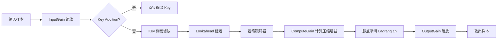

> [← 返回 UE全解析主索引]([[00-UE全解析主索引\|UE全解析主索引]])

# UE-SignalProcessing-源码解析：信号处理与音频中间件

## Why：为什么要学习 SignalProcessing？

游戏引擎的音频系统不仅仅是"播放声音"。从空间化混响、实时压缩器到语音聊天编解码，所有上层音频体验都依赖底层信号处理（DSP）原语。`SignalProcessing` 是 UE 音频栈的"数学引擎"：它不提供 UObject 或蓝图接口，而是为 `AudioMixer`、`AudioAnalyzer`、`Engine` 等模块提供可复用的算法库。

学习它的价值在于：
- **理解音频性能瓶颈**：SIMD、ISPC、定点数、对齐缓冲等优化手段如何落地；
- **提取可迁移的 DSP 架构**：工厂模式运行时择优、双 API 设计（逐帧 vs 逐块）、无锁 SPSC 环形缓冲；
- **打通音频全链路**：从 `SoundCue` 到 `AudioMixer` 再到平台输出，SignalProcessing 是混音与效果器的计算核心。

## What：SignalProcessing 是什么？

`Runtime/SignalProcessing/` 是一个**纯算法模块**，无反射、无 UObject，由 150 余个 DSP 类/函数组成，涵盖 FFT、滤波器、动态处理、延迟/混响、重采样、编解码、空间音频等。

### 模块定位与依赖

> 文件：`Engine/Source/Runtime/SignalProcessing/SignalProcessing.Build.cs`，第 1~39 行

```csharp
public class SignalProcessing : ModuleRules
{
    PrivateDependencyModuleNames.AddRange(new string[] { "Core", "MathCore" });
    PublicDependencyModuleNames.AddRange(new string[] { "IntelISPC" });
    AddEngineThirdPartyPrivateStaticDependencies(Target,
        "UEOgg", "Vorbis", "VorbisFile", "libOpus", "UELibSampleRate");
}
```

- **Private 依赖**：`Core`、`MathCore` —— 说明它处于音频底层，仅依赖引擎基础库；
- **Public 依赖**：`IntelISPC` —— 暴露 ISPC 加速接口给上层；
- **ThirdParty**：封装了 Ogg/Vorbis/Opus 编码与 libsamplerate 重采样能力。

**反向依赖模块**：`AudioMixer`、`AudioMixerCore`、`AudioAnalyzer`、`Engine`、`AudioCaptureCore`、`AudioExtensions`、`AVEncoder`、`MediaAssets`、`MediaUtils`、`NonRealtimeAudioRenderer`、`Online/Voice`、`SoundFieldRendering`。

---

## How：三层剥离法深度解析

### 一、接口层：模块边界与工厂体系

#### 1.1 DSP 头文件体系

`Public/DSP/` 下按功能域组织头文件，形成清晰的接口目录：

| 功能域 | 关键头文件 |
|--------|-----------|
| 缓冲与样本 | `AlignedBuffer.h`、`SampleBuffer.h`、`MultichannelBuffer.h` |
| FFT 与频谱 | `FFTAlgorithm.h`、`SpectrumAnalyzer.h`、`AudioFFT.h` |
| 滤波器 | `Filter.h`、`BiQuadFilter.h`、`DynamicStateVariableFilter.h` |
| 动态处理 | `DynamicsProcessor.h`、`EnvelopeFollower.h` |
| 延迟与混响 | `Delay.h`、`ReverbFast.h`、`FeedbackDelayNetwork.h` |
| 重采样 | `RuntimeResampler.h`、`SampleRateConverter.h`、`MultichannelLinearResampler.h` |
| 卷积 | `ConvolutionAlgorithm.h` |
| 编解码 | `Encoders/IAudioEncoder.h`、`Encoders/OpusEncoder.h` |
| 基础数学 | `Dsp.h`、`BufferVectorOperations.h`、`FloatArrayMath.h` |

所有 DSP 类均置于 `Audio` 命名空间下，使用 `SIGNALPROCESSING_API` 控制符号导出。

#### 1.2 工厂接口：运行时择优的 ModularFeature

SignalProcessing 采用 **IModularFeature** 实现算法工厂的动态注册与择优，这在 FFT 和卷积两个计算密集型场景中尤为突出。

##### FFT 工厂

> 文件：`Engine/Source/Runtime/SignalProcessing/Public/DSP/FFTAlgorithm.h`，第 51~175 行

```cpp
class IFFTAlgorithm {
public:
    virtual int32 Size() const = 0;
    virtual EFFTScaling ForwardScaling() const = 0;
    virtual EFFTScaling InverseScaling() const = 0;
    virtual void ForwardRealToComplex(const float* RESTRICT InReal, float* RESTRICT OutComplex) = 0;
    virtual void InverseComplexToReal(const float* RESTRICT InComplex, float* RESTRICT OutReal) = 0;
    virtual void BatchForwardRealToComplex(int32 InCount, const float* const RESTRICT InReal[], float* RESTRICT OutComplex[]) = 0;
    virtual void BatchInverseComplexToReal(int32 InCount, const float* const RESTRICT InComplex[], float* RESTRICT OutReal[]) = 0;
};

class IFFTAlgorithmFactory : public IModularFeature {
public:
    static SIGNALPROCESSING_API const FName GetModularFeatureName();
    virtual FName GetFactoryName() const = 0;
    virtual bool IsHardwareAccelerated() const = 0;
    virtual bool Expects128BitAlignedArrays() const = 0;
    virtual bool AreFFTSettingsSupported(const FFFTSettings& InSettings) const = 0;
    virtual TUniquePtr<IFFTAlgorithm> NewFFTAlgorithm(const FFFTSettings& InSettings) = 0;
};

class FFFTFactory {
public:
    static SIGNALPROCESSING_API TUniquePtr<IFFTAlgorithm> NewFFTAlgorithm(const FFFTSettings& InSettings, const FName& InAlgorithmFactoryName = AnyAlgorithmFactory);
    static SIGNALPROCESSING_API bool AreFFTSettingsSupported(const FFFTSettings& InSettings, const FName& InAlgorithmFactoryName = AnyAlgorithmFactory);
};
```

`IFFTAlgorithmFactory` 继承自 `IModularFeature`，意味着任何模块（包括平台插件或第三方库）都可以在运行时注册自己的 FFT 实现（如硬件加速版）。`FFFTFactory::NewFFTAlgorithm()` 会遍历所有已注册工厂，按**硬件加速 > 对齐数组 > 内部优先级**排序后选择最优实现。

##### 卷积工厂

> 文件：`Engine/Source/Runtime/SignalProcessing/Public/DSP/ConvolutionAlgorithm.h`，第 51~155 行

```cpp
class IConvolutionAlgorithm {
public:
    virtual int32 GetNumSamplesInBlock() const = 0;
    virtual void ProcessAudioBlock(const float* const InSamples[], float* const OutSamples[]) = 0;
    virtual void ResetAudioHistory() = 0;
    virtual void SetImpulseResponse(int32 InImpulseResponseIndex, const float* InSamples, int32 NumSamples) = 0;
    virtual void SetMatrixGain(int32 InAudioInputIndex, int32 InImpulseResponseIndex, int32 InAudioOutputIndex, float InGain) = 0;
};

class IConvolutionAlgorithmFactory : public IModularFeature {
public:
    virtual const FName GetFactoryName() const = 0;
    virtual bool IsHardwareAccelerated() const = 0;
    virtual bool AreConvolutionSettingsSupported(const FConvolutionSettings& InSettings) const = 0;
    virtual TUniquePtr<IConvolutionAlgorithm> NewConvolutionAlgorithm(const FConvolutionSettings& InSettings) = 0;
};
```

卷积接口同样采用 `IModularFeature` 工厂模式，支持多输入、多脉冲响应、多输出的矩阵混音。上层（如 `SoundFieldRendering`）可通过 `FConvolutionFactory` 获取最优实现，而无需关心底层是时域卷积还是频域 UPC（Uniform Partitioned Convolution）。

> [!info] 设计亮点
> ModularFeature 工厂模式让 UE 的 DSP 算法具备了**插件化扩展能力**。平台团队可以注册硬件加速 FFT，而游戏团队完全无感。

---

### 二、数据层：缓冲布局与状态结构

#### 2.1 对齐缓冲系统

> 文件：`Engine/Source/Runtime/SignalProcessing/Public/DSP/AlignedBuffer.h`，第 10~29 行

```cpp
#define AUDIO_BUFFER_ALIGNMENT 16
#define AUDIO_SIMD_BYTE_ALIGNMENT (16)
#define AUDIO_NUM_FLOATS_PER_VECTOR_REGISTER (4)

namespace Audio {
    using FAudioBufferAlignedAllocator = TAlignedHeapAllocator<AUDIO_BUFFER_ALIGNMENT>;
    using FAlignedFloatBuffer = TArray<float, FAudioBufferAlignedAllocator>;
    using FAlignedInt32Buffer = TArray<int32, FAudioBufferAlignedAllocator>;
}
```

`FAlignedFloatBuffer` 是 SignalProcessing 的**基础货币**：16 字节对齐的 `TArray<float>`，确保 SSE/NEON 可以安全地以 128bit 寄存器加载。所有需要 SIMD 的 DSP 函数都会要求输入为此类型或原生指针。

#### 2.2 模板样本缓冲：TSampleBuffer

> 文件：`Engine/Source/Runtime/SignalProcessing/Public/SampleBuffer.h`，第 22~100 行

```cpp
template <class SampleType = DefaultUSoundWaveSampleType>
class TSampleBuffer {
private:
    TArray<SampleType> RawPCMData;
    int32 NumSamples;
    int32 NumFrames;
    int32 NumChannels;
    int32 SampleRate;
    float SampleDuration;

public:
    inline TSampleBuffer(const float* InBufferPtr, int32 InNumSamples, int32 InNumChannels, int32 InSampleRate) {
        // 自动完成 float/int16 互转
        if constexpr(std::is_same_v<SampleType, float>) {
            FMemory::Memcpy(RawPCMData.GetData(), InBufferPtr, NumSamples * sizeof(float));
        } else if constexpr(std::is_same_v<SampleType, int16>) {
            RawPCMData[SampleIndex] = (int16)(FMath::Clamp(InBufferPtr[SampleIndex], -1.0f, 1.0f) * 32767.0f);
        }
    }
    
    template<class OtherSampleType>
    TSampleBuffer& operator=(const TSampleBuffer<OtherSampleType>& Other) {
        // 编译期多态：同类型 memcpy，跨类型调用 ArrayPcm16ToFloat / ArrayFloatToPcm16
    }
};
```

`TSampleBuffer` 使用 **C++17 `if constexpr`** 在编译期选择拷贝或格式转换路径，避免运行时分支。默认实例化为 `FSampleBuffer`（`int16` 样本，与 `USoundWave` 一致）。

#### 2.3 多通道缓冲体系

> 文件：`Engine/Source/Runtime/SignalProcessing/Public/DSP/MultichannelBuffer.h`，第 11~69 行

```cpp
namespace Audio {
    using FMultichannelBuffer = TArray<Audio::FAlignedFloatBuffer>;
    using FMultichannelBufferView = TArray<TArrayView<float>>;
    using FMultichannelCircularBuffer = TArray<Audio::TCircularAudioBuffer<float>>;

    SIGNALPROCESSING_API void SetMultichannelBufferSize(int32 InNumChannels, int32 InNumFrames, FMultichannelBuffer& OutBuffer);
    SIGNALPROCESSING_API int32 GetMultichannelBufferNumFrames(const FMultichannelBuffer& InBuffer);
    SIGNALPROCESSING_API FMultichannelBufferView MakeMultichannelBufferView(FMultichannelBuffer& InBuffer);
    SIGNALPROCESSING_API FMultichannelBufferView SliceMultichannelBufferView(const FMultichannelBufferView& View, int32 InStartFrameIndex, int32 InNumFrames);
}
```

- `FMultichannelBuffer`：拥有型，每个通道一个 `FAlignedFloatBuffer`（解交错布局）；
- `FMultichannelBufferView`：非拥有型视图，类似 `TArrayView<float>`，用于零拷贝切片；
- `FMultichannelCircularBuffer`：每个通道一个 `TCircularAudioBuffer<float>`，支持 SPSC 无锁生产消费。

> [!info] 设计亮点
> 解交错（deinterleaved）布局是现代 DSP 的**数据导向设计（DOD）**选择：通道内样本连续，便于 SIMD 向量化，也避免了交错布局中的跨通道步进（stride）。

#### 2.4 SPSC 无锁环形缓冲

> 文件：`Engine/Source/Runtime/SignalProcessing/Public/DSP/Dsp.h`，第 832~999 行（节选）

```cpp
template <typename SampleType, size_t Alignment = 16>
class TCircularAudioBuffer {
private:
    TArray<SampleType, TAlignedHeapAllocator<Alignment>> InternalBuffer;
    uint32 Capacity;
    FThreadSafeCounter ReadCounter;
    FThreadSafeCounter WriteCounter;

public:
    int32 Push(const SampleType* InBuffer, uint32 NumSamples) {
        const uint32 ReadIndex = ReadCounter.GetValue();
        const uint32 WriteIndex = WriteCounter.GetValue();
        int32 NumToCopy = FMath::Min<int32>(NumSamples, Remainder());
        const int32 NumToWrite = FMath::Min<int32>(NumToCopy, Capacity - WriteIndex);
        FMemory::Memcpy(&DestBuffer[WriteIndex], InBuffer, NumToWrite * sizeof(SampleType));
        FMemory::Memcpy(&DestBuffer[0], &InBuffer[NumToWrite], (NumToCopy - NumToWrite) * sizeof(SampleType));
        WriteCounter.Set((WriteIndex + NumToCopy) % Capacity);
        return NumToCopy;
    }
};
```

`TCircularAudioBuffer` 使用 `FThreadSafeCounter`（原子计数器）实现 **SPSC（Single-Producer Single-Consumer）无锁环形缓冲**。文档明确提醒：若生产与消费指针重叠，可能出现截断，因此建议容量远大于实际延迟需求。

#### 2.5 滤波器与延迟线状态

##### 滤波器状态

> 文件：`Engine/Source/Runtime/SignalProcessing/Public/DSP/Filter.h`，第 32~111 行、第 242~314 行

```cpp
class FBiquadFilter {
protected:
    struct FBiquadCoeff;
    FBiquadCoeff* Biquad;   // 每通道一组二阶系数与状态
    float SampleRate;
    int32 NumChannels;
    float Frequency;
    float Bandwidth;
    float GainDB;
    bool bEnabled;
};

class FOnePoleFilter : public IFilter {
protected:
    float A0;
    float* Z1;  // 每通道一个延迟状态
};

class FStateVariableFilter : public IFilter {
protected:
    struct FFilterState {
        float Z1_1;
        float Z1_2;
    };
    TArray<FFilterState> FilterState;
};
```

滤波器采用**通道级状态分离**：`FBiquadFilter` 通过指针 `Biquad` 持有每通道独立的系数与 z^-1/z^-2 状态；`FStateVariableFilter` 用 `TArray<FFilterState>` 存储每通道的两个延迟单元。这种布局保证 ProcessAudio 可以按通道并行或向量化。

##### 延迟线状态

> 文件：`Engine/Source/Runtime/SignalProcessing/Public/DSP/Delay.h`，第 12~108 行

```cpp
class FDelay {
protected:
    FAlignedFloatBuffer AudioBuffer;  // 环形延迟缓冲
    int32 AudioBufferSize;
    int32 ReadIndex;
    int32 WriteIndex;
    float SampleRate;
    float DelayInSamples;             // float 支持分数延迟
    int32 MaxBufferLengthSamples;
    FExponentialEase EaseDelayMsec;   // 参数缓动器
    float OutputAttenuation;
};
```

`FDelay` 的延迟时间用 `float` 存储（支持分数延迟），并通过 `FExponentialEase` 实现平滑插值，避免参数突变导致的咔嗒声（zipper noise）。

---

### 三、逻辑层：核心算法执行流程

#### 3.1 FFT 分析流程：从工厂到频谱分析器

##### FFT 工厂运行时择优

> 文件：`Engine/Source/Runtime/SignalProcessing/Private/FFTAlgorithm.cpp`，第 12~108 行

```cpp
static const TArray<IFFTAlgorithmFactory*> GetPrioritizedSupportingFactories(const FFFTSettings& InSettings, const FName& InAlgorithmFactoryName) {
    IModularFeatures::Get().LockModularFeatureList();
    TArray<IFFTAlgorithmFactory*> Factories = IModularFeatures::Get().GetModularFeatureImplementations<IFFTAlgorithmFactory>(IFFTAlgorithmFactory::GetModularFeatureName());
    IModularFeatures::Get().UnlockModularFeatureList();

    // 过滤：硬件加速、对齐要求、设置兼容性
    if (!InSettings.bEnableHardwareAcceleration) { /* 移除硬件加速工厂 */ }
    if (!InSettings.bArrays128BitAligned) { /* 移除对齐要求工厂 */ }
    Factories = Factories.FilterByPredicate([InSettings](const IFFTAlgorithmFactory* Factory) {
        return Factory->AreFFTSettingsSupported(InSettings);
    });

    // 优先级排序：硬件加速 > 对齐数组 > 内部优先级（FVectorFFTFactory > OriginalFFT）
    static const TArray<FName> InternalFFTFactoryPriority = {
        FName(TEXT("FVectorFFTFactory")),
        FName(TEXT("OriginalFFT_Deprecated"))
    };
    Factories.Sort(/* ... */);
    return Factories;
}
```

`FFFTFactory` 的择优逻辑是 SignalProcessing **模块化架构的核心**：先通过 `IModularFeatures` 获取所有注册工厂，再按用户设置（是否允许硬件加速、是否要求对齐）过滤，最后按优先级排序。默认优先选择 `FVectorFFTFactory`（SIMD 向量化实现）。

##### 向量化 FFT 实现

> 文件：`Engine/Source/Runtime/SignalProcessing/Private/VectorFFT.h`，第 13~106 行

```cpp
class FVectorRealToComplexFFT : public IFFTAlgorithm {
public:
    FVectorRealToComplexFFT(int32 InLog2Size);
    virtual void ForwardRealToComplex(const float* RESTRICT InReal, float* RESTRICT OutComplex) override;
    virtual void InverseComplexToReal(const float* RESTRICT InComplex, float* RESTRICT OutReal) override;
    virtual void BatchForwardRealToComplex(int32 InCount, const float* const RESTRICT InReal[], float* RESTRICT OutComplex[]) override;

private:
    struct FConversionBuffers {
        FAlignedFloatBuffer AlphaReal, AlphaImag, BetaReal, BetaImag;
    };
    int32 FFTSize;
    int32 Log2FFTSize;
    FAlignedFloatBuffer WorkBuffer;
    FConversionBuffers ForwardConvBuffers;
    FConversionBuffers InverseConvBuffers;
    TUniquePtr<FVectorComplexFFT> ComplexFFT;  // 底层复数 FFT
};
```

`FVectorRealToComplexFFT` 通过 **实序列到复序列的转换缓冲**（`FConversionBuffers`），将实数 FFT 委托给底层复数 FFT 实现，从而复用向量化的复数蝶形运算。

##### 频谱分析器：三缓冲 + 异步任务

> 文件：`Engine/Source/Runtime/SignalProcessing/Public/DSP/SpectrumAnalyzer.h`，第 210~246 行、第 290~386 行、第 407~478 行

```cpp
class FSpectrumAnalyzerBuffer {
private:
    TArray<FAlignedFloatBuffer> ComplexBuffers;  // 3 个缓冲
    TArray<double> Timestamps;
    volatile int32 OutputIndex;
    volatile int32 InputIndex;
    FCriticalSection BufferIndicesCriticalSection;
public:
    FAlignedFloatBuffer& StartWorkOnBuffer();           // 分析线程写
    void StopWorkOnBuffer(double InTimestamp);
    const FAlignedFloatBuffer& LockMostRecentBuffer() const; // 消费线程读
    void UnlockBuffer();
};

class FSpectrumAnalyzer {
private:
    FWindow Window;
    FAlignedFloatBuffer AnalysisTimeDomainBuffer;
    TCircularAudioBuffer<float> InputQueue;
    FSpectrumAnalyzerBuffer FrequencyBuffer;
    TUniquePtr<IFFTAlgorithm> FFT;
public:
    bool PushAudio(const float* InBuffer, int32 NumSamples);
    bool PerformAnalysisIfPossible(bool bUseLatestAudio = false);
    float GetMagnitudeForFrequency(float InFrequency, EPeakInterpolationMethod InMethod);
};

class FAsyncSpectrumAnalyzer {
private:
    TSharedRef<FSpectrumAnalyzer, ESPMode::ThreadSafe> Analyzer;
    TUniquePtr<FSpectrumAnalyzerTask> AsyncAnalysisTask;  // FAsyncTask<FSpectrumAnalysisAsyncWorker>
public:
    bool PerformAsyncAnalysisIfPossible(bool bUseLatestAudio = false);
};
```

`FSpectrumAnalyzer` 使用 **Triple Buffering** 隔离分析线程与消费线程：分析线程写入一个缓冲，完成后通过索引切换发布；消费线程锁定最新缓冲读取，互不阻塞。`FAsyncSpectrumAnalyzer` 进一步将 `PerformAnalysisIfPossible` 包装为 `FAsyncTask`，在 UE 线程池中异步执行 FFT，避免阻塞音频渲染线程。

#### 3.2 动态处理调用链：以 FDynamicsProcessor 为例

> 文件：`Engine/Source/Runtime/SignalProcessing/Public/DSP/DynamicsProcessor.h`，第 36~192 行

```cpp
class FDynamicsProcessor {
public:
    void ProcessAudioFrame(const float* InFrame, float* OutFrame, const float* InKeyFrame);
    void ProcessAudio(const float* InBuffer, const int32 InNumSamples, float* OutBuffer, const float* InKeyBuffer = nullptr, float* OutEnvelope = nullptr);
    void ProcessAudio(const float* const* const InBuffers, const int32 InNumFrames, float* const* OutBuffers, const float* const* const InKeyBuffers, float* const* OutEnvelopes);

protected:
    float ComputeGain(const float InEnvFollowerDb);
    bool ProcessKeyFrame(const float* InKeyFrame, float* OutFrame, bool bKeyIsInput);

    // Key 侧链处理链
    FBiquadFilter InputLowshelfFilter;
    FBiquadFilter InputHighshelfFilter;

    // 前视延迟线（Lookahead）
    TArray<FIntegerDelay> LookaheadDelay;

    // 包络跟踪器
    TArray<FInlineEnvelopeFollower> EnvFollower;

    // 状态缓存
    TArray<float> DetectorOuts;
    TArray<float> Gain;

    // 参数
    float LookaheadDelayMsec;
    float AttackTimeMsec;
    float ReleaseTimeMsec;
    float ThresholdDb;
    float Ratio;
    float HalfKneeBandwidthDb;
    float InputGain;
    float OutputGain;
    float KeyGain;
};
```

`FDynamicsProcessor` 实现了 Compressor/Limiter/Expander/Gate/UpwardsCompressor 五种模式。其调用链体现了 SignalProcessing 的**双 API 设计**：

1. **逐帧 API**：`ProcessAudioFrame` —— 适合合成器或需要逐样本调制的场景；
2. **逐块 API**：`ProcessAudio`（交错缓冲）和 `ProcessAudio`（非交错缓冲指针数组）—— 适合混音器批量处理。

处理逻辑链（单样本视角）：



- **Lookahead**：通过 `FIntegerDelay` 让检测信号比处理信号提前到达，实现零延迟感的快速 Attack；
- **Knee 平滑**：使用 `LagrangianInterpolation` 在阈值附近做软膝（Soft Knee）过渡，避免增益突变。

#### 3.3 重采样算法：定点数与快速路径

> 文件：`Engine/Source/Runtime/SignalProcessing/Public/DSP/RuntimeResampler.h`，第 16~145 行

```cpp
class FRuntimeResampler {
public:
    FRuntimeResampler(int32 InNumChannels);
    void SetFrameRatio(float InRatio, int32 InNumFramesToInterpolate = 0);
    int32 GetNumInputFramesNeededToProduceOutputFrames(int32 InNumOutputFrames) const;
    int32 ProcessCircularBuffer(FMultichannelCircularBuffer& InAudio, FMultichannelBuffer& OutAudio);
    void ProcessInterleaved(TArrayView<const float> Input, TArrayView<float> Output, int32& OutNumInputFramesConsumed, int32& OutNumOutputFramesProduced);
    void Reset(int32 InNumChannels);

private:
    int64 MapOutputFrameToInputFrameFP(int32 InOutputFrameIndex) const;
    void ProcessAudioInternal(ResamplingParameters& Parameters);
    bool DoDirectCopy(ResamplingParameters& Parameters);
    void GenericResamplingCore(const ResamplingParameters& Parameters, int32& OutInputFrameIndexFP, uint32& OutInputFrameRatioFP, int32 OutputSampleIndex, int32 OutputEndIndex);
    void MonoResamplingCore(const float* Input, float* Output, int32& OutInputFrameIndexFP, uint32& OutInputFrameRatioFP, int32 OutputSampleIndex, int32 OutputEndIndex);
    void StereoInterleavedResamplingCore(/*...*/);
    void StereoDeinterleavedResamplingCore(/*...*/);

    static const int32 FPScale;
    int32 CurrentInputFrameIndexFP = 0;   // 定点数相位
    uint32 CurrentFrameRatioFP = 0;         // 定点数比率
    uint32 TargetFrameRatioFP = 0;
    int32 FrameRatioFrameDeltaFP = 0;
    int32 NumFramesToInterpolate = 0;
    TArray<float, TInlineAllocator<2>> PreviousFrame;
};
```

`FRuntimeResampler` 使用 **定点数（Fixed-Point）** 表示相位和采样率比率（`FPScale`），避免浮点累积误差并提升整数单元效率。核心优化包括：

- **1:1 快速路径**：`DoDirectCopy` 在采样率比率为 1.0 时直接 `memcpy`，跳过插值；
- **声道特化**：提供 `MonoResamplingCore`、`StereoInterleavedResamplingCore`、`StereoDeinterleavedResamplingCore` 等手写特化，减少循环内分支；
- **比率渐变**：支持在 `NumFramesToInterpolate` 帧内从当前比率平滑过渡到目标比率，避免变速时的咔嗒声。

#### 3.4 卷积：Uniform Partitioned Convolution

> 文件：`Engine/Source/Runtime/SignalProcessing/Private/UniformPartitionConvolution.h`，第 42~258 行

```cpp
class FUniformPartitionConvolution : public IConvolutionAlgorithm {
public:
    FUniformPartitionConvolution(const FUniformPartitionConvolutionSettings& InSettings, FSharedFFTRef InFFTAlgorithm);
    virtual void ProcessAudioBlock(const float* const InSamples[], float* const OutSamples[]) override;
    virtual void SetImpulseResponse(int32 InImpulseResponseIndex, const float* InSamples, int32 InNumSamples) override;

private:
    struct FInput {
        FSharedFFTRef FFTAlgorithm;
        FAlignedFloatBuffer InputBuffer;
        FAlignedFloatBuffer OutputBuffer;
        void PushBlock(const float* InSamples);
        const FAlignedFloatBuffer& GetTransformedBlock() const;
    };
    struct FOutput {
        int32 NumBlocks;
        int32 BlockSize;
        FSharedFFTRef FFTAlgorithm;
        TArray<FAlignedFloatBuffer> Blocks;
        void PopBlock(float* OutSamples);
    };
    struct FImpulseResponse {
        int32 NumBlocks;
        TArray<FAlignedFloatBuffer> Blocks;
        void SetImpulseResponse(const float* InSamples, int32 InNum);
        const FAlignedFloatBuffer& GetTransformedBlock(int32 InBlockIndex) const;
    };

    void VectorComplexMultiplyAdd(const FAlignedFloatBuffer& InA, const FAlignedFloatBuffer& InB, FAlignedFloatBuffer& Out) const;

    FUniformPartitionConvolutionSettings Settings;
    int32 BlockSize;
    int32 NumFFTOutputFloats;
    int32 NumBlocks;
    TSharedRef<IFFTAlgorithm> FFTAlgorithm;
    TArray<FInput> Inputs;
    TArray<FOutput> Outputs;
    TArray<FImpulseResponse> ImpulseResponses;
    TMap<FInputTransformOutputGroup, float> NonZeroGains;
};
```

FUniformPartitionConvolution 采用 **UPC（Uniform Partitioned Convolution）** 算法：将脉冲响应切割为等长块，每块做一次 FFT，通过 Overlap-Add 在频域完成卷积。优势：
- 延迟固定为 `FFTSize / 2`，与脉冲响应长度无关；
- 多输出共享输入的 FFT 结果，通过 `NonZeroGains` 映射矩阵控制混音；
- 频域乘法使用 `VectorComplexMultiplyAdd` 进行 SIMD 优化。

#### 3.5 SIMD 优化路径

SignalProcessing 的 SIMD 优化体现在三个层级：

##### 手写 SIMD 特化（BufferVectorOperations）

> 文件：`Engine/Source/Runtime/SignalProcessing/Public/DSP/BufferVectorOperations.h`，第 11~181 行（节选）

```cpp
SIGNALPROCESSING_API void Apply2ChannelGain(FAlignedFloatBuffer& StereoBuffer, const float* RESTRICT Gains);
SIGNALPROCESSING_API void MixMonoTo2ChannelsFast(const FAlignedFloatBuffer& MonoBuffer, FAlignedFloatBuffer& DestinationBuffer, const float* RESTRICT Gains);
SIGNALPROCESSING_API void MixMonoTo4ChannelsFast(/*...*/);
SIGNALPROCESSING_API void MixMonoTo6ChannelsFast(/*...*/);
SIGNALPROCESSING_API void MixMonoTo8ChannelsFast(/*...*/);
SIGNALPROCESSING_API void Apply4ChannelGain(/*...*/);
SIGNALPROCESSING_API void Apply6ChannelGain(/*...*/);
SIGNALPROCESSING_API void Apply8ChannelGain(/*...*/);
SIGNALPROCESSING_API void BufferInterleave2ChannelFast(/*...*/);
SIGNALPROCESSING_API void BufferDeinterleave2ChannelFast(/*...*/);
```

针对 2/4/6/8 声道混音和增益应用，提供了**手动向量化的特化函数**，避免通用循环中的分支和步进计算。

##### 基础数学 SIMD（Dsp.h）

> 文件：`Engine/Source/Runtime/SignalProcessing/Public/DSP/Dsp.h`，第 125~239 行

```cpp
class FSinOsc2DRotation {
public:
    void GenerateBuffer(float SampleRate, float ClampedFrequency, float* Buffer, int32 BufferSampleCount) {
        const float PhasePerSample = (ClampedFrequency * (2 * UE_PI)) / (SampleRate);
        // 每 4 个样本用 VectorSinCos 重新同步，中间用 2D 旋转矩阵 SIMD 推进
        alignas(16) float PhaseSource[4];
        VectorRegister4Float PhaseVec = VectorLoad(PhaseSource);
        VectorSinCos(&YVector, &XVector, &PhaseVec);
        while (Block4) {
            VectorStore(YVector, Write);
            VectorRegister4Float NewX = VectorSubtract(VectorMultiply(LocalDxVec, XVector), VectorMultiply(LocalDyVec, YVector));
            VectorRegister4Float NewY = VectorAdd(VectorMultiply(LocalDyVec, XVector), VectorMultiply(LocalDxVec, YVector));
            XVector = NewX; YVector = NewY;
            Write += 4; Block4--;
        }
    }
};
```

`FSinOsc2DRotation` 是 SIMD 优化的正弦波生成器：利用单位圆上的 2D 旋转矩阵，每 4 个样本用 `VectorSinCos` 重新同步以控制漂移，中间步骤完全用 SIMD 寄存器运算。官方注释称比 `FMath::Sin()` 快约 10 倍，失真约 -100dB。

##### ISPC 加速（FloatArrayMath）

> 文件：`Engine/Source/Runtime/SignalProcessing/Public/DSP/FloatArrayMath.h`，第 1~384 行

```cpp
SIGNALPROCESSING_API void ArraySum(TArrayView<const float> InValues, float& OutSum);
SIGNALPROCESSING_API void ArrayMean(TArrayView<const float> InView, float& OutMean);
SIGNALPROCESSING_API void ArrayMultiplyByConstantInPlace(TArrayView<float> InOutBuffer, float InGain);
SIGNALPROCESSING_API void ArrayComplexMultiplyAdd(TArrayView<const float> InValues1, TArrayView<const float> InValues2, TArrayView<float> OutArray);
SIGNALPROCESSING_API void ArrayPcm16ToFloat(TArrayView<const int16> InView, TArrayView<float> OutView);
SIGNALPROCESSING_API void ArrayFloatToPcm16(TArrayView<const float> InView, TArrayView<int16> OutView);
```

`FloatArrayMath.cpp` 对应的实现大量调用 `FloatArrayMath.ispc`，通过 Intel ISPC 编译器生成利用 SSE/AVX/AVX-512 的跨平台向量化代码。典型的批量运算（求和、均值、复数乘加、格式转换）都可以自动映射到 SIMD 指令。

---

## 设计亮点与可迁移经验

| 亮点 | 源码体现 | 可迁移到自研引擎的经验 |
|------|---------|----------------------|
| **ModularFeature 运行时择优** | `FFTAlgorithm.cpp` 第 12~108 行 | 将重算法（FFT、卷积、物理求解器）抽象为工厂接口，运行时按平台能力排序选择 |
| **SIMD + ISPC 混合加速** | `Dsp.h` 第 125~239 行、`FloatArrayMath.ispc` | 核心循环手写 SIMD 特化，批量数组运算交给 ISPC，兼顾性能与开发效率 |
| **双 API 设计** | `DynamicsProcessor.h` 第 71~76 行、`Filter.h` 第 50~57 行 | DSP 效果器同时提供 `ProcessAudioFrame`（单帧）和 `ProcessAudio`（整块），服务合成器与混音器两种场景 |
| **SPSC 无锁环形缓冲** | `Dsp.h` 第 832~999 行 | 音频线程间数据传递使用原子计数器环形缓冲，避免锁竞争导致的爆音 |
| **模板编译期多态** | `SampleBuffer.h` 第 80~99 行、第 162~187 行 | `if constexpr` 在编译期选择同类型 memcpy 或跨类型转换，零运行时开销 |
| **参数缓动** | `Dsp.h` 第 504~615 行（`FExponentialEase`）、`Delay.h` 第 92 行 | 所有用户可调的 DSP 参数（延迟时间、滤波器截止频率）都通过指数/线性缓动器平滑过渡 |

---

## 关联阅读

- [[UE-AudioCore-源码解析：音频核心与混音]] —— SignalProcessing 的上层消费者，理解 DSP 如何嵌入混音管线
- [[UE-AudioExtensions-源码解析：音频扩展与空间化]] —— 空间音频效果器（如 Ambisonics）如何调用 SignalProcessing
- [[UE-Engine-源码解析：SoundCue 与音频蓝图]] —— 音频资产如何在 Engine 层触发混音与效果处理
- [[UE-Core-源码解析：数学库与 SIMD]] —— 底层 `VectorRegister4Float` 等 SIMD 抽象的实现原理
- [[UE-构建系统-源码解析：模块依赖与 Build.cs]] —— 理解 SignalProcessing 如何通过 Build.cs 暴露 `IntelISPC` 与第三方库

---

## 索引状态

- **所属阶段**：UE 第三阶段 3.3（网络、脚本与事件）
- **笔记名称**：UE-SignalProcessing-源码解析：信号处理与音频中间件
- **完成度**：✅
