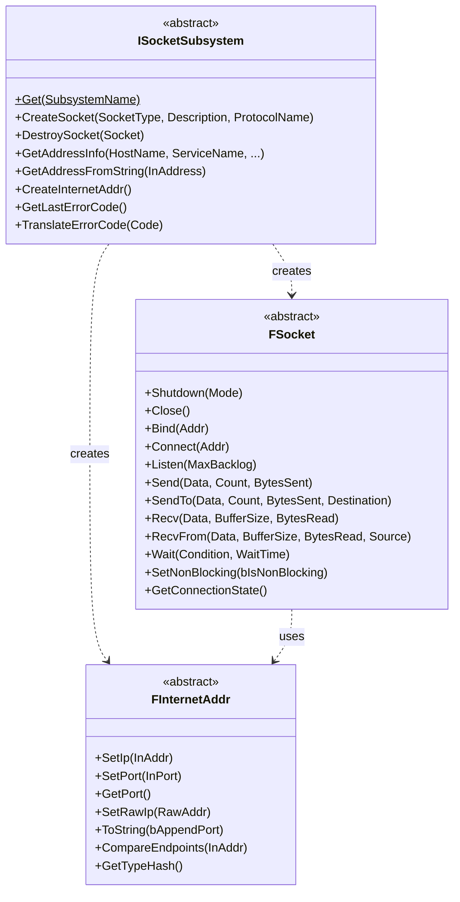
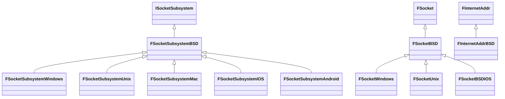
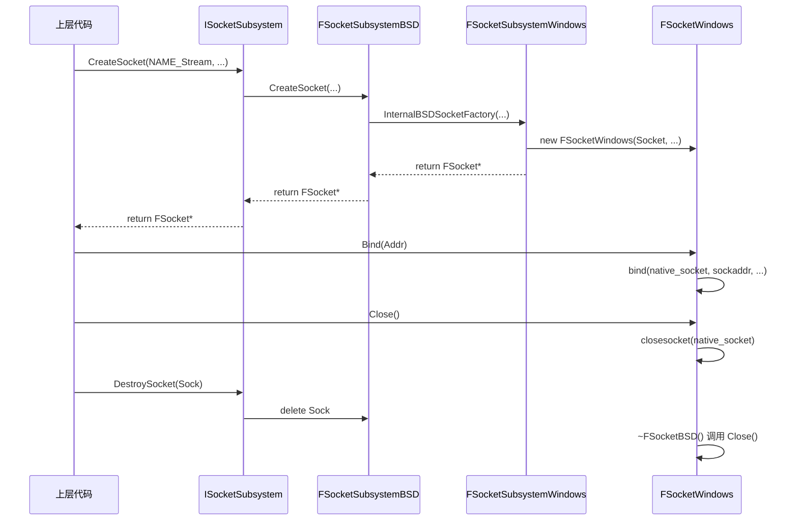

> [← 返回 UE全解析主索引]([[00-UE全解析主索引\|UE全解析主索引]])

# UE-Sockets-源码解析：Socket 子系统

## Why：为什么要学习 Socket 子系统？

- **网络通信是现代游戏的核心基础设施**。无论是多人联机、在线服务、Content Download，还是编辑器与 Cook Server 的交互，底层都依赖 Socket 进行端到端的数据传输。
- **原生 Socket API 跨平台差异巨大**。Windows 使用 WinSock2（WSAStartup/WSACleanup/WSAGetLastError），而 POSIX 平台遵循 BSD Sockets（errno/closesocket 命名差异）。直接调用原生 API 会导致大量 `#if PLATFORM_XXX` 分支。
- **UE 的 `Sockets` 模块是网络栈的根基**。`Net`（网络驱动）、`HTTP`、`NetworkFile`、`Icmp`、`PacketHandler` 等上层模块均构建于其之上。理解它的抽象边界和生命周期管理，是深入 UE 网络体系的必经之路。

## What：Socket 子系统是什么？

`Runtime/Sockets/` 是 UE 的跨平台 Socket 抽象层。它不涉及 UObject 或反射，是一个纯粹的 C++ 模块，通过**抽象基类 + 平台子类化**的方式屏蔽操作系统差异。

### 模块边界

> 文件：`Engine/Source/Runtime/Sockets/Sockets.Build.cs`，第 1~21 行

```cpp
public class Sockets : ModuleRules
{
    public Sockets(ReadOnlyTargetRules Target) : base(Target)
    {
        PublicIncludePathModuleNames.Add("NetCommon");
        PrivateDependencyModuleNames.AddRange(
            new string[] {
                "Core",
                "NetCommon"
            });
        PublicDefinitions.Add("SOCKETS_PACKAGE=1");
        CppCompileWarningSettings.UnsafeTypeCastWarningLevel = WarningLevel.Error;
    }
}
```

- **私有依赖**：`Core`（日志、内存、字符串）、`NetCommon`（包视图、公共错误码）。
- **公共定义**：`SOCKETS_PACKAGE=1` 用于控制 API 导出宏 `SOCKETS_API`。

### 核心类：接口层的三剑客

| 类 | 职责 | 关键头文件 |
|---|---|---|
| `FSocket` | 跨平台 Socket 抽象基类，定义 Bind/Connect/Send/Recv/Close 等统一接口 | `Public/Sockets.h` |
| `ISocketSubsystem` | 工厂与平台适配器，负责 CreateSocket、DestroySocket、DNS 解析、错误码映射 | `Public/SocketSubsystem.h` |
| `FInternetAddr` | IP+Port 抽象，所有数据以**网络字节序**存储 | `Public/IPAddress.h` |

#### FSocket：连接端点的抽象

> 文件：`Engine/Source/Runtime/Sockets/Public/Sockets.h`，第 18~79 行

```cpp
class FSocket : public TSharedFromThis<FSocket, ESPMode::ThreadSafe>
{
protected:
    const ESocketType SocketType;
    FString SocketDescription;
    FName SocketProtocol;
public:
    SOCKETS_API FSocket(ESocketType InSocketType, const FString& InSocketDescription, const FName& InSocketProtocol);
    SOCKETS_API virtual ~FSocket();

    virtual bool Shutdown(ESocketShutdownMode Mode) = 0;
    virtual bool Close() = 0;
    virtual bool Bind(const FInternetAddr& Addr) = 0;
    virtual bool Connect(const FInternetAddr& Addr) = 0;
    virtual bool Listen(int32 MaxBacklog) = 0;
    // ... Send/SendTo, Recv/RecvFrom, Wait, SetNonBlocking 等
};
```

`FSocket` 采用 `TSharedFromThis` 保证线程安全的共享生命周期，并规定了 Socket 的完整行为契约。

#### ISocketSubsystem：工厂与平台入口

> 文件：`Engine/Source/Runtime/Sockets/Public/SocketSubsystem.h`，第 57~128 行

```cpp
class ISocketSubsystem
{
public:
    static SOCKETS_API ISocketSubsystem* Get(const FName& SubsystemName=NAME_None);
    static SOCKETS_API void ShutdownAllSystems();

    virtual bool Init(FString& Error) = 0;
    virtual void Shutdown() = 0;
    virtual FSocket* CreateSocket(const FName& SocketType, const FString& SocketDescription, const FName& ProtocolName) = 0;
    virtual void DestroySocket(FSocket* Socket) = 0;
    virtual FAddressInfoResult GetAddressInfo(...) = 0;
    virtual TSharedPtr<FInternetAddr> GetAddressFromString(const FString& InAddress) = 0;
    virtual TSharedRef<FInternetAddr> CreateInternetAddr() = 0;
    // ... 错误码、本地地址、多播等
};
```

`ISocketSubsystem::Get()` 是全局统一入口，通过 `PLATFORM_SOCKETSUBSYSTEM` 宏（如 `FName(TEXT("WINDOWS"))`）定位默认子系统（`SocketSubsystem.h` 第 32~46 行）。

#### FInternetAddr：端点地址的抽象

> 文件：`Engine/Source/Runtime/Sockets/Public/IPAddress.h`，第 21~125 行

```cpp
class FInternetAddr
{
protected:
    FInternetAddr() {}
public:
    virtual void SetIp(uint32 InAddr) = 0;
    virtual void SetIp(const TCHAR* InAddr, bool& bIsValid) = 0;
    virtual void GetIp(uint32& OutAddr) const = 0;
    virtual void SetPort(int32 InPort) = 0;
    virtual int32 GetPort() const = 0;
    virtual void SetRawIp(const TArray<uint8>& RawAddr) = 0;
    virtual TArray<uint8> GetRawIp() const = 0;
    virtual FString ToString(bool bAppendPort) const = 0;
    virtual bool operator==(const FInternetAddr& Other) const;
    virtual uint32 GetTypeHash() const = 0;
};
```

`FInternetAddr` 隐藏了 `sockaddr_in` 与 `sockaddr_in6` 的差异，上层只需与抽象接口交互。

### 接口层类图



## How：如何使用与实现 Socket 子系统？

### 数据层：平台抽象继承体系

UE 采用**三层继承**来组织平台实现，避免每个平台重复 90% 的通用 BSD 逻辑：



#### BSD 中间层：通用实现的聚集地

**FInternetAddrBSD** 直接封装 `sockaddr_storage`，同时兼容 IPv4/IPv6：

> 文件：`Engine/Source/Runtime/Sockets/Private/BSDSockets/IPAddressBSD.h`，第 19~23 行

```cpp
class FInternetAddrBSD : public FInternetAddr
{
    sockaddr_storage Addr;
protected:
    FSocketSubsystemBSD* SocketSubsystem;
    // ...
};
```

`Addr` 成员（第 22 行）足够大以容纳 `sockaddr_in` 和 `sockaddr_in6`，配合 `GetStorageSize()` 返回实际使用长度，供 `bind/connect` 使用。

**FSocketBSD** 持有原生句柄和子系统指针：

> 文件：`Engine/Source/Runtime/Sockets/Private/BSDSockets/SocketsBSD.h`，第 43~62 行、第 128~149 行

```cpp
class FSocketBSD : public FSocket
{
public:
    FSocketBSD(SOCKET InSocket, ESocketType InSocketType, const FString& InSocketDescription, const FName& InSocketProtocol, ISocketSubsystem* InSubsystem)
        : FSocket(InSocketType, InSocketDescription, InSocketProtocol)
        , Socket(InSocket)
        , LastActivityTime(0.0)
        , SocketSubsystem(InSubsystem)
    { }

    virtual bool Bind(const FInternetAddr& Addr) override;
    virtual bool Connect(const FInternetAddr& Addr) override;
    virtual bool SendTo(const uint8* Data, int32 Count, int32& BytesSent, const FInternetAddr& Destination) override;
    virtual bool RecvFrom(uint8* Data, int32 BufferSize, int32& BytesRead, FInternetAddr& Source, ESocketReceiveFlags::Type Flags = ESocketReceiveFlags::None) override;
    // ...
protected:
    SOCKET Socket;
    std::atomic<double> LastActivityTime { 0.0 };
    int SendFlags = 0;
    ISocketSubsystem* SocketSubsystem;
};
```

**FSocketSubsystemBSD** 负责将 `FName` 协议族转换为 BSD `AF_INET/AF_INET6`，调用 `socket()` 创建句柄，并通过 `InternalBSDSocketFactory` 包装成平台特定的 `FSocketBSD` 子类：

> 文件：`Engine/Source/Runtime/Sockets/Private/BSDSockets/SocketSubsystemBSD.cpp`，第 23~62 行

```cpp
FSocket* FSocketSubsystemBSD::CreateSocket(const FName& SocketType, const FString& SocketDescription, const FName& ProtocolType)
{
    SOCKET Socket = INVALID_SOCKET;
    FName SocketProtocolType = ProtocolType;
    // 若协议未指定，回退到默认协议族
    if (ProtocolType != FNetworkProtocolTypes::IPv4 && ProtocolType != FNetworkProtocolTypes::IPv6)
    {
        SocketProtocolType = GetDefaultSocketProtocolFamily();
    }

    bool bIsUDP = SocketType.GetComparisonIndex() == NAME_DGram;
    int32 SocketTypeFlag = (bIsUDP) ? SOCK_DGRAM : SOCK_STREAM;

    Socket = socket(GetProtocolFamilyValue(SocketProtocolType), SocketTypeFlag | PlatformSpecificTypeFlags, ((bIsUDP) ? IPPROTO_UDP : IPPROTO_TCP));

    NewSocket = (Socket != INVALID_SOCKET)
        ? InternalBSDSocketFactory(Socket, ((bIsUDP) ? SOCKTYPE_Datagram : SOCKTYPE_Streaming), SocketDescription, SocketProtocolType)
        : nullptr;

    return NewSocket;
}
```

#### Windows 平台层：差异化补充

Windows 子系统继承 BSD 层，仅在初始化、错误码、创建后处理等关键点上做补充：

> 文件：`Engine/Source/Runtime/Sockets/Private/Windows/SocketSubsystemWindows.h`，第 13~60 行

```cpp
class FSocketSubsystemWindows : public FSocketSubsystemBSD
{
public:
    virtual class FSocket* CreateSocket(const FName& SocketType, const FString& SocketDescription, const FName& ProtocolType) override;
    virtual bool Init(FString& Error) override;
    virtual void Shutdown() override;
    virtual ESocketErrors GetLastErrorCode() override;
    virtual ESocketErrors TranslateErrorCode(int32 Code) override;
    // ...
protected:
    virtual FSocketBSD* InternalBSDSocketFactory(...) override;
    static FSocketSubsystemWindows* SocketSingleton;
};
```

- **初始化差异**：`Init()` 调用 `WSAStartup`，`Shutdown()` 调用 `WSACleanup`（`SocketSubsystemWindows.cpp` 第 92~126 行）。
- **错误码差异**：`GetLastErrorCode()` 调用 `WSAGetLastError()` 而非 `errno`（`SocketSubsystemWindows.cpp` 第 129~132 行）。
- **句柄继承**：`CreateSocket` 成功后设置 `SetHandleInformation(..., HANDLE_FLAG_INHERIT, 0)`，防止子进程继承 Socket 句柄（`SocketSubsystemWindows.cpp` 第 74~88 行）。
- **Shutdown 常量映射**：`FSocketWindows::Shutdown` 将 `ESocketShutdownMode` 映射为 WinSock 的 `SD_RECEIVE/SD_SEND/SD_BOTH`（`SocketsWindows.cpp` 第 12~32 行），而 BSD 层使用 POSIX 的 `SHUT_RD/SHUT_WR/SHUT_RDWR`。

### 逻辑层：生命周期与上层使用模式

#### 1. 模块与工厂生命周期

`FSocketSubsystemModule` 作为 `IModuleInterface` 被引擎模块系统管理：

> 文件：`Engine/Source/Runtime/Sockets/Public/SocketSubsystemModule.h`，第 12~90 行

```cpp
class FSocketSubsystemModule : public IModuleInterface
{
private:
    FName DefaultSocketSubsystem;
    TMap<FName, class ISocketSubsystem*> SocketSubsystems;
public:
    virtual class ISocketSubsystem* GetSocketSubsystem(const FName InSubsystemName = NAME_None);
    virtual void RegisterSocketSubsystem(const FName FactoryName, class ISocketSubsystem* Factory, bool bMakeDefault=false);
    virtual void UnregisterSocketSubsystem(const FName FactoryName);
    virtual void StartupModule() override;
    virtual void ShutdownModule() override;
};
```

- `StartupModule` 调用平台特定的 `CreateSocketSubsystem`，注册默认子系统（`SocketSubsystem.cpp` 第 111~117 行）。
- `ISocketSubsystem::Get()` 内部懒加载 `Sockets` 模块并返回对应的子系统实例（`SocketSubsystem.cpp` 第 224~246 行）。

#### 2. Socket 对象生命周期



> **关键细节**：`FSocketBSD` 的析构函数显式调用 `Close()`（`SocketsBSD.h` 第 68~71 行），确保即使上层忘记调用 `DestroySocket`，原生句柄也能被关闭。但**规范用法**仍应通过 `ISocketSubsystem::DestroySocket` 或 `FUniqueSocket` 释放。

#### 3. 智能指针封装：FUniqueSocket

为了避免手动调用 `DestroySocket`，接口层提供了带自定义 Deleter 的 UniquePtr：

> 文件：`Engine/Source/Runtime/Sockets/Public/SocketSubsystem.h`，第 48~541 行

```cpp
using FUniqueSocket = TUniquePtr<FSocket, FSocketDeleter>;

class FSocketDeleter
{
    ISocketSubsystem* Subsystem;
public:
    void operator()(FSocket* Socket) const
    {
        if (Subsystem && Socket)
        {
            Subsystem->DestroySocket(Socket);
        }
    }
};
```

配合 `ISocketSubsystem::CreateUniqueSocket`，可以写出异常安全的代码：

```cpp
FUniqueSocket MySocket = SocketSub->CreateUniqueSocket(NAME_Stream, TEXT("SafeSocket"), FNetworkProtocolTypes::IPv4);
```

#### 4. 批量接收与包信息：FRecvMulti / IP_PKTINFO

对于需要高性能 UDP 收包的场景（如 Dedicated Server），UE 提供了 `FRecvMulti` 批量接收抽象（`SocketTypes.h` 第 165~266 行），以及 `RecvFromWithPktInfo` 获取报文实际到达的本地地址。Linux/Mac 使用 `recvmsg` + `IP_PKTINFO`（`SocketsBSD.cpp` 第 237~300 行），Windows 则通过 `WSARecvMsg` 扩展函数实现（`SocketsWindows.cpp` 第 34~132 行）。

#### 5. 上层使用模式：FTcpSocketBuilder

`Networking` 模块基于 `Sockets` 提供了流式 Builder，典型用法：

> 文件：`Engine/Source/Runtime/Networking/Public/Common/TcpSocketBuilder.h`，第 18~284 行

```cpp
class FTcpSocketBuilder
{
public:
    FTcpSocketBuilder(const FString& InDescription);
    FTcpSocketBuilder AsNonBlocking();
    FTcpSocketBuilder AsReusable();
    FTcpSocketBuilder BoundToEndpoint(const FIPv4Endpoint& Endpoint);
    FTcpSocketBuilder Listening(int32 MaxBacklog);
    FTcpSocketBuilder WithSendBufferSize(int32 SizeInBytes);
    FSocket* Build() const;
    // ...
};
```

`Build()` 的核心逻辑（第 225~284 行）展示了标准使用模式：

```cpp
FSocket* FTcpSocketBuilder::Build() const
{
    FSocket* Socket = nullptr;
    ISocketSubsystem* SocketSubsystem = ISocketSubsystem::Get(PLATFORM_SOCKETSUBSYSTEM);

    if (SocketSubsystem != nullptr)
    {
        TSharedRef<FInternetAddr> BoundEndpointAddr = BoundEndpoint.ToInternetAddr();
        Socket = SocketSubsystem->CreateSocket(NAME_Stream, *Description, BoundEndpointAddr->GetProtocolType());

        if (Socket != nullptr)
        {
            bool Error = !Socket->SetReuseAddr(Reusable) ||
                         !Socket->SetLinger(Linger, LingerTimeout) ||
                         !Socket->SetRecvErr();
            if (!Error) Error = Bound && !Socket->Bind(*BoundEndpointAddr);
            if (!Error) Error = Listen && !Socket->Listen(ListenBacklog);
            if (!Error) Error = !Socket->SetNonBlocking(!Blocking);
            // ... buffer sizes
            if (Error)
            {
                SocketSubsystem->DestroySocket(Socket);
                Socket = nullptr;
            }
        }
    }
    return Socket;
}
```

#### 6. 异步 DNS 解析

`ISocketSubsystem::GetHostByName` 返回 `FResolveInfo*`，默认行为优先查 HostNameCache，未命中则创建 `FResolveInfoAsync` 在后台线程池执行 `getaddrinfo`：

> 文件：`Engine/Source/Runtime/Sockets/Public/IPAddressAsyncResolve.h`，第 13~210 行

```cpp
class FResolveInfo
{
public:
    virtual bool IsComplete() const = 0;
    virtual int32 GetErrorCode() const = 0;
    virtual const FInternetAddr& GetResolvedAddress() const = 0;
};

class FResolveInfoAsync : public FResolveInfo
{
    TSharedPtr<FInternetAddr> Addr;
    ANSICHAR HostName[256];
    int32 ErrorCode;
    volatile int32 bShouldAbandon;
    FAsyncTask<FResolveInfoAsyncWorker> AsyncTask;
public:
    FResolveInfoAsync(const ANSICHAR* InHostName);
    void StartAsyncTask() { AsyncTask.StartBackgroundTask(); }
    void DoWork();
};
```

上层通过轮询 `IsComplete()` 获取解析结果，避免在主线程阻塞网络操作。

## 设计亮点与可迁移经验

> [!tip] 可迁移到自研引擎的设计要点
> 1. **抽象工厂 + 中间层继承**：不要让每个平台从零实现。提取一个通用中间层（如 BSD Sockets），Windows/Mac/Unix 只覆盖差异点，能极大减少维护成本。
> 2. **RAII 与自定义 Deleter**：`FUniqueSocket` 通过 `TUniquePtr<FSocket, FSocketDeleter>` 将 Socket 生命周期与 Subsystem 绑定，避免了裸指针泄漏。
> 3. **协议族扩展性**：使用 `FName`（如 `FNetworkProtocolTypes::IPv4`）代替硬编码 enum，方便未来支持更多协议栈而不破坏接口。
> 4. **错误码统一映射**：所有平台错误最终收敛到 `ESocketErrors` 枚举，上层逻辑可以完全脱离平台错误码进行判断。
> 5. **地址对象与 Socket 协议一致性校验**：`FSocketBSD::Bind/Connect/SendTo` 均会检查 `Addr.GetProtocolType() != GetProtocol()`，提前发现 IPv4/IPv6 混用错误。

## 关联阅读

- [[UE-Net-源码解析：网络驱动与连接层\|UE Net 网络驱动与连接层]]
- [[UE-Online-源码解析：Online Subsystem 架构\|UE Online Subsystem 架构]]
- [[UE-HTTP-源码解析：HTTP 模块与请求生命周期\|UE HTTP 模块与请求生命周期]]
- [[UE-Engine-源码解析：World 与 Level 架构\|UE Engine World 与 Level 架构]]
- [[UE-Messaging-源码解析：Messaging 模块与 RPC\|UE Messaging 模块与 RPC]]

---

## 索引状态

- **所属 UE 阶段**：第三阶段 3.3
- **完成度**：✅
