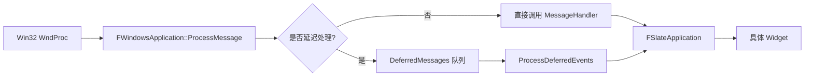

> [[00-UE全解析主索引|← 返回 00-UE全解析主索引]]

---

## Why：为什么要学习 ApplicationCore？

Unreal Engine 需要同时在 Windows、macOS、Linux、iOS、Android、主机平台等数十种环境下运行。如果每个平台都直接在引擎上层散落 `#ifdef PLATFORM_WINDOWS`，维护将是一场灾难。

`ApplicationCore` 的核心使命是：
- **抽象操作系统窗口与消息机制**，让 Slate、Renderer、Engine 以统一接口与 OS 交互；
- **隔离平台原生 API**（Win32、Cocoa、X11/Wayland、Android JNI 等），使上层代码 100% 跨平台；
- **桥接输入事件**（键鼠、手柄、触摸、手势）从 OS 到 UE 的事件处理体系。

---

## What：ApplicationCore 是什么？

`ApplicationCore` 是 UE 最底层的**平台应用抽象层**，位于 `Core` 之上、`Slate` 之下。它是一个**纯 C++、非 UObject** 的模块，不包含 `UCLASS`/`USTRUCT`/`GENERATED_BODY`，也不生成 `.generated.h`。

### 模块定位

> 文件：`Engine/Source/Runtime/ApplicationCore/ApplicationCore.Build.cs`，第 1~106 行

```csharp
public class ApplicationCore : ModuleRules
{
    PublicDependencyModuleNames.AddRange(new string[] { "Core" });
    PublicIncludePathModuleNames.AddRange(new string[] { "RHI" });
    PrivateIncludePathModuleNames.AddRange(new string[] { "InputDevice", "Analytics", "SynthBenchmark" });
    // Windows: XInput, DXGI, uiautomationcore.lib
    // macOS: OpenGL, GameController
    // Linux: SDL3
    // ...
}
```

- **Public 依赖**：仅 `Core`，保证最轻耦合；
- **Private 依赖**：`InputDevice`、`Analytics`、`SynthBenchmark`；
- **平台第三方库**：Windows 引入 `XInput`、`DXGI`（启动前 GPU 查询）、`uiautomationcore.lib`（无障碍支持）等。

### 目录结构

```
Engine/Source/Runtime/ApplicationCore/
├── ApplicationCore.Build.cs
├── Public/
│   ├── GenericPlatform/          # 跨平台抽象基类
│   │   ├── GenericApplication.h
│   │   ├── GenericWindow.h
│   │   ├── GenericApplicationMessageHandler.h
│   │   ├── GenericPlatformApplicationMisc.h
│   │   └── ICursor.h
│   ├── HAL/                      # 平台分发头
│   ├── Windows/                  # Win32 实现
│   ├── Mac/                      # macOS 实现
│   ├── Linux/                    # Linux 实现
│   ├── IOS/                      # iOS 实现
│   ├── Android/                  # Android 实现
│   └── Null/                     # 空实现（无窗口/无渲染）
└── Private/                      # 平台相关实现 .cpp
```

---

## How：接口层、数据层与逻辑层分析

### 第 1 层：接口层（What / 公共能力边界）

#### 核心抽象类

| 类/接口 | 职责 | 关键文件 |
|---------|------|----------|
| `GenericApplication` | 平台应用抽象基类：窗口工厂、消息泵、输入轮询、DPI/剪贴板/虚拟键盘事件广播 | `Public/GenericPlatform/GenericApplication.h` |
| `FGenericWindow` | 平台窗口抽象基类：移动、缩放、最大化/最小化、全屏切换、获取 OS 句柄 | `Public/GenericPlatform/GenericWindow.h` |
| `FGenericApplicationMessageHandler` | 消息处理器接口（Slate 实现该接口）。处理键鼠、触摸、手柄、手势、拖拽、窗口激活/关闭/尺寸变化等 | `Public/GenericPlatform/GenericApplicationMessageHandler.h` |
| `FGenericPlatformApplicationMisc` | 平台杂项静态工具类：生命周期 (`PreInit`/`Init`/`TearDown`)、剪贴板、屏幕物理尺寸计算 | `Public/GenericPlatform/GenericPlatformApplicationMisc.h` |
| `ICursor` | 光标接口：位置、形状、显示/隐藏、自定义光标创建 | `Public/GenericPlatform/ICursor.h` |

#### GenericApplication 的关键接口

> 文件：`Engine/Source/Runtime/ApplicationCore/Public/GenericPlatform/GenericApplication.h`，第 26~80 行

```cpp
class GenericApplication
{
public:
    virtual void PumpMessages(const float TimeDelta) = 0;
    virtual void ProcessDeferredEvents(const float TimeDelta) = 0;
    virtual void SetMessageHandler(const TSharedRef<FGenericApplicationMessageHandler>& InMessageHandler);
    virtual TSharedRef<FGenericWindow> MakeWindow();
    virtual void InitializeWindow(const TSharedRef<FGenericWindow>& Window);
    virtual float GetDPIScaleFactorAtPoint(float X, float Y) const;
    
    DECLARE_EVENT_OneParam(GenericApplication, FOnDisplayMetricsChanged, const FDisplayMetrics&);
    FOnDisplayMetricsChanged& OnDisplayMetricsChanged() { return DisplayMetricsChangedEvent; }
    // ...
};
```

`GenericApplication` 是工厂模式 + 策略模式的组合：
- `MakeWindow()` 创建平台特定窗口；
- `PumpMessages()` 从 OS 消息队列提取事件；
- `SetMessageHandler()` 将 `FGenericApplicationMessageHandler` 桥接进来。

#### FGenericWindow 的关键接口

> 文件：`Engine/Source/Runtime/ApplicationCore/Public/GenericPlatform/GenericWindow.h`，第 93~140 行

```cpp
class FGenericWindow
{
public:
    APPLICATIONCORE_API virtual void ReshapeWindow(int32 X, int32 Y, int32 Width, int32 Height);
    APPLICATIONCORE_API virtual void MoveWindowTo(int32 X, int32 Y);
    APPLICATIONCORE_API virtual void BringToFront(bool bForce = false);
    APPLICATIONCORE_API virtual void Destroy();
    APPLICATIONCORE_API virtual void Minimize();
    APPLICATIONCORE_API virtual void Maximize();
    APPLICATIONCORE_API virtual void Restore();
    APPLICATIONCORE_API virtual void Show();
    APPLICATIONCORE_API virtual void Hide();
    APPLICATIONCORE_API virtual void SetWindowMode(EWindowMode::Type InNewWindowMode);
    APPLICATIONCORE_API virtual EWindowMode::Type GetWindowMode() const;
    APPLICATIONCORE_API virtual void* GetOSWindowHandle() const;
    APPLICATIONCORE_API virtual bool IsForegroundWindow() const;
};
```

`EWindowMode` 定义了三种窗口模式：
- `Fullscreen` — 独占全屏；
- `WindowedFullscreen` — 无边框窗口全屏；
- `Windowed` — 窗口模式。

#### FGenericApplicationMessageHandler — 事件桥接核心

> 文件：`Engine/Source/Runtime/ApplicationCore/Public/GenericPlatform/GenericApplicationMessageHandler.h`，第 122~200 行（节选）

```cpp
class FGenericApplicationMessageHandler
{
public:
    virtual bool OnKeyDown(const int32 KeyCode, const uint32 CharacterCode, const bool IsRepeat);
    virtual bool OnKeyUp(const int32 KeyCode, const uint32 CharacterCode, const bool IsRepeat);
    virtual bool OnKeyChar(const TCHAR Character, const bool IsRepeat);
    virtual bool OnMouseDown(const TSharedPtr<FGenericWindow>& Window, const EMouseButtons::Type Button);
    virtual bool OnMouseUp(const TSharedPtr<FGenericWindow>& Window, const EMouseButtons::Type Button);
    virtual bool OnMouseMove();
    virtual bool OnMouseWheel(const float Delta);
    virtual bool OnTouchStarted(const TSharedPtr<FGenericWindow>& Window, const FVector2D& Location, float Force, int32 TouchIndex, FPlatformUserId PlatformUserId);
    virtual bool OnTouchMoved(const FVector2D& Location, float Force, int32 TouchIndex, FPlatformUserId PlatformUserId);
    virtual bool OnTouchEnded(const FVector2D& Location, int32 TouchIndex, FPlatformUserId PlatformUserId);
    virtual bool OnControllerButtonPressed(const FGamepadKeyNames::Type KeyName, FPlatformUserId UserId, FInputDeviceId DeviceId);
    virtual bool OnControllerButtonReleased(const FGamepadKeyNames::Type KeyName, FPlatformUserId UserId, FInputDeviceId DeviceId);
    virtual bool OnControllerAnalog(const FGamepadKeyNames::Type KeyName, FPlatformUserId UserId, FInputDeviceId DeviceId, const float AnalogValue);
    virtual bool OnSizeChanged(const TSharedPtr<FGenericWindow>& Window);
    virtual bool OnWindowActivationChanged(const TSharedPtr<FGenericWindow>& Window, const EWindowActivation ActivationType);
    virtual bool OnWindowClose(const TSharedPtr<FGenericWindow>& Window);
    // ...
};
```

这是**桥接模式（Bridge Pattern）**的典型应用：平台实现（如 `FWindowsApplication`）负责从 OS 获取原始事件，然后通过 `MessageHandler` 接口回调给 Slate，Slate 再分发给具体的 Widget。

### 第 2 层：数据层（How - Structure）

#### 平台实现类的继承关系

以 Windows 为例：

```
GenericApplication
    └── FWindowsApplication
FGenericWindow
    └── FWindowsWindow
ICursor
    └── FWindowsCursor
FGenericApplicationMessageHandler
    └── FSlateApplication (在 Slate 模块中实现)
```

> 文件：`Engine/Source/Runtime/ApplicationCore/Public/Windows/WindowsApplication.h`，第 68~150 行（节选）

```cpp
class FWindowsApplication : public GenericApplication
{
    // Win32 窗口过程、RawInput、XInput、触摸消息处理
    // 持有 HWND -> FWindowsWindow 的映射
    // 通过 MessageHandler 回调 Slate
};
```

#### FDeferredWindowsMessage — 消息延迟处理

> 文件：`Engine/Source/Runtime/ApplicationCore/Public/Windows/WindowsApplication.h`，第 129~150 行

```cpp
struct FDeferredWindowsMessage
{
    TWeakPtr<FWindowsWindow> NativeWindow;
    HWND hWND;
    uint32 Message;
    WPARAM wParam;
    LPARAM lParam;
    int32 X;
    int32 Y;
    uint32 RawInputFlags;
};
```

Windows 平台为了避免在 `WndProc` 中直接调用引擎逻辑导致重入问题，会将部分消息（如尺寸变化）先缓存到 `DeferredMessages` 队列，在 `ProcessDeferredEvents()` 中统一处理。

#### FModifierKeysState — 修饰键状态

> 文件：`Engine/Source/Runtime/ApplicationCore/Public/GenericPlatform/GenericApplication.h`，第 74~122 行

```cpp
class FModifierKeysState
{
    bool bIsLeftShiftDown;
    bool bIsRightShiftDown;
    bool bIsLeftControlDown;
    bool bIsRightControlDown;
    bool bIsLeftAltDown;
    bool bIsRightAltDown;
    bool bIsLeftCommandDown;
    bool bIsRightCommandDown;
    bool bAreCapsLocked;
};
```

这是一个**值类型（POD-like）**的数据结构，没有虚函数，栈分配友好。它体现了 UE 底层对"无分配、缓存友好"的追求。

### 第 3 层：逻辑层（How - Behavior）

#### 消息泵与事件分发流程

Windows 平台的消息处理链如下：



#### 窗口创建流程

1. `FSlateApplication::AddWindow` 请求创建平台窗口；
2. `GenericApplication::MakeWindow()` 被调用；
3. `FWindowsApplication` 创建 `FWindowsWindow`；
4. `FWindowsWindow` 调用 `CreateWindowEx` 生成真实 `HWND`；
5. 将 `HWND` 与 `TSharedPtr<FWindowsWindow>` 建立映射；
6. Slate 的 `FGenericApplicationMessageHandler` 被注册到 `FWindowsApplication`。

#### 平台分发头机制（HAL）

`ApplicationCore` 使用了 UE 经典的 **COMPILED_PLATFORM_HEADER** 模式：

```cpp
// HAL/PlatformApplicationMisc.h
#include COMPILED_PLATFORM_HEADER(PlatformApplicationMisc.h)
```

在编译期，根据目标平台，这个宏会被替换为：
- `Windows/WindowsPlatformApplicationMisc.h`
- `Linux/LinuxPlatformApplicationMisc.h`
- `Mac/MacPlatformApplicationMisc.h`
- ...

这样上层代码只需 `#include "HAL/PlatformApplicationMisc.h"`，即可获得当前平台的实现。

---

## 上下层模块关系

### 向下：依赖 Core

- 使用 `TSharedPtr`/`TSharedRef`、`TArray`、`FString`、`FName`、`FVector2D`；
- 使用 Unreal 委托系统 (`Delegates/Delegate.h`)；
- 使用 `COMPILED_PLATFORM_HEADER` 宏体系。

### 向上：桥接 Slate

- `GenericApplication` 持有 `TSharedRef<FGenericApplicationMessageHandler> MessageHandler`；
- `FSlateApplication` 实现该接口，接收所有输入和窗口事件；
- 部分事件（虚拟键盘显隐、剪贴板变化、显示器配置变化）通过 `DECLARE_EVENT` 直接广播，Slate 订阅即可。

### 平行：与 RHI 的交互

- `PublicIncludePathModuleNames.Add("RHI")` 允许 `ApplicationCore` 在启动前查询 GPU 信息（通过 `DXGI`），这在 RHI 模块初始化之前就需要执行。

---

## 设计亮点与可迁移经验

### 1. 桥接模式隔离平台与上层
`FGenericApplicationMessageHandler` 是桥接模式的核心。平台实现完全不依赖 Slate，只依赖一个纯虚接口；Slate 实现这个接口即可接管所有事件。如果需要替换 UI 框架（比如自研引擎不用 Slate），只需替换 `MessageHandler` 的实现即可。

### 2. 工厂模式 + 平台分发头
`GenericApplication::MakeWindow()` 是工厂方法，平台子类决定创建哪种窗口。配合 `COMPILED_PLATFORM_HEADER`，实现了编译期零运行时开销的平台多态。

### 3. 消息延迟队列避免重入
Windows 的 `WndProc` 是同步回调，如果在其中直接触发 Slate 布局变化，可能再次触发 `SetWindowPos` -> `WndProc` 的递归。`FDeferredWindowsMessage` 将这类消息延迟到 `ProcessDeferredEvents()` 中处理，彻底消除了重入风险。

### 4. 纯 C++、零 UObject
`ApplicationCore` 是一个完全脱离 UObject 反射体系的原生 C++ 模块。这说明 UE 的底层基础设施是"分层渐进"的：最底层只用 C++，往上才逐步引入 UObject、GC、反射。

---

## 关键源码片段

### 平台应用消息处理器接口

> 文件：`Engine/Source/Runtime/ApplicationCore/Public/GenericPlatform/GenericApplicationMessageHandler.h`，第 122~200 行

```cpp
class FGenericApplicationMessageHandler
{
public:
    virtual bool OnKeyDown(const int32 KeyCode, const uint32 CharacterCode, const bool IsRepeat);
    virtual bool OnKeyUp(const int32 KeyCode, const uint32 CharacterCode, const bool IsRepeat);
    virtual bool OnMouseDown(const TSharedPtr<FGenericWindow>& Window, const EMouseButtons::Type Button);
    virtual bool OnMouseUp(const TSharedPtr<FGenericWindow>& Window, const EMouseButtons::Type Button);
    virtual bool OnSizeChanged(const TSharedPtr<FGenericWindow>& Window);
    virtual bool OnWindowClose(const TSharedPtr<FGenericWindow>& Window);
    // ... 还有更多输入事件
};
```

### 窗口模式枚举

> 文件：`Engine/Source/Runtime/ApplicationCore/Public/GenericPlatform/GenericWindow.h`，第 14~47 行

```cpp
namespace EWindowMode
{
    enum Type : int
    {
        Fullscreen,         // 独占全屏
        WindowedFullscreen, // 无边框窗口全屏
        Windowed,           // 窗口模式
        NumWindowModes
    };
}
```

### Windows 延迟消息结构

> 文件：`Engine/Source/Runtime/ApplicationCore/Public/Windows/WindowsApplication.h`，第 129~141 行

```cpp
struct FDeferredWindowsMessage
{
    TWeakPtr<FWindowsWindow> NativeWindow;
    HWND hWND;
    uint32 Message;
    WPARAM wParam;
    LPARAM lParam;
    int32 X;
    int32 Y;
    uint32 RawInputFlags;
};
```

---

## 关联阅读

- [[UE-Core-源码解析：基础类型与宏体系]]
- [[UE-Core-源码解析：委托与事件系统]]
- [[UE-Slate-源码解析：Slate UI 运行时]]
- [[UE-专题：UI 渲染与输入处理链路]]

---

## 索引状态

- **所属 UE 阶段**：第二阶段-基础层 / 2.3 平台抽象与 tracing
- **对应 UE 笔记**：UE-ApplicationCore-源码解析：窗口与平台抽象
- **本轮分析完成度**：✅ 三层分析已完成（接口层、数据层、逻辑层）
