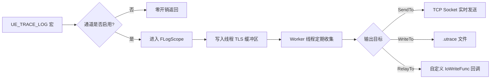

> [[00-UE全解析主索引|← 返回 00-UE全解析主索引]]

---

## Why：为什么要学习 TraceLog？

当引擎规模达到数十万行代码、涉及数百个模块时，传统的"断点调试"和"日志打印"已经无法满足性能分析需求。开发者需要：
- **低开销的事件追踪**：在 60fps 甚至 120fps 下记录每一帧发生了什么；
- **跨模块的时序可视化**：从 Game Thread 到 Render Thread 到 RHI Thread 的完整调用链；
- **可离线分析的海量数据**：将运行时 trace 数据流输出到文件或远程工具，事后回放。

UE 的答案是 **TraceLog** + **UnrealInsights**。TraceLog 是底层的高性能埋点库，Insights 是上层的可视化分析工具。

---

## What：TraceLog 是什么？

`TraceLog` 是 UE 的**自包含、宏驱动、零 UObject 依赖**的高性能 tracing 库。它的设计目标：
- **极低开销**：编译期通过宏完全消除 Shipping 构建中的 tracing 代码；
- **线程安全**：每个线程拥有独立的 TLS 写缓冲区，避免锁竞争；
- **零依赖**：仅依赖 `Core` 的基础头文件，甚至可以脱离引擎独立运行；
- **协议解耦**：通过自定义二进制协议输出数据，不直接依赖 UnrealInsights。

### 模块定位

> 文件：`Engine/Source/Runtime/TraceLog/TraceLog.Build.cs`

```csharp
public class TraceLog : ModuleRules
{
    PublicIncludePathModuleNames.Add("Core");
    bRequiresImplementModule = false;
    PublicDefinitions.Add("SUPPRESS_PER_MODULE_INLINE_FILE");
    // Editor 构建时禁用 AutoRTFMInstrumentation
}
```

- **PublicIncludePathModuleNames.Add("Core")**：仅引入 `Core` 的基础头，耦合极轻；
- **bRequiresImplementModule = false**：没有 `IMPLEMENT_MODULE`，TraceLog 不作为一个可动态加载的模块存在，而是作为静态库直接链接；
- **SUPPRESS_PER_MODULE_INLINE_FILE**：不使用 Core 的标准 `new/delete` 重载，保持独立。

### 目录结构

```
Engine/Source/Runtime/TraceLog/
├── TraceLog.Build.cs
├── Public/Trace/
│   ├── Trace.h              # 公共 API 入口
│   ├── Trace.inl            # 内联实现
│   ├── Config.h             # 编译期开关 (UE_TRACE_ENABLED 等)
│   └── Detail/
│       ├── Trace.h          # 宏定义核心
│       ├── Channel.h        # FChannel 通道系统
│       ├── LogScope.h       # FLogScope / FScopedLogScope
│       ├── Field.h          # TField / FFieldDesc
│       ├── EventNode.h      # FEventNode / FEventInfo
│       ├── Writer.inl       # FWriteBuffer
│       ├── Transport.h      # ETransport / FTidPacket
│       ├── Protocol.h       # 协议版本聚合头
│       └── Important/       # 重要事件缓存
└── Private/Trace/
    ├── Trace.cpp            # API 转发层
    ├── Writer.cpp           # 核心写入器、TLS 缓冲、输出管理
    ├── Control.cpp          # TCP 控制端口 (接受 Insights 远程命令)
    ├── Channel.cpp          # 通道实现
    ├── Message.cpp          # 消息格式化
    ├── EventNode.cpp        # 事件注册
    ├── BlockPool.cpp        # 内存块池
    ├── TlsBuffer.cpp        # 线程本地缓冲管理
    ├── Tail.cpp             # Tail 缓冲 (启动早期事件缓存)
    └── Platform.h + 各平台实现
```

> **注意**：没有 `Classes/` 目录，也没有 UObject 体系。

---

## How：接口层、数据层与逻辑层分析

### 第 1 层：接口层（What / 公共能力边界）

TraceLog 的公共 API 几乎完全由宏提供。

#### 通道定义与使用

> 文件：`Engine/Source/Runtime/TraceLog/Public/Trace/Detail/Trace.h`，第 33~72 行

```cpp
// 定义一个 Trace 通道
#define TRACE_PRIVATE_CHANNEL(ChannelName, ...)
// 外部声明一个通道
#define TRACE_PRIVATE_CHANNEL_EXTERN(ChannelName, ...)
// 判断通道表达式是否启用
#define TRACE_PRIVATE_CHANNELEXPR_IS_ENABLED(ChannelsExpr) bool(ChannelsExpr)
```

开发者使用的高层宏：

```cpp
UE_TRACE_CHANNEL_DEFINE(MyChannel);
UE_TRACE_CHANNEL_EXTERN(MyChannel);

bool bEnabled = UE_TRACE_CHANNELEXPR_IS_ENABLED(MyChannel);
```

#### 事件定义与发射

> 文件：`Engine/Source/Runtime/TraceLog/Public/Trace/Detail/Trace.h`，第 73~170 行

```cpp
// 定义事件 Schema
#define TRACE_PRIVATE_EVENT_BEGIN(LoggerName, EventName, ...)
#define TRACE_PRIVATE_EVENT_FIELD(FieldType, FieldName)
#define TRACE_PRIVATE_EVENT_REFFIELD(RefLogger, RefEventType, FieldName)
#define TRACE_PRIVATE_EVENT_END()

// 发射事件
#define TRACE_PRIVATE_LOG(LoggerName, EventName, ChannelsExpr, ...)
#define TRACE_PRIVATE_LOG_SCOPED(LoggerName, EventName, ChannelsExpr, ...)
```

开发者使用示例：

```cpp
UE_TRACE_EVENT_BEGIN(MyLogger, MyEvent, Important|NoSync)
    UE_TRACE_EVENT_FIELD(uint32, Id)
    UE_TRACE_EVENT_FIELD(uint64, Time)
UE_TRACE_EVENT_END()

UE_TRACE_LOG(MyLogger, MyEvent, MyChannel, Id(42), Time(12345));
```

#### 初始化与控制 API

> 文件：`Engine/Source/Runtime/TraceLog/Public/Trace/Trace.h`，第 141~200 行

```cpp
namespace UE {
namespace Trace {

struct FInitializeDesc
{
    uint32 TailSizeBytes = 4 << 20;    // Tail 缓冲区大小
    uint32 ThreadSleepTimeInMS = 0;
    uint32 BlockPoolMaxSize = UE_TRACE_BLOCK_POOL_MAXSIZE;
    bool bUseWorkerThread = true;
    bool bUseImportantCache = true;
    OnConnectFunc* OnConnectionFunc = nullptr;
    OnUpdateFunc* OnUpdateFunc = nullptr;
};

UE_TRACE_API bool Initialize(const FInitializeDesc& Desc = FInitializeDesc());
UE_TRACE_API void Shutdown();
UE_TRACE_API bool SendTo(const ANSICHAR* Host, uint32 Port = 0);
UE_TRACE_API bool WriteTo(const ANSICHAR* Path);
UE_TRACE_API bool Stop();
UE_TRACE_API void ToggleChannel(const ANSICHAR* ChannelName, bool bEnabled);

} // namespace Trace
} // namespace UE
```

### 第 2 层：数据层（How - Structure）

#### FChannel — Trace 通道

`FChannel` 是一个命名开关，支持按位或组合（`ChanA | ChanB`）。每个事件在定义时关联到某些通道，运行时只有通道启用才会实际写入数据。

> 文件：`Engine/Source/Runtime/TraceLog/Public/Trace/Detail/Channel.h`

```cpp
namespace UE {
namespace Trace {
class FChannel
{
public:
    void Setup(const ANSICHAR* InName, const ANSICHAR* InDesc);
    bool IsEnabled() const;
    void Toggle(bool bState);
    // ...
};
} // namespace Trace
} // namespace UE
```

#### FEventNode / FEventInfo — 事件元数据

```cpp
namespace UE {
namespace Trace {
namespace Private {

class FEventNode
{
public:
    uint32 Initialize(FEventInfo* Info);
    // ...
};

struct FEventInfo
{
    static constexpr uint16 Flag_Important = 1 << 0;  // 重要事件（连接前缓存）
    static constexpr uint16 Flag_NoSync    = 1 << 1;  // 无需同步
    static constexpr uint16 Flag_Definition8  = 1 << 2;
    static constexpr uint16 Flag_Definition16 = 1 << 3;
    static constexpr uint16 Flag_Definition32 = 1 << 4;
    static constexpr uint16 Flag_Definition64 = 1 << 5;
    
    FLiteralName LoggerName;
    FLiteralName EventName;
    FFieldDesc* Fields;
    uint16 NumFields;
    uint16 Flags;
};

} // namespace Private
} // namespace Trace
} // namespace UE
```

事件元数据包含：Logger 名、Event 名、字段数组、Flags。`Important` 标志表示该事件即使在连接建立前发生，也会被缓存到 `ImportantCache` 中，待连接建立后随 Session Prologue 一起发送。

#### FLogScope / TLogScope — 事件写入作用域

`FLogScope` 提供 `Enter()` 接口，将事件数据写入线程本地缓冲区。`TLogScope<bMaybeHasAux>` 是模板化的作用域类型，用于处理是否有辅助字段（Aux Fields）。

#### FWriteBuffer — TLS 写缓冲区

> 文件：`Engine/Source/Runtime/TraceLog/Public/Trace/Detail/Writer.inl`

```cpp
struct FWriteBuffer
{
    uint8* Cursor;
    uint8* Committed;
    uint8* Reaped;
    // ...
};
```

每个线程拥有一个 `FWriteBuffer`（通过 `thread_local` 或平台等效的 TLS 机制），采用**三指针模型**：
- `Cursor`：当前写入位置；
- `Committed`：已提交给 Writer 的边界；
- `Reaped`：已被输出器回收的边界。

这种设计实现了**无锁或轻锁写入**：线程只管往自己的 TLS 缓冲区写，后台 Worker 线程定期批量收集并输出。

#### 线程退出时的缓冲回收

> 文件：`Engine/Source/Runtime/TraceLog/Private/Trace/Writer.cpp`，第 119~161 行

```cpp
struct FWriteTlsContext
{
    ~FWriteTlsContext()
    {
        if (AtomicLoadRelaxed(&GInitialized))
        {
            Writer_EndThreadBuffer();
        }
    }
    uint32 GetThreadId();
    uint32 ThreadId = 0;
};

thread_local FWriteTlsContext GTlsContext;

uint32 Writer_GetThreadId()
{
    return GTlsContext.GetThreadId();
}
```

`FWriteTlsContext` 的析构函数在线程退出时自动调用 `Writer_EndThreadBuffer()`，将该线程剩余的 trace 数据回收，避免数据丢失。这是 RAII 思想的经典应用。

### 第 3 层：逻辑层（How - Behavior）

#### Trace 数据输出流程



#### 编译期零开销消除

> 文件：`Engine/Source/Runtime/TraceLog/Public/Trace/Trace.h`，第 8~45 行

```cpp
#if TRACE_PRIVATE_MINIMAL_ENABLED
#   define UE_TRACE_IMPL(...)
#   define UE_TRACE_API TRACELOG_API
#else
#   define UE_TRACE_IMPL(...) { return __VA_ARGS__; }
#   define UE_TRACE_API inline
#endif
```

在 Shipping 构建中，`UE_TRACE_ENABLED` 被定义为 0，导致 `TRACE_PRIVATE_FULL_ENABLED` 和 `TRACE_PRIVATE_MINIMAL_ENABLED` 都为 0。此时：
- 所有 `UE_TRACE_LOG*` 宏展开为**空语句**或**直接返回**；
- 事件定义宏虽然会生成结构体，但不会被实例化；
- 真正实现了**零运行时开销**。

#### TCP 控制通道

> 文件：`Engine/Source/Runtime/TraceLog/Private/Trace/Control.cpp`，第 52~138 行

```cpp
static uint16 GControlPort = 1985;

static bool Writer_ControlListen()
{
    GControlListen = TcpSocketListen(GControlPort);
    if (!GControlListen)
    {
        uint32 Seed = uint32(TimeGetTimestamp());
        for (uint32 i = 0; i < 10 && !GControlListen; Seed *= 13, ++i)
        {
            uint16 Port((Seed & 0x1fff) + 0x8000);
            GControlListen = TcpSocketListen(Port);
            if (GControlListen)
            {
                GControlPort = Port;
                break;
            }
        }
    }
    // ...
}
```

TraceLog 默认监听 **TCP 1985** 端口（如果被占用则随机选择高位端口），接受来自 UnrealInsights 的远程命令：
- `SendTo <host:port>` — 将 trace 数据发往远端；
- `Stop` — 停止当前输出；
- `ToggleChannels <channels> <0|1>` — 动态开关通道。

控制命令的解析是一个极简的文本协议：

> 文件：`Engine/Source/Runtime/TraceLog/Private/Trace/Control.cpp`，第 162~200 行

```cpp
static void Writer_ControlRecv()
{
    ANSICHAR Buffer[512];
    // 按 CRLF 分割，解析为 ArgV 数组
    // 然后通过 Writer_ControlDispatch 分发到注册的命令 Thunk
}
```

#### 命令分发器

> 文件：`Engine/Source/Runtime/TraceLog/Private/Trace/Control.cpp`，第 37~106 行

```cpp
struct FControlCommands
{
    enum { Max = 8 };
    struct {
        uint32 Hash;
        void* Param;
        void (*Thunk)(void*, uint32, ANSICHAR const* const*);
    } Commands[Max];
    uint8 Count;
};

static bool Writer_ControlDispatch(uint32 ArgC, ANSICHAR const* const* ArgV)
{
    uint32 Hash = Writer_ControlHash(ArgV[0]);
    for (int i = 0, n = GControlCommands.Count; i < n; ++i)
    {
        const auto& Command = GControlCommands.Commands[i];
        if (Command.Hash == Hash)
        {
            Command.Thunk(Command.Param, ArgC, ArgV);
            return true;
        }
    }
    return false;
}
```

这是一个非常轻量的命令表（最多 8 条命令），使用 DJB2 Hash 进行快速匹配，没有动态内存分配，完全适合在性能敏感场景中运行。

#### 协议版本与 Session Prologue

TraceLog 使用自定义二进制协议（当前版本 **Protocol 7**），数据包格式为 `ETransport::TidPacketSync`。每个 Session 开始时会发送一个 **NewTrace** 事件作为 Prologue：

> 文件：`Engine/Source/Runtime/TraceLog/Private/Trace/Writer.cpp`，第 77~83 行

```cpp
UE_TRACE_MINIMAL_EVENT_BEGIN($Trace, NewTrace, Important | NoSync)
    UE_TRACE_MINIMAL_EVENT_FIELD(uint64, StartCycle)
    UE_TRACE_MINIMAL_EVENT_FIELD(uint64, CycleFrequency)
    UE_TRACE_MINIMAL_EVENT_FIELD(uint16, Endian)
    UE_TRACE_MINIMAL_EVENT_FIELD(uint8, PointerSize)
    UE_TRACE_MINIMAL_EVENT_FIELD(double, StartDateTime)
UE_TRACE_MINIMAL_EVENT_END()
```

这个事件标记了 Session 的起始时间戳、CPU 频率、字节序、指针大小等关键信息。由于标记了 `Important`，即使在 UnrealInsights 连接之前它也会被缓存，保证分析工具能获取完整的上下文。

---

## 上下层模块关系

### 向下：极轻耦合 Core

- 仅通过 `PublicIncludePathModuleNames.Add("Core")` 引入基础头（`CoreTypes.h`、`HAL/Platform.h`、`Misc/CString.h`、`Templates/UnrealTemplate.h` 等）；
- 不使用 UObject、内存分配器家族、日志系统等 Core 高级服务；
- `SUPPRESS_PER_MODULE_INLINE_FILE` 确保不使用 Core 的 `new/delete` 全局重载。

### 向上：与 UnrealInsights 零代码依赖

- TraceLog 不知道 Insights 的存在；
- 仅通过 TCP 控制端口和二进制数据协议与外部交互；
- 这意味着 Insights 可以被替换为任何兼容协议的第三方分析工具。

### 平行：被各模块调用

- `Core`、`Engine`、`RenderCore`、`RHI`、`Slate` 等各模块都通过 `UE_TRACE_LOG*` 宏向 TraceLog 输出事件；
- 事件定义分散在各模块中，TraceLog 只负责统一收集和输出。

---

## 设计亮点与可迁移经验

### 1. 宏驱动的零成本抽象
TraceLog 的公共接口完全由宏提供。在 Shipping 构建中，这些宏展开为空，真正实现**零运行时开销**。这是高性能埋点系统的设计典范：不要依赖虚函数或模板特化来做开关，要在**预处理阶段**就消除代码。

### 2. TLS 写缓冲 + Worker 收集
每个线程拥有独立的写缓冲区，完全避免锁竞争。后台 Worker 线程批量收集并输出。这种"生产者-消费者"模型是高性能日志/tracing 系统的标准答案。

### 3. 三指针缓冲区管理
`Cursor / Committed / Reaped` 三指针模型简洁高效，支持无锁写入、批量提交、按需回收。比环形缓冲区或锁保护的 `TArray` 更适合高频、小数据的 tracing 场景。

### 4. 重要事件缓存（Important Cache）
标记为 `Important` 的事件会被缓存到独立的 `ImportantCache` 中。即使 UnrealInsights 在引擎启动后才连接，也能收到 Session Prologue 和早期初始化事件。这解决了"启动期黑盒"问题。

### 5. 完全解耦的输出目标
TraceLog 支持 `SendTo`（TCP）、`WriteTo`（文件）、`RelayTo`（自定义回调）三种输出方式。上层的 Insights 只是 TCP 接收端的一种实现。这种设计让底层 tracing 库与上层可视化工具完全解耦。

### 6. 自包含、可独立运行
TraceLog 的耦合度极低，理论上可以脱离 UE 引擎独立编译使用。对于自研引擎来说，这是一个非常好的参考：先做一个自包含的 tracing 核心库，再逐步在外围添加平台适配和可视化工具。

---

## 关键源码片段

### 编译期开关

> 文件：`Engine/Source/Runtime/TraceLog/Public/Trace/Config.h`，第 12~57 行

```cpp
#if !defined(UE_TRACE_ENABLED)
#   if !UE_BUILD_SHIPPING && !IS_PROGRAM
#       if PLATFORM_WINDOWS || PLATFORM_UNIX || PLATFORM_APPLE || PLATFORM_ANDROID
#           define UE_TRACE_ENABLED 1
#       endif
#   endif
#endif

#if !defined(UE_TRACE_ENABLED)
#   define UE_TRACE_ENABLED 0
#endif
```

### 宏定义：事件定义

> 文件：`Engine/Source/Runtime/TraceLog/Public/Trace/Detail/Trace.h`，第 73~105 行

```cpp
#define TRACE_PRIVATE_EVENT_BEGIN(LoggerName, EventName, ...) \
    TRACE_PRIVATE_EVENT_DEFINE(LoggerName, EventName); \
    struct F##LoggerName##EventName##Fields { \
        enum { \
            Important = UE::Trace::Private::FEventInfo::Flag_Important, \
            NoSync    = UE::Trace::Private::FEventInfo::Flag_NoSync, \
            // ... \
        }; \
        // ... 自动计算字段偏移和 UID \
    };
```

### TCP 控制端口监听

> 文件：`Engine/Source/Runtime/TraceLog/Private/Trace/Control.cpp`，第 109~138 行

```cpp
static bool Writer_ControlListen()
{
    GControlListen = TcpSocketListen(GControlPort); // 1985
    if (!GControlListen)
    {
        uint32 Seed = uint32(TimeGetTimestamp());
        for (uint32 i = 0; i < 10 && !GControlListen; Seed *= 13, ++i)
        {
            uint16 Port((Seed & 0x1fff) + 0x8000);
            GControlListen = TcpSocketListen(Port);
            if (GControlListen)
            {
                GControlPort = Port;
                break;
            }
        }
    }
    UE_TRACE_MESSAGE_F(Display, "Control listening on port %u", GControlPort);
    GControlState = EControlState::Listening;
    return true;
}
```

### Session Prologue 事件

> 文件：`Engine/Source/Runtime/TraceLog/Private/Trace/Writer.cpp`，第 77~83 行

```cpp
UE_TRACE_MINIMAL_EVENT_BEGIN($Trace, NewTrace, Important | NoSync)
    UE_TRACE_MINIMAL_EVENT_FIELD(uint64, StartCycle)
    UE_TRACE_MINIMAL_EVENT_FIELD(uint64, CycleFrequency)
    UE_TRACE_MINIMAL_EVENT_FIELD(uint16, Endian)
    UE_TRACE_MINIMAL_EVENT_FIELD(uint8, PointerSize)
    UE_TRACE_MINIMAL_EVENT_FIELD(double, StartDateTime)
UE_TRACE_MINIMAL_EVENT_END()
```

### 线程 TLS 上下文

> 文件：`Engine/Source/Runtime/TraceLog/Private/Trace/Writer.cpp`，第 122~161 行

```cpp
struct FWriteTlsContext
{
    ~FWriteTlsContext()
    {
        if (AtomicLoadRelaxed(&GInitialized))
        {
            Writer_EndThreadBuffer();
        }
    }
    uint32 GetThreadId();
    uint32 ThreadId = 0;
};

thread_local FWriteTlsContext GTlsContext;

uint32 Writer_GetThreadId()
{
    return GTlsContext.GetThreadId();
}
```

---

## 关联阅读

- [[UE-Core-源码解析：线程、任务与同步原语]]
- [[UE-Core-源码解析：日志、断言与调试]]
- [[UE-Programs-源码解析：UnrealInsights 性能分析]]
- [[UE-专题：多线程与任务系统]]

---

## 索引状态

- **所属 UE 阶段**：第二阶段-基础层 / 2.3 平台抽象与 tracing
- **对应 UE 笔记**：UE-TraceLog-源码解析：Tracing 与性能埋点
- **本轮分析完成度**：✅ 三层分析已完成（接口层、数据层、逻辑层）
