> [← 返回 UE全解析主索引]([[00-UE全解析主索引|UE全解析主索引]])

## Why：为什么要学习蓝图编译系统？

蓝图（Blueprint）是 UE 最核心的可视化编程系统。理解其编译与运行时的实现，是掌握 UE 编辑器架构的关键：

- **编辑器层核心**：蓝图编辑、编译、调试贯穿整个 UE 编辑器生命周期
- **代码生成链路**：从可视化图节点 → 中间表示（IR）→ VM 字节码，是一条完整的编译管线
- **运行时基础**：蓝图生成的 `UBlueprintGeneratedClass` 是运行时真正被执行的类
- **可迁移经验**：图编译器的设计模式（节点→Handler→IR→后端）对自研工具链具有参考价值

## What：三个模块的职责边界

本次分析覆盖三个紧密协作的模块：

| 模块 | 路径 | 核心职责 |
|------|------|----------|
| **BlueprintGraph** | `Engine/Source/Editor/BlueprintGraph` | K2 节点定义、图 Schema、节点生成器（Spawner）、编辑器交互 |
| **KismetCompiler** | `Engine/Source/Editor/KismetCompiler` | 蓝图编译核心：图→UClass/UFuction 的完整编译管线 |
| **Kismet** | `Engine/Source/Editor/Kismet` | 蓝图编辑器 UI、编译管理器（CompilationManager）、调试器、SCS 编辑器 |

三者的调用关系：`Kismet`（UI/入口）→ `KismetCompiler`（编译器）→ `BlueprintGraph`（节点定义与 Schema）。

---

## 接口层（What）

### 1. 模块依赖分析

> 文件：`Engine/Source/Editor/BlueprintGraph/BlueprintGraph.Build.cs`，第 1~50 行

```csharp
PublicDependencyModuleNames.AddRange(
    new string[] { "Core", "CoreUObject", "Engine", "InputCore", "Slate", "DeveloperSettings" }
);
PrivateDependencyModuleNames.AddRange(
    new string[] { "KismetCompiler", "EditorFramework", "UnrealEd", "GraphEditor",
                   "SlateCore", "Kismet", "KismetWidgets", "PropertyEditor", ... }
);
CircularlyReferencedDependentModules.AddRange(
    new string[] { "KismetCompiler", "UnrealEd", "GraphEditor", "Kismet" }
);
```

- **BlueprintGraph** 对外暴露公共接口给 `GraphEditor`、`Kismet`、`KismetCompiler` 等模块
- 存在**循环依赖**（CircularlyReferencedDependentModules），这是 UE 编辑器模块常见的设计

> 文件：`Engine/Source/Editor/KismetCompiler/KismetCompiler.Build.cs`，第 1~28 行

```csharp
PrivateDependencyModuleNames.AddRange(
    new string[] { "Core", "CoreUObject", "Engine", "FieldNotification", "InputCore",
                   "EditorFramework", "UnrealEd", "MovieScene", "BlueprintGraph",
                   "AnimGraph", "MessageLog", "Kismet", "ScriptDisassembler" }
);
```

- **KismetCompiler** 全部为 Private 依赖，说明它是一个**被调用方**，不对外暴露公共 API
- 依赖 `BlueprintGraph` 获取节点定义，依赖 `AnimGraph` 处理动画蓝图的特殊编译逻辑

> 文件：`Engine/Source/Editor/Kismet/Kismet.Build.cs`，第 1~95 行

```csharp
PrivateDependencyModuleNames.AddRange(
    new string[] { "AppFramework", "Core", "CoreUObject", "Slate", "SlateCore",
                   "EditorStyle", "Engine", "Json", "Merge", "MessageLog",
                   "EditorFramework", "UnrealEd", "GraphEditor", "KismetWidgets",
                   "KismetCompiler", "BlueprintGraph", "BlueprintEditorLibrary",
                   "AnimGraph", "PropertyEditor", "SourceControl", ... }
);
CircularlyReferencedDependentModules.AddRange(
    [ "BlueprintGraph", "UMGEditor", "Merge", "KismetCompiler", "SubobjectEditor" ]
);
```

- **Kismet** 是编辑器 UI 层，聚合了几乎所有编辑器模块

### 2. 核心 UObject 类与反射边界

#### BlueprintGraph 核心类

> 文件：`Engine/Source/Editor/BlueprintGraph/Classes/K2Node.h`，第 199~598 行

```cpp
UCLASS(abstract, MinimalAPI)
class UK2Node : public UEdGraphNode
{
    GENERATED_UCLASS_BODY()
public:
    // 节点重建（引脚变化时调用）
    BLUEPRINTGRAPH_API virtual void ReconstructNode() override;
    // 编译期节点展开（如宏实例展开为实际节点）
    BLUEPRINTGRAPH_API virtual void ExpandNode(class FKismetCompilerContext& CompilerContext, UEdGraph* SourceGraph);
    // 创建该节点对应的编译器 Handler
    virtual class FNodeHandlingFunctor* CreateNodeHandler(class FKismetCompilerContext& CompilerContext) const { return nullptr; }
    // 获取所属蓝图
    BLUEPRINTGRAPH_API UBlueprint* GetBlueprint() const;
    // ...
};
```

- `UK2Node` 是所有蓝图图节点的抽象基类，继承自 `UEdGraphNode`
- `ExpandNode()` 是编译期**节点展开**的关键虚函数，允许一个节点在编译时被替换/扩展为多个节点
- `CreateNodeHandler()` 返回 `FNodeHandlingFunctor`，用于将节点转换为编译中间表示

> 文件：`Engine/Source/Editor/BlueprintGraph/Classes/EdGraphSchema_K2.h`，第 385~999 行

```cpp
UCLASS(MinimalAPI, config=Editor)
class UEdGraphSchema_K2 : public UEdGraphSchema
{
    GENERATED_UCLASS_BODY()
public:
    // 蓝图支持的 Pin 类型常量
    static UE_API const FName PC_Exec;      // 执行流
    static UE_API const FName PC_Boolean, PC_Byte, PC_Int, PC_Int64;
    static UE_API const FName PC_Float, PC_Double, PC_Real;
    static UE_API const FName PC_Object, PC_Class, PC_Interface;
    static UE_API const FName PC_Struct, PC_Array, PC_Set, PC_Map;
    static UE_API const FName PC_Delegate, PC_MCDelegate;
    static UE_API const FName PC_String, PC_Text, PC_Name;
    static UE_API const FName PC_Wildcard, PC_Enum, PC_FieldPath;
    // ...
};
```

- `UEdGraphSchema_K2` 定义了蓝图图的所有**类型系统**：Pin 的 Category、SubCategory、连接规则
- 它是编译器和编辑器共享的**类型契约**

> 文件：`Engine/Source/Editor/BlueprintGraph/Classes/K2Node_CallFunction.h`，第 47~296 行

```cpp
UCLASS(MinimalAPI)
class UK2Node_CallFunction : public UK2Node
{
    GENERATED_UCLASS_BODY()
    // 引用的函数
    UPROPERTY() FMemberReference FunctionReference;
    // 是否纯函数（无副作用）
    UPROPERTY() uint32 bDefaultsToPureFunc:1;
    // 是否需要枚举展开为多执行引脚
    UPROPERTY() uint32 bWantsEnumToExecExpansion:1;
};
```

> 文件：`Engine/Source/Editor/BlueprintGraph/Classes/K2Node_Event.h`，第 37~144 行

```cpp
UCLASS(MinimalAPI)
class UK2Node_Event : public UK2Node_EditablePinBase, public IK2Node_EventNodeInterface
{
    GENERATED_UCLASS_BODY()
    UPROPERTY() FMemberReference EventReference;
    UPROPERTY() uint32 bOverrideFunction:1;   // 是否是函数重写
    UPROPERTY() uint32 bInternalEvent:1;      // 内部事件（非用户可见）
    UPROPERTY() FName CustomFunctionName;
    UPROPERTY() uint32 FunctionFlags;
};
```

> 文件：`Engine/Source/Editor/BlueprintGraph/Classes/K2Node_FunctionEntry.h`，第 35~169 行

```cpp
UCLASS(MinimalAPI)
class UK2Node_FunctionEntry : public UK2Node_FunctionTerminator
{
    GENERATED_UCLASS_BODY()
    UPROPERTY() FName CustomGeneratedFunctionName;
    UPROPERTY() struct FKismetUserDeclaredFunctionMetadata MetaData;
    UPROPERTY() TArray<FBPVariableDescription> LocalVariables;
    UPROPERTY() bool bEnforceConstCorrectness;
};
```

#### KismetCompiler 核心类

> 文件：`Engine/Source/Editor/KismetCompiler/Public/KismetCompiler.h`，第 78~676 行

```cpp
class FKismetCompilerContext : public FGraphCompilerContext
{
public:
    UBlueprint* Blueprint;
    UBlueprintGeneratedClass* NewClass;
    UBlueprintGeneratedClass* OldClass;
    UEdGraph* ConsolidatedEventGraph;     // 合并后的 Ubergraph
    FKismetFunctionContext* UbergraphContext;
    
    // 编译入口
    UE_API void Compile();
    UE_API void CompileClassLayout(EInternalCompilerFlags InternalFlags);
    UE_API void CompileFunctions(EInternalCompilerFlags InternalFlags);
    
    // 节点展开
    UE_API void ExpansionStep(UEdGraph* Graph, bool bAllowUbergraphExpansions);
    // 函数列表创建
    UE_API virtual void CreateFunctionList();
    // 预编译/编译/后编译单个函数
    UE_API virtual void PrecompileFunction(FKismetFunctionContext& Context, EInternalCompilerFlags InternalFlags);
    UE_API virtual void CompileFunction(FKismetFunctionContext& Context);
    UE_API virtual void PostcompileFunction(FKismetFunctionContext& Context);
};
```

- `FKismetCompilerContext` 是整个蓝图编译的**主控上下文**，管理编译的全生命周期
- 提供 `Compile()` → `CompileClassLayout()` + `CompileFunctions()` 的两阶段编译模型

> 文件：`Engine/Source/Editor/KismetCompiler/Public/KismetCompiledFunctionContext.h`，第 39~424 行

```cpp
struct FKismetFunctionContext
{
    UBlueprint* Blueprint;
    UEdGraph* SourceGraph;
    UK2Node_FunctionEntry* EntryPoint;
    UFunction* Function;
    UBlueprintGeneratedClass* NewClass;
    
    // 线性执行顺序（由调度器确定）
    TArray<UEdGraphNode*> LinearExecutionList;
    
    // 编译生成的所有语句
    TArray<FBlueprintCompiledStatement*> AllGeneratedStatements;
    // 每个节点对应的语句列表
    TMap<UEdGraphNode*, TArray<FBlueprintCompiledStatement*>> StatementsPerNode;
    
    // 网络（Pin）到终端（变量/字面量）的映射
    TMap<UEdGraphPin*, FBPTerminal*> NetMap;
    
    // 各类终端集合
    TIndirectArray<FBPTerminal> Parameters;
    TIndirectArray<FBPTerminal> Results;
    TIndirectArray<FBPTerminal> VariableReferences;
    TIndirectArray<FBPTerminal> Locals;
    TIndirectArray<FBPTerminal> Literals;
    // ...
};
```

> 文件：`Engine/Source/Editor/KismetCompiler/Public/BPTerminal.h`，第 15~156 行

```cpp
struct FBPTerminal
{
    FString Name;
    FEdGraphPinType Type;
    bool bIsLiteral;           // 是否是字面量
    bool bIsConst;
    bool bPassedByReference;
    UObject* Source;           // 源对象
    UEdGraphPin* SourcePin;    // 源引脚
    FBPTerminal* Context;      // 上下文（如 self）
    FProperty* AssociatedVarProperty;  // 关联的 UProperty
    TObjectPtr<UObject> ObjectLiteral; // 对象字面量
    FText TextLiteral;
};
```

- `FBPTerminal` 是蓝图编译 IR 中的**值/变量表示**，相当于编译器中的"操作数"

> 文件：`Engine/Source/Editor/KismetCompiler/Public/BlueprintCompiledStatement.h`，第 10~101 行

```cpp
enum EKismetCompiledStatementType
{
    KCST_Nop = 0,
    KCST_CallFunction = 1,          // 函数调用
    KCST_Assignment = 2,            // 赋值
    KCST_UnconditionalGoto = 4,     // 无条件跳转
    KCST_PushState = 5,             // 状态入栈（用于 Latent 动作）
    KCST_GotoIfNot = 6,             // 条件跳转
    KCST_Return = 7,                // 返回
    KCST_EndOfThread = 8,           // 线程结束
    KCST_Comment = 9,               // 注释（调试用）
    KCST_ComputedGoto = 10,         // 计算跳转
    KCST_DynamicCast = 14,          // 动态类型转换
    KCST_CreateArray = 22,          // 创建数组
    KCST_CreateSet = 99,            // 创建集合
    KCST_CreateMap = 100,           // 创建映射
    // ... 调试/Instrument 扩展
};

struct FBlueprintCompiledStatement
{
    EKismetCompiledStatementType Type;
    FBPTerminal* FunctionContext;   // 函数调用的上下文对象
    UFunction* FunctionToCall;      // 要调用的函数
    FBlueprintCompiledStatement* TargetLabel;  // 跳转目标
    int32 UbergraphCallIndex;       // Ubergraph 调用索引
    FBPTerminal* LHS;               // 左值（赋值目标/返回值）
    TArray<FBPTerminal*> RHS;       // 右值（参数列表）
    bool bIsJumpTarget;             // 是否是跳转目标
    bool bIsInterfaceContext;
    bool bIsParentContext;
    UEdGraphPin* ExecContext;       // 执行引脚上下文
    FString Comment;                // 注释
};
```

- `FBlueprintCompiledStatement` 是蓝图编译的**中间表示（IR）语句**，每个语句对应最终字节码的一条或多条指令
- 语句类型覆盖了函数调用、赋值、跳转、类型转换、容器创建等完整操作集

#### Kismet 核心类

> 文件：`Engine/Source/Editor/Kismet/Public/BlueprintCompilationManager.h`，第 23~101 行

```cpp
struct FBPCompileRequest
{
    TObjectPtr<UBlueprint> BPToCompile;
    EBlueprintCompileOptions CompileOptions;
    FCompilerResultsLog* ClientResultsLog;
};

struct FBlueprintCompilationManager
{
    static UE_API void Initialize();
    static UE_API void Shutdown();
    // 刷新编译队列（批量编译）
    static UE_API void FlushCompilationQueue(FUObjectSerializeContext* InLoadContext);
    // 同步编译单个蓝图
    static UE_API void CompileSynchronously(const FBPCompileRequest& Request);
    // 将蓝图加入编译队列
    static UE_API void QueueForCompilation(UBlueprint* BP);
    // 注册编译扩展
    static UE_API void RegisterCompilerExtension(TSubclassOf<UBlueprint> BlueprintType, UBlueprintCompilerExtension* Extension);
};
```

- `FBlueprintCompilationManager` 是蓝图编译的**调度中心**，支持批量/同步编译、编译扩展注册

---

## 数据层（How - Structure）

### 1. UObject 派生类与内存布局

#### UK2Node 继承链

```
UObject
└── UEdGraphNode
    └── UK2Node（抽象基类）
        ├── UK2Node_CallFunction      // 函数调用
        ├── UK2Node_Event             // 事件节点
        ├── UK2Node_FunctionEntry     // 函数入口
        ├── UK2Node_VariableGet       // 变量读取
        ├── UK2Node_VariableSet       // 变量写入
        ├── UK2Node_IfThenElse        // 条件分支
        ├── UK2Node_DynamicCast       // 动态类型转换
        └── ...（100+ 个具体节点类型）
```

- 所有 `UK2Node` 派生类都通过 `UPROPERTY` 标记持久化数据（如 `FunctionReference`、`EventReference`）
- 节点引脚 `UEdGraphPin*` 存储在 `UEdGraphNode::Pins` 数组中（非 `TObjectPtr`，但由 Outer 管理生命周期）

#### FKismetCompilerContext 数据布局

> 文件：`Engine/Source/Editor/KismetCompiler/Public/KismetCompiler.h`，第 84~194 行

```cpp
class FKismetCompilerContext : public FGraphCompilerContext
{
protected:
    UEdGraphSchema_K2* Schema;                                    // Schema 指针（非 UObject，手动管理）
    TMap<TSubclassOf<class UEdGraphNode>, FNodeHandlingFunctor*> NodeHandlers;  // 节点→Handler 映射
    TArray<TFunction<void(const UObject::FPostCDOCompiledContext&, UObject*)>> PostCDOCompileSteps;
    TMap<class UTimelineTemplate*, class FProperty*> TimelineToMemberVariableMap;
    TMap<FName, FString> DefaultPropertyValueMap;                 // 属性默认值映射
    TSet<FString> CreatedFunctionNames;                           // 已创建函数名（去重）
    TIndirectArray<FKismetFunctionContext> FunctionList;          // 函数上下文列表（间接数组）
    TArray<UEdGraph*> GeneratedFunctionGraphs;                    // 生成的函数图
    TArray<UEdGraph*> GeneratedUbergraphPages;                    // 生成的 Ubergraph 页
    TArray<FMulticastDelegateProperty*> GeneratedMulticastDelegateProps;
    
public:
    UBlueprint* Blueprint;                                        // 正在编译的蓝图（Outer）
    UBlueprintGeneratedClass* NewClass;                           // 新生成的类
    UBlueprintGeneratedClass* OldClass;                           // 旧的类（用于属性迁移）
    UEdGraph* ConsolidatedEventGraph;                             // 合并后的事件图
    FKismetFunctionContext* UbergraphContext;                     // Ubergraph 上下文
    TMap<UEdGraphNode*, UEdGraphNode*> CallsIntoUbergraph;        // 调用 Ubergraph 的映射
    TMap<UEdGraphNode*, UEdGraphNode*> MacroGeneratedNodes;       // 宏生成节点映射
    TMap<FName, FProperty*> RepNotifyFunctionMap;                 // RepNotify 函数映射
    FNetNameMapping ClassScopeNetNameMap;                         // 类级网络命名映射
    UObject* OldCDO;                                              // 旧的 CDO
    int32 OldGenLinkerIdx;
    FLinkerLoad* OldLinker;
    UBlueprintGeneratedClass* TargetClass;                        // 目标类（编译中）
};
```

- `FunctionList` 使用 `TIndirectArray`，元素是指针但数组拥有所有权，支持多态删除
- `NodeHandlers` 是**手动 new 的原始指针**，在析构时遍历删除（非智能指针，历史遗留）

### 2. UObject 生命周期与 Outer 关系

```
UPackage（如 /Game/Blueprints/MyBP）
└── UBlueprint（Outer = Package）
    ├── UEdGraph（EventGraph、FunctionGraphs）
    │   └── UK2Node_*（Outer = Graph）
    │       └── UEdGraphPin（Outer = Node）
    └── UBlueprintGeneratedClass（编译产物，Outer = Package）
        └── UFunction（Outer = GeneratedClass）
            └── FProperty（参数/局部变量，Outer = Function）
```

- 编译时，`FKismetCompilerContext::SpawnNewClass()` 通过 `NewObject<UBlueprintGeneratedClass>()` 创建新类
- 新类的 Outer 是蓝图的 Outer Package，保证序列化一致性
- `CleanAndSanitizeClass()` 会清理旧类的 UProperty 和 UFunction，但保留 SubObjects（如 Component 模板）

### 3. 内存分配来源标注

| 数据结构 | 分配来源 | 说明 |
|---------|---------|------|
| `UK2Node_*` | UObject GC Heap | `NewObject<>()` 分配，由 Outer 引用链保证 GC 可达 |
| `UEdGraphPin` | UObject GC Heap | 由 Node 作为 Outer 创建 |
| `UBlueprintGeneratedClass` | UObject GC Heap | 编译产物，随 Package 序列化 |
| `UFunction` | UObject GC Heap | `NewObject<UFunction>(NewClass, ...)` |
| `FProperty` | FField 分配器 | 通过 `FField::Construct()` 在 UFunction/UClass 上构建 |
| `FBPTerminal` | `TIndirectArray` / `new` | 编译期临时对象，在 `FKismetFunctionContext` 析构时释放 |
| `FBlueprintCompiledStatement` | `new` | 同上，由 `AllGeneratedStatements` 数组管理 |
| `FNodeHandlingFunctor*` | `new` | 编译器上下文中手动管理，析构时删除 |
| `Script bytecode` | `TArray<uint8>` / `FScriptBytecodeWriter` | 写入 `UFunction::Script`，随函数序列化 |

---

## 逻辑层（How - Behavior）

### 核心流程 1：蓝图编译入口（FKismetCompilerContext::Compile）

> 文件：`Engine/Source/Editor/KismetCompiler/Private/KismetCompiler.cpp`，第 5436~5440 行

```cpp
void FKismetCompilerContext::Compile()
{
    CompileClassLayout(EInternalCompilerFlags::None);
    CompileFunctions(EInternalCompilerFlags::None);
}
```

编译分为**两阶段**：
1. **CompileClassLayout**：创建类结构、变量、函数签名（无字节码）
2. **CompileFunctions**：生成函数体 IR 和 VM 字节码

#### 阶段一：CompileClassLayout

> 文件：`Engine/Source/Editor/KismetCompiler/Private/KismetCompiler.cpp`，第 4732~4937 行

```cpp
void FKismetCompilerContext::CompileClassLayout(EInternalCompilerFlags InternalFlags)
{
    PreCompile();               // 预编译钩子（广播事件）
    
    // 清理并准备目标类
    CleanAndSanitizeClass(TargetClass, OldCDO);
    
    // 从蓝图创建类变量
    CreateClassVariablesFromBlueprint();
    
    // 添加蓝图实现的接口
    AddInterfacesFromBlueprint(NewClass);
    
    // 构建函数列表（对每个图：剪枝→展开→验证→创建 FunctionContext）
    CreateFunctionList();
    
    // 预编译所有函数（先委托签名，后普通函数）
    for (int32 i = 0; i < FunctionList.Num(); ++i)
    {
        if(FunctionList[i].IsDelegateSignature())
            PrecompileFunction(FunctionList[i], InternalFlags);
    }
    for (int32 i = 0; i < FunctionList.Num(); ++i)
    {
        if(!FunctionList[i].IsDelegateSignature())
            PrecompileFunction(FunctionList[i], InternalFlags);
    }
    
    // 初始化生成的事件节点
    InitializeGeneratedEventNodes(InternalFlags);
    
    // 绑定并链接类（设置属性偏移、VTable 等）
    NewClass->Bind();
    NewClass->StaticLink(true);
}
```

关键子流程 `PrecompileFunction`：

> 文件：`Engine/Source/Editor/KismetCompiler/Private/KismetCompiler.cpp`，第 2210~2410 行（节选）

```cpp
void FKismetCompilerContext::PrecompileFunction(FKismetFunctionContext& Context, EInternalCompilerFlags InternalFlags)
{
    // 1. 找到函数入口节点
    TArray<UK2Node_FunctionEntry*> EntryPoints;
    Context.SourceGraph->GetNodesOfClass(EntryPoints);
    Context.EntryPoint = EntryPoints[0];
    
    // 2. 剪枝：移除与入口节点不连通的无用节点
    PruneIsolatedNodes(Context.SourceGraph, false);
    
    // 3. 验证 Self 引脚、检查无 Wildcard 引脚
    ValidateSelfPinsInGraph(Context);
    ValidateNoWildcardPinsInGraph(Context.SourceGraph);
    
    // 4. 节点变换（Transform）
    TransformNodes(Context);
    
    // 5. 创建 UFunction 对象
    Context.Function = NewObject<UFunction>(NewClass, NewFunctionName, RF_Public);
    Context.Function->SetSuperStruct(ParentFunction);
    
    // 6. 创建参数和局部变量属性
    CreateParametersForFunction(Context, ParameterSignature, PropertyListBuilder);
    CreateLocalVariablesForFunction(Context, PropertyListBuilder);
    CreateUserDefinedLocalVariablesForFunction(Context, PropertyListBuilder);
    
    // 7. 注册网络（Nets）：为每个引脚创建对应的 FBPTerminal
    CreateLocalsAndRegisterNets(Context, PropertyListBuilder);
    
    // 8. 确定线性执行顺序（按数据依赖和拓扑排序）
    // ...（在 CreateFunctionList / ProcessOneFunctionGraph 中完成）
}
```

#### 阶段二：CompileFunctions

> 文件：`Engine/Source/Editor/KismetCompiler/Private/KismetCompiler.cpp`，第 4939~5238 行（节选）

```cpp
void FKismetCompilerContext::CompileFunctions(EInternalCompilerFlags InternalFlags)
{
    FKismetCompilerVMBackend Backend_VM(Blueprint, Schema, *this);
    
    // 1. 生成局部变量（如果推迟到阶段二）
    if (bGenerateLocals) { /* ... */ }
    
    if (bIsFullCompile && !MessageLog.NumErrors)
    {
        // 2. 为每个函数生成语句列表（IR）
        for (int32 i = 0; i < FunctionList.Num(); ++i)
        {
            if (FunctionList[i].IsValid())
                CompileFunction(FunctionList[i]);
        }
        
        // 3. 后编译（交叉引用修补）
        for (int32 i = 0; i < FunctionList.Num(); ++i)
        {
            if (FunctionList[i].IsValid())
                PostcompileFunction(FunctionList[i]);
        }
    }
    
    // 4. VM 后端生成字节码
    Backend_VM.GenerateCodeFromClass(NewClass, FunctionList, bGenerateStubsOnly);
    
    // 5. 完成类编译（创建 CDO、设置标志等）
    FinishCompilingClass(NewClass);
    
    // 6. CDO 属性传播（旧→新）
    if (bPropagateValuesToCDO)
    {
        UEditorEngine::CopyPropertiesForUnrelatedObjects(OldCDO, NewCDO, CopyDetails);
        PropagateValuesToCDO(NewCDO, OldCDO);
    }
    
    // 7. 刷新依赖蓝图的外部引用节点
    RefreshExternalBlueprintDependencyNodes(DependentBPs, NewClass);
}
```

### 核心流程 2：函数编译（CompileFunction）

> 文件：`Engine/Source/Editor/KismetCompiler/Private/KismetCompiler.cpp`，第 2693~2840 行（节选）

```cpp
void FKismetCompilerContext::CompileFunction(FKismetFunctionContext& Context)
{
    // 遍历线性执行列表中的每个节点
    for (int32 i = 0; i < Context.LinearExecutionList.Num(); ++i)
    {
        UEdGraphNode* Node = Context.LinearExecutionList[i];
        
        // 调试注释（可选）
        if (KismetCompilerDebugOptions::EmitNodeComments)
        {
            FBlueprintCompiledStatement& Statement = Context.AppendStatementForNode(Node);
            Statement.Type = KCST_Comment;
            Statement.Comment = NodeComment;
        }
        
        // 调试断点（可选）
        if (Context.IsDebuggingOrInstrumentationRequired() && !bPureNode)
        {
            FBlueprintCompiledStatement& Statement = Context.AppendStatementForNode(Node);
            Statement.Type = Context.GetBreakpointType();
            Statement.ExecContext = ExecPin;
        }
        
        // 调用该节点类型的 Handler 进行编译
        if (FNodeHandlingFunctor* Handler = NodeHandlers.FindRef(Node->GetClass()))
        {
            Handler->Compile(Context, Node);
        }
        else
        {
            MessageLog.Error(TEXT("Unexpected node type..."), Node);
        }
    }
    
    // 处理 Pure 节点内联：将纯节点的语句复制到依赖它的节点中
    // ...（纯节点不按 LinearExecutionList 顺序执行，而是内联到使用者处）
    
    // 解析 Goto 跳转修补
    Context.ResolveStatements();
}
```

**节点 Handler 编译示例（FKCHandler_CallFunction::Compile）**

> 文件：`Engine/Source/Editor/BlueprintGraph/Private/CallFunctionHandler.cpp`，第 1041~1100 行（节选）

```cpp
void FKCHandler_CallFunction::Compile(FKismetFunctionContext& Context, UEdGraphNode* Node)
{
    // 1. 获取要调用的 UFunction
    UFunction* Function = FindFunction(Context, Node);
    if (!Function) return;
    
    // 2. 验证函数可调用性
    CheckIfFunctionIsCallable(Function, Context, Node);
    
    // 3. 创建函数调用语句
    CreateFunctionCallStatement(Context, Node, SelfPin);
    
    // 4. 生成 Then 执行引脚的 Goto 跳转
    GenerateSimpleThenGoto(Context, *Node);
}
```

> 文件：`Engine/Source/Editor/BlueprintGraph/Private/CallFunctionHandler.cpp`，第 172~250 行（概念）

```cpp
void FKCHandler_CallFunction::CreateFunctionCallStatement(FKismetFunctionContext& Context, UEdGraphNode* Node, UEdGraphPin* SelfPin)
{
    FBlueprintCompiledStatement& Statement = Context.AppendStatementForNode(Node);
    Statement.Type = KCST_CallFunction;
    Statement.FunctionToCall = Function;
    
    // 设置函数上下文（self）
    if (SelfPin)
        Statement.FunctionContext = Context.NetMap.FindRef(SelfPin);
    
    // 设置参数（RHS）
    for (UEdGraphPin* Pin : InputPins)
    {
        FBPTerminal* Arg = Context.NetMap.FindRef(Pin);
        Statement.RHS.Add(Arg);
    }
    
    // 设置返回值（LHS）
    if (ReturnPin)
        Statement.LHS = Context.NetMap.FindRef(ReturnPin);
}
```

### 核心流程 3：VM 字节码生成（FKismetCompilerVMBackend）

> 文件：`Engine/Source/Editor/KismetCompiler/Private/KismetCompilerVMBackend.cpp`，第 2297~2396 行（节选）

```cpp
void FKismetCompilerVMBackend::GenerateCodeFromClass(UClass* SourceClass,
    TIndirectArray<FKismetFunctionContext>& Functions, bool bGenerateStubsOnly)
{
    for (int32 i = 0; i < Functions.Num(); ++i)
    {
        FKismetFunctionContext& Function = Functions[i];
        if (Function.IsValid())
        {
            const bool bIsUbergraph = (i == 0);
            ConstructFunction(Function, bIsUbergraph, bGenerateStubsOnly);
        }
    }
}

void FKismetCompilerVMBackend::ConstructFunction(FKismetFunctionContext& FunctionContext,
    bool bIsUbergraph, bool bGenerateStubOnly)
{
    UFunction* Function = FunctionContext.Function;
    TArray<uint8>& ScriptArray = Function->Script;  // VM 字节码缓冲区
    
    FScriptBuilderBase ScriptWriter(ScriptArray, Class, Schema, UbergraphStatementLabelMap, bIsUbergraph, ReturnStatement);
    
    if (!bGenerateStubOnly)
    {
        // 按 LinearExecutionList 顺序生成字节码
        for (int32 NodeIndex = 0; NodeIndex < FunctionContext.LinearExecutionList.Num(); ++NodeIndex)
        {
            UEdGraphNode* StatementNode = FunctionContext.LinearExecutionList[NodeIndex];
            TArray<FBlueprintCompiledStatement*>* StatementList = 
                FunctionContext.StatementsPerNode.Find(StatementNode);
            
            if (StatementList)
            {
                for (FBlueprintCompiledStatement* Statement : *StatementList)
                {
                    ScriptWriter.GenerateCodeForStatement(CompilerContext, FunctionContext, *Statement, StatementNode);
                    if (FunctionContext.MessageLog.NumErrors > 0) break;
                }
            }
            
            // 出错时回退为 stub
            if (FunctionContext.MessageLog.NumErrors > 0)
            {
                ScriptArray.Empty();
                break;
            }
        }
    }
    
    // 生成返回语句
    ScriptWriter.GenerateCodeForStatement(CompilerContext, FunctionContext, ReturnStatement, nullptr);
    
    // 修补跳转地址（前向引用）
    ScriptWriter.PerformFixups();
    
    // 关闭脚本（添加 EX_EndOfScript）
    ScriptWriter.CloseScript();
}
```

- `FScriptBuilderBase` 将 `FBlueprintCompiledStatement` 序列化为 VM 字节码（`EExprToken` 序列）
- 字节码写入 `UFunction::Script`（`TArray<uint8>`），运行时由脚本 VM 解释执行

### 编译管线时序图

```mermaid
sequenceDiagram
    actor User
    participant Kismet as Kismet (UI)
    participant BCM as BlueprintCompilationManager
    participant KCC as FKismetCompilerContext
    participant KFC as FKismetFunctionContext
    participant Handler as FNodeHandlingFunctor
    participant VMBack as FKismetCompilerVMBackend

    User->>Kismet: 点击 Compile
    Kismet->>BCM: QueueForCompilation(BP)
    Kismet->>BCM: FlushCompilationQueue()
    BCM->>KCC: GetCompilerForBP() → 创建上下文
    KCC->>KCC: Compile()
    
    rect rgb(30,30,30)
        Note over KCC: Phase 1: CompileClassLayout
        KCC->>KCC: CleanAndSanitizeClass()
        KCC->>KCC: CreateClassVariablesFromBlueprint()
        KCC->>KCC: CreateFunctionList()
        loop 每个函数图
            KCC->>KFC: PrecompileFunction()
            KFC->>KFC: PruneIsolatedNodes()
            KFC->>KFC: TransformNodes()
            KFC->>KFC: Create UFunction + Properties
            KFC->>KFC: RegisterNets() → FBPTerminal
        end
        KCC->>KCC: Bind() + StaticLink()
    end
    
    rect rgb(30,30,30)
        Note over KCC: Phase 2: CompileFunctions
        loop 每个函数
            KCC->>KFC: CompileFunction()
            loop LinearExecutionList 每个节点
                KFC->>Handler: Handler->Compile()
                Handler->>KFC: AppendStatementForNode()<br/>→ FBlueprintCompiledStatement
            end
            KFC->>KFC: ResolveStatements()<br/>(Goto fixup, 纯节点内联)
        end
        KCC->>VMBack: GenerateCodeFromClass()
        VMBack->>VMBack: ConstructFunction()<br/>→ UFunction::Script (字节码)
        KCC->>KCC: FinishCompilingClass()<br/>PropagateValuesToCDO()
    end
    
    KCC-->>BCM: 编译完成
    BCM-->>Kismet: 刷新 UI / 调试信息
```



### 多线程场景分析

蓝图编译**主要在 Game Thread 执行**，但存在以下多线程交互：

1. **编译队列批量处理**：`FBlueprintCompilationManager::FlushCompilationQueue()` 在 Game Thread 顺序处理队列中的蓝图，不支持并行编译同一蓝图
2. **GCompilingBlueprint 标志**：`CompileClassLayout` 中使用 `TGuardValue<bool>` 设置全局标志，防止组件实例化时名称冲突。注释明确说明：
   > "@TODO: This approach will break if and when we multithread compiling"
3. **Reinstancing（实例替换）**：编译完成后，旧类的实例需要替换为新类实例，这个过程可能触发异步加载或 GC
4. **无 Render Thread / RHI Thread 交互**：蓝图编译是纯 CPU 的逻辑编译，不涉及渲染管线

### 性能关键路径

| 优化手段 | 位置 | 说明 |
|---------|------|------|
| **两阶段编译** | `CompileClassLayout` / `CompileFunctions` | 骨架编译只生成类布局，跳过字节码生成，加速编辑器响应 |
| **节点剪枝** | `PruneIsolatedNodes` | 移除与入口不连通的节点，减少编译量 |
| **Pure 节点内联** | `CompileFunction` 中 | 纯节点不按执行顺序调度，而是将语句内联到使用者处，减少临时变量和调度开销 |
| **批量编译队列** | `BlueprintCompilationManager` | 避免单个蓝图频繁编译导致的级联重编译 |
| **字节码 64KB 限制** | `SCRIPT_LIMIT_BYTECODE_TO_64KB` | 历史遗留的 16 位跳转偏移限制，现代平台已放宽到 32 位 |
| **LLM 内存追踪** | `LLM_SCOPE_BYNAME(TEXT("Blueprints"))` | 编译队列刷新时注入内存追踪 scope |

### 上下层模块交互点

| 交互方向 | 接口/委托 | 说明 |
|---------|----------|------|
| **KismetCompiler → CoreUObject** | `NewClass->Bind()`, `StaticLink()` | 类属性链接、VTable 构建 |
| **KismetCompiler → Engine** | `UEditorEngine::CopyPropertiesForUnrelatedObjects` | CDO 属性迁移 |
| **KismetCompiler → BlueprintGraph** | `Node->ExpandNode()`, `Node->CreateNodeHandler()` | 节点展开与编译处理 |
| **Kismet → KismetCompiler** | `FBlueprintCompilationManager::CompileSynchronously()` | 编译调度入口 |
| **KismetCompiler → MessageLog** | `FCompilerResultsLog` | 编译错误/警告输出到编辑器日志面板 |
| **KismetCompiler → AnimGraph** | 通过 `AnimBlueprintGeneratedClass` 子类 | 动画蓝图的特殊编译逻辑 |
| **KismetCompiler → ScriptDisassembler** | `FKismetBytecodeDisassembler` | 调试用字节码反汇编 |

---

## 设计亮点与可迁移经验

1. **三层剥离的编译架构**
   - **图节点层**（UK2Node）：可视化表示，负责编辑器交互和节点展开
   - **IR 层**（FBPTerminal / FBlueprintCompiledStatement）：与平台无关的中间表示
   - **后端层**（FKismetCompilerVMBackend）：将 IR 降维到具体 VM 字节码
   - *经验*：可视化工具链应严格分离"表示层→IR→后端"，便于支持多目标代码生成

2. **Handler 模式处理多态节点**
   - `FNodeHandlingFunctor` 子类（如 `FKCHandler_CallFunction`）负责将特定节点类型编译为 IR
   - 通过 `TMap<UClass*, FNodeHandlingFunctor*>` 实现 O(1) 分发
   - *经验*：用策略模式（Strategy）替代节点类中的虚函数，避免节点类膨胀

3. **两阶段编译支持快速骨架生成**
   - `CompileClassLayout` 只生成类签名，不生成字节码
   - 编辑器中很多操作（如变量类型检查）只需要类布局
   - *经验*：编译器支持增量/骨架编译可大幅提升工具链响应速度

4. **NetMap 统一管理数据流**
   - `TMap<UEdGraphPin*, FBPTerminal*> NetMap` 将图的"边"映射为 IR 的"值"
   - 统一处理字面量、局部变量、类成员、函数参数
   - *经验*：图编译中应尽早将"图边"转换为"SSA-like 值"，简化后续优化和代码生成

---

## 关键源码片段索引

| 功能 | 文件路径 | 行号范围 |
|------|---------|---------|
| 编译入口 | `Engine/Source/Editor/KismetCompiler/Private/KismetCompiler.cpp` | 5436~5440 |
| 类布局编译 | `Engine/Source/Editor/KismetCompiler/Private/KismetCompiler.cpp` | 4732~4937 |
| 函数编译 | `Engine/Source/Editor/KismetCompiler/Private/KismetCompiler.cpp` | 4939~5238 |
| 函数预编译 | `Engine/Source/Editor/KismetCompiler/Private/KismetCompiler.cpp` | 2210~2410 |
| 单函数 IR 生成 | `Engine/Source/Editor/KismetCompiler/Private/KismetCompiler.cpp` | 2693~2840 |
| VM 后端代码生成 | `Engine/Source/Editor/KismetCompiler/Private/KismetCompilerVMBackend.cpp` | 2297~2396 |
| 编译管理器 | `Engine/Source/Editor/Kismet/Public/BlueprintCompilationManager.h` | 23~101 |
| K2 节点基类 | `Engine/Source/Editor/BlueprintGraph/Classes/K2Node.h` | 199~598 |
| K2 Schema | `Engine/Source/Editor/BlueprintGraph/Classes/EdGraphSchema_K2.h` | 385~999 |
| 函数调用 Handler | `Engine/Source/Editor/BlueprintGraph/Private/CallFunctionHandler.cpp` | 1041~1100 |
| 编译函数上下文 | `Engine/Source/Editor/KismetCompiler/Public/KismetCompiledFunctionContext.h` | 39~424 |
| 终端定义 | `Engine/Source/Editor/KismetCompiler/Public/BPTerminal.h` | 15~156 |
| 编译语句定义 | `Engine/Source/Editor/KismetCompiler/Public/BlueprintCompiledStatement.h` | 10~101 |

---

## 关联阅读

- [[UE-CoreUObject-源码解析：UObject 生命周期|UObject 生命周期]] — 理解编译产物的 UObject 管理
- [[UE-Engine-源码解析：World 与 Level 架构|World 与 Level 架构]] — 蓝图类在运行时如何实例化
- [[UE-反射系统-源码解析：UHT 与代码生成|UHT 与代码生成]] — `.generated.h` 背后的反射体系
- [[UE-脚本 VM-源码解析：蓝图运行时执行|蓝图运行时执行]] — VM 字节码的解释执行流程

---

## 索引状态

- **所属阶段**：第五阶段-编辑器层-5.2 可视化编辑工具
- **状态**：✅ 完成
- **笔记名称**：UE-BlueprintGraph-源码解析：蓝图编译与运行时.md
