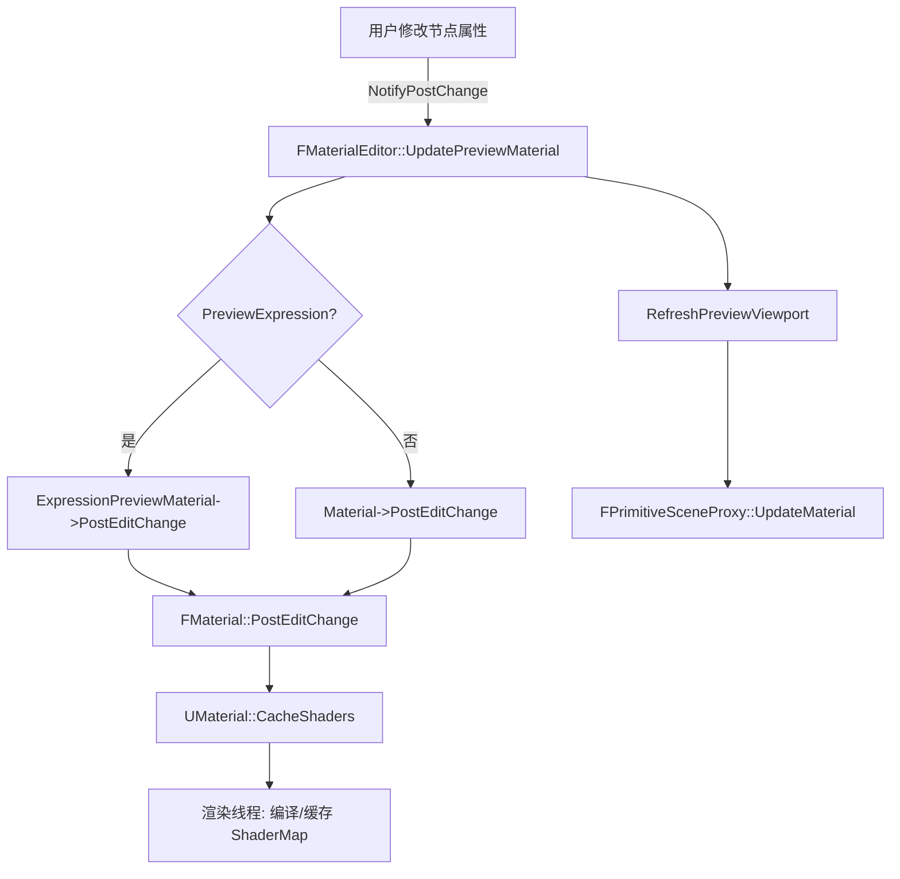
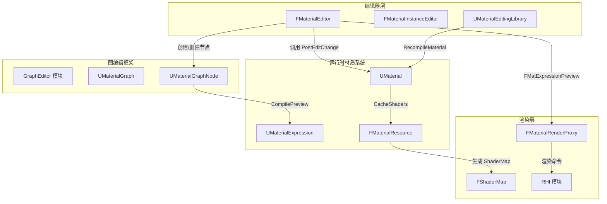

> [← 返回 UE全解析主索引]([[00-UE全解析主索引|UE全解析主索引]])

# UE-MaterialEditor-源码解析：材质编辑器

## Why：为什么要分析材质编辑器？

材质编辑器是 UE 编辑器层中最复杂的可视化编辑工具之一，它横跨 **Slate UI**、**EdGraph 节点图框架**、**UObject 反射序列化**、**Shader 编译管线** 和 **渲染线程资源管理** 五大子系统。理解其架构有助于掌握：

1. 编辑器如何安全地「编辑副本、Apply 回写」原始资产
2. UObject + 非 UObject（FMaterial）混合对象的内存管理模型
3. 节点图变更如何驱动 Shader 异步编译与实时预览
4. 多线程环境下渲染资源（FMaterialRenderProxy）的生命周期控制

---

## What：模块边界与核心类

### 模块定位

> 文件：`Engine/Source/Editor/MaterialEditor/MaterialEditor.Build.cs`

```csharp
public class MaterialEditor : ModuleRules
{
    // Private 依赖：核心运行时 + Slate + 渲染 + 编辑器框架
    PrivateDependencyModuleNames.AddRange(new string[] {
        "Core", "CoreUObject", "Engine", "Slate", "SlateCore",
        "RenderCore", "RHI", "UnrealEd", "GraphEditor",
        "PropertyEditor", "AdvancedPreviewScene", "MaterialUtilities"
    });
    // 动态加载：ContentBrowser、AssetTools、SceneOutliner
    DynamicallyLoadedModuleNames.AddRange(new string[] {
        "AssetTools", "ContentBrowser", "SceneOutliner", "ClassViewer"
    });
}
```

| 分组 | 关键依赖模块 | 作用 |
|------|-------------|------|
| 核心运行时 | Core, CoreUObject, Engine | UObject 生命周期、材质数据结构 |
| UI 框架 | Slate, SlateCore, EditorStyle | 节点图编辑器、视口、工具栏 |
| 图编辑 | GraphEditor, UnrealEd | EdGraph 节点图、资产管理 |
| 渲染 | RenderCore, RHI, MaterialUtilities | Shader 编译、渲染代理、材质属性 |
| 属性面板 | PropertyEditor | DetailsView 自定义布局 |

### 核心类一览

| 类名 | 头文件 | 继承链 | 职责 |
|------|--------|--------|------|
| `IMaterialEditor` | `Public/IMaterialEditor.h` | `FWorkflowCentricApplication` | 材质编辑器公共接口（纯虚） |
| `IMaterialEditorModule` | `Public/MaterialEditorModule.h` | `IModuleInterface` | 模块级工厂接口 |
| `FMaterialEditor` | `Private/MaterialEditor.h` | `IMaterialEditor`, `FGCObject`, `FTickableGameObject`, `FEditorUndoClient` | **核心材质编辑器实现** |
| `FMaterialInstanceEditor` | `Private/MaterialInstanceEditor.h` | `IMaterialEditor`, `FGCObject`, `FTickableEditorObject` | 材质实例编辑器 |
| `FMatExpressionPreview` | `Private/MaterialEditor.h` | `FMaterial`, `FMaterialRenderProxy` | 单节点表达式预览（非 UObject） |
| `UMaterialEditingLibrary` | `Public/MaterialEditingLibrary.h` | `UBlueprintFunctionLibrary` | Blueprint / 脚本 API |
| `FMaterialEditorUtilities` | `Public/MaterialEditorUtilities.h` | — | 静态工具函数集合 |
| `FMaterialEditorModule` | `Private/MaterialEditorModule.cpp` | `IMaterialEditorModule` | 模块初始化与工厂实现 |

---

## 接口层：Public 头文件与反射边界

### IMaterialEditor — 编辑器公共契约

> 文件：`Engine/Source/Editor/MaterialEditor/Public/IMaterialEditor.h`，第 23~179 行

```cpp
class IMaterialEditor : public FWorkflowCentricApplication,
    public IHasMenuExtensibility, public IHasToolBarExtensibility
{
public:
    // 创建新的材质表达式节点
    virtual UMaterialExpression* CreateNewMaterialExpression(
        UClass* NewExpressionClass, const FVector2D& NodePos,
        bool bAutoSelect, bool bAutoAssignResource, const UEdGraph* Graph = nullptr) { return nullptr; }

    // 强制刷新所有表达式预览
    virtual void ForceRefreshExpressionPreviews() {}

    // 图变更后重新链接材质并更新编辑器表示
    virtual void UpdateMaterialAfterGraphChange() {}

    // 获取当前编辑的材质接口（用于预览网格）
    virtual UMaterialInterface* GetMaterialInterface() const = 0;

    // 在预览视口上绘制消息（编译错误等）
    virtual void DrawMessages(FViewport* Viewport, FCanvas* Canvas) = 0;

    // 编辑器生命周期委托
    DECLARE_EVENT_OneParam(..., FRegisterTabSpawnersEvent, const TSharedRef<class FTabManager>&);
    DECLARE_EVENT(..., FMaterialEditorClosedEvent);
};
```

> **设计要点**：接口层不暴露任何 Slate 细节，全部通过 `UMaterialExpression`、`UEdGraphNode` 等 UObject 交互，便于 Blueprint 和外部模块扩展。

### IMaterialEditorModule — 工厂与扩展点

> 文件：`Engine/Source/Editor/MaterialEditor/Public/MaterialEditorModule.h`，第 26~85 行

```cpp
class IMaterialEditorModule : public IModuleInterface,
    public IHasMenuExtensibility, public IHasToolBarExtensibility
{
public:
    // 工厂方法：为不同资产类型创建对应编辑器
    virtual TSharedRef<IMaterialEditor> CreateMaterialEditor(
        EToolkitMode::Type Mode, const TSharedPtr<IToolkitHost>& Host, UMaterial* Material) = 0;
    virtual TSharedRef<IMaterialEditor> CreateMaterialInstanceEditor(
        EToolkitMode::Type Mode, const TSharedPtr<IToolkitHost>& Host, UMaterialInstance* Instance) = 0;

    // 扩展委托：外部模块可注册菜单/工具栏扩展
    DECLARE_EVENT_OneParam(..., FMaterialEditorOpenedEvent, TWeakPtr<IMaterialEditor>);
};
```

### UMaterialEditingLibrary — Blueprint 可调用 API

> 文件：`Engine/Source/Editor/MaterialEditor/Public/MaterialEditingLibrary.h`，第 59~466 行

```cpp
UCLASS(MinimalAPI)
class UMaterialEditingLibrary : public UBlueprintFunctionLibrary
{
    GENERATED_BODY()

    // 创建/删除/连接表达式节点
    UFUNCTION(BlueprintCallable, Category = "MaterialEditing")
    static UMaterialExpression* CreateMaterialExpression(UMaterial* Material, TSubclassOf<UMaterialExpression> ExpressionClass, int32 NodePosX = 0, int32 NodePosY = 0);

    UFUNCTION(BlueprintCallable, Category = "MaterialEditing")
    static bool ConnectMaterialExpressions(UMaterialExpression* FromExpression, FString FromOutputName,
        UMaterialExpression* ToExpression, FString ToInputName);

    // 触发材质重编译
    UFUNCTION(BlueprintCallable, Category = "MaterialEditing")
    static void RecompileMaterial(UMaterial* Material);

    // 材质实例参数读写
    UFUNCTION(BlueprintCallable, Category = "MaterialEditing")
    static bool SetMaterialInstanceScalarParameterValue(UMaterialInstanceConstant* Instance, FName ParameterName, float Value);
};
```

> 由 UHT 生成的 `.generated.h` 负责实现 `StaticClass()`、`ExecuteUbergraph` 等反射基础设施，分析时以原始 `.h` 为准。

---

## 数据层：UObject 体系与内存布局

### FMaterialEditor 核心成员变量

> 文件：`Engine/Source/Editor/MaterialEditor/Private/MaterialEditor.h`，第 447~465 行、第 1075 行

```cpp
class FMaterialEditor : public IMaterialEditor, public FGCObject, ...
{
public:
    /** 编辑中的预览材质（OriginalMaterial 的副本，位于 TransientPackage） */
    TObjectPtr<UMaterial> Material;

    /** 源材质，仅 Apply 时通过 StaticDuplicateObject 回写 */
    TObjectPtr<UMaterial> OriginalMaterial;

    /** 表达式预览专用材质（当 PreviewExpression 非空时使用） */
    TObjectPtr<UMaterial> ExpressionPreviewMaterial;

    /** 当前正在预览的单个表达式节点 */
    TObjectPtr<UMaterialExpression> PreviewExpression;

    /** 若编辑材质函数，此字段非空 */
    TObjectPtr<UMaterialFunction> MaterialFunction;

    /** 原始材质或材质函数的统一指针（用于保存时定位） */
    UObject* OriginalMaterialObject;

private:
    /** 所有表达式预览的渲染资源（非 UObject，引用计数管理） */
    TArray<TRefCountPtr<FMatExpressionPreview>> ExpressionPreviews;
};
```

| 变量 | 类型 | 内存来源 | Outer/Package | GC 安全 |
|------|------|---------|---------------|---------|
| `Material` | `TObjectPtr<UMaterial>` | UObject GC Heap | `GetTransientPackage()` | ✅ 由 `FGCObject::AddReferencedObjects` 保护 |
| `OriginalMaterial` | `TObjectPtr<UMaterial>` | UObject GC Heap | 原始资产 Package | ✅ 同上 |
| `ExpressionPreviews` | `TArray<TRefCountPtr<FMatExpressionPreview>>` | **非 UObject 堆（`new`）** | N/A | ✅ `TRefCountPtr` + `DeferredDelete` |
| `PreviewExpression` | `TObjectPtr<UMaterialExpression>` | UObject GC Heap | 属于 `Material` 的 Outer | ✅ 同上 |

### FMatExpressionPreview — 非 UObject 的渲染资源

> 文件：`Engine/Source/Editor/MaterialEditor/Private/MaterialEditor.h`，第 55~186 行

```cpp
class FMatExpressionPreview : public FMaterial, public FMaterialRenderProxy
{
public:
    FMatExpressionPreview(UMaterialExpression* InExpression);
    virtual ~FMatExpressionPreview();

    // FMaterialRenderProxy 接口
    virtual const FMaterial* GetMaterialNoFallback(ERHIFeatureLevel::Type InFeatureLevel) const override;
    virtual const FMaterialRenderProxy* GetFallback(ERHIFeatureLevel::Type InFeatureLevel) const override;

    // 编译入口：将单个表达式编译为预览用的 EmissiveColor
    virtual int32 CompilePropertyAndSetMaterialProperty(
        EMaterialProperty Property, FMaterialCompiler* Compiler,
        EShaderFrequency OverrideShaderFrequency, bool bUsePreviousFrameTime) const override;

private:
    TUniquePtr<FMaterialCachedExpressionData> CachedExpressionData;
    TWeakObjectPtr<UMaterialExpression> Expression;   // 弱引用，避免循环引用
    TArray<TObjectPtr<UObject>> ReferencedTextures;
    TArray<TObjectPtr<UTextureCollection>> ReferencedTextureCollections;
    FGuid Id;
};
```

> **关键设计**：`FMatExpressionPreview` **不是 UObject**，它直接继承 `FMaterial`（运行时材质资源）和 `FMaterialRenderProxy`（渲染线程代理）。这允许它在不经过 UObject GC 的情况下快速创建/销毁，同时通过 `TWeakObjectPtr<UMaterialExpression>` 安全地引用对应的图节点。

### UObject 生命周期与 Outer 层级

```
原始资产 Package
├── OriginalMaterial (UMaterial)          ← 磁盘持久化资产
└── TransientPackage
    └── Material (UMaterial)              ← StaticDuplicateObject 创建的编辑副本
        ├── Expressions[]
        │   └── UMaterialExpression*      ← Outer = Material
        └── MaterialGraph (UMaterialGraph)
            └── Nodes[] (UMaterialGraphNode)
```

> 文件：`Engine/Source/Editor/MaterialEditor/Private/MaterialEditor.cpp`，第 544~560 行

```cpp
void FMaterialEditor::InitEditorForMaterial(UMaterial* InMaterial)
{
    OriginalMaterial = InMaterial;
    // 复制到 TransientPackage，移除 RF_Standalone 确保可 GC
    Material = (UMaterial*)StaticDuplicateObject(
        OriginalMaterial, GetTransientPackage(), NAME_None,
        ~RF_Standalone, UPreviewMaterial::StaticClass());
    Material->CancelOutstandingCompilation();
}
```

### FGCObject 引用链

> 文件：`Engine/Source/Editor/MaterialEditor/Private/MaterialEditor.cpp`，第 3390~3406 行

```cpp
void FMaterialEditor::AddReferencedObjects(FReferenceCollector& Collector)
{
    Collector.AddReferencedObject(EditorOptions);
    Collector.AddReferencedObject(Material);
    Collector.AddReferencedObject(OriginalMaterial);
    Collector.AddReferencedObject(ExpressionPreviewMaterial);
    // ... 所有 UObject 成员逐一添加

    // 非 UObject 的 ExpressionPreviews 需要手动传递引用收集
    for (FMatExpressionPreview* ExpressionPreview : ExpressionPreviews)
    {
        ExpressionPreview->AddReferencedObjects(Collector);
    }
}
```

> **规则**：凡是非 UObject 但又持有 UObject 引用的对象，必须继承 `FGCObject` 并重写 `AddReferencedObjects`，否则持有的 UObject 可能被 GC 误回收。

---

## 逻辑层：关键行为与调用链

### 1. 材质预览更新（UpdatePreviewMaterial）

> 文件：`Engine/Source/Editor/MaterialEditor/Private/MaterialEditor.cpp`，第 2559~2636 行

```cpp
void FMaterialEditor::UpdatePreviewMaterial(bool bForce)
{
    if (!bLivePreview && !bForce)
        return;  // 非实时预览且非强制时直接返回

    bStatsFromPreviewMaterial = true;

    // ---- 分支 A：单表达式预览模式 ----
    if (PreviewExpression)
    {
        check(ExpressionPreviewMaterial);
        ExpressionPreviewMaterial->AssignExpressionCollection(Material->GetExpressionCollection());
        ExpressionPreviewMaterial->bEnableNewHLSLGenerator = Material->IsUsingNewHLSLGenerator();

        {
            // SyncWithRenderingThread：确保渲染线程完成当前材质的所有操作
            FMaterialUpdateContext UpdateContext(
                FMaterialUpdateContext::EOptions::SyncWithRenderingThread);
            UpdateContext.AddMaterial(ExpressionPreviewMaterial);
            ExpressionPreviewMaterial->PreEditChange(NULL);
            ExpressionPreviewMaterial->PostEditChange();  // 触发异步 Shader 编译
        }
    }

    // ---- 分支 B：主预览材质更新 ----
    {
        FMaterialUpdateContext UpdateContext(
            FMaterialUpdateContext::EOptions::SyncWithRenderingThread);
        UpdateContext.AddMaterial(Material);
        Material->PreEditChange(NULL);
        Material->PostEditChange();
    }

    Material->MaterialGraph->UpdatePinTypes();
    UpdateStatsMaterials();
    RefreshPreviewViewport();  // 通知视口重新注册使用预览材质的组件
}
```

**调用链分析**：



> **多线程要点**：`FMaterialUpdateContext::SyncWithRenderingThread` 在 GameThread 阻塞等待 RenderThread 完成当前材质操作，随后 `PostEditChange()` 触发新的 Shader 编译任务（仍在 GameThread 发起，但编译本身异步执行）。

### 2. Apply/Save 回写原始资产（UpdateOriginalMaterial）

> 文件：`Engine/Source/Editor/MaterialEditor/Private/MaterialEditor.cpp`，第 2638~2885 行

```cpp
bool FMaterialEditor::UpdateOriginalMaterial()
{
    // 1. 编译错误检查（遍历所有 ShaderPlatform + QualityLevel）
    TArray<FText> Errors;
    for (EShaderPlatform ShaderPlatform : ShaderPlatformsToTest)
    {
        FMaterialResource* CurrentResource = Material->GetMaterialResource(ShaderPlatform);
        if (CurrentResource && CurrentResource->GetCompileErrors().Num() > 0)
        {
            Errors.Push(...);  // 收集错误
            bBaseMaterialFailsToCompile = true;
        }
    }
    if (Errors.Num() > 0)
    {
        // 默认材质不允许有错误；普通材质弹出确认对话框
        if (Material->bUsedAsSpecialEngineMaterial && bBaseMaterialFailsToCompile)
            return false;  // 强制阻止保存
        else if (FSuppressableWarningDialog(...).ShowModal() == Cancel)
            return false;
    }

    // 2. 刷新 shader 文件缓存，支持快速 shader 迭代
    FlushShaderFileCache();
    UpdatePreviewMaterial(true);

    // 3. 回写逻辑：StaticDuplicateObject 的「原地替换」技巧
    if (MaterialFunction)
    {
        // 材质函数回写
        MaterialFunction->AssignExpressionCollection(Material->GetExpressionCollection());
        MaterialFunction->ParentFunction = (UMaterialFunction*)StaticDuplicateObject(
            MaterialFunction, MaterialFunction->ParentFunction->GetOuter(),
            MaterialFunction->ParentFunction->GetFName(), RF_AllFlags,
            MaterialFunction->ParentFunction->GetClass());
        UMaterialEditingLibrary::UpdateMaterialFunction(MaterialFunction->ParentFunction, Material);
    }
    else
    {
        // 材质回写
        FNavigationLockContext NavUpdateLock(ENavigationLockReason::MaterialUpdate);
        OriginalMaterial = (UMaterial*)StaticDuplicateObject(
            Material, OriginalMaterial->GetOuter(), OriginalMaterial->GetFName(),
            RF_AllFlags, OriginalMaterial->GetClass());
        UMaterialEditingLibrary::RecompileMaterial(OriginalMaterial);
    }

    bMaterialDirty = false;
    return true;
}
```

> **核心技巧**：UE 不使用「逐字段拷贝」回写原始资产，而是通过 `StaticDuplicateObject` 在原始 Outer 中创建一个**同名同类的新对象**，直接替换原对象在内存中的位置。这保证了：
> - 所有引用该资产的指针仍然有效（UObject 指针地址不变，因为内部是原地构造）
> - 序列化路径、ThumbnailInfo、MetaData 需要手动恢复

### 3. 表达式预览编译（FMatExpressionPreview::CompilePropertyAndSetMaterialProperty）

> 文件：`Engine/Source/Editor/MaterialEditor/Private/MaterialEditor.cpp`，第 327~385 行

```cpp
int32 FMatExpressionPreview::CompilePropertyAndSetMaterialProperty(
    EMaterialProperty Property, FMaterialCompiler* Compiler, ...) const
{
    Compiler->SetMaterialProperty(Property, OverrideShaderFrequency, bUsePreviousFrameTime);

    if (Substrate::IsSubstrateEnabled())
    {
        // Substrate 路径：设置导出模式为材质预览
        Compiler->SetSubstrateMaterialExportType(
            SME_MaterialPreview, ESubstrateMaterialExportContext::SMEC_Opaque, 0);
    }

    int32 Ret = INDEX_NONE;
    if (Property == MP_EmissiveColor && Expression.IsValid())
    {
        // 硬编码 output 0，调用表达式的预览编译入口
        const int32 OutputIndex = 0;
        int32 PreviewCodeChunk = Expression->CompilePreview(Compiler, OutputIndex);

        // 从线性空间转回 Gamma 空间（DrawTile 不自动做此转换）
        Ret = Compiler->Power(
            Compiler->Max(PreviewCodeChunk, Compiler->Constant(0)),
            Compiler->Constant(1.f / 2.2f));
    }
    else if (Property == MP_WorldPositionOffset || Property == MP_Displacement)
    {
        Ret = Compiler->Constant(0.0f);  // 防止像素偏移
    }
    // ... 其他属性返回常量默认值

    return Compiler->ForceCast(Ret, FMaterialAttributeDefinitionMap::GetValueType(Property), MFCF_ExactMatch);
}
```

**调用链**：


> 每个表达式节点拥有独立的 `FMatExpressionPreview` 实例，其 ShaderMap 只包含 **BasePass + LocalVertexFactory** 的最小着色器集合（`ShouldCache` 中严格过滤），避免为每个预览节点编译全套着色器。

---

## 多线程与性能分析

### 线程交互模型

| 线程 | 职责 | 关键同步原语 |
|------|------|-------------|
| **Game Thread** | UI 事件、节点增删、图拓扑变更、UObject 修改 | `FMaterialUpdateContext` |
| **Render Thread** | FMaterialRenderProxy 更新、Uniform 表达式缓存 | `DeferredDelete`、`SyncWithRenderingThread` |
| **RHI Thread** | Shader 编译任务分派（异步） | `FShaderCompilingManager` |

> `FMaterial::DeferredDeleteArray(ExpressionPreviews)`（析构时调用）确保在 RenderThread 完成所有 pending 渲染命令后才真正 `delete` FMatExpressionPreview，避免野指针。

### 性能优化手段

1. **预览 Shader 精简**：`FMatExpressionPreview::ShouldCache` 仅允许 `BasePassVS/PSFNoLightMapPolicy` 等少数 shader type 通过，大幅减少单节点预览的编译量。
2. **懒加载预览**：`GetExpressionPreview` 只在节点首次需要显示预览时 `new FMatExpressionPreview` 并调用 `CacheShaders`。
3. **实时预览分级控制**：
   - `bLivePreview`：全局开关，关闭后只在 Apply 时编译
   - `bRealtimePreview`（每节点）：仅实时更新特定节点
   - `bAlwaysRefreshAllPreviews`：强制刷新所有节点（消耗最大）
4. **Tick 批量更新**：`FMaterialEditor::Tick` 中批量执行 `UpdateGraphNodeStates`，避免每帧多次遍历节点图。

---

## 上下层模块交互



| 交互点 | 上游模块 | 下游模块 | 机制 |
|--------|---------|---------|------|
| 节点图变更 → Shader 编译 | GraphEditor | MaterialEditor → Engine | `PostEditChange` → `CacheShaders` |
| 预览视口渲染 | MaterialEditor | AdvancedPreviewScene | `GetMaterialInterface()` → `FMaterialRenderProxy` |
| 材质函数修改传播 | MaterialEditor | 引用该函数的所有 Material | `UMaterialEditingLibrary::UpdateMaterialFunction` |
| 全局 shader 刷新 | ConsoleVariable 变更 | 所有 PostProcess 预览材质 | `FMaterialEditorUtilities::RefreshPostProcessPreviewMaterials` |

---

## 设计亮点与可迁移经验

### 1. 「编辑副本 + 回写」模式

材质编辑器不直接编辑磁盘资产，而是 `StaticDuplicateObject` 到 `TransientPackage` 生成工作副本。优点：
- 编辑过程中产生的中间状态（如编译失败的 Shader）不会污染原始资产
- 用户可随时关闭编辑器而不保存，原始资产完全不受影响
- 回写时通过 `StaticDuplicateObject(..., Original->GetOuter(), Original->GetFName())` 实现原地替换

### 2. UObject / 非 UObject 混合架构

`FMaterialEditor`（非 UObject，Slate 共享指针管理）持有大量 `TObjectPtr<UMaterial>`，同时管理 `TArray<TRefCountPtr<FMatExpressionPreview>>`（纯 C++ 对象）。这种分层让：
- UI 层不受 UObject GC 策略约束
- 渲染资源（FMaterial）可以绕过反射系统，直接操作底层 RHI
- `FGCObject` + `AddReferencedObjects` 桥接两种内存模型

### 3. 渲染资源延迟删除

`FMaterial::DeferredDelete` 是 UE 中跨线程释放渲染资源的通用模式：
- GameThread 标记删除，加入延迟队列
- RenderThread 完成当前帧所有引用后执行实际 `delete`
- 避免了复杂的跨线程引用计数和锁竞争

---

## 关键源码索引

| 功能 | 文件路径 | 行号范围 |
|------|---------|---------|
| 模块 Build 定义 | `Engine/Source/Editor/MaterialEditor/MaterialEditor.Build.cs` | 1~62 |
| 编辑器公共接口 | `Engine/Source/Editor/MaterialEditor/Public/IMaterialEditor.h` | 1~181 |
| 模块工厂接口 | `Engine/Source/Editor/MaterialEditor/Public/MaterialEditorModule.h` | 1~85 |
| 核心编辑器类声明 | `Engine/Source/Editor/MaterialEditor/Private/MaterialEditor.h` | 224~1144 |
| 材质实例编辑器声明 | `Engine/Source/Editor/MaterialEditor/Private/MaterialInstanceEditor.h` | 31~293 |
| 模块初始化与工厂实现 | `Engine/Source/Editor/MaterialEditor/Private/MaterialEditorModule.cpp` | 43~177 |
| 预览材质初始化 | `Engine/Source/Editor/MaterialEditor/Private/MaterialEditor.cpp` | 544~600 |
| Tick 与批量更新 | `Engine/Source/Editor/MaterialEditor/Private/MaterialEditor.cpp` | 1853~1858 |
| 预览材质更新 | `Engine/Source/Editor/MaterialEditor/Private/MaterialEditor.cpp` | 2559~2636 |
| Apply/保存回写 | `Engine/Source/Editor/MaterialEditor/Private/MaterialEditor.cpp` | 2638~2885 |
| GC 引用链 | `Engine/Source/Editor/MaterialEditor/Private/MaterialEditor.cpp` | 3390~3406 |
| 表达式预览编译 | `Engine/Source/Editor/MaterialEditor/Private/MaterialEditor.cpp` | 327~385 |
| 表达式预览刷新 | `Engine/Source/Editor/MaterialEditor/Private/MaterialEditor.cpp` | 7449~7540 |
| Blueprint 编辑库 | `Engine/Source/Editor/MaterialEditor/Public/MaterialEditingLibrary.h` | 59~466 |
| 编辑器设置（UCLASS config） | `Engine/Source/Editor/MaterialEditor/Public/MaterialEditorSettings.h` | 102~214 |

---

## 关联阅读

- [[UE-Engine-源码解析：UMaterial 与材质资源体系]]
- [[UE-RenderCore-源码解析：FMaterial 与 ShaderMap 编译]]
- [[UE-GraphEditor-源码解析：EdGraph 节点图框架]]
- [[UE-Slate-源码解析：编辑器 UI 架构]]

---

## 索引状态

- **所属阶段**：第五阶段-编辑器层-5.2 可视化编辑工具
- **状态**：✅ 完成
- **笔记名称**：UE-MaterialEditor-源码解析：材质编辑器.md
