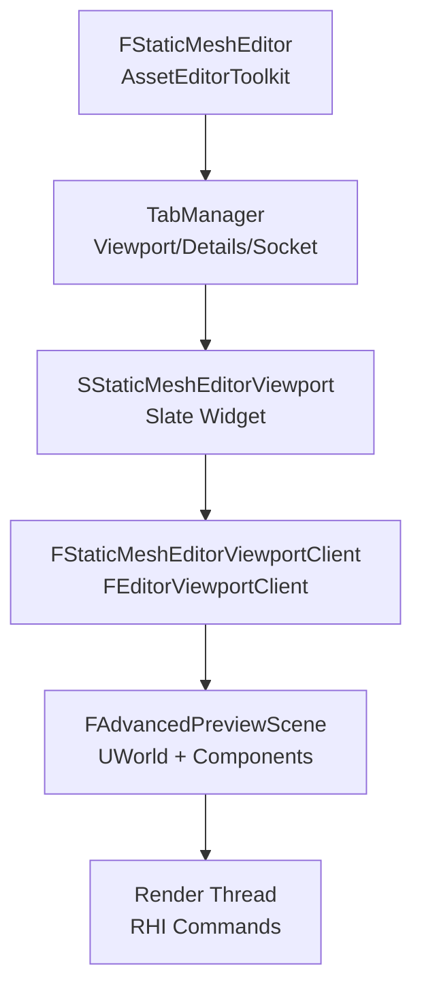
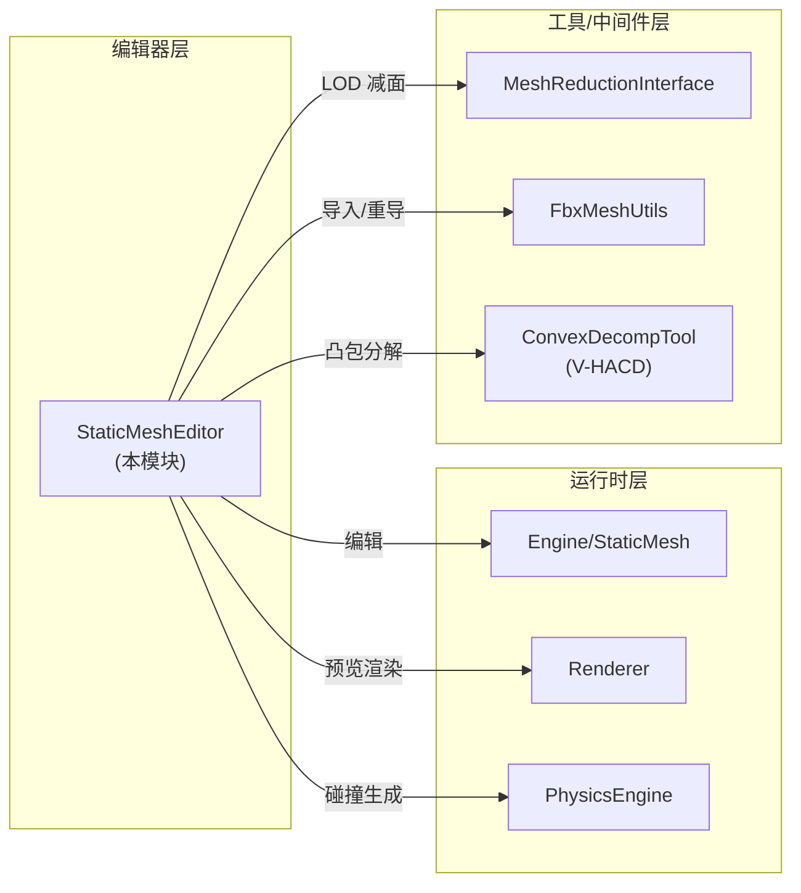

> [[00-UE全解析主索引|← 返回 UE全解析主索引]]

# UE-StaticMeshEditor 源码解析：静态网格编辑器

## Why：为什么要分析 StaticMeshEditor？

静态网格（StaticMesh）是 UE 场景中最核心的几何资产类型。`StaticMeshEditor` 模块是编辑器层中直接面向美术和地编人员的可视化编辑工具，负责提供：

- **3D 预览视口**：带光照、LOD、UV、碰撞的可交互预览
- **Socket 编辑**：在网格上可视化创建/移动/旋转挂载点
- **碰撞编辑**：自动生成（K-DOP、Box、Sphere、Capsule、V-HACD 凸包分解）和手动调整碰撞体
- **LOD 管理**：自动生成、导入、调整多细节层次
- **Nanite/距离场/光追回退预览**：现代渲染特性的可视化验证

理解其源码对掌握 UE 编辑器架构（AssetEditorToolkit → Slate → ViewportClient → Render Thread）有极高的参考价值。

---

## What：模块地图与接口层

### 模块定位

> 文件：`Engine/Source/Editor/StaticMeshEditor/StaticMeshEditor.Build.cs`，第 1~68 行

```csharp
public class StaticMeshEditor : ModuleRules
{
    // PrivateDependencyModuleNames 包含核心依赖：
    // Core, CoreUObject, Engine, Slate, SlateCore, UnrealEd
    // MeshUtilities, NaniteUtilities, PhysicsUtilities
    // AdvancedPreviewScene, MeshDescription, StaticMeshDescription
    // ...
    DynamicallyLoadedModuleNames.AddRange(
        new string[] {
            "SceneOutliner", "ClassViewer", "ContentBrowser",
            "MeshReductionInterface",
        }
    );
}
```

该模块是典型的**编辑器工具模块**，位于 `Engine/Source/Editor/` 分组。依赖可分为三层：

| 层级 | 关键依赖模块 | 作用 |
|------|-------------|------|
| 基础框架 | `Core`, `CoreUObject`, `Slate`, `SlateCore`, `EditorFramework` | UObject 生命周期、UI 框架 |
| 编辑器基础设施 | `UnrealEd`, `AdvancedPreviewScene`, `PropertyEditor`, `ToolMenus` | AssetEditorToolkit、预览场景、属性面板 |
| 业务下层 | `Engine`, `MeshUtilities`, `NaniteUtilities`, `PhysicsUtilities`, `MeshDescription` | 静态网格数据、渲染、物理、网格描述 |

### 核心类一览

| 类名 | 头文件位置 | 职责 |
|------|-----------|------|
| `IStaticMeshEditor` | `Public/IStaticMeshEditor.h` | 对外抽象接口，继承 `FAssetEditorToolkit` |
| `IStaticMeshEditorModule` | `Public/StaticMeshEditorModule.h` | 模块接口，负责创建编辑器实例 |
| `FStaticMeshEditor` | `Private/StaticMeshEditor.h` | 核心编辑器实现，管理所有 Tab、命令、选中状态 |
| `FStaticMeshEditorViewportClient` | `Private/StaticMeshEditorViewportClient.h` | 视口客户端，处理输入、绘制、Gizmo、HitProxy |
| `SStaticMeshEditorViewport` | `Private/SStaticMeshEditorViewport.h` | Slate 视口控件，持有预览场景和组件 |
| `UStaticMeshEditorSubsystem` | `Public/StaticMeshEditorSubsystem.h` | 脚本化 API（BlueprintCallable），提供批量/自动化操作 |
| `FStaticMeshEditorCommands` | `Public/StaticMeshEditorActions.h` | UI 命令定义（TCommands 模式） |

### 反射边界（UCLASS/UFUNCTION）

> 文件：`Engine/Source/Editor/StaticMeshEditor/Public/StaticMeshEditorSubsystem.h`，第 24~28 行

```cpp
UCLASS(MinimalAPI)
class UStaticMeshEditorSubsystem : public UEditorSubsystem
{
    GENERATED_BODY()
public:
    STATICMESHEDITOR_API UStaticMeshEditorSubsystem();
    // ... 大量 UFUNCTION(BlueprintCallable) 暴露的脚本接口
};
```

`UStaticMeshEditorSubsystem` 是本模块中**唯一的 UObject 派生类**（除 helper struct 外），承担"编辑器脚本层"职责。所有 `UFUNCTION` 都带 `Category = "Static Mesh Utilities"` 或 `"Editor Scripting | StaticMesh"`，可在蓝图和 Python 脚本中调用。

> **注意**：`FStaticMeshEditor` 等核心类是纯 C++ 类（非 UObject），通过 Slate 的智能指针（`TSharedPtr`/`TSharedRef`）管理生命周期，这是 UE 编辑器 UI 层的标准模式。

---

## How - 数据层：内存结构与 UObject 关系

### FStaticMeshEditor 核心成员

> 文件：`Engine/Source/Editor/StaticMeshEditor/Private/StaticMeshEditor.h`，第 534~628 行

```cpp
class FStaticMeshEditor : public IStaticMeshEditor, public FGCObject,
    public FEditorUndoClient, public FNotifyHook, public FTickableEditorObject
{
private:
    /** The currently viewed Static Mesh. */
    TObjectPtr<UStaticMesh> StaticMesh;

    /** Property View */
    TSharedPtr<class IDetailsView> StaticMeshDetailsView;

    /** Socket Manager widget. */
    TSharedPtr<class ISocketManager> SocketManager;

    /** Information on the selected collision primitives */
    TArray<FPrimData> SelectedPrims;

    /** Selected LOD changed delegates */
    FOnSelectedLODChangedMulticaster OnSelectedLODChanged;

    #if USE_ASYNC_DECOMP
    /** Instance of the active asynchronous convex decomposition interface. */
    IDecomposeMeshToHullsAsync *DecomposeMeshToHullsAsync{ nullptr };
    #endif

    // ... 大量 bool 绘制开关、Slate widget 指针
};
```

**内存分配来源分析**：

| 成员 | 类型 | 分配来源 | 说明 |
|------|------|---------|------|
| `StaticMesh` | `TObjectPtr<UStaticMesh>` | UObject GC Heap | 指向被编辑的资产，由外部传入，受 UObject GC 管理 |
| `StaticMeshDetailsView` | `TSharedPtr<IDetailsView>` | Slate 共享引用计数堆 | 由 `PropertyEditorModule` 工厂创建 |
| `SocketManager` | `TSharedPtr<ISocketManager>` | Slate 共享引用计数堆 | Socket 管理器接口实例 |
| `SelectedPrims` | `TArray<FPrimData>` | FMalloc（默认堆） | 纯值类型数组，存储碰撞图元选择状态 |
| `DecomposeMeshToHullsAsync` | 原始指针 | 模块动态库分配 | V-HACD 异步分解接口，需手动 `Release()` |

### FGCObject 与 GC 引用链

`FStaticMeshEditor` 继承 `FGCObject`，这是非 UObject 类被 UObject GC 系统识别的标准做法：

> 文件：`Engine/Source/Editor/StaticMeshEditor/Private/StaticMeshEditor.cpp`，第 552~555 行

```cpp
void FStaticMeshEditor::AddReferencedObjects( FReferenceCollector& Collector )
{
    Collector.AddReferencedObject( StaticMesh );
}
```

> 文件：`Engine/Source/Editor/StaticMeshEditor/Private/SStaticMeshEditorViewport.cpp`，第 167~172 行

```cpp
void SStaticMeshEditorViewport::AddReferencedObjects( FReferenceCollector& Collector )
{
    Collector.AddReferencedObject( PreviewMeshComponent );
    Collector.AddReferencedObject( StaticMesh );
    Collector.AddReferencedObjects( SocketPreviewMeshComponents );
}
```

`SStaticMeshEditorViewport` 同样继承 `FGCObject`，确保其持有的 `UStaticMeshComponent`（预览组件）不会在 GC 中被误回收。

### UObject Outer/Package 层级

```
UPackage (StaticMesh 资产包)
  └── UStaticMesh (被编辑资产, Outer=Package)
        └── UBodySetup (碰撞设置, Outer=UStaticMesh)
              └── FKAggregateGeom (碰撞图元聚合, 非 UObject)
        └── UStaticMeshSocket[] (Socket 数组, Outer=UStaticMesh)

GetTransientPackage()
  └── UStaticMeshComponent (预览组件, RF_Transient)
```

预览用的 `UStaticMeshComponent` 通过 `NewObject<UStaticMeshComponent>(GetTransientPackage(), NAME_None, RF_Transient)` 创建，标记为 **Transient**，不会被序列化到磁盘。

---

## How - 逻辑层：关键调用链与行为分析

### 1. 视口绘制：Draw() — 碰撞体 / Socket / 法线可视化

> 文件：`Engine/Source/Editor/StaticMeshEditor/Private/StaticMeshEditorViewportClient.cpp`，第 487~703 行

`FStaticMeshEditorViewportClient::Draw()` 是每帧在 **Game Thread** 上执行的视口绘制回调，负责所有编辑器特有的可视化叠加：

```cpp
void FStaticMeshEditorViewportClient::Draw(const FSceneView* View, FPrimitiveDrawInterface* PDI)
{
    FEditorViewportClient::Draw(View, PDI);

    // 1. 简单碰撞绘制（Sphere/Box/Sphyl/Convex/LevelSet）
    if (bShowSimpleCollision && StaticMesh->GetBodySetup())
    {
        StaticMesh->GetBodySetup()->CreatePhysicsMeshes(); // 确保 Cooked 数据就绪
        FKAggregateGeom* AggGeom = &StaticMesh->GetBodySetup()->AggGeom;
        for (int32 i = 0; i < AggGeom->SphereElems.Num(); ++i)
        {
            HSMECollisionProxy* HitProxy = new HSMECollisionProxy(EAggCollisionShape::Sphere, i);
            PDI->SetHitProxy(HitProxy);
            // 根据是否被选中设置颜色，调用 DrawElemWire 绘制线框
            SphereElem.DrawElemWire(PDI, ElemTM, VectorScaleOne, CollisionColor);
            PDI->SetHitProxy(NULL);
        }
        // ... Box, Sphyl, Convex, LevelSet 同理
    }

    // 2. 复杂碰撞绘制（三角网格）
    if (bShowComplexCollision && StaticMesh->ComplexCollisionMesh)
    {
        DrawCustomComplex(PDI, CollisionMeshData, UnselectedColor);
    }

    // 3. Socket 可视化
    if (bShowSockets)
    {
        for (int32 i = 0; i < StaticMesh->Sockets.Num(); i++)
        {
            PDI->SetHitProxy(new HSMESocketProxy(i));
            DrawWireDiamond(PDI, SocketTM, 5.f, SocketColor, SDPG_Foreground);
        }
    }

    // 4. 法线/切线/副法线/顶点叠加绘制
    if (bDrawNormals || bDrawTangents || bDrawBinormals || bDrawVertices)
    {
        FStaticMeshLODResources& LODModel = StaticMesh->GetRenderData()->LODResources[...];
        for (uint32 i = 0; i < NumIndices; i++)
        {
            // 逐顶点/逐索引读取 StaticMeshVertexBuffer，用 PDI->DrawLine 绘制
        }
    }
}
```

**关键设计点**：

- **HitProxy 机制**：每帧为可交互对象（碰撞图元、Socket、顶点）创建 `HHitProxy` 派生对象，通过 `PDI->SetHitProxy()` 注入渲染流，支持鼠标拾取。
- **碰撞数据懒加载**：`CreatePhysicsMeshes()` 在绘制前触发，确保 PhysX/Chaos 的 Cooked 碰撞网格已生成。
- **数据来自 `FStaticMeshLODResources`**：直接访问 `RenderData->LODResources[CurrentLODIndex]` 的 `VertexBuffers`（Position/StaticMesh），这是与 Runtime `Engine` 模块的交汇点。

### 2. 凸包分解：DoDecomp / GenerateConvexCollision

> 文件：`Engine/Source/Editor/StaticMeshEditor/Private/StaticMeshEditor.cpp`，第 2200~2300 行（推测 DoDecomp 实现）
> 文件：`Engine/Source/Editor/StaticMeshEditor/Private/StaticMeshEditorSubsystem.cpp`，第 55~127 行

凸包分解是静态网格碰撞生成的核心算法之一，基于 **V-HACD（Volumetric Hierarchical Approximate Convex Decomposition）**：

```cpp
// 入口：FStaticMeshEditor::DoDecomp
virtual void DoDecomp(uint32 InHullCount, int32 InMaxHullVerts, uint32 InHullPrecision) override;

// 实际工作在 Subsystem 的 InternalEditorMeshLibrary 中：
bool GenerateConvexCollision(UStaticMesh* StaticMesh, uint32 HullCount,
    int32 MaxHullVerts, uint32 HullPrecision)
{
    // 1. 确保 RenderData 已构建
    if (!StaticMesh->GetRenderData())
    {
        StaticMesh->CacheDerivedData();
    }

    // 2. 从 LOD0 提取顶点/索引
    const FStaticMeshLODResources& LODModel = StaticMesh->GetRenderData()->LODResources[0];
    TArray<FVector3f> Verts;
    // ... 遍历 PositionVertexBuffer
    TArray<uint32> CollidingIndices;
    // ... 仅收集 bEnableCollision=true 的 Section 的索引

    // 3. 准备/清空 BodySetup
    UBodySetup* BodySetup = StaticMesh->GetBodySetup();
    if (BodySetup) { BodySetup->RemoveSimpleCollision(); }
    else { StaticMesh->CreateBodySetup(); BodySetup = StaticMesh->GetBodySetup(); }

    // 4. 调用 V-HACD 核心算法
    DecomposeMeshToHulls(BodySetup, Verts, CollidingIndices,
        HullCount, MaxHullVerts, HullPrecision);

    StaticMesh->SetCustomizedCollision(true);
    return true;
}
```

**多线程场景**：

> 文件：`Engine/Source/Editor/StaticMeshEditor/Private/StaticMeshEditor.h`，第 17~24 行

```cpp
#ifndef USE_ASYNC_DECOMP
#define USE_ASYNC_DECOMP 1
#endif

#if USE_ASYNC_DECOMP
class IDecomposeMeshToHullsAsync;
#endif
```

- 当 `USE_ASYNC_DECOMP = 1` 时，V-HACD 在**后台线程**执行分解，避免阻塞 Game Thread。
- `FStaticMeshEditor` 继承 `FTickableEditorObject`，每帧 `Tick()` 检查异步任务是否完成，完成后收集结果并刷新视口。
- UI 层面通过 `FScopedSlowTask` 或进度通知条反馈执行状态。

### 3. LOD 生成：SetLodsWithNotification

> 文件：`Engine/Source/Editor/StaticMeshEditor/Private/StaticMeshEditorSubsystem.cpp`，第 356~441 行

```cpp
int32 UStaticMeshEditorSubsystem::SetLodsWithNotification(
    UStaticMesh* StaticMesh,
    const FStaticMeshReductionOptions& ReductionOptions,
    bool bApplyChanges)
{
    // 安全策略：关闭正在编辑该资产的编辑器，防止构建中崩溃
    UAssetEditorSubsystem* AssetEditorSubsystem = ...;
    if (AssetEditorSubsystem->FindEditorForAsset(StaticMesh, false))
    {
        AssetEditorSubsystem->CloseAllEditorsForAsset(StaticMesh);
        bStaticMeshIsEdited = true;
    }

    if (bApplyChanges) { StaticMesh->Modify(); } // 加入 Undo 事务

    // 保留 LOD 0，重建后续 LOD
    StaticMesh->SetNumSourceModels(1);
    for (int32 LODIndex = 1; LODIndex < ReductionOptions.ReductionSettings.Num(); ++LODIndex)
    {
        FStaticMeshSourceModel& SrcModel = StaticMesh->AddSourceModel();
        SrcModel.BuildSettings = StaticMesh->GetSourceModel(LODIndex - 1).BuildSettings;
        SrcModel.ReductionSettings.PercentTriangles = ...;
        SrcModel.ScreenSize = ...;
    }

    StaticMesh->SetAutoComputeLODScreenSize(ReductionOptions.bAutoComputeLODScreenSize ? 1 : 0);

    if (bApplyChanges)
    {
        StaticMesh->PostEditChange(); // 触发重建（Mesh Build）
        if (bStaticMeshIsEdited) { AssetEditorSubsystem->OpenEditorForAsset(StaticMesh); }
    }
    return LODIndex;
}
```

**上下层交互点**：

- 调用 `StaticMesh->PostEditChange()` → 触发 `UStaticMesh::Build()` → 调用 `MeshReductionInterface` 模块的减面算法 → 更新 `FStaticMeshRenderData` → 通知渲染线程通过 `FRenderCommand` 重新创建 GPU 资源。
- 关闭/重开编辑器的策略体现了 UE 编辑器中"**资产构建期间避免并发编辑**"的常用模式。

---

## 核心设计亮点与可迁移经验

### 1. 编辑器 UI 三层架构



这是 UE 编辑器工具的**标准分层**：Toolkit 管理 Tab 生命周期 → Slate 负责 UI 布局 → ViewportClient 处理输入和绘制回调 → PreviewScene 提供可渲染的 World/Component → Render Thread 实际执行 GPU 命令。

### 2. UObject 与非 UObject 的混合生命周期管理

- **UObject 资产**（`UStaticMesh`、`UBodySetup`）通过 `TObjectPtr` + `FGCObject::AddReferencedObjects` 参与 GC。
- **Slate UI 对象**通过 `TSharedPtr`/`TSharedRef` 引用计数管理。
- **跨层弱引用**使用 `TWeakPtr<IStaticMeshEditor>`，避免循环引用导致 Slate widget 无法释放。

### 3. 命令系统（TCommands）与 ToolMenus 扩展点

> 文件：`Engine/Source/Editor/StaticMeshEditor/Public/StaticMeshEditorActions.h`

`FStaticMeshEditorCommands` 继承 `TCommands<FStaticMeshEditorCommands>`，通过 `UI_COMMAND` 宏集中声明所有编辑器命令。`FStaticMeshEditor::BindCommands()` 将命令映射到回调，`ExtendMenu()` / `ExtendToolBar()` 使用 `UToolMenus` 新系统注册动态菜单项。

模块还暴露多个**扩展点委托**：
- `IStaticMeshEditorModule::OnStaticMeshEditorOpened`
- `IStaticMeshEditorModule::OnRegisterLayoutExtensions`
- `IStaticMeshEditor::OnStaticMeshEditorDockingExtentionTabs`

第三方插件可通过这些委托注入自定义 Tab 和工具栏按钮，无需修改源码。

### 4. 预览场景与 Feature Level 同步

> 文件：`Engine/Source/Editor/StaticMeshEditor/Private/SStaticMeshEditorViewport.cpp`，第 54~65 行

```cpp
UWorld* World = PreviewScene->GetWorld();
if (World != nullptr)
{
    World->ChangeFeatureLevel(GWorld->GetFeatureLevel());
}
PreviewFeatureLevelChangedHandle = Editor->OnPreviewFeatureLevelChanged().AddLambda(...);
```

预览场景自动跟随主编辑器预览平台（Preview Platform）的 Feature Level 变化，确保在 ES3.1 / SM5 / SM6 等不同渲染特性下预览结果一致。当 Feature Level ≤ ES3_1 时，预览组件被设为 `Static` 移动性。

---

## 关键源码索引

| 文件路径（相对 UE 根目录） | 行号范围 | 内容 |
|---------------------------|---------|------|
| `Engine/Source/Editor/StaticMeshEditor/StaticMeshEditor.Build.cs` | 1~68 | 模块依赖定义 |
| `Engine/Source/Editor/StaticMeshEditor/Public/IStaticMeshEditor.h` | 1~312 | 编辑器对外接口（纯虚类） |
| `Engine/Source/Editor/StaticMeshEditor/Public/StaticMeshEditorModule.h` | 1~40 | 模块接口与创建工厂 |
| `Engine/Source/Editor/StaticMeshEditor/Public/StaticMeshEditorSubsystem.h` | 1~644 | 脚本化 API（UCLASS + UFUNCTION） |
| `Engine/Source/Editor/StaticMeshEditor/Private/StaticMeshEditor.h` | 1~630 | FStaticMeshEditor 类声明与成员布局 |
| `Engine/Source/Editor/StaticMeshEditor/Private/StaticMeshEditor.cpp` | 267~312 | InitEditorForStaticMesh：初始化与 Undo 注册 |
| `Engine/Source/Editor/StaticMeshEditor/Private/StaticMeshEditor.cpp` | 171~233 | Register/Unregister TabSpawners：6 个 Tab |
| `Engine/Source/Editor/StaticMeshEditor/Private/StaticMeshEditorViewportClient.h` | 1~232 | ViewportClient 接口声明 |
| `Engine/Source/Editor/StaticMeshEditor/Private/StaticMeshEditorViewportClient.cpp` | 487~703 | Draw()：碰撞/Socket/法线绘制 |
| `Engine/Source/Editor/StaticMeshEditor/Private/StaticMeshEditorViewportClient.cpp` | 1060~1398 | ProcessClick()：HitProxy 拾取与边选择 |
| `Engine/Source/Editor/StaticMeshEditor/Private/SStaticMeshEditorViewport.h` | 1~235 | Slate 视口控件声明 |
| `Engine/Source/Editor/StaticMeshEditor/Private/SStaticMeshEditorViewport.cpp` | 40~84 | Construct()：预览场景与组件初始化 |
| `Engine/Source/Editor/StaticMeshEditor/Private/StaticMeshEditorSubsystem.cpp` | 55~127 | GenerateConvexCollision：V-HACD 入口 |
| `Engine/Source/Editor/StaticMeshEditor/Private/StaticMeshEditorSubsystem.cpp` | 356~441 | SetLodsWithNotification：LOD 生成流程 |
| `Engine/Source/Editor/StaticMeshEditor/Private/StaticMeshEditorModule.cpp` | 1~71 | IMPLEMENT_MODULE 与工厂 |

---

## 上下层模块关系



- **向下依赖**：核心数据全部来自 `Engine` 模块的 `UStaticMesh`/`FStaticMeshRenderData`/`UBodySetup`；渲染预览通过 `AdvancedPreviewScene` 复用 Runtime 渲染管线。
- **横向依赖**：`MeshReductionInterface` 是减面算法的抽象接口，底层可接入 Simplygon、ProxyLOD 或内置减面器；`ConvexDecompTool` 封装 V-HACD 库。
- **向上暴露**：`UStaticMeshEditorSubsystem` 的 Blueprint API 可被上层编辑器工具链（如 Dataprep、Editor Utility Blueprints）调用。

---

## 关联阅读

- [[UE-Engine-源码解析：StaticMesh 与渲染数据管线]]
- [[UE-Engine-源码解析：UBodySetup 与物理碰撞]]
- [[UE-UnrealEd-源码解析：AssetEditorToolkit 与编辑器框架]]
- [[UE-Slate-源码解析：视口与交互系统]]

---

## 索引状态

- **所属阶段**：第五阶段-编辑器层-5.2 可视化编辑工具
- **阶段内序号**：第 4 篇
- **状态**：✅ 完成
