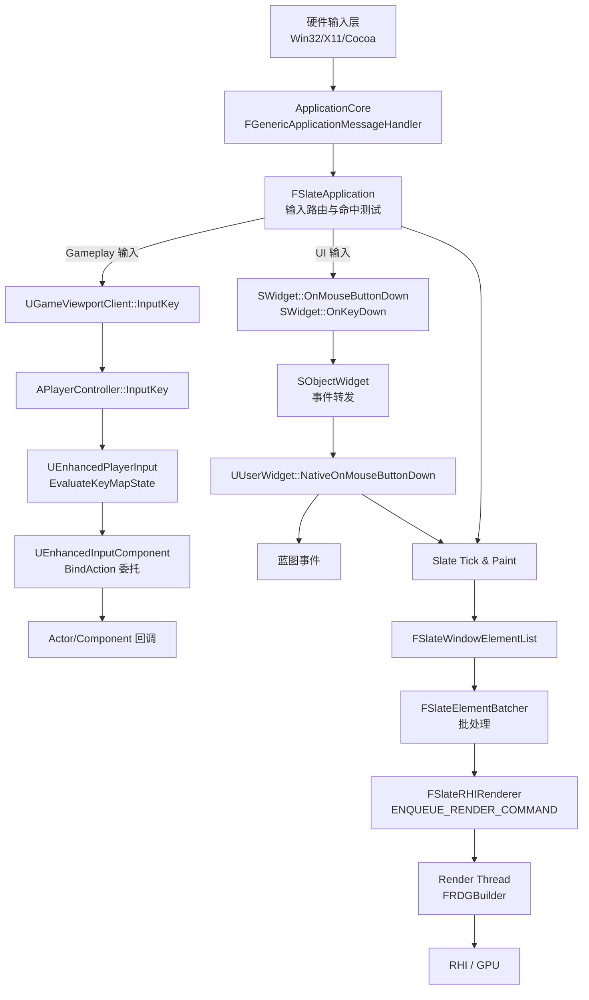
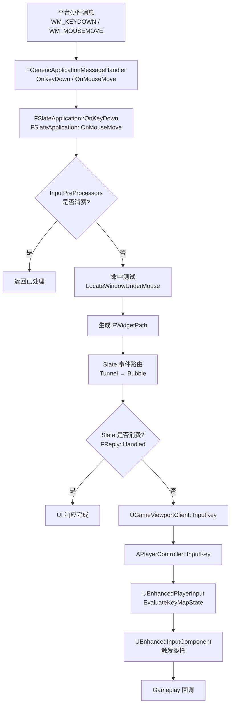

> [← 返回 UE全解析主索引]([[00-UE全解析主索引|UE全解析主索引]])

# UE-专题：UI 渲染与输入处理链路

## Why：为什么要理解 UI 渲染与输入处理链路？

在 UE 中，**输入**与**UI 渲染**是两条看似独立、实则深度交织的核心链路：

- **输入侧**：玩家按下按键后，事件如何决定走向 UI 还是 Gameplay？为什么 EnhancedInput 的 Action 和 Slate 的 `OnKeyDown` 不会冲突？
- **渲染侧**：UMG 蓝图控件如何最终变成 GPU 上的 DrawCall？为什么 Slate 使用纯 C++ 对象模型而非 UObject？
- **桥接侧**：`UWidget` 与 `SWidget` 是两套平行层级，UMG 如何在保证 GC 安全的前提下，让设计师用蓝图操作高性能的 Slate 渲染？

理解这条跨模块链路，是打通"第四阶段-客户端运行时层"各单模块分析、形成系统级架构视野的关键。本专题以**三层剥离法**横向串联 `InputCore → EnhancedInput → Slate → UMG → Renderer` 五个模块，揭示 UE 在输入路由、对象生命周期、渲染提交上的设计哲学。

---

## What：链路总览

### 完整跨模块链路



**核心洞察**：UE 的输入是**双轨制**——Slate 负责 UI 层的事件命中与冒泡，EnhancedInput 负责 Gameplay 层的 Action 映射与求值。两条轨道在 `FSlateApplication` 处分道扬镳：被 Slate 消费的事件不再进入 Gameplay，未被消费的事件才下沉到 `UGameViewportClient`。

---

## 第 1 层：接口层（What）

### 1.1 输入基础设施：InputCore

InputCore 是 UE 输入体系的**最底层键类型与平台映射模块**。详细分析参见 [[UE-InputCore-源码解析：输入系统与 Action Mapping]]。

#### FKey / EKeys / FKeyDetails

> 文件：`Engine/Source/Runtime/InputCore/Classes/InputCoreTypes.h`，第 48~127 行

```cpp
USTRUCT(BlueprintType, Blueprintable)
struct FKey
{
    GENERATED_USTRUCT_BODY()
    UPROPERTY(EditAnywhere, Category="Input")
    FName KeyName;
    mutable TSharedPtr<struct FKeyDetails> KeyDetails;
    // ...
};
```

`FKey` 仅封装一个 `FName` 和一个懒加载的 `TSharedPtr<FKeyDetails>`，是整个输入系统的**最小数据单元**。从底层平台消息到高层 Action Mapping 均以此传递。

#### FGenericPlatformInput

> 文件：`Engine/Source/Runtime/InputCore/Public/GenericPlatform/GenericPlatformInput.h`，第 11~51 行

```cpp
struct FGenericPlatformInput
{
    inline static FKey RemapKey(FKey Key) { return Key; }
    static FKey GetGamepadAcceptKey() { return EKeys::Gamepad_FaceButton_Bottom; }
};
```

各平台通过子类覆写 `RemapKey`、`GetKeyMap` 等方法，实现键位重映射和跨平台抽象。

### 1.2 增强输入：EnhancedInput

EnhancedInput 是 UE4.27+/UE5 主推的**数据资产驱动**输入框架。详细分析参见 [[UE-EnhancedInput-源码解析：增强输入系统]]。

#### UInputAction / UInputMappingContext

> 文件：`Engine/Plugins/EnhancedInput/Source/EnhancedInput/Public/InputAction.h`，第 54~154 行

```cpp
UCLASS(MinimalAPI, BlueprintType)
class UInputAction : public UDataAsset
{
    UPROPERTY(EditAnywhere, BlueprintReadOnly, Category = Action)
    EInputActionValueType ValueType = EInputActionValueType::Boolean;
    UPROPERTY(EditAnywhere, Instanced, BlueprintReadWrite, Category = Action)
    TArray<TObjectPtr<UInputTrigger>> Triggers;
    UPROPERTY(EditAnywhere, Instanced, BlueprintReadWrite, Category = Action)
    TArray<TObjectPtr<UInputModifier>> Modifiers;
};
```

`UInputAction` 是**纯数据资产**，描述逻辑动作（如 Jump、Shoot）。`UInputMappingContext` 是键→动作映射的集合，支持优先级叠加与 `FGameplayTagQuery` 动态过滤。

#### UEnhancedPlayerInput 逐帧求值

> 文件：`Engine/Plugins/EnhancedInput/Source/EnhancedInput/Public/EnhancedPlayerInput.h`，第 93~200 行

```cpp
UCLASS(MinimalAPI, config = Input, transient)
class UEnhancedPlayerInput : public UPlayerInput
{
    UE_API virtual void EvaluateKeyMapState(const float DeltaTime, const bool bGamePaused, OUT TArray<TPair<FKey, FKeyState*>>& KeysWithEvents) override;
    UE_API virtual void EvaluateInputDelegates(...) override;
    UE_API void InjectInputForAction(TObjectPtr<const UInputAction> Action, FInputActionValue RawValue, ...);
};
```

每帧执行：**原始键值 → Mapping Modifiers → Action Modifiers → Triggers 评估 → 更新 FInputActionInstance → 触发绑定委托**。

### 1.3 Slate 输入路由

Slate 是 UE 的纯 C++ UI 系统，负责 UI 层的事件路由与命中测试。详细分析参见 [[UE-Slate-源码解析：Slate UI 运行时]]。

#### FSlateApplication 的事件处理入口

> 文件：`Engine/Source/Runtime/Slate/Private/Framework/Application/SlateApplication.cpp`，第 4863~4871 行

```cpp
bool FSlateApplication::OnKeyDown(const int32 KeyCode, const uint32 CharacterCode, const bool IsRepeat)
{
    FKey const Key = FInputKeyManager::Get().GetKeyFromCodes(KeyCode, CharacterCode);
    FKeyEvent KeyEvent(Key, PlatformApplication->GetModifierKeys(), GetUserIndexForKeyboard(), IsRepeat, CharacterCode, KeyCode);
    return ProcessKeyDownEvent(KeyEvent);
}
```

平台原生消息（Win32 `WM_KEYDOWN` 等）经 `FGenericApplicationMessageHandler` 转换后，进入 `FSlateApplication::OnKeyDown` / `OnMouseMove` / `OnTouchStarted` 等入口。

#### 命中测试与 WidgetPath

> 文件：`Engine/Source/Runtime/Slate/Private/Framework/Application/SlateApplication.cpp`，第 6269~6308 行

```cpp
bool FSlateApplication::ProcessMouseMoveEvent(const FPointerEvent& MouseEvent, bool bIsSynthetic)
{
    // ...
    FWidgetPath WidgetsUnderCursor = bOverSlateWindow
        ? LocateWindowUnderMouse(MouseEvent.GetScreenSpacePosition(), GetInteractiveTopLevelWindows(), false, MouseEvent.GetUserIndex())
        : FWidgetPath();
    bool bResult;
    {
        bResult = RoutePointerMoveEvent(WidgetsUnderCursor, MouseEvent, bIsSynthetic);
    }
    return bResult;
}
```

`LocateWindowUnderMouse` 通过几何命中测试生成 `FWidgetPath`（从根窗口到叶子控件的层级路径），随后 `RoutePointerMoveEvent` 沿该路径分发事件。

#### 焦点路径上的冒泡/捕获

> 文件：`Engine/Source/Runtime/Slate/Private/Framework/Application/SlateApplication.cpp`，第 4871~4976 行

```cpp
bool FSlateApplication::ProcessKeyDownEvent(const FKeyEvent& InKeyEvent)
{
    // 1. InputPreProcessors 优先处理（如 AnalogCursor）
    if (InputPreProcessors.HandleKeyDownEvent(*this, InKeyEvent)) { return true; }

    // 2. Tunnel（捕获阶段）：沿焦点路径从根到叶子调用 OnPreviewKeyDown
    Reply = FEventRouter::RouteAlongFocusPath(this, FEventRouter::FTunnelPolicy(EventPath), InKeyEvent,
        [](const FArrangedWidget& CurrentWidget, const FKeyEvent& Event)
    {
        return CurrentWidget.Widget->OnPreviewKeyDown(CurrentWidget.Geometry, Event);
    });

    // 3. Bubble（冒泡阶段）：若未被消费，从叶子到根调用 OnKeyDown
    if (!Reply.IsEventHandled())
    {
        Reply = FEventRouter::RouteAlongFocusPath(this, FEventRouter::FBubblePolicy(EventPath), InKeyEvent,
            [](const FArrangedWidget& SomeWidget, const FKeyEvent& Event)
        {
            return SomeWidget.Widget->OnKeyDown(SomeWidget.Geometry, Event);
        });
    }
    // ...
}
```

键盘事件采用 **Tunnel → Bubble** 两阶段模型：
- **Tunnel（捕获）**：`OnPreviewKeyDown` 从外层向内层传播，允许父控件预先拦截
- **Bubble（冒泡）**：`OnKeyDown` 从内层向外层传播，叶子控件优先响应

若 Slate 未消费事件（`Reply.IsEventHandled() == false`），则事件继续下沉到 `UGameViewportClient`。

### 1.4 UMG 桥接层

UMG 在 Slate 之上封装 UObject/Blueprint 抽象。详细分析参见 [[UE-UMG-源码解析：UMG 蓝图与控件]]。

#### UWidget::TakeWidget() / RebuildWidget()

> 文件：`Engine/Source/Runtime/UMG/Private/Components/Widget.cpp`（概念位置）

```cpp
TSharedRef<SWidget> UWidget::TakeWidget()
{
    TSharedPtr<SWidget> CachedWidget = GetCachedWidget();
    if (!CachedWidget.IsValid())
    {
        CachedWidget = RebuildWidget();
        if (UUserWidget* UserWidget = Cast<UUserWidget>(this))
        {
            CachedWidget = SNew(SObjectWidget, UserWidget)
                [CachedWidget.ToSharedRef()];
        }
        SetCachedWidget(CachedWidget.ToSharedRef());
    }
    return CachedWidget.ToSharedRef();
}
```

`TakeWidget()` 是 **UMG → Slate 的延迟构造入口**。首次调用时才通过 `RebuildWidget()` 创建底层 Slate 控件，避免不必要的对象分配。

#### SObjectWidget：GC 锚定与事件转发

> 文件：`Engine/Source/Runtime/UMG/Public/Slate/SObjectWidget.h`，第 24~110 行

```cpp
class SObjectWidget : public SCompoundWidget, public FGCObject
{
    UMG_API virtual void AddReferencedObjects(FReferenceCollector& Collector) override;
    UMG_API virtual void Tick(const FGeometry& AllottedGeometry, const double InCurrentTime, const float InDeltaTime) override;
    UMG_API virtual int32 OnPaint(...) const override;
    UMG_API virtual FReply OnMouseButtonDown(...) override;
    // ... 大量 Slate 事件转发
protected:
    TObjectPtr<UUserWidget> WidgetObject;
};
```

`SObjectWidget` 是 **UMG ↔ Slate 的关键桥接**：
- 继承 `FGCObject`，通过 `AddReferencedObjects` 强引用 `UUserWidget*`
- 只要 Slate 树中存在该 `SObjectWidget`，对应的 `UUserWidget` 就不会被 GC
- 转发 Slate 生命周期事件到 UObject 层：`Tick` → `UUserWidget::Tick`，`OnMouseButtonDown` → `NativeOnMouseButtonDown` → 蓝图事件

#### UUserWidget / WidgetTree

`UUserWidget` 包含一个 `UWidgetTree`，内部是完整的 UObject 层级。蓝图设计师操作的是 `UWidgetTree`，运行时再映射为 Slate 树。

### 1.5 Slate 渲染管线

#### FSlateRenderer / FSlateRHIRenderer

> 文件：`Engine/Source/Runtime/SlateCore/Public/Rendering/SlateRenderer.h`，第 169~273 行

```cpp
class FSlateRenderer
{
    virtual FSlateDrawBuffer& AcquireDrawBuffer() = 0;
    virtual void ReleaseDrawBuffer(FSlateDrawBuffer& InWindowDrawBuffer) = 0;
    virtual void DrawWindows(FSlateDrawBuffer& InWindowDrawBuffer) = 0;
    // ...
};
```

`FSlateRenderer` 是抽象渲染器接口。`FSlateRHIRenderer` 是 UE 主渲染器的具体实现，负责将 Slate 的绘制元素列表转换为 GPU 命令。

#### FSlateWindowElementList

> 文件：`Engine/Source/Runtime/SlateCore/Public/Rendering/DrawElements.h`，第 28~80 行

```cpp
class FSlateWindowElementList : public FNoncopyable
{
    template<EElementType ElementType = EElementType::ET_NonMapped>
    TSlateDrawElement<ElementType>& AddUninitialized()
    {
        // 分桶存储：UncachedDrawElements / CachedDrawElements
        FSlateDrawElementMap& Elements = UncachedDrawElements;
        FSlateDrawElementArray<FSlateElementType>& Container = Elements.Get<(uint8)ElementType>();
        const int32 InsertIdx = Container.AddDefaulted();
        return Container[InsertIdx];
    }
};
```

`FSlateWindowElementList` 是每个窗口每帧生成的一份**绘制元素列表**，按 `EElementType`（Box、Text、Line、Gradient、Viewport 等）分桶存储。

---

## 第 2 层：数据层（How - Structure）

### 2.1 FInputEvent 的继承体系与事件传播

> 文件：`Engine/Source/Runtime/SlateCore/Public/Input/Events.h`，第 150~220 行

```cpp
USTRUCT(BlueprintType)
struct FInputEvent
{
    GENERATED_USTRUCT_BODY()
    FModifierKeysState ModifierKeys;
    bool bIsRepeat;
    uint32 UserIndex;
    FInputDeviceId InputDeviceId;
};
```

继承体系：
- `FInputEvent`（基类，修饰键 + UserIndex + 时间戳）
  - `FKeyEvent`（键盘事件，含 `FKey` + `CharacterCode` + `KeyCode`）
    - `FAnalogInputEvent`（模拟轴事件，增加轴值）
  - `FPointerEvent`（指针事件，含屏幕坐标、按下按钮集、生效按钮、PointerIndex）
    - 同时承载鼠标、触摸、手势事件

所有事件结构均为 `USTRUCT`，支持蓝图反射，但事件实例本身是**值语义**，在栈上传递，无 GC 开销。

### 2.2 UEnhancedPlayerInput 的 IMC 栈与优先级求值

> 文件：`Engine/Plugins/EnhancedInput/Source/EnhancedInput/Public/EnhancedPlayerInput.h`，第 93~200 行

`UEnhancedPlayerInput` 维护一个 IMC（Input Mapping Context）栈：
- `AppliedInputContexts`：`TMap<UInputMappingContext*, FAppliedInputContextData>`
- 每个 IMC 有**优先级**（Priority），高优先级映射覆盖低优先级的同键映射
- `bMappingRebuildPending`：IMC 增删时标记延迟重建，在 Tick 末执行 `RebuildControlMappings()`

运行时对每个 `FKey` 读取原始值后，按序执行：
1. **局部 Modifiers**（`FEnhancedActionKeyMapping` 上附带的 `UInputModifier`）
2. **全局 Modifiers**（`UInputAction` 资产上定义的 `UInputModifier`）
3. **Triggers 评估**（更新 `FInputActionInstance::TriggerState`）
4. **值合并**（按 `AccumulationBehavior`：取最大绝对值 / 累加）

### 2.3 Slate Widget 树的纯 C++ 对象模型（TSharedRef，非 UObject）

> 文件：`Engine/Source/Runtime/SlateCore/Public/Widgets/SWidget.h`

```cpp
class SLATECORE_API SWidget : public FSlateControlledConstruction, public TSharedFromThis<SWidget>
{
    virtual void Tick(const FGeometry& AllottedGeometry, const double InCurrentTime, const float InDeltaTime);
    virtual int32 OnPaint(...) const = 0;
    virtual FReply OnMouseButtonDown(const FGeometry& MyGeometry, const FPointerEvent& MouseEvent);
    // ...
};
```

Slate Widget 树是**纯 C++ 对象树**，不走 UObject/GC 体系：
- 生命周期由 `TSharedRef` / `TSharedPtr` 控制
- 构造通过 `SNew` 宏完成，三阶段：`SWidgetConstruct` → `Construct` → 标记完成
- 析构时注销 ActiveTimer、清理 Accessibility、通知 `FSlateInvalidationRoot`

这种设计的核心动机是**避免 GC 对高频 UI 操作的性能开销**。编辑器中可能有成千上万个 Widget 同时存在，若全部走 UObject/GC，每帧的标记-清除和反射查询将成为瓶颈。

### 2.4 UMG Widget 树的 UObject 模型与 GC 安全

UMG Widget 树是**UObject 树**，与 Slate 树平行但独立：

| 维度 | UMG (UObject) | Slate (纯 C++) |
|------|---------------|----------------|
| 生命周期 | GC 管理 | `TSharedRef` 引用计数 |
| 可编辑性 | 蓝图可编辑 | 纯代码构造 |
| 反射 | 完整 UPROPERTY/UCLASS | 仅样式/事件结构用 USTRUCT |
| 性能 | 适合配置与逻辑 | 适合高频渲染与事件 |

**GC 安全机制**：`SObjectWidget` 继承 `FGCObject`，在 `AddReferencedObjects` 中引用 `UUserWidget*`。这实现了"只要 Slate 侧存活，UObject 侧就不会被 GC"的语义。

### 2.5 Slate Element 的批处理与顶点缓冲

> 文件：`Engine/Source/Runtime/SlateCore/Public/Rendering/SlateRenderBatch.h`，第 18~80 行

```cpp
struct FSlateRenderBatchParams
{
    bool IsBatchableWith(const FSlateRenderBatchParams& Other) const
    {
        return Layer == Other.Layer
            && ShaderParams == Other.ShaderParams
            && Resource == Other.Resource
            && PrimitiveType == Other.PrimitiveType
            && ShaderType == Other.ShaderType
            && DrawEffects == Other.DrawEffects
            && DrawFlags == Other.DrawFlags
            && SceneIndex == Other.SceneIndex
            && ClippingState == Other.ClippingState;
    }
};
```

`FSlateRenderBatch` 是 Slate 渲染的**最小批处理单元**。在 `FSlateElementBatcher` 中，连续的 `FSlateDrawElement` 若满足 `IsBatchableWith` 条件（同 Layer、同 Shader、同 Resource、同 ClippingState 等），则被合并为同一个 `FSlateRenderBatch`，共用一份顶点缓冲和索引缓冲，从而**大幅减少 UI DrawCall**。

---

## 第 3 层：逻辑层（How - Behavior）

### 3.1 完整输入处理链路



**关键分流点**：`FSlateApplication` 是 UI 与 Gameplay 输入的**唯一仲裁者**。Slate 优先获得所有输入事件，只有 Slate 明确不消费（返回 `FReply::Unhandled()`）时，事件才通过 `UGameViewportClient` 下沉到 Gameplay 层。

> 文件：`Engine/Source/Runtime/Engine/Private/GameViewportClient.cpp`，第 696~775 行

```cpp
bool UGameViewportClient::InputKey(const FInputKeyEventArgs& InEventArgs)
{
    // 1. Console 命令优先
    bool bResult = (ViewportConsole ? ViewportConsole->InputKey(...) : false);
    // 2. Override 回调
    if (!bResult && OnOverrideInputKeyEvent.IsBound()) { ... }
    // 3. 下沉到 PlayerController → EnhancedPlayerInput
    if (!bResult)
    {
        ULocalPlayer* const TargetPlayer = GEngine->GetLocalPlayerFromInputDevice(this, EventArgs.InputDevice);
        if (TargetPlayer && TargetPlayer->PlayerController)
        {
            bResult = TargetPlayer->PlayerController->InputKey(EventArgs);
        }
    }
    return bResult;
}
```

### 3.2 输入消费与冒泡/捕获机制

Slate 的输入路由遵循 **WidgetPath 模型**：

1. **生成路径**：`LocateWindowUnderMouse` 从顶层窗口递归执行 `ArrangeChildren` + 几何命中测试，生成 `FWidgetPath`（根 → ... → 叶子的有序数组）
2. **指针事件**：沿 `FWidgetPath` **从叶子到根**冒泡（Bubble），调用 `OnMouseButtonDown` / `OnMouseMove` 等
3. **键盘事件**：先沿焦点路径 **从根到叶子** 捕获（Tunnel，`OnPreviewKeyDown`），再沿同路径 **从叶子到根** 冒泡（Bubble，`OnKeyDown`）
4. **消费阻断**：任一环节返回 `FReply::Handled()`，后续节点不再接收该事件

### 3.3 UMG 的 Tick 与动画更新

UMG 的 Tick 由 Slate 驱动：

1. `FSlateApplication::TickAndDrawWidgets` 每帧调用
2. `SWidget::Paint()` 内部检查 `EWidgetUpdateFlags::NeedsTick`，若需要则调用 `Tick()`
3. `SObjectWidget::Tick()` 转发到 `UUserWidget::Tick()`
4. `UUserWidget::Tick()` 驱动 `UWidgetAnimation` 更新（基于 `UMovieScene` 的动画系统）

**关键特性**：Slate 的 Tick **嵌套在 Paint 中执行**，不可见控件（Visibility = Collapsed/Hidden）不会进入 Paint 路径，因此不会 Tick。这比传统"全局 Tick 列表"模型更节能。

### 3.4 Slate Paint → Element Batching → Vertex Buffer → DrawCall 的渲染链路

```mermaid
graph LR
    A[SWidget::OnPaint] -->|生成| B[FSlateDrawElement<br/>Box/Text/Image/Line]
    B -->|收集到| C[FSlateWindowElementList]
    C -->|批处理| D[FSlateElementBatcher<br/>CreateRenderBatches]
    D -->|合并同态元素| E[FSlateRenderBatch<br/>顶点缓冲 + 索引缓冲]
    E -->|Game Thread| F[FSlateDrawBuffer<br/>多窗口元素列表]
    F -->|ENQUEUE_RENDER_COMMAND| G[Render Thread]
    G -->|FRDGBuilder| H[RHI Command List]
    H -->|DrawIndexedPrimitive| I[GPU]
```



**Game Thread 侧**：

> 文件：`Engine/Source/Runtime/Slate/Private/Framework/Application/SlateApplication.cpp`，第 1591~1643 行

```cpp
void FSlateApplication::Tick(ESlateTickType TickType)
{
    float DeltaTime = GetDeltaTime();
    if (EnumHasAnyFlags(TickType, ESlateTickType::PlatformAndInput)) { TickPlatform(DeltaTime); }
    if (EnumHasAnyFlags(TickType, ESlateTickType::Time)) { TickTime(); }
    if (EnumHasAnyFlags(TickType, ESlateTickType::Widgets)) { TickAndDrawWidgets(DeltaTime); }
}
```

`TickAndDrawWidgets` → `DrawWindows` → `DrawPrepass`（计算 DesiredSize）→ `PrivateDrawWindows`（为每个窗口创建 `FSlateWindowElementList`，调用 `SWindow::PaintWindow`）。

**Render Thread 侧**：

> 文件：`Engine/Source/Runtime/SlateRHIRenderer/Private/SlateRHIRenderer.cpp`，第 1314~1356 行

```cpp
TUniquePtr<FSlateDrawWindowsCommand> DrawWindowsCommand = MakeUnique<FSlateDrawWindowsCommand>();
// ... 填充每个窗口的 FSlateDrawWindowPassInputs
if (!DrawWindowsCommand->IsEmpty())
{
    ENQUEUE_RENDER_COMMAND(SlateDrawWindowsCommand)([this, DrawWindowsCommand = MoveTemp(DrawWindowsCommand)](FRHICommandListImmediate& RHICmdList)
    {
        DrawWindows_RenderThread(RHICmdList, DrawWindowsCommand->Windows, DrawWindowsCommand->DeferredUpdates);
    });
}
```

`FSlateRHIRenderer::DrawWindows_Private` 在 Game Thread 构建完所有窗口的绘制数据后，通过 `ENQUEUE_RENDER_COMMAND` 将整个 `FSlateDrawWindowsCommand` 投递到 Render Thread。Render Thread 使用 `FRDGBuilder`（Render Dependency Graph）并行构建和执行 Slate 渲染 Pass。

### 3.5 UMG 在 3D 空间中的渲染（UWidgetComponent → FWidgetRenderer → RenderTarget）

> 文件：`Engine/Source/Runtime/UMG/Private/Components/WidgetComponent.cpp`，第 1239~1298 行

```cpp
void UWidgetComponent::TickComponent(float DeltaTime, enum ELevelTick TickType, FActorComponentTickFunction* ThisTickFunction)
{
    // ...
    UpdateWidget();
    if (Space == EWidgetSpace::World)
    {
        if (ShouldDrawWidget())
        {
            const float DeltaTimeFromLastDraw = static_cast<float>(LastWidgetRenderTime == 0 ? 0 : (GetCurrentTime() - LastWidgetRenderTime));
            DrawWidgetToRenderTarget(DeltaTimeFromLastDraw);
        }
    }
}
```

> 文件：`Engine/Source/Runtime/UMG/Private/Components/WidgetComponent.cpp`，第 1860~1920 行

```cpp
void UWidgetComponent::UpdateWidget()
{
    TSharedPtr<SWidget> NewSlateWidget;
    if (Widget) { NewSlateWidget = Widget->TakeWidget(); }
    if (!SlateWindow.IsValid())
    {
        SlateWindow = SNew(SVirtualWindow).Size(CurrentDrawSize);
        SlateWindow->SetAllowFastUpdate(bUseInvalidationInWorldSpace);
        // ...
    }
    if (NewSlateWidget.IsValid())
    {
        SlateWindow->SetContent(NewSlateWidget.ToSharedRef());
    }
}
```

`UWidgetComponent` 的 3D 渲染链路：
1. `UpdateWidget()`：调用 `TakeWidget()` 获取 Slate 控件，创建 `SVirtualWindow` 作为离屏渲染容器
2. `DrawWidgetToRenderTarget()`：通过 `FWidgetRenderer` 将 `SVirtualWindow` 渲染到 `UTextureRenderTarget2D`
3. RenderTarget 作为动态纹理绑定到 `UMaterialInstanceDynamic`，应用到 WidgetComponent 的 Mesh 上
4. 最终像普通 Mesh 一样参与场景渲染

> 文件：`Engine/Source/Runtime/UMG/Public/Slate/WidgetRenderer.h`，第 28~166 行

```cpp
class FWidgetRenderer : public FDeferredCleanupInterface
{
    UMG_API void DrawWidget(FRenderTarget* RenderTarget, const TSharedRef<SWidget>& Widget, FVector2D DrawSize, float DeltaTime, bool bDeferRenderTargetUpdate = false);
    UMG_API void DrawWindow(FRenderTarget* RenderTarget, FHittestGrid& HitTestGrid, TSharedRef<SWindow> Window, float Scale, FVector2D DrawSize, float DeltaTime, bool bDeferRenderTargetUpdate = false);
private:
    TSharedPtr<ISlate3DRenderer, ESPMode::ThreadSafe> Renderer;
};
```

`FWidgetRenderer` 内部持有 `ISlate3DRenderer`，复用 Slate 的标准渲染管线，只是将目标从屏幕窗口替换为 `FRenderTarget`（`UTextureRenderTarget2D`）。

---

## 与上下层的关系

### 上层调用者

| 上层 | 使用方式 |
|------|---------|
| **Gameplay 代码** | 通过 `UEnhancedInputComponent::BindAction` 绑定输入回调；通过 `CreateWidget` + `AddToViewport` 创建 UI |
| **蓝图设计师** | 在 Widget Blueprint 中编排 UI 布局、动画、事件图；在 IMC 资产中配置输入映射 |
| **编辑器** | 全部编辑器 UI 基于 Slate 构建（`SEditorViewport`、`FAssetEditorToolkit`） |

### 下层依赖

| 下层 | 作用 |
|------|------|
| **ApplicationCore** | 平台窗口抽象（`FGenericWindow`）、消息循环（`WM_KEYDOWN` 等原生消息捕获） |
| **InputCore** | `FKey`、`EKeys`、`FKeyDetails`、`FGenericPlatformInput` 键类型与平台映射 |
| **RenderCore / RHI** | GPU 命令提交、顶点缓冲、纹理资源、Viewport 管理 |
| **FreeType2 / HarfBuzz / ICU** | 字体渲染、文本塑形、国际化（Slate 文本布局依赖） |

---

## 设计亮点与可迁移经验

1. **输入的双轨制**：EnhancedInput 面向 Gameplay（Action 语义），Slate 面向 UI（事件路由语义）。`FSlateApplication` 作为唯一仲裁者，确保 UI 优先消费、Gameplay 获得剩余输入。自研引擎若同时存在 UI 和 Gameplay 输入，应建立类似的分层仲裁机制，避免两层逻辑竞争同一事件。

2. **Slate 的纯 C++ 对象模型避免了 UObject/GC 对高频 UI 操作的开销**：编辑器级复杂 UI 可能有数万个节点，若全部走 UObject/GC，性能不可接受。自研引擎的 UI 底层应采用非 GC 对象模型（如引用计数或 arena allocator），仅在需要蓝图交互的边界层引入 GC 桥接。

3. **UMG 的 UObject 桥接让设计师能用蓝图操作 UI**：`SObjectWidget`（`SCompoundWidget + FGCObject`）是 UObject/GC 系统与非 GC 子系统交互的通用解决方案。自研引擎若存在 GC 与非 GC 子系统的协作，可参考这种"非 GC 对象持有 GC 引用 + 显式 AddReferencedObjects"的模式。

4. **Slate Element 的批处理减少了 UI DrawCall**：`FSlateRenderBatchParams::IsBatchableWith` 将同 Layer、同 Shader、同 Resource、同 ClippingState 的元素合并为一批，共用顶点缓冲。这是 UI 渲染性能的核心优化。自研引擎的 UI 渲染器应引入类似的批处理机制，将大量小 DrawCall 合并为少量大 DrawCall。

5. **Tick 嵌套在 Paint 中的节能设计**：Slate 没有全局 Widget Tick 列表，而是在 Paint 路径中按需调用 Tick。不可见控件不 Paint、不 Tick，天然避免了"隐藏面板仍在消耗 CPU"的问题。自研引擎应避免维护独立的 UI Tick 列表，而是将更新逻辑绑定到可见性/绘制遍历中。

6. **Game Thread 与 Render Thread 的严格分离**：Slate 在 Game Thread 生成 `FSlateWindowElementList`，通过 `ENQUEUE_RENDER_COMMAND` 投递到 Render Thread。这种"命令缓冲区 + 异步提交"模式是现代引擎 UI 渲染的标准范式，避免了跨线程数据竞争。

7. **FWidgetRenderer 的 RenderTarget 离屏渲染**：UMG 的 3D 渲染并非特殊路径，而是复用标准 Slate 管线，将输出目标改为 `UTextureRenderTarget2D`。"UI 先渲染到纹理，再作为普通材质使用"的模式，是游戏内嵌屏幕、全息投影等效果的通用实现方式。

---

## 关联阅读

- [[UE-InputCore-源码解析：输入系统与 Action Mapping]] — 输入系统的最底层键类型与平台映射
- [[UE-EnhancedInput-源码解析：增强输入系统]] — 数据资产驱动的现代化输入映射框架
- [[UE-Slate-源码解析：Slate UI 运行时]] — 纯 C++ UI 框架的声明式语法、失效系统与渲染管线
- [[UE-UMG-源码解析：UMG 蓝图与控件]] — UObject 层与 Slate 层的桥接、GC 安全与 3D 渲染
- [[UE-专题：Slate 编辑器框架全链路]] — 从 ApplicationCore 到 LevelEditor 的完整编辑器 UI 链路

---

## 索引状态

- **所属阶段**：第八阶段-跨领域专题
- **对应 UE 笔记**：UE-专题：UI 渲染与输入处理链路
- **本轮完成度**：✅ 第三轮（完整三层分析）
- **更新日期**：2026-04-19
