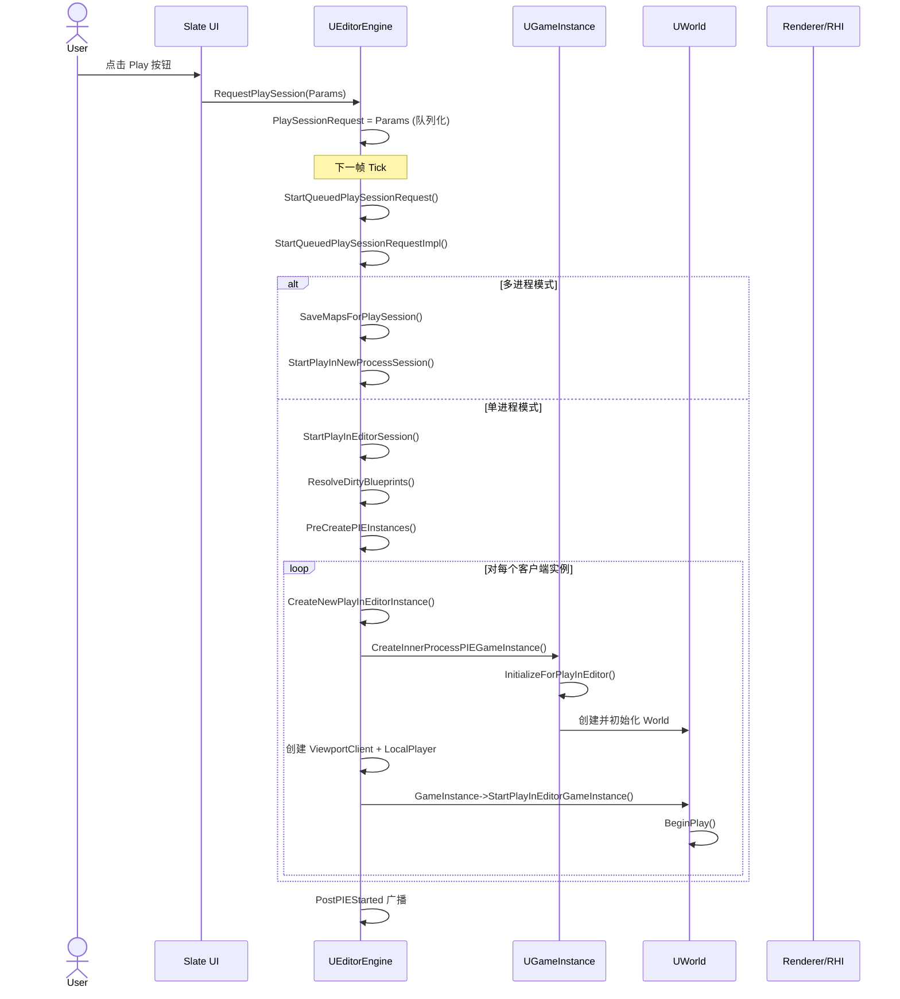
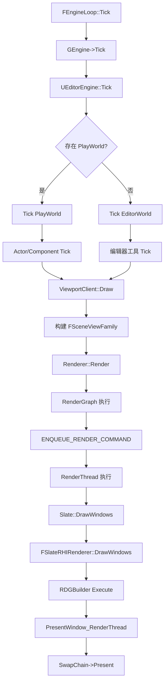

> [← 返回 UE全解析主索引]([[00-UE全解析主索引|UE全解析主索引]])

# UE-专题：从代码到屏幕的编辑器工作流

## Why：为什么要分析这条链路？

UE 编辑器的核心价值在于**"所见即所得"** —— 开发者在编辑器中修改代码、调整资产、摆放 Actor，按下 Play 按钮后几乎立即看到运行效果。这条从"代码/资产修改"到"屏幕像素输出"的链路，贯穿了 UE 的编译系统、编辑器框架、对象系统、渲染管线等多个核心模块。

理解这条链路有助于：
- 掌握 UE **热重载（LiveCoding）** 和 **PIE（Play In Editor）** 的实现原理。
- 理解编辑器为何能做到"不退出编辑器即可测试游戏"。
- 为自研引擎设计工具链工作流提供参考。

---

## What：编辑器工作流的全貌

从开发者按下快捷键 `Ctrl+S` 或点击 Play 按钮开始，到屏幕上出现游戏画面为止，UE 的编辑器工作流可分为五个阶段：


| 阶段 | 涉及模块 | 核心操作 |
|------|---------|---------|
| 代码/资产修改 | 外部 IDE / 蓝图编辑器 | C++ 编译、蓝图节点调整 |
| 编译与热重载 | `LiveCoding` / `UBT` / `KismetCompiler` | DLL 热替换、蓝图 VM 字节码重新生成 |
| 编辑器世界保存 | `UnrealEd` / `Engine` | 脏包检测、事务（Transaction）边界 |
| PIE 初始化 | `UnrealEd` / `Engine` / `Slate` | World 复制/创建、GameInstance 初始化、视口绑定 |
| 游戏逻辑 Tick | `Engine` / 各 Runtime 模块 | Actor/Component Tick、物理、动画、音频 |
| 视口渲染 | `Engine` / `Renderer` / `RenderCore` | FSceneView 构建、RenderGraph 执行 |
| UI 合成与输出 | `Slate` / `SlateRHIRenderer` / `RHI` | Slate DrawBuffer、RHI CommandList、SwapChain Present |

---

## How：逐层拆解工作流

### 第 1 层：接口层 —— 工作流的模块边界与触发点

#### 1.1 代码修改的入口

UE 编辑器支持两种代码修改路径：

**路径 A：C++ 代码热重载（LiveCoding）**

LiveCoding 模块（`Developer/Windows/LiveCoding`）在编辑器启动时注入一个监控线程，监听编译器输出的新 DLL。当检测到更新的 DLL 时，它会：
1. 暂停所有线程。
2. 将新编译的函数地址 patch 到运行中的进程。
3. 恢复线程执行。

```cpp
// LiveCoding.Build.cs 节选
if (Target.bBuildEditor == true)
{
    PrivateDependencyModuleNames.Add("UnrealEd");
    PrivateDependencyModuleNames.Add("Slate");
}
```

> 文件：`Engine/Source/Developer/Windows/LiveCoding/LiveCoding.Build.cs`

**路径 B：蓝图编译**

蓝图（UBlueprint）修改后会被标记为 `BS_Dirty`。在 PIE 启动前，`FInternalPlayLevelUtils::ResolveDirtyBlueprints()` 会自动或手动触发重新编译：

```cpp
// Editor/UnrealEd/Private/PlayLevel.cpp，第 1226~1310 行
int32 FInternalPlayLevelUtils::ResolveDirtyBlueprints(const bool bPromptForCompile, 
    TArray<UBlueprint*>& ErroredBlueprints, const bool bForceLevelScriptRecompile)
{
    TArray<UBlueprint*> InNeedOfRecompile;
    for (TObjectIterator<UBlueprint> BlueprintIt; BlueprintIt; ++BlueprintIt)
    {
        UBlueprint* Blueprint = *BlueprintIt;
        if (!Blueprint->IsUpToDate() && Blueprint->IsPossiblyDirty())
        {
            InNeedOfRecompile.Add(Blueprint);
        }
    }
    // ... 编译并处理错误
}
```

#### 1.2 PIE 请求的入口：`RequestPlaySession`

PIE 的触发点是 `UEditorEngine::RequestPlaySession()`，它是所有 Play 按钮的统一入口：

```cpp
// Editor/UnrealEd/Private/PlayLevel.cpp，第 977~1008 行
void UEditorEngine::RequestPlaySession(const FRequestPlaySessionParams& InParams)
{
    // 将请求存储为队列，延迟到下一帧处理
    PlaySessionRequest = InParams;
    
    // 确保使用独立的 PlaySettings 副本（防止后续修改影响启动）
    FObjectDuplicationParameters DuplicationParams(PlaySessionRequest->EditorPlaySettings, GetTransientPackage());
    PlaySessionRequest->EditorPlaySettings = CastChecked<ULevelEditorPlaySettings>(
        StaticDuplicateObjectEx(DuplicationParams));
}
```

**关键设计**：PIE 请求不是立即执行的，而是被**队列化**到 `PlaySessionRequest` 中，在下一帧的 `StartQueuedPlaySessionRequest()` 中处理。这确保了：
- 当前帧的所有 Slate/UI 操作已完成。
- 不会在中途打断事务（Transaction）。
- 可以在启动前取消（`CancelRequestPlaySession`）。

#### 1.3 编辑器视口渲染的入口：`FEditorViewportClient::Draw`

编辑器中的每个视口（Viewport）都对应一个 `FEditorViewportClient`，其 `Draw()` 函数是 3D 场景渲染到该视口的入口：

```cpp
// Editor/UnrealEd/Private/EditorViewportClient.cpp，第 4564~4570 行
void FEditorViewportClient::Draw(FViewport* InViewport, FCanvas* Canvas)
{
    // 构建 FSceneViewFamilyContext
    FSceneViewFamilyContext ViewFamily(FSceneViewFamily::ConstructionValues(
        Canvas->GetRenderTarget(),
        GetScene(),
        UseEngineShowFlags)
        .SetTime(Time)
        .SetRealtimeUpdate(IsRealtime()));
    // ... 后续调用 Renderer 执行实际渲染
}
```

#### 1.4 Slate UI 渲染的入口：`FSlateApplication::DrawWindows`

Slate 负责将编辑器的所有 UI（面板、按钮、视口控件等）合成为最终的窗口内容：

```cpp
// Runtime/Slate/Private/Framework/Application/SlateApplication.cpp，第 1182~1186 行
void FSlateApplication::DrawWindows()
{
    SCOPED_NAMED_EVENT_TEXT("Slate::DrawWindows", FColor::Magenta);
    PrivateDrawWindows();
}
```

最终由 `FSlateRHIRenderer::DrawWindows` 将 DrawBuffer 转换为 RHI 命令并 Present。

---

### 第 2 层：数据层 —— 核心对象与状态流转

#### 2.1 PIE 世界的创建与隔离

PIE 的核心设计是**在编辑器进程内创建一个与 EditorWorld 隔离的 PlayWorld**。关键数据结构如下：

```
UEditorEngine (GUnrealEd)
├── EditorWorld = GetEditorWorldContext().World()  ← 编辑器中的关卡
├── PlayWorld                                      ← PIE 中的关卡（关键隔离点）
├── WorldList
│   ├── FWorldContext[Editor]  → EditorWorld
│   └── FWorldContext[PIE]     → PlayWorld
├── Trans (UTransactor)       ← Undo/Redo 事务系统
└── SlatePlayInEditorMap      ← Slate 视口与 PIE 实例的映射
```

**隔离机制**：
- `PlayWorld` 通过 `StaticDuplicateObject` 或重新加载 Package 创建，拥有独立的 UObject 集合。
- `PlayWorld->bAllowAudioPlayback = false` 会静音编辑器世界，避免 PIE 时听到编辑器音频。
- `SetPlayInEditorWorld(PlayWorld)` 临时切换 `GWorld`，PIE 结束后通过 `RestoreEditorWorld()` 恢复。

> 文件：`Engine/Source/Editor/UnrealEd/Private/PlayLevel.cpp`，第 2701~2731 行

#### 2.2 `FRequestPlaySessionParams` —— PIE 请求的参数化

UE 将 PIE 的所有启动参数封装在 `FRequestPlaySessionParams` 中，支持多种 Play 模式：

```cpp
// Editor/UnrealEd/Public/PlayInEditorDataTypes.h，第 126~240 行
struct FRequestPlaySessionParams
{
    // 目标视口（可以是编辑器视口或新窗口）
    TWeakPtr<IAssetViewport> DestinationSlateViewport;
    
    // PIE / SIE（Simulate In Editor）
    EPlaySessionWorldType WorldType;
    
    // 网络模式：Standalone / ListenServer / Client
    EPlaySessionDestinationType SessionDestination;
    
    // 玩家起始位置覆盖
    TOptional<FVector> StartLocation;
    
    // GameMode 覆盖
    TSubclassOf<AGameModeBase> GameModeOverride;
    
    // 编辑器 Play 设置（窗口大小、客户端数量等）
    ULevelEditorPlaySettings* EditorPlaySettings;
};
```

#### 2.3 GameInstance 与 WorldContext 的生命周期

在 PIE 中，`UGameInstance` 是 PlayWorld 的上下文持有者：

```cpp
// PlayLevel.cpp，第 2982~2994 行
UGameInstance* UEditorEngine::CreateInnerProcessPIEGameInstance(
    FRequestPlaySessionParams& InParams, 
    const FGameInstancePIEParameters& InPIEParameters, 
    int32 InPIEInstanceIndex)
{
    // 1. 创建 GameInstance
    UGameInstance* GameInstance = NewObject<UGameInstance>(this, GameInstanceClass);
    GameInstance->AddToRoot();  // 防止 GC
    
    // 2. 初始化 PIE GameInstance（这会创建 World）
    GameInstance->InitializeForPlayInEditor(InPIEInstanceIndex, InPIEParameters);
    
    // 3. 获取创建的 WorldContext
    FWorldContext* const PieWorldContext = GameInstance->GetWorldContext();
    PlayWorld = PieWorldContext->World();
    
    // 4. 临时切换 GWorld
    SetPlayInEditorWorld(PlayWorld);
    
    // ... 创建 ViewportClient、LocalPlayer、BeginPlay
}
```

**内存分配来源**：
- `UGameInstance`、`UWorld`、`ULevel`、`AActor` 均为 UObject，受 **UObject GC** 管理。
- PIE 结束后，`EndPlayMap()` 会销毁 PlayWorld，触发 GC 回收所有 PIE 对象。
- `FWorldContext` 存储在 `UEngine::WorldList`（TArray）中，其内存由 UObject 分配器管理。

---

### 第 3 层：逻辑层 —— 关键算法与执行流程

#### 3.1 PIE 启动的完整调用链



#### 3.2 `StartPlayInEditorSession` 的核心步骤

> 文件：`Engine/Source/Editor/UnrealEd/Private/PlayLevel.cpp`，第 2584~2979 行

```cpp
void UEditorEngine::StartPlayInEditorSession(FRequestPlaySessionParams& InRequestParams)
{
    // 1. 取消打开的事务（如果有）
    if (GEditor->IsTransactionActive()) { GEditor->CancelTransaction(0); }
    
    // 2. 刷新异步加载，等待 AssetRegistry
    FlushAsyncLoading();
    IAssetRegistry::GetChecked().WaitForCompletion();
    
    // 3. 自动编译脏蓝图
    TArray<UBlueprint*> ErroredBlueprints;
    FInternalPlayLevelUtils::ResolveDirtyBlueprints(!EditorPlaySettings->AutoRecompileBlueprints, ErroredBlueprints);
    
    // 4. 保存 EditorWorld 引用，静音编辑器音频
    EditorWorld = InWorld;
    EditorWorld->bAllowAudioPlayback = false;
    
    // 5. 预创建检查（给派生类扩展点）
    FGameInstancePIEResult PreCreateResult = PreCreatePIEInstances(...);
    
    // 6. 处理网络模式：Standalone / ListenServer / Client
    //    可能需要启动独立进程的服务器
    
    // 7. 循环创建客户端实例
    for (int32 InstanceIndex = 0; InstanceIndex < NumRequestedInstances; InstanceIndex++)
    {
        CreateNewPlayInEditorInstance(InRequestParams, bRunAsDedicated, LocalNetMode);
    }
    
    // 8. 如果是 SIE，将 PIE 转为 Simulate 模式
    if (InRequestParams.WorldType == EPlaySessionWorldType::SimulateInEditor)
    {
        ToggleBetweenPIEandSIE(true);
    }
    
    // 9. 设置 Undo 屏障（防止撤销到 PIE 之前的状态）
    GUnrealEd->Trans->SetUndoBarrier();
    
    // 10. 广播 PostPIEStarted
    FEditorDelegates::PostPIEStarted.Broadcast(...);
}
```

**关键设计点**：
- **事务取消**：如果用户正在拖拽对象时按下 Play，打开的事务会被强制取消，避免 PIE 世界包含未提交的状态。
- **Undo 屏障**：PIE 结束后，Undo 历史会被截断在屏障处，防止用户通过 Ctrl+Z "撤销"到 PIE 之前的状态（这会导致编辑器世界和 PIE 世界状态混乱）。
- **蓝图错误处理**：如果脏蓝图编译失败，会弹窗询问用户是否继续。用户可以选择忽略错误继续 PIE。

#### 3.3 从 World Tick 到屏幕像素的渲染链路

PIE 启动后，每一帧的执行链路如下：



**编辑器视口 vs PIE 视口的渲染差异**：

| 维度 | 编辑器视口 | PIE 视口 |
|------|-----------|---------|
| `FEditorViewportClient::Draw` | ✅ 直接调用 | ❌ 通过 `UGameViewportClient` |
| `EngineShowFlags.Game` | 通常为 false | 通常为 true |
| 实时渲染 | 由视口实时标志控制 | 始终实时 |
| 摄像机控制 | 编辑器飞行/轨道相机 | 玩家控制器相机 |
| 渲染路径 | 编辑器场景渲染 | 游戏场景渲染（相同 Renderer） |

> 文件：`Engine/Source/Editor/UnrealEd/Private/EditorViewportClient.cpp`，第 4564~4660 行

#### 3.4 Slate UI 的合成与 Present

Slate 的渲染分两个阶段：

**阶段 1：Game Thread —— 构建 DrawBuffer**

```cpp
// SlateApplication.cpp，第 1716~1810 行
void FSlateApplication::TickAndDrawWidgets(float DeltaTime)
{
    // 更新通知、动画等
    FSlateNotificationManager::Get().Tick();
    
    // 绘制所有窗口（生成 FSlateWindowElementList）
    DrawWindows();
}
```

**阶段 2：Render Thread —— RHI 执行与 Present**

```cpp
// SlateRHIRenderer.cpp，第 1066~1118 行
void FSlateRHIRenderer::DrawWindows_RenderThread(
    FRHICommandListImmediate& RHICmdList, 
    TConstArrayView<FSlateDrawWindowPassInputs> Windows, ...)
{
    do {
        FRDGBuilder GraphBuilder(RHICmdList, RDG_EVENT_NAME("Slate"), 
            ERDGBuilderFlags::ParallelSetup | ERDGBuilderFlags::ParallelExecute);
        
        // 每个窗口生成一个 Slate 渲染 Pass
        for (int32 NumWindows = 0; NumWindows < 8 && WindowIndex < Windows.Num(); ++NumWindows, ++WindowIndex)
        {
            const FSlateDrawWindowPassInputs& DrawWindowPassInputs = Windows[WindowIndex];
            WindowPresentCommands.Emplace(DrawWindowPassInputs, 
                DrawWindow_RenderThread(GraphBuilder, DrawWindowPassInputs));
        }
        
        GraphBuilder.Execute();  // 执行 RenderGraph
        
        // Present 到屏幕
        for (const FWindowPresentCommand& Command : WindowPresentCommands)
        {
            PresentWindow_RenderThread(RHICmdList, Command.Inputs, Command.Outputs);
        }
    } while (WindowIndex < Windows.Num());
}
```

**关键设计**：Slate 使用 **Render Dependency Graph (RDG)** 来组织 UI 渲染命令，与游戏渲染共享同一套多线程架构。每个窗口的 Slate 元素被转换为顶点和纹理绘制命令，最终与 3D 场景渲染结果合成到同一个 SwapChain。

---

## 与上下层的关系

### 上层调用者

- **蓝图编辑器 / 材质编辑器 / 动画编辑器**：通过 `UEditorEngine` 的 API 请求 PIE 会话，测试资源在游戏中的效果。
- **关卡编辑器视口**：通过 `FLevelEditorViewportClient` 将用户输入（WASD、鼠标）转换为编辑器相机或 PIE 玩家控制器的输入。
- **内容浏览器**：资产双击打开对应编辑器，修改后通过 AssetRegistry 通知其他系统刷新。

### 下层依赖

- **Core / CoreUObject**：UObject 创建、GC、Package 加载是 PIE 世界创建的基础。
- **Engine**：World、GameInstance、GameMode、PlayerController 等游戏框架。
- **RenderCore / Renderer / RHI**：3D 场景渲染的完整管线。
- **Slate / SlateRHIRenderer**：编辑器 UI 的渲染与合成。
- **LiveCoding / UBT**：C++ 代码的增量编译与热重载。

---

## 设计亮点与可迁移经验

### 1. 延迟执行的 PIE 请求队列

`RequestPlaySession` 不立即启动 PIE，而是将请求存入 `PlaySessionRequest`，在下一帧的 `StartQueuedPlaySessionRequest()` 中处理。这带来了三个好处：
- **避免重入**：当前帧的 Slate 事件处理完毕后再启动，避免在按钮回调中直接修改世界状态。
- **可取消**：用户可以在请求队列化和实际启动之间取消。
- **单帧原子性**：所有 PIE 启动逻辑在一个 Tick 内完成，状态一致。

> **可迁移经验**：工具链中涉及"世界状态切换"的操作（如播放/停止/切换场景），应采用**请求-队列-执行**模式，而非立即执行。

### 2. EditorWorld 与 PlayWorld 的进程内隔离

UE 的 PIE 不需要启动独立进程（虽然支持），核心技巧是：
- 在同一进程内创建**独立的 UObject 集合**（PlayWorld）。
- 通过临时切换 `GWorld` 指针让游戏逻辑"看到"的是 PlayWorld。
- PIE 结束后统一销毁 PlayWorld 并恢复 `GWorld`。

> **可迁移经验**：如果编辑器需要支持"运行模式"，优先考虑**进程内多世界**方案，而非独立进程。进程内方案的启动速度快 1~2 个数量级，且便于调试。

### 3. Undo 屏障与事务边界

PIE 启动前强制取消打开的事务，启动后设置 Undo 屏障。这确保了：
- PIE 不会携带未提交的编辑器操作。
- PIE 结束后无法通过 Undo "穿越"回 PIE 之前的状态。

> **可迁移经验**：任何涉及"世界快照/恢复"的操作，都必须显式管理 Undo 历史和事务边界，否则会导致编辑器状态与运行时状态纠缠。

### 4. 蓝图预编译与错误容错

PIE 启动前自动检测并编译脏蓝图，且允许用户在存在编译错误时选择继续。这种**容错设计**是工具链可用性的关键：
- 不允许错误会频繁打断开发者心流。
- 完全忽略错误可能导致难以排查的运行时异常。

> **可迁移经验**：脚本/可视化编程系统的工具链应提供"编译错误但继续运行"的选项，并明确标识哪些对象处于错误状态。

### 5. Slate 与 3D 渲染的统一合成管线

UE 的编辑器 UI 和游戏画面最终都通过同一套 RHI 管线输出到屏幕。Slate 的 `FSlateRHIRenderer` 使用 RDG 组织命令，与游戏渲染共享 Render Thread。这意味着：
- 编辑器可以在视口上叠加 UI（如 Gizmo、网格、信息面板）而无需额外的合成步骤。
- 游戏和编辑器的渲染效果完全一致（同一 Renderer）。

> **可迁移经验**：编辑器的 UI 框架不应与 3D 渲染管线割裂。理想情况下，UI 应作为渲染管线的最后一个 Pass，直接合成到 SwapChain。

---

## 关键源码片段

### PIE 请求队列化

> 文件：`Engine/Source/Editor/UnrealEd/Private/PlayLevel.cpp`，第 977~1008 行

```cpp
void UEditorEngine::RequestPlaySession(const FRequestPlaySessionParams& InParams)
{
    // 将请求存储为队列，延迟到下一帧处理
    PlaySessionRequest = InParams;
    
    // 复制 PlaySettings，防止后续修改影响启动
    FObjectDuplicationParameters DuplicationParams(
        PlaySessionRequest->EditorPlaySettings, GetTransientPackage());
    PlaySessionRequest->EditorPlaySettings = CastChecked<ULevelEditorPlaySettings>(
        StaticDuplicateObjectEx(DuplicationParams));
}
```

### PIE GameInstance 创建

> 文件：`Engine/Source/Editor/UnrealEd/Private/PlayLevel.cpp`，第 2982~3021 行

```cpp
UGameInstance* UEditorEngine::CreateInnerProcessPIEGameInstance(
    FRequestPlaySessionParams& InParams, 
    const FGameInstancePIEParameters& InPIEParameters, 
    int32 InPIEInstanceIndex)
{
    UGameInstance* GameInstance = NewObject<UGameInstance>(this, GameInstanceClass);
    GameInstance->AddToRoot();  // 防止 GC 销毁
    
    // 初始化 PIE，内部会创建 World
    const FGameInstancePIEResult InitializeResult = 
        GameInstance->InitializeForPlayInEditor(InPIEInstanceIndex, InPIEParameters);
    
    FWorldContext* const PieWorldContext = GameInstance->GetWorldContext();
    PlayWorld = PieWorldContext->World();
    
    // 临时切换全局 GWorld
    SetPlayInEditorWorld(PlayWorld);
    
    // ... 创建 ViewportClient、LocalPlayer
}
```

### Slate RHI 渲染与 Present

> 文件：`Engine/Source/Runtime/SlateRHIRenderer/Private/SlateRHIRenderer.cpp`，第 1066~1118 行

```cpp
void FSlateRHIRenderer::DrawWindows_RenderThread(
    FRHICommandListImmediate& RHICmdList, 
    TConstArrayView<FSlateDrawWindowPassInputs> Windows, ...)
{
    do {
        FRDGBuilder GraphBuilder(RHICmdList, RDG_EVENT_NAME("Slate"), 
            ERDGBuilderFlags::ParallelSetup | ERDGBuilderFlags::ParallelExecute);
        
        // 批量处理窗口（D3D12 限制最多 8 个 SwapChain）
        for (int32 NumWindows = 0; NumWindows < 8 && WindowIndex < Windows.Num(); ++NumWindows, ++WindowIndex)
        {
            WindowPresentCommands.Emplace(Windows[WindowIndex], 
                DrawWindow_RenderThread(GraphBuilder, Windows[WindowIndex]));
        }
        
        GraphBuilder.Execute();
        
        for (const FWindowPresentCommand& Command : WindowPresentCommands)
        {
            PresentWindow_RenderThread(RHICmdList, Command.Inputs, Command.Outputs);
        }
    } while (WindowIndex < Windows.Num());
}
```

---

## 关联阅读

- [[UE-专题：引擎整体骨架与系统组合]] —— UE 模块全景地图与核心对象关系
- [[UE-专题：引擎 Tick 结构与编辑器差异]] —— UEditorEngine::Tick 与 UGameEngine::Tick 的深入对比
- [[UE-专题：渲染一帧的生命周期]] —— World::Tick 到 SwapChain Present 的完整渲染链路
- [[UE-专题：资源加载全链路]] —— Package 加载、AsyncLoading、Level Streaming
- [[UE-UnrealEd-源码解析：编辑器框架总览]] —— UnrealEd 模块的架构与扩展点
- [[UE-UnrealEd-源码解析：PIE 模式与世界隔离]] —— PIE 世界的创建与销毁细节
- [[UE-LevelEditor-源码解析：关卡编辑器]] —— 关卡编辑器视口与工具链
- [[UE-Engine-源码解析：World 与 Level 架构]] —— UWorld / ULevel / AActor 的层级关系
- [[UE-Engine-源码解析：GameFramework 与规则体系]] —— GameInstance / GameMode / PlayerController
- [[UE-Slate-源码解析：Slate UI 运行时]] —— Slate 的渲染与事件系统

---

## 索引状态

- **所属阶段**：第八阶段 —— 跨领域专题深度解析
- **对应笔记**：`UE-专题：从代码到屏幕的编辑器工作流`
- **本轮完成度**：✅ 第三轮（骨架扫描 + 数据结构/行为分析 + 关联辐射）
- **更新日期**：2026-04-19
