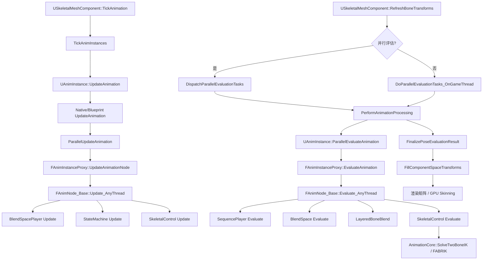
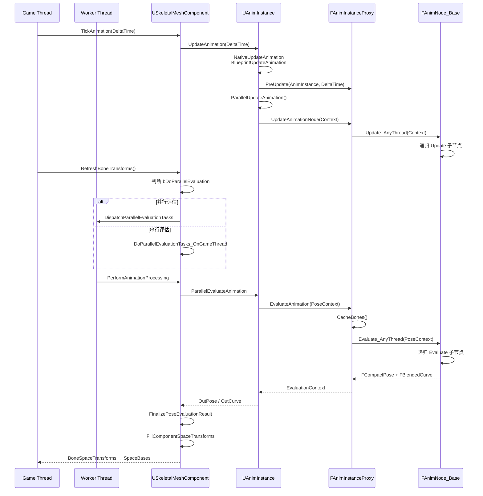

> [[00-UE全解析主索引|← 返回 UE全解析主索引]]

# UE-专题：动画评估管线

## Why：为什么要理解动画评估管线？

动画评估管线是 UE 角色系统的**核心动脉**，它横向贯穿 `Engine`、`AnimGraphRuntime`、`AnimationCore` 以及 `ControlRig` 等多个模块。理解这条管线，能够帮助我们：

1. **定位动画 Bug 的根因**：是 Update 阶段权重计算错误，还是 Evaluate 阶段 Pose 混合异常？是 Game Thread 数据竞争，还是 Worker Thread 的骨骼索引失效？
2. **优化角色性能**：LOD 切换时 RequiredBones 的重建开销、并行评估的任务调度、Compact Pose 的缓存友好性，都建立在对管线的深刻理解之上。
3. **设计自研引擎的动画系统**：UE 的 Proxy 模式、强类型骨骼索引、节点图扁平化执行等设计，是现代游戏引擎动画管线的标杆实现。

本专题将在已有单模块分析的基础上，**横向打通**从 `UAnimInstance` 到 `SkeletalMeshComponent` 渲染矩阵的完整链路。

---

## What：管线总览



---

## 第 1 层：接口层（What）

### 1.1 UAnimInstance / FAnimInstanceProxy

#### UAnimInstance：动画蓝图运行时实例

`UAnimInstance` 是动画蓝图在运行时的 UObject 实例，挂载于 `USkeletalMeshComponent`（`Within=SkeletalMeshComponent`）。它承载了游戏线程上的蓝图更新逻辑（`BlueprintUpdateAnimation`）和 RootMotion 消费逻辑。

```cpp
// Engine/Source/Runtime/Engine/Classes/Animation/AnimInstance.h:351-363
UCLASS(transient, Blueprintable, hideCategories=AnimInstance, BlueprintType, Within=SkeletalMeshComponent, MinimalAPI)
class UAnimInstance : public UObject
{
    // ...
    UPROPERTY(transient)
    TObjectPtr<USkeleton> CurrentSkeleton;  // 当前骨架资产
};
```

#### FAnimInstanceProxy：线程安全代理

由于 `UAnimInstance` 是 UObject，**无法在 Worker Thread 安全访问**。UE 通过 `FAnimInstanceProxy` 将动画评估所需的全部状态（RequiredBones、SyncGroup、DeltaTime 等）复制到一个纯数据结构代理中，实现 Game Thread 与评估线程的解耦。

```cpp
// Engine/Source/Runtime/Engine/Public/Animation/AnimInstanceProxy.h
USTRUCT(meta = (DisplayName = "Native Variables"))
struct FAnimInstanceProxy
{
    GENERATED_USTRUCT_BODY()

    // 四阶段计数器：用于检测节点是否需要重新初始化/缓存骨骼/更新/求值
    const FGraphTraversalCounter& GetInitializationCounter() const;
    const FGraphTraversalCounter& GetCachedBonesCounter() const;
    const FGraphTraversalCounter& GetUpdateCounter() const;
    const FGraphTraversalCounter& GetEvaluationCounter() const;

    FAnimNode_Base* GetRootNode();  // 动画图根节点
    // ...
};
```

**Proxy 的关键设计**：
- Game Thread 通过 `GetProxyOnGameThread()` 读写 Proxy。
- Worker Thread 通过 `GetProxyOnAnyThread()` 只读访问（评估期间）。
- `PreUpdate` 在每帧开始时将 Game Thread 的数据（如变量、输入参数）同步到 Proxy。
- `PostEvaluate` 在评估完成后将结果（如 RootMotion、曲线）同步回 Game Thread。

### 1.2 AnimGraph 运行时节点体系

所有动画节点的根基类 `FAnimNode_Base` 定义在 Engine 模块中，保证了 AnimGraphRuntime 插件可以扩展节点而无需修改 Engine：

```cpp
// Engine/Source/Runtime/Engine/Classes/Animation/AnimNodeBase.h:851-904
USTRUCT()
struct FAnimNode_Base
{
    GENERATED_BODY()

    virtual void Initialize_AnyThread(const FAnimationInitializeContext& Context);
    virtual void CacheBones_AnyThread(const FAnimationCacheBonesContext& Context);
    virtual void Update_AnyThread(const FAnimationUpdateContext& Context);
    virtual void Evaluate_AnyThread(FPoseContext& Output);
    virtual void EvaluateComponentSpace_AnyThread(FComponentSpacePoseContext& Output);
    // ...
};
```

**四阶段生命周期**：

| 阶段 | 触发时机 | 典型操作 |
|------|----------|----------|
| **Initialize** | 首次运行或从 CachedPose/状态机重新进入 | 节点状态重置、绑定 ExposedInputs |
| **CacheBones** | RequiredBones 变化（如 LOD 切换） | `FBoneReference::Initialize()` 解析骨骼索引 |
| **Update** | 每帧 Tick | 计算 BlendWeight、推进时间、SyncGroup 对齐 |
| **Evaluate** | 需要输出 Pose 时 | 输出 `FCompactPose` + `FBlendedCurve` |

**关键节点继承链**（以 BlendSpacePlayer 为例）：

```
FAnimNode_Base
└── FAnimNode_AssetPlayerRelevancyBase
    └── FAnimNode_AssetPlayerBase
        └── FAnimNode_BlendSpacePlayerBase
            ├── FAnimNode_BlendSpacePlayer
            └── FAnimNode_BlendSpacePlayer_Standalone
```

骨骼控制器（SkeletalControl）的基类 `FAnimNode_SkeletalControlBase` 将 `Update_AnyThread` 和 `EvaluateComponentSpace_AnyThread` 标记为 `final`，子类只需实现 `EvaluateSkeletalControl_AnyThread`：

```cpp
// Engine/Source/Runtime/AnimGraphRuntime/Public/BoneControllers/AnimNode_SkeletalControlBase.h:82-88
virtual void Update_AnyThread(const FAnimationUpdateContext& Context) final;
virtual void EvaluateComponentSpace_AnyThread(FComponentSpacePoseContext& Output) final;

// 子类必须实现
virtual void EvaluateSkeletalControl_AnyThread(FComponentSpacePoseContext& Output, TArray<FBoneTransform>& OutBoneTransforms);
```

### 1.3 BlendSpace 评估

BlendSpace 的核心逻辑分布在 `FAnimNode_BlendSpacePlayerBase` 的 `UpdateAssetPlayer` 和 `Evaluate_AnyThread` 中（详见 [[UE-AnimGraphRuntime-源码解析：动画图与BlendSpace]]）。

- **Update 阶段**：通过 `BlendFilter` 对坐标变化做阻尼平滑，调用 `UBlendSpace::UpdateBlendSamples()` 计算当前坐标所在三角形的顶点样本及插值权重，结果写入 `BlendSampleDataCache`。
- **Evaluate 阶段**：调用 `UBlendSpace::GetAnimationPose()`，根据 `BlendSampleDataCache` 中各样本的权重分别对每个样本动画执行 `GetAnimationPose()`，最终混合为 `FCompactPose`。

### 1.4 Skeleton 与 Pose 体系

#### USkeleton / FReferenceSkeleton

`USkeleton` 是动画骨骼资产，存储骨骼层级、Reference Pose、Virtual Bones、Sockets、Retarget Sources 等。其内部通过 `FReferenceSkeleton` 采用 **Raw / Final 双轨制** 管理骨骼数据（详见 [[UE-Engine-源码解析：骨骼与重定向]]）。

#### FBoneContainer：LOD 与 RequiredBones 中枢

```cpp
// Engine/Source/Runtime/Engine/Public/BoneContainer.h:191-248
struct FBoneContainer
{
private:
    TArray<FBoneIndexType>    BoneIndicesArray;      // 当前 LOD 所需的骨骼索引（RequiredBones）
    TBitArray<>               BoneSwitchArray;       // 快速查询某骨骼是否在 RequiredBones 中

    TArray<int32> SkeletonToPoseBoneIndexArray;
    TArray<int32> PoseToSkeletonBoneIndexArray;

    TArray<int32> CompactPoseToSkeletonIndex;
    TArray<FCompactPoseBoneIndex> SkeletonToCompactPose;
    TArray<FCompactPoseBoneIndex> CompactPoseParentBones;
    // ...
};
```

`FBoneContainer` 维护 **Skeleton Pose ↔ Mesh Pose ↔ Compact Pose** 的三重映射，并支持懒加载的 Retarget 缓存（`RetargetSourceCachedDataLUT`）。

#### FCompactPose / FCSPose

```cpp
// Engine/Source/Runtime/Engine/Public/BonePose.h:346
struct FCompactPose : public FBaseCompactPose<FAnimStackAllocator>
{
    ENGINE_API void ResetToAdditiveIdentity();
    ENGINE_API void NormalizeRotations();
};

// Engine/Source/Runtime/Engine/Public/BonePose.h:407
template<class PoseType>
struct FCSPose
{
    // 内部持有 PoseType（即 FCompactPose），附加 ComponentSpaceFlags 标记每根骨骼是否已在组件空间
    PoseType Pose;
    TCustomBoneIndexArray<uint8, BoneIndexType, AllocatorType> ComponentSpaceFlags;
};
```

- `FCompactPose` 使用 `FAnimStackAllocator`（基于 `FMemStack` 的栈分配器），评估期间无需堆分配，生命周期由 `FMemMark` 管理。
- `FCSPose` 在 `FCompactPose` 之上增加 ComponentSpaceFlags，用于 SkeletalControl 评估时的局部空间 ↔ 组件空间转换。

### 1.5 SkeletalMeshComponent 集成

```cpp
// Engine/Source/Runtime/Engine/Classes/Components/SkeletalMeshComponent.h:89,1025
class USkeletalMeshComponent : public USkinnedMeshComponent
{
    UAnimInstance* AnimInstance;  // 主动画实例（AnimBlueprint）
    UAnimInstance* PostProcessAnimInstance;  // 后处理动画实例
    TArray<UAnimInstance*> LinkedInstances;  // 链接的子实例

    UFUNCTION(BlueprintCallable, Category="Components|SkeletalMesh")
    ENGINE_API class UAnimInstance * GetAnimInstance() const;
};
```

`USkeletalMeshComponent` 是动画评估管线的**调度中枢**：
- `TickAnimation()`：触发所有动画实例的 Update。
- `RefreshBoneTransforms()`：判断是否需要评估/插值，调度并行或串行评估任务。
- `PerformAnimationProcessing()`：执行实际的动画评估和 PostProcess。

---

## 第 2 层：数据层（How - Structure）

### 2.1 FAnimInstanceProxy 的内存布局与线程安全

`FAnimInstanceProxy` 作为一个 `USTRUCT`，其内存布局完全由 UHT 生成，不含虚函数表（除部分调试接口外），适合在 Worker Thread 上批量复制。

**线程安全模型**：

| 阶段 | 线程 | 操作 |
|------|------|------|
| PreUpdate | Game Thread | 将 AnimInstance 变量同步到 Proxy |
| Update | Game Thread / Worker | 通过 Proxy 调用节点 Update_AnyThread |
| Evaluate | Worker Thread | 通过 Proxy 调用节点 Evaluate_AnyThread |
| PostEvaluate | Game Thread | 将 Proxy 中的 RootMotion、曲线同步回 AnimInstance |

关键源码：

```cpp
// Engine/Source/Runtime/Engine/Private/Animation/AnimInstance.cpp:675-687
void UAnimInstance::PreUpdateAnimation(float DeltaSeconds)
{
    // ...
    GetProxyOnGameThread<FAnimInstanceProxy>().PreUpdate(this, DeltaSeconds);
}

// Engine/Source/Runtime/Engine/Private/Animation/AnimInstance.cpp:882-919
void UAnimInstance::ParallelEvaluateAnimation(bool bForceRefPose, ...)
{
    FAnimInstanceProxy& Proxy = GetProxyOnAnyThread<FAnimInstanceProxy>();
    OutEvaluationData.OutPose.SetBoneContainer(&Proxy.GetRequiredBones());

    FPoseContext EvaluationContext(&Proxy);
    EvaluationContext.ResetToRefPose();
    Proxy.EvaluateAnimation(EvaluationContext);  // Worker Thread 执行

    OutEvaluationData.OutCurve.CopyFrom(EvaluationContext.Curve);
    OutEvaluationData.OutPose.CopyBonesFrom(EvaluationContext.Pose);
}
```

### 2.2 FCompactPose 的 SoA 布局与缓存友好性

```cpp
// Engine/Source/Runtime/Engine/Public/BonePose.h:43-100
template<class BoneIndexType, typename InAllocator>
struct FBasePose
{
protected:
    TArray<FTransform, InAllocator> Bones;  // 连续存储的 FTransform 数组
};
```

虽然 `FCompactPose` 在宏观上是一个 `TArray<FTransform>`（看起来像是 AoS），但由于 `FTransform` 内部将 `Translation`、`Rotation`、`Scale` 各自紧凑存储（`FVector` + `FQuat` + `FVector`），且整个数组在内存中连续，遍历时仍然具有良好的缓存局部性。

更关键的是，`FCompactPose` 使用 **`FAnimStackAllocator`**：

```cpp
// Engine/Source/Runtime/Engine/Public/BonePose.h:346
struct FCompactPose : public FBaseCompactPose<FAnimStackAllocator>
```

`FAnimStackAllocator` 基于 `FMemStack`（线程局部分配栈），评估期间的所有 Pose 分配都在栈上完成，评估结束（`FMemMark` 析构）时一次性释放，**零堆分配开销**。

### 2.3 FBoneContainer 的 LOD 与 RequiredBones 机制

当 `USkeletalMeshComponent` 的 LOD 变化时，`bRequiredBonesUpToDate` 被置为 `false`，在下一帧 `TickAnimation` 或 `RefreshBoneTransforms` 中触发重建：

```cpp
// Engine/Source/Runtime/Engine/Private/Components/SkeletalMeshComponent.cpp:1570-1575
if (!bRequiredBonesUpToDate)
{
    QUICK_SCOPE_CYCLE_COUNTER(STAT_USkeletalMeshComponent_RefreshBoneTransforms_RecalcRequiredBones);
    RecalcRequiredBones(GetPredictedLODLevel());
}
```

`RecalcRequiredBones` 根据当前 LOD 的 `RequiredBones` 数组重新构建 `FBoneContainer` 的三重映射表（`SkeletonToPoseBoneIndexArray`、`CompactPoseToSkeletonIndex` 等）。这一设计使得：**高 LOD 可以剔除不参与蒙皮的骨骼**，显著降低动画评估的计算量。

### 2.4 动画节点图的扁平化与并行评估

UE 的 AnimGraph 在编辑器中以**节点图**形式呈现，但在运行时并不存在传统的"节点对象 + 动态连线"结构。相反：

1. **编译期扁平化**：`UAnimBlueprintGeneratedClass` 在编译时将图结构转换为 `TArray<FAnimNode_Base*>` 的线性数组，节点之间的 `FPoseLink` 直接存储目标节点的指针索引。
2. **递归求值**：`FAnimNode_Base::Evaluate_AnyThread` 通过 `FPoseLink::Evaluate()` 递归调用子节点，避免了运行时动态分派的开销。
3. **并行任务调度**：`USkeletalMeshComponent::RefreshBoneTransforms` 中，若满足并行条件（`CVarUseParallelAnimationEvaluation`、实例支持并行工作），则通过 `DispatchParallelEvaluationTasks` 将评估任务投递到 TaskGraph 的 Worker Thread。

```cpp
// Engine/Source/Runtime/Engine/Private/Components/SkeletalMeshComponent.cpp:2709-2715
const bool bDoPAE = !!CVarUseParallelAnimationEvaluation.GetValueOnGameThread() && 
    (FApp::ShouldUseThreadingForPerformance() || FForkProcessHelper::SupportsMultithreadingPostFork());

const bool bDoParallelEvaluation = bHasValidInstanceForParallelWork && bDoPAE && 
    (bShouldDoEvaluation || bShouldDoParallelInterpolation) && TickFunction && TickFunction->IsCompletionHandleValid();
```

### 2.5 RootMotion 的提取与传递

RootMotion 在动画评估期间被提取到 `FAnimInstanceProxy::ExtractedRootMotion`（`FRootMotionMovementParams`），评估完成后通过 `PostUpdateAnimation` 转移到 Game Thread 的 `UAnimInstance::ExtractedRootMotion`：

```cpp
// Engine/Source/Runtime/Engine/Private/Animation/AnimInstance.cpp:737-758
if (Proxy.GetExtractedRootMotion().bHasRootMotion)
{
    FTransform ProxyTransform = Proxy.GetExtractedRootMotion().GetRootMotionTransform();
    ProxyTransform.NormalizeRotation();
    ExtractedRootMotion.Accumulate(ProxyTransform);
    Proxy.GetExtractedRootMotion().Clear();
}

for (const FQueuedRootMotionBlend& RootMotionBlend : RootMotionBlendQueue)
{
    const float RootMotionSlotWeight = GetSlotNodeGlobalWeight(RootMotionBlend.SlotName);
    const float RootMotionInstanceWeight = RootMotionBlend.Weight * RootMotionSlotWeight;
    ExtractedRootMotion.AccumulateWithBlend(RootMotionBlend.Transform, RootMotionInstanceWeight);
}

if (ExtractedRootMotion.bHasRootMotion)
{
    ExtractedRootMotion.MakeUpToFullWeight();
}
```

`CharacterMovementComponent` 每帧调用 `USkeletalMeshComponent::ConsumeRootMotion()`，将动画提取的位移应用到角色 Capsule 上：

```cpp
// Engine/Source/Runtime/Engine/Private/Components/SkeletalMeshComponent.cpp:4237-4251
FRootMotionMovementParams USkeletalMeshComponent::ConsumeRootMotion()
{
    float InterpAlpha = ShouldUseUpdateRateOptimizations() ? AnimUpdateRateParams->GetRootMotionInterp() : 1.f;
    return ConsumeRootMotion_Internal(InterpAlpha);
}
```

---

## 第 3 层：逻辑层（How - Behavior）

### 3.1 完整评估调用链



#### Update 链路详解

```cpp
// Engine/Source/Runtime/Engine/Private/Components/SkeletalMeshComponent.cpp:1559-1604
void USkeletalMeshComponent::TickAnimation(float DeltaTime, bool bNeedsValidRootMotion)
{
    if(!bEnableAnimation) return;

    // 必要时重建 RequiredBones
    if (!bRequiredBonesUpToDate)
        RecalcRequiredBones(GetPredictedLODLevel());

    // Tick 所有动画实例
    TickAnimInstances(DeltaTime, bNeedsValidRootMotion);
}

// Engine/Source/Runtime/Engine/Private/Components/SkeletalMeshComponent.cpp:1618-1649
void USkeletalMeshComponent::TickAnimInstances(float DeltaTime, bool bNeedsValidRootMotion)
{
    // 先 Update LinkedInstances
    for (UAnimInstance* LinkedInstance : LinkedInstances)
        LinkedInstance->UpdateAnimation(DeltaTime * GlobalAnimRateScale, false, UAnimInstance::EUpdateAnimationFlag::ForceParallelUpdate);

    // 再 Update 主 AnimScriptInstance
    if (AnimScriptInstance != nullptr)
        AnimScriptInstance->UpdateAnimation(DeltaTime * GlobalAnimRateScale, bNeedsValidRootMotion);

    // PostProcess 实例
    if(ShouldUpdatePostProcessInstance())
        PostProcessAnimInstance->UpdateAnimation(DeltaTime * GlobalAnimRateScale, false);
}
```

```cpp
// Engine/Source/Runtime/Engine/Private/Animation/AnimInstance.cpp:512-673
void UAnimInstance::UpdateAnimation(float DeltaSeconds, bool bNeedsValidRootMotion, EUpdateAnimationFlag UpdateFlag)
{
    // ... 前置检查 ...

    PreUpdateAnimation(DeltaSeconds);

    // 先 Update Montage（节点评估需要 Montage 状态）
    UpdateMontage(DeltaSeconds);
    UpdateMontageSyncGroup();
    UpdateMontageEvaluationData();

    // 蓝图/Native Update（Game Thread）
    NativeUpdateAnimation(DeltaSeconds);
    BlueprintUpdateAnimation(DeltaSeconds);

    // 判断是否需要立即在 Game Thread 完成 Update
    const bool bWantsImmediateUpdate = NeedsImmediateUpdate(DeltaSeconds, bNeedsValidRootMotion);
    if(bShouldImmediateUpdate)
    {
        ParallelUpdateAnimation();
        PostUpdateAnimation();
    }
}
```

```cpp
// Engine/Source/Runtime/Engine/Private/Animation/AnimInstanceProxy.cpp:121-156
void FAnimInstanceProxy::UpdateAnimationNode_WithRoot(const FAnimationUpdateContext& InContext, FAnimNode_Base* InRootNode, FName InLayerName)
{
    if(InRootNode != nullptr)
    {
        if (InRootNode == RootNode)
            UpdateCounter.Increment();

        // 三阶段函数调用器（InitialUpdate / BecomeRelevant / Update）
        UE::Anim::FNodeFunctionCaller::InitialUpdate(InContext, *InRootNode);
        UE::Anim::FNodeFunctionCaller::BecomeRelevant(InContext, *InRootNode);
        UE::Anim::FNodeFunctionCaller::Update(InContext, *InRootNode);
        InRootNode->Update_AnyThread(InContext);

        // 更新 CachedPose
        if(TArray<FAnimNode_SaveCachedPose*>* SavedPoseQueue = SavedPoseQueueMap.Find(InLayerName))
        {
            for(FAnimNode_SaveCachedPose* PoseNode : *SavedPoseQueue)
                PoseNode->PostGraphUpdate();
        }
    }
}
```

#### Evaluate 链路详解

```cpp
// Engine/Source/Runtime/Engine/Private/Components/SkeletalMeshComponent.cpp:2349-2395
void USkeletalMeshComponent::PerformAnimationProcessing(...)
{
    // 1. 先 ParallelUpdate（如果 NeedsUpdate）
    if(InAnimInstance && InAnimInstance->NeedsUpdate())
        InAnimInstance->ParallelUpdateAnimation();

    // 2. 执行评估
    if(bInDoEvaluation && OutSpaceBases.Num() > 0)
    {
        FMemMark Mark(FMemStack::Get());
        FCompactPose EvaluatedPose;
        UE::Anim::FHeapAttributeContainer Attributes;

        EvaluateAnimation(InSkeletalMesh, InAnimInstance, bInForceRefPose, OutRootBoneTranslation, OutCurve, EvaluatedPose, Attributes);
        EvaluatePostProcessMeshInstance(OutBoneSpaceTransforms, EvaluatedPose, OutCurve, ...);

        // 3. 将 CompactPose 展开到 BoneSpaceTransforms
        FinalizePoseEvaluationResult(InSkeletalMesh, OutBoneSpaceTransforms, OutRootBoneTranslation, EvaluatedPose);

        // 4. 计算 ComponentSpaceTransforms（SpaceBases）
        InSkeletalMesh->FillComponentSpaceTransforms(OutBoneSpaceTransforms, FillComponentSpaceTransformsRequiredBones, OutSpaceBases);
    }
}
```

```cpp
// Engine/Source/Runtime/Engine/Private/Animation/AnimInstance.cpp:889-919
void UAnimInstance::ParallelEvaluateAnimation(bool bForceRefPose, const USkeletalMesh* InSkeletalMesh, FParallelEvaluationData& OutEvaluationData)
{
    FAnimInstanceProxy& Proxy = GetProxyOnAnyThread<FAnimInstanceProxy>();
    OutEvaluationData.OutPose.SetBoneContainer(&Proxy.GetRequiredBones());

    FMemMark Mark(FMemStack::Get());
    UE::Anim::FCachedPoseScope CachedPoseScope;

    if( !bForceRefPose )
    {
        FPoseContext EvaluationContext(&Proxy);
        EvaluationContext.ResetToRefPose();
        Proxy.EvaluateAnimation(EvaluationContext);  // 核心：驱动动画图评估

        OutEvaluationData.OutCurve.CopyFrom(EvaluationContext.Curve);
        OutEvaluationData.OutPose.CopyBonesFrom(EvaluationContext.Pose);
        OutEvaluationData.OutAttributes.CopyFrom(EvaluationContext.CustomAttributes);
    }
    else
    {
        OutEvaluationData.OutPose.ResetToRefPose();
    }
}
```

```cpp
// Engine/Source/Runtime/Engine/Private/Animation/AnimInstanceProxy.cpp:1397-1424
void FAnimInstanceProxy::EvaluateAnimation(FPoseContext& Output)
{
    EvaluateAnimation_WithRoot(Output, RootNode);
}

void FAnimInstanceProxy::EvaluateAnimation_WithRoot(FPoseContext& Output, FAnimNode_Base* InRootNode)
{
    // 根节点时自动 CacheBones
    if(InRootNode == RootNode)
        CacheBones();
    else
        CacheBones_WithRoot(InRootNode);

    // 若 Native 代码实现了自定义 Evaluate，优先调用；否则走节点图
    if (!Evaluate_WithRoot(Output, InRootNode))
        EvaluateAnimationNode_WithRoot(Output, InRootNode);
}

// Engine/Source/Runtime/Engine/Private/Animation/AnimInstanceProxy.cpp:1487-1513
void FAnimInstanceProxy::EvaluateAnimationNode_WithRoot(FPoseContext& Output, FAnimNode_Base* InRootNode)
{
    if (InRootNode != nullptr)
    {
        if(InRootNode == RootNode)
            EvaluationCounter.Increment();

        InRootNode->Evaluate_AnyThread(Output);  // 递归到整棵树
    }
    else
    {
        Output.ResetToRefPose();
    }
}
```

### 3.2 多线程评估：Game Thread vs Worker Thread

UE 动画系统的线程模型遵循**"Game Thread 负责状态更新，Worker Thread 负责 Pose 评估"** 的原则：

| 操作 | 线程 | 说明 |
|------|------|------|
| `BlueprintUpdateAnimation` | Game Thread | 蓝图逻辑只能在 GT 执行 |
| `NativeUpdateAnimation` | Game Thread | 游戏逻辑驱动动画变量 |
| `ParallelUpdateAnimation` | Game Thread / Worker | 若可并行，节点 Update 在 Worker 执行 |
| `ParallelEvaluateAnimation` | Worker Thread | Pose 评估核心在 Worker 执行 |
| `PostUpdateAnimation` | Game Thread | Notify 分发、RootMotion 消费 |

**并行评估的开关条件**（`SkeletalMeshComponent.cpp:2709-2715`）：
1. `CVarUseParallelAnimationEvaluation` 为真
2. `FApp::ShouldUseThreadingForPerformance()` 为真
3. 所有动画实例均支持并行工作（`CanRunParallelWork()`）
4. `TickFunction->IsCompletionHandleValid()` 为真（存在有效的 Tick 完成句柄）

### 3.3 BlendSpace 的坐标采样与权重计算

BlendSpace 评估分为两个阶段（详见 [[UE-AnimGraphRuntime-源码解析：动画图与BlendSpace]]）：

**Update 阶段**：
```
FAnimNode_BlendSpacePlayerBase::UpdateAssetPlayer()
    └── UBlendSpace::UpdateBlendSamples(Position, BlendSampleDataCache, CachedTriangulationIndex)
        └── 计算当前坐标所在 Delaunay 三角形的三个顶点
        └── 计算重心坐标插值权重，写入 BlendSampleDataCache
```

**Evaluate 阶段**：
```
FAnimNode_BlendSpacePlayerBase::Evaluate_AnyThread()
    └── UBlendSpace::GetAnimationPose(BlendSampleDataCache, ...)
        ├── 对 SampleA: UAnimSequence::GetAnimationPose() → PoseA
        ├── 对 SampleB: UAnimSequence::GetAnimationPose() → PoseB
        ├── 对 SampleC: UAnimSequence::GetAnimationPose() → PoseC
        └── FAnimationPoseData::BlendPoses(PoseA, PoseB, PoseC, Weights)
```

### 3.4 骨骼重定向的运行时应用

运行时重定向发生在 `FBoneContainer` 构建缓存后，由 `FAnimationRuntime::ConvertBoneTransform` 等函数在动画采样时应用（详见 [[UE-Engine-源码解析：骨骼与重定向]]）。

核心流程：
1. 动画资产（如 `UAnimSequence`）可指定 `RetargetSource`（如 `"Male_TPose"`）。
2. `FBoneContainer::GetRetargetSourceCachedData()` 首次调用时，比较源 Skeleton 与目标 Skeleton 的 Reference Pose，计算每根骨骼的 `DeltaRotation` 与 `Scale`，存入缓存。
3. 后续评估直接从缓存读取 `OrientAndScale` 数据，应用到动画位移上。

```cpp
// Engine/Source/Runtime/Engine/Private/BoneContainer.cpp:404-504
const FRetargetSourceCachedData& FBoneContainer::GetRetargetSourceCachedData(...)
{
    FRetargetSourceCachedData* RetargetSourceCachedData = RetargetSourceCachedDataLUT.Find(LUTKey);
    if (!RetargetSourceCachedData)
    {
        // 懒加载：计算 Source/Target 的 DeltaRotation 与 Scale
        const FQuat DeltaRotation = FQuat::FindBetweenNormals(SourceSkelTransDir, TargetSkelTransDir);
        const float Scale = TargetSkelTransLength / SourceSkelTransLength;
        // ...
    }
    return *RetargetSourceCachedData;
}
```

### 3.5 Skeletal Control（IK、FABRIK）在 Pose 评估后的应用

SkeletalControl 节点（如 `FAnimNode_TwoBoneIK`、`FAnimNode_Fabrik`）在动画图的 **Component Space** 阶段执行，即在其他动画节点输出 `FCompactPose`（局部空间）后，先转换为 `FCSPose`（组件空间），再执行 IK 求解，最后可选择转回局部空间。

执行链（详见 [[UE-Engine-源码解析：IK、Motion Matching 与 RootMotion]]）：

```
FAnimNode_SkeletalControlBase::EvaluateComponentSpace_AnyThread()
    ├── EvaluateComponentPose_AnyThread()  // 递归求输入 Pose
    ├── IsValidToEvaluate() + Alpha 检查
    ├── EvaluateSkeletalControl_AnyThread(Output, BoneTransforms)
    │   └── FAnimNode_TwoBoneIK::EvaluateSkeletalControl_AnyThread()
    │       ├── 从 FCSPose 提取 Root/Joint/End 位置
    │       ├── AnimationCore::SolveTwoBoneIK(...)  // 纯数学求解
    │       └── 将结果写入 OutBoneTransforms
    └── 按 ActualAlpha 将 BoneTransforms Blend 回 Output.Pose
```

> **关键洞察**：AnimationCore 的 `SolveTwoBoneIK` / `SolveFabrik` / `SolveCCDIK` 是纯数学函数，不依赖上层动画图结构，因此可被 ControlRig、Physics、Sequencer 等多个系统复用（详见 [[UE-AnimationCore-源码解析：动画系统总览]]）。

---

## 与上下层的关系

### 上层调用者

- **ACharacter / APawn**：通过 `CharacterMovementComponent` 驱动角色位移，消费 `USkeletalMeshComponent::ConsumeRootMotion()` 获取动画位移。
- **AnimBlueprint**：在编辑器中以可视化节点图编排动画逻辑，编译后生成 `UAnimBlueprintGeneratedClass`，运行时实例化为 `UAnimInstance`。
- **ControlRig**：通过 `FAnimNode_ControlRig` 接入动画图，在 Evaluate 阶段将 Pose 写入 `URigHierarchy`，执行 Rig VM 后再读回（详见 [[UE-ControlRig-源码解析：ControlRig 运行时]]）。

### 下层依赖

- **AnimationCore**：提供 `FCompactPoseBoneIndex` 强类型索引、`FBoneWeight` 量化权重、`SolveTwoBoneIK` / `SolveFabrik` 等 IK 算法、加权四元数混合（`BlendHelper`）等底层数学基础设施（详见 [[UE-AnimationCore-源码解析：动画系统总览]]）。
- **RenderCore**：`USkeletalMeshComponent` 在 `FillComponentSpaceTransforms` 后，将 `SpaceBases` 上传到 GPU 的 Bone Matrix Texture，供 Skinning Shader 使用。

---

## 设计亮点与可迁移经验

1. **Proxy 模式解耦 Game Thread 与评估线程**
   - `FAnimInstanceProxy` 将 UObject 的线程不安全属性与评估所需的纯数据结构分离，使得 Worker Thread 可以安全执行复杂动画图评估。
   - **可迁移场景**：任何需要在多线程中访问 UObject 数据的系统，都可以通过 Proxy 模式复制必要数据到线程安全结构。

2. **Compact Pose 的内存压缩与栈分配**
   - `FCompactPose` 使用 `FAnimStackAllocator`（`FMemStack`），评估期间零堆分配，生命周期由 `FMemMark` 自动管理。
   - 仅包含当前 LOD 所需的骨骼（`RequiredBones`），剔除未使用骨骼，大幅降低内存与计算开销。
   - **可迁移场景**：临时数据密集型计算优先使用栈分配器或 Arena Allocator，避免堆分配的碎片与同步开销。

3. **节点图的扁平化执行避免虚函数开销**
   - 虽然 `FAnimNode_Base` 定义了虚接口，但 AnimGraph 在编译期已被扁平化为线性节点数组，运行时通过 `FPoseLink` 的索引直接跳转，避免了传统节点图的动态查找开销。
   - **可迁移场景**：可视化编辑器与运行时解耦，编辑器维护图结构，编译器生成扁平化的线性执行表。

4. **RootMotion 将动画位移反馈给游戏逻辑**
   - 动画师在 DCC 工具中直接制作根骨头轨迹，运行时通过 `FRootMovementParams` 提取并应用到 `CharacterMovementComponent`，实现"动画即真理"。
   - **可迁移场景**：将美术资产的时空信息（位移、旋转、缩放）自动提取为游戏逻辑可消费的参数，减少代码与美术的耦合。

5. **强类型骨骼索引**
   - `FCompactPoseBoneIndex` / `FSkeletonPoseBoneIndex` / `FMeshPoseBoneIndex` 通过 `explicit` 构造函数和宏生成的运算符，在编译期阻止不同索引空间的隐式混用。
   - **可迁移场景**：任何存在多种坐标空间/索引空间的系统（如 ECS 的 Archetype/Chunk/Component 索引）都应引入强类型包装。

---

## 关联阅读

- [[UE-AnimationCore-源码解析：动画系统总览]]
- [[UE-AnimGraphRuntime-源码解析：动画图与 BlendSpace]]
- [[UE-Engine-源码解析：骨骼与重定向]]
- [[UE-Engine-源码解析：IK、Motion Matching 与 RootMotion]]
- [[UE-ControlRig-源码解析：ControlRig 运行时]]

---

## 索引状态

- **所属阶段**：第八阶段-跨领域专题
- **对应 UE 笔记**：UE-专题：动画评估管线
- **本轮完成度**：✅ 第三轮（完整三层分析）
- **更新日期**：2026-04-19
