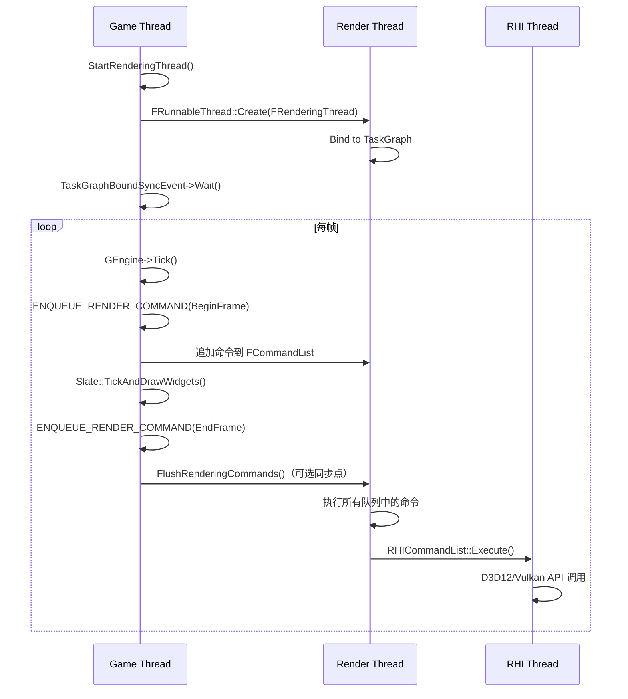

> [← 返回 UE全解析主索引]([[00-UE全解析主索引|UE全解析主索引]])

# UE-专题：多线程与任务系统

## Why：为什么要分析多线程与任务系统？

现代游戏引擎是**天然的多线程程序**。从物理模拟、动画评估、音频混音到渲染提交，几乎所有子系统都可以从并行化中获益。然而，多线程编程也是错误的高发区：数据竞争、死锁、伪共享、负载不均衡……

UE 经过二十余年的演进，形成了一套**分层、混合、渐进式**的多线程架构：
- **LowLevelTasks**：UE5 引入的 work-stealing 任务调度器。
- **TaskGraph**：依赖图驱动的任务系统，支持跨线程依赖和命名线程亲和性。
- **FQueuedThreadPool**：传统的线程池，适合长时间运行的阻塞任务。
- **Render Thread / RHI Thread**：与 Game Thread 并行的高层渲染管线。

理解这套架构的演进逻辑和设计权衡，对自研引擎的并发框架设计具有直接参考价值。

---

## What：UE 多线程架构的全貌

### 1. 线程层级地图

UE 的线程可以按职责分为三个层级：

```
┌─────────────────────────────────────────────────────────────┐
│  Named Threads（命名线程）—— 职责明确、线程亲和               │
│  ├── Game Thread (GT)        ← 主逻辑、UObject 操作           │
│  ├── Render Thread (RT)      ← 渲染命令执行                   │
│  └── RHI Thread              ← GPU API 调用（D3D12/Vulkan）   │
├─────────────────────────────────────────────────────────────┤
│  Worker Threads（工作线程）—— 由调度器动态分配                  │
│  ├── Foreground Workers      ← 高优先级任务（物理、动画）      │
│  ├── Background Workers      ← 低优先级任务（流送、压缩）      │
│  └── Standby Workers         ← 超线程/超订阅备用              │
├─────────────────────────────────────────────────────────────┤
│  Dedicated Threads（专用线程）—— 特定子系统                   │
│  ├── Audio Thread            ← 音频混音                       │
│  ├── Async Loading Thread    ← 异步资源加载                   │
│  ├── Network Thread          ← 网络 I/O                     │
│  └── TaskGraph Threads       ← 旧版 TaskGraph 专用线程        │
└─────────────────────────────────────────────────────────────┘
```

### 2. 任务系统的三代演进

| 代际 | 系统 | 核心抽象 | 适用场景 |
|------|------|---------|---------|
| 第一代 | `FQueuedThreadPool` + `FAsyncTask` | 线程池 + 队列 | 长时间运行的阻塞任务（如文件 I/O） |
| 第二代 | `FTaskGraphInterface` + `TGraphTask` | 依赖图 + 命名线程 | 细粒度并行、跨任务依赖、帧内同步 |
| 第三代 | `LowLevelTasks::FScheduler` + `UE::Tasks::TTask` | work-stealing + 无锁队列 | 极高频小任务、动态负载均衡 |

**关键事实**：UE5 中三代系统**共存**。LowLevelTasks 是底层，TaskGraph 构建于其上，FQueuedThreadPool 用于特定场景。

---

## How：逐层拆解多线程架构

### 第 1 层：接口层 —— 模块边界与对外能力

#### 1.1 LowLevelTasks：UE5 的任务调度基石

`LowLevelTasks::FScheduler` 是 UE5 引入的底层任务调度器，采用 **work-stealing** 算法：

```cpp
// Core/Public/Async/Fundamental/Scheduler.h，第 102~150 行
class FScheduler final : public FSchedulerTls
{
    static CORE_API FScheduler Singleton;

public:
    inline static FScheduler& Get();

    // 启动工作线程（0 表示使用系统默认）
    CORE_API void StartWorkers(uint32 NumForegroundWorkers = 0, 
                               uint32 NumBackgroundWorkers = 0, ...);

    // 尝试将任务投入调度
    inline bool TryLaunch(FTask& Task, EQueuePreference QueuePreference = EQueuePreference::DefaultPreference, 
                          bool bWakeUpWorker = true);

    // 当前是否有备用线程可唤醒
    CORE_API bool IsOversubscriptionLimitReached(ETaskPriority TaskPriority) const;
};
```

**设计要点**：
- 每个 Worker 拥有**本地队列**（Local Queue），新任务优先入队到本地。
- 当本地队列为空时，Worker 会**窃取**（steal）其他 Worker 队列的尾部任务。
- 支持 **Oversubscription**（超订阅）：当所有 Worker 都阻塞等待时，自动唤醒备用线程。

> 文件：`Engine/Source/Runtime/Core/Public/Async/Fundamental/Scheduler.h`

#### 1.2 TaskGraph：依赖驱动的任务图

TaskGraph 是 UE 最广泛使用的任务系统，核心接口是 `FTaskGraphInterface`：

```cpp
// Core/Public/Async/TaskGraphInterfaces.h，第 54~108 行
namespace ENamedThreads
{
    enum Type : int32
    {
        RHIThread,              // RHI 专用线程
        GameThread,             // 游戏主线程
        ActualRenderingThread,  // 实际渲染线程
        AnyThread = 0xff,       // 任意工作线程

        // 优先级编码（高位比特）
        MainQueue = 0x000,      // 主队列
        LocalQueue = 0x100,     // 本地队列
        NormalTaskPriority = 0x000,
        HighTaskPriority = 0x200,
        NormalThreadPriority = 0x000,
        HighThreadPriority = 0x400,
        BackgroundThreadPriority = 0x800,
    };
}
```

**命名线程编码设计**：UE 将线程索引、队列索引、任务优先级、线程优先级全部编码到一个 `int32` 中：
- 低 8 位：线程索引（`ThreadIndexMask = 0xff`）
- 第 8 位：队列索引（`QueueIndexMask = 0x100`）
- 第 9 位：任务优先级（`TaskPriorityMask = 0x200`）
- 第 10~11 位：线程优先级（`ThreadPriorityMask = 0xC00`）

这种紧凑编码使得任务调度决策可以在单个整数比较中完成。

> 文件：`Engine/Source/Runtime/Core/Public/Async/TaskGraphInterfaces.h`，第 54~208 行

#### 1.3 FQueuedThreadPool：传统线程池

对于长时间运行或可能阻塞的任务（如文件 I/O、网络请求），UE 使用传统的线程池：

```cpp
// Core/Public/Misc/QueuedThreadPool.h，第 104~150 行
class FQueuedThreadPool
{
    virtual void AddQueuedWork(IQueuedWork* InQueuedWork, 
                               EQueuedWorkPriority InPriority = EQueuedWorkPriority::Normal) = 0;
    virtual bool RetractQueuedWork(IQueuedWork* InQueuedWork) = 0;
    virtual void WaitForCompletion() = 0;
};
```

`FAsyncTask<T>` 是对线程池的 C++ 封装：

```cpp
// Core/Public/Async/AsyncWork.h，第 206~354 行
class FAsyncTaskBase : private UE::FInheritedContextBase, private IQueuedWork
{
    FThreadSafeCounter WorkNotFinishedCounter;
    FEvent* DoneEvent = nullptr;
    FQueuedThreadPool* QueuedPool = nullptr;

    void Start(bool bForceSynchronous, FQueuedThreadPool* InQueuedPool, ...)
    {
        if (QueuedPool)
        {
            QueuedPool->AddQueuedWork(this, InQueuedWorkPriority);
        }
        else 
        {
            DoWork();  // 同步执行
        }
    }
};
```

#### 1.4 渲染命令队列：`ENQUEUE_RENDER_COMMAND`

Game Thread 与 Render Thread 的核心交互机制是**命令队列**：

```cpp
// RenderCore/Public/RenderingThread.h，第 1167~1169 行
#define ENQUEUE_RENDER_COMMAND(Type) \
    DECLARE_RENDER_COMMAND_TAG(PREPROCESSOR_JOIN(FRenderCommandTag_, PREPROCESSOR_JOIN(Type, __LINE__)), Type) \
    FRenderCommandDispatcher::Enqueue<PREPROCESSOR_JOIN(FRenderCommandTag_, PREPROCESSOR_JOIN(Type, __LINE__))>
```

使用方式：

```cpp
ENQUEUE_RENDER_COMMAND(MyRenderCommand)([](FRHICommandListImmediate& RHICmdList)
{
    // 此 Lambda 将在 Render Thread 上执行
    RHICmdList.DrawPrimitive(...);
});
```

> 文件：`Engine/Source/Runtime/RenderCore/Public/RenderingThread.h`，第 1167~1169 行

---

### 第 2 层：数据层 —— 核心对象与状态流转

#### 2.1 LowLevelTasks 的内存布局

```cpp
// Core/Public/Async/Fundamental/Task.h（概念性结构）
struct FTask
{
    // 状态机：Created → Scheduled → Executing → Completed
    std::atomic<EState> State;
    
    // 前置任务计数（减到 0 时才可调度）
    std::atomic<int32> PrerequisitesCount;
    
    // 后置任务列表（本任务完成后需要唤醒的任务）
    TArray<FTask*> Subsequents;
    
    // 任务体（通常内嵌在 FTask 后面的内存中）
    TFunction<void()> Body;
};
```

**内存分配策略**：
- 小任务（< 256 字节）使用 **Concurrent Linear Allocator**，无锁分配。
- 大任务回退到 **FMalloc** 堆分配。
- 任务对象通常与任务体**内联存储**，减少缓存未命中。

#### 2.2 TaskGraph 的 FBaseGraphTask 继承体系

```
FTaskBase (LowLevelTasks 底层)
└── FBaseGraphTask (TaskGraph 兼容层)
    ├── TGraphTask<TTask> (具体任务模板)
    └── FGraphEventImpl (事件/信号量)
```

```cpp
// Core/Public/Async/TaskGraphInterfaces.h，第 470~593 行
class FBaseGraphTask : public UE::Tasks::Private::FTaskBase
{
    // 前置依赖（prerequisites）
    void AddPrerequisites(const FGraphEventArray& Prerequisites);
    
    // 后置信号（subsequents）
    void DontCompleteUntil(FGraphEventRef NestedTask);
    
    // 获取完成事件（可作为其他任务的前置依赖）
    FGraphEventRef GetCompletionEvent();
    
    // 触发执行（当 prerequisites 全部完成时）
    void Unlock(ENamedThreads::Type CurrentThreadIfKnown = ENamedThreads::AnyThread);
};
```

**依赖链示例**：

```cpp
// 创建两个任务
FGraphEventRef TaskA = TGraphTask<FTaskA>::CreateTask(nullptr).ConstructAndDispatchWhenReady();
FGraphEventRef TaskB = TGraphTask<FTaskB>::CreateTask(nullptr).ConstructAndDispatchWhenReady();

// TaskC 依赖于 TaskA 和 TaskB
FGraphEventRef Prerequisites[] = { TaskA, TaskB };
FGraphEventRef TaskC = TGraphTask<FTaskC>::CreateTask(Prerequisites).ConstructAndDispatchWhenReady();
```

#### 2.3 渲染命令队列的数据结构

```cpp
// RenderCore/Public/RenderingThread.h，第 324~441 行
class FCommandList
{
    struct FCommand
    {
        FCommand* Next = nullptr;  // 单向链表
        ECommandType Type;
    };
    
    struct FExecuteFunctionCommand : public FCommand
    {
        const FRenderCommandTag& Tag;
        FRenderCommandFunctionVariant Function;  // Lambda/函数对象
    };
    
    struct FExecuteCommandListCommand : public FCommand
    {
        FCommandList* CommandList;  // 嵌套命令列表
    };
    
    FCommand* Commands;  // 链表头
    FMemStackBase& Allocator;  // 使用 MemStack 分配器
};
```

**关键设计**：
- 命令列表使用 **单向链表** 而非数组，追加命令是 O(1)。
- 分配器使用 **FMemStack**（栈式线性分配器），渲染帧结束后一次性释放。
- 支持 **Render Command Pipe**（UE5）：将命令分批记录到不同管道，最后同步到 Render Thread。

#### 2.4 线程局部存储（TLS）

UE 大量使用 TLS 来避免全局锁：

```cpp
// LowLevelTasks 的 TLS
namespace LowLevelTasks
{
    class FSchedulerTls
    {
        struct FTlsValues
        {
            FSchedulerTls* ActiveScheduler = nullptr;
            FLocalQueueType* LocalQueue = nullptr;
            EWorkerType WorkerType = EWorkerType::None;
        };
        static thread_local FTlsValuesHolder TlsValuesHolder;
    };
}
```

每个 Worker 线程通过 TLS 快速访问自己的本地队列，无需竞争全局锁。

---

### 第 3 层：逻辑层 —— 关键算法与执行流程

#### 3.1 渲染线程的启动与 Game Thread 的交互



> 文件：`Engine/Source/Runtime/RenderCore/Private/RenderingThread.cpp`，第 562~655 行

**渲染线程启动代码**：

```cpp
static void StartRenderingThread()
{
    check(IsInGameThread());
    
    // 1. 根据配置选择 RHI Thread 模式
    switch (GRHISupportsRHIThread ? FRHIThread::TargetMode : ERHIThreadMode::None)
    {
        case ERHIThreadMode::DedicatedThread:
            GRHIThread = new FRHIThread();  // 启动专用 RHI 线程
            break;
        case ERHIThreadMode::Tasks:
            // 使用 TaskGraph 调度 RHI 任务
            break;
    }
    
    // 2. 创建 Render Thread
    GIsThreadedRendering = true;
    GRenderingThreadRunnable = new FRenderingThread();
    GRenderingThread = FRunnableThread::Create(
        GRenderingThreadRunnable, TEXT("RenderThread"), ...);
    
    // 3. 等待 Render Thread 完成 TaskGraph 绑定
    ((FRenderingThread*)GRenderingThreadRunnable)->TaskGraphBoundSyncEvent->Wait();
    
    // 4. 发送测试命令确认线程已启动
    FRenderCommandFence Fence;
    Fence.BeginFence();
    Fence.Wait();
}
```

#### 3.2 `ParallelFor` 的调度策略

`ParallelFor` 是 UE 最常用的数据并行原语：

```cpp
// Core/Public/Async/ParallelFor.h，第 115~165 行
template<typename BodyType, typename PreWorkType, typename ContextType>
inline void ParallelForInternal(const TCHAR* DebugName, int32 Num, int32 MinBatchSize, 
    BodyType Body, PreWorkType CurrentThreadWorkToDoBeforeHelping, 
    EParallelForFlags Flags, const TArrayView<ContextType>& Contexts)
{
    int32 NumWorkers = GetNumberOfThreadTasks(Num, MinBatchSize, Flags);
    
    if (NumWorkers <= 1)
    {
        // 单线程回退
        for(int32 Index = 0; Index < Num; Index++)
            Body(Index);
        return;
    }
    
    // 将工作分割为 Batch
    int32 BatchSize = Num / NumWorkers;
    for (int32 WorkerIndex = 0; WorkerIndex < NumWorkers; WorkerIndex++)
    {
        int32 StartIndex = WorkerIndex * BatchSize;
        int32 EndIndex = (WorkerIndex == NumWorkers - 1) ? Num : StartIndex + BatchSize;
        
        // 每个 Batch 作为一个 TaskGraph 任务调度
        TGraphTask<FParallelForTask>::CreateTask(...)
            .ConstructAndDispatchWhenReady(StartIndex, EndIndex, Body);
    }
}
```

**调度策略**：
- 默认使用 **静态分割**（Num / NumWorkers），适合负载均匀的场景。
- `EParallelForFlags::Unbalanced` 使用 **动态分割**（任务队列），适合负载差异大的场景。
- 当前线程会先执行 `PreWork`，然后"帮助"其他 Worker 执行任务（work-sharing）。

#### 3.3 `FlushRenderingCommands` 的同步机制

当 Game Thread 需要确保 Render Thread 完成所有已提交命令时（如读取 GPU 计算结果、销毁渲染资源），调用 `FlushRenderingCommands()`：

```cpp
void FlushRenderingCommands()
{
    // 1. 向 Render Thread 发送一个"信号任务"
    FRenderCommandFence Fence;
    Fence.BeginFence();  // ENQUEUE_RENDER_COMMAND 一个设置事件的任务
    
    // 2. 在 Game Thread 上等待该事件
    Fence.Wait();
    
    // 3. 同时，Game Thread 会帮助执行 Render Thread 的本地队列任务
    //    （避免 Game Thread 空转）
    FTaskGraphInterface::Get().ProcessThreadUntilIdle(ENamedThreads::GameThread);
}
```

**关键设计**：Flush 时 Game Thread 不会纯阻塞等待，而是**主动参与** Render Thread 的任务处理。这提高了 CPU 利用率，但要求 Render Thread 的任务不能依赖 Game Thread 的后续操作（否则死锁）。

---

## 与上下层的关系

### 上层调用者

- **Gameplay 代码**：通过 `AsyncTask`、`Async`、`ParallelFor` 将逻辑并行化。
- **渲染系统**：通过 `ENQUEUE_RENDER_COMMAND` 向 Render Thread 发送命令。
- **资产流送**：通过 `FQueuedThreadPool` 在后台线程加载资源。
- **物理/动画**：通过 `TaskGraph` 并行评估大量 Actor。

### 下层依赖

- **OS 线程 API**：`FRunnableThread` 封装了 Windows/Linux/macOS 的线程创建。
- **CPU 亲和性**：`FPlatformAffinity` 控制线程绑定到特定 CPU 核心。
- **原子操作/内存屏障**：`std::atomic`、`FPlatformMisc::MemoryBarrier()`。
- **TLS**：`thread_local` 存储每个线程的调度器状态。

---

## 设计亮点与可迁移经验

### 1. 三代任务系统的共存策略

UE5 没有简单粗暴地替换旧系统，而是让 LowLevelTasks 成为新底层，TaskGraph 作为兼容层：
- **LowLevelTasks** 负责调度执行（work-stealing、无锁队列）。
- **TaskGraph** 保留 API 语义（命名线程、依赖图、完成事件）。
- **FQueuedThreadPool** 保留给不适合 work-stealing 的阻塞任务。

> **可迁移经验**：并发框架的升级应采用"底层替换 + 上层兼容"策略，避免一次性重写所有调用代码。新系统应先证明性能优势，再逐步迁移上层 API。

### 2. 命名线程与线程亲和性

UE 的 `ENamedThreads` 设计强制区分了"什么代码应该在什么线程上运行"：
- `GameThread`：UObject 创建/销毁、蓝图 VM、Tick。
- `RenderThread`：RHI 命令列表构建、渲染资源操作。
- `AnyThread`：纯计算任务（如物理、动画评估）。

这种显式亲和性声明在编译期无法检查，但运行时可通过 `check(IsInGameThread())` 断言发现违规。

> **可迁移经验**：引擎应定义明确的"线程契约"，并通过断言强制执行。这比文档更有效，因为违规会立即崩溃。

### 3. Render Command 队列的不可变设计

`ENQUEUE_RENDER_COMMAND` 的核心安全保证是：
- Lambda 捕获的数据在 Game Thread 侧是**只读**或**已同步**的。
- Render Thread 执行 Lambda 时不会回调 Game Thread。
- 命令队列是**追加-only**，Render Thread 不会修改已入队的命令。

这种设计消除了 Game Thread 和 Render Thread 之间的数据竞争，代价是偶尔需要 `FlushRenderingCommands()` 进行显式同步。

> **可迁移经验**：跨线程通信应优先使用**消息传递**（命令队列）而非**共享状态**。消息传递更容易推理，且天然避免数据竞争。

### 4. ParallelFor 的自动批量化

`ParallelFor` 自动将迭代分割为 Batch，并根据 `MinBatchSize` 避免过度拆分：
- 如果 `Num = 1000`，`MinBatchSize = 32`，则最多产生 32 个任务。
- 每个 Worker 处理一个连续的范围，提升缓存局部性。

> **可迁移经验**：数据并行 API 应提供**最小批大小**参数，避免任务拆分过细导致的调度开销超过并行收益。

### 5. Oversubscription 与备用线程

LowLevelTasks 的 `FScheduler` 支持 **Oversubscription**：当所有 Worker 都因等待锁/事件而阻塞时，自动唤醒备用线程继续处理全局队列中的任务。这防止了"所有线程阻塞 → 系统死锁"的级联故障。

> **可迁移经验**：work-stealing 调度器应实现超订阅机制，以应对任务中不可预期的阻塞操作（如锁竞争、内存分配）。

---

## 关键源码片段

### LowLevelTasks 调度器启动

> 文件：`Engine/Source/Runtime/Core/Public/Async/Fundamental/Scheduler.h`，第 102~150 行

```cpp
class FScheduler final : public FSchedulerTls
{
    static CORE_API FScheduler Singleton;

public:
    inline static FScheduler& Get();

    // 启动前景和背景工作线程
    CORE_API void StartWorkers(uint32 NumForegroundWorkers = 0, 
                               uint32 NumBackgroundWorkers = 0, ...);

    // 尝试将任务投入调度
    inline bool TryLaunch(FTask& Task, EQueuePreference QueuePreference = EQueuePreference::DefaultPreference);

    // 获取 Worker 数量
    inline uint32 GetNumWorkers() const;
};
```

### TaskGraph 的命名线程编码

> 文件：`Engine/Source/Runtime/Core/Public/Async/TaskGraphInterfaces.h`，第 54~108 行

```cpp
namespace ENamedThreads
{
    enum Type : int32
    {
        RHIThread,
        GameThread,
        ActualRenderingThread,
        AnyThread = 0xff,

        // 优先级编码
        MainQueue = 0x000,
        LocalQueue = 0x100,
        NormalTaskPriority = 0x000,
        HighTaskPriority = 0x200,
        NormalThreadPriority = 0x000,
        HighThreadPriority = 0x400,
        BackgroundThreadPriority = 0x800,
    };
}
```

### ENQUEUE_RENDER_COMMAND 宏

> 文件：`Engine/Source/Runtime/RenderCore/Public/RenderingThread.h`，第 1167~1169 行

```cpp
#define ENQUEUE_RENDER_COMMAND(Type) \
    DECLARE_RENDER_COMMAND_TAG(PREPROCESSOR_JOIN(FRenderCommandTag_, PREPROCESSOR_JOIN(Type, __LINE__)), Type) \
    FRenderCommandDispatcher::Enqueue<PREPROCESSOR_JOIN(FRenderCommandTag_, PREPROCESSOR_JOIN(Type, __LINE__))>
```

### 渲染线程启动

> 文件：`Engine/Source/Runtime/RenderCore/Private/RenderingThread.cpp`，第 562~627 行

```cpp
static void StartRenderingThread()
{
    check(IsInGameThread());
    
    // 释放当前线程对 D3D/Vulkan Context 的所有权
    GDynamicRHI->RHIReleaseThreadOwnership();
    
    // 启动 RHI Thread（如果配置支持）
    if (GRHISupportsRHIThread && FRHIThread::TargetMode == ERHIThreadMode::DedicatedThread)
    {
        GRHIThread = new FRHIThread();
    }
    
    // 创建并启动 Render Thread
    GIsThreadedRendering = true;
    GRenderingThreadRunnable = new FRenderingThread();
    GRenderingThread = FRunnableThread::Create(
        GRenderingThreadRunnable, TEXT("RenderThread"), 0, 
        FPlatformAffinity::GetRenderingThreadPriority(),
        FPlatformAffinity::GetRenderingThreadMask());
    
    // 等待 Render Thread 完成 TaskGraph 绑定
    ((FRenderingThread*)GRenderingThreadRunnable)->TaskGraphBoundSyncEvent->Wait();
}
```

### ParallelFor 内部调度

> 文件：`Engine/Source/Runtime/Core/Public/Async/ParallelFor.h`，第 84~102 行

```cpp
inline int32 GetNumberOfThreadTasks(int32 Num, int32 MinBatchSize, EParallelForFlags Flags)
{
    int32 NumThreadTasks = 0;
    const bool bIsMultithread = FApp::ShouldUseThreadingForPerformance();
    if (Num > 1 && (Flags & EParallelForFlags::ForceSingleThread) == EParallelForFlags::None && bIsMultithread)
    {
        NumThreadTasks = FMath::Min(int32(LowLevelTasks::FScheduler::Get().GetNumWorkers()), 
                                    (Num + (MinBatchSize/2))/MinBatchSize);
    }
    
    if (!LowLevelTasks::FScheduler::Get().IsWorkerThread())
    {
        NumThreadTasks++;  // 命名线程也会参与工作
    }
    
    return FMath::Min(NumThreadTasks, FPlatformMisc::NumberOfCoresIncludingHyperthreads());
}
```

---

## 关联阅读

- [[UE-Core-源码解析：线程、任务与同步原语]] —— Core 模块的底层线程与锁机制
- [[UE-Core-源码解析：内存分配器家族]] —— Task 使用的 Concurrent Linear Allocator
- [[UE-Core-源码解析：智能指针与引用]] —— TRefCountPtr、FGraphEventRef 的引用计数
- [[UE-RenderCore-源码解析：渲染图与渲染线程]] —— RenderGraph 与 Render Thread 的交互
- [[UE-专题：渲染一帧的生命周期]] —— Game Thread → Render Thread → RHI Thread 的完整数据流
- [[UE-专题：引擎整体骨架与系统组合]] —— 各子系统与线程模型的关系
- [[UE-Engine-源码解析：Tick 调度与分阶段更新]] —— Tick 分组与多线程 Tick
- [[UE-Engine-源码解析：World 与 Level 架构]] —— UWorld 的线程安全设计

---

## 索引状态

- **所属阶段**：第八阶段 —— 跨领域专题深度解析
- **对应笔记**：`UE-专题：多线程与任务系统`
- **本轮完成度**：✅ 第三轮（骨架扫描 + 数据结构/行为分析 + 关联辐射）
- **更新日期**：2026-04-19
