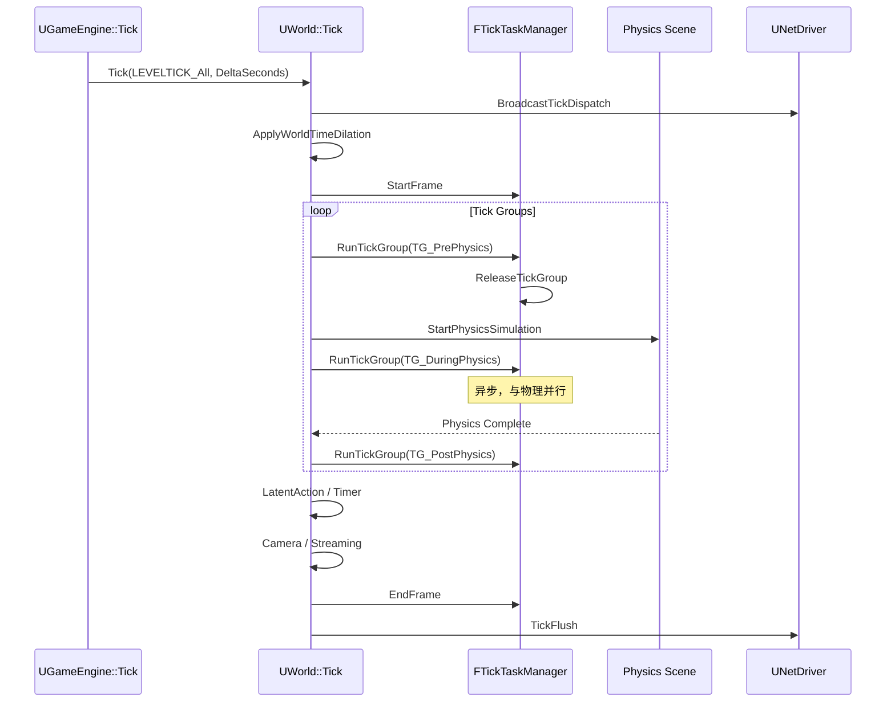
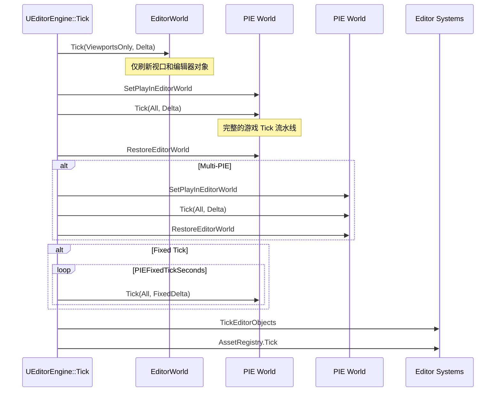

> [← 返回 UE全解析主索引]([[00-UE全解析主索引\|UE全解析主索引]])

# UE-专题：引擎 Tick 结构与编辑器差异

## Why：为什么要理解 Tick 结构与编辑器差异？

- **Tick 是游戏引擎的"心跳"**。每一帧的更新、渲染、物理、音频、网络都依赖 Tick 的精确调度。不理解 Tick Group 的顺序、并行策略和编辑器特殊处理，就无法解释"为什么这个 Component 在物理碰撞前还是后执行""为什么 PIE 里的帧率与 Standalone 不同"。
- **编辑器不是"带 UI 的游戏"**。UE 编辑器同时管理 Editor World 和多个 PIE World，每帧需要世界切换、固定步长模拟、视口刷新。这些差异导致编辑器 Tick 是运行时 Tick 的**超集**，而非简单替代。
- **调试编辑器特有的 Bug 需要理解 Tick 差异**。PIE 中的时间膨胀、固定步长、多世界竞争条件是常见的编辑器独有 Bug 来源。

---

## What：引擎 Tick 结构与编辑器差异是什么？

UE 的 Tick 体系分为**运行时**和**编辑器**两条主线：

| 场景 | 入口 | Tick 类型 | World 数量 | 特殊机制 |
|------|------|-----------|-----------|---------|
| **Standalone/Game** | `UGameEngine::Tick` | `LEVELTICK_All` | 1 个 | 标准流水线 |
| **Editor（无 PIE）** | `UEditorEngine::Tick` | `LEVELTICK_ViewportsOnly` / `TimeOnly` | 1 个 (EditorWorld) | 编辑器对象 Tick、视口刷新 |
| **Editor + PIE** | `UEditorEngine::Tick` | Editor 轻量 + PIE `All` | 多个 | 世界切换、Fixed Tick、多 PIE |

核心涉及模块：

| 模块 | 核心文件 | 职责 |
|------|---------|------|
| `Engine` | `EngineBaseTypes.h` | `ELevelTick`、`ETickingGroup` 枚举定义 |
| `Engine` | `LevelTick.cpp` | `UWorld::Tick` 实现 |
| `Engine` | `TickTaskManager.cpp` | `FTickTaskManager` 调度器 |
| `Editor/UnrealEd` | `EditorEngine.cpp` | `UEditorEngine::Tick`、PIE 管理 |

---

## 接口梳理（第 1 层）

### ELevelTick：Tick 的粒度控制

> 文件：`Engine/Source/Runtime/Engine/Classes/Engine/EngineBaseTypes.h`，第 68~79 行

```cpp
enum ELevelTick
{
    LEVELTICK_TimeOnly      = 0,  // 仅更新时间
    LEVELTICK_ViewportsOnly = 1,  // 更新时间与视口
    LEVELTICK_All           = 2,  // 全部更新（Actor、Component 等）
    LEVELTICK_PauseTick     = 3,  // 暂停帧（DeltaTime 为 0，Component 不 Tick）
};
```

`ELevelTick` 决定了 `UWorld::Tick` 的更新范围。运行时始终使用 `LEVELTICK_All`，编辑器则根据场景灵活切换。

### ETickingGroup：并行与串行调度

> 文件：`Engine/Source/Runtime/Engine/Classes/Engine/EngineBaseTypes.h`，第 82~110 行

```cpp
UENUM(BlueprintType)
enum ETickingGroup : int
{
    TG_PrePhysics       UMETA(DisplayName="Pre Physics"),
    TG_StartPhysics     UMETA(Hidden, DisplayName="Start Physics"),
    TG_DuringPhysics    UMETA(DisplayName="During Physics"),
    TG_EndPhysics       UMETA(Hidden, DisplayName="End Physics"),
    TG_PostPhysics      UMETA(DisplayName="Post Physics"),
    TG_PostUpdateWork   UMETA(DisplayName="Post Update Work"),
    TG_LastDemotable    UMETA(Hidden, DisplayName = "Last Demotable"),
    TG_NewlySpawned     UMETA(Hidden, DisplayName="Newly Spawned"),
    TG_MAX,
};
```

### FTickFunction：所有可 Tick 对象的基类

> 文件：`Engine/Source/Runtime/Engine/Classes/Engine/EngineBaseTypes.h`，第 171~200 行

```cpp
USTRUCT()
struct FTickFunction
{
    GENERATED_USTRUCT_BODY()
public:
    UPROPERTY(EditDefaultsOnly, Category="Tick", AdvancedDisplay)
    TEnumAsByte<enum ETickingGroup> TickGroup;

    UPROPERTY(EditDefaultsOnly, Category="Tick", AdvancedDisplay)
    TEnumAsByte<enum ETickingGroup> EndTickGroup;

    UPROPERTY(EditDefaultsOnly, Category="Tick", AdvancedDisplay)
    uint8 bTickEvenWhenPaused:1;

    UPROPERTY(EditDefaultsOnly, Category="Tick", AdvancedDisplay)
    uint8 bCanEverTick:1;

    UPROPERTY(EditDefaultsOnly, Category="Tick", AdvancedDisplay)
    uint8 bStartWithTickEnabled:1;

    void SetTickFunctionEnable(bool bInEnabled);
    void AddPrerequisite(UObject* TargetObject, struct FTickFunction& TargetTickFunction);
};
```

`FTickFunction` 是 `UActorComponent::PrimaryComponentTick`、`AActor::PrimaryActorTick` 的基类，支持 Tick Group 配置、前置条件（Prerequisite）和暂停行为控制。

### UWorld::Tick：运行时核心入口

> 文件：`Engine/Source/Runtime/Engine/Private/LevelTick.cpp`

```cpp
void UWorld::Tick(ELevelTick TickType, float DeltaSeconds)
{
    // 1. 网络预更新
    BroadcastTickDispatch(DeltaSeconds);
    PostTickDispatch();

    // 2. 时间系统
    ApplyWorldTimeDilation(DeltaSeconds);

    // 3. FTickTaskManager 帧开始
    TickTaskManager.StartFrame(...);

    // 4. Tick Group 串行执行
    RunTickGroup(TG_PrePhysics);
    RunTickGroup(TG_StartPhysics);
    RunTickGroup(TG_DuringPhysics);   // 异步，不阻塞
    RunTickGroup(TG_EndPhysics);
    RunTickGroup(TG_PostPhysics);

    // 5. 延迟动作与全局对象
    LatentActionManager.ProcessLatentActions(...);
    TimerManager.Tick(DeltaSeconds);
    FTickableGameObject::TickObjects(...);

    // 6. Camera / Streaming
    PlayerController->UpdateCameraManager(DeltaSeconds);
    InternalUpdateStreamingState();

    // 7. 收尾 Tick Group
    RunTickGroup(TG_PostUpdateWork);
    RunTickGroup(TG_LastDemotable);

    // 8. FTickTaskManager 帧结束
    TickTaskManager.EndFrame();

    // 9. 网络发送刷新
    TickFlush();
}
```

> 更详细的 Tick 调度分析见：[[UE-Engine-源码解析：Tick 调度与分阶段更新]]

### UEditorEngine::Tick：编辑器入口

> 文件：`Engine/Source/Editor/UnrealEd/Private/EditorEngine.cpp`

```cpp
void UEditorEngine::Tick(float DeltaSeconds, bool bIdleMode)
{
    // 1. 先 Tick Editor World（轻量）
    if (EditorWorld)
    {
        EditorWorld->Tick(
            bIsRealtime ? LEVELTICK_ViewportsOnly : LEVELTICK_TimeOnly,
            DeltaSeconds
        );
    }

    // 2. Tick PIE World(s)（全量）
    for (FWorldContext& WorldContext : WorldList)
    {
        if (WorldContext.WorldType == EWorldType::PIE)
        {
            UWorld* PlayWorld = WorldContext.World();
            SetPlayInEditorWorld(PlayWorld);   // 切换 GWorld

            // 支持 Fixed Tick：一帧内多次 Tick PIE
            if (PIEFixedTickSeconds > 0)
            {
                float RemainingTime = DeltaSeconds;
                while (RemainingTime > 0)
                {
                    PlayWorld->Tick(LEVELTICK_All, PIEFixedTickSeconds);
                    RemainingTime -= PIEFixedTickSeconds;
                }
            }
            else
            {
                PlayWorld->Tick(LEVELTICK_All, DeltaSeconds);
            }

            GameViewport->Tick(DeltaSeconds);
            RestoreEditorWorld();              // 恢复 GWorld
        }
    }

    // 3. 编辑器专属系统
    TickEditorObjects(DeltaSeconds);
    AssetRegistry.Tick();
    DirectoryWatcher.Tick();
}
```

> 更详细的 PIE 分析见：[[UE-UnrealEd-源码解析：PIE 模式与世界隔离]]

---

## 数据结构（第 2 层）

### FTickTaskManager 的帧状态

`FTickTaskManager` 是 Tick 调度的核心调度器，每帧维护以下状态：

```
FTickTaskManager
  ├── FTickTaskLevel[] Levels          // 按世界分层的 Tick 任务
  │     └── FTickFunction[] AllEnabledTickFunctions
  ├── FTickTaskSequencer Sequencer     // 负责 Tick Group 的依赖排序和释放
  └── FTickContext Context             // 当前帧的 DeltaTime、World 等上下文
```

### FWorldContext 的多世界管理

> 文件：`Engine/Source/Runtime/Engine/Classes/Engine/Engine.h`

```cpp
USTRUCT()
struct FWorldContext
{
    GENERATED_BODY()
    UPROPERTY()
    TEnumAsByte<EWorldType::Type> WorldType;      // Editor / PIE / Game / Preview
    UPROPERTY()
    TObjectPtr<UWorld> ThisCurrentWorld;
    UPROPERTY()
    TObjectPtr<UGameInstance> OwningGameInstance;
    UPROPERTY()
    FName ContextHandle;                            // "Game_0", "Editor"
};
```

`UEditorEngine::WorldList` 是 `TArray<FWorldContext>`，运行时则通常只有一个 `FWorldContext`。

### 运行时 vs 编辑器的 Tick 差异对照

| 差异维度 | 运行时 (Game/Standalone) | 编辑器 (Editor + PIE) |
|---------|--------------------------|----------------------|
| **World 数量** | 1 个 | 1 个 EditorWorld + N 个 PIE World |
| **Tick 类型** | 统一 `LEVELTICK_All` | Editor 用 `ViewportsOnly`/`TimeOnly`，PIE 用 `All` |
| **Tick Group** | 标准 8 个 Group | 相同，但每帧执行多次（每个 PIE World 一次） |
| **固定步长** | 一般无 | `PIEFixedTickSeconds` 支持一帧多 Tick |
| **编辑器专属对象** | 无 | `FTickableEditorObject`、`AssetRegistry`、`DirectoryWatcher` |
| **世界上下文切换** | 无 | `SetPlayInEditorWorld` / `RestoreEditorWorld` |
| **视口管理** | 单一 `GameViewport` | 多视口 Realtime 状态、音频焦点、沉浸式视口 |
| **GWorld 切换** | 恒定 | 每 Tick 一个 PIE World 时切换 `GWorld` |

---

## 行为分析（第 3 层）

### 运行时单帧 Tick 调度流程



### 编辑器 PIE 多世界 Tick 流程



### TG_NewlySpawned 的回滚执行机制

`RunTickGroup` 在阻塞模式下会循环处理 `TG_NewlySpawned`：

> 文件：`Engine/Source/Runtime/Engine/Private/LevelTick.cpp`

```cpp
void UWorld::RunTickGroup(ETickingGroup Group, bool bBlockTillComplete)
{
    TickTaskManager.RunTickGroup(Group, bBlockTillComplete);
    
    if (bBlockTillComplete)
    {
        int32 NewlySpawnedCount = 0;
        while (TickTaskManager.HasNewlySpawnedTasks() && NewlySpawnedCount < 101)
        {
            // 新创建对象的 Tick 函数在当前帧补执行
            TickTaskManager.RunTickGroup(TG_NewlySpawned, true);
            ++NewlySpawnedCount;
        }
    }
}
```

上限 **101 次**防止失控（如 `Tick` 中无限生成新对象导致死循环）。

### PIE 世界的 GWorld 切换

```cpp
void UEditorEngine::SetPlayInEditorWorld(UWorld* InWorld)
{
    GWorld = InWorld;  // 直接修改全局 GWorld 指针
    // 同时切换当前线程的 WorldContext
}

void UEditorEngine::RestoreEditorWorld()
{
    GWorld = EditorWorld;  // 恢复编辑器世界
}
```

`FScopedConditionalWorldSwitcher` 是更安全的 RAII 包装：

```cpp
{
    FScopedConditionalWorldSwitcher WorldSwitcher(this, PlayWorld);
    // 作用域内 GWorld = PlayWorld
    PlayWorld->Tick(...);
} // 作用域结束自动恢复
```

---

## 与上下层的关系

### 上层调用者

| 上层模块 | 使用方式 |
|---------|---------|
| `Gameplay` | `AActor::Tick`、`UActorComponent::Tick` 注册到 `FTickFunction`，由 TickTaskManager 调度 |
| `AI` | `AIController`、`BehaviorTree` 的 Tick 注册在 `TG_PrePhysics` 或 `TG_PostPhysics` |
| `UMG` | `UWidgetComponent` 的 Tick 更新 UI 布局 |
| `Sequencer` | `FMovieSceneSequenceTickManager` 在 `TG_DuringPhysics` 异步评估动画 |
| `Editor` | `FTickableEditorObject` 在编辑器 Tick 中更新非游戏对象（如粒子预览、材质编辑器） |

### 下层依赖

| 下层模块 | 依赖方式 |
|---------|---------|
| `Core` | `FTickFunction` 的基类支持、委托系统 |
| `Core/Tasks` | `FTickTaskManager` 内部使用 TaskGraph 做并行调度 |
| `Chaos/PhysX` | 物理场景在 `TG_StartPhysics` / `TG_EndPhysics` 之间执行模拟 |
| `RenderCore` | `FTickableGameObject` 包含渲染相关对象的 Tick（如 `FScene`） |

---

## 设计亮点与可迁移经验

1. **Tick Group 的物理语义分组**：`TG_PrePhysics` → `TG_StartPhysics` → `TG_DuringPhysics` → `TG_EndPhysics` → `TG_PostPhysics` 的命名直接映射物理模拟的生命周期，让 gameplay 程序员无需理解底层调度细节即可正确放置 Tick 逻辑。

2. **Prerequisite 实现细粒度依赖**：`FTickFunction::AddPrerequisite` 允许任意两个 Tick 函数建立先后关系，而不必强制放入同一 Tick Group。这比"纯 Group 编号"的调度更灵活。

3. **NewlySpawned 回滚保证一致性**：新对象在生成当帧就能执行 Tick，避免了"生成后下一帧才生效"的延迟感。上限 101 次防止死循环是工程稳健性的体现。

4. **编辑器多世界隔离通过 GWorld 切换实现**：UE 没有为编辑器设计复杂的多世界并行架构，而是通过每帧顺序 Tick + GWorld 切换来实现。这种"简单但有效"的方案是自研编辑器值得借鉴的。

5. **Fixed Tick 支持确定性模拟**：`PIEFixedTickSeconds` 让 PIE 可以按固定步长运行，对于需要确定性回放或物理调试的场景至关重要。

6. **编辑器对象与游戏对象 Tick 分离**：`FTickableEditorObject` 独立于 `FTickableGameObject`，保证编辑器专属逻辑不会污染运行时行为，也避免了编辑器代码在 Standalone 中意外执行。

---

## 关联阅读

- [[UE-Engine-源码解析：Tick 调度与分阶段更新]] — Tick 系统的详细三层分析
- [[UE-UnrealEd-源码解析：PIE 模式与世界隔离]] — PIE 世界的创建、Tick 与销毁
- [[UE-UnrealEd-源码解析：编辑器框架总览]] — 编辑器引擎的整体架构
- [[UE-Engine-源码解析：World 与 Level 架构]] — World/Level 与 Tick 的关系
- [[UE-Engine-源码解析：Actor 与 Component 模型]] — Actor/Component 的 Tick 注册机制

---

## 索引状态

- **所属阶段**：第八阶段-跨领域专题
- **对应笔记名称**：UE-专题：引擎 Tick 结构与编辑器差异
- **本轮完成度**：✅ 三层分析完成
- **更新日期**：2026-04-18
