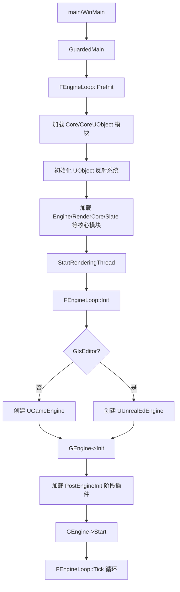
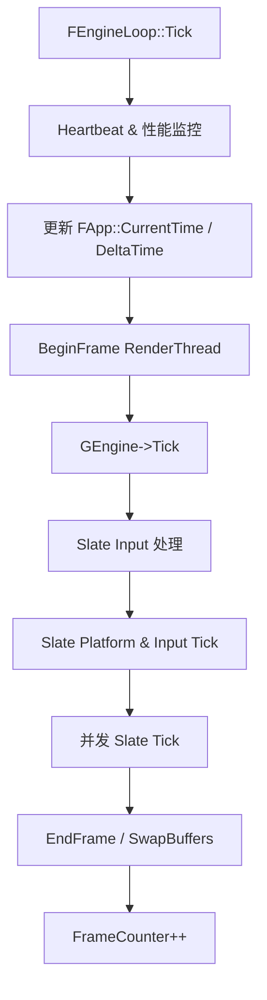

> [[00-UE全解析主索引|← 返回 UE全解析主索引]]

# UE-专题：引擎整体骨架与系统组合

## Why：为什么要梳理整体骨架？

在前七个阶段中，我们已逐模块、逐层地解析了 UE 的构建系统、基础类型、UObject 体系、World/Actor/Component、渲染管线、动画系统、音频系统、UI 框架、编辑器框架等核心模块。然而，**模块级的深度分析容易让人陷入细节，难以建立对引擎全貌的系统性认知**。

本专题的目标是：
- **横向打通** Runtime 与 Editor 的模块边界，建立 UE 的"全景地图"。
- **理解系统组合** —— 各子系统如何通过 UObject、模块依赖、委托、命令队列等手段组合成一个可运行的整体。
- **提取可迁移经验** —— 从 UE 的巨型代码库中提炼出适用于自研引擎的架构设计原则。

---

## What：UE 引擎整体骨架是什么？

### 1. 模块分层地图

UE 的源码按功能垂直划分为四大源码分组，水平方向则从底层到上层形成清晰的依赖链：

```
Engine/Source/
├── Programs/          ← 工具链（UBT、UHT、UAT、UnrealPak、UnrealInsights）
├── ThirdParty/        ← 第三方库（PhysX/Chaos、FreeType、ICU 等）
├── Developer/         ← 开发者中间件（DDC、SourceControl、DerivedDataCache）
├── Editor/            ← 编辑器专属模块（UnrealEd、LevelEditor、ContentBrowser 等）
└── Runtime/           ← 运行时核心模块（所有目标平台共享）
    ├── Core           ← 最底层：类型系统、容器、内存、线程、IO、日志
    ├── CoreUObject    ← UObject 反射体系、GC、Package 加载
    ├── ApplicationCore← 平台抽象：窗口、输入、消息循环
    ├── Projects       ← 插件/项目描述与模块管理
    ├── Engine         ← 核心游戏框架：World、Actor、Component、GameFramework
    ├── RenderCore     ← 渲染基础设施：渲染线程、RHI 命令列表、Shader
    ├── RHI            ← 渲染硬件接口抽象（D3D12/Vulkan/Metal/OpenGL）
    ├── Renderer       ← 高层渲染管线（Deferred Shading、PostProcess）
    ├── SlateCore/Slate← UI 框架与即时模式 GUI
    ├── UMG            ← 蓝图化 UI 系统
    ├── InputCore      ← 输入抽象与事件映射
    ├── EnhancedInput  ← 增强输入系统
    ├── Net/NetCore    ← 网络同步与复制
    ├── PhysicsCore    ← 物理抽象接口
    ├── Chaos          ← Epic 自研物理引擎
    ├── AudioMixer     ← 音频混音核心
    └── ...            ← 动画、地形、植被、AI 等功能模块
```

**核心依赖链（从底向上）**：

| 层级 | 代表模块 | 直接下层依赖 |
|------|---------|------------|
| L0 平台/标准库 | `Core` | 无（仅 ThirdParty） |
| L1 对象体系 | `CoreUObject` | `Core`, `TraceLog` |
| L2 平台抽象 | `ApplicationCore`, `Projects` | `Core` |
| L3 核心框架 | `Engine` | `CoreUObject`, `SlateCore`, `Slate`, `RenderCore`, `RHI`, `NetCore`, `PhysicsCore`, `AudioMixer` 等 |
| L4 功能子系统 | `Renderer`, `UMG`, `EnhancedInput`, `Chaos`, `NavigationSystem`, `AIModule` | `Engine` |
| L5 编辑器 | `UnrealEd`, `LevelEditor`, `ContentBrowser` | `Engine` + 大量 Editor 模块 |

> 文件：`Engine/Source/Runtime/Core/Core.Build.cs`，第 17~60 行
> 文件：`Engine/Source/Runtime/CoreUObject/CoreUObject.Build.cs`，第 26~44 行
> 文件：`Engine/Source/Runtime/Engine/Engine.Build.cs`，第 80~177 行

### 2. 引擎核心对象组合关系

UE 的运行时骨架可以抽象为一套**以 UEngine 为根、UWorld 为上下文、AActor 为实体**的树形组合结构：

```
GEngine (全局单例)
├── UEngineSubsystemCollection
│   ├── UEngineSubsystem_A
│   └── UEngineSubsystem_B
├── WorldList: TArray<FWorldContext>
│   └── FWorldContext (每个世界上下文)
│       ├── UWorld* ThisCurrentWorld
│       ├── UGameInstance* OwningGameInstance
│       ├── UGameViewportClient* GameViewport
│       ├── UNetDriver* ActiveNetDrivers
│       ├── ULevel* PersistentLevel
│       └── ULevelStreaming* StreamedLevels
│           └── ULevel (子关卡)
│               └── AActor[] (关卡中的 Actor)
│                   └── UActorComponent[] (Actor 的组件)
│                       └── USceneComponent (可变换的组件)
│                           └── UPrimitiveComponent (可渲染/可碰撞的组件)
├── FAudioDeviceManager (全局音频管理)
└── FViewport / FSceneViewport (视口抽象)
```

**关键洞察**：UE 通过 `FWorldContext` 实现了**多世界并行**的能力。编辑器中的 PIE（Play In Editor）正是利用这一点，在 EditorWorld 之外创建了一个独立的 PlayWorld，两者共享同一个 `GEngine` 实例但拥有各自的世界上下文。

> 文件：`Engine/Source/Runtime/Engine/Classes/Engine/Engine.h`，第 333~448 行（FWorldContext 定义）

---

## How：系统如何组合与运转？

### 第 1 层：接口层 —— 模块边界与对外能力

#### 1.1 模块系统的接口契约

UE 通过 `.Build.cs` 文件在编译期固化模块边界。每个模块明确声明：

- **`PublicDependencyModuleNames`**：对外暴露的依赖（使用本模块的代码可以间接使用这些模块的头文件）。
- **`PrivateDependencyModuleNames`**：仅内部使用的依赖（不暴露给上层）。
- **`PublicIncludePathModuleNames`**：允许上层 `#include` 的模块路径（即使不链接）。

以 `Engine` 模块为例：

```cpp
// Engine.Build.cs 节选（第 80~119 行）
PublicDependencyModuleNames.AddRange(
    new string[] {
        "Core", "CoreOnline", "CoreUObject", "NetCore",
        "SlateCore", "Slate", "InputCore", "Messaging",
        "RenderCore", "RHI", "Sockets", "AssetRegistry",
        "GameplayTags", "PhysicsCore", "AudioExtensions",
        "MeshDescription", "PakFile", "NetworkReplayStreaming",
        // ... 大量核心模块
    });
```

这种显式依赖声明带来了两个关键效果：
1. **编译隔离**：修改 `Private/` 下的实现不会触发上层模块重编译。
2. **接口约束**：`Public/` 和 `Classes/` 下的头文件即为模块的正式 API 契约。

#### 1.2 UObject 反射边界

UE 的跨模块对象交互大量依赖 UHT 生成的反射代码。以 `UEngine` 为例：

```cpp
// Engine/Classes/Engine/Engine.h，第 2486~2490 行
UCLASS(config=Engine, transient, MinimalAPI)
class UEngine : public UObject
{
    GENERATED_BODY()
public:
    /** Update everything. */
    virtual void Tick( float DeltaSeconds, bool bIdleMode ) PURE_VIRTUAL(UEngine::Tick,);
    // ...
};
```

`UCLASS`/`UFUNCTION`/`UPROPERTY` 宏标记了 UObject 体系的接口边界：
- **蓝图可调用**的函数必须通过 `UFUNCTION(BlueprintCallable)` 显式暴露。
- **编辑器可编辑**的属性必须通过 `UPROPERTY(EditAnywhere)` 显式暴露。
- **跨模块派生**的类必须通过 `*_API` 宏（如 `ENGINE_API`）导出符号。

#### 1.3 子系统自动注册边界

UE4.22 之后引入的 **Subsystem** 体系提供了一种更轻量的系统扩展机制：

```cpp
// Engine/Public/Subsystems/EngineSubsystem.h
UCLASS(Abstract, MinimalAPI)
class UEngineSubsystem : public UDynamicSubsystem
{
    GENERATED_BODY()
public:
    ENGINE_API UEngineSubsystem();
};
```

通过继承 `UEngineSubsystem`、`UWorldSubsystem`、`UGameInstanceSubsystem`、`ULocalPlayerSubsystem`，开发者可以在不修改引擎源码的情况下，自动向对应生命周期作用域注入自定义系统。这实际上是一种**基于反射的依赖注入**机制。

> 文件：`Engine/Source/Runtime/Engine/Public/Subsystems/SubsystemCollection.h`，第 14~100 行

---

### 第 2 层：数据层 —— 核心对象内存布局与状态流转

#### 2.1 UEngine 派生体系与全局状态

`GEngine` 是一个全局指针，其具体类型在运行时由配置决定：

| 运行模式 | 实际类型 | 创建位置 |
|---------|---------|---------|
| Game/Client/Server | `UGameEngine` | `FEngineLoop::Init()` 第 4702~4714 行 |
| Editor | `UUnrealEdEngine` | `FEngineLoop::Init()` 第 4716~4731 行 |

```cpp
// LaunchEngineLoop.cpp，第 4702~4714 行
if( !GIsEditor )
{
    FString GameEngineClassName;
    GConfig->GetString(TEXT("/Script/Engine.Engine"), TEXT("GameEngine"), GameEngineClassName, GEngineIni);
    EngineClass = StaticLoadClass( UGameEngine::StaticClass(), nullptr, *GameEngineClassName);
    GEngine = NewObject<UEngine>(GetTransientPackage(), EngineClass);
}
else
{
    FString UnrealEdEngineClassName;
    GConfig->GetString(TEXT("/Script/Engine.Engine"), TEXT("UnrealEdEngine"), UnrealEdEngineClassName, GEngineIni);
    EngineClass = StaticLoadClass(UUnrealEdEngine::StaticClass(), nullptr, *UnrealEdEngineClassName);
    GEngine = GEditor = GUnrealEd = NewObject<UUnrealEdEngine>(GetTransientPackage(), EngineClass);
}
```

**关键数据结构**：
- `GEngine` 持有 `TArray<FWorldContext> WorldList`，支持多世界（PIE、无缝旅行、独立监听服务器）。
- `UGameEngine` 额外持有 `TObjectPtr<UGameInstance> GameInstance`，管理玩家会话级数据。
- `UEditorEngine` 额外持有 `TObjectPtr<UWorld> PlayWorld` 和 `TObjectPtr<UTransactor> Trans`，支持编辑器世界与游戏世界的隔离。

#### 2.2 FWorldContext —— 世界的上下文容器

`FWorldContext` 是 UE 中一个极其重要但容易被忽视的结构。它封装了一个 UWorld 所需的全部运行上下文：

```cpp
// Engine/Classes/Engine/Engine.h，第 333~430 行
USTRUCT()
struct FWorldContext
{
    TEnumAsByte<EWorldType::Type> WorldType;    // Editor / PIE / Game / Preview
    FName ContextHandle;                         // 唯一标识符
    FString TravelURL;                           // 待旅行的目标 URL
    TObjectPtr<UPendingNetGame> PendingNetGame;  // 异步连接状态
    TObjectPtr<UGameViewportClient> GameViewport;// 视口客户端
    TObjectPtr<UGameInstance> OwningGameInstance;// 所属 GameInstance
    TArray<FNamedNetDriver> ActiveNetDrivers;    // 网络驱动
    int32 PIEInstance;                           // PIE 实例索引
    // ...
};
```

**内存分配来源**：
- `FWorldContext` 本身作为 `TArray` 元素存储在 `UEngine::WorldList` 中，位于 UObject GC Heap 之外（因为 UEngine 是 UObject，其成员 TArray 的内存由 UObject 的分配器管理）。
- `UWorld`、 `ULevel`、 `AActor` 等均为 UObject，受 **UObject GC** 管理。
- `UGameViewportClient` 通过 `TObjectPtr` 持有强引用，防止被 GC 回收。

#### 2.3 模块管理器的数据结构

`FModuleManager` 是连接所有模块的"粘合剂"，其核心数据结构为：

```cpp
// Core/Public/Modules/ModuleManager.h，第 170~220 行
class FModuleManager
{
    TMap<FName, FModuleInfo> Modules;           // 已加载模块表
    TArray<FName> ModulesInReverseLoadOrder;     // 卸载顺序依赖
    FDelegate<void(FName, EModuleChangeReason)> OnModuleChanged;
    // ...
};
```

模块在编译期通过 `.Build.cs` 确定依赖图，在运行期通过 `FModuleManager::LoadModule()` 动态加载。这使得 UE 的插件系统可以在不重新编译引擎的情况下扩展功能。

---

### 第 3 层：逻辑层 —— 关键算法与执行流程

#### 3.1 引擎启动到首帧的完整链路



> 文件：`Engine/Source/Runtime/Launch/Private/LaunchEngineLoop.cpp`
> - `FEngineLoop::Init()`：第 4682~4908 行
> - `StartRenderingThread()`：`Engine/Source/Runtime/RenderCore/Private/RenderingThread.cpp` 第 562~655 行

**渲染线程启动细节**：

```cpp
// RenderingThread.cpp，第 562~655 行
static void StartRenderingThread()
{
    check(IsInGameThread());
    
    // 1. 根据配置选择 RHI Thread 模式
    switch (GRHISupportsRHIThread ? FRHIThread::TargetMode : ERHIThreadMode::None)
    {
        case ERHIThreadMode::DedicatedThread:
            GIsRunningRHIInDedicatedThread_InternalUseOnly = true;
            GRHIThread = new FRHIThread();  // 启动专用 RHI 线程
            break;
        case ERHIThreadMode::Tasks:
            GIsRunningRHIInTaskThread_InternalUseOnly = true;
            break;  // 使用 TaskGraph 调度
    }
    
    // 2. 创建并启动渲染线程
    GIsThreadedRendering = true;
    GRenderingThreadRunnable = new FRenderingThread();
    GRenderingThread = FRunnableThread::Create(
        GRenderingThreadRunnable, TEXT("RenderThread"), ...);
    
    // 3. 等待渲染线程绑定到 TaskGraph
    ((FRenderingThread*)GRenderingThreadRunnable)->TaskGraphBoundSyncEvent->Wait();
    
    // 4. 创建渲染线程心跳检测
    GRenderingThreadRunnableHeartbeat = new FRenderingThreadTickHeartbeat();
    GRenderingThreadHeartbeat = FRunnableThread::Create(...);
}
```

#### 3.2 一帧内的主循环（FEngineLoop::Tick）



> 文件：`Engine/Source/Runtime/Launch/Private/LaunchEngineLoop.cpp`，第 5536~5900 行

#### 3.3 UGameEngine::Tick —— 游戏模式的核心逻辑

```cpp
// Engine/Private/GameEngine.cpp，第 1740~1990 行
void UGameEngine::Tick( float DeltaSeconds, bool bIdleMode )
{
    // 1. 非世界相关的全局系统 Tick
    StaticTick(DeltaSeconds, ...);          // 异步加载处理
    FEngineAnalytics::Tick(DeltaSeconds);   // 分析数据
    GConfig->Tick(DeltaSeconds);            // 配置热重载
    
    // 2. 逐个 Tick 所有 WorldContext
    for (FWorldContext& Context : WorldList)
    {
        if (Context.World() && Context.World()->ShouldTick())
        {
            GWorld = Context.World();       // 设置全局 GWorld
            TickWorldTravel(Context, DeltaSeconds);  // 处理无缝旅行/连接
            Context.World()->Tick(LEVELTICK_All, DeltaSeconds);  // World 级 Tick
        }
    }
    
    // 3. Tick 所有 FTickableGameObject（非 Actor 的 Tickable 对象）
    FTickableGameObject::TickObjects(nullptr, LEVELTICK_All, false, DeltaSeconds);
    
    // 4. Viewport Tick
    if (GameViewport != NULL && !bIdleMode)
    {
        GameViewport->Tick(DeltaSeconds);
    }
}
```

**关键观察**：
- `GWorld` 是一个**线程局部全局变量**，在遍历 WorldList 时被反复切换。这是 UE 多世界架构的一个历史包袱。
- `Context.World()->Tick()` 内部会按 `FTickFunction` 的优先级和组进行排序调度，最终调用每个 `AActor::Tick` 和 `UActorComponent::Tick`。

#### 3.4 UEditorEngine::Tick —— 编辑器模式的差异

```cpp
// Editor/UnrealEd/Private/EditorEngine.cpp，第 1729~1830 行
void UEditorEngine::Tick( float DeltaSeconds, bool bIdleMode )
{
    // 编辑器特有：处理 PIE 会话生命周期
    if (PlayWorld && !bIsSimulatingInEditor)
    {
        for (auto It=WorldList.CreateIterator(); It; ++It)
        {
            if (It->WorldType == EWorldType::PIE && It->GameViewport == NULL)
            {
                EndPlayMap();  // PIE 视口关闭时自动结束 Play
                break;
            }
        }
    }
    
    // 编辑器世界需要条件性重建流送数据
    EditorContext.World()->ConditionallyBuildStreamingData();
    
    // 实时视口检测：判断是否需要持续 Tick
    bool IsRealtime = false;
    for(FEditorViewportClient* const ViewportClient : AllViewportClients)
    {
        if (ViewportClient->IsRealtime())
        {
            IsRealtime = true;
            break;
        }
    }
    
    // ... 随后进入与 UGameEngine 类似的 World Tick 流程
}
```

**编辑器与运行时的核心差异**：

| 维度 | UGameEngine (运行时) | UEditorEngine (编辑器) |
|------|---------------------|----------------------|
| 世界管理 | 单 GameInstance + 单/多 World | EditorWorld + 0~N 个 PIE World |
| Tick 触发 | 每帧固定触发 | 视口实时标志控制，后台可节流 |
| 对象编辑 | 运行时对象只读 | 支持 Undo/Redo（UTransactor） |
| 渲染目标 | 游戏视口 | 多个编辑器视口 + PIE 视口 |
| 模块加载 | 仅 Runtime 模块 | Runtime + Editor 模块 |
| 网络 | 客户端/服务器连接 | PIE 内网络模拟 |

#### 3.5 多线程数据流与同步

UE 在一帧内的多线程协作遵循严格的**生产者-消费者**模型：

```
Game Thread (GT)                Render Thread (RT)              RHI Thread
    |                                  |                              |
    |-- 生成 FRenderCommand ---------->|                              |
    |   (ENQUEUE_RENDER_COMMAND)       |                              |
    |                                  |-- 执行渲染命令 -------------->|
    |                                  |   (FRHICommandList)          |
    |                                  |                              |-- GPU API 调用
    |<-- FlushRenderingCommands ------|                              |
    |   (同步点，阻塞等待 RT)            |                              |
```

**同步原语**：
- `ENQUEUE_RENDER_COMMAND`：将 Lambda 捕获的命令发送到渲染线程队列。
- `FlushRenderingCommands()`：Game Thread 阻塞，直到渲染线程完成所有已入队命令。
- `FRHICommandListImmediate`：RHI 线程上的命令列表，支持跨线程引用计数的安全释放。

> 文件：`Engine/Source/Runtime/RenderCore/Public/RenderingThread.h`，第 1299~1304 行

---

## 与上下层的关系

### 上层调用者

- **项目代码（Game Module）**：通过 `AActor` 派生类、`UGameInstance` 派生类、`UGameModeBase` 派生类与引擎交互。
- **蓝图 VM**：通过 UFunction 反射调用 C++ 实现的 `UFUNCTION(BlueprintCallable)` 函数。
- **编辑器工具**：通过 `FModuleManager::LoadModule()` 加载 Editor 模块，调用 `UEditorEngine` 的 API。

### 下层依赖

- **操作系统**：`ApplicationCore` → `HAL`（Hardware Abstraction Layer）→ `WinAPI` / `Cocoa` / `X11`。
- **图形 API**：`RHI` → `D3D12RHI` / `VulkanRHI` / `MetalRHI` / `OpenGLDrv`。
- **第三方库**：`Core` → `mimalloc` / `jemalloc` / `IntelTBB` / `zlib` / `FreeType`。

---

## 设计亮点与可迁移经验

### 1. 显式模块边界与延迟加载

UE 的 `.Build.cs` 体系强制每个模块声明自己的 Public/Private 依赖，配合 `FModuleManager` 的动态加载能力，使得：
- **编译时**：依赖图清晰，修改实现不触发上层重编译。
- **运行时**：插件可按阶段加载（`PostEngineInit`、`PostDefault` 等），降低启动内存。

> **可迁移经验**：自研引擎应尽早引入模块描述文件（哪怕是简单的 JSON/YAML），将依赖关系显式化，而非隐式地通过 `#include` 路径推断。

### 2. 多世界上下文（FWorldContext）的抽象

`FWorldContext` 将"世界"与"世界的状态/配置/网络连接"解耦，使得：
- PIE 可以并行运行多个独立世界。
- 无缝旅行（Seamless Travel）可以在不销毁 Engine 的情况下切换世界。
- 编辑器世界和游戏世界可以共存。

> **可迁移经验**：如果引擎需要支持"编辑器内运行"或"多场景预览"，应尽早将"世界数据"与"世界运行上下文"分离，避免全局单例 `GWorld` 式的历史包袱。

### 3. 子系统（Subsystem）的依赖注入

相较于直接在 `UEngine` 或 `UWorld` 中硬编码子系统指针，Subsystem 体系通过反射自动发现、自动生命周期管理，实现了**开闭原则**：
- 新增系统无需修改 `UEngine` 类定义。
- 系统按生命周期自动初始化/反初始化（`Initialize()` / `Deinitialize()`）。
- 支持跨模块依赖（`InitializeDependency<T>()`）。

> **可迁移经验**：在自研引擎中，可以用类似 Service Locator + 反射注册的模式，替代大量的 `Engine->GetXXXSystem()` 硬编码接口。

### 4. 渲染线程与 RHI 线程的双层解耦

UE 的渲染架构经历了三次演进：
1. **单线程**：Game Thread 直接调用 D3D/OpenGL。
2. **Render Thread**：Game Thread 入队命令，Render Thread 统一执行。
3. **RHI Thread**：Render Thread 生成平台无关的 RHI 命令，RHI Thread 调用具体 GPU API。

这种分层使得：
- 渲染逻辑（C++ 代码）与 GPU API（D3D12/Vulkan）解耦。
- 多线程并行度提升，CPU 瓶颈降低。
- 平台移植只需实现 RHI 后端。

> **可迁移经验**：即使初期只有单线程渲染，也应将"渲染高层逻辑"、"平台无关命令列表"、"GPU API 调用"三层接口预先分离，为未来多线程化预留空间。

### 5. 编辑器与运行时的同构设计

UE 的 Editor 并非独立程序，而是**同一进程内通过 `UUnrealEdEngine` 派生类扩展而来的编辑器模式**。核心优势：
- 编辑器中看到的渲染效果 = 运行时渲染效果（同一 Renderer）。
- PIE 无需导出/打包即可运行（同一 Engine + 同一 World 体系）。
- 资产导入后直接可用（同一 AssetRegistry + 同一 UObject 体系）。

> **可迁移经验**：自研引擎的编辑器应尽量与运行时共享核心代码（World、Renderer、Asset），通过"编辑器专用模块"而非"独立编辑器程序"来实现工具链，减少运行时与编辑器的行为差异。

---

## 关键源码片段

### 引擎启动：FEngineLoop::Init 中的 GEngine 创建

> 文件：`Engine/Source/Runtime/Launch/Private/LaunchEngineLoop.cpp`，第 4702~4731 行

```cpp
UClass* EngineClass = nullptr;
if( !GIsEditor )
{
    // Game 模式：从 Engine.ini 读取 GameEngine 类名
    FString GameEngineClassName;
    GConfig->GetString(TEXT("/Script/Engine.Engine"), TEXT("GameEngine"), 
                       GameEngineClassName, GEngineIni);
    EngineClass = StaticLoadClass(UGameEngine::StaticClass(), nullptr, *GameEngineClassName);
    GEngine = NewObject<UEngine>(GetTransientPackage(), EngineClass);
}
else
{
    // Editor 模式：创建 UUnrealEdEngine
    FString UnrealEdEngineClassName;
    GConfig->GetString(TEXT("/Script/Engine.Engine"), TEXT("UnrealEdEngine"), 
                       UnrealEdEngineClassName, GEngineIni);
    EngineClass = StaticLoadClass(UUnrealEdEngine::StaticClass(), nullptr, *UnrealEdEngineClassName);
    GEngine = GEditor = GUnrealEd = NewObject<UUnrealEdEngine>(GetTransientPackage(), EngineClass);
}
```

### 渲染线程启动

> 文件：`Engine/Source/Runtime/RenderCore/Private/RenderingThread.cpp`，第 562~627 行

```cpp
static void StartRenderingThread()
{
    check(IsInGameThread());
    if (GIsThreadedRendering || !GUseThreadedRendering) return;
    
    // 释放当前线程对 D3D/Vulkan Context 的所有权
    GDynamicRHI->RHIReleaseThreadOwnership();
    
    // 启动 RHI Thread（如果配置支持）
    if (GRHISupportsRHIThread && FRHIThread::TargetMode == ERHIThreadMode::DedicatedThread)
    {
        GRHIThread = new FRHIThread();
    }
    
    // 创建并启动 Render Thread
    GIsThreadedRendering = true;
    GRenderingThreadRunnable = new FRenderingThread();
    GRenderingThread = FRunnableThread::Create(
        GRenderingThreadRunnable, TEXT("RenderThread"), 0, 
        FPlatformAffinity::GetRenderingThreadPriority(),
        FPlatformAffinity::GetRenderingThreadMask());
    
    // 等待 Render Thread 完成 TaskGraph 绑定
    ((FRenderingThread*)GRenderingThreadRunnable)->TaskGraphBoundSyncEvent->Wait();
}
```

### UGameEngine::Tick 的世界遍历

> 文件：`Engine/Source/Runtime/Engine/Private/GameEngine.cpp`，第 1859~1940 行

```cpp
for (int32 WorldIdx = 0; WorldIdx < WorldList.Num(); ++WorldIdx)
{
    FWorldContext &Context = WorldList[WorldIdx];
    if (Context.World() == NULL || !Context.World()->ShouldTick()) continue;
    
    GWorld = Context.World();  // 切换全局 GWorld
    
    // 处理旅行/连接状态
    TickWorldTravel(Context, DeltaSeconds);
    
    // 核心：World 级 Tick（会递归到所有 Actor/Component）
    if (!bIdleMode)
    {
        Context.World()->Tick(LEVELTICK_All, DeltaSeconds);
    }
    
    // 关卡流送更新
    ConditionalCommitMapChange(Context);
}

// 恢复原始 GWorld
if (OriginalGWorldContext != NAME_None)
{
    GWorld = GetWorldContextFromHandleChecked(OriginalGWorldContext).World();
}
```

---

## 关联阅读

- [[UE-构建系统-源码解析：UBT 构建体系总览]] —— 理解模块依赖的编译期实现
- [[UE-构建系统-源码解析：模块依赖与 Build.cs]] —— 深入 .Build.cs 的语法与设计
- [[UE-CoreUObject-源码解析：UObject 体系总览]] —— UObject 反射与 GC 基础
- [[UE-Engine-源码解析：World 与 Level 架构]] —— UWorld / ULevel / AActor 的树形结构
- [[UE-Engine-源码解析：Tick 调度与分阶段更新]] —— FTickFunction 与 Tick 分组机制
- [[UE-Engine-源码解析：Actor 与 Component 模型]] —— AActor / UActorComponent 的组合关系
- [[UE-RenderCore-源码解析：渲染图与渲染线程]] —— RenderGraph 与多线程渲染
- [[UE-UnrealEd-源码解析：编辑器框架总览]] —— UEditorEngine 与编辑器模块体系
- [[UE-专题：渲染一帧的生命周期]] —— 从 World::Tick 到 SwapChain 的完整渲染链路
- [[UE-专题：引擎 Tick 结构与编辑器差异]] —— 更深入的 Tick 对比分析

---

## 索引状态

- **所属阶段**：第八阶段 —— 跨领域专题深度解析
- **对应笔记**：`UE-专题：引擎整体骨架与系统组合`
- **本轮完成度**：✅ 第三轮（骨架扫描 + 数据结构/行为分析 + 关联辐射）
- **更新日期**：2026-04-19
