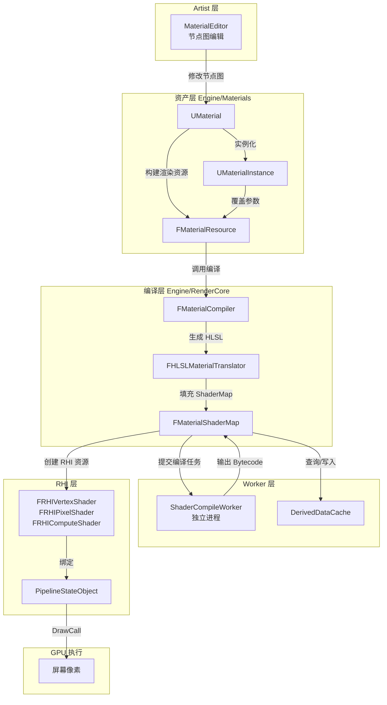

> [← 返回 UE全解析主索引]([[00-UE全解析主索引\|UE全解析主索引]])

# UE-专题：材质与着色器编译链路

> **版本说明**：本笔记基于 UE 5.x 源码分析。在 UE5 中，原 `ShaderCore` 模块已合并入 `RenderCore`，所有原本位于 `Runtime/ShaderCore` 的类型与接口现已归属 `Runtime/RenderCore`。下文统一使用实际存在的 `RenderCore` 模块名，并在必要时注明历史沿革。

---

## Why：为什么要理解这条链路？

材质（Material）是 UE 渲染管线中最核心的 Artist -facing 资产之一。从美术在材质编辑器中连节点，到最终 GPU 执行像素着色器，中间经历了**资产序列化 → HLSL 代码生成 → 着色器编译 → 平台后端转换 → DDC 缓存 → RHI 绑定**的完整链条。

理解这条链路的关键价值在于：

1. **性能优化**：知道 DDC 命中/未命中路径、异步编译调度策略，才能定位材质变体爆炸（Shader Permutation Explosion）导致的编译卡顿。
2. **跨平台**：同一份 `UMaterial` 如何生成 D3D12 Bytecode、SPIR-V、Metal IR 等多平台代码。
3. **引擎架构借鉴**：UE 将 Artist 的"材质图"与 Engine 的"Shader"通过多层抽象解耦，这种分层设计对自研引擎的渲染资产管线有极高参考价值。

---

## What：链路总览



---

## 第 1 层：接口层（What）

### 1.1 材质资产层（Engine/Materials）

#### UMaterial / UMaterialInterface / UMaterialInstance

材质资产层的核心是三层次继承结构：

- **`UMaterialInterface`**：抽象接口，定义了材质对外的统一访问方式。所有可以被赋给 Mesh 的材质资产都继承自它。
- **`UMaterial`**：完整的材质定义，包含节点图（`Expressions`）、BlendMode、ShadingModel 等全部属性。
- **`UMaterialInstance`** / **`UMaterialInstanceConstant`**：材质实例，继承自 `UMaterialInterface`，通过覆盖父材质的参数（Scalar/Vector/Texture/StaticSwitch）创建变体，而无需复制整个节点图。

```cpp
// Engine/Source/Runtime/Engine/Public/Materials/MaterialInterface.h
// 行 1-200
// UMaterialInterface 是所有材质资产的基类，
// 提供 GetMaterialResource、GetRenderProxy 等渲染接口
```

#### FMaterialResource：渲染线程的资源表示

`FMaterialResource` 继承自 `FMaterial`，是 `UMaterial` 或 `UMaterialInstance` 在**渲染线程/编译管线**中的投影。它携带了特定 `EShaderPlatform` 和 `EMaterialQualityLevel` 下的完整材质状态。

```cpp
// Engine/Source/Runtime/Engine/Public/MaterialShared.h
// 行 3075-3087
class FMaterialResource : public FMaterial
{
public:
    void SetMaterial(UMaterial* InMaterial, UMaterialInstance* InInstance,
                     EShaderPlatform InShaderPlatform,
                     EMaterialQualityLevel::Type InQualityLevel = EMaterialQualityLevel::Num)
    {
        Material = InMaterial;
        MaterialInstance = InInstance;
        SetQualityLevelProperties(InShaderPlatform, InQualityLevel);
    }
    // ... 大量虚函数，代理查询 UMaterial/UMaterialInstance 的属性
};
```

**设计要点**：一个 `UMaterial` 在运行时可能对应**多个** `FMaterialResource`，因为每个 (QualityLevel, FeatureLevel, Platform) 组合都需要独立的编译产物。

---

### 1.2 材质编译与 HLSL 生成

#### FMaterialCompiler 接口

`FMaterialCompiler` 是材质节点图到着色器代码的翻译器抽象。每个材质属性（BaseColor、Normal、Roughness 等）的编译都会调用 `SetMaterialProperty`，然后递归遍历表达式图。

```cpp
// Engine/Source/Runtime/Engine/Public/MaterialCompiler.h
// 行 108-148
class FMaterialCompiler
{
public:
    virtual ~FMaterialCompiler() { }
    virtual bool ShouldStopTranslating() const = 0;
    // 设置当前正在编译的材质属性（如 MP_BaseColor）
    virtual void SetMaterialProperty(EMaterialProperty InProperty,
        EShaderFrequency OverrideShaderFrequency = SF_NumFrequencies,
        bool bUsePreviousFrameTime = false) = 0;
    // 表达式调用入口：通过 CodeIndex 间接引用已生成的代码块
    virtual int32 CallExpression(FMaterialExpressionKey ExpressionKey,
        FMaterialCompiler* InCompiler) = 0;
    virtual EMaterialValueType GetType(int32 Code) = 0;
    virtual int32 ValidCast(int32 Code, EMaterialValueType DestType) = 0;
    // ...
};
```

#### FHLSLMaterialTranslator：将材质节点图翻译成 HLSL

`FHLSLMaterialTranslator` 是 `FMaterialCompiler` 的标准实现。它维护一个 `FShaderCodeChunk` 数组，每个表达式节点对应一个代码块（Code Chunk），通过哈希去重实现公共子表达式消除（CSE）。

```cpp
// Engine/Source/Runtime/Engine/Private/Materials/HLSLMaterialTranslator.h
// 行 83-173
struct FShaderCodeChunk
{
    uint64 Hash;                          // 代码块哈希，用于 CSE 去重
    uint64 MaterialAttributeMask;
    FString DefinitionFinite;             // 有限差分版本的 HLSL 代码
    FString DefinitionAnalytic;           // 解析导数版本的 HLSL 代码
    FString SymbolName;                   // 生成的局部变量名
    TRefCountPtr<FMaterialUniformExpression> UniformExpression;
    EMaterialValueType Type;
    bool bInline;                         // 是否内联，不生成独立变量
    EDerivativeStatus DerivativeStatus;
    // ...
};
```

翻译完成后，`FHLSLMaterialTranslator` 将各材质属性的代码块拼接成完整的 HLSL 函数体，嵌入到引擎的 Shader Template（如 `BasePassPixelShader.usf`）中。

---

### 1.3 RenderCore 着色器基础设施

> 注：UE4 中这些类型位于 `ShaderCore` 模块；UE5 已统一并入 `RenderCore`。

#### FShader 基类与类型体系

`FShader` 是所有运行时着色器实例的基类。着色器的"类型"与"实例"被严格分离：

- **`FShaderType`**：元类型（Meta Type），描述一类着色器的源码文件、入口函数、排列维度（Permutation）等。全局唯一。
- **`FShader`**（实例）：由 `FShaderType` + `PermutationId` + `ShaderPlatform` 等参数确定的一个具体编译产物。

```cpp
// Engine/Source/Runtime/RenderCore/Public/Shader.h
// 行 1237-1313
class FShaderType
{
public:
    // 构造序列化/编译后的 FShader 实例的工厂函数
    typedef FShader* (*ConstructSerializedType)();
    typedef FShader* (*ConstructCompiledType)(const FShader::CompiledShaderInitializerType& Initializer);
    // 判断某平台/排列是否应该编译
    typedef bool (*ShouldCompilePermutationType)(const FShaderPermutationParameters&);
    // 修改编译环境（注入宏定义）
    typedef void (*ModifyCompilationEnvironmentType)(const FShaderPermutationParameters&, FShaderCompilerEnvironment&);
    // ...
};
```

`FShaderType` 通过 `EShaderTypeForDynamicCast` 区分子类：

- `FGlobalShaderType`：不依赖材质的全局着色器（如 ClearShader、PostProcess Shader）。
- `FMaterialShaderType`：依赖材质但不依赖 VertexFactory 的着色器（如 LightFunction、DeferredDecal）。
- `FMeshMaterialShaderType`：依赖材质且依赖 VertexFactory 的着色器（如 BasePassVS/PS）。

#### FShaderMapBase / TShaderMap

`FShaderMapBase` 是着色器映射表的基类，管理一组同平台、同材质（或同全局上下文）下的所有 `FShader` 实例。模板派生类 `TShaderMap<ContentType, PointerTableType>` 提供类型安全的访问。

```cpp
// Engine/Source/Runtime/RenderCore/Public/Shader.h
// 行 2475-2598
class FShaderMapBase
{
public:
    virtual ~FShaderMapBase();
    FShaderMapResourceCode* GetResourceCode();
    FShaderMapResource* GetResource() const;
    inline const FShaderMapContent* GetContent() const;
    inline EShaderPlatform GetShaderPlatform() const;
    // ...
protected:
    TRefCountPtr<FShaderMapResource> Resource;      // RHI 资源引用
    TRefCountPtr<FShaderMapResourceCode> Code;      // 平台相关的机器码
    TMemoryImageObject<FShaderMapContent> Content;  // 着色器内容（内存镜像）
    EShaderPermutationFlags PermutationFlags;
};
```

#### FMaterialShaderMap

`FMaterialShaderMap` 是材质专用的 ShaderMap，继承自 `TShaderMap<FMaterialShaderMapContent, FShaderMapPointerTable>`。它不仅包含材质相关的 `FShader`，还按 `VertexFactoryType` 索引了对应的 `FMeshMaterialShaderMap`。

```cpp
// Engine/Source/Runtime/Engine/Public/MaterialShared.h
// 行 1517-1598
class FMaterialShaderMap : public TShaderMap<FMaterialShaderMapContent, FShaderMapPointerTable>,
                           public FDeferredCleanupInterface
{
public:
    // 根据 ShaderMapId 查找已缓存的实例
    static TRefCountPtr<FMaterialShaderMap> FindId(const FMaterialShaderMapId& ShaderMapId,
        EShaderPlatform Platform);

#if WITH_EDITOR
    // 从 DDC 异步加载
    static TSharedRef<FAsyncLoadContext> BeginLoadFromDerivedDataCache(
        const FMaterial* Material, const FMaterialShaderMapId& ShaderMapId,
        EShaderPlatform Platform, const ITargetPlatform* TargetPlatform,
        TRefCountPtr<FMaterialShaderMap>& InOutShaderMap, FString& OutDDCKeyDesc);

    // 编译入口：将材质编译为此 ShaderMap
    void Compile(FMaterial* Material, const FMaterialShaderMapId& ShaderMapId,
        const TRefCountPtr<FSharedShaderCompilerEnvironment>& MaterialEnvironment,
        const FMaterialCompilationOutput& InMaterialCompilationOutput,
        EShaderPlatform Platform, EMaterialShaderPrecompileMode PrecompileMode);
#endif
    // ...
};
```

---

### 1.4 ShaderCompileWorker 编译管线

UE 的着色器编译是**进程外（Out-of-Process）**的：主引擎将编译任务序列化到文件，启动 `ShaderCompileWorker` 进程执行实际编译，再通过文件读取结果。

#### FShaderCompileJob：单个编译任务

```cpp
// Engine/Source/Runtime/RenderCore/Public/ShaderCompilerJobTypes.h
// 行 330-394
class FShaderCompileJob : public FShaderCommonCompileJob
{
public:
    static const EShaderCompileJobType Type = EShaderCompileJobType::Single;
    FShaderCompileJobKey Key;                   // ShaderType + VFType + PermutationId
    TSharedPtr<const FShaderType::FParameters, ESPMode::ThreadSafe> ShaderParameters;
    FShaderCompilerInput Input;                 // 编译输入：源码、宏定义、入口函数等
    FShaderPreprocessOutput PreprocessOutput;   // 预处理输出
    FShaderCompilerOutput Output;               // 编译输出：Bytecode、参数映射、错误信息等
    // ...
};
```

#### ShaderCompileWorker.cpp 主循环

```cpp
// Engine/Source/Programs/ShaderCompileWorker/Private/ShaderCompileWorker.cpp
// 行 282-338
class FWorkLoop
{
    void Loop(FString& CrashOutputFile)
    {
        while (true)
        {
            TArray<FShaderCompileJob> SingleJobs;
            TArray<FShaderPipelineCompileJob> PipelineJobs;
            TArray<FString> PipelineJobNames;
            // 1. 从输入文件反序列化编译任务
            ProcessInputFromArchive(InputFilePtr.Get(), SingleJobs, PipelineJobs, PipelineJobNames);
            // 2. 调用各平台 ShaderFormat（DXC、FXC、SPIRV 等）执行编译
            // 3. 将结果写入输出文件
            WriteToOutputArchive(*OutputFilePtr, SingleJobs, PipelineJobs, PipelineJobNames);
            // 4. 文件重命名通知主进程结果就绪
            IFileManager::Get().Move(*OutputFilePath, *TempFilePath);
        }
    }
};
```

---

### 1.5 RHI 层着色器绑定

编译完成后，`FShaderMapResource` 持有平台相关的着色器字节码（DXIL、SPIR-V、Metal IR 等）。在渲染线程初始化时，通过 RHI 创建真正的 GPU 着色器对象。

```cpp
// Engine/Source/Runtime/RHI/Public/RHIResources.h
// 行 953-1030
class FRHIVertexShader : public FRHIGraphicsShader
{
public:
    FRHIVertexShader() : FRHIGraphicsShader(RRT_VertexShader, SF_Vertex) {}
};

class FRHIPixelShader : public FRHIGraphicsShader
{
public:
    FRHIPixelShader() : FRHIGraphicsShader(RRT_PixelShader, SF_Pixel) {}
};

class FRHIComputeShader : public FRHIShader
{
public:
    FRHIComputeShader() : FRHIShader(RRT_ComputeShader, SF_Compute) {}
    // ...
};
```

`FRHIShader` 本身不携带参数绑定信息。实际的 UniformBuffer、Texture、Sampler 绑定由 `FShaderParameterMapInfo` 和 `FShaderResourceBinding` 在更高层管理。

---

## 第 2 层：数据层（How - Structure）

### 2.1 UMaterial 到 FMaterialResource 的映射关系

```
UMaterial (UObject, 主线程)
  │ 1:N
  ├── FMaterialResource (EShaderPlatform, EMaterialQualityLevel)
  │       │ 1:1 (编译完成后)
  │       └── FMaterialShaderMap
  │               │ 1:N (按 ShaderType)
  │               ├── FShader (MaterialShader)
  │               └── FMeshMaterialShaderMap (按 VertexFactoryType)
  │                       └── FShader (MeshMaterialShader)
```

`FMaterial` 基类中维护了**双缓冲**的 `FMaterialShaderMap` 指针，用于线程安全切换：

```cpp
// Engine/Source/Runtime/Engine/Public/MaterialShared.h
// 行 2657-2680
class FMaterialShaderMap* GetGameThreadShaderMap() const
{
    return GameThreadShaderMap;     // 游戏线程读取
}
class FMaterialShaderMap* GetRenderingThreadShaderMap() const;  // 渲染线程读取
void SetGameThreadShaderMap(FMaterialShaderMap* InMaterialShaderMap);
void SetRenderingThreadShaderMap(TRefCountPtr<FMaterialShaderMap>& InMaterialShaderMap);
```

### 2.2 FMaterialShaderMap 的内存布局与缓存

`FMaterialShaderMapContent` 是实际存储着色器数据的内存镜像结构，使用 `DECLARE_TYPE_LAYOUT` 宏支持冻结（Freeze）与序列化。

```cpp
// Engine/Source/Runtime/Engine/Public/MaterialShared.h
// 行 1451-1512
class FMaterialShaderMapContent : public FShaderMapContent
{
    // 按 VertexFactoryType 索引的 MeshMaterialShaderMap 数组
    LAYOUT_FIELD(TMemoryImageArray<TMemoryImagePtr<FMeshMaterialShaderMap>>, OrderedMeshShaderMaps);
    // 材质编译输出：UniformExpressions、TextureReferences 等
    LAYOUT_FIELD(FMaterialCompilationOutput, MaterialCompilationOutput);
    LAYOUT_FIELD(FSHAHash, ShaderContentHash);
    // EditorOnly：保留处理后的 HLSL 源码用于调试
    LAYOUT_FIELD_EDITORONLY(TMemoryImageArray<FMaterialProcessedSource>, ShaderProcessedSource);
};
```

`FShaderMapContent` 内部则存储了 `TMemoryImageArray<TMemoryImagePtr<FShader>>`（普通材质着色器）和 `ShaderPipelines`。

### 2.3 ShaderCompileWorker 的进程间通信（IPC）

UE 采用**文件系统作为 IPC 通道**，而非共享内存或 Socket：

1. **主进程**将一组 `FShaderCompileJob` 序列化到 `{WorkingDirectory}/Input{JobId}.dat`。
2. **SCW 进程**轮询/读取输入文件，调用 `IShaderFormat::CompileShader` 执行实际编译。
3. **SCW 进程**将结果写入 `{WorkingDirectory}/Output{JobId}.dat`，并通过文件重命名原子操作通知主进程。
4. **主进程**（通过 `FShaderCompilingManager`）轮询输出文件，反序列化 `FShaderCompilerOutput`。

这种设计的优缺点：
- **优点**：SCW 崩溃不会拖垮主进程；天然支持分布式编译（XGE、UBA）。
- **缺点**：大量小文件 I/O，对网络文件系统（如云桌面场景）不友好。

### 2.4 DDC 缓存键的生成逻辑

`FMaterialShaderMapId` 是 DDC 缓存键的核心输入。它编码了所有影响编译结果的状态：

```cpp
// Engine/Source/Runtime/Engine/Public/MaterialShared.h
// 行 1193-1298
class FMaterialShaderMapId
{
#if WITH_EDITOR
    FGuid BaseMaterialId;                               // UMaterial 的 StateId，节点图变更会刷新
    EMaterialQualityLevel::Type QualityLevel;           // 材质质量等级
    ERHIFeatureLevel::Type FeatureLevel;                // SM5 / SM6 / ES3_1 等
    EMaterialShaderMapUsage::Type Usage;                // 默认 / Lightmass / 自定义输出
    TArray<FStaticSwitchParameter> StaticSwitchParameters;  // 静态开关（影响排列数）
    TArray<FGuid> ReferencedFunctions;                  // 引用的 MaterialFunction GUID
    TArray<FShaderTypeDependency> ShaderTypeDependencies;       // ShaderType 源码哈希
    TArray<FVertexFactoryTypeDependency> VertexFactoryTypeDependencies; // VF 源码哈希
    FSHAHash TextureReferencesHash;                     // 纹理引用哈希
    FSHAHash ExpressionIncludesHash;                    // 表达式动态包含文件哈希
    bool bUsingNewHLSLGenerator;                        // 是否使用新版 HLSL 生成器
    FSubstrateCompilationConfig SubstrateCompilationConfig; // Substrate 编译配置
#endif
    FPlatformTypeLayoutParameters LayoutParams;         // 内存布局参数（32/64位、对齐等）
    // ...
};
```

DDC 键字符串通过 `FMaterialShaderMapId::AppendKeyString` 生成，最终经 `GetMaterialShaderMapKeyString` 计算为 `FCacheKey`，用于 `UE::DerivedData::GetCache().Get(...)` 查询。

```cpp
// Engine/Source/Runtime/Engine/Private/Materials/MaterialShader.cpp
// 行 2124-2126
Result->DataKey = GetMaterialShaderMapKeyString(ShaderMapId,
    FMaterialShaderParameters(Material), InPlatform);
FCacheKey CacheKey = GetMaterialShaderMapKey(Result->DataKey);
```

### 2.5 平台特定的着色器格式

`FShaderCompilerInput` 中的 `ShaderFormat` 和 `Target` 决定了后端编译器：

| 平台 | ShaderFormat | 中间产物 / Bytecode |
|------|-------------|-------------------|
| PC D3D12 | `PCD3D_SM6` | DXIL |
| PC D3D11 | `PCD3D_SM5` | DXBC |
| Vulkan | `SF_VULKAN_SM6` | SPIR-V |
| Metal | `SF_METAL` / `SF_METAL_MRT` | Metal IR (AIR) |
| OpenGL ES | `SF_OPENGL_ES3_1_ANDROID` | GLSL → 驱动编译 |

`FShaderCompilerOutput` 中的 `ShaderCode` 以 `FShaderCode` 结构封装，可包含多种压缩与编码格式。

---

## 第 3 层：逻辑层（How - Behavior）

### 3.1 材质节点图 → HLSL 的翻译过程

翻译过程遵循**深度优先遍历 + 代码块缓存（CSE）**：

1. **入口**：`FMaterial::Translate` 或 `FHLSLMaterialTranslator::Translate` 被调用。
2. **属性迭代**：对 `MP_BaseColor`、`MP_Normal`、`MP_Roughness` 等每个材质属性，调用 `SetMaterialProperty`。
3. **表达式递归**：每个 `UMaterialExpression` 实现 `Compile` 虚函数，内部调用 `FMaterialCompiler::CallExpression`。
4. **代码块生成**：`FHLSLMaterialTranslator` 为每个表达式输出创建 `FShaderCodeChunk`。若两个 Chunk 的 `Hash` 相同（输入和定义都相同），则复用已有 `CodeIndex`，实现公共子表达式消除。
5. **Uniform 表达式**：对于常量参数、纹理采样等，生成 `FMaterialUniformExpression`，运行时通过 UniformBuffer 更新值。
6. **拼接输出**：将所有属性的 `TranslatedCodeChunkDefinitions` 和 `TranslatedCodeChunks` 拼入引擎的 `.usf` 模板中。

```cpp
// Engine/Source/Runtime/Engine/Private/Materials/HLSLMaterialTranslator.h
// 行 186-196
struct FMaterialDerivativeVariation
{
    FString TranslatedCodeChunkDefinitions[CompiledMP_MAX]; // 各属性的局部变量定义
    FString TranslatedCodeChunks[CompiledMP_MAX];           // 各属性的最终值表达式
    TArray<FString> CustomOutputImplementations;            // 自定义输出函数
};
```

### 3.2 着色器编译请求的异步管线

材质编译的完整异步流程如下：

```
UMaterial::PostEditChangeProperty
  └── FMaterial::CacheShaders()
        ├── 1. 构建 FMaterialShaderMapId
        ├── 2. FMaterialShaderMap::FindId()      // 内存中查找已有 ShaderMap
        ├── 3. BeginLoadFromDerivedDataCache()   // 异步查询 DDC
        │      └── DDC Miss → 继续编译
        ├── 4. FMaterialShaderMap::Compile()
        │      └── 为每个需要的 ShaderType/VF 创建 FShaderCompileJob
        ├── 5. SubmitCompileJobs()
        │      └── FShaderCompilingManager::SubmitJobs()
        │             └── 写入输入文件 / 启动 SCW 进程
        └── 6. 等待 SCW 完成 → ProcessCompilationResults()
               └── 将编译结果填充到 FMaterialShaderMap
               └── SaveToDerivedDataCache()     // 写入 DDC
```

`FShaderCompilingManager` 是全局单例，负责调度所有 SCW 进程。它支持：

- **优先级队列**：`EShaderCompileJobPriority` 控制编辑中材质的编译优先于后台预编译。
- **批量处理**：多个 Job 合并为一个文件批次提交给单个 SCW 进程，减少进程启动开销。
- **分布式扩展**：通过 XGE (IncrediBuild)、UBA (Unreal Build Accelerator) 将任务分发到远程机器。

### 3.3 运行时着色器切换（Quality Level、Feature Level、LOD）

运行时切换依赖 `FMaterialShaderMapId` 中的维度差异：

- **Quality Level**：`EMaterialQualityLevel::Type`（Low / High / Epic / Cinematic）。材质编辑器中的 "Quality Switch" 节点根据此值展开不同分支。
- **Feature Level**：`ERHIFeatureLevel::Type`（ES3_1 / SM5 / SM6）。决定了可用的 ShaderModel 特性（如 ComputeShader、RayTracing）。
- **Static Switch**：在 `FMaterialShaderMapId` 中作为 `StaticSwitchParameters` 参与键值计算。每个开关状态组合产生独立的 `FMaterialShaderMap`。

切换时，引擎根据当前平台/质量等级查找对应的 `FMaterialShaderMap`，并通过 `SetGameThreadShaderMap` / `SetRenderingThreadShaderMap` 完成双缓冲更新。

### 3.4 热重编译与 DDC 命中/未命中路径

#### DDC 命中路径（Fast Path）

```cpp
// Engine/Source/Runtime/Engine/Private/Materials/MaterialShader.cpp
// 行 2058-2091
if (LoadContext.HasData())
{
    TRACE_COUNTER_INCREMENT(Shaders_FMaterialShaderMapDDCHits);
    ShaderMap = new FMaterialShaderMap();
    ShaderMap->Serialize(LoadContext);   // 从 DDC 反序列化
    ShaderMap->Register(Platform);       // 注册到全局查找表
    GShaderCompilerStats->AddDDCHit(1);
}
```

命中时无需启动 SCW，直接从本地或网络 DDC 加载已编译的内存镜像。

#### DDC 未命中路径（Slow Path）

未命中时：

1. 创建新的 `FMaterialShaderMap` 并调用 `Compile()`。
2. 为所有需要的 `FShaderType` × `PermutationId` × `VertexFactoryType` 生成 `FShaderCompileJob`。
3. 提交到 `FShaderCompilingManager`。
4. SCW 编译完成后，`FMaterialShaderMap::ProcessCompilationResults` 将结果排序并填入 ShaderMap。
5. 调用 `SaveToDerivedDataCache()` 将新产物推入 DDC，供下次命中。

```cpp
// Engine/Source/Runtime/Engine/Private/Materials/MaterialShader.cpp
// 行 2190-2205
void FMaterialShaderMap::SaveToDerivedDataCache(const FMaterialShaderParameters& ShaderParameters)
{
    FShaderCacheSaveContext Ctx;
    Serialize(Ctx);
    const FString DataKey = GetMaterialShaderMapKeyString(ShaderMapId, ShaderParameters, GetShaderPlatform());
    FCacheKey Key = GetMaterialShaderMapKey(DataKey);
    // 推入 UE::DerivedData::GetCache()
}
```

---

## 与上下层的关系

### 上层调用者

| 调用者 | 作用 |
|--------|------|
| **MaterialEditor** | 可视化编辑材质节点图；触发 `PostEditChangeProperty` → 重新编译。 |
| **UMeshComponent / UPrimitiveComponent** | 通过 `GetMaterial` 获取 `UMaterialInterface`，渲染时提取 `FMaterialRenderProxy` 和 `FMaterialShaderMap`。 |
| **Lightmass** | 编译 Lightmass 专用版本（`EMaterialCompilerType::Lightmass`），烘焙静态光照。 |

### 下层依赖

| 依赖 | 作用 |
|------|------|
| **RHI** | 提供 `FRHIVertexShader`、`FRHIPixelShader` 等抽象；后端实现（D3D12RHI、VulkanRHI、MetalRHI）负责将 Bytecode 上传到 GPU。 |
| **DDC** | `DerivedDataCache` 存储编译后的 `FMaterialShaderMap` 内存镜像，避免重复编译。 |
| **TargetPlatformManager** | 提供 `IShaderFormat` 接口，将 HLSL 转换为各平台最终的机器码/中间码。 |

---

## 设计亮点与可迁移经验

### 1. 材质与着色器的分层解耦：Artist 面向材质，Engine 面向 Shader

UE 通过三层抽象实现了美术与技术的解耦：

- **Artist Layer**：`UMaterial` + `UMaterialExpression` 节点图，完全可视化。
- **Translation Layer**：`FMaterialCompiler` / `FHLSLMaterialTranslator` 将节点图翻译为 HLSL，引擎开发者可以替换翻译器而不影响美术工作流。
- **Engine Layer**：`FShaderType` / `FShaderMap` / `FShader` 管理具体的着色器实例、排列、缓存。

**可迁移经验**：自研引擎可借鉴这种"领域特定语言（DSL）→ 通用着色器中间表示 → 平台后端"的三层架构，避免美术逻辑直接侵入渲染核心。

### 2. 异步编译 + DDC 缓存：避免卡顿

着色器编译是 CPU 密集型任务（尤其是 SM6/DXIL 级别）。UE 的解决方案是：

- **进程外编译**：SCW 崩溃不影响编辑器稳定性。
- **异步非阻塞**：DDC 查询和 SCW 编译都是异步的，编辑材质时编辑器不会卡死。
- **全局缓存**：DDC 是跨项目、跨会话的，团队协作时大幅削减总编译时间。

**可迁移经验**：对于需要运行时/编辑器内编译着色器的引擎，优先采用"异步任务 + 全局缓存"模型，而非同步阻塞调用。

### 3. 平台抽象：同一份材质生成多平台着色器

`FShaderCompilerInput` / `FShaderCompilerOutput` 配合 `IShaderFormat` 插件体系，使得同一套 HLSL 源码可以走不同的后端（DXC、FXC、glslang、Metal Shader Compiler）。

`FShaderCompilerEnvironment` 通过宏定义（`SetDefine`）在编译前注入平台相关的条件编译开关：

```cpp
// Engine/Source/Runtime/RenderCore/Public/ShaderCore.h
// 行 543-712
struct FShaderCompilerEnvironment
{
    TMap<FString, FString> IncludeVirtualPathToContentsMap;
    FShaderCompilerFlags CompilerFlags;
    TMap<uint32, uint8> RenderTargetOutputFormatsMap;
    // 通过 SetDefine 注入平台宏，如 PLATFORM_SUPPORTS_BINDLESS
    RENDERCORE_API void SetDefine(const TCHAR* Name, uint32 Value);
    RENDERCORE_API void SetDefine(const TCHAR* Name, bool Value);
    // ...
};
```

**可迁移经验**：将"源码生成"与"平台后端编译"彻底分离。源码生成器只输出标准 HLSL/GLSL；平台适配通过预处理宏和后端编译器完成，避免在翻译层引入平台分支。

---

## 关联阅读

- [[UE-Engine-源码解析：材质与着色器系统]]（如果存在）
- [[UE-构建系统-源码解析：着色器编译与缓存管线]]
- [[UE-专题：渲染一帧的生命周期]]

---

## 索引状态

- **所属阶段**：第八阶段-跨领域专题
- **对应 UE 笔记**：UE-专题：材质与着色器编译链路
- **本轮完成度**：✅ 第三轮（完整三层分析）
- **更新日期**：2026-04-19
