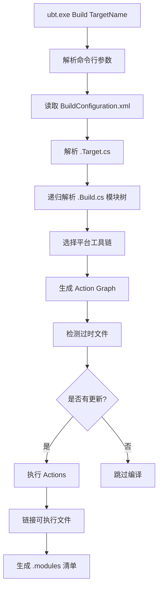
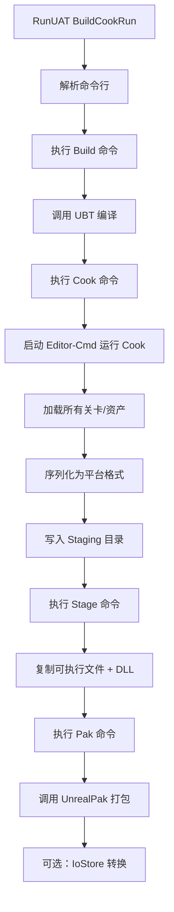

> [← 返回 UE全解析主索引]([[00-UE全解析主索引|UE全解析主索引]])

# UE-专题：构建到部署的完整流水线

## Why：为什么要分析这条流水线？

UE 不仅是一个运行时引擎，更是一个庞大的**工业化内容生产与交付平台**。从开发者在 IDE 中写下第一行代码，到最终玩家在 Steam/Epic Games Store 上下载并运行游戏，中间经历了一整套复杂的构建、转换、打包、分发流程。

理解这条流水线有助于：
- 掌握 UE 的**Cook、Pak、IoStore** 三种资产处理方式的演进逻辑。
- 理解为什么编辑器中的 `.uasset` 文件不能直接拷贝给玩家使用。
- 为自研引擎设计**内容烘焙与分发管线**提供架构参考。

---

## What：构建到部署流水线的全貌

UE 的构建部署流水线可以抽象为五个阶段，由三个核心工具程序（UBT、UAT、UnrealPak）和多个运行时模块协同完成：


| 阶段 | 工具/模块 | 输入 | 输出 | 核心职责 |
|------|----------|------|------|---------|
| 代码编译 | **UBT** (C#) | `.cpp` / `.Build.cs` / `.Target.cs` | `.exe` / `.dll` / `.lib` | 解析模块依赖、生成项目文件、调用编译器 |
| 自动化编排 | **UAT** (C#) | `.xml` BuildGraph 脚本 | 命令序列 | 编排 Build、Cook、Stage、Pak 等步骤 |
| 资产烘焙 | **Cook** (Editor模块) | `.uasset` / `.umap` | `.uasset` (平台特定格式) | 将编辑器资产转换为运行时平台格式 |
| 文件整理 | **Stage** (UAT脚本) | Cooked 文件 + 可执行文件 | 目录树 | 按平台组织文件结构 |
| 打包压缩 | **Pak** / **IoStore** | Staged 文件 | `.pak` 或 `.ucas`+`.utoc` | 合并、压缩、加密资产文件 |
| 分发部署 | **Zen** / 平台 SDK | Pak/IoStore 文件 | 玩家客户端 | 可选的云端存储、补丁、热更 |

---

## How：逐层拆解流水线

### 第 1 层：接口层 —— 工具边界与对外能力

#### 1.1 UBT：模块编译的入口

**UnrealBuildTool (UBT)** 是一个独立的 C# 控制台程序，位于 `Engine/Source/Programs/UnrealBuildTool/`。它不依赖 UE 运行时，只依赖 .NET 运行时和编译器工具链。

UBT 通过**反射自动发现**所有 `ToolMode` 派生类：

```csharp
// UnrealBuildTool.cs，第 291~308 行
private static Dictionary<string, Type> GetModes()
{
    Dictionary<string, Type> ModeNameToType = new Dictionary<string, Type>(StringComparer.OrdinalIgnoreCase);
    foreach (Type Type in Assembly.GetExecutingAssembly().GetTypes())
    {
        if (Type.IsClass && !Type.IsAbstract && Type.IsSubclassOf(typeof(ToolMode)))
        {
            ToolModeAttribute? Attribute = Type.GetCustomAttribute<ToolModeAttribute>();
            if (Attribute == null)
            {
                throw new BuildException("Class '{0}' should have a ToolModeAttribute", Type.Name);
            }
            ModeNameToType.Add(Attribute.Name, Type);
        }
    }
    return ModeNameToType;
}
```

UBT 内置了二十余种模式：

| 模式 | 职责 |
|------|------|
| `Build` | 编译目标（默认模式） |
| `Clean` | 清理编译产物 |
| `GenerateProjectFiles` | 生成 IDE 项目文件 |
| `UnrealHeaderTool` | 调用 UHT 生成反射代码 |
| `ValidatePlatforms` | 验证平台 SDK 配置 |
| `ProfileUnitySizes` | 分析 Unity Build 文件大小 |

> 文件：`Engine/Source/Programs/UnrealBuildTool/UnrealBuildTool.cs`，第 291~308 行

#### 1.2 UAT：自动化编排的入口

**UnrealAutomationTool (UAT)** 同样是一个 C# 程序，位于 `Engine/Source/Programs/AutomationTool/`。UAT 的设计哲学是**"命令即脚本"**：通过命令行指定要执行的 `BuildCommand`，UAT 通过反射查找并执行。

```csharp
// AutomationTool/AutomationUtils/Automation.cs，第 258~310 行
public static async Task<ExitCode> ExecuteAsync(List<CommandInfo> CommandsToExecute, Dictionary<string, Type> Commands)
{
    for (int CommandIndex = 0; CommandIndex < CommandsToExecute.Count; ++CommandIndex)
    {
        var CommandInfo = CommandsToExecute[CommandIndex];
        Type CommandType;
        if (!Commands.TryGetValue(CommandInfo.CommandName, out CommandType))
        {
            throw new AutomationException("Failed to find command {0}", CommandInfo.CommandName);
        }

        BuildCommand Command = (BuildCommand)Activator.CreateInstance(CommandType);
        Command.Params = CommandInfo.Arguments.ToArray();
        ExitCode Result = await Command.ExecuteAsync();
        // ...
    }
}
```

**BuildGraph**：UAT 的高级编排机制。开发者编写 `.xml` 脚本定义任务依赖图（DAG），UAT 自动并行执行无依赖的任务：

```csharp
// BuildGraph/BgNodeExecutor.cs / BgGraphBuilder.cs
// 将 XML 解析为节点图，按拓扑排序执行
```

最常用的 UAT 命令是 `BuildCookRun`，它本质上是一个高层封装，依次调用：
1. `Build`（UBT 编译）
2. `Cook`（资产烘焙）
3. `Stage`（文件整理）
4. `Pak`（打包）
5. `Archive`（归档）

#### 1.3 UnrealPak：资产打包的入口

**UnrealPak** 是一个 C++ 程序，使用精简版 UE 运行时（`IMPLEMENT_APPLICATION`），位于 `Engine/Source/Programs/UnrealPak/`。

```cpp
// Programs/UnrealPak/Private/UnrealPak.cpp，第 12~31 行
INT32_MAIN_INT32_ARGC_TCHAR_ARGV()
{
    FTaskTagScope Scope(ETaskTag::EGameThread);
    UE::ProjectUtilities::ParseProjectDirFromCommandline(ArgC, ArgV);
    
    // 启动主循环，添加 -nopak 防止加载已有 pak
    GEngineLoop.PreInit(ArgC, ArgV, TEXT("-nopak"));
    
    int32 Result = ExecuteUnrealPak(FCommandLine::Get()) ? 0 : 1;
    
    // ... 清理退出
}
```

UnrealPak 的核心能力：
- **创建 Pak**：将目录树打包为 `.pak` 文件。
- **提取 Pak**：将 `.pak` 解压回文件系统。
- **验证 Pak**：检查 Pak 索引完整性和文件哈希。
- **修补 Pak**：生成差异补丁（Delta Patch）。

#### 1.4 Cook 的两种模式

Cook 逻辑主要实现在 `Editor/UnrealEd` 的 `UCookOnTheFlyServer` 中，支持两种模式：

| 模式 | 触发方式 | 适用场景 |
|------|---------|---------|
| **CookByTheBook** | 命令行 `UE4Editor-Cmd.exe -run=Cook` | 完整打包，一次性烘焙所有资产 |
| **CookOnTheFly** | 编辑器启动或 `StartCookOnTheFly` | 开发迭代，按需实时烘焙 |

> 文件：`Engine/Source/Editor/UnrealEd/Classes/CookOnTheSide/CookOnTheFlyServer.h`，第 259~530 行

---

### 第 2 层：数据层 —— 核心数据结构

#### 2.1 UBT 的依赖图与 Action 队列

UBT 在编译前会构建一个完整的**有向无环图（DAG）**：
- **节点**：源文件、中间文件、库文件、可执行文件。
- **边**：编译依赖关系（`#include`、模块依赖、链接依赖）。

对于每个目标（Target），UBT 会：
1. 解析 `.Target.cs` 确定目标类型（Game/Editor/Client/Server/Program）。
2. 递归解析所有 `.Build.cs`，构建模块依赖树。
3. 根据平台（Win64/Mac/Linux）选择工具链（MSVC/Clang/GCC）。
4. 生成 **Action Graph**：每个 Action 对应一次编译器或链接器调用。
5. 执行 Action Graph，支持本地并行、XGE（IncrediBuild）、FastBuild、SN-DBS 等分布式编译后端。

#### 2.2 Pak 文件格式

Pak 文件是 UE4 时代的资产打包格式，其结构如下：

```
[File Data 0]
[File Data 1]
...
[File Data N]
[Index]
[FPakInfo Footer]
```

**FPakInfo（文件尾，第 137~256 行）**：

```cpp
// Runtime/PakFile/Public/IPlatformFilePak.h，第 137~203 行
struct FPakInfo
{
    uint32 Magic;           // 0x5A6F12E1
    int32 Version;          // 当前为 12 (Utf8PakDirectory)
    int64 IndexOffset;      // Index 在文件中的偏移
    int64 IndexSize;        // Index 大小
    FSHAHash IndexHash;     // Index 的 SHA1 校验
    uint8 bEncryptedIndex;  // Index 是否加密
    FGuid EncryptionKeyGuid;
    TArray<FName> CompressionMethods;  // 使用的压缩方法
};
```

**FPakEntry（索引项，第 395~495 行）**：

```cpp
struct FPakEntry
{
    int64 Offset;              // 文件在 Pak 中的偏移
    int64 Size;                // 压缩后大小
    int64 UncompressedSize;    // 原始大小
    uint8 Hash[20];            // SHA1 哈希
    TArray<FPakCompressedBlock> CompressionBlocks;  // 压缩块表
    uint32 CompressionBlockSize;
    uint32 CompressionMethodIndex;
    uint8 Flags;               // 加密/删除标记
};
```

**关键设计**：
- Pak 文件将索引放在**文件尾部**，这使得加载时只需读取尾部即可获取完整目录，无需扫描整个文件。
- 支持**分块压缩**（64KB 一个块），可以随机访问压缩文件的一部分。
- 支持**索引加密**，即使 Pak 文件被截获，攻击者也无法知道其中包含哪些文件。

#### 2.3 IoStore 格式（UE5 新一代存储）

UE5 引入了 **IoStore（Io Dispatcher Storage）** 作为 Pak 的继任者，核心文件包括：

| 文件扩展名 | 全称 | 职责 |
|-----------|------|------|
| `.utoc` | Table of Contents | 存储 Chunk 索引、压缩块信息、依赖关系 |
| `.ucas` | Container Archive Storage | 实际的 Chunk 数据容器 |
| `.patch` | Patch Meta | 补丁元数据，描述差异 |

**FIoChunkId**：IoStore 以 **Chunk** 为最小单位（而非文件），每个 Chunk 有 12 字节的唯一 ID：

```cpp
// Core/Private/IO/IoStore.cpp
class FIoStoreReaderImpl
{
    TMap<FIoChunkId, int32> ChunkIdToIndex;  // ChunkId → TOC 索引
    
    TIoStatusOr<FIoBuffer> Read(const FIoChunkId& ChunkId, const FIoReadOptions& Options);
    UE::Tasks::TTask<TIoStatusOr<FIoBuffer>> ReadAsync(const FIoChunkId& ChunkId, const FIoReadOptions& Options);
};
```

**Pak vs IoStore 对比**：

| 维度 | Pak（UE4） | IoStore（UE5） |
|------|-----------|---------------|
| 最小单位 | 文件 | Chunk（可跨文件共享） |
| 索引位置 | 文件尾部 | 独立 `.utoc` 文件 |
| 压缩粒度 | 整个文件 | 按 Chunk 分块 |
| 随机访问 | 支持（块级） | 支持（更细粒度） |
| 补丁支持 | Delta Patch | 基于 Chunk 的细粒度补丁 |
| 加载接口 | `FPakFile` | `FIoStoreReader` + `FIoDispatcher` |

#### 2.4 Cook 的 Package 状态机

`UCookOnTheFlyServer` 内部维护每个 Package 的状态机：

```cpp
// CookOnTheFlyServer.h 中的 ECookAction 枚举（第 511~524 行）
enum class ECookAction
{
    Done,              // Cook 完成
    Request,           // 将 Package 加入请求队列
    Load,              // 加载 Package
    LoadLimited,       // 加载（带队列长度限制）
    Save,              // 保存 Cooked 结果
    SaveLimited,       // 保存（带队列长度限制）
    Poll,              // 执行轮询任务
    PollIdle,          // 空闲时轮询
    KickBuildDependencies,  // 查找构建依赖并请求 Cook
    WaitForAsync,      // 等待异步任务
    YieldTick,         // 暂时让出 Tick
};
```

每个 `FPackageData` 在 Cook 过程中经历的状态流转：

```
Request → Load → Save → Done
   ↑                    |
   └────── 失败/重试 ────┘
```

---

### 第 3 层：逻辑层 —— 关键算法与执行流程

#### 3.1 UBT 编译目标的完整链路



> 文件：`Engine/Source/Programs/UnrealBuildTool/Modes/BuildMode.cs`，第 112~250 行

**BuildMode::ExecuteAsync** 的核心逻辑：

```csharp
public override async Task<int> ExecuteAsync(CommandLineArguments Arguments, ILogger Logger)
{
    // 1. 解析目标描述符
    List<TargetDescriptor> TargetDescriptors = TargetDescriptor.ParseCommandLine(Arguments, BuildConfiguration, Logger);
    
    // 2. 清理需要重建的目标
    if (TargetDescriptors.Any(D => D.bRebuild))
    {
        CleanMode.Clean(TargetDescriptors.Where(D => D.bRebuild).ToList(), BuildConfiguration, Logger);
    }
    
    // 3. 创建 Build 对象并执行
    Build Build = new Build(TargetDescriptors, BuildConfiguration, Logger);
    await Build.ExecuteAsync(Options, LocalExecutor, RemoteExecutor);
    
    // 4. 写入模块清单
    Build.WriteMetadata();
}
```

#### 3.2 UAT BuildCookRun 的完整链路



**Cook 阶段的详细流程**：

```cpp
// Editor/UnrealEd/Classes/CookOnTheSide/CookOnTheFlyServer.h
void TickMainCookLoop(UE::Cook::FTickStackData& StackData)
{
    ECookAction Action = DecideNextCookAction(StackData);
    switch (Action)
    {
        case ECookAction::Request:
            PumpRequests(StackData, OutNumPushed);  // 将请求推入加载队列
            break;
        case ECookAction::Load:
            PumpLoads(StackData, DesiredQueueLength, OutNumPushed, bOutBusy);  // 加载 Package
            break;
        case ECookAction::Save:
            PumpSaves(StackData, DesiredQueueLength, OutNumPushed, ...);  // 保存 Cooked Package
            break;
        case ECookAction::Poll:
            PumpPollables(StackData);  // 执行定时任务
            break;
        // ...
    }
}
```

**Cook 的本质**：将编辑器格式的 UObject 资产（如纹理的源格式、材质的节点图）转换为**目标平台的运行时格式**（如纹理压缩为 BC7/ASTC、材质编译为着色器 bytecode）。这个过程不可逆，因此 Cooked 资产只能在特定平台使用。

#### 3.3 IoStore 的 TOC/UCAS 构建流程

UE5 的 IoStore 构建流程在 Cook 之后、Stage 之前执行：

```
Cooked Packages (.uasset)
    |
    v
FIoStoreWriter ──→ 将每个 UObject 导出为 FIoChunk
    |
    v
按 Chunk 类型分组（ExportBlob、ShaderCode、TextureMip、BulkData）
    |
    v
压缩（Oodle/Zstd）+ 加密（可选）
    |
    v
写入 .ucas 容器 + 构建 .utoc 索引
```

**IoDispatcher** 在运行时的加载流程：

```cpp
// Core/Private/IO/IoStore.cpp，第 315~662 行
class FIoStoreReaderImpl
{
    // 1. 读取 .utoc 文件到内存
    // 2. 建立 ChunkId → 压缩块索引的映射
    // 3. 异步读取时，根据 ChunkId 查找对应的压缩块
    // 4. 解压后返回 FIoBuffer
};
```

#### 3.4 Zen 存储后端（可选的云原生层）

Zen 是 UE5 引入的**可选存储后端**，设计目标是支持：
- **分布式缓存**：多个开发者/构建机共享 Cooked 资产缓存。
- **云端存储**：将资产上传到云端，玩家按需下载（IoStoreOnDemand）。
- **去重存储**：基于内容寻址（Content-Addressed Storage），相同 Chunk 只存一份。

```cpp
// Developer/Zen/Public/Experimental/ZenServerInterface.h，第 302~334 行
class FZenServiceInstance
{
    FZenServiceEndpoint Endpoint;  // TCP 端口（默认 8558）
    bool IsServiceRunning();
    bool IsServiceReady();
    bool GetCacheStats(FZenCacheStats& Stats);
    bool RequestGC(...);  // 请求垃圾回收（清理过期缓存）
};
```

Zen 服务可以作为**本地进程**（开发机）或**远程服务**（CI/CD 服务器）运行。UAT 在构建时可以配置使用 Zen 作为 Cook 缓存，避免重复烘焙相同资产。

---

## 与上下层的关系

### 上层调用者

- **IDE（VS/Rider/Xcode）**：通过 UBT 的 `GenerateProjectFiles` 模式生成项目文件，再通过 `Build` 模式编译。
- **编辑器中的"打包项目"菜单**：调用 UAT 的 `BuildCookRun` 命令。
- **CI/CD 系统（Jenkins/BuildGraph）**：直接调用 UAT 脚本，实现自动化构建流水线。
- **玩家客户端**：通过 `FIoStoreReader` 或 `FPakFile` 读取打包后的资产。

### 下层依赖

- **编译器工具链**：MSVC、Clang、GCC（由 UBT 调用）。
- **平台 SDK**：Windows SDK、Android NDK、Xcode（由 UBT 检测和配置）。
- **压缩库**：Oodle、Zlib、Zstd（Pak/IoStore 压缩）。
- **加密库**：AES（Pak/IoStore 加密可选）。

---

## 设计亮点与可迁移经验

### 1. 编译系统与引擎运行时的解耦

UBT 是一个**完全独立的 C# 程序**，不依赖 UE 运行时。这种解耦带来了几个好处：
- UBT 可以在没有安装 UE 编辑器的构建机上运行（只需要源码和 SDK）。
- UBT 的编译逻辑可以用现代 .NET 生态的库（如 JSON 解析、HTTP 请求、并行 Task）。
- 不会因为引擎崩溃而导致编译系统不可用。

> **可迁移经验**：自研引擎的编译系统应独立于引擎运行时，优先使用脚本语言（Python/C#）而非 C++ 实现，以获得更快的迭代速度和更丰富的生态。

### 2. 命令行驱动的自动化编排

UAT 将所有构建步骤抽象为**可组合的命令行命令**：
- `BuildCookRun` = `Build` + `Cook` + `Stage` + `Pak`
- `BuildPlugin` = 编译单个插件
- `BuildGraph` = 执行自定义 XML 工作流

这种设计使得 CI/CD 集成非常简单 —— 任何支持命令行的系统都可以调用 UAT。

> **可迁移经验**：工具链的每个步骤都应提供**稳定的命令行接口**，而非仅提供 GUI 或 API。命令行是自动化和 CI/CD 的通用语言。

### 3. Pak → IoStore 的平滑演进

UE5 引入 IoStore 并没有立即废弃 Pak，而是提供了**兼容层**：
- `FIoDispatcher` 可以同时挂载 Pak 和 IoStore 容器。
- 旧项目可以逐步迁移，无需一次性重写打包流程。
- IoStore 的 Chunk 化设计使得补丁粒度从"文件级"降到"Chunk 级"，大幅减少补丁体积。

> **可迁移经验**：存储格式的升级应提供**双轨兼容**期，避免强迫用户一次性迁移。新格式应解决旧格式的核心痛点（如 Pak 的补丁粒度问题）。

### 4. Cook 的平台抽象

Cook 的核心是将**平台无关的编辑器资产**转换为**平台特定的运行时格式**。UE 通过 `ITargetPlatform` 接口实现了这一点：
- 每个平台（Win64、Android、Switch）实现一个 `ITargetPlatform` 派生类。
- Cook 时，UObject 的 `Serialize(FArchive)` 会根据 `FArchive::IsFilterEditorOnly()` 和平台设置决定如何序列化。
- 纹理、声音、材质等资产类型都有平台特定的 `Cook` 重载。

> **可迁移经验**：资产的"平台特定转换"应在**Cook 阶段**完成，而非在编辑器中维护多份资产。这样可以保持编辑器资产的单一来源（Single Source of Truth）。

### 5. Zen 的内容寻址缓存

Zen 使用**内容哈希作为存储键**（Content-Addressed Storage），而不是文件路径。这意味着：
- 两个不同路径但内容相同的纹理只存一份。
- 缓存永远不会过期 —— 如果哈希没变，缓存一定有效。
- 天然支持增量构建和分布式缓存。

> **可迁移经验**：对于大规模资产管线，考虑引入内容寻址存储（CAS）作为缓存层。它比基于时间戳或文件路径的缓存更可靠、更适合分布式环境。

---

## 关键源码片段

### UBT 的 Mode 反射注册

> 文件：`Engine/Source/Programs/UnrealBuildTool/UnrealBuildTool.cs`，第 291~308 行

```csharp
private static Dictionary<string, Type> GetModes()
{
    Dictionary<string, Type> ModeNameToType = new Dictionary<string, Type>(StringComparer.OrdinalIgnoreCase);
    foreach (Type Type in Assembly.GetExecutingAssembly().GetTypes())
    {
        if (Type.IsClass && !Type.IsAbstract && Type.IsSubclassOf(typeof(ToolMode)))
        {
            ToolModeAttribute? Attribute = Type.GetCustomAttribute<ToolModeAttribute>();
            ModeNameToType.Add(Attribute.Name, Type);
        }
    }
    return ModeNameToType;
}
```

### UAT 的命令执行器

> 文件：`Engine/Source/Programs/AutomationTool/AutomationUtils/Automation.cs`，第 258~310 行

```csharp
public static async Task<ExitCode> ExecuteAsync(List<CommandInfo> CommandsToExecute, Dictionary<string, Type> Commands)
{
    for (int CommandIndex = 0; CommandIndex < CommandsToExecute.Count; ++CommandIndex)
    {
        var CommandInfo = CommandsToExecute[CommandIndex];
        Type CommandType;
        if (!Commands.TryGetValue(CommandInfo.CommandName, out CommandType))
        {
            throw new AutomationException("Failed to find command {0}", CommandInfo.CommandName);
        }

        BuildCommand Command = (BuildCommand)Activator.CreateInstance(CommandType);
        Command.Params = CommandInfo.Arguments.ToArray();
        ExitCode Result = await Command.ExecuteAsync();
        // ...
    }
}
```

### Pak 文件尾结构

> 文件：`Engine/Source/Runtime/PakFile/Public/IPlatformFilePak.h`，第 137~203 行

```cpp
struct FPakInfo
{
    uint32 Magic = 0x5A6F12E1;   // Pak 文件魔数
    int32 Version;                // 格式版本（当前为 12）
    int64 IndexOffset;            // 索引偏移（指向文件尾部）
    int64 IndexSize;              // 索引大小
    FSHAHash IndexHash;           // 索引 SHA1 校验
    uint8 bEncryptedIndex;        // 索引加密标记
    FGuid EncryptionKeyGuid;      // 加密密钥 GUID
    TArray<FName> CompressionMethods;  // 压缩方法列表
};
```

### Cook 主循环的状态机

> 文件：`Engine/Source/Editor/UnrealEd/Classes/CookOnTheSide/CookOnTheFlyServer.h`，第 511~527 行

```cpp
enum class ECookAction
{
    Done,                   // Cook 完成
    Request,                // 处理请求队列
    Load,                   // 加载 Package
    LoadLimited,            // 加载（带队列限制）
    Save,                   // 保存 Cooked 结果
    SaveLimited,            // 保存（带队列限制）
    Poll,                   // 执行轮询任务
    PollIdle,               // 空闲时轮询
    KickBuildDependencies,  // 查找构建依赖
    WaitForAsync,           // 等待异步任务
    YieldTick,              // 暂时让出 Tick
};
```

---

## 关联阅读

- [[UE-构建系统-源码解析：UBT 构建体系总览]] —— UBT 的模块解析、Action Graph、工具链选择
- [[UE-构建系统-源码解析：UHT 反射代码生成]] —— UBT 如何调用 UHT 生成反射代码
- [[UE-构建系统-源码解析：模块依赖与 Build.cs]] —— .Build.cs 的语法与设计
- [[UE-构建系统-源码解析：UAT 自动化部署]] —— UAT 的命令系统与 BuildGraph 编排
- [[UE-构建系统-源码解析：Pak 打包与 Zen 存储]] —— Pak/IoStore 的详细格式与实现
- [[UE-构建系统-源码解析：CookOnTheFly 与热更]] —— CookOnTheFly 的实时烘焙机制
- [[UE-PakFile-源码解析：Pak 加载与 VFS]] —— 运行时 Pak 的挂载与文件读取
- [[UE-AssetRegistry-源码解析：资产注册与发现]] —— Cook 如何发现需要烘焙的资产
- [[UE-Engine-源码解析：World 与 Level 架构]] —— Level 的序列化与 Cook 过程

---

## 索引状态

- **所属阶段**：第八阶段 —— 跨领域专题深度解析
- **对应笔记**：`UE-专题：构建到部署的完整流水线`
- **本轮完成度**：✅ 第三轮（骨架扫描 + 数据结构/行为分析 + 关联辐射）
- **更新日期**：2026-04-19
