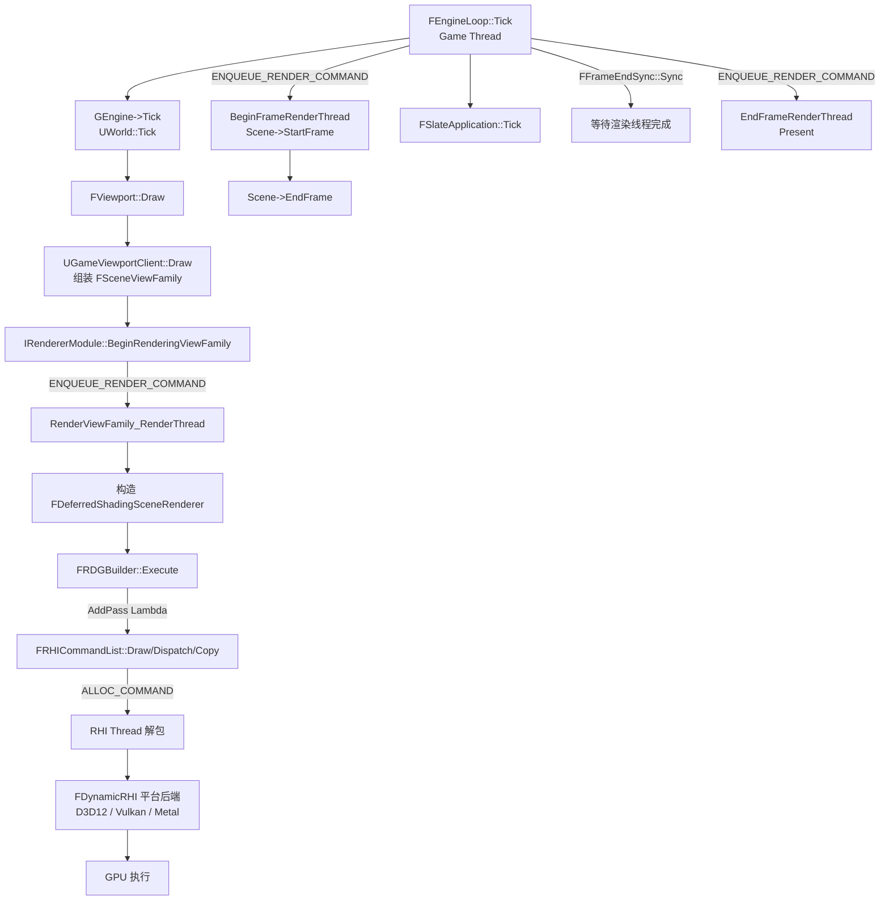

> [← 返回 [[00-UE全解析主索引|UE全解析主索引]]]

# UE 专题：渲染一帧的生命周期

## Why：为什么要梳理渲染一帧的生命周期？

- **渲染是游戏引擎最核心的输出管道**：从逻辑更新到像素上屏，涉及 Game Thread、Render Thread、RHI Thread 乃至 GPU 的跨线程协作，任何一个环节的阻塞都会直接表现为掉帧。
- **UE 渲染代码体量巨大且高度分层**：`Engine` → `Renderer` → `RenderCore` → `RHI` → `Driver`，不建立端到端的地图，很容易在单模块中迷失。
- **自研引擎可迁移经验**：UE 的 **Render Graph（RDG）**、**命令列表序列化**、**多线程提交模型** 是现代引擎渲染架构的标杆设计，梳理其全链路有助于提取通用的帧管线和资源生命周期管理经验。

---

## What：一帧渲染涉及哪些模块与接口？

### 模块地图

渲染一帧横向跨越 4 个核心运行时模块，按调用顺序如下：

| 层级 | 模块 | 核心职责 | 关键目录 |
|------|------|---------|---------|
| Game Thread | `Engine` | 世界 Tick、视口管理、组装 ViewFamily | `Runtime/Engine/` |
| Game → Render 桥接 | `Engine` + `Renderer` | 视口 Draw、调用 `IRendererModule` | `Runtime/Engine/Private/UnrealClient.cpp` |
| Render Thread | `Renderer` + `RenderCore` | 场景裁剪、Pass 调度、RenderGraph 执行 | `Runtime/Renderer/Private/`、`Runtime/RenderCore/Public/` |
| RHI / Driver | `RHI` + `D3D12RHI`/`VulkanRHI` | 命令列表序列化、多后端切换、GPU 提交、Present | `Runtime/RHI/Public/`、`Runtime/D3D12RHI/` 等 |

### 第一层：Game Thread 帧边界（FEngineLoop::Tick）

> 文件：`Engine/Source/Runtime/Launch/Private/LaunchEngineLoop.cpp`，第 5686~5711 行

每帧开始，`FEngineLoop::Tick` 在 **Game Thread** 上向 Render Thread 入队 RHI BeginFrame 与 Scene StartFrame：

```cpp
// beginning of RHI frame
ENQUEUE_RENDER_COMMAND(BeginFrame)([CurrentFrameCounter](FRHICommandListImmediate& RHICmdList)
{
    BeginFrameRenderThread(RHICmdList, CurrentFrameCounter);
});

for (FSceneInterface* Scene : GetRendererModule().GetAllocatedScenes())
{
    ENQUEUE_RENDER_COMMAND(FScene_StartFrame)([Scene](FRHICommandListImmediate& RHICmdList)
    {
        Scene->StartFrame();
    });
}
```

- `ENQUEUE_RENDER_COMMAND` 是 Game Thread 向 Render Thread 发送命令的核心宏。
- `BeginFrameRenderThread` 标记 RHI 帧起点，初始化 GPU 时间戳查询。
- `FSceneInterface::StartFrame()` 通知场景渲染器开始新的一帧。

### 第二层：视口渲染请求（FViewport::Draw）

> 文件：`Engine/Source/Runtime/Engine/Private/UnrealClient.cpp`，第 1707~1798 行

当 `FSlateApplication` 或引擎决定重绘视口时，触发 `FViewport::Draw`：

```cpp
void FViewport::Draw(bool bShouldPresent /*= true*/)
{
    // 1. 向渲染线程入队 BeginRenderFrame
    EnqueueBeginRenderFrame();

    // 2. 调用视口客户端绘制（如 UGameViewportClient）
    if (ViewportClient)
    {
        ViewportClient->Draw(this, &Canvas);
    }

    // 3. 将 FCanvas 上的 2D 元素提交到渲染线程
    Canvas.Flush_GameThread();

    // 4. 向渲染线程入队 EndRenderFrame（含 Present 决策）
    EnqueueEndRenderFrame(bShouldPresent);
}
```

### 第三层：IRendererModule 的桥接接口

> 文件：`Engine/Source/Runtime/RenderCore/Public/RendererInterface.h`，第 685~691 行

```cpp
class IRendererModule : public IModuleInterface
{
public:
    /** Call from the game thread to send a message to the rendering thread to being rendering this view family. */
    virtual void BeginRenderingViewFamily(FCanvas* Canvas, FSceneViewFamily* ViewFamily) = 0;
    // ...
};
```

`UGameViewportClient::Draw` 组装好 `FSceneViewFamily` 后，通过 `GetRendererModule().BeginRenderingViewFamily(...)` 将渲染请求提交到 **Render Thread**。

### 第四层：FSceneInterface 的渲染抽象

> 文件：`Engine/Source/Runtime/Engine/Public/SceneInterface.h`，第 105~136 行

```cpp
class FSceneInterface
{
public:
    virtual void AddPrimitive(UPrimitiveComponent* Primitive) = 0;
    virtual void RemovePrimitive(UPrimitiveComponent* Primitive) = 0;
    virtual void UpdateAllPrimitiveSceneInfos(FRDGBuilder& GraphBuilder, ...) = 0;
    virtual void StartFrame() {}
    virtual void EndFrame(FRHICommandListImmediate& RHICmdList) {}
    virtual FScene* GetRenderScene() = 0;
    // ...
};
```

`FSceneInterface` 是 **Game Thread 与 Render Thread 之间的场景数据契约**：Game Thread 通过它增删图元、更新变换；Render Thread 在内部持有 `FScene` 实现，驱动实际渲染。

### 第五层：RenderGraph（RDG）公共接口

> 文件：`Engine/Source/Runtime/RenderCore/Public/RenderGraphBuilder.h`，第 47~217 行

```cpp
class FRDGBuilder : public FRDGScopeState
{
public:
    FRDGBuilder(FRHICommandListImmediate& RHICmdList, FRDGEventName Name = {}, ...);

    FRDGTextureRef CreateTexture(const FRDGTextureDesc& Desc, const TCHAR* Name, ...);
    FRDGBufferRef  CreateBuffer (const FRDGBufferDesc&  Desc, const TCHAR* Name, ...);

    template <typename ParameterStructType, typename ExecuteLambdaType>
    FRDGPassRef AddPass(FRDGEventName&& Name, const ParameterStructType* ParameterStruct,
                        ERDGPassFlags Flags, ExecuteLambdaType&& ExecuteLambda);

    RENDERCORE_API void Execute();
    // ...
};
```

- `FRDGBuilder` 是 **Render Thread 上构建一帧 GPU 工作负载的核心工厂**。
- `AddPass` 将 Lambda（内含 `FRHICommandList::DrawPrimitive` / `DispatchComputeShader` 等）注册为延迟执行的 Pass。
- `Execute()` 编译图：裁剪未引用 Pass、合并 RenderPass、自动插入资源 Barrier、分配实际 GPU 内存，然后顺序或并行执行。

### 第六层：RHI 命令列表抽象

> 文件：`Engine/Source/Runtime/RHI/Public/RHICommandList.h`

```cpp
// 继承链：FRHICommandListBase → FRHIComputeCommandList → FRHICommandList → FRHICommandListImmediate
class FRHICommandList : public FRHIComputeCommandList
{
public:
    void DrawPrimitive(uint32 BaseVertexIndex, uint32 NumPrimitives, uint32 NumInstances);
    void DrawIndexedPrimitive(FRHIBuffer* IndexBuffer, ...);
    void DispatchComputeShader(uint32 ThreadGroupCountX, uint32 Y, uint32 Z);
    void CopyTexture(FRHITexture* Source, FRHITexture* Dest, const FRHICopyTextureInfo&);
    void BeginRenderPass(const FRHIRenderPassInfo& InInfo, const TCHAR* Name);
    void EndRenderPass();
    void SetGraphicsPipelineState(...);
    // ...
};
```

- `FRHICommandList` 是 **Render Thread 向 RHI Thread / GPU 提交工作的统一抽象**。
- 若 `RHIThread` 启用，命令被序列化到内部缓冲区，由 RHI Thread 解包并调用平台后端（D3D12 / Vulkan / Metal）。
- `FRHICommandListImmediate` 可直接提交，绕过延迟队列，用于帧边界等必须即时生效的场景。

---

## How - Structure：数据层与内存流转

### 1. 视图描述体系：从 FSceneViewFamily 到 FViewInfo

渲染一帧的起点是**视图（View）**描述。UE 采用三级视图描述，逐层富化：

| 类 | 所在模块 | 关键成员 | 职责 |
|----|---------|---------|------|
| `FSceneViewFamily` | `Engine` | `TArray<const FSceneView*> Views`、`FEngineShowFlags`、`FRenderTarget* RenderTarget`、`ISceneViewExtension` | 描述一帧需要一起渲染的所有视图（主视角、分屏、左右眼、场景捕获） |
| `FSceneView` | `Engine` | `FViewMatrices ViewMatrices`、`FIntRect UnscaledViewRect`、`FFinalPostProcessSettings`、`FConvexVolume ViewFrustum` | 单个摄像机的视图矩阵、投影、视锥、后处理设置 |
| `FViewInfo` | `Renderer`（继承 FSceneView） | `FIntRect ViewRect`、`FSceneBitArray PrimitiveVisibilityMap`、`TArray<FPrimitiveViewRelevance> PrimitiveViewRelevanceMap`、`FParallelMeshDrawCommandPass*`、`FRDGTextureRef HZB` | Render Thread 上的**富化视图**：含裁剪结果、MeshDraw 命令、历史帧信息、各高级特性（Lumen、HairStrands）的视图级资源 |

> 文件：`Engine/Source/Runtime/Engine/Public/SceneView.h`（FSceneViewFamily / FSceneView）
> 文件：`Engine/Source/Runtime/Renderer/Private/SceneRendering.h`（FViewInfo）

**内存来源**：
- `FSceneViewFamily` 与 `FSceneView` 通常在 **Game Thread** 的栈或 `FMemStack` 上临时构建。
- `FViewInfo` 在 **Render Thread** 上通过 `FSceneRenderingAllocator`（基于 `TConcurrentLinearAllocator` 的块分配器）批量分配，帧末一次性释放。

### 2. 场景渲染器类层次

> 文件：`Engine/Source/Runtime/Renderer/Private/SceneRendering.h`

```
ISceneRenderer
    └── FSceneRendererBase
            └── FSceneRenderer          ← 公共基类，持有 ViewFamily、阴影系统、深度预通道信息
                    ├── FDeferredShadingSceneRenderer   (PC/主机延迟管线)
                    └── FMobileSceneRenderer            (移动端前向/延迟管线)
```

- `FSceneRenderer` 是**一帧渲染的核心状态容器**，它在 `BeginRenderingViewFamily` 的 Render Thread 回调中被构造，在 `Render()` 完成后销毁。
- 其生命周期严格绑定在单帧 Render Thread 执行区间内，不跨帧存活。

### 3. RenderGraph 资源体系

> 文件：`Engine/Source/Runtime/RenderCore/Public/RenderGraphResources.h`、`RenderGraphBuilder.h`

| 类 | 说明 |
|----|------|
| `FRDGTexture` / `FRDGBuffer` | 仅持有资源描述符（尺寸、格式、Mip、Usage），实际 GPU 内存延迟到 `Execute()` 时分配 |
| `FRDGTextureSRV/UAV` `FRDGBufferSRV/UAV` | 着色器资源视图 / 无序访问视图，绑定在 Pass 参数结构体中 |
| `FRDGPass` | 由 `AddPass` 内部创建，记录 Lambda、参数、依赖、Flag（Raster/Compute/Copy/AsyncCompute） |

**内存管理策略**：
- **延迟分配**：`CreateTexture` 不立刻分配 GPU 内存，由 `FRDGBuilder::Execute()` 根据活跃 Pass 的引用区间计算最小生存期，并从 `FPooledRenderTarget` 池或临时分配器获取。
- **自动 Alias**：无重叠使用的纹理可复用同一块 GPU 内存（由 RDG 的 transient resource aliasing 决定）。
- **Barrier 自动推导**：Pass 参数通过 `_RDG` 宏标记读写状态，RDG 在 Pass Prologue/Epilogue 自动插入 `Transition`。

### 4. RHI 资源与命令缓冲

> 文件：`Engine/Source/Runtime/RHI/Public/RHIResources.h`、`RHICommandList.h`

| 类 | 职责 |
|----|------|
| `FRHIResource` | 所有 RHI 资源的基类，原子引用计数 + 延迟删除 |
| `FRHITexture` / `FRHIBuffer` | GPU 纹理 / 缓冲区抽象 |
| `FRHIShader` / `FRHIGraphicsPipelineState` | 着色器与 PSO |
| `FRHIViewport` | 视口 / SwapChain 抽象，`GetNativeSwapChain()` 获取平台句柄 |

**命令序列化机制**：
- `FRHICommandList` 内部维护一个 **命令缓冲区**（`TChunkedArray<FRHICommandBase*>`）。
- `ALLOC_COMMAND(FRHICommandDrawPrimitive)` 将命令 + 参数打包成结构体，追加到缓冲区。
- 若 `GIsThreadedRendering && !Bypass()`，RHI Thread 从缓冲区消费命令并翻译为 `ID3D12GraphicsCommandList` / `vkCmd*` 等平台调用。

---

## How - Behavior：逻辑层与调用链追踪

### 一帧渲染的完整调用链（Game Thread → Render Thread → RHI Thread → GPU）



### 阶段 1：Game Thread 帧起点（FEngineLoop::Tick）

> 文件：`Engine/Source/Runtime/Launch/Private/LaunchEngineLoop.cpp`，第 5686~5711 行

```cpp
// (1) RHI BeginFrame
ENQUEUE_RENDER_COMMAND(BeginFrame)([CurrentFrameCounter](FRHICommandListImmediate& RHICmdList)
{
    BeginFrameRenderThread(RHICmdList, CurrentFrameCounter);
});

// (2) 所有场景 StartFrame
for (FSceneInterface* Scene : GetRendererModule().GetAllocatedScenes())
{
    ENQUEUE_RENDER_COMMAND(FScene_StartFrame)([Scene](FRHICommandListImmediate& RHICmdList)
    {
        Scene->StartFrame();
    });
}
```

- 这两步在 Game Thread 上**只入队、不等待**，渲染线程稍后异步执行。

### 阶段 2：世界 Tick 与视口绘制

> 文件：`Engine/Source/Runtime/Launch/Private/LaunchEngineLoop.cpp`，第 5828 行

```cpp
GEngine->Tick(FApp::GetDeltaTime(), bIdleMode);  // UWorld::Tick 在内部执行
```

在 `GEngine->Tick` 内部，`UGameEngine` 会遍历所有视口并调用 `FViewport::Draw`。

> 文件：`Engine/Source/Runtime/Engine/Private/UnrealClient.cpp`，第 1707 行起

```cpp
void FViewport::Draw(bool bShouldPresent)
{
    EnqueueBeginRenderFrame();      // 入队 BeginDrawingCommand
    if (ViewportClient)
    {
        ViewportClient->Draw(this, &Canvas);  // UGameViewportClient::Draw
    }
    Canvas.Flush_GameThread();      // 2D 元素提交
    EnqueueEndRenderFrame(bShouldPresent);  // 入队 EndDrawingCommand（含 Present）
}
```

### 阶段 3：组装 ViewFamily 并提交渲染

> 文件：`Engine/Source/Runtime/Engine/Private/GameViewportClient.cpp`，第 1411 行起

```cpp
void UGameViewportClient::Draw(FViewport* InViewport, FCanvas* Canvas)
{
    // 1. 为每个 LocalPlayer 计算 SceneView
    for (ULocalPlayer* LocalPlayer : LocalPlayers)
    {
        FSceneViewInitOptions ViewInitOptions;
        LocalPlayer->CalcSceneView(..., &ViewInitOptions);
        // ...
    }

    // 2. 构建 FSceneViewFamilyContext
    FSceneViewFamilyContext ViewFamily(...);
    ViewFamily.Views = ...;

    // 3. 调用渲染模块
    GetRendererModule().BeginRenderingViewFamily(SceneCanvas, &ViewFamily);
}
```

`BeginRenderingViewFamily` 在 **Game Thread** 执行，但内部会再次入队一个 Render Command：

> 文件：`Engine/Source/Runtime/Renderer/Private/SceneRendering.cpp`，第 4895 行附近（推测，实际在 Renderer Module 实现中）

```cpp
static void RenderViewFamily_RenderThread(FRDGBuilder& GraphBuilder,
    FSceneRenderer* Renderer, const FSceneRenderUpdateInputs* SceneUpdateInputs)
{
    if (Renderer->ViewFamily.EngineShowFlags.HitProxies)
    {
        Renderer->RenderHitProxies(GraphBuilder);
    }
    else
    {
        Renderer->Render(GraphBuilder, SceneUpdateInputs);
    }
}
```

### 阶段 4：场景渲染器的主 Render 函数（以延迟渲染器为例）

> 文件：`Engine/Source/Runtime/Renderer/Private/DeferredShadingRenderer.cpp`

`FDeferredShadingSceneRenderer::Render` 是一帧 GPU 工作的**核心调度器**，主要 Pass 顺序如下：

| 顺序 | Pass / 阶段 | 关键函数 | 说明 |
|------|------------|---------|------|
| 0 | 帧前准备 | `OnRenderBegin`、`CommitFinalPipelineState`、GPU Scene 更新 | 同步 Game Thread 提交的场景变更到 Render Thread |
| 1 | 视图初始化 | `BeginInitViews` / `EndInitViews` | 视锥裁剪、动态阴影初始化、HZB 构建 |
| 2 | 深度预通道 | `RenderPrePass` | Early-Z / Depth Prepass，减少后续 BasePass Overdraw |
| 3 | 速度缓冲 | `RenderVelocities` | 记录像素运动向量，用于 TAA / 运动模糊 |
| 4 | Nanite 光栅化 | `RenderNanite` | UE5 虚拟几何体的簇光栅化 |
| 5 | 基础通道 | `RenderBasePass` | 输出 GBufferA/B/C/D + SceneColor/Depth/Velocity |
| 6 | 光照准备 | `GatherAndSortLights`、`PrepareForwardLightData` | 收集光源、构建 Tiled/Clustered 光照数据结构 |
| 7 | 间接光照 & AO | `RenderDiffuseIndirectAndAmbientOcclusion` | Lumen / SSGI / DFAO |
| 8 | 延迟光照 | `RenderLights` | Tiled / Clustered Deferred 逐光源着色 |
| 9 | 反射 & 天光 | `RenderDeferredReflectionsAndSkyLighting` | SSR / Reflection Capture / SkyLight |
| 10 | 体积雾 / 云 / 天空 | `ComputeVolumetricFog`、`RenderVolumetricCloud`、`RenderSkyAtmosphere` | 大气与体积效果 |
| 11 | 半透明 | `RenderTranslucency` | 排序后从后向前绘制 |
| 12 | 后处理 | `AddPostProcessingPasses` | Tonemap、TSR、Bloom、DOF、Lens Flare 等 |
| 13 | 收尾 | `OnRenderFinish`、历史帧提取 | 释放本帧临时资源、提取下一帧需要的历史纹理 |

> **注意**：每个 Pass 内部通过 `FRDGBuilder::AddPass` 注册 Lambda，Lambda 接收 `FRHICommandList&` 并调用 `DrawPrimitive` / `DispatchComputeShader` 等。RDG 在 `Execute()` 时统一编译并执行。

### 阶段 5：RHI 命令入队与多线程下发

> 文件：`Engine/Source/Runtime/RHI/Public/RHICommandList.h`

以 `FRHICommandList::DrawIndexedPrimitive` 为例：

```cpp
void FRHICommandList::DrawIndexedPrimitive(FRHIBuffer* IndexBuffer, ...)
{
    if (Bypass())  // 无 RHI Thread 时直接执行
    {
        GetContext()->RHIDrawIndexedPrimitive(IndexBuffer, ...);
    }
    else
    {
        ALLOC_COMMAND(FRHICommandDrawIndexedPrimitive)(IndexBuffer, ...);
    }
}
```

- **Bypass 模式**：`GIsThreadedRendering == false` 或命令列表标记为 Immediate 时，`FRHICommandList` 直接调用 `IRHICommandContext` 的平台方法。
- **延迟模式**：命令被序列化到 `FRHICommandList` 内部缓冲区，由 **RHI Thread** 消费。

### 阶段 6：平台后端与 GPU 执行

> 文件：`Engine/Source/Runtime/RHI/Public/DynamicRHI.h`

```cpp
extern RHI_API FDynamicRHI* GDynamicRHI;
```

`FDynamicRHI` 是多后端工厂：
- `D3D12RHI`：生成 `ID3D12GraphicsCommandList`，提交到 `ID3D12CommandQueue`。
- `VulkanRHI`：生成 `VkCommandBuffer`，提交到 `VkQueue`。
- `MetalRHI`：生成 `MTLRenderCommandEncoder` / `MTLComputeCommandEncoder`。

### 阶段 7：Present 与帧末同步

> 文件：`Engine/Source/Runtime/Launch/Private/LaunchEngineLoop.cpp`，第 6017~6053 行

```cpp
// 1. 通知所有场景 EndFrame
for (FSceneInterface* Scene : GetRendererModule().GetAllocatedScenes())
{
    ENQUEUE_RENDER_COMMAND(FScene_EndFrame)([Scene](FRHICommandListImmediate& RHICmdList)
    {
        Scene->EndFrame(RHICmdList);
    });
}

// 2. RHI Tick（处理后台任务，如 shader 编译回调）
RHITick(FApp::GetDeltaTime());

// 3. 游戏线程等待渲染线程完成本帧工作
FFrameEndSync::Sync(FFrameEndSync::EFlushMode::EndFrame);
```

> 文件：`Engine/Source/Runtime/Launch/Private/LaunchEngineLoop.cpp`，第 6131~6136 行

```cpp
// 4. RHI EndFrame（内部触发 Present）
ENQUEUE_RENDER_COMMAND(EndFrame)([CurrentFrameCounter](FRHICommandListImmediate& RHICmdList)
{
    EndFrameRenderThread(RHICmdList, CurrentFrameCounter);
});
```

`EndFrameRenderThread` 内部会调用 `FRHICommandListImmediate::EndDrawingViewport`，最终调用平台后端的 `SwapChain->Present()` 或等效操作。

---

## 多线程交互与同步原语

### 三条核心线程

| 线程 | 职责 | 与下层的交互 |
|------|------|-------------|
| **Game Thread** | 逻辑 Tick、组装 ViewFamily、场景变更（Add/Remove/Update Primitive） | 通过 `ENQUEUE_RENDER_COMMAND` 向 Render Thread 发命令；不直接触碰 RHI |
| **Render Thread** | 执行 `FSceneRenderer::Render`、构建 RDG、调用 `FRHICommandList` | 向 RHI Thread 发送序列化命令；或 Bypass 直接调用平台 API |
| **RHI Thread** | 解包 `FRHICommand`、翻译为 D3D12/Vulkan/Metal 调用、提交 CommandList | 与 GPU 驱动交互，可能进一步生成驱动内部线程 |

### 关键同步点

1. **`FFrameEndSync::Sync(EndFrame)`**（`LaunchEngineLoop.cpp:6053`）
   - Game Thread 在帧末阻塞等待 Render Thread 完成所有已入队命令。
   - 这是**帧率上限的决定性同步点**：若 Render Thread 一帧耗时 20ms，Game Thread 也会在此等待 20ms，导致 `DeltaTime` 同步。

2. **`FlushRenderingCommands()`**
   - 强制阻塞 Game Thread，等待所有渲染命令执行完毕。用于关卡流送、资源加载完成后的安全点。

3. **`FRHICommandListImmediate::ImmediateFlush()`**
   - 在 Render Thread 上强制刷新命令到 RHI Thread / GPU，用于需要 GPU 结果的回读（Readback）场景。

4. **RDG 内部同步**
   - `AddPassDependency(Producer, Consumer)` 可显式建立 Pass 间同步。
   - AsyncCompute Pass 通过 `ERDGPassFlags::AsyncCompute` 标记，RDG 自动调度与 Graphics Pass 的并发与屏障。

---

## 设计亮点与可迁移经验

### 1. 三层命令队列模型（Game → Render → RHI → GPU）

UE 没有让 Game Thread 直接调用图形 API，而是通过 **两层异步队列** 解耦：
- **Game → Render**：`ENQUEUE_RENDER_COMMAND` 宏，Lambda 捕获 Game Thread 状态，延迟到 Render Thread 执行。
- **Render → RHI**：`FRHICommandList` 序列化，延迟到 RHI Thread 执行。

**可迁移经验**：自研引擎可采用类似的 **双层或三层提交模型**，让逻辑线程零阻塞地生成渲染工作负载，由专门的线程负责 API 调用与 GPU 提交。

### 2. Render Graph（RDG）的声明式资源管理

RDG 的核心理念：**先描述，后执行**。
- Pass 先注册，资源仅声明描述符，不立即分配。
- `Execute()` 时统一做：图裁剪、资源 Alias、Barrier 推导、RenderPass 合并。

**可迁移经验**：引入类似的 **帧图（Frame Graph）** 系统，可大幅降低手动管理 `ResourceBarrier` 和 `RenderPass` 的复杂度，同时天然支持 transient resource aliasing 以节省显存。

### 3. FSceneRenderingAllocator：渲染线程的帧级线性分配器

渲染线程上的大量小对象（`FViewInfo`、`FMeshDrawCommand`、`FVisibleLightViewInfo`）使用 `TConcurrentLinearAllocator` 批量分配，帧末一次性释放。

**可迁移经验**：为渲染线程引入 **无锁线性分配器（Lock-free Linear Allocator）**，避免每帧大量 `new/delete` 的碎片化和线程竞争。

### 4. 视图族（ViewFamily）与多视图复用

`FSceneViewFamily` 将多个相关视图（分屏、立体渲染、场景捕获）绑定到同一帧渲染，共享裁剪结果和场景纹理。

**可迁移经验**：在设计渲染入口时，以 **ViewFamily** 而非单个 Camera 为调度单元，可减少重复的场景遍历和光源收集。

### 5. 渲染模块的插件化接口（IRendererModule）

`IRendererModule` 作为纯虚接口，使 `Engine` 模块不依赖 `Renderer` 模块的具体实现，仅通过 `FSceneViewFamily` 和 `FSceneInterface` 交互。

**可迁移经验**：引擎核心与渲染器之间通过 **窄接口 + 数据驱动** 的方式解耦，便于后续替换或并行开发多套渲染管线（如前向 / 延迟 / 移动端）。

---

## 关键源码速查表

| 关注点 | 文件路径 | 行号范围 |
|--------|---------|---------|
| 引擎帧 Tick 与 BeginFrame | `Engine/Source/Runtime/Launch/Private/LaunchEngineLoop.cpp` | 5686~5711 |
| 引擎帧 Tick 与 EndFrame / Sync | `Engine/Source/Runtime/Launch/Private/LaunchEngineLoop.cpp` | 6017~6136 |
| 视口 Draw 入口 | `Engine/Source/Runtime/Engine/Private/UnrealClient.cpp` | 1707~1798 |
| 游戏视口客户端组装 ViewFamily | `Engine/Source/Runtime/Engine/Private/GameViewportClient.cpp` | 1411 起 |
| 场景接口公共接口 | `Engine/Source/Runtime/Engine/Public/SceneInterface.h` | 105 起 |
| 渲染模块公共接口 | `Engine/Source/Runtime/RenderCore/Public/RendererInterface.h` | 685~691 |
| 场景渲染器基类与 FViewInfo | `Engine/Source/Runtime/Renderer/Private/SceneRendering.h` | 1 起 |
| 延迟渲染器主 Render | `Engine/Source/Runtime/Renderer/Private/DeferredShadingRenderer.cpp` | Render 函数 |
| RenderGraph 构建器 | `Engine/Source/Runtime/RenderCore/Public/RenderGraphBuilder.h` | 47 起 |
| RHI 命令列表 | `Engine/Source/Runtime/RHI/Public/RHICommandList.h` | 1 起 |
| RHI 资源定义 | `Engine/Source/Runtime/RHI/Public/RHIResources.h` | 1 起 |
| 动态 RHI 多后端 | `Engine/Source/Runtime/RHI/Public/DynamicRHI.h` | 1 起 |

---

## 关联阅读

- [[UE-Engine-源码解析：Tick 调度与分阶段更新]] — Game Thread 上的世界 Tick 机制
- [[UE-Engine-源码解析：World 与 Level 架构]] — UWorld 与 FScene 的对应关系
- [[UE-Engine-源码解析：相机与视锥剔除]] — FSceneView 的构建与裁剪
- [[UE-RenderCore-源码解析：渲染图与渲染线程]] — RDG 内部实现细节（待产出）
- [[UE-RHI-源码解析：RHI 抽象层与多后端切换]] — RHI 命令序列化与平台后端（待产出）
- [[UE-专题：多线程与任务系统]] — Core Tasks / Async / RenderThread 的完整线程模型（待产出）

---

## 索引状态

- **所属阶段**：第八阶段 — 跨领域专题深度解析
- **对应笔记**：`UE-专题：渲染一帧的生命周期`
- **本轮分析完成度**：✅ 已完成三层分析（接口层 → 数据层 → 逻辑层）
- **备注**：本笔记以 UE5 延迟渲染管线（Deferred Shading）为主干梳理，移动端 `FMobileSceneRenderer` 的 Pass 顺序有所不同，可后续补充对照。
