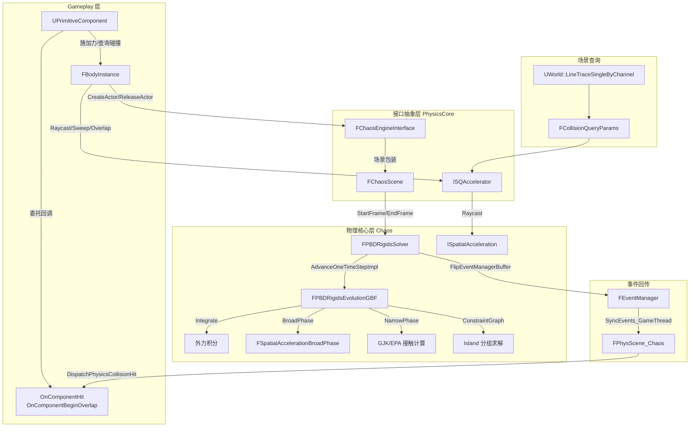
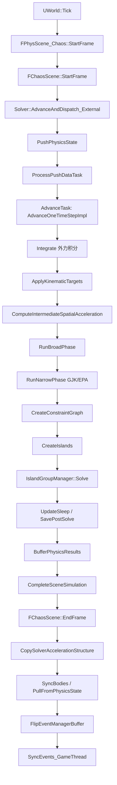

> [[00-UE全解析主索引|← 返回 UE全解析主索引]]

# UE-专题：物理模拟与碰撞检测

## Why：为什么要理解物理模拟与碰撞检测链路？

物理模拟与碰撞检测是游戏引擎中横跨模块最多、线程交互最复杂的子系统之一。在 UE5 中，一条看似简单的 `LineTraceSingle` 或一次 `OnComponentHit` 事件，实际上穿越了 **Engine → PhysicsCore → Chaos → SceneQuery → Gameplay** 五个层级，涉及 Game Thread（GT）与 Physics Thread（PT）的双向同步。

理解这条链路的意义在于：
- **性能优化**：知道 BroadPhase / NarrowPhase 的触发时机，才能合理设置 Collision Profile 和 Bounds 扩展策略。
- **Bug 定位**：物理事件丢失、穿透、查询不准确等问题，往往根因在于 GT/PT 同步时序或空间加速结构版本不一致。
- **架构迁移**：PhysicsCore 的抽象层设计是 UE 从 PhysX 平滑迁移到 Chaos 的关键，这种"后端解耦"思路可直接迁移到自研引擎。
- **网络同步**：物理预测回滚（Rewind/Resim）依赖对 Solver 帧生命周期和 Replication Cache 的精确理解。

---

## What：链路总览



---

## 第 1 层：接口层（What）

### 1.1 Engine 层物理接口

#### UPrimitiveComponent：物理组件基类

> 文件：`Engine/Source/Runtime/Engine/Classes/Components/PrimitiveComponent.h`，第 1394~1420 行

```cpp
class ENGINE_API UPrimitiveComponent : public USceneComponent
{
    // 物理碰撞事件委托
    FComponentHitSignature OnComponentHit;               // 碰撞瞬间触发
    FComponentBeginOverlapSignature OnComponentBeginOverlap;  // 开始重叠
    FComponentEndOverlapSignature OnComponentEndOverlap;      // 结束重叠

    // 场景查询接口
    bool LineTraceComponent(FHitResult& OutHit, ...);
    bool OverlapComponent(const FCollisionShape& CollisionShape, ...);
};
```

`UPrimitiveComponent` 是所有带物理属性组件的基类。它本身不直接持有物理数据，而是通过 `FBodyInstance` 间接操作物理后端。

#### UBodySetup / UBodySetupCore：碰撞体配置

> 文件：`Engine/Source/Runtime/Engine/Classes/PhysicsEngine/BodySetup.h`，第 127~286 行
> 文件：`Engine/Source/Runtime/PhysicsCore/Public/BodySetupCore.h`

`UBodySetupCore` 定义碰撞体的静态配置：
- `BoneName`：骨骼名（用于 SkeletalMesh 多体物理）
- `CollisionTraceFlag`：`CTF_UseDefault` / `CTF_UseSimpleAndComplex` / `CTF_UseSimpleAsComplex`
- `PhysicsType`：`PhysType_Default` / `PhysType_Kinematic` / `PhysType_Simulated`

`UBodySetup` 在 Engine 层扩展了 `UBodySetupCore`，增加了 `AggGeom`（聚合几何：Sphere/Sphyl/Box/Convex/TriMesh），是 `UStaticMesh` / `USkeletalMesh` 等资产的物理数据容器。

#### FBodyInstance：运行时物理实例

> 文件：`Engine/Source/Runtime/Engine/Classes/PhysicsEngine/BodyInstance.h`，第 309~697 行

```cpp
struct FBodyInstance
{
    FPhysicsActorHandle Proxy = nullptr;   // 指向 FSingleParticlePhysicsProxy 的句柄
    TWeakObjectPtr<UPrimitiveComponent> OwnerComponent;
    uint8 bSimulatePhysics : 1;
    uint8 bNotifyRigidBodyCollision : 1;   // 是否注册碰撞事件
    // ...
    ENGINE_API FPhysicsActorHandle GetPhysicsActor() const;
    ENGINE_API void SetPhysicsActor(FPhysicsActorHandle InHandle);
};
```

`FBodyInstance` 是 Engine 层与 PhysicsCore 交互的核心结构。每个 `UPrimitiveComponent` 在注册物理时创建一个 `FBodyInstance`，后者通过 `Proxy` 字段持有 `FSingleParticlePhysicsProxy*`。

#### UPhysicalMaterial：物理材质

> 文件：`Engine/Source/Runtime/PhysicsCore/Public/PhysicalMaterial.h`

`UPhysicalMaterial` 定义摩擦系数（Friction）、恢复系数（Restitution）和密度（Density）。在 `InitBody` 阶段，材质属性被转换为 `Chaos::FChaosPhysicsMaterial` 并绑定到 Shape 上。

### 1.2 PhysicsCore 抽象层

#### FChaosEngineInterface：静态接口层

> 文件：`Engine/Source/Runtime/PhysicsCore/Public/Chaos/ChaosEngineInterface.h`，第 346~592 行

`FChaosEngineInterface` 提供与后端解耦的静态接口，所有方法标注 `_AssumesLocked`，表示调用者需确保已持有物理锁。核心方法包括：
- `CreateActor` / `ReleaseActor`：Actor 生命周期
- `SetGlobalPose_AssumesLocked` / `GetGlobalPose_AssumesLocked`：位姿读写
- `AddForce_AssumesLocked` / `AddImpulse_AssumesLocked`：力与冲量
- `SetIsKinematic_AssumesLocked`：切换运动学状态

详见 [[UE-PhysicsCore-源码解析：物理抽象与接口]]。

#### FChaosScene：Chaos 场景包装器

> 文件：`Engine/Source/Runtime/PhysicsCore/Public/Chaos/ChaosScene.h`
> 文件：`Engine/Source/Runtime/PhysicsCore/Private/ChaosScene.cpp`

`FChaosScene` 封装 `Chaos::FPhysicsSolver` 的生命周期与帧同步：
- `StartFrame()`：GT 提交物理模拟任务到 TaskGraph
- `WaitPhysScenes()`：阻塞 GT 等待 PT 完成
- `EndFrame()`：拷贝空间加速结构、SyncBodies、翻转事件缓冲
- `Flush()`：强制同步，用于编辑器场景查询

#### 类型别名系统

> 文件：`Engine/Source/Runtime/PhysicsCore/Public/PhysicsInterfaceDeclaresCore.h`

```cpp
using FPhysicsActorHandle      = Chaos::FSingleParticlePhysicsProxy*;
using FPhysicsShapeHandle      = Chaos::FPerShapeData*;
using FPhysicsGeometry         = Chaos::FImplicitObject;
using FPhysicsConstraintHandle = FPhysicsConstraintReference_Chaos;
```

这种"句柄即裸指针 + 类型别名"的模式，让 Engine 层无需包含 Chaos 头文件即可操作物理对象。

### 1.3 Chaos 核心层

#### 粒子体系

> 文件：`Engine/Source/Runtime/Experimental/Chaos/Public/Chaos/GeometryParticles.h`，第 150~680 行
> 文件：`Engine/Source/Runtime/Experimental/Chaos/Public/Chaos/PBDRigidParticles.h`

```
TGeometryParticle        (静态几何)
  └── TKinematicGeometryParticle  (运动学)
        └── TPBDRigidParticle     (刚体)
              └── TPBDRigidClusteredParticle  (聚集刚体/破碎)
```

粒子属性以 **SOA（Structure of Arrays）** 存储在 `TGeometryParticlesImp` 中，每个属性对应独立的 `TArrayCollectionArray`。

#### FPBDRigidsEvolutionGBF：GBF 求解器

> 文件：`Engine/Source/Runtime/Experimental/Chaos/Public/Chaos/PBDRigidsEvolutionGBF.h`，第 50~374 行
> 文件：`Engine/Source/Runtime/Experimental/Chaos/Private/Chaos/PBDRigidsEvolutionGBF.cpp`，第 528~854 行

每帧调用 `AdvanceOneTimeStepImpl`，按顺序执行：Integrate → BroadPhase → NarrowPhase → ConstraintGraph → Island Solve → UpdateSleep。

详见 [[UE-Chaos-源码解析：Chaos 物理引擎]]。

#### FSpatialAccelerationBroadPhase：空间加速 BroadPhase

> 文件：`Engine/Source/Runtime/Experimental/Chaos/Public/Chaos/Collision/SpatialAccelerationBroadPhase.h`，第 334~400 行

```cpp
class FSpatialAccelerationBroadPhase
{
    using FAccelerationStructure = ISpatialAcceleration<FAccelerationStructureHandle, FReal, 3>;
    void RunBroadPhase(...);
    void RunNarrowPhase(...);
};
```

BroadPhase 使用 `ISpatialAccelerationCollection`（默认 Dynamic AABB Tree）找出潜在碰撞对；NarrowPhase 对每对调用 GJK/EPA 计算精确接触点。

#### FPBDCollisionConstraint：碰撞约束

> 文件：`Engine/Source/Runtime/Experimental/Chaos/Public/Chaos/Collision/PBDCollisionConstraint.h`，第 224~1000 行

碰撞约束包含碰撞双方粒子、隐式几何、Shape 实例、Manifold 接触点集合和动态材质属性。约束通过 `FCollisionConstraintAllocator` 堆分配，支持 Warm Starting。

#### FFieldSystem：力场系统

> 文件：`Engine/Source/Runtime/Experimental/Chaos/Public/Chaos/Field/FieldSystem.h`

`FFieldNodeBase` 构成节点图，每帧评估后对破碎体或刚体施加力/触发断裂。详见 Chaos 笔记。

### 1.4 SceneQuery 场景查询

#### FCollisionQueryParams

> 文件：`Engine/Source/Runtime/Engine/Public/CollisionQueryParams.h`，第 42~80 行

```cpp
struct FCollisionQueryParams
{
    FName TraceTag;
    bool bTraceComplex;           // 是否查询复杂碰撞（三角网格）
    bool bFindInitialOverlaps;    // 是否报告初始重叠
    bool bReturnFaceIndex;        // 返回命中三角面索引
    bool bReturnPhysicalMaterial; // 返回物理材质
    bool bIgnoreBlocks;           // 忽略 Blocking 结果
    bool bIgnoreTouches;          // 忽略 Overlap 结果
    EQueryMobilityType MobilityType;
    TArray<FWeakObjectPtr<UPrimitiveComponent>> IgnoreComponents;
};
```

#### LineTrace / Sweep / Overlap 接口

> 文件：`Engine/Source/Runtime/Engine/Classes/Engine/World.h`，第 2069 行附近
> 文件：`Engine/Source/Runtime/Engine/Private/Collision/WorldCollision.cpp`，第 122~135 行

```cpp
bool UWorld::LineTraceSingleByChannel(FHitResult& OutHit, const FVector& Start,
    const FVector& End, ECollisionChannel TraceChannel,
    const FCollisionQueryParams& Params, ...) const
{
    return FPhysicsInterface::RaycastSingle(this, OutHit, Start, End,
        TraceChannel, Params, ResponseParam, ObjectQueryParam);
}
```

`UWorld` 的查询接口全部委托给 `FPhysicsInterface` 的静态方法，后者通过 `ISQAccelerator` 调用后端实现。

#### FCollisionShape

```cpp
struct FCollisionShape
{
    ECollisionShape::Type ShapeType;  // Box / Sphere / Capsule / Line
    union { FVector Box; float Sphere; float CapsuleRadius; ... };
};
```

---

## 第 2 层：数据层（How - Structure）

### 2.1 FBodyInstance 的内存布局与状态机

> 文件：`Engine/Source/Runtime/Engine/Classes/PhysicsEngine/BodyInstance.h`，第 309~697 行

`FBodyInstance` 的核心字段布局：

| 字段 | 类型 | 说明 |
|------|------|------|
| `Proxy` | `FPhysicsActorHandle` | 指向 `FSingleParticlePhysicsProxy` 的裸指针 |
| `OwnerComponent` | `TWeakObjectPtr<UPrimitiveComponent>` | 回指所属组件 |
| `BodySetup` | `TWeakObjectPtr<UBodySetup>` | 碰撞体配置原型 |
| `bSimulatePhysics` | `uint8:1` | 是否受模拟驱动 |
| `bNotifyRigidBodyCollision` | `uint8:1` | 是否接收碰撞事件 |
| `InstanceBodyIndex` | `int32` | 在 Aggregate / Welding 中的索引 |
| `ShapeToBodiesMap` | `TMap<FPhysicsShapeHandle, FWeldInfo>` | Welding 子体映射 |

**状态机**：
- `NotAdded` → `InitBody` 中 `CreateShapesAndActors` → `PendingAdd` → `AddActorsToScene_AssumesLocked` → `Added`
- `TermBody` / `StartAsyncTermBody_GameThread` → 从场景移除 → `NotAdded`

### 2.2 Chaos 粒子体系的 SOA 布局

> 文件：`Engine/Source/Runtime/Experimental/Chaos/Public/Chaos/GeometryParticles.h`，第 640~660 行

```cpp
TArrayCollectionArray<FUniqueIdx> MUniqueIdx;
TArrayCollectionArray<TSerializablePtr<FGeometryParticleHandle>> MGeometryParticleHandle;
TArrayCollectionArray<FGeometryParticle*> MGeometryParticle;
TArrayCollectionArray<IPhysicsProxyBase*> MPhysicsProxy;
TArrayCollectionArray<FShapeInstanceArray> MShapesArray;
TArrayCollectionArray<TAABB<T,d>> MLocalBounds;
TArrayCollectionArray<TAABB<T, d>> MWorldSpaceInflatedBounds;
TArrayCollectionArray<FConstraintHandleArray> MParticleConstraints;
TArrayCollectionArray<FParticleCollisions> MParticleCollisions;
TArrayCollectionArray<Private::FPBDIslandParticle*> MGraphNode;
```

SOA 的优势：遍历速度时只访问连续内存的 `V` 数组；可通过 `TParticleView` 构建子集视图；SIMD 友好。

### 2.3 空间加速结构（AABBTree / Grid）

> 文件：`Engine/Source/Runtime/Experimental/Chaos/Public/Chaos/ISpatialAccelerationCollection.h`

Chaos 默认使用 **Dynamic AABB Tree** 作为空间加速结构：
- 静态物体与动态物体分桶存储（由 `AccelerationStructureSplitStaticAndDynamic` CVar 控制）
- QueryOnly 物体可隔离到独立桶（`AccelerationStructureIsolateQueryOnlyObjects`）
- GT 侧在 `EndFrame` 时通过 `CopySolverAccelerationStructure` 拷贝只读副本供场景查询使用

### 2.4 碰撞约束的图着色与求解批次

> 文件：`Engine/Source/Runtime/Experimental/Chaos/Public/Chaos/PBDRigidsEvolution.h`，第 923~945 行
> 文件：`Engine/Source/Runtime/Experimental/Chaos/Public/Chaos/Island/IslandGroupManager.h`，第 76~187 行

```cpp
void CreateConstraintGraph()
{
    IslandManager.UpdateParticles();
    for (FPBDConstraintContainer* Container : ConstraintContainers)
    {
        Container->AddConstraintsToGraph(GetIslandManager());
    }
}

void CreateIslands()
{
    IslandManager.UpdateIslands();
}
```

- **Constraint Graph**：粒子为节点，约束为边
- **Island**：连通子图，彼此独立可并行
- **Island Group**：`FPBDIslandGroupManager::BuildGroups` 均衡分配约束数，通过 `ParallelFor` 并行求解

### 2.5 物理材质属性表

物理材质在 InitBody 阶段被绑定到每个 Shape：
- `Chaos::FChaosPhysicsMaterial` 包含 `Friction`、`Restitution`、`SleepingLinearThreshold` 等
- `FPhysicsUserData::Get<UPhysicalMaterial>(UserData)` 可在查询或事件中将内部材质映射回 UObject

---

## 第 3 层：逻辑层（How - Behavior）

### 3.1 完整物理模拟 Tick 链路



#### UWorld::Tick 触发物理

> 文件：`Engine/Source/Runtime/Engine/Private/World.cpp`

`UWorld::Tick` 在 `FTickableWorldSubsystem` 和 `Level Tick` 之后调用物理更新：

```cpp
// World Tick 中调用物理场景更新
FPhysScene* PhysScene = GetPhysicsScene();
if (PhysScene)
{
    PhysScene->StartFrame();
    // ... GT 继续执行其他逻辑 ...
    PhysScene->EndFrame();
}
```

#### FChaosScene::StartFrame（GT 提交）

> 文件：`Engine/Source/Runtime/PhysicsCore/Private/ChaosScene.cpp`，第 363~387 行

```cpp
void FChaosScene::StartFrame()
{
    const float UseDeltaTime = OnStartFrame(MDeltaTime);
    TArray<FPhysicsSolverBase*> SolverList = GetPhysicsSolvers();
    for(FPhysicsSolverBase* Solver : SolverList)
    {
        if(FGraphEventRef SolverEvent = Solver->AdvanceAndDispatch_External(UseDeltaTime))
        {
            if(SolverEvent.IsValid())
            {
                CompletionEvents.Add(SolverEvent);
            }
        }
    }
}
```

GT 提交后，物理模拟在 PT 异步执行，GT 与 PT 并行。

#### GBF 求解器主循环

> 文件：`Engine/Source/Runtime/Experimental/Chaos/Private/Chaos/PBDRigidsEvolutionGBF.cpp`，第 528~610 行

```cpp
void FPBDRigidsEvolutionGBF::AdvanceOneTimeStepImpl(const FReal Dt, const FSubStepInfo& SubStepInfo)
{
    if(SubStepInfo.Step == 0) { Base::ReleasePendingIndices(); }
    if (PreIntegrateCallback != nullptr) { PreIntegrateCallback(Dt); }
    Integrate(Dt);                                    // 外力积分
    ApplyKinematicTargets(Dt, SubStepInfo.PseudoFraction);
    if (PostIntegrateCallback != nullptr) { PostIntegrateCallback(Dt); }
    UpdateConstraintPositionBasedState(Dt);
    Base::ComputeIntermediateSpatialAcceleration();
    TaskDispatcher.WaitTaskEndSpatial();
    CollisionDetector.GetBroadPhase().SetSpatialAcceleration(InternalAcceleration);
    CollisionDetector.RunBroadPhase(Dt, GetCurrentStepResimCache());
    if (MidPhaseModifiers) { ApplyMidPhaseModifier(Dt); }
    CollisionDetector.RunNarrowPhase(Dt, GetCurrentStepResimCache());
    // ... ConstraintGraph → Island → Solve ...
}
```

#### FChaosScene::EndFrame（GT 同步结果）

> 文件：`Engine/Source/Runtime/PhysicsCore/Private/ChaosScene.cpp`，第 500~577 行

```cpp
void FChaosScene::EndFrame()
{
    check(IsCompletionEventComplete());
    CompletionEvents.Reset();
    CopySolverAccelerationStructure();
    for(FPhysicsSolverBase* Solver : SolverList)
    {
        Solver->CastHelper([&](auto& Concrete)
        {
            SyncBodies(&Concrete);           // PullFromPhysicsState
            Solver->FlipEventManagerBuffer(); // 翻转碰撞事件双缓冲
            Concrete.SyncEvents_GameThread(); // 处理 GT 侧事件回调
            Concrete.SyncQueryMaterials_External();
        });
    }
    OnPhysScenePostTick.Broadcast(this);
}
```

### 3.2 碰撞查询调用链


#### UWorld 层查询入口

> 文件：`Engine/Source/Runtime/Engine/Private/Collision/WorldCollision.cpp`，第 127~130 行

```cpp
bool UWorld::LineTraceSingleByChannel(FHitResult& OutHit, const FVector& Start,
    const FVector& End, ECollisionChannel TraceChannel,
    const FCollisionQueryParams& Params, ...) const
{
    return FPhysicsInterface::RaycastSingle(this, OutHit, Start, End,
        TraceChannel, Params, ResponseParam, ObjectQueryParam);
}
```

#### PhysicsCore 加速器接口

> 文件：`Engine/Source/Runtime/PhysicsCore/Public/SQAccelerator.h`，第 37~58 行

```cpp
class FChaosSQAccelerator
{
public:
    FChaosSQAccelerator(const Chaos::ISpatialAcceleration<...>& InSpatialAcceleration);
    void Raycast(...) const;
    void Sweep(...) const;
    void Overlap(...) const;
private:
    const Chaos::ISpatialAcceleration<...>& SpatialAcceleration;
};
```

`FChaosSQAccelerator::RaycastImp` 使用 `TSQVisitor` 访问空间加速结构，最终调用 `SpatialAcceleration.Raycast(...)`。`Sweep` 和 `Overlap` 通过 `Chaos::Utilities::CastHelper` 对查询几何体做向下类型转换。

#### 查询与模拟共享空间加速结构

关键设计：GT 侧查询使用的 `SpatialAcceleration` 是 `EndFrame` 时从 PT 拷贝的只读副本（`CopySolverAccelerationStructure`），因此查询看到的是上一帧模拟完成后的世界状态，而非当前帧中间状态。这避免了 GT/PT 竞争，但意味着**查询结果有一帧延迟**。

### 3.3 多线程物理：Game Thread vs Physics Thread

> 文件：`Engine/Source/Runtime/Experimental/Chaos/Public/Chaos/Framework/PhysicsSolverBase.h`，第 107~219 行


- **Game Thread**：调用 `StartFrame`、读写 `FBodyInstance`、执行蓝图/Gameplay 逻辑
- **Physics Thread**：执行 `Integrate`、碰撞检测、约束求解
- **同步点**：`WaitPhysScenes` 阻塞 GT；`EndFrame` 中 `PullFromPhysicsState` 将结果写回 `UObject`

`FPhysicsSolverBase` 的线程模式：
- `SingleThread`：全部同步在 GT 执行
- `TaskGraph`：默认异步模式，通过 `FGraphEvent` 顺序依赖调度
- `DedicatedThread`：已废弃

### 3.4 物理事件（OnHit / OnOverlap）的回调机制

#### 注册阶段

> 文件：`Engine/Source/Runtime/Engine/Private/PhysicsEngine/BodyInstance.cpp`，第 1654~1660 行

```cpp
if (BI->bNotifyRigidBodyCollision)
{
    if (UPrimitiveComponent* PrimComp = BI->OwnerComponent.Get())
    {
        FPhysScene_Chaos* LocalPhysScene = PrimComp->GetWorld()->GetPhysicsScene();
        LocalPhysScene->RegisterForCollisionEvents(PrimComp);
    }
}
```

#### 事件收集与翻转

> 文件：`Engine/Source/Runtime/PhysicsCore/Private/ChaosScene.cpp`，第 566 行

Solver 每帧在 `CompleteSceneSimulation` 后将碰撞事件写入 `FEventManager` 的前缓冲。`EndFrame` 中调用 `FlipEventManagerBuffer` 交换前后缓冲，GT 读取后缓冲中的事件。

#### 事件分发

> 文件：`Engine/Source/Runtime/Engine/Private/PhysicsEngine/Experimental/PhysScene_Chaos.cpp`，第 1090~1148 行

```cpp
void FPhysScene_Chaos::HandleCollisionEvents(const Chaos::FCollisionEvent& Event)
{
    TMap<IPhysicsProxyBase*, TArray<int32>> const& PhysicsProxyToCollisionIndicesMap =
        Event.PhysicsProxyToCollisionIndices.PhysicsProxyToIndicesMap;
    Chaos::FCollisionDataArray const& CollisionData = Event.CollisionData.AllCollisionsArray;

    // 遍历注册组件或 Proxy 映射，取交集
    if (PhysicsProxyToCollisionIndicesMap.Num() <= CollisionEventRegistrations.Num())
    {
        for (const auto& Pair : PhysicsProxyToCollisionIndicesMap)
        {
            UPrimitiveComponent* Comp0 = GetOwningComponent<UPrimitiveComponent>(Pair.Key);
            if (Comp0 && CollisionEventRegistrations.Contains(Comp0))
            {
                HandleEachCollisionEvent(Pair.Value, Pair.Key, Comp0, CollisionData, ...);
            }
        }
    }
    else { /* 反向遍历 CollisionEventRegistrations */ }

    DispatchPendingCollisionNotifies();
    HandleGlobalCollisionEvent(CollisionData);
}
```

`DispatchPendingCollisionNotifies` 最终调用 `AActor::DispatchPhysicsCollisionHit`，后者触发 `UPrimitiveComponent::OnComponentHit` 委托。

**性能优化**：事件分发采用"取小遍历"策略——若注册组件数远小于碰撞事件数，则遍历注册列表而非全部碰撞数据。

### 3.5 网络同步物理：FPhysicsReplicationCache

> 文件：`Engine/Source/Runtime/Engine/Public/Physics/PhysicsReplicationCache.h`

```cpp
class FPhysicsReplicationCache
{
    int32 SolverFrame = 0;
    TMap<Chaos::FConstPhysicsObjectHandle, FRigidBodyState> ReplicationCache_External;
    FPhysicsReplicationCacheAsync* AsyncPhysicsReplicationCache;
};

class FPhysicsReplicationCacheAsync : public Chaos::TSimCallbackObject<
    FPhysicsReplicationCacheAsyncInput,
    FPhysicsReplicationCacheAsyncOutput,
    Chaos::ESimCallbackOptions::Presimulate | Chaos::ESimCallbackOptions::PostSolve>
{
    virtual void OnPreSimulate_Internal() override;
    virtual void OnPostSolve_Internal() override;
    TMap<Chaos::FConstPhysicsObjectHandle, FPhysicsReplicationCacheData> ReplicationCache_Internal;
};
```

网络同步物理的数据流：
1. **GT 注册**：`RegisterForReplicationCache(UPrimitiveComponent*)` 将组件加入同步列表
2. **PT 收集**：`OnPostSolve_Internal` 遍历关注粒子，将 `FRigidBodyState`（位置/旋转/速度/睡状态）写入 `ReplicationCache_Internal`
3. **异步回传**：通过 `FSimCallbackOutput` 将数据 Marshal 回 GT
4. **GT 读取**：`GetStateFromReplicationCache` 返回最新缓存状态，供 `FPhysicsReplication` 与服务器状态比对

该设计避免了 GT 直接访问 PT 粒子状态，全部通过 `TSimCallbackObject` 的输入/输出缓冲区进行线程安全交换。

---

## 与上下层的关系

### 上层调用者

| 模块 | 使用方式 |
|------|---------|
| **Gameplay 代码** | `UPrimitiveComponent::AddForce`、`AddImpulse`、`SetPhysicsLinearVelocity` 施加力；`LineTraceSingleByChannel` 查询碰撞 |
| **NavigationSystem** | 通过 `FRecastNavMeshGenerator` 查询物理障碍，生成 NavMesh |
| **CharacterMovement** | `UCharacterMovementComponent` 每帧执行胶囊体 Sweep 检测地面/墙面 |
| **Animation** | `USkeletalMeshComponent` 通过 `FBodyInstance` 驱动物理骨骼（Physics Asset） |

### 下层依赖

| 模块 | 作用 |
|------|------|
| **ChaosCore** | 数学基座：向量、矩阵、隐式几何、SIMD 工具 |
| **RenderCore** | 物理调试绘制（`Chaos::FDebugDrawQueue`） |
| **TaskGraph** | `FPhysicsSolverBase` 依赖 TaskGraph 调度 Push/Advance/Buffer 任务链 |

---

## 设计亮点与可迁移经验

1. **PhysicsCore 的抽象层让 UE 能从 PhysX 平滑迁移到 Chaos**
   `FPhysicsActorHandle` 等类型别名 + `ISQAccelerator` 纯虚接口，使得 Engine 层 20 万行物理相关代码在切换后端时无需修改。自研引擎可采用"句柄即裸指针 + 类型别名"模式隔离底层 ECS/物理后端。

2. **Chaos 的 SOA 粒子布局与图着色求解器优化了缓存和并行性**
   `TGeometryParticlesImp` 的 `TArrayCollectionArray` 实现属性列动态注册，`FPBDIslandGroupManager` 通过约束图切分并行求解。大规模物理场景的性能扩展依赖这一设计。

3. **场景查询与物理模拟共享空间加速结构**
   `CopySolverAccelerationStructure` 在 `EndFrame` 将 PT 加速结构拷贝为 GT 只读副本，避免了查询与模拟的竞争条件。代价是一帧延迟，收益是零锁查询。

4. **物理事件通过委托机制异步回调游戏逻辑**
   `FEventManager` 双缓冲 + `FlipEventManagerBuffer` 确保 PT 写入与 GT 读取互不干扰。`CollisionEventRegistrations` 的"取小遍历"策略是性能敏感场景的典型优化。

5. **网络物理同步的 SimCallbackObject 模式**
   `FPhysicsReplicationCacheAsync` 继承 `TSimCallbackObject`，通过 `OnPreSimulate` / `OnPostSolve` 钩子在 PT 关键节点插入自定义逻辑，数据通过结构化 Input/Output 缓冲跨线程交换。这是自研引擎实现网络物理预测的参考范式。

---

## 关联阅读

- [[UE-PhysicsCore-源码解析：物理抽象与接口]]
- [[UE-Chaos-源码解析：Chaos 物理引擎]]
- [[UE-Engine-源码解析：World 与 Level 架构]]
- [[UE-NavigationSystem-源码解析：导航与寻路]]

---

## 索引状态

- **所属阶段**：第八阶段-跨领域专题
- **对应 UE 笔记**：UE-专题：物理模拟与碰撞检测
- **本轮完成度**：✅ 第三轮（完整三层分析）
- **更新日期**：2026-04-19
