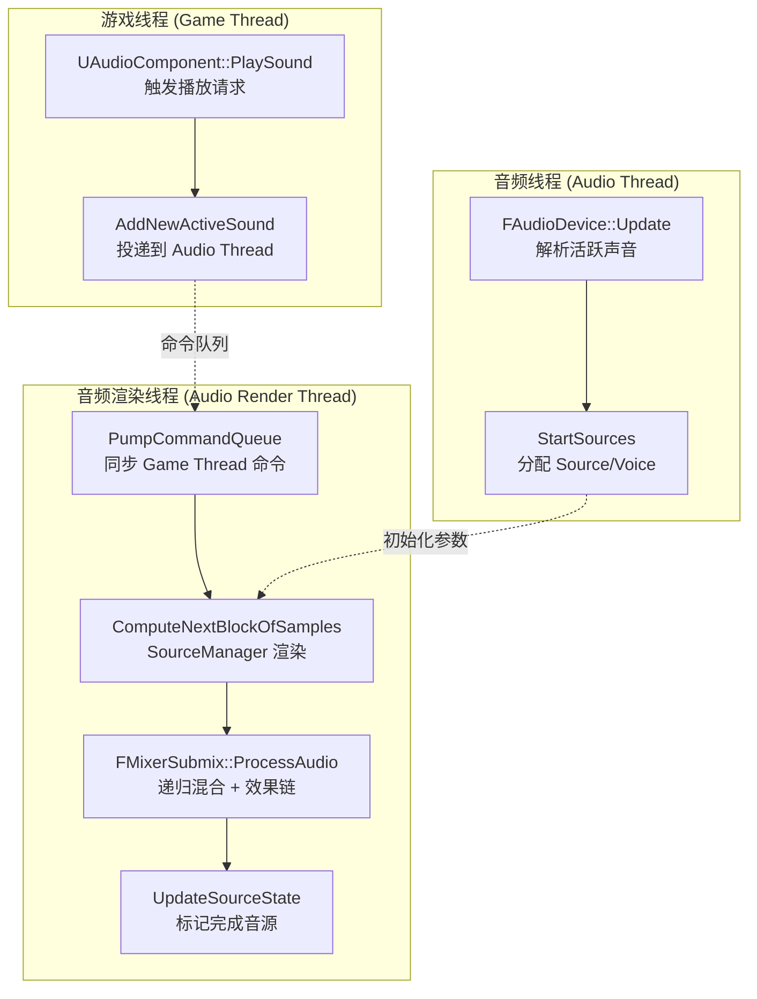

> [← 返回 [[00-UE全解析主索引|UE全解析主索引]]]

# UE-专题：音频混音与空间化

## Why：为什么要理解音频混音与空间化链路？

在 UE 中，播放一个声音表面上是简单的 `PlaySoundAtLocation` 调用，但底层却横跨了 **5 个模块、3 条线程、10+ 个核心类**。如果只看到 `UAudioComponent` 的蓝图接口，就无法理解：

1. **为什么 SoundCue 可以同时播放上百个变体而不崩溃？** —— 节点图 + Payload 分离架构。
2. **为什么硬件只有 64 个 voice，游戏里却能同时存在数百个音源？** —— AudioMixer 的软件混音。
3. **为什么空间音频算法可以无侵入地替换？** —— AudioExtensions 的插件化设计。
4. **为什么 Submix 效果链可以做到实时切换和淡入淡出？** —— 效果链的双缓冲 + 跨帧渐变。

本专题笔记的目标，是将 `Runtime/Engine`、`Runtime/AudioMixer`、`Runtime/AudioMixerCore`、`Runtime/AudioExtensions` 四个模块的源码分析**横向打通**，追踪一个声音从资产到声卡的完整生命周期。

---

## What：链路总览

```mermaid
flowchart LR
    A["USoundCue / USoundWave<br/>Runtime/Engine/Classes/Sound/"] --> B["UAudioComponent::PlaySound<br/>Runtime/Engine/Private/Components/AudioComponent.cpp"]
    B --> C["FAudioDevice::AddNewActiveSound<br/>Runtime/Engine/Private/AudioDevice.cpp"]
    C --> D["FActiveSound::UpdateWaveInstances<br/>Runtime/Engine/Private/ActiveSound.cpp"]
    D --> E["USoundBase::Parse → FWaveInstance[]<br/>Runtime/Engine/Private/SoundCue.cpp"]
    E --> F["FAudioDevice::StartSources<br/>Runtime/Engine/Private/AudioDevice.cpp"]
    F --> G["FMixerSourceManager::InitSource<br/>Runtime/AudioMixer/Private/AudioMixerSourceManager.cpp"]
    G --> H["FMixerSourceManager::ComputeNextBlockOfSamples<br/>Runtime/AudioMixer/Private/AudioMixerSourceManager.cpp"]
    H --> I["FMixerSubmix::ProcessAudio<br/>Runtime/AudioMixer/Private/AudioMixerSubmix.cpp"]
    I --> J["IAudioMixerPlatformInterface::SubmitBuffer<br/>Runtime/AudioMixerCore/Public/AudioMixer.h"]
    J --> K["声卡硬件<br/>XAudio2 / CoreAudio / ALSA"]
```





---

## 第 1 层：接口层（What）

### 1.1 音频资产层（Engine/Sound）

这一层的核心设计在 [[UE-Engine-源码解析：SoundCue 与音频蓝图]] 中有深入分析。关键类包括：

| 类 | 职责 |
|---|---|
| `USoundBase` | 所有可播放音频的抽象基类。定义 `Parse()`、`IsPlayable()`、`GetMaxDistance()`，统一处理 SoundClass、Submix 路由、并发控制和虚拟化。 |
| `USoundCue` | 节点图资产。持有 `FirstNode`，通过递归 `ParseNodes()` 展开为 `FWaveInstance[]`。 |
| `USoundWave` | 原始音频数据。存储解码后的 PCM 或压缩数据（Vorbis/Opus），支持流式加载。 |
| `USoundNode` 体系 | `WavePlayer`（叶节点，唯一产生声音的节点）、`Random`（随机选择）、`Mixer`（多路混合）、`Looping`（逻辑循环）、`Attenuation`（距离衰减）。 |

> 文件：`Engine/Source/Runtime/Engine/Classes/Sound/SoundBase.h`，第 107~418 行
> 文件：`Engine/Source/Runtime/Engine/Classes/Sound/SoundCue.h`，第 89~348 行

### 1.2 音频组件与设备

| 类 | 职责 |
|---|---|
| `UAudioComponent` | 场景中的音频发射器。绑定到 Actor，管理 3D 位置、衰减设置、播放/暂停/停止。 |
| `FActiveSound` | 运行时活跃声音实例。每个 `UAudioComponent` 播放一次对应一个 `FActiveSound`。持有 `SoundNodeData`（Payload 数组）存储节点运行时状态。 |
| `FWaveInstance` | 波形实例。`USoundNodeWavePlayer` 解析后产生，代表一个需要被实际渲染的 `USoundWave` 播放请求。 |
| `FAudioDevice` | 引擎层音频设备抽象。管理 `ActiveSounds` 列表、`Listeners`、虚拟循环、`WaveInstances` 的排序与优先级。 |
| `FMixerDevice` | AudioMixer 混音设备。多重继承 `FAudioDevice`、`IAudioMixer`、`FGCObject`。是连接 Engine 层与 AudioMixer 层的枢纽。 |

### 1.3 AudioMixer 混音管线

这一层的详细分析见 [[UE-AudioMixer-源码解析：音频核心与混音]]。核心类：

| 类 | 职责 |
|---|---|
| `Audio::FMixerDevice` | 混音设备核心。管理 Submix 图、SourceManager、Quartz 时钟、双队列线程通信。 |
| `Audio::FMixerSourceManager` | 管理所有活跃音源的生命周期与渲染。每帧执行命令泵取、Source Buffer 解码、效果处理、空间化插件回调。 |
| `Audio::FMixerSource` / `FMixerSourceVoice` | 游戏线程侧的 Source 代理与渲染线程侧的 Source 代理。 |
| `Audio::FMixerSubmix` | 子混音节点。维护效果链、父子 Submix 关系、Soundfield/Endpoint 输出。 |
| `UQuartzSubsystem` | Quartz 量化时钟。WorldSubsystem 形式暴露给蓝图，但核心 `FQuartzClockManager` 运行在 Audio Render Thread。 |

### 1.4 AudioExtensions 扩展插件

这一层的详细分析见 [[UE-AudioExtensions-源码解析：音频扩展与空间化]]。AudioExtensions 定义了 **5 种可插拔音频插件**：

> 文件：`Engine/Source/Runtime/AudioExtensions/Public/IAudioExtensionPlugin.h`，第 39~728 行

```cpp
enum class EAudioPlugin : uint8
{
    SPATIALIZATION = 0,   // HRTF / Object-Based 空间化
    REVERB = 1,           // 源级混响
    OCCLUSION = 2,        // 遮挡/衍射处理
    MODULATION = 3,       // LFO / Envelope 调制
    SOURCEDATAOVERRIDE = 4 // 覆盖音源位置/传播路径
};
```

每种插件遵循 **Factory + Instance** 双层接口模式：
- **Factory**：通过 `IModularFeature` 注册，负责创建实例。
- **Instance**：每 `FAudioDevice` 一个（或每 Source 一个效果），负责实际音频处理。

此外还包括：
- **Soundfield 系统**：`ISoundfieldEncoderStream` / `ISoundfieldDecoderStream` / `ISoundfieldMixerStream`，支持 Ambisonics 等声场格式。
- **Endpoint 系统**：`IAudioEndpoint`（PCM 输出）与 `ISoundfieldEndpoint`（声场包输出），用于多设备输出。

### 1.5 平台后端

> 文件：`Engine/Source/Runtime/AudioMixerCore/Public/AudioMixer.h`，第 476~532 行

```cpp
class IAudioMixerPlatformInterface : public FRunnable,
                                      public FSingleThreadRunnable,
                                      public IAudioMixerDeviceChangedListener
{
    virtual FString GetPlatformApi() const = 0;
    virtual bool InitializeHardware() = 0;
    virtual bool OpenAudioStream(const FAudioMixerOpenStreamParams& Params) = 0;
    virtual bool CloseAudioStream() = 0;
    virtual bool StartAudioStream() = 0;
    virtual bool StopAudioStream() = 0;
    virtual bool SubmitBuffer(const FAudioMixerOpenStreamParams& Params) = 0;
    // ...
};
```

`IAudioMixerPlatformInterface` 继承 `FRunnable`，通常运行在独立的平台音频线程。它每帧回调 `IAudioMixer::OnProcessAudioStream(OutputBuffer)`，由 `FMixerDevice` 填充混音后的 PCM 数据，再提交给声卡驱动。

---

## 第 2 层：数据层（How - Structure）

### 2.1 USoundCue 节点图的运行时展开

SoundCue 的节点图是**静态资产**（编辑时创建，运行时只读），但许多节点需要**每个播放实例的独立状态**。UE 的解决方案是将运行时状态存储在 `FActiveSound::SoundNodeData` 中，通过 `NodeWaveInstanceHash` 索引。

> 文件：`Engine/Source/Runtime/Engine/Classes/Sound/SoundNode.h`，第 34~54 行

```cpp
#define RETRIEVE_SOUNDNODE_PAYLOAD(Size)
    uint8* Payload = NULL;
    uint32* RequiresInitialization = NULL;
    {
        uint32* TempOffset = ActiveSound.SoundNodeOffsetMap.Find(NodeWaveInstanceHash);
        uint32 Offset;
        if (!TempOffset)
        {
            Offset = ActiveSound.SoundNodeData.AddZeroed(Size + sizeof(uint32));
            ActiveSound.SoundNodeOffsetMap.Add(NodeWaveInstanceHash, Offset);
            RequiresInitialization = (uint32*)&ActiveSound.SoundNodeData[Offset];
            *RequiresInitialization = 1;
            Offset += sizeof(uint32);
        }
        // ...
        Payload = &ActiveSound.SoundNodeData[Offset];
    }
```

**关键设计**：同一 `USoundCue` 可以被无限并发播放，每个实例状态完全独立。资产本身无需线程同步即可被多线程读取。

### 2.2 FActiveSound → FWaveInstance 的多对多关系

- 一个 `FActiveSound`（一次播放请求）可以解析出 **多个 `FWaveInstance`**（如 Mixer 节点混合两路 Wave）。
- 一个 `FWaveInstance` 对应 **一个 `USoundWave`**，但一个 `USoundWave` 可以被多个 `FWaveInstance` 引用。
- `FAudioDevice` 每帧通过 `GetSortedActiveWaveInstances()` 收集所有 `FWaveInstance`，按优先级排序后分配给有限的 `FSoundSource`（硬件 voice 代理）。

> 文件：`Engine/Source/Runtime/Engine/Private/AudioDevice.cpp`，第 4147~4224 行

```cpp
int32 FAudioDevice::GetSortedActiveWaveInstances(TArray<FWaveInstance*>& WaveInstances, ...)
{
    // 遍历所有 ActiveSounds，调用 UpdateWaveInstances 收集 WaveInstance
    for (FActiveSound* ActiveSound : ActiveSoundsCopy)
    {
        // ...
        ActiveSound->UpdateWaveInstances(WaveInstances, UsedDeltaTime);
    }
    // 按优先级排序
    // ...
}
```

### 2.3 FMixerSourceManager 的 Source Buffer 环形缓冲

`FMixerSourceManager` 内部最核心的数据结构是 **`FSourceInfo`**，每个活跃音源对应一个实例：

> 文件：`Engine/Source/Runtime/AudioMixer/Private/AudioMixerSourceManager.h`，第 438~704 行

```cpp
struct FSourceInfo : public IAudioMixerRenderStep
{
    TSharedPtr<FMixerSourceBuffer, ESPMode::ThreadSafe> MixerSourceBuffer;
    Audio::FAlignedFloatBuffer SourceBuffer;              // Post-Attenuation 缓冲
    Audio::FAlignedFloatBuffer PreEffectBuffer;           // Post-Source-Effect 缓冲
    Audio::FAlignedFloatBuffer PreDistanceAttenuationBuffer; // 衰减前缓冲
    
    TArray<FMixerSourceSubmixSend> SubmixSends;           // 该音源向哪些 Submix 发送
    TArray<TSoundEffectSourcePtr> SourceEffects;          // 音源级效果链
    
    FRuntimeResampler Resampler;                          // 实时重采样器
    Audio::FInlineEnvelopeFollower SourceEnvelopeFollower;
    
    Audio::FModulationDestination VolumeModulation;
    Audio::FModulationDestination PitchModulation;
    // ... LPF/HPF、SpatializationParams 等
    
    uint8 bIsActive:1;
    uint8 bIsPlaying:1;
    uint8 bIsPaused:1;
    uint8 bIsDone:1;
    uint8 bUseHRTFSpatializer:1;
    uint8 bUseOcclusionPlugin:1;
    // ...
};
```

每个音源在渲染过程中经过 **3 个核心缓冲区**：`PreDistanceAttenuationBuffer` → `SourceBuffer`（Post-Attenuation）→ `PreEffectBuffer`（Post-Source-Effect）。这种分级缓冲使得不同的 Send Stage（Pre/Post Distance Attenuation）可以获取不同阶段的音频。

### 2.4 FMixerSubmix 的效果链与父子层级

> 文件：`Engine/Source/Runtime/AudioMixer/Public/AudioMixerSubmix.h`，第 109~705 行

```cpp
class FMixerSubmix
{
    TWeakPtr<FMixerSubmix, ESPMode::ThreadSafe> ParentSubmix;
    TMap<uint32, FChildSubmixInfo> ChildSubmixes;
    TMap<FMixerSourceVoice*, FSubmixVoiceData> MixerSourceVoices;
    
    TArray<FSubmixEffectFadeInfo> EffectChains;  // 支持基础链 + Override 链的淡入淡出
    FEndpointData EndpointData;
    FSoundfieldStreams SoundfieldStreams;
    
    FAlignedFloatBuffer ScratchBuffer;
    FAlignedFloatBuffer SubmixChainMixBuffer;
    // ...
};
```

- **层级关系**：通过 `ParentSubmix` 和 `ChildSubmixes` 构成有向无环图（DAG）。Master Submix 是根节点。
- **效果链**：`EffectChains` 支持多条效果链的动态切换（Crossfade），通过 `FadeVolume` 实现平滑过渡。
- **Endpoint**：若配置了外部 Endpoint（如硬件直通、AudioBus、Soundfield Endpoint），则通过 `EndpointData` 直接输出，不再向上混合。

### 2.5 FAudioParameter 的跨线程传递

> 文件：`Engine/Source/Runtime/AudioExtensions/Public/AudioParameter.h`，第 91~344 行

```cpp
USTRUCT(BlueprintType)
struct FAudioParameter
{
    GENERATED_USTRUCT_BODY()
    FName ParamName;
    float FloatParam = 0.f;
    bool BoolParam = false;
    int32 IntParam = 0;
    TObjectPtr<UObject> ObjectParam = nullptr;
    FString StringParam;
    TArray<float> ArrayFloatParam;
    EAudioParameterType ParamType = EAudioParameterType::None;
    TArray<TSharedPtr<Audio::IProxyData>> ObjectProxies;
};
```

当参数包含 `UObject` 时，`ObjectProxies` 在跨线程前将 UObject 转换为线程安全的代理数据。这是 MetaSounds 和 SoundCue 参数系统能够安全共存的基础。

---

## 第 3 层：逻辑层（How - Behavior）

### 3.1 完整播放链路

**Step 1：Game Thread 触发播放**

> 文件：`Engine/Source/Runtime/Engine/Private/Components/AudioComponent.cpp`，第 866~886 行

```cpp
// UAudioComponent::PlaySound 的核心逻辑
TArray<FAudioParameter> SoundParams = DefaultParameters;
// ... 合并 Actor 参数、实例参数 ...
AudioDevice->AddNewActiveSound(NewSharedActiveSound, MoveTemp(SoundParams), EventLogID);
```

**Step 2：Audio Thread 创建 FActiveSound 并解析**

> 文件：`Engine/Source/Runtime/Engine/Private/AudioDevice.cpp`，第 5220~5290 行

```cpp
void FAudioDevice::AddNewActiveSound(...)
{
    // 通过 Audio Thread 命令队列异步执行
    FAudioThread::RunCommandOnAudioThread([...]()
    {
        AudioDevice->AddNewActiveSoundInternal(...);
    });
}
```

**Step 3：每帧 Update 中解析节点树**

> 文件：`Engine/Source/Runtime/Engine/Private/ActiveSound.cpp`，第 965~1106 行

```cpp
void FActiveSound::UpdateWaveInstances(TArray<FWaveInstance*>& InWaveInstances, const float DeltaTime)
{
    // 构建解析参数：位置、速度、音量、音高、Submix 路由、Attenuation 等
    FSoundParseParameters ParseParams;
    ParseParams.Transform = Transform;
    ParseParams.VolumeMultiplier = GetVolume();
    ParseParams.Pitch *= GetPitch() * Sound->GetPitchMultiplier();
    ParseParams.SoundSubmix = GetSoundSubmix();
    // ...
    
    // 递归解析节点树，生成 WaveInstance
    Sound->Parse(AudioDevice, 0, *this, ParseParams, ThisSoundsWaveInstances);
}
```

**Step 4：分配 Source 并进入混音管线**

> 文件：`Engine/Source/Runtime/Engine/Private/AudioDevice.cpp`，第 4509~4584 行

```cpp
void FAudioDevice::StartSources(TArray<FWaveInstance*>& WaveInstances, ...)
{
    for (FWaveInstance* WaveInstance : WaveInstances)
    {
        FSoundSource* Source = FreeSources.Pop();
        if (Source->PrepareForInitialization(WaveInstance) && Source->Init(WaveInstance))
        {
            Source->Play(); // 最终调用 FMixerSourceManager::InitSource
        }
    }
}
```

**Step 5：Audio Render Thread 实时混音**

> 文件：`Engine/Source/Runtime/AudioMixer/Private/AudioMixerDevice.cpp`，第 1133~1254 行

```cpp
bool FMixerDevice::OnProcessAudioStream(FAlignedFloatBuffer& Output)
{
    // 1. 泵取 Game Thread 命令
    PumpCommandQueue();
    
    // 2. 更新 Quartz 量化时钟
    QuantizedEventClockManager.Update(SourceManager->GetNumOutputFrames());
    
    // 3. 计算下一帧音频（SourceManager 核心）
    SourceManager->ComputeNextBlockOfSamples();
    
    // 4. 从 Master Submix 获取最终混音输出
    FMixerSubmixPtr MainSubmixPtr = GetMasterSubmix().Pin();
    if (MainSubmixPtr.IsValid())
    {
        MainSubmixPtr->ProcessAudio(Output);
    }
    
    // 5. 处理 Endpoint Submixes
    for (const FMixerSubmixPtr& Submix : DefaultEndpointSubmixes)
    {
        Submix->ProcessAudio(Output); // 混合到主输出
    }
    for (FMixerSubmixPtr& Submix : ExternalEndpointSubmixes)
    {
        Submix->ProcessAudioAndSendToEndpoint(); // 发送到外部 Endpoint
    }
    
    // 6. 更新音源状态
    SourceManager->UpdateSourceState();
    SourceManager->ClearStoppingSounds();
    
    return true;
}
```

### 3.2 SoundCue 节点图的递归解析

`USoundCue::Parse` 的逻辑非常清晰：先递归解析节点树生成 `WaveInstances`，再将 Game Thread 累积的参数更新路由给这些 `WaveInstances`。

> 文件：`Engine/Source/Runtime/Engine/Private/SoundCue.cpp`，第 668~733 行

```cpp
void USoundCue::Parse(FAudioDevice* AudioDevice, const UPTRINT NodeWaveInstanceHash,
                      FActiveSound& ActiveSound, const FSoundParseParameters& ParseParams,
                      TArray<FWaveInstance*>& WaveInstances)
{
    if (FirstNode)
    {
        FirstNode->ParseNodes(AudioDevice, (UPTRINT)FirstNode, ActiveSound, ParseParams, WaveInstances);
    }
    
    // 将累积的参数更新分发给所有子 WaveInstance
    if (FSoundCueParameterTransmitter* Transmitter = ...)
    {
        TArray<FAudioParameter> ParameterUpdates = Transmitter->ReleaseAccumulatedParameterUpdates();
        for (const FWaveInstance* Instance : WaveInstances)
        {
            // UpdateChildParameters...
        }
    }
}
```

关键设计见 [[UE-Engine-源码解析：SoundCue 与音频蓝图]]：
- `GetNodeWaveInstanceHash(ParentHash, ChildNode, ChildIndex)` 生成唯一实例标识符。
- `RETRIEVE_SOUNDNODE_PAYLOAD` 将运行时状态存储在 `FActiveSound::SoundNodeData` 中，避免修改静态资产。
- `USoundNodeWavePlayer` 是唯一产生 `FWaveInstance` 的叶节点，临时禁用 `SoundWave->bLooping`，由 SoundCue 节点图控制循环逻辑。

### 3.3 Submix 的混合与效果处理

`FMixerSubmix::ProcessAudio` 的核心逻辑（普通 PCM 分支）：

> 文件：`Engine/Source/Runtime/AudioMixer/Private/AudioMixerSubmix.cpp`，第 1265~1414 行

```cpp
void FMixerSubmix::ProcessAudio(FAlignedFloatBuffer& OutAudioBuffer)
{
    // 1. 初始化输入缓冲为零
    InputBuffer.Reset(NumSamples);
    InputBuffer.AddZeroed(NumSamples);
    
    // 2. 自动禁用优化：若无活跃输入，直接返回静默缓冲
    if (bAutoDisable && !IsRenderingAudio())
    {
        SendAudioToSubmixBufferListeners(InputBuffer);
        return;
    }
    
    // 3. 递归混合 Child Submixes
    for (auto& ChildSubmixEntry : ChildSubmixes)
    {
        ChildSubmixEntry.Value.SubmixPtr.Pin()->ProcessAudio(InputBuffer);
    }
    
    // 4. 混合 Source Voices
    for (const auto& MixerSourceVoiceIter : MixerSourceVoices)
    {
        MixerSourceVoiceIter.Key->MixOutputBuffers(NumChannels, SendLevel, SendStage, InputBuffer);
    }
    
    // 5. 执行效果链
    for (FSubmixEffectFadeInfo& FadeInfo : EffectChains)
    {
        for (TSoundEffectSubmixPtr& SubmixEffect : FadeInfo.EffectChain)
        {
            SubmixEffect->ProcessAudio(InputData, OutputData);
        }
    }
    
    // 6. 输出到 AudioBus / Endpoint
    SendAudioToRegisteredAudioBuses(InputBuffer);
    // ...
}
```

对于 **Soundfield Submix**，流程变为：
1. 在声场域内递归处理子 Submix 和 Source（通过 `ProcessAudio(ISoundfieldAudioPacket&)`）。
2. 使用 `ParentDecoder->DecodeAndMixIn` 将声场包解码为 PCM 浮点输出。

详见 [[UE-AudioExtensions-源码解析：音频扩展与空间化]]。

### 3.4 空间化与遮挡的插件回调

`FMixerSourceManager` 在每帧渲染中，于 `ComputeOutputBuffers` 阶段调用插件：

**遮挡插件（Occlusion Plugin）**：

> 文件：`Engine/Source/Runtime/AudioMixer/Private/AudioMixerSourceManager.cpp`，第 3023~3056 行

```cpp
if (SourceInfo.bUseOcclusionPlugin)
{
    FAudioPluginSourceInputData AudioPluginInputData;
    AudioPluginInputData.SourceId = SourceId;
    AudioPluginInputData.AudioBuffer = &SourceInfo.SourceBuffer;
    AudioPluginInputData.SpatializationParams = &SourceInfo.SpatParams;
    AudioPluginInputData.NumChannels = SourceInfo.NumInputChannels;
    
    MixerDevice->OcclusionInterface->ProcessAudio(AudioPluginInputData, SourceInfo.AudioPluginOutputData);
    
    // 将遮挡处理后的数据复制回 Source Buffer
    FMemory::Memcpy(PostDistanceAttenBufferPtr, SourceInfo.AudioPluginOutputData.AudioBuffer.GetData(), ...);
}
```

**空间化插件（Spatialization Plugin）**：

> 文件：`Engine/Source/Runtime/AudioMixer/Private/AudioMixerSourceManager.cpp`，第 3058~3115 行

```cpp
if (SourceInfo.bUseHRTFSpatializer)
{
    FAudioPluginSourceInputData AudioPluginInputData;
    AudioPluginInputData.AudioBuffer = &SourceInfo.SourceBuffer;
    AudioPluginInputData.NumChannels = SourceInfo.NumInputChannels;
    AudioPluginInputData.SourceId = SourceId;
    AudioPluginInputData.SpatializationParams = &SourceInfo.SpatParams;
    
    SpatialInterfaceInfo.SpatializationPlugin->ProcessAudio(AudioPluginInputData, SourceInfo.AudioPluginOutputData);
    
    // HRTF 通常输出 2 通道（双耳）
    SourceInfo.NumPostEffectChannels = 2;
}
```

**所有音源处理完毕后的批量回调**：

> 文件：`Engine/Source/Runtime/AudioMixer/Private/AudioMixerSourceManager.cpp`，第 3835~3851 行

```cpp
if (bUsingSpatializationPlugin)
{
    SpatialInterfaceInfo.SpatializationPlugin->OnAllSourcesProcessed();
}
if (bUsingSourceDataOverridePlugin)
{
    SourceDataOverridePlugin->OnAllSourcesProcessed();
}
```

某些空间化插件（如基于场景图的全局 HRTF 优化）需要在一帧内看到所有音源后才能进行后处理，因此 UE 提供了 `OnAllSourcesProcessed()` 钩子。

### 3.5 音频线程与游戏线程的同步

AudioMixer 涉及 **3 条核心线程**：

| 线程 | 职责 | 典型入口 |
|---|---|---|
| **Game Thread** | 响应游戏逻辑、蓝图调用、播放/停止声音 | `UAudioComponent::PlaySound` |
| **Audio Thread** | 处理音源初始化、Submix 注册、UObject 同步 | `FAudioDevice::Update` |
| **Audio Render Thread** | 实时混音回调，硬实时要求 | `FMixerDevice::OnProcessAudioStream` |

**线程间通信机制**：

1. **Game Thread → Audio Render Thread**：`FMixerSourceManager` 使用 **双缓冲命令队列** `CommandBuffers[2]`。Game Thread 向 `CommandBuffers[CurrentGameIndex]` 追加 `TFunction<void()>` 命令。Render Thread 完成一帧后翻转索引。

2. **Audio Render Thread → Game Thread**：`FMixerDevice::GameThreadCommandQueue` 是 `TMpscQueue<TFunction<void()>>`。Submix 的 Envelope Following 数据、频谱分析结果通过此队列异步回调到 Game Thread 的委托。

> 文件：`Engine/Source/Runtime/AudioMixer/Public/AudioMixerDevice.h`，第 114~532 行

```cpp
class FMixerDevice : public FAudioDevice,
                     public Audio::IAudioMixer,
                     public FGCObject
{
    TQueue<TFunction<void()>> CommandQueue;           // Game → Render
    TMpscQueue<TFunction<void()>> GameThreadCommandQueue; // Render → Game
    // ...
};
```

---

## 与上下层的关系

### 上层调用者

| 系统 | 关系 |
|---|---|
| **Gameplay / Blueprint** | 设计师调用 `PlaySoundAtLocation`、`UAudioComponent::Play`。通过 `USoundBase` 的资产属性（Submix、Attenuation、Concurrency）配置音频行为。 |
| **AudioEditor** | 编辑器中可视化编辑 SoundCue 节点图、配置 Submix 效果链、调试音频渲染。 |

### 下层依赖

| 模块 | 关系 |
|---|---|
| **SignalProcessing** | 提供 DSP 原语：FFT（`FSpectrumAnalyzer`）、重采样（`FRuntimeResampler`）、包络跟踪（`FEnvelopeFollower`）、滤波器（`FInterpolatedLPF`）。 |
| **AudioMixerCore** | 提供 `IAudioMixerPlatformInterface` 平台抽象、`IAudioMixer` 回调接口、`FOutputBuffer`、通道枚举。 |
| **Platform Backend** | XAudio2（Windows）、CoreAudio（macOS/iOS）、ALSA/PulseAudio（Linux）、自定义平台实现。 |

---

## 设计亮点与可迁移经验

1. **SoundCue 的节点图让音频设计师无需编程即可编排复杂播放逻辑**
   - 静态资产图 + 运行时 Payload 分离，支持无限并发实例。
   - `GetNodeWaveInstanceHash` 用位组合生成唯一键，避免为每个节点实例分配独立对象。

2. **AudioMixer 的软件混音突破了硬件 voice 数量限制**
   - 所有音源在 CPU 端完成解码、重采样、效果处理、空间化，最终输出一帧浮点 PCM 给平台后端。
   - 通过 `UE::Tasks::Launch` 将独立音源的 `RenderSource` 调度为并行任务，充分利用多核 CPU。

3. **Submix 图的效果链实现了灵活的混音路由**
   - DAG 结构支持任意层级嵌套；效果链支持动态 Override 和 Crossfade 切换。
   - `bAutoDisable` 优化：长时间无输入的 Submix 跳过效果计算，直接输出零缓冲。

4. **AudioExtensions 的插件架构让空间音频算法可插拔**
   - 纯接口层 + `IModularFeature` 注册，第三方插件无需修改引擎源码。
   - 线程安全的 Proxy 模式（`ISoundfieldEncodingSettingsProxy`、`FAudioParameter::ObjectProxies`）确保 Audio Render Thread 绝不直接触碰 UObject。

5. **Quartz 量化时钟实现了音频与游戏逻辑的节拍同步**
   - `UQuartzSubsystem` 作为 `UTickableWorldSubsystem` 运行在 Game Thread，但核心 `FQuartzClockManager` 工作在 Audio Render Thread。
   - 通过 `AudioThreadTimingData` 对齐两条线程的时间，实现音乐级精度的节拍同步。

---

## 关联阅读

- [[UE-Engine-源码解析：SoundCue 与音频蓝图]] — 深入 SoundCue 节点图、USoundNode 体系、Payload 状态分离设计。
- [[UE-AudioMixer-源码解析：音频核心与混音]] — 深入 AudioMixer 的初始化链路、一帧渲染总控、SourceManager 并行渲染、Submix 递归混合。
- [[UE-AudioExtensions-源码解析：音频扩展与空间化]] — 深入五大插件接口、Soundfield 编码-解码-转码、Endpoint 多设备输出、调制系统。

---

## 索引状态

- **所属阶段**：第八阶段-跨领域专题
- **对应 UE 笔记**：UE-专题：音频混音与空间化
- **本轮完成度**：✅ 第三轮（完整三层分析）
- **更新日期**：2026-04-19
