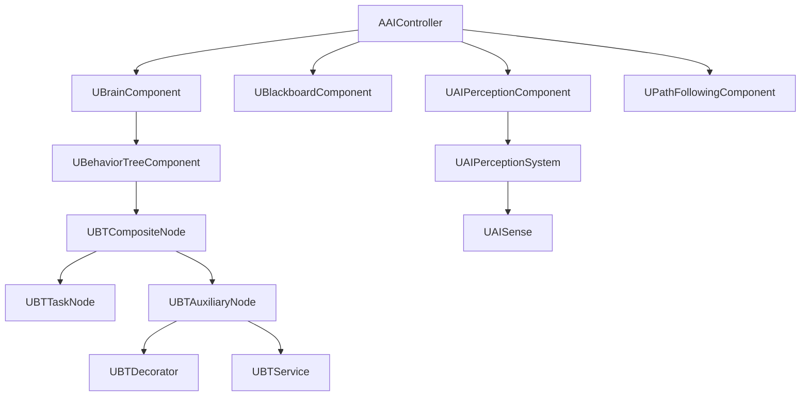
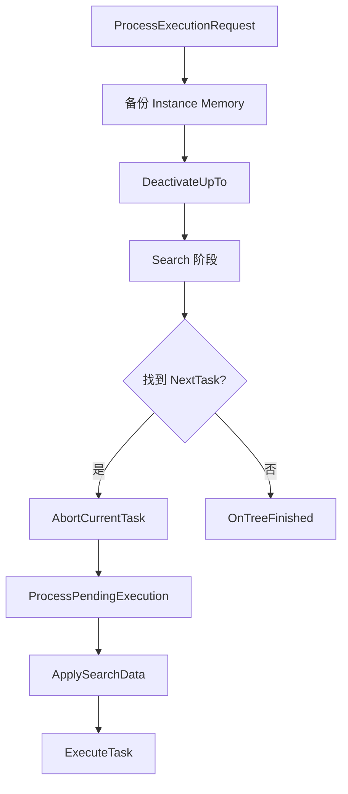
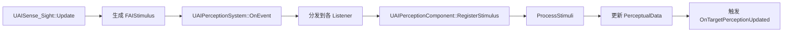

> [[00-UE全解析主索引|← 返回 UE全解析主索引]]

# UE-AIModule-源码解析：AI 与行为树

## 模块定位

- **UE 模块路径**：`Engine/Source/Runtime/AIModule/`
- **Build.cs 文件**：`AIModule.Build.cs`
- **核心依赖**：`Core`、`CoreUObject`、`Engine`、`GameplayTags`、`GameplayTasks`、`NavigationSystem`
- **Private 依赖**：`AutoRTFM`、`RHI`、`RenderCore`
- **可选依赖**：`Navmesh`（`WITH_RECAST`）
- **上层使用方**：所有需要 AI 行为的 Gameplay 项目

> **分工定位**：AIModule 是 UE 的**人工智能运行时框架**。它以 `AAIController` 为聚合中心，`UBehaviorTreeComponent` 驱动行为树决策，`UBlackboardComponent` 提供世界知识存储，`UAIPerceptionSystem` 负责多通道感知输入，底层依赖 `NavigationSystem` 实现寻路与移动。

---

## 接口梳理（第 1 层）

### 核心头文件地图

| 头文件 | 核心类/结构 | 职责 |
|--------|------------|------|
| `Classes/AIController.h` | `AAIController` | AI 控制器基类，聚合 PathFollowing、Brain、Perception、Blackboard |
| `Classes/BrainComponent.h` | `UBrainComponent` | 大脑逻辑基类（Start/Stop/Restart/Pause/Resume） |
| `Classes/BehaviorTree/BehaviorTreeComponent.h` | `UBehaviorTreeComponent` | BT 运行时组件，驱动 Tick/Search/Execute |
| `Classes/BehaviorTree/BehaviorTree.h` | `UBehaviorTree` | BT 资产定义 |
| `Classes/BehaviorTree/BTNode.h` | `UBTNode` | 所有 BT 节点的 UObject 基类 |
| `Classes/BehaviorTree/BTCompositeNode.h` | `UBTCompositeNode` | 组合节点基类（Selector/Sequence/SimpleParallel） |
| `Classes/BehaviorTree/BTTaskNode.h` | `UBTTaskNode` | 任务节点基类（叶节点） |
| `Classes/BehaviorTree/BTAuxiliaryNode.h` | `UBTAuxiliaryNode` | 辅助节点基类（Decorator/Service 的公共基类） |
| `Classes/BehaviorTree/BlackboardComponent.h` | `UBlackboardComponent` | 黑板数据运行时容器 |
| `Classes/Perception/AIPerceptionSystem.h` | `UAIPerceptionSystem` | 全局感知系统（per World） |
| `Classes/Perception/AIPerceptionComponent.h` | `UAIPerceptionComponent` | 感知监听组件 |
| `Classes/Perception/AISense.h` | `UAISense` | 感知基类 |
| `Classes/Navigation/PathFollowingComponent.h` | `UPathFollowingComponent` | 路径跟随组件 |

### 核心类体系



---

## 数据结构（第 2 层）

### AAIController — AI 聚合中心

> 文件：`Engine/Source/Runtime/AIModule/Classes/AIController.h`

```cpp
UCLASS(ClassGroup=(AI), meta=(BlueprintSpawnableComponent))
class AIMODULE_API AAIController : public AController
{
    UPROPERTY(transient)
    TObjectPtr<UPathFollowingComponent> PathFollowingComponent;

    UPROPERTY(transient)
    TObjectPtr<UBrainComponent> BrainComponent;

    UPROPERTY(transient)
    TObjectPtr<UAIPerceptionComponent> PerceptionComponent;

    UFUNCTION(BlueprintCallable, Category = "AI")
    bool RunBehaviorTree(UBehaviorTree* BTAsset);

    UFUNCTION(BlueprintCallable, Category = "AI")
    bool UseBlackboard(UBlackboardData* BlackboardAsset, UBlackboardComponent*& BlackboardComponent);
};
```

`AAIController` 本身不直接执行 AI 逻辑，而是通过组合四个核心组件协同工作：
- **BrainComponent**：决策层（行为树、状态机）
- **BlackboardComponent**：知识层（键值存储）
- **PerceptionComponent**：感知层（视觉、听觉、伤害）
- **PathFollowingComponent**：执行层（路径跟随、移动）

### UBehaviorTreeComponent — BT 运行时引擎

> 文件：`Engine/Source/Runtime/AIModule/Classes/BehaviorTree/BehaviorTreeComponent.h`

```cpp
UCLASS(ClassGroup=(AI))
class AIMODULE_API UBehaviorTreeComponent : public UBrainComponent
{
    UPROPERTY()
    TArray<FBehaviorTreeInstance> InstanceStack;

    UPROPERTY()
    FBehaviorTreeSearchData SearchData;

    UPROPERTY()
    FBTRequestExecutionResult ExecutionRequest;

    void ProcessExecutionRequest();
    void ExecuteTask(UBTTaskNode* TaskNode);
};
```

关键运行时数据：
- **InstanceStack**：支持子树嵌套（`RunBehavior`/`RunBehaviorDynamic`），`ActiveInstanceIdx` 指向当前活动实例
- **SearchData**：保存搜索过程中的状态（SearchStart、SearchEnd、PendingUpdates、DeactivatedBranch）
- **ExecutionRequest**：由 Decorator 条件变化或 Task 完成时发起，指定从哪个 Composite 节点继续搜索

### UBlackboardComponent — 世界知识存储

> 文件：`Engine/Source/Runtime/AIModule/Classes/BehaviorTree/BlackboardComponent.h`

```cpp
UCLASS(ClassGroup=(AI), meta=(BlueprintSpawnableComponent))
class AIMODULE_API UBlackboardComponent : public UActorComponent
{
    UPROPERTY()
    TObjectPtr<UBlackboardData> BlackboardAsset;

    void SetValueAsObject(const FName& KeyName, UObject* ObjectValue);
    void SetValueAsVector(const FName& KeyName, FVector VectorValue);
    void SetValueAsBool(const FName& KeyName, bool BoolValue);

    void RegisterObserver(const FName& KeyName, ...);
    void NotifyObservers(const FBlackboard::FKey KeyID);
};
```

黑板支持的数据类型：`Object`、`Vector`、`Rotator`、`Bool`、`Float`、`Int`、`Name`、`String`、`Enum`、`Class`、`NativeEnum`。通过 `RegisterObserver` 可以订阅键值变更事件，触发 Decorator 重新评估。

### UAIPerceptionSystem — 全局感知分发

> 文件：`Engine/Source/Runtime/AIModule/Classes/Perception/AIPerceptionSystem.h`

```cpp
UCLASS(ClassGroup=(AI))
class AIMODULE_API UAIPerceptionSystem : public UAISubsystem
{
    UPROPERTY()
    TArray<TObjectPtr<UAISense>> Senses;

    void RegisterListener(UAIPerceptionComponent& Listener);
    void UnregisterListener(UAIPerceptionComponent& Listener);
    void OnEvent(const FAIModstimulusEvent& Event);
};
```

`UAIPerceptionSystem` 是 **per World 单例**，Tick 所有 Sense，管理 Listener 注册/注销、Stimuli 分发、延迟刺激和老化。

---

## 行为分析（第 3 层）

### 行为树运行流程：Tick → Search → Execute

> 文件：`Engine/Source/Runtime/AIModule/Private/BehaviorTree/BehaviorTreeComponent.cpp`

```cpp
void UBehaviorTreeComponent::TickComponent(float DeltaTime, ...)
{
    // 1. Tick 所有 Active Aux Nodes（Decorators / Services）
    WrappedTickNode(...);

    // 2. 等待 Latent Abort 完成
    TrackPendingLatentAborts();

    // 3. Tick Active Task
    TaskNode->WrappedTickTask(...);

    // 4. 核心调度
    ProcessExecutionRequest();
}
```

#### ProcessExecutionRequest 内部



**Search 阶段**：
```cpp
while (TestNode && NextTask == NULL)
{
    int32 ChildBranchIdx = TestNode->FindChildToExecute(SearchData, NodeResult);
    if (ReturnToParent)
    {
        // 向上回溯到父组合节点
        TestNode = ParentComposite;
    }
    else if (ChildTask)
    {
        NextTask = ChildTask;  // 找到要执行的 Task
    }
    else
    {
        TestNode = ChildComposite;  // 继续向下深入
    }
}
```

`UBTCompositeNode::FindChildToExecute` 是行为树的**决策核心**：
- **Selector**：从左到右找到第一个子节点返回 `Succeeded`
- **Sequence**：从左到右顺序执行，任一失败则返回 `Failed`
- **SimpleParallel**：主 Task 和后台 Service 同时执行

Decorator 在 `FindChildToExecute` 时评估条件，决定是否允许进入该分支。

### NodeMemory — 运行时状态隔离

每个 BT 节点通过 `GetInstanceMemorySize()` 申请运行时内存块，存储在该实例的 `InstanceMemory` 数组中。这意味着：
- 同一棵行为树可以被多个 AI 同时运行，互不干扰
- 子树嵌套时，每个 Instance 拥有独立的内存空间

### 感知数据流



感知事件可以通过 Blackboard Observer 或 Decorator（如 `BTDecorator_IsAtLocation`）影响行为树的决策。

### AI 消息系统（FAIMessage）

`UBrainComponent` 支持 `SendAIMessage` / `ReceiveAIMessage`，允许外部系统（如 GameplayAbilities、动画通知、触发器）向 AI 发送消息，行为树中的 `BTTask_WaitMessage` 或 `BTDecorator_MessageObserver` 可以响应这些消息。

---

## 与上下层的关系

### 下层依赖

| 下层模块 | 作用 |
|---------|------|
| `NavigationSystem` | 路径查询、NavMesh、寻路算法 |
| `GameplayTags` | 感知分类、AI 团队关系 |
| `GameplayTasks` | `UAITask` 的异步任务支持 |
| `Engine` | Actor/Component 生命周期、动画系统 |

### 上层调用者

| 上层模块 | 使用方式 |
|---------|---------|
| `项目 Gameplay 代码` | 继承 `AAIController`、编写自定义 `UBTTaskNode` 和 `UBTService` |
| `GameplayAbilities` | GAS 的 `AbilityTask_MoveToLocation` 常配合 `UPathFollowingComponent` 使用 |

---

## 设计亮点与可迁移经验

1. **组件化聚合架构**：AAIController 不直接包含 AI 逻辑，而是通过 Brain/Blackboard/Perception/PathFollowing 四个组件组合能力。这种"控制器即聚合器"的设计让每个子系统可以独立演进和替换。
2. **行为树的 Search-Execute 分离**：UE 的行为树不是简单的"每帧从上往下遍历"，而是将"搜索下一个 Task"和"执行当前 Task"分离。Task 运行期间（可能持续多帧），Search 不会重复执行，只在 Task 完成或 Decorator 触发 Abort 时才重新 Search。这保证了行为树的高效性。
3. **InstanceStack + NodeMemory**：支持子树嵌套和运行时状态隔离，同一棵 BT 资产可以被成百上千个 AI 共享，内存开销极低。自研行为树必须考虑资产共享和状态隔离。
4. **Decorator 的 Observer Aborts 机制**：Decorator 不仅能在 Search 阶段过滤分支，还能在 Task 执行期间订阅 Blackboard 变化，触发 Latent Abort。这让行为树能够实时响应环境变化（如敌人出现立即中断巡逻）。
5. **感知系统的全局分发器**：`UAIPerceptionSystem` 作为 per World 单例统一 Tick 所有 Sense，避免了每个 AI 独立做视线检测的性能灾难。自研引擎的感知系统应采用类似的"集中更新 + 事件分发"模型。
6. **Blackboard 的观察者模式**：Blackboard 键值变更可以触发 Decorator 重评估或 Task 响应，这是数据驱动 AI 行为的核心机制。相比硬编码的状态转换，Blackboard + Observer 让 AI 行为更具响应性和可配置性。
7. **EQS 环境查询的模块化**：AIModule 还包含 EQS（Environment Query System），通过 `EnvQueryManager`、`EnvQueryGenerator`、`EnvQueryTest` 的模块化组合，实现"找到最佳 cover 点"、"找到最近敌人"等复杂空间查询。这是行为树决策的重要数据支撑。

---

## 关键源码片段

### AAIController 核心组合

> 文件：`Engine/Source/Runtime/AIModule/Classes/AIController.h`

```cpp
UCLASS(ClassGroup=(AI), meta=(BlueprintSpawnableComponent))
class AIMODULE_API AAIController : public AController
{
    UPROPERTY(transient)
    TObjectPtr<UPathFollowingComponent> PathFollowingComponent;

    UPROPERTY(transient)
    TObjectPtr<UBrainComponent> BrainComponent;

    UPROPERTY(transient)
    TObjectPtr<UAIPerceptionComponent> PerceptionComponent;
};
```

### UBehaviorTreeComponent::ProcessExecutionRequest

> 文件：`Engine/Source/Runtime/AIModule/Private/BehaviorTree/BehaviorTreeComponent.cpp`

```cpp
void UBehaviorTreeComponent::ProcessExecutionRequest()
{
    // 备份 Instance Memory
    CopyInstanceMemoryToPersistent();
    // 停用旧分支
    DeactivateUpTo(ExecuteNode);
    // Search 阶段
    while (TestNode && NextTask == NULL)
    {
        int32 ChildBranchIdx = TestNode->FindChildToExecute(SearchData, NodeResult);
        // ...
    }
    // 执行新 Task
    ExecuteTask(NextTask);
}
```

### UBTCompositeNode::FindChildToExecute

> 文件：`Engine/Source/Runtime/AIModule/Classes/BehaviorTree/BTCompositeNode.h`

```cpp
virtual int32 FindChildToExecute(FBehaviorTreeSearchData& SearchData, EBTNodeResult::Type& LastResult) PURE_VIRTUAL(UBTCompositeNode::FindChildToExecute, return BTSpecialChild::NotFound;);
```

---

## 关联阅读

- [[UE-NavigationSystem-源码解析：导航与寻路]] — AI 移动底层的导航系统
- [[UE-GameplayTags-源码解析：GameplayTags 与状态系统]] — AI 感知与团队分类的标签基础
- [[UE-GameplayAbilities-源码解析：GAS 技能系统]] — AI 与技能系统的联动

---

## 索引状态

- **所属 UE 阶段**：第四阶段 — 客户端运行时层 / 4.4 玩法运行时与同步
- **对应 UE 笔记**：UE-AIModule-源码解析：AI 与行为树
- **本轮完成度**：✅ 第三轮（骨架扫描 + 血肉填充 + 关联辐射 已完成）
- **更新日期**：2026-04-17
