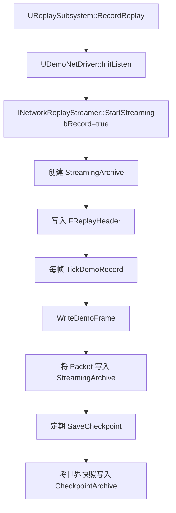
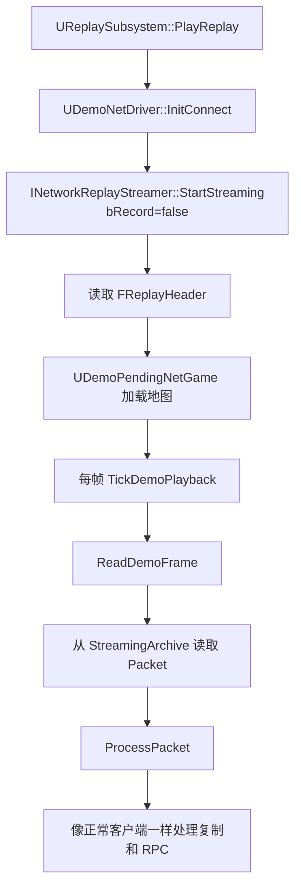

> [[00-UE全解析主索引|← 返回 UE全解析主索引]]

# UE-Engine-源码解析：Replay 与录像

## 模块定位

- **UE 模块路径**：
  - `Engine/Source/Runtime/Engine/Classes/GameFramework/SaveGame.h`
  - `Engine/Source/Runtime/NetworkReplayStreaming/`
  - `Engine/Source/Runtime/Engine/Private/DemoNetDriver.cpp`
- **核心类分布**：
  - `Engine/Classes/Engine/DemoNetDriver.h`：`UDemoNetDriver`
  - `Engine/Classes/Engine/DemoPendingNetGame.h`：`UDemoPendingNetGame`
  - `NetworkReplayStreaming/Public/NetworkReplayStreaming.h`：`INetworkReplayStreamer`
  - `NetworkReplayStreaming/Public/NullNetworkReplayStreamer.h`：`FNullNetworkReplayStreamer`
- **核心依赖**：`Core`、`CoreUObject`、`Engine`、`NetCore`、`Json`、`JsonUtilities`

> **分工定位**：UE 的 Replay 系统本质上是一个**基于网络数据包捕获与重放的时间机器**。它通过 `UDemoNetDriver` 替代普通 `UNetDriver`，将服务器发往客户端的网络包录制到流中（或从流中读取并回放），从而实现对整局游戏过程的精确复现。`NetworkReplayStreaming` 插件层提供了多种存储后端（本地文件、内存、HTTP、InMemory）。

---

## 接口梳理（第 1 层）

### NetworkReplayStreaming 模块核心接口

| 类/接口 | 文件 | 职责 |
|---|---|---|
| `INetworkReplayStreamer` | `Public/NetworkReplayStreaming.h` | Replay 流操作抽象接口（StartStreaming、StopStreaming、FlushCheckpoint、GotoTimeInMS 等） |
| `FNullNetworkReplayStreamer` | `Public/NullNetworkReplayStreamer.h` | 默认本地文件流实现（.demo 文件） |
| `FNetworkReplayVersion` | `Public/NetworkReplayStreaming.h` | Replay 版本信息（Changelist、引擎版本、项目名） |
| `FReplayHeader` | `Public/NetworkReplayStreaming.h` | Replay 文件头（版本、时间戳、关卡名等） |

### Engine 模块 Replay 核心类

| 类名 | 文件路径 | 职责 |
|------|----------|------|
| `UDemoNetDriver` | `Classes/Engine/DemoNetDriver.h` | Replay 专用的 NetDriver，负责录制（InitListen）和回放（InitConnect） |
| `UDemoPendingNetGame` | `Classes/Engine/DemoPendingNetGame.h` | Replay 播放时的 PendingNetGame，负责加载地图和初始同步 |
| `UReplaySubsystem` | `Classes/Engine/ReplaySubsystem.h` | 录制/播放/Seek 的高层入口 |
| `AGameNetworkManager` | `Classes/GameFramework/GameNetworkManager.h` | 网络管理器，部分 Replay 参数配置 |

### SaveGame 的关系

> 文件：`Engine/Source/Runtime/Engine/Classes/GameFramework/SaveGame.h`

```cpp
UCLASS(BlueprintType)
class ENGINE_API USaveGame : public UObject
{
    GENERATED_BODY()
};
```

`USaveGame` 是 UE 的通用存档基类，Replay 系统**不直接继承** `USaveGame`。Replay 的存储是通过 `INetworkReplayStreamer` 写入自定义流格式（如 .demo），而非 `USaveGame` 的序列化机制。但两者共享 UObject 序列化底层（`FArchive`、`FObjectAndNameAsStringProxyArchive` 等）。

---

## 数据结构（第 2 层）

### UDemoNetDriver — Replay 专用网络驱动

> 文件：`Engine/Source/Runtime/Engine/Classes/Engine/DemoNetDriver.h`

```cpp
UCLASS(transient)
class ENGINE_API UDemoNetDriver : public UNetDriver
{
    UPROPERTY()
    bool bIsLocalReplay;

    UPROPERTY()
    bool bRecordDemoFrame;

    UPROPERTY()
    bool bDemoPlayback;

    UPROPERTY()
    float DemoCurrentTime;

    UPROPERTY()
    float DemoTotalTime;

    virtual bool InitListen(FNetworkNotify* InNotify, FURL& LocalURL, bool bReuseAddressAndPort) override;
    virtual bool InitConnect(FNetworkNotify* InNotify, const FURL& ConnectURL, FString& Error) override;

    void TickDemoRecord(float DeltaSeconds);
    void TickDemoPlayback(float DeltaSeconds);

    void SaveCheckpoint();
    bool LoadCheckpoint();
};
```

`UDemoNetDriver` 的核心角色：
- **录制模式**（`InitListen`）：像服务器一样运行，但将本应是 Server→Client 的包写入 Replay 流
- **回放模式**（`InitConnect`）：像客户端一样运行，但从 Replay 流读取包并处理

### INetworkReplayStreamer — 流抽象接口

> 文件：`Engine/Source/Runtime/NetworkReplayStreaming/Public/NetworkReplayStreaming.h`

```cpp
class INetworkReplayStreamer
{
public:
    virtual void StartStreaming(const FStartStreamingParameters& Params, const FStartStreamingCallback& Delegate) = 0;
    virtual void StopStreaming() = 0;
    virtual void FlushCheckpoint(const FString& CheckpointId) = 0;
    virtual void GotoTimeInMS(const uint32 TimeInMS, const FGotoCallback& Delegate) = 0;
    virtual void Tick(float DeltaTime) = 0;

    virtual FArchive* GetStreamingArchive() = 0;
    virtual FArchive* GetCheckpointArchive() = 0;
};
```

核心方法：
- `StartStreaming`：开始录制或播放
- `GetStreamingArchive`：获取主数据流（网络包）
- `GetCheckpointArchive`：获取检查点流（世界快照）
- `GotoTimeInMS`：跳转到指定时间

### FReplayHeader — Replay 文件头

```cpp
struct FReplayHeader
{
    uint32 Magic;
    uint32 Version;
    uint32 NetworkVersion;
    FString EngineVersion;
    FString GameName;
    FString MapName;
    float TimeStamp;
};
```

Replay 文件头用于版本校验和元数据识别。版本不匹配时，回放会失败或进入兼容模式。

---

## 行为分析（第 3 层）

### Replay 录制流程



#### TickDemoRecord 内部

> 文件：`Engine/Source/Runtime/Engine/Private/DemoNetDriver.cpp`

```cpp
void UDemoNetDriver::TickDemoRecord(float DeltaSeconds)
{
    // 1. 更新 DemoCurrentTime
    DemoCurrentTime += DeltaSeconds;

    // 2. 遍历 ClientConnections，将本应发送的包写入 Replay 流
    for (UNetConnection* Connection : ClientConnections)
    {
        WriteDemoFrame(Connection);
    }

    // 3. 检查是否需要保存 Checkpoint
    if (ShouldSaveCheckpoint())
    {
        SaveCheckpoint();
    }
}
```

`WriteDemoFrame` 的核心逻辑：
- 读取 Connection 的发送缓冲区（Outgoing 包）
- 将包数据连同时间戳一起序列化到 `StreamingArchive`
- 清空 Connection 的发送缓冲区（因为 Replay 不需要真正发往网络）

#### SaveCheckpoint 内部

```cpp
void UDemoNetDriver::SaveCheckpoint()
{
    FArchive* CheckpointArchive = ReplayStreamer->GetCheckpointArchive();
    
    // 1. 序列化当前世界状态（关键 Actor 的完整属性快照）
    SerializeCheckpoint(CheckpointArchive);
    
    // 2. 记录当前 DemoCurrentTime 作为检查点时间戳
    // 3. Flush CheckpointArchive
    ReplayStreamer->FlushCheckpoint(CurrentCheckpointId);
}
```

Checkpoint 是**世界状态的完整快照**，用于支持时间跳转（Seek）。Seek 时，系统会先加载最近的 Checkpoint，然后 FastForward 播放从 Checkpoint 到目标时间的网络包。

### Replay 播放流程



#### TickDemoPlayback 内部

```cpp
void UDemoNetDriver::TickDemoPlayback(float DeltaSeconds)
{
    DemoCurrentTime += DeltaSeconds;

    // 从 StreamingArchive 读取当前时间窗口内的所有包
    while (ReplayStreamer->GetStreamingArchive()->Tell() < ReplayStreamer->GetStreamingArchive()->TotalSize())
    {
        FDemoFrame DemoFrame;
        *ReplayStreamer->GetStreamingArchive() << DemoFrame;

        if (DemoFrame.Time > DemoCurrentTime)
        {
            // 还没到播放时间，回退并等待
            break;
        }

        // 处理该帧的所有包
        ProcessPacket(DemoFrame.PacketData);
    }
}
```

### Replay Seek（时间跳转）

```cpp
void UReplaySubsystem::GotoTimeInSeconds(float TimeInSeconds)
{
    FGotoTimeInSecondsTask Task;
    Task.TimeInSeconds = TimeInSeconds;

    // 1. 找到最近的 Checkpoint
    FString CheckpointId = FindCheckpointBeforeTime(TimeInSeconds);

    // 2. 加载 Checkpoint（恢复世界状态）
    ReplayStreamer->GotoTimeInMS(TimeInSeconds * 1000, Delegate);

    // 3. FastForward 播放从 Checkpoint 到目标时间的网络包
    FastForwardToTime(TimeInSeconds);
}
```

Seek 的核心挑战：
- **加载 Checkpoint**：反序列化世界快照，恢复 Actor 的完整状态
- **FastForward**：以加速方式播放网络包，但不渲染/不播放音频，直到追上目标时间
- **插值平滑**：FastForward 结束后，可能需要对 Camera/Animation 做平滑处理

---

## 与上下层的关系

### 下层依赖

| 下层模块 | 作用 |
|---------|------|
| `Engine / NetCore` | `UNetDriver`、`UActorChannel`、`FArchive`、网络序列化 |
| `Json` / `JsonUtilities` | Replay 元数据（如自定义事件）的序列化 |

### 上层调用者

| 上层模块 | 使用方式 |
|---------|---------|
| `项目代码` | 通过 `UReplaySubsystem` 启动录制/播放/Seek |
| `Editor` | 编辑器中的 Replay 播放器、自动测试框架 |
| `OnlineSubsystem` | 部分项目将 Replay 上传到云端供玩家下载观战 |

---

## 设计亮点与可迁移经验

1. **网络包捕获即 Replay**：UE 的 Replay 不是录制"渲染帧"或"输入序列"，而是录制服务器发送给客户端的**网络包**。这种方式天然精确复现了游戏逻辑状态（因为客户端的状态完全由网络包重建），但无法自由切换视角（ Replay 视角受限于原始客户端的 relevance 和 visibility）。
2. **DemoNetDriver 继承 UNetDriver**：通过最小侵入的继承，`UDemoNetDriver` 复用了 UE 完整的网络复制代码路径。录制时"假装"是服务器，播放时"假装"是客户端。这种设计让 Replay 系统与网络层高度一致，减少了重复实现。
3. **Checkpoint + FastForward 的 Seek 模型**：直接 Seek 到任意时间点需要完整的世界状态快照。UE 采用定期保存 Checkpoint + FastForward 播放中间包的策略，在存储空间和 Seek 性能之间取得平衡。自研录像系统应权衡 Checkpoint 频率和文件大小。
4. **INetworkReplayStreamer 的多后端支持**：通过抽象接口，Replay 可以存储到本地文件、内存、HTTP 服务器或第三方服务（如 Twitch、YouTube）。这是平台无关性和扩展性的关键设计。
5. **Replay 版本兼容性**：`FReplayHeader` 中的版本信息用于校验 Replay 与当前引擎版本的兼容性。网络协议、属性布局的变更都可能导致旧 Replay 无法播放，因此版本管理和兼容性测试非常重要。
6. **与 SaveGame 的分离**：Replay 不走 `USaveGame` 的存档路径，而是使用自己的流式 `FArchive`。这是因为 Replay 需要高效地追加写入网络包，而 `USaveGame` 是一次性完整 UObject 序列化，不适合流式场景。但两者的底层序列化机制（`FArchive`）是相通的。

---

## 关键源码片段

### UDemoNetDriver 核心字段

> 文件：`Engine/Source/Runtime/Engine/Classes/Engine/DemoNetDriver.h`

```cpp
UCLASS(transient)
class ENGINE_API UDemoNetDriver : public UNetDriver
{
    UPROPERTY()
    bool bDemoPlayback;

    UPROPERTY()
    float DemoCurrentTime;

    UPROPERTY()
    float DemoTotalTime;

    virtual bool InitListen(FNetworkNotify* InNotify, FURL& LocalURL, bool bReuseAddressAndPort) override;
    virtual bool InitConnect(FNetworkNotify* InNotify, const FURL& ConnectURL, FString& Error) override;

    void TickDemoRecord(float DeltaSeconds);
    void TickDemoPlayback(float DeltaSeconds);
    void SaveCheckpoint();
    bool LoadCheckpoint();
};
```

### INetworkReplayStreamer 接口

> 文件：`Engine/Source/Runtime/NetworkReplayStreaming/Public/NetworkReplayStreaming.h`

```cpp
class INetworkReplayStreamer
{
public:
    virtual void StartStreaming(const FStartStreamingParameters& Params, const FStartStreamingCallback& Delegate) = 0;
    virtual void StopStreaming() = 0;
    virtual void FlushCheckpoint(const FString& CheckpointId) = 0;
    virtual void GotoTimeInMS(const uint32 TimeInMS, const FGotoCallback& Delegate) = 0;
    virtual FArchive* GetStreamingArchive() = 0;
    virtual FArchive* GetCheckpointArchive() = 0;
};
```

### Replay 录制与播放心智模型

```
[录制]  UReplaySubsystem::RecordReplay
          → UDemoNetDriver::InitListen
          → INetworkReplayStreamer::StartStreaming(bRecord=true)
          → 每帧 TickDemoRecord → WriteDemoFrame → StreamingArchive
          → 定期 SaveCheckpoint → CheckpointArchive

[播放]  UReplaySubsystem::PlayReplay
          → UDemoNetDriver::InitConnect
          → INetworkReplayStreamer::StartStreaming(bRecord=false)
          → ReadPlaybackDemoHeader → UDemoPendingNetGame 加载地图
          → 每帧 TickDemoPlayback → ReadDemoFrame → ProcessPacket

[Seek]  GotoTimeInSeconds
          → FGotoTimeInSecondsTask
          → Streamer::GotoTimeInMS
          → LoadCheckpoint (恢复世界 + FastForward)
```

---

## 关联阅读

- [[UE-Engine-源码解析：网络同步与预测]] — Replay 的底层网络复制基础
- [[UE-NetworkReplayStreaming-源码解析：Replay 系统]] — NetworkReplayStreaming 模块的专题分析
- [[UE-Serialization-源码解析：Archive 序列化体系]] — Replay 和 Checkpoint 的序列化底层

---

## 索引状态

- **所属 UE 阶段**：第四阶段 — 客户端运行时层 / 4.4 玩法运行时与同步
- **对应 UE 笔记**：UE-Engine-源码解析：Replay 与录像
- **本轮完成度**：✅ 第三轮（骨架扫描 + 血肉填充 + 关联辐射 已完成）
- **更新日期**：2026-04-17
