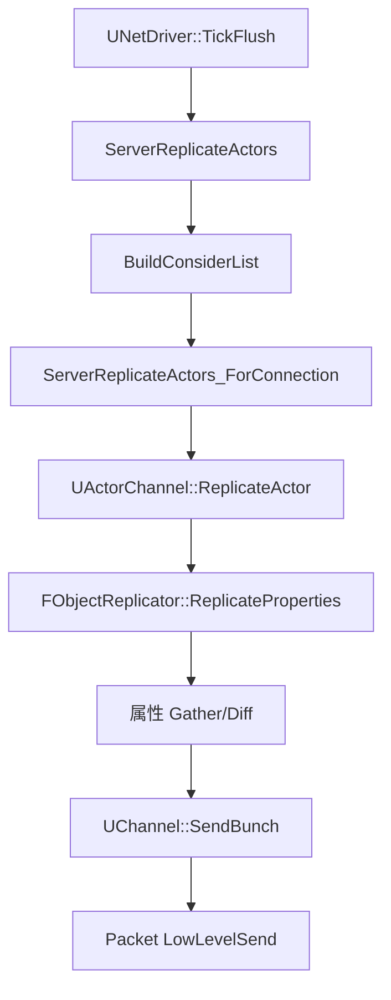
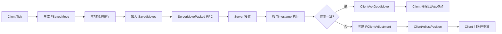

> [← 返回 UE全解析主索引]([[00-UE全解析主索引|UE全解析主索引]])

# UE-Engine-源码解析：网络同步与预测

## 模块定位

- **UE 模块路径**：`Engine/Source/Runtime/Engine/Classes/Net/`、`Engine/Source/Runtime/Engine/Classes/GameFramework/PlayerController.h`
- **核心类分布**：
  - `Engine/Classes/Engine/NetDriver.h`：`UNetDriver`
  - `Engine/Classes/Engine/NetConnection.h`：`UNetConnection`
  - `Engine/Classes/Engine/ActorChannel.h`：`UActorChannel`
  - `Engine/Public/Net/RepLayout.h`：`FRepState`
  - `Engine/Public/Net/DataReplication.h`：`FObjectReplicator`
  - `Engine/Classes/Interfaces/NetworkPredictionInterface.h`：`INetworkPredictionInterface`
  - `Engine/Classes/GameFramework/CharacterMovementComponent.h`：`FSavedMove_Character`
- **核心依赖**：`Core`、`CoreUObject`、`NetCore`、`Sockets`、`PacketHandlers`

> **分工定位**：Engine 模块的 Net 子系统是 UE **网络复制的核心实现**。它通过 `UNetDriver` → `UNetConnection` → `UActorChannel` 的三级架构，将 Actor/Component 的属性变化和 RPC 从服务器同步到客户端。NetworkPrediction 则在此基础上，以 CharacterMovementComponent 为范例，实现了客户端预测 + 服务器回滚的移动同步模型。

---

## 接口梳理（第 1 层）

### Net 文件夹核心类

| 类名 | 文件路径 | 职责 |
|------|----------|------|
| `UNetDriver` | `Classes/Engine/NetDriver.h` | 网络驱动基类。管理所有连接，驱动 `ServerReplicateActors` 主循环 |
| `UNetConnection` | `Classes/Engine/NetConnection.h` | 代表一条网络连接。维护通道列表、可靠性缓冲区 |
| `UActorChannel` | `Classes/Engine/ActorChannel.h` | Actor 专属通道。管理单个 Actor 的生命周期、属性同步与 RPC |
| `UChannel` | `Classes/Engine/Channel.h` | 通道基类。提供 `SendBunch()` 等底层组包能力 |
| `FRepState` | `Public/Net/RepLayout.h` | 每个对象在每个连接上的复制状态，用于增量对比与 ACK 追踪 |
| `FObjectReplicator` | `Public/Net/DataReplication.h` | 实际执行属性序列化/反序列化的工作类 |

### PlayerController 网络同步 RPC

> 文件：`Engine/Source/Runtime/Engine/Classes/GameFramework/PlayerController.h`

```cpp
UFUNCTION(Reliable, Server, WithValidation)
void ServerUpdateCamera(FVector_NetQuantize CamLoc, int32 CamPitchAndYaw);

UFUNCTION(Reliable, Server, WithValidation)
void ServerAcknowledgePossession(APawn* P);

UFUNCTION(Reliable, Client)
void ClientUpdateLevelStreamingStatus(FName PackageName, bool bNewShouldBeLoaded, ...);

UFUNCTION(Reliable, Client)
void ClientGotoState(FName NewState);
```

### NetworkPrediction 核心接口

> 文件：`Engine/Source/Runtime/Engine/Classes/Interfaces/NetworkPredictionInterface.h`

```cpp
class INetworkPredictionInterface
{
    virtual void SendClientAdjustment() = 0;
    virtual void ForcePositionUpdate(float DeltaTime) = 0;
    virtual void SmoothCorrection(const FVector& OldLocation, const FQuat& OldRotation, ...);
    virtual FNetworkPredictionData_Client* GetPredictionData_Client() const;
    virtual FNetworkPredictionData_Server* GetPredictionData_Server() const;
};
```

---

## 数据结构（第 2 层）

### UNetDriver — 网络驱动

```cpp
UCLASS(Abstract, Config=Engine, Transient)
class UNetDriver : public UObject
{
    UPROPERTY()
    TArray<TObjectPtr<UNetConnection>> ClientConnections;

    UPROPERTY()
    TObjectPtr<UNetConnection> ServerConnection;

    UPROPERTY()
    TObjectPtr<UReplicationDriver> ReplicationDriver;

    virtual void TickFlush(float DeltaSeconds);
    virtual void ServerReplicateActors(float DeltaSeconds);
};
```

`UNetDriver` 是服务器上所有客户端连接的管理器，也是客户端到服务器的单一连接持有者。每帧 `TickFlush` 触发 `ServerReplicateActors`，驱动整个复制流程。

> **Iris 新路径**：若启用了 Iris 复制系统（`ReplicationSystem` 非空），`ServerReplicateActors` 会直接走 `ReplicationSystem->NetUpdate(DeltaSeconds)`，不再执行 Legacy 流程。

### UNetConnection — 网络连接

```cpp
UCLASS(Abstract, Transient)
class UNetConnection : public UPlayer
{
    UPROPERTY()
    TArray<TObjectPtr<UChannel>> OpenChannels;

    UPROPERTY()
    TArray<TObjectPtr<UActorChannel>> ActorChannels;

    EConnectionState State;

    void ReceivedPacket(FInPacketTraits& Traits);
    void LowLevelSend(void* Data, int32 CountBits, FOutPacketTraits& Traits);
};
```

每个 `UNetConnection` 维护：
- `OpenChannels`：已打开的通用通道
- `ActorChannels`：Actor 专属通道映射（Actor → UActorChannel）
- 可靠性缓冲区和包序号管理

### UActorChannel — Actor 专属通道

```cpp
UCLASS(Transient)
class UActorChannel : public UChannel
{
    UPROPERTY()
    TObjectPtr<AActor> Actor;

    UPROPERTY()
    TObjectPtr<FObjectReplicator> ActorReplicator;

    virtual int32 ReplicateActor();
    virtual void SendBunch(FOutBunch* Bunch, bool bMerge);
};
```

`UActorChannel::ReplicateActor()` 是**属性同步的核心入口**：
1. 创建 `FOutBunch`
2. 若是首次复制，调用 `SerializeNewActor`
3. 调用 `ActorReplicator->ReplicateProperties` 做属性差异检测和序列化
4. 调用 `DoSubObjectReplication` 处理组件/子对象复制
5. 调用 `SendBunch` 发送

### FRepState — 每对象每连接的状态

```cpp
struct FRepState
{
    TSharedPtr<FSendingRepState> SendingRepState;
    TSharedPtr<FReceivingRepState> ReceivingRepState;
};
```

`FSendingRepState` 保存上次成功发送的属性状态，用于增量对比（Diff）。`FReceivingRepState` 保存接收端状态，用于反序列化和 ACK 追踪。

### FSavedMove_Character — 移动输入快照

> 文件：`Engine/Source/Runtime/Engine/Classes/GameFramework/CharacterMovementComponent.h`

```cpp
class FSavedMove_Character : public FSavedMove
{
    float Timestamp;
    FVector_NetQuantize Acceleration;
    FVector_NetQuantize Location;
    FVector_NetQuantize CompressedVelocity;
    FRotator ControlRotation;
    TEnumAsByte<EMovementMode::Type> MovementMode;
    uint16 JumpKeyHoldTime;
    bool bPressedJump : 1;
    bool bWantsToCrouch : 1;
};
```

客户端每 Tick 生成一个 `FSavedMove_Character`，本地预测执行后加入 `SavedMoves` 队列，并通过 `ServerMovePacked` RPC 发送到服务器。

---

## 行为分析（第 3 层）

### 网络同步主流程（Replication Flow）



#### ServerReplicateActors 内部

> 文件：`Engine/Source/Runtime/Engine/Private/NetDriver.cpp`

```cpp
void UNetDriver::ServerReplicateActors(float DeltaSeconds)
{
    ServerReplicateActors_PrepConnections();
    ServerReplicateActors_BuildConsiderList();

    for (UNetConnection* Connection : ClientConnections)
    {
        ServerReplicateActors_ForConnection(Connection, ConsiderList);
    }
}
```

`BuildConsiderList` 会遍历所有 `NetDormant` 非休眠的 Actor，根据 `AActor::IsNetRelevantFor` 判断对该连接是否相关。

#### ReplicateActor 内部

> 文件：`Engine/Source/Runtime/Engine/Private/DataChannel.cpp`

```cpp
int32 UActorChannel::ReplicateActor()
{
    FOutBunch Bunch(this, 0);
    
    if (RepFlags.bNetInitial)
    {
        PackageMap->SerializeNewActor(Bunch, this, Actor);
    }

    ActorReplicator->ReplicateProperties(Bunch, RepFlags);
    DoSubObjectReplication(Bunch, RepFlags);
    
    SendBunch(&Bunch, 1);
    return Bunch.GetNumBits();
}
```

### RPC 调用链

#### 发送端

```cpp
AActor::CallRemoteFunction(UFunction* Function, void* Parameters)
{
    for (UNetDriver* NetDriver : ActiveNetDrivers)
    {
        NetDriver->ProcessRemoteFunction(Actor, Function, Parameters, ...);
    }
}
```

#### NetDriver 分发

```cpp
bool UNetDriver::ProcessRemoteFunction(AActor* Actor, UFunction* Function, void* Parameters, ...)
{
    if (Function->FunctionFlags & FUNC_NetMulticast)
    {
        // 遍历所有 ClientConnections 发送
    }
    else
    {
        // 找到目标 Connection，进入 ProcessRemoteFunctionForChannelPrivate
    }
}
```

### NetworkPrediction：客户端预测 + 服务器回滚



#### 客户端流程

```cpp
void UCharacterMovementComponent::FSavedMove_Character::PrepMove(ACharacter* Character)
{
    // 将输入快照应用到角色
}

void UCharacterMovementComponent::CallServerMovePacked(const FCharacterNetworkMoveDataContainer& MoveDataContainer)
{
    // 将 NewMove + PendingMove + OldMove 打包为单个 RPC 发送
}
```

#### 服务器流程

```cpp
void UCharacterMovementComponent::ServerMovePacked_Implementation(const FCharacterNetworkMoveDataContainer& MoveDataContainer)
{
    // 解压移动数据
    // 按 Timestamp 执行移动
    // 对比结果，发送 Ack 或 Adjustment
}
```

#### 客户端修正流程

```cpp
void UCharacterMovementComponent::ClientAdjustPosition_Implementation(...)
{
    bUpdatePosition = true;
}

void UCharacterMovementComponent::ClientUpdatePositionAfterServerUpdate()
{
    // 回滚到服务器给定状态
    // 重放 SavedMoves 中该 Timestamp 之后的所有移动
    // SmoothCorrection 做视觉插值平滑
}
```

---

## 与上下层的关系

### 下层依赖

| 下层模块 | 作用 |
|---------|------|
| `Sockets` | 底层 TCP/UDP Socket 封装 |
| `NetCore` | 网络序列化、BitReader/BitWriter |
| `PacketHandlers` | 包处理器链（加密、压缩、校验） |

### 上层调用者

| 上层模块 | 使用方式 |
|---------|---------|
| `GameplayAbilities` | GAS 的 PredictionKey 机制建立在 NetDriver RPC 之上 |
| `Engine Gameplay` | `APlayerController`、`ACharacter` 大量依赖网络同步 |
| `OnlineSubsystem` | 在 NetDriver 之上提供会话、匹配、NAT 穿透 |

---

## 设计亮点与可迁移经验

1. **NetDriver → Connection → Channel 三级架构**：清晰的层级分离让网络层易于扩展。NetDriver 负责连接管理和复制调度，Connection 负责可靠性，Channel 负责单个 Actor/对象的语义。自研网络系统应借鉴这种"驱动-连接-通道"模型。
2. **FRepState 的增量复制**：每个对象在每个连接上都有独立的 `FRepState`，只发送自上次 ACK 以来发生变化的属性。这种 per-object-per-connection 的状态跟踪是 UE 网络复制高效的关键。
3. **ConsiderList 相关性裁剪**：`ServerReplicateActors` 不是遍历所有 Actor，而是先构建 `ConsiderList`，只处理对目标客户端相关的 Actor。这大大降低了服务器复制开销。
4. **Bunch 组包机制**：多个小的属性更新和 RPC 会被合并到同一个 Bunch 中，再进一步合并到 Packet 里。这种多层组包减少了小包数量，提高了网络吞吐量。
5. **客户端预测 + 服务器权威 + 重放修正**：CharacterMovement 的标准模型（Prediction/Replication/Correction）是现代竞技游戏移动同步的工业标准。核心要素包括：输入快照（SavedMove）、时间戳对齐、服务器修正帧、客户端回滚重放、平滑插值。
6. **Iris 复制系统的前向兼容**：UE5 引入的 Iris 通过 `UReplicationDriver` / `ReplicationSystem` 接口逐步替代 Legacy 复制流程。这种"新系统在旧接口上渐进替换"的策略，保证了现有项目的平滑迁移。

---

## 关键源码片段

### UNetDriver::ServerReplicateActors

> 文件：`Engine/Source/Runtime/Engine/Private/NetDriver.cpp`

```cpp
void UNetDriver::ServerReplicateActors(float DeltaSeconds)
{
    ServerReplicateActors_PrepConnections();
    ServerReplicateActors_BuildConsiderList();

    for (UNetConnection* Connection : ClientConnections)
    {
        ServerReplicateActors_ForConnection(Connection, ConsiderList);
    }
}
```

### UActorChannel::ReplicateActor

> 文件：`Engine/Source/Runtime/Engine/Private/DataChannel.cpp`

```cpp
int32 UActorChannel::ReplicateActor()
{
    FOutBunch Bunch(this, 0);
    if (RepFlags.bNetInitial)
    {
        PackageMap->SerializeNewActor(Bunch, this, Actor);
    }
    ActorReplicator->ReplicateProperties(Bunch, RepFlags);
    DoSubObjectReplication(Bunch, RepFlags);
    SendBunch(&Bunch, 1);
    return Bunch.GetNumBits();
}
```

### CharacterMovement NetworkPrediction

> 文件：`Engine/Source/Runtime/Engine/Classes/GameFramework/CharacterMovementComponent.h`

```cpp
class FSavedMove_Character : public FSavedMove
{
    float Timestamp;
    FVector_NetQuantize Acceleration;
    FVector_NetQuantize Location;
    FRotator ControlRotation;
    TEnumAsByte<EMovementMode::Type> MovementMode;
    bool bPressedJump;
};
```

---

## 关联阅读

- [[UE-Net-源码解析：网络同步与 Replication]] — 更底层的网络复制专题
- [[UE-GameplayAbilities-源码解析：GAS 技能系统]] — PredictionKey 与网络预测的联动
- [[UE-Sockets-源码解析：Socket 子系统]] — NetDriver 的底层 Socket 支撑

---

## 索引状态

- **所属 UE 阶段**：第四阶段 — 客户端运行时层 / 4.4 玩法运行时与同步
- **对应 UE 笔记**：UE-Engine-源码解析：网络同步与预测
- **本轮完成度**：✅ 第三轮（骨架扫描 + 血肉填充 + 关联辐射 已完成）
- **更新日期**：2026-04-17
