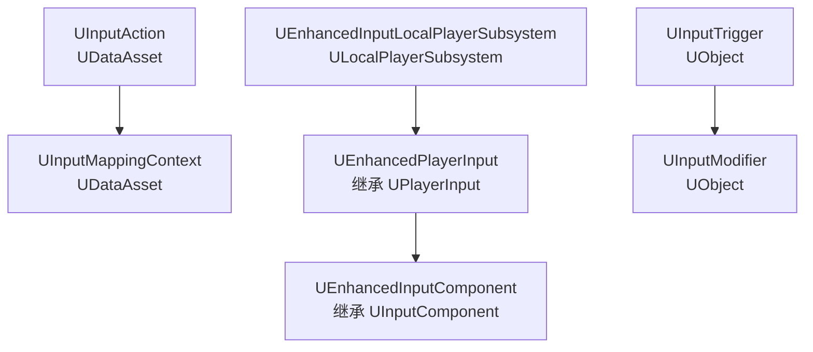
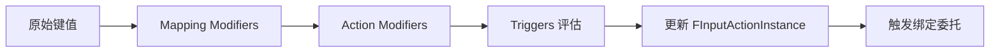

> [[00-UE全解析主索引|← 返回 UE全解析主索引]]

# UE-EnhancedInput-源码解析：增强输入系统

## 模块定位

- **UE 模块路径**：`Engine/Plugins/EnhancedInput/Source/EnhancedInput/`
- **Build.cs 文件**：`EnhancedInput.Build.cs`
- **核心依赖**：`ApplicationCore`、`Core`、`CoreUObject`、`Engine`、`InputCore`、`Slate`、`SlateCore`、`DeveloperSettings`、`GameplayTags`
- **上层使用方**：Gameplay 项目代码、UMG、各类控制器/Pawn

> **分工定位**：EnhancedInput 是 UE4.27+/UE5 主推的现代化输入框架，以**数据资产驱动**（UInputAction / UInputMappingContext）替代了传统的 INI 配置式 Action/Axis Mapping。它通过 Trigger/Modifier 管道实现可组合、上下文感知的输入处理。

---

## 接口梳理（第 1 层）

### 公共头文件地图

| 头文件 | 核心类/结构 | 职责 |
|--------|------------|------|
| `Public/InputAction.h` | `UInputAction`、`FInputActionInstance`、`FTriggerStateTracker` | 逻辑输入动作定义、运行时实例、触发器状态追踪 |
| `Public/InputMappingContext.h` | `UInputMappingContext`、`FEnhancedActionKeyMapping` | 键→动作映射集合（IMC），支持优先级与输入模式过滤 |
| `Public/EnhancedPlayerInput.h` | `UEnhancedPlayerInput`、`FAppliedInputContextData`、`FInjectedInput` | 运行时核心，逐帧求值 Triggers/Modifiers |
| `Public/EnhancedInputComponent.h` | `UEnhancedInputComponent`、`FEnhancedInputActionEventBinding` | 绑定层，提供 `BindAction<T>` |
| `Public/EnhancedInputSubsystems.h` | `UEnhancedInputLocalPlayerSubsystem`、`UEnhancedInputWorldSubsystem` | 本地玩家/世界入口，管理 IMC 的增删 |
| `Public/InputTriggers.h` | `UInputTrigger` 及其子类 | 触发器基类与实现 |
| `Public/InputModifiers.h` | `UInputModifier` 及其子类 | 修饰器基类与实现 |
| `Public/InputActionValue.h` | `FInputActionValue` | 统一值包装（Bool/Axis1D/Axis2D/Axis3D） |

### 核心类体系



---

## 数据结构（第 2 层）

### UInputAction — 逻辑输入动作资产

> 文件：`Engine/Plugins/EnhancedInput/Source/EnhancedInput/Public/InputAction.h`，第 54~154 行

```cpp
UCLASS(MinimalAPI, BlueprintType)
class UInputAction : public UDataAsset
{
    GENERATED_BODY()

    UPROPERTY(EditAnywhere, BlueprintReadOnly, Category = Action, AssetRegistrySearchable)
    EInputActionValueType ValueType = EInputActionValueType::Boolean;

    UPROPERTY(EditAnywhere, Instanced, BlueprintReadWrite, Category = Action)
    TArray<TObjectPtr<UInputTrigger>> Triggers;

    UPROPERTY(EditAnywhere, Instanced, BlueprintReadWrite, Category = Action)
    TArray<TObjectPtr<UInputModifier>> Modifiers;

    UPROPERTY(EditAnywhere, BlueprintReadOnly, Category = "Description")
    FText ActionDescription = FText::GetEmpty();

    bool bConsumeInput = true;
    bool bTriggerWhenPaused = false;
    EInputActionAccumulationBehavior AccumulationBehavior = EInputActionAccumulationBehavior::TakeHighestAbsoluteValue;
};
```

`UInputAction` 是**纯数据资产**，描述一个逻辑动作（如 Jump、Shoot）。它的核心字段：
- `ValueType`：返回值类型（Bool/Axis1D/Axis2D/Axis3D）
- `Triggers`：全局触发器（如 Pressed、Hold、Tap）
- `Modifiers`：全局修饰器（如 DeadZone、Negate、Scalar）
- `AccumulationBehavior`：多键映射到同一 Action 时的值合并策略（取最大绝对值 / 累加）

### FInputActionInstance — 运行时实例

> 文件：`Engine/Plugins/EnhancedInput/Source/EnhancedInput/Public/InputAction.h`，第 196~273 行

```cpp
USTRUCT(BlueprintType)
struct FInputActionInstance
{
    GENERATED_BODY()

    UPROPERTY(Transient)
    ETriggerState TriggerState = ETriggerState::None;

    UPROPERTY(Transient)
    FInputActionValue Value;

    UPROPERTY(Transient)
    float ElapsedTime = 0.f;

    UPROPERTY(Transient)
    float TriggeredTime = 0.f;

    UPROPERTY(Transient)
    TArray<TObjectPtr<UInputTrigger>> Triggers;

    UPROPERTY(Transient)
    TArray<TObjectPtr<UInputModifier>> Modifiers;
};
```

`UEnhancedPlayerInput` 为每个 `(Player, UInputAction)` 对维护一个 `FInputActionInstance`，记录当前触发状态、值、持续时间，以及 Triggers/Modifiers 的运行时副本（支持局部覆盖）。

### UInputMappingContext — 映射上下文资产

> 文件：`Engine/Plugins/EnhancedInput/Source/EnhancedInput/Public/InputMappingContext.h`，第 86~200 行

```cpp
UCLASS(MinimalAPI, BlueprintType, config = Input)
class UInputMappingContext : public UDataAsset
{
    GENERATED_BODY()

    UPROPERTY(config, BlueprintReadOnly, EditAnywhere, Category = "Mappings")
    FInputMappingContextMappingData DefaultKeyMappings;

    UPROPERTY(config, BlueprintReadOnly, EditAnywhere, Category = "Mappings")
    TMap<FString, FInputMappingContextMappingData> MappingProfileOverrides;

    EMappingContextInputModeFilterOptions InputModeFilterOptions;
    FGameplayTagQuery InputModeQueryOverride;
    EMappingContextRegistrationTrackingMode RegistrationTrackingMode;
};
```

IMC 是**键→动作映射的集合**。关键特性：
- **优先级**：多个 IMC 叠加时，高优先级 IMC 的映射可以覆盖低优先级的同键映射
- **InputMode 过滤**：通过 `FGameplayTagQuery` 匹配当前输入模式，动态启用/禁用整个 IMC
- **RegistrationTrackingMode**：支持 `Untracked`（第一次 Remove 即卸载）或 `CountRegistrations`（引用计数）

---

## 行为分析（第 3 层）

### 主流程：IMC 注册 → ControlMappings 重建 → 逐帧求值

#### 1. Subsystem 层：IMC 的增删

> 文件：`Engine/Plugins/EnhancedInput/Source/EnhancedInput/Public/EnhancedInputSubsystems.h`（概念位置）

```cpp
// 本地玩家子系统接口
UCLASS()
class UEnhancedInputLocalPlayerSubsystem : public ULocalPlayerSubsystem, public IEnhancedInputSubsystemInterface
{
    UFUNCTION(BlueprintCallable, Category = "Enhanced Input|Local Player Subsystem")
    void AddMappingContext(UInputMappingContext* MappingContext, int32 Priority, const FModifyContextOptions& Options);

    UFUNCTION(BlueprintCallable, Category = "Enhanced Input|Local Player Subsystem")
    void RemoveMappingContext(UInputMappingContext* MappingContext, const FModifyContextOptions& Options);
};
```

`AddMappingContext` 会将 IMC 加入 `AppliedInputContextData` 映射，并标记 `bMappingRebuildPending`。真正的重建在 Tick 末通过 `RebuildControlMappings()` 完成。

#### 2. PlayerInput 层：逐帧求值

> 文件：`Engine/Plugins/EnhancedInput/Source/EnhancedInput/Public/EnhancedPlayerInput.h`，第 93~200 行

```cpp
UCLASS(MinimalAPI, config = Input, transient)
class UEnhancedPlayerInput : public UPlayerInput
{
    UE_API virtual void EvaluateKeyMapState(const float DeltaTime, const bool bGamePaused, OUT TArray<TPair<FKey, FKeyState*>>& KeysWithEvents) override;
    UE_API virtual void EvaluateInputDelegates(const TArray<UInputComponent*>& InputComponentStack, const float DeltaTime, const bool bGamePaused, const TArray<TPair<FKey, FKeyState*>>& KeysWithEvents) override;
    UE_API virtual bool EvaluateInputComponentDelegates(UInputComponent* const IC, ...) override;

    UE_API void InjectInputForAction(TObjectPtr<const UInputAction> Action, FInputActionValue RawValue, const TArray<UInputModifier*>& Modifiers = {}, const TArray<UInputTrigger*>& Triggers = {});
};
```

`EvaluateKeyMapState` 每帧执行：
1. 遍历所有 `EnhancedActionMappings`，读取原始键值
2. 应用 **Mapping 级 Modifiers**（局部）
3. 应用 **Action 级 Modifiers**（全局）
4. 评估 **Triggers**，更新 `FInputActionInstance::TriggerState`
5. 根据 `AccumulationBehavior` 合并多映射值

#### 3. Trigger / Modifier 评估管道



**Trigger 状态机**：
- `None`：未触发
- `Ongoing`：持续中（如 Hold 的等待期）
- `Triggered`：触发条件满足

`UInputTrigger::UpdateState_Implementation()` 根据当前值、DeltaTime、历史状态返回新的 `ETriggerState`。

#### 4. Component 层：委托绑定

> 文件：`Engine/Plugins/EnhancedInput/Source/EnhancedInput/Public/EnhancedInputComponent.h`，第 168~250 行（概念位置）

```cpp
UCLASS(MinimalAPI, meta=(BlueprintSpawnableComponent))
class UEnhancedInputComponent : public UInputComponent
{
    template<class UserClass, typename... VarTypes>
    FEnhancedInputActionEventBinding& BindAction(const UInputAction* Action, ETriggerEvent TriggerEvent, UserClass* Object, typename FEnhancedInputActionHandlerDynamicSignature::TUObjectMethodDelegate<UserClass>::FMethodPtr Func, VarTypes... Vars);

    UFUNCTION(BlueprintPure, Category = "EnhancedInput")
    FInputActionValue GetBoundActionValue(const UInputAction* Action) const;
};
```

`BindAction<T>` 支持绑定到：
- UObject 成员函数（Blueprint 事件）
- Native Lambda
- Dynamic 委托

绑定后，`UEnhancedInputComponent` 会在 `EvaluateInputDelegates` 阶段，根据 `ETriggerEvent`（Started / Triggered / Ongoing / Completed / Canceled）筛选并触发对应委托。

---

## 与上下层的关系

### 下层依赖

| 下层模块 | 作用 |
|---------|------|
| `InputCore` | `FKey`、`FInputChord`、`EInputEvent` 定义 |
| `Engine` | `UPlayerInput`、`UInputComponent`、`ULocalPlayerSubsystem`、`UDataAsset` |
| `GameplayTags` | IMC 的 InputMode 过滤（`FGameplayTagQuery`） |
| `Slate` / `SlateCore` | 编辑器 UI、输入事件底层结构 |

### 上层调用者

| 上层模块 | 使用方式 |
|---------|---------|
| `Gameplay 项目代码` | 通过 `UEnhancedInputLocalPlayerSubsystem::AddMappingContext` 注册 IMC，通过 `UEnhancedInputComponent::BindAction` 绑定回调 |
| `Engine` | `APlayerController::TickPlayerInput` 驱动 LocalPlayer 路径的输入求值 |

---

## 设计亮点与可迁移经验

1. **数据资产驱动**：`UInputAction` 和 `UInputMappingContext` 都是 `UDataAsset`，可通过 Content Browser 独立管理、热更、版本控制。相比传统 INI 配置，资产化让输入配置具备了完整的引擎内容管理生命周期。
2. **Trigger/Modifier 管道模式**：将"何时触发"和"如何变换值"拆分为可组合的对象管道。自研引擎若需灵活输入系统，可借鉴这种"原始值 → Modifiers → Triggers → 最终事件"的链式处理模型。
3. **局部 vs 全局 Modifiers**：IMC 的 `FEnhancedActionKeyMapping` 可附带局部 Modifiers，Action 资产本身可定义全局 Modifiers。运行时会按"局部先、全局后"的顺序串行应用。这种分层覆盖机制让通用配置和特例调整可以共存。
4. **InputMode 过滤**：通过 `FGameplayTagQuery` 动态过滤 IMC，实现"菜单模式 vs 战斗模式"等上下文切换，而无需频繁增删映射。这比直接操作映射列表更高效、更安全。
5. **输入注入接口**：`InjectInputForAction` 允许 AI、自动化测试、过场动画以代码方式模拟玩家输入，而无需伪造底层键事件。这对自动化测试和剧情演出非常重要。
6. **Instanced Trigger/Modifier**：Triggers 和 Modifiers 都是 `UObject` 且支持 `Instanced` 属性，意味着每个映射、每个 Action 都可以有自己独立参数化的实例。这避免了全局硬编码，同时保留了蓝图可编辑性。

---

## 关键源码片段

### UInputAction 声明

> 文件：`Engine/Plugins/EnhancedInput/Source/EnhancedInput/Public/InputAction.h`，第 54~100 行

```cpp
UCLASS(MinimalAPI, BlueprintType)
class UInputAction : public UDataAsset
{
    GENERATED_BODY()

    UPROPERTY(EditAnywhere, BlueprintReadOnly, Category = Action, AssetRegistrySearchable)
    EInputActionValueType ValueType = EInputActionValueType::Boolean;

    UPROPERTY(EditAnywhere, Instanced, BlueprintReadWrite, Category = Action)
    TArray<TObjectPtr<UInputTrigger>> Triggers;

    UPROPERTY(EditAnywhere, Instanced, BlueprintReadWrite, Category = Action)
    TArray<TObjectPtr<UInputModifier>> Modifiers;
};
```

### UEnhancedPlayerInput 核心覆写

> 文件：`Engine/Plugins/EnhancedInput/Source/EnhancedInput/Public/EnhancedPlayerInput.h`，第 93~160 行

```cpp
UCLASS(MinimalAPI, config = Input, transient)
class UEnhancedPlayerInput : public UPlayerInput
{
    UE_API virtual void EvaluateKeyMapState(const float DeltaTime, const bool bGamePaused, OUT TArray<TPair<FKey, FKeyState*>>& KeysWithEvents) override;
    UE_API virtual void EvaluateInputDelegates(...) override;
    UE_API void InjectInputForAction(TObjectPtr<const UInputAction> Action, FInputActionValue RawValue, ...);
};
```

### BindAction 模板绑定

> 文件：`Engine/Plugins/EnhancedInput/Source/EnhancedInput/Public/EnhancedInputComponent.h`

```cpp
template<class UserClass, typename... VarTypes>
FEnhancedInputActionEventBinding& BindAction(const UInputAction* Action, ETriggerEvent TriggerEvent, UserClass* Object, ...);
```

---

## 关联阅读

- [[UE-InputCore-源码解析：输入系统与 Action Mapping]] — EnhancedInput 的底层键类型基础设施
- [[UE-GameplayTags-源码解析：GameplayTags 与状态系统]] — IMC InputMode 过滤的底层标签系统
- [[UE-Engine-源码解析：网络同步与预测]] — 多人游戏中输入与复制的时序关系

---

## 索引状态

- **所属 UE 阶段**：第四阶段 — 客户端运行时层 / 4.4 玩法运行时与同步
- **对应 UE 笔记**：UE-EnhancedInput-源码解析：增强输入系统
- **本轮完成度**：✅ 第三轮（骨架扫描 + 血肉填充 + 关联辐射 已完成）
- **更新日期**：2026-04-17
