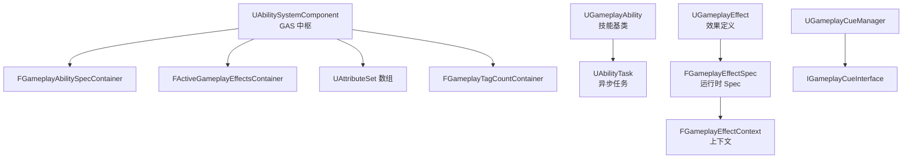
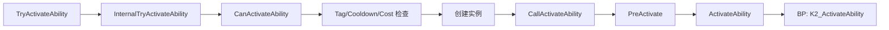

> [[00-UE全解析主索引|← 返回 UE全解析主索引]]

# UE-GameplayAbilities-源码解析：GAS 技能系统

## 模块定位

- **UE 模块路径**：`Engine/Plugins/Runtime/GameplayAbilities/Source/GameplayAbilities/`
- **Build.cs 文件**：`GameplayAbilities.Build.cs`
- **核心依赖**：`Core`、`CoreUObject`、`NetCore`、`Engine`、`GameplayTags`、`GameplayTasks`、`MovieScene`、`PhysicsCore`、`DeveloperSettings`、`DataRegistry`
- **Private 依赖**：`Niagara`（Cue 特效支持）
- **上层使用方**：RPG、MOBA、FPS 等各类需要复杂技能/状态系统的项目

> **分工定位**：GameplayAbilities（常称 GAS）是 UE 官方提供的**技能与效果系统插件**。它以 `UAbilitySystemComponent`（ASC）为中心，统筹管理 `UGameplayAbility`（技能）、`UGameplayEffect`（效果/增益减益）、`UAttributeSet`（属性集）和 `UGameplayCue`（视觉/听觉反馈），是大型游戏构建战斗、技能、Buff 体系的标准框架。

---

## 接口梳理（第 1 层）

### 核心头文件地图

| 头文件 | 核心类/结构 | 职责 |
|--------|------------|------|
| `Public/AbilitySystemComponent.h` | `UAbilitySystemComponent` | GAS 中枢，管理 Ability/GE/Attribute/Tag |
| `Public/Abilities/GameplayAbility.h` | `UGameplayAbility` | 单个技能逻辑基类 |
| `Public/AttributeSet.h` | `UAttributeSet` | 属性集基类（Health、Mana 等） |
| `Public/GameplayEffect.h` | `UGameplayEffect` | GE 资产定义 |
| `Public/GameplayEffectTypes.h` | `FGameplayEffectContext`、`FGameplayCueParameters` | GE 上下文与 Cue 参数 |
| `Public/GameplayAbilitySpec.h` | `FGameplayAbilitySpec`、`FGameplayAbilitySpecContainer` | 能力运行时规格 |
| `Public/GameplayCueManager.h` | `UGameplayCueManager` | Cue 全局分发管理器 |
| `Public/Abilities/GameplayAbilityTargetTypes.h` | `FGameplayAbilityTargetData` | 目标数据（点/方向/Actor） |
| `Public/Abilities/Tasks/AbilityTask.h` | `UAbilityTask` | Ability 任务基类（异步操作） |

### 核心类体系



---

## 数据结构（第 2 层）

### UAbilitySystemComponent — GAS 中枢

> 文件：`Engine/Plugins/Runtime/GameplayAbilities/Source/GameplayAbilities/Public/AbilitySystemComponent.h`

```cpp
UCLASS(ClassGroup=(Custom), meta=(BlueprintSpawnableComponent))
class GAMEPLAYABILITIES_API UAbilitySystemComponent : public UActorComponent, public IGameplayTagAssetInterface
{
    UPROPERTY()
    FGameplayAbilitySpecContainer ActivatableAbilities;

    UPROPERTY()
    FActiveGameplayEffectsContainer ActiveGameplayEffects;

    UPROPERTY()
    TArray<TObjectPtr<UAttributeSet>> SpawnedAttributes;

    UPROPERTY()
    FGameplayTagCountContainer GameplayTagCountContainer;

    virtual void InitAbilityActorInfo(AActor* InOwnerActor, AActor* InAvatarActor);
};
```

ASC 是 GAS 的**唯一入口**。一个 Actor 通常挂载一个 ASC，由其统一接管：
- **ActivatableAbilities**：已授予的能力列表（含 Handle、Level、Instance）
- **ActiveGameplayEffects**：当前生效的 GE 列表（Buff/Debuff）
- **SpawnedAttributes**：属性集实例数组
- **GameplayTagCountContainer**：动态 Tag 计数容器

### FGameplayAbilitySpec — 能力的运行时规格

> 文件：`Engine/Plugins/Runtime/GameplayAbilities/Source/GameplayAbilities/Public/GameplayAbilitySpec.h`

```cpp
USTRUCT()
struct FGameplayAbilitySpec
{
    GENERATED_USTRUCT_BODY()

    UPROPERTY()
    FGameplayAbilitySpecHandle Handle;

    UPROPERTY()
    TSubclassOf<UGameplayAbility> Ability;

    UPROPERTY()
    int32 Level;

    UPROPERTY()
    int32 InputID;

    UPROPERTY()
    TArray<TObjectPtr<UGameplayAbility>> ReplicatedInstances;

    UPROPERTY()
    TArray<TObjectPtr<UGameplayAbility>> NonReplicatedInstances;

    UPROPERTY()
    TObjectPtr<UObject> SourceObject;
};
```

`Handle` 是 ASC 上唯一标识该 Spec 的句柄。`Ability` 是 CDO 类，`Instances` 是运行时实例（根据 `InstancingPolicy` 可能有 0~N 个）。

### FGameplayEffectSpec — 效果的运行时实例

```cpp
USTRUCT()
struct FGameplayEffectSpec
{
    GENERATED_USTRUCT_BODY()

    UPROPERTY()
    TSubclassOf<UGameplayEffect> Def;

    UPROPERTY()
    float Level;

    UPROPERTY()
    FGameplayEffectContextHandle Context;

    UPROPERTY()
    TArray<FGameplayEffectModifiedAttribute> CapturedAttributes;

    UPROPERTY()
    TArray<FGameplayModifierInfo> Modifiers;

    UPROPERTY()
    TMap<FGameplayTag, float> SetByCallerTagMagnitudes;
};
```

`FGameplayEffectSpec` 是"待应用"状态的 GE，包含了所有运行时可变参数（Level、Context、捕获的属性、Modifiers、SetByCaller 数值）。它被传递给 `ApplyGameplayEffectSpecToSelf/Target`，最终转化为 `FActiveGameplayEffect`。

### UAttributeSet — 属性集

> 文件：`Engine/Plugins/Runtime/GameplayAbilities/Source/GameplayAbilities/Public/AttributeSet.h`

```cpp
UCLASS(Abstract, BlueprintType)
class GAMEPLAYABILITIES_API UAttributeSet : public UObject
{
    virtual void PreAttributeChange(const FGameplayAttribute& Attribute, float& NewValue);
    virtual void PostAttributeChange(const FGameplayAttribute& Attribute, float OldValue, float NewValue);
    virtual bool PreGameplayEffectExecute(...);
    virtual void PostGameplayEffectExecute(...);
};
```

属性集中的每个 `UPROPERTY` 必须是 `FGameplayAttributeData` 类型（含 `BaseValue` 和 `CurrentValue`）。GE 修改的是 `CurrentValue`，而等级、装备等永久加成修改的是 `BaseValue`。

---

## 行为分析（第 3 层）

### GAS 主流程

#### 1. Grant Ability（授予）

```cpp
FGameplayAbilitySpecHandle UAbilitySystemComponent::GiveAbility(const FGameplayAbilitySpec& Spec)
{
    // Authority 检查
    ActivatableAbilities.Items.Add(Spec);

    if (InstancingPolicy == EGameplayAbilityInstancingPolicy::InstancedPerActor)
    {
        CreateNewInstanceOfAbility(Spec);
    }

    OnGiveAbility(Spec);
    return Spec.Handle;
}
```

蓝图入口：`K2_GiveAbility(TSubclassOf<UGameplayAbility> AbilityClass, int32 Level, int32 InputID)`

#### 2. Activate（激活）



```cpp
bool UAbilitySystemComponent::TryActivateAbility(FGameplayAbilitySpecHandle Handle, bool bAllowRemoteActivation)
{
    return InternalTryActivateAbility(Handle, PredictionKey, ...);
}

bool UAbilitySystemComponent::InternalTryActivateAbility(...)
{
    // 1. 查找 Spec
    // 2. CanActivateAbility() — Tag、Cooldown、Cost 检查
    // 3. 网络权限 & Prediction 处理
    // 4. 若 InstancedPerExecution 则创建新实例
    // 5. UGameplayAbility::CallActivateAbility(...)
}
```

`CanActivateAbility` 是**纯查询无副作用**，子类/蓝图可覆写。通过后会进入 `ActivateAbility`，这是**子类/蓝图定义技能逻辑的核心入口**。

#### 3. Commit Ability（提交资源）

```cpp
UFUNCTION(BlueprintCallable, Category = "Ability")
bool UGameplayAbility::K2_CommitAbility()
{
    return CommitAbility(CurrentSpecHandle, CurrentActorInfo, CurrentActivationInfo);
}

bool UGameplayAbility::CommitAbility(...)
{
    if (CommitCheck(...))
    {
        CommitExecute(...);
        return true;
    }
    return false;
}
```

`CommitExecute` 内部：
- `CheckCost` / `ApplyCost`
- `CheckCooldown` / `ApplyCooldown`

这是"真正扣除资源"的时机。很多技能采用"先 Activate 做前摇动画，再 Commit 扣资源"的设计。

#### 4. End Ability（结束）

```cpp
UFUNCTION(BlueprintCallable, Category = "Ability")
void UGameplayAbility::K2_EndAbility()
{
    EndAbility(CurrentSpecHandle, CurrentActorInfo, CurrentActivationInfo, false, false);
}

void UGameplayAbility::EndAbility(...)
{
    K2_OnEndAbility(bWasCancelled);
    UAbilitySystemComponent::NotifyAbilityEnded(Handle, Ability, bWasCancelled);
    // 清理实例、ReplicatedData、Tag Block/Cancel 恢复
}
```

#### 5. Apply GameplayEffect（应用效果）

```cpp
FActiveGameplayEffectHandle UAbilitySystemComponent::ApplyGameplayEffectSpecToSelf(
    const FGameplayEffectSpec& Spec,
    FPredictionKey PredictionKey)
{
    return ActiveGameplayEffects.ApplyGameplayEffectSpec(Spec, ...);
}
```

`ApplyGameplayEffectSpec` 内部流程：
1. 免疫检查（Immunity）
2. Stacking 处理（覆盖/累加/刷新）
3. Attribute Capture（根据 Snapshot/OnAdd 策略捕获属性值）
4. Modifier 计算（Additive/Multiplicative/Divide/Override）
5. 更新 Attribute Aggregator
6. 触发 `PostAttributeChange` 回调
7. 触发 GameplayCue（OnActive / WhileActive / Executed / Removed）

### Ability Instancing Policy

| 策略 | 说明 |
|---|---|
| **InstancedPerActor**（默认推荐） | 每个 Actor 一个实例，支持 RPC，状态可保留 |
| **InstancedPerExecution** | 每次激活新建实例，不支持 RPC，无状态保留 |
| **NonInstanced**（已弃用） | 直接操作 CDO，无状态，无 RPC |

### GameplayCue 分发

> 文件：`Engine/Plugins/Runtime/GameplayAbilities/Source/GameplayAbilities/Public/GameplayCueManager.h`

```cpp
UCLASS()
class UGameplayCueManager : public UObject
{
    virtual void HandleGameplayCue(AActor* TargetActor, FGameplayTag GameplayCueTag,
        EGameplayCueEvent::Type EventType, const FGameplayCueParameters& Parameters);

    virtual void RouteGameplayCue(...);
};
```

Cue 支持三种接收方式：
1. `IGameplayCueInterface`（Actor 实现接口）
2. `UGameplayCueNotify_Actor`（ spawned Actor 形式）
3. `UGameplayCueNotify_Static`（静态函数调用，无 Actor 开销）

---

## 与上下层的关系

### 下层依赖

| 下层模块 | 作用 |
|---------|------|
| `GameplayTags` | Tag 系统的全部能力（Grant/Block/Cancel、GE Tags、Cue Tags） |
| `GameplayTasks` | `UAbilityTask` 的底层异步任务框架 |
| `MovieScene` | 蒙太奇（AnimMontage）播放与复制 |
| `NetCore` / `Engine` | PredictionKey、RPC、属性复制 |

### 上层调用者

| 上层模块 | 使用方式 |
|---------|---------|
| `项目 Gameplay 代码` | 继承 `UAttributeSet`、`UGameplayAbility`，在 ASC 上 Grant/Activate |
| `Editor` | GAS 编辑器插件提供 Ability Blueprint 调试、GE 堆栈可视化 |

---

## 设计亮点与可迁移经验

1. **ASC 作为单一权责中心**：所有与技能、效果、属性相关的能力都收敛到 `UAbilitySystemComponent`。这种"单组件即子系统"的设计避免了 Ability/GE/Attribute 散落在各个 Actor 中，极大简化了网络同步和调试。
2. **InstancingPolicy 的灵活性**：默认 `InstancedPerActor` 让每个技能实例可以保存状态、发送 RPC；而 `InstancedPerExecution` 适用于纯瞬发技能。自研技能系统应在设计早期就明确实例化策略。
3. **Spec 模式**：`FGameplayAbilitySpec` 和 `FGameplayEffectSpec` 都是"定义 + 运行时参数"的分离模式。CDO/蓝图资产负责定义，Spec 负责携带 Level、Context、SourceObject 等运行时信息。这是 UE 中资产驱动逻辑的通用范式。
4. **GameplayCue 的解耦反馈**：技能逻辑（Ability）与视听反馈（Cue）通过 `FGameplayTag` 完全解耦。Cue 可以是 Actor、静态函数或接口实现，支持客户端本地触发和服务器多播。这种"逻辑-表现分离"对大型团队协作至关重要。
5. **PredictionKey 的客户端预测**：GAS 内置了 `FPredictionKey` 机制，允许客户端在收到服务器确认前本地预执行 Ability 和 GE，收到服务器回滚指令后再修正。这是竞技游戏低延迟手感的关键技术。
6. **Attribute Aggregator 的 Base/Current 分离**：`FGameplayAttributeData` 包含 `BaseValue`（永久加成）和 `CurrentValue`（临时 GE 修改）。 Aggregator 按 Modifier 类型（Additive/Multiply/Override）分层计算最终值，非常清晰。
7. **AbilityTask 的异步编程模型**：通过 `UAbilityTask`（如 `WaitInputPress`、`PlayMontageAndWait`、`WaitGameplayEvent`），蓝图可以在 `ActivateAbility` 中以顺序/等待的方式编写复杂异步逻辑，而无需手动管理状态机。这是 GAS 对设计师最友好的特性之一。

---

## 关键源码片段

### UAbilitySystemComponent 核心字段

> 文件：`Engine/Plugins/Runtime/GameplayAbilities/Source/GameplayAbilities/Public/AbilitySystemComponent.h`

```cpp
UCLASS(ClassGroup=(Custom), meta=(BlueprintSpawnableComponent))
class GAMEPLAYABILITIES_API UAbilitySystemComponent : public UActorComponent
{
    UPROPERTY()
    FGameplayAbilitySpecContainer ActivatableAbilities;

    UPROPERTY()
    FActiveGameplayEffectsContainer ActiveGameplayEffects;

    UPROPERTY()
    TArray<TObjectPtr<UAttributeSet>> SpawnedAttributes;

    UPROPERTY()
    FGameplayTagCountContainer GameplayTagCountContainer;

    virtual void InitAbilityActorInfo(AActor* InOwnerActor, AActor* InAvatarActor);
};
```

### UGameplayAbility 生命周期

> 文件：`Engine/Plugins/Runtime/GameplayAbilities/Source/GameplayAbilities/Public/Abilities/GameplayAbility.h`

```cpp
UCLASS(Abstract, BlueprintType)
class GAMEPLAYABILITIES_API UGameplayAbility : public UObject
{
    virtual bool CanActivateAbility(const FGameplayAbilitySpecHandle Handle, ...);
    virtual void ActivateAbility(const FGameplayAbilitySpecHandle Handle, ...);
    virtual bool CommitAbility(const FGameplayAbilitySpecHandle Handle, ...);
    virtual void EndAbility(const FGameplayAbilitySpecHandle Handle, ...);
};
```

### ApplyGameplayEffectSpecToSelf

> 文件：`Engine/Plugins/Runtime/GameplayAbilities/Source/GameplayAbilities/Public/AbilitySystemComponent.h`

```cpp
virtual FActiveGameplayEffectHandle ApplyGameplayEffectSpecToSelf(
    const FGameplayEffectSpec& Spec,
    FPredictionKey PredictionKey);
```

---

## 关联阅读

- [[UE-GameplayTags-源码解析：GameplayTags 与状态系统]] — GAS 的底层标签基础设施
- [[UE-Engine-源码解析：网络同步与预测]] — GAS 中 PredictionKey 与网络复制的深度关联
- [[UE-AnimGraphRuntime-源码解析：动画图与 BlendSpace]] — AbilityTask 中 AnimMontage 的底层动画系统

---

## 索引状态

- **所属 UE 阶段**：第四阶段 — 客户端运行时层 / 4.4 玩法运行时与同步
- **对应 UE 笔记**：UE-GameplayAbilities-源码解析：GAS 技能系统
- **本轮完成度**：✅ 第三轮（骨架扫描 + 血肉填充 + 关联辐射 已完成）
- **更新日期**：2026-04-17
