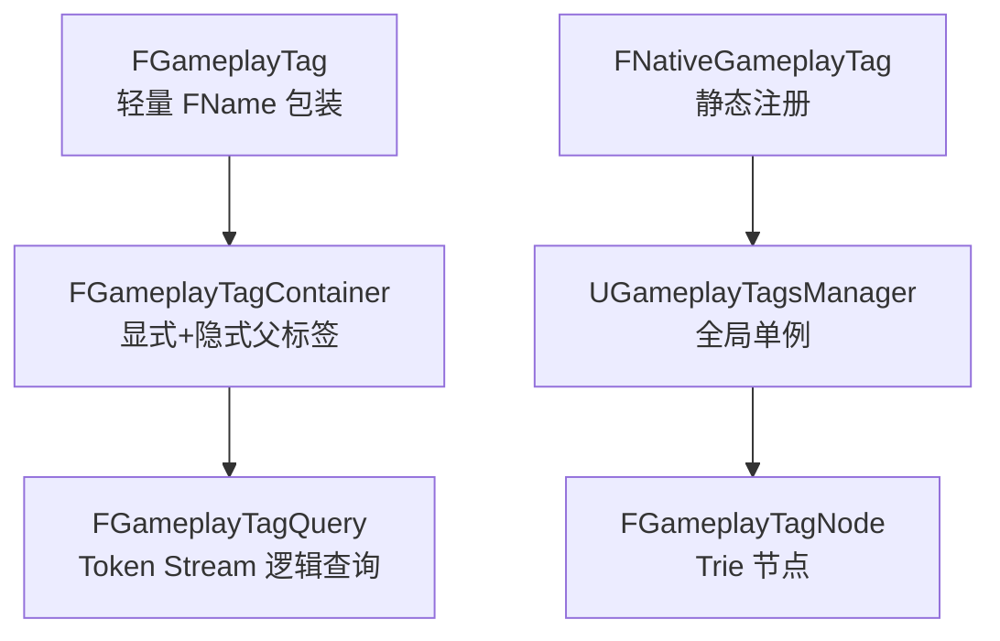
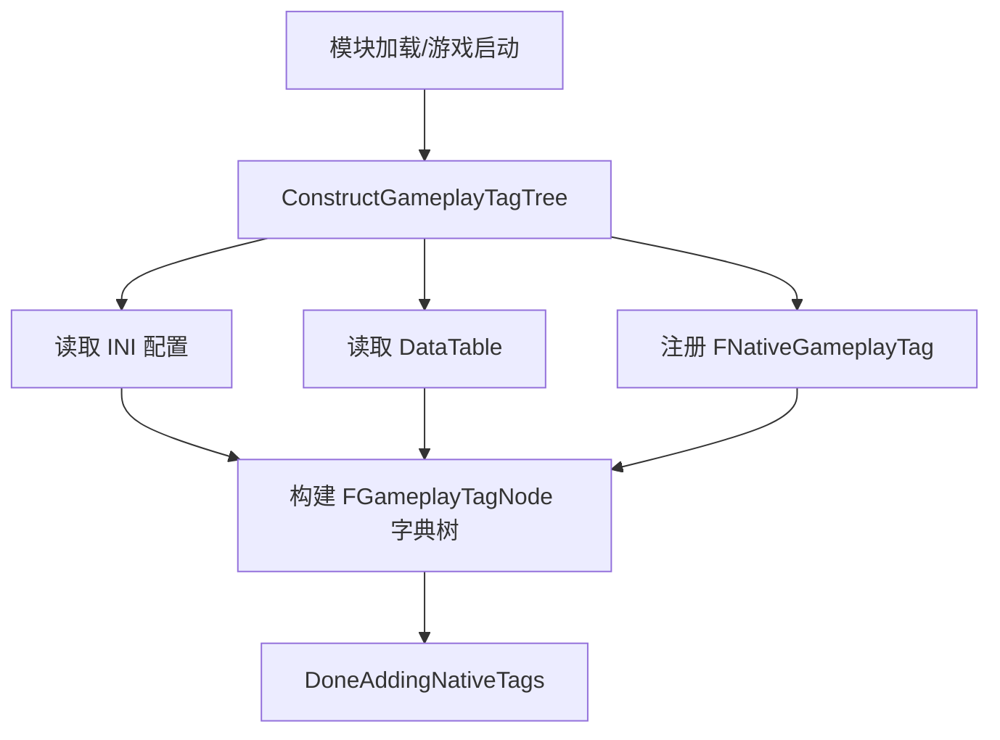

> [← 返回 UE全解析主索引]([[00-UE全解析主索引|UE全解析主索引]])

# UE-GameplayTags-源码解析：GameplayTags 与状态系统

## 模块定位

- **UE 模块路径**：`Engine/Source/Runtime/GameplayTags/`
- **Build.cs 文件**：`GameplayTags.Build.cs`
- **核心依赖**：`Core`、`CoreUObject`、`Engine`、`DeveloperSettings`
- **Private 依赖**：`Projects`、`NetCore`、`Json`、`JsonUtilities`
- **上层使用方**：`GameplayAbilities`、EnhancedInput、AIModule、项目 Gameplay 代码

> **分工定位**：GameplayTags 是 UE 的**层级标签基础设施**。它以 `FName` 为底层存储，通过字典树（Trie）结构维护标签的层级关系、隐式父标签匹配、网络复制索引和重定向表。它是 GAS（GameplayAbilities）、EnhancedInput 的 InputMode 过滤、AI 感知分类等众多系统的数据基石。

---

## 接口梳理（第 1 层）

### 公共头文件地图

| 头文件 | 核心类/结构 | 职责 |
|--------|------------|------|
| `Classes/GameplayTagContainer.h` | `FGameplayTag`、`FGameplayTagContainer`、`FGameplayTagQuery` | 标签、容器、查询 |
| `Classes/GameplayTagsManager.h` | `UGameplayTagsManager`、`FGameplayTagNode` | 全局单例管理器、字典树节点 |
| `Classes/GameplayTagsSettings.h` | `UGameplayTagsSettings` | 开发者设置（FastReplication、INI 来源等） |
| `Classes/BlueprintGameplayTagLibrary.h` | `UBlueprintGameplayTagLibrary` | 蓝图函数库 |
| `Public/NativeGameplayTags.h` | `FNativeGameplayTag` | C++ 静态注册标签 |
| `Public/GameplayTagNetSerializer.h` | `FGameplayTagNetSerializer` | 网络序列化优化 |

### 核心类体系



---

## 数据结构（第 2 层）

### FGameplayTag — 轻量标签标识符

> 文件：`Engine/Source/Runtime/GameplayTags/Classes/GameplayTagContainer.h`

```cpp
USTRUCT(BlueprintType)
struct FGameplayTag
{
    GENERATED_USTRUCT_BODY()

    UPROPERTY(EditAnywhere, BlueprintReadWrite, Category=GameplayTag)
    FName TagName;

    bool MatchesTag(const FGameplayTag& TagToCheck) const;
    bool MatchesAny(const FGameplayTagContainer& Container) const;
    FGameplayTagContainer GetSingleTagContainer() const;
    FString GetTagNameAsString() const;
};
```

`FGameplayTag` 的本质就是 `FName`，大小极小，判等和哈希都走 `FName` 的快速路径。但它**必须是通过 `UGameplayTagsManager` 注册过的有效标签**，否则为空标签。

### FGameplayTagContainer — 显式与隐式父标签

```cpp
USTRUCT(BlueprintType)
struct FGameplayTagContainer
{
    GENERATED_USTRUCT_BODY()

    UPROPERTY()
    TArray<FGameplayTag> GameplayTags;    // 显式标签

    UPROPERTY()
    TArray<FGameplayTag> ParentTags;      // 隐式父标签（去重后）

    bool HasTag(const FGameplayTag& TagToCheck) const;
    bool HasAny(const FGameplayTagContainer& Container) const;
    bool HasAll(const FGameplayTagContainer& Container) const;
    FGameplayTagContainer Filter(const FGameplayTagContainer& OtherContainer) const;
    bool MatchesQuery(const FGameplayTagQuery& Query) const;
};
```

**隐式父标签机制**：
- 当加入 `"A.B.C"` 时，容器会自动将其父标签 `"A.B"` 和 `"A"` 加入 `ParentTags`
- `HasTag("A")` 会同时检查 `GameplayTags` 和 `ParentTags`，因此 `"A.B.C".HasTag("A") == true`
- `HasTagExact("A")` 只检查 `GameplayTags`，不做隐式匹配

这是 GameplayTags 最核心的设计：层级标签天然支持前缀匹配，无需运行时字符串拆分。

### FGameplayTagQuery — 逻辑查询表达式

```cpp
USTRUCT(BlueprintType)
struct FGameplayTagQuery
{
    GENERATED_USTRUCT_BODY()

    bool Matches(const FGameplayTagContainer& Tags) const;

    static FGameplayTagQuery BuildQuery(...);
};
```

`FGameplayTagQuery` 内部是一个 **Token Stream**，支持嵌套逻辑表达式：
- `AnyTagsMatch`：至少有一个标签匹配
- `AllTagsMatch`：所有标签都匹配
- `NoTagsMatch`：没有标签匹配
- `AnyExprMatch` / `AllExprMatch` / `NoExprMatch`：子表达式递归组合

查询在构造时编译为字节流，运行时通过解释器执行，效率高于反复调用容器 API。

### UGameplayTagsManager — 全局字典树

> 文件：`Engine/Source/Runtime/GameplayTags/Classes/GameplayTagsManager.h`

```cpp
UCLASS()
class UGameplayTagsManager : public UObject
{
    TMap<FGameplayTag, TSharedPtr<FGameplayTagNode>> GameplayTagNodeMap;
    TArray<TSharedPtr<FGameplayTagNode>> GameplayRootTag;
    TArray<FNativeGameplayTag*> NativeTagsToAdd;
    bool bDoneAddingNativeTags;

    FGameplayTag RequestGameplayTag(FName TagName, bool ErrorIfNotFound);
    TSharedPtr<FGameplayTagNode> FindTagNode(const FGameplayTag& Tag) const;
    void ConstructGameplayTagTree();
};
```

核心数据结构：
- `GameplayTagNodeMap`：`FGameplayTag` → `FGameplayTagNode` 的哈希映射，用于 O(1) 查询
- `GameplayRootTag`：字典树的根节点列表（每个根对应一个顶层命名空间）
- `FGameplayTagNode`：存储层级关系、子节点列表、`NetIndex`、以及 `CompleteTagWithParents`（包含自身和所有父标签的容器）

### FNativeGameplayTag — C++ 静态注册

```cpp
struct FNativeGameplayTag
{
    FNativeGameplayTag(FName InTagName, const ANSICHAR* InDevComment, bool bInDeferredAddNative = false);
    ~FNativeGameplayTag();
};
```

通过 `UE_DEFINE_GAMEPLAY_TAG` 宏，可以在 C++ 编译期声明标签变量。模块加载时，`FNativeGameplayTag` 的构造函数会自动将其注册到 `UGameplayTagsManager`。这是**代码与数据解耦**的关键：标签在代码中强类型引用，在运行时动态注册到全局字典树。

---

## 行为分析（第 3 层）

### Tag 注册流程



1. **`ConstructGameplayTagTree()`**
   - 从 `UGameplayTagsSettings` 读取配置的 INI 文件和 DataTable
   - 遍历 `NativeTagsToAdd` 数组，注册所有 `FNativeGameplayTag`
   - 为每个标签创建 `FGameplayTagNode`，建立父子关系

2. **`FNativeGameplayTag::FNativeGameplayTag(...)`**
   - 静态构造时调用 `UGameplayTagsManager::AddNativeGameplayTag`
   - 若 Manager 尚未初始化，则加入 `NativeTagsToAdd` 延迟注册

3. **`DoneAddingNativeTags()`**
   - 标记 Native 标签注册结束
   - 触发 `OnDoneAddingNativeTagsDelegate`
   - 此后标签表被视为锁定状态，网络复制的 `NetIndex` 表也固定下来

### Tag 查询与匹配流程

#### RequestGameplayTag

```cpp
FGameplayTag UGameplayTagsManager::RequestGameplayTag(FName TagName, bool ErrorIfNotFound)
{
    // 1. 重定向检查
    TagName = FGameplayTagRedirectors::CheckForRedirect(TagName);

    // 2. 查字典树节点
    FGameplayTag Tag = FGameplayTag(TagName);
    if (GameplayTagNodeMap.Contains(Tag))
    {
        return Tag;
    }

    // 3. 未找到
    if (ErrorIfNotFound)
    {
        ensureMsgf(false, TEXT("Requested Tag %s was not found"), *TagName.ToString());
    }
    return FGameplayTag();
}
```

#### MatchesTag

```cpp
bool FGameplayTag::MatchesTag(const FGameplayTag& TagToCheck) const
{
    if (const TSharedPtr<FGameplayTagNode> TagNode = UGameplayTagsManager::Get().FindTagNode(*this))
    {
        return TagNode->GetSingleTagContainer().HasTag(TagToCheck);
    }
    return false;
}
```

`GetSingleTagContainer()` 返回的 `FGameplayTagContainer` 已经预计算了 `"A.B.C"` 的父标签 `"A.B"` 和 `"A"`。因此 `MatchesTag` 只需一次容器查找即可判断层级关系，无需运行时字符串解析。

### 网络复制优化

`FGameplayTagNetSerializer` 为标签和容器提供了高效的网络序列化：
- **Fast Replication**：若标签表已锁定，可用 `NetIndex`（uint16）代替完整 `FName` 传输
- **动态复制**：若标签表在运行时扩展，则回退到 `FName` 字符串传输

> 配置项：`UGameplayTagsSettings::bUseFastReplication`

---

## 与上下层的关系

### 下层依赖

| 下层模块 | 作用 |
|---------|------|
| `Core` / `CoreUObject` | `FName`、USTRUCT 反射、`TMap`/`TArray` |
| `Engine` | `UDeveloperSettings`、DataTable 支持 |
| `NetCore` | 网络序列化接口 |

### 上层调用者

| 上层模块 | 使用方式 |
|---------|---------|
| `GameplayAbilities` | GAS 的 Tag 基础设施（900+ 处引用）。Ability 的 Grant/Block/Cancel、GE 的 Tags、GameplayCue 均依赖 GameplayTags |
| `EnhancedInput` | IMC 的 InputMode 过滤使用 `FGameplayTagQuery` |
| `AIModule` | AI 感知系统的 Team、Damage 类型等分类标签 |
| `项目代码` | 通过 `UBlueprintGameplayTagLibrary` 在蓝图中使用 |

---

## 设计亮点与可迁移经验

1. **FName 轻量包装 + 字典树预计算**：GameplayTags 以 `FName` 为存储核心，但所有层级关系和隐式父标签都在注册时预计算到 `FGameplayTagNode` 中。运行时匹配只需查表，无需字符串拆分，兼顾了可读性和性能。
2. **隐式父标签机制**：`FGameplayTagContainer` 维护显式标签和隐式父标签两个数组，让 `"A.B.C".HasTag("A")` 成为 O(1) 操作。这是层级标签系统相比普通字符串集合的最大性能优势。
3. **Token Stream 查询编译**：`FGameplayTagQuery` 在构造时将嵌套逻辑表达式编译为字节流，运行时解释执行。这种"编译期优化、运行期解释"的模式非常适合频繁执行的复杂查询场景。
4. **Native 标签静态注册**：`UE_DEFINE_GAMEPLAY_TAG` 让 C++ 代码可以强类型引用标签，同时保持运行时的动态注册能力。这对大型项目中避免标签字符串拼写错误、支持重构非常有价值。
5. **NetIndex 网络复制优化**：通过 `DoneAddingNativeTags` 锁定标签表后，网络传输可用 2 字节的 `NetIndex` 代替可变长度字符串，显著降低带宽消耗。这是状态同步游戏中标签系统必须考虑的优化点。
6. **标签重定向**：`FGameplayTagRedirectors` 支持在配置中定义旧标签到新标签的映射，让项目可以在不破坏存档/配置的情况下重命名标签。

---

## 关键源码片段

### FGameplayTag 核心声明

> 文件：`Engine/Source/Runtime/GameplayTags/Classes/GameplayTagContainer.h`

```cpp
USTRUCT(BlueprintType)
struct FGameplayTag
{
    GENERATED_USTRUCT_BODY()

    UPROPERTY(EditAnywhere, BlueprintReadWrite, Category=GameplayTag)
    FName TagName;

    bool MatchesTag(const FGameplayTag& TagToCheck) const;
    bool MatchesAny(const FGameplayTagContainer& Container) const;
};
```

### FGameplayTagContainer 隐式父标签

> 文件：`Engine/Source/Runtime/GameplayTags/Classes/GameplayTagContainer.h`

```cpp
USTRUCT(BlueprintType)
struct FGameplayTagContainer
{
    UPROPERTY()
    TArray<FGameplayTag> GameplayTags;

    UPROPERTY()
    TArray<FGameplayTag> ParentTags;

    bool HasTag(const FGameplayTag& TagToCheck) const;
    bool HasAny(const FGameplayTagContainer& Container) const;
    bool HasAll(const FGameplayTagContainer& Container) const;
};
```

### UGameplayTagsManager 核心字段

> 文件：`Engine/Source/Runtime/GameplayTags/Classes/GameplayTagsManager.h`

```cpp
UCLASS()
class UGameplayTagsManager : public UObject
{
    TMap<FGameplayTag, TSharedPtr<FGameplayTagNode>> GameplayTagNodeMap;
    TArray<TSharedPtr<FGameplayTagNode>> GameplayRootTag;
    bool bDoneAddingNativeTags;

    FGameplayTag RequestGameplayTag(FName TagName, bool ErrorIfNotFound);
    TSharedPtr<FGameplayTagNode> FindTagNode(const FGameplayTag& Tag) const;
};
```

---

## 关联阅读

- [[UE-GameplayAbilities-源码解析：GAS 技能系统]] — GameplayTags 在技能系统中的核心应用
- [[UE-EnhancedInput-源码解析：增强输入系统]] — InputMode 过滤中的 FGameplayTagQuery 使用
- [[UE-AIModule-源码解析：AI 与行为树]] — AI 感知中的标签分类

---

## 索引状态

- **所属 UE 阶段**：第四阶段 — 客户端运行时层 / 4.4 玩法运行时与同步
- **对应 UE 笔记**：UE-GameplayTags-源码解析：GameplayTags 与状态系统
- **本轮完成度**：✅ 第三轮（骨架扫描 + 血肉填充 + 关联辐射 已完成）
- **更新日期**：2026-04-17
