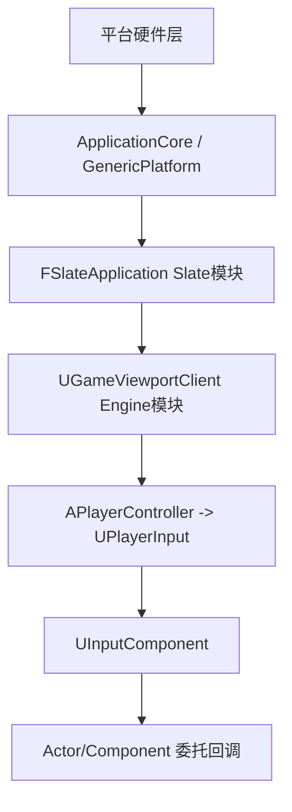

> [← 返回 UE全解析主索引]([[00-UE全解析主索引|UE全解析主索引]])

# UE-InputCore-源码解析：输入系统与 Action Mapping

## 模块定位

- **UE 模块路径**：`Engine/Source/Runtime/InputCore/`
- **Build.cs 文件**：`InputCore.Build.cs`
- **核心依赖**：`Core`、`CoreUObject`
- **上层核心依赖者**：`Engine`（PlayerInput、Action/Axis Mapping）、`Slate`（UI 输入事件）、`ApplicationCore`（平台消息）

> **分工定位**：InputCore 是 UE 输入体系的最底层"键类型与平台映射"模块。它本身不处理事件流，只提供通用的 `FKey` 类型定义、键元数据 `FKeyDetails` 和平台键码映射基础设施。真正的 Action Mapping 逻辑与事件分发位于 **Engine** 模块，UI 层面的快捷键组合则在 **Slate** 模块。

---

## 接口梳理（第 1 层）

### 公共头文件地图

| 头文件 | 核心类/结构 | 职责 |
|--------|------------|------|
| `Classes/InputCoreTypes.h` | `FKey`、`EKeys`、`FKeyDetails`、`FInputKeyManager` | 输入键标识符、全局键库、键元数据、虚拟键码映射管理器 |
| `Public/InputCoreModule.h` | `FInputCoreModule` | 模块接口 |
| `Public/GenericPlatform/GenericPlatformInput.h` | `FGenericPlatformInput` | 跨平台输入工具基类，提供 `RemapKey`、`GetGamepadAcceptKey` 等平台覆写点 |
| `Public/HAL/PlatformInput.h` | 平台分发头 | 根据平台包含对应 `*PlatformInput.h` |

### 核心类体系

#### FKey — 轻量键标识符

> 文件：`Engine/Source/Runtime/InputCore/Classes/InputCoreTypes.h`，第 48~127 行

```cpp
USTRUCT(BlueprintType, Blueprintable)
struct FKey
{
    GENERATED_USTRUCT_BODY()

    UPROPERTY(EditAnywhere, Category="Input")
    FName KeyName;

    mutable TSharedPtr<struct FKeyDetails> KeyDetails;

    INPUTCORE_API bool IsGamepadKey() const;
    INPUTCORE_API bool IsAxis1D() const;
    INPUTCORE_API bool IsAxis2D() const;
    INPUTCORE_API bool IsVirtual() const;
    // ...
};
```

`FKey` 内部仅封装一个 `FName` 和一个懒加载的 `TSharedPtr<FKeyDetails>`。它是整个 UE 输入系统的**最小数据单元**，从底层平台消息到高层 Action Mapping 均以此传递。

#### EKeys — 全局静态键库

> 文件：`Engine/Source/Runtime/InputCore/Classes/InputCoreTypes.h`，第 289~500 行（概念位置）

```cpp
struct EKeys
{
    static INPUTCORE_API const FKey AnyKey;
    static INPUTCORE_API const FKey MouseX;
    static INPUTCORE_API const FKey LeftMouseButton;
    static INPUTCORE_API const FKey A;
    static INPUTCORE_API const FKey Gamepad_LeftX;
    static INPUTCORE_API const FKey Virtual_Accept;
    // ... 涵盖键盘、鼠标、手柄、VR、触摸、手势、Steam 控制器等
};
```

`EKeys` 在模块加载时通过 `AddKey` 将所有键注册到 `FInputKeyManager`，并构建 `FKeyDetails`（含 `EKeyFlags`：Gamepad/Touch/MouseButton/Axis1D/Axis2D/Virtual 等）。

#### FKeyDetails — 键元数据

> 文件：`Engine/Source/Runtime/InputCore/Classes/InputCoreTypes.h`，第 145~251 行

```cpp
struct FKeyDetails
{
    enum EKeyFlags
    {
        GamepadKey      = 1 << 0,
        Touch           = 1 << 1,
        MouseButton     = 1 << 2,
        Axis1D          = 1 << 5,
        Axis2D          = 1 << 11,
        Virtual         = 1 << 13,
        // ...
    };

    inline bool IsGamepadKey() const { return bIsGamepadKey != 0; }
    inline bool IsAxis1D() const { return AxisType == EInputAxisType::Axis1D; }
    inline bool IsVirtual() const { return bIsVirtual != 0; }
    // ...
};
```

通过 `FKeyDetails`，上层可以判断一个键的类型属性，而不依赖字符串解析。Virtual 键（如 `Virtual_Accept`）允许跨平台使用统一的逻辑键名，实际运行时由 `FGenericPlatformInput::RemapKey` 映射到具体平台键。

---

## 数据结构（第 2 层）

### FInputKeyManager — 虚拟键码双向映射

`FInputKeyManager` 是单例管理器，维护两套核心映射：
1. **虚拟键码/字符码 → FKey**：用于平台层将原生按键事件翻译为 `FKey`
2. **FKey → FKeyDetails**：通过 `EKeys::AddKey` 注册

> **注意**：`FInputKeyManager` 和 `EKeys` 的初始化发生在模块启动阶段（`InputCoreModule.cpp`），属于静态全局注册。

### 平台抽象：FGenericPlatformInput

> 文件：`Engine/Source/Runtime/InputCore/Public/GenericPlatform/GenericPlatformInput.h`，第 11~51 行

```cpp
struct FGenericPlatformInput
{
    inline static FKey RemapKey(FKey Key) { return Key; }

    static FKey GetGamepadAcceptKey()
    {
        return EKeys::Gamepad_FaceButton_Bottom;
    }

    static FKey GetGamepadBackKey()
    {
        return EKeys::Gamepad_FaceButton_Right;
    }

    static INPUTCORE_API uint32 GetStandardPrintableKeyMap(...);
};
```

各平台（Windows/Mac/Linux/iOS/Android）通过子类覆写 `RemapKey`、`GetKeyMap` 等方法，实现：
- 键位重映射（如 Mac 的 Delete 映射为 BackSpace）
- 游戏手柄确认/返回键差异（Xbox 是 Bottom，PS 可能是 Right）
- 原生键码到 `FKey` 的批量映射

---

## 行为分析（第 3 层）

### 输入事件向上层流转路径

InputCore 本身**不执行任何事件处理**。完整输入链路如下：



- **ApplicationCore**：捕获原生消息（Win32/X11/Cocoa），调用 `FGenericPlatformApplicationMisc` 或 `FGenericApplicationMessageHandler`
- **Slate**：`FSlateApplication` 将消息转换为 `FKeyEvent`、`FPointerEvent`、`FAnalogInputEvent`，先做 UI 命中测试和焦点路由
- **Engine**：`UGameViewportClient::InputKey` / `InputAxis` 将事件递交给 `APlayerController`
- **PlayerInput**：`UPlayerInput`（或 `UEnhancedPlayerInput`）维护按键状态，解析 Action/Axis Mapping
- **InputComponent**：最终按绑定委托分发给具体的 Actor/Component

### Action Mapping 关键类定义位置（Engine 模块）

| 类/结构体 | 文件 |
|-----------|------|
| `UInputSettings` | `Engine/Classes/GameFramework/InputSettings.h` |
| `UPlayerInput` | `Engine/Classes/GameFramework/PlayerInput.h` |
| `UInputComponent` | `Engine/Classes/Components/InputComponent.h` |
| `FInputActionBinding` / `FInputAxisBinding` | `Engine/Classes/Components/InputComponent.h` |
| `FInputActionKeyMapping` / `FInputAxisKeyMapping` | `Engine/Classes/GameFramework/PlayerInput.h` |

---

## 与上下层的关系

### 下层依赖

| 下层模块 | 作用 |
|---------|------|
| `Core` / `CoreUObject` | `FName`、`USTRUCT` 反射、`TSharedPtr`、序列化 |

### 上层调用者

| 上层模块 | 使用方式 |
|---------|---------|
| `Engine` | `PlayerInput` 使用 `FKey` 做 Action/Axis 映射键；`UInputComponent` 绑定 `FKey` 委托 |
| `Slate` / `SlateCore` | `FInputChord`（含 `FKey` + 修饰键）用于编辑器快捷键；`FPointerEvent` 携带 `FKey` 信息 |
| `ApplicationCore` | 平台消息处理器调用 `FGenericPlatformInput` 做键码转换 |
| `EnhancedInput` | 继承 `UPlayerInput`，使用 `FKey` 构建 `FEnhancedActionKeyMapping` |

---

## 设计亮点与可迁移经验

1. **FKey 作为最小不可变标识符**：整个输入系统只用 `FName` 封装，不依赖字符串比较，哈希和判等开销极小。自研引擎的输入抽象层应采用类似的轻量 ID 类型。
2. **键元数据与键值分离**：`FKey` 只负责身份标识，`FKeyDetails` 负责类型元数据。这种分离让键可以在不同上下文（UI、Gameplay、配置）中复用，同时保留丰富的查询能力。
3. **Virtual Key 跨平台抽象**：通过 `FGenericPlatformInput::RemapKey` 和 `Virtual` 标志，实现"逻辑键"到"物理键"的解耦。这对支持多手柄、多平台输入至关重要。
4. **纯数据层，不处理事件流**：InputCore 严格限定在"键定义"和"平台映射"，事件路由、状态机、映射逻辑全部上浮到 Engine/Slate。这种清晰的模块边界避免了循环依赖和功能膨胀。

---

## 关键源码片段

### FKey 核心声明

> 文件：`Engine/Source/Runtime/InputCore/Classes/InputCoreTypes.h`，第 48~127 行

```cpp
USTRUCT(BlueprintType, Blueprintable)
struct FKey
{
    GENERATED_USTRUCT_BODY()

    UPROPERTY(EditAnywhere, Category="Input")
    FName KeyName;

    mutable TSharedPtr<struct FKeyDetails> KeyDetails;

    INPUTCORE_API bool IsGamepadKey() const;
    INPUTCORE_API bool IsAxis1D() const;
    INPUTCORE_API bool IsAxis2D() const;
    INPUTCORE_API bool IsVirtual() const;
    INPUTCORE_API bool IsBindableToActions() const;
};
```

### FKeyDetails 元数据标志

> 文件：`Engine/Source/Runtime/InputCore/Classes/InputCoreTypes.h`，第 145~200 行

```cpp
struct FKeyDetails
{
    enum EKeyFlags
    {
        GamepadKey    = 1 << 0,
        Touch         = 1 << 1,
        MouseButton   = 1 << 2,
        Axis1D        = 1 << 5,
        Axis2D        = 1 << 11,
        Virtual       = 1 << 13,
        // ...
    };
};
```

### 平台输入抽象

> 文件：`Engine/Source/Runtime/InputCore/Public/GenericPlatform/GenericPlatformInput.h`，第 11~51 行

```cpp
struct FGenericPlatformInput
{
    inline static FKey RemapKey(FKey Key) { return Key; }
    static FKey GetGamepadAcceptKey() { return EKeys::Gamepad_FaceButton_Bottom; }
    static FKey GetGamepadBackKey()   { return EKeys::Gamepad_FaceButton_Right; }
};
```

---

## 关联阅读

- [[UE-EnhancedInput-源码解析：增强输入系统]] — 在 InputCore 之上构建的现代化输入映射框架
- [[UE-Engine-源码解析：网络同步与预测]] — PlayerController 中的输入与网络同步关系
- [[UE-Slate-源码解析：Slate UI 运行时]] — UI 层输入事件路由

---

## 索引状态

- **所属 UE 阶段**：第四阶段 — 客户端运行时层 / 4.4 玩法运行时与同步
- **对应 UE 笔记**：UE-InputCore-源码解析：输入系统与 Action Mapping
- **本轮完成度**：✅ 第三轮（骨架扫描 + 血肉填充 + 关联辐射 已完成）
- **更新日期**：2026-04-17
