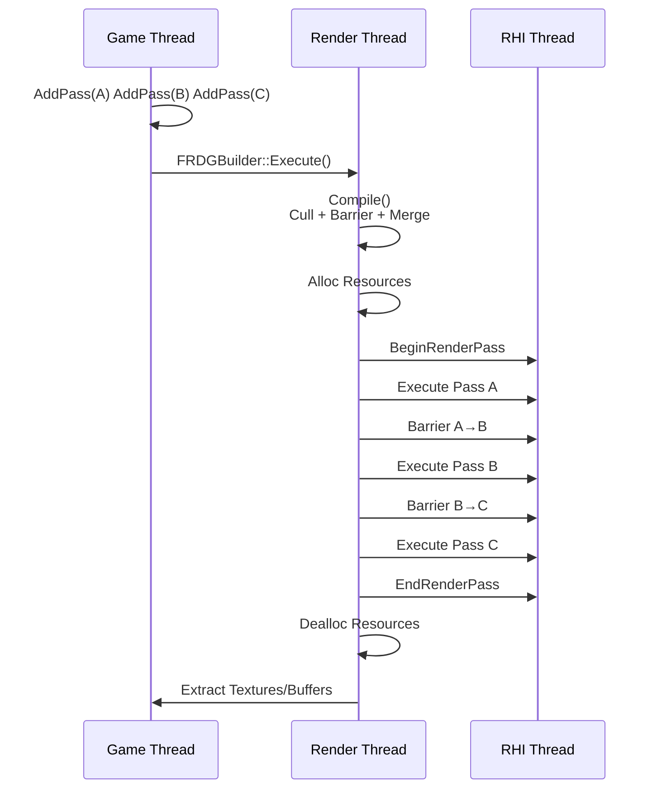

> [[Notes/UE/00-UE全解析主索引|← 返回 UE 全解析主索引]]

---

## 引言

渲染是现代游戏引擎中最复杂的子系统之一。CPU 端要管理场景剔除、材质计算、渲染状态，GPU 端要执行顶点处理、光栅化、像素着色——两者之间的协作如果缺乏清晰的抽象，很快就会变成一团乱麻。

**RenderCore** 是 UE 中承上启下的关键模块：它向上为 Renderer 提供高层渲染框架，向下通过 RHI 调用具体图形 API。这个模块的核心价值可以用两个关键词概括：

1. **RDG（Rendering Dependency Graph，渲染依赖图）**——一种声明式的 GPU 工作负载描述框架，让渲染管线的构建者只关心"做什么"，而把"何时做、资源如何过渡、内存如何复用"交给系统自动推导。
2. **渲染线程（Rendering Thread）**——一套跨线程命令分发机制，让游戏线程可以无阻塞地提交渲染工作，由专门的渲染线程（甚至 RHI 线程）异步执行。

本文按三层剥离法，从公共接口到数据结构，再到执行流程，逐层解析 RenderCore 的源码实现。

---

## 模块定位

RenderCore 位于 `Engine/Source/Runtime/RenderCore/`，其构建定义如下：

> 文件：`Engine/Source/Runtime/RenderCore/RenderCore.Build.cs`，第 8~64 行

```csharp
public class RenderCore : ModuleRules
{
    public RenderCore(ReadOnlyTargetRules Target) : base(Target)
    {
        PublicDependencyModuleNames.AddRange(new string[] { "RHI", "CoreUObject" });
        PrivateDependencyModuleNames.AddRange(new string[] { "Core", "Projects", "ApplicationCore", "TraceLog", "CookOnTheFly" });
        PrivateDependencyModuleNames.Add("Json");
        // ...
    }
}
```

| 维度 | 说明 |
|------|------|
| **Public 依赖** | [[UE-RHI-源码解析：RHI 抽象层与多后端切换\|RHI]]（图形 API 抽象）、CoreUObject（UObject 基础） |
| **Private 依赖** | Core、Projects、ApplicationCore、TraceLog、Json、BuildSettings 等 |
| **对外提供** | 渲染依赖图（RDG）、渲染线程命令系统、全局着色器注册、渲染资源池、渲染工具（VisualizeTexture、DumpGPU） |
| **上层消费者** | Renderer（DeferredShadingRenderer、MobileRenderer）、Niagara、HairStrands、各 Editor 视口渲染 |

---

## 第一层：接口层（What）

### 1.1 RDG 的公共接口：FRDGBuilder

**FRDGBuilder** 是用户使用 RDG 的唯一入口。它的设计哲学是"先描述，后执行"——用户在构建阶段通过 `AddPass` 声明渲染步骤，通过 `CreateTexture` / `CreateBuffer` 声明资源，最后调用 `Execute` 让系统一次性编译并执行整幅图。

> 文件：`Engine/Source/Runtime/RenderCore/Public/RenderGraphBuilder.h`，第 47~1216 行

```cpp
class FRDGBuilder : public FRDGScopeState
{
public:
    FRDGBuilder(FRHICommandListImmediate& RHICmdList, FRDGEventName Name = {}, 
                ERDGBuilderFlags Flags = ERDGBuilderFlags::None, 
                EShaderPlatform ShaderPlatform = GMaxRHIShaderPlatform);

    // 资源注册与创建
    FRDGTextureRef RegisterExternalTexture(const TRefCountPtr<IPooledRenderTarget>& ExternalPooledTexture, ...);
    FRDGTextureRef CreateTexture(const FRDGTextureDesc& Desc, const TCHAR* Name, ERDGTextureFlags Flags = ERDGTextureFlags::None);
    FRDGBufferRef  CreateBuffer(const FRDGBufferDesc& Desc, const TCHAR* Name, ERDGBufferFlags Flags = ERDGBufferFlags::None);

    // 创建视图
    FRDGTextureSRVRef CreateSRV(const FRDGTextureSRVDesc& Desc);
    FRDGTextureUAVRef CreateUAV(const FRDGTextureUAVDesc& Desc, ERDGUnorderedAccessViewFlags Flags = ...);

    // 添加 Pass（核心 API）
    template <typename ParameterStructType, typename ExecuteLambdaType>
    FRDGPassRef AddPass(FRDGEventName&& Name, const ParameterStructType* ParameterStruct, 
                        ERDGPassFlags Flags, ExecuteLambdaType&& ExecuteLambda);

    // 数据上传与提取
    void QueueBufferUpload(FRDGBufferRef Buffer, const void* InitialData, uint64 InitialDataSize, ...);
    void QueueTextureExtraction(FRDGTextureRef Texture, TRefCountPtr<IPooledRenderTarget>* OutPooledTexturePtr, ...);

    // 执行
    RENDERCORE_API void Execute();
};
```

**AddPass 的三种重载**：

| 重载 | 用途 |
|------|------|
| `AddPass(Name, ParameterStruct, Flags, Lambda)` | 标准用法，通过 `_RDG` 宏标记的参数结构体自动追踪资源依赖 |
| `AddPass(Name, ParametersMetadata, ParameterStruct, Flags, Lambda)` | 运行时生成的参数结构体 |
| `AddPass(Name, Flags, Lambda)` | 无参数 Pass，用于兼容旧代码或纯 RHI 操作 |

**ERDGPassFlags** 决定了 Pass 的 GPU 工作负载类型：

> 文件：`Engine/Source/Runtime/RenderCore/Public/RenderGraphDefinitions.h`，第 127~158 行

```cpp
enum class ERDGPassFlags : uint16
{
    None = 0,
    Raster = 1 << 0,        // 光栅化（Graphics Pipe）
    Compute = 1 << 1,       // 计算（Graphics Pipe）
    AsyncCompute = 1 << 2,  // 异步计算（Async Compute Pipe）
    Copy = 1 << 3,          // 拷贝命令
    NeverCull = 1 << 4,     // 禁止裁剪
    SkipRenderPass = 1 << 5,// 跳过 RenderPass Begin/End（用户自行管理）
    NeverMerge = 1 << 6,    // 禁止 RenderPass 合并
    NeverParallel = 1 << 7, // 禁止并行执行
};
```

### 1.2 渲染线程的公共接口

RenderCore 通过 `RenderingThread.h` 暴露了一套完整的渲染线程生命周期管理与命令提交 API：

> 文件：`Engine/Source/Runtime/RenderCore/Public/RenderingThread.h`，第 42~140 行

```cpp
// 渲染线程是否正在运行
extern RENDERCORE_API bool GIsThreadedRendering;

// 是否应使用渲染线程（可由命令行或 Console Command 切换）
extern RENDERCORE_API bool GUseThreadedRendering;

// 初始化 / 关闭渲染线程
extern RENDERCORE_API void InitRenderingThread();
extern RENDERCORE_API void ShutdownRenderingThread();

// 等待渲染线程完成所有 pending 命令（仅游戏线程调用）
extern RENDERCORE_API void FlushRenderingCommands();
```

**ENQUEUE_RENDER_COMMAND** 是游戏线程向渲染线程提交工作的核心宏：

> 文件：`Engine/Source/Runtime/RenderCore/Public/RenderingThread.h`，第 1167~1169 行

```cpp
#define ENQUEUE_RENDER_COMMAND(Type) \
    DECLARE_RENDER_COMMAND_TAG(PREPROCESSOR_JOIN(FRenderCommandTag_, PREPROCESSOR_JOIN(Type, __LINE__)), Type) \
    FRenderCommandDispatcher::Enqueue<PREPROCESSOR_JOIN(FRenderCommandTag_, PREPROCESSOR_JOIN(Type, __LINE__))>
```

使用示例：

```cpp
ENQUEUE_RENDER_COMMAND(MyDrawCommand)([](FRHICommandListImmediate& RHICmdList)
{
    // 这段代码将在渲染线程执行
    RHICmdList.DrawIndexedPrimitive(...);
});
```

### 1.3 RenderCore 的其他公共子系统

| 子系统 | 关键头文件 | 职责 |
|--------|-----------|------|
| 全局着色器 | `GlobalShader.h` | `FGlobalShader` 基类，着色器注册与查找 |
| 渲染资源 | `RenderResource.h` | `FRenderResource` 基类，管理 RHI 资源的初始化与释放 |
| 渲染目标池 | `RenderTargetPool.h` | `FPooledRenderTarget` 复用机制 |
| 统一缓冲 | `UnifiedBuffer.h` / `UniformBuffer.h` | GPU 统一缓冲区管理 |
| 可视化工具 | `VisualizeTexture.h` / `DumpGPU.h` | 调试纹理、GPU Dump |

---

## 第二层：数据层（How - Structure）

### 2.1 FRDGBuilder 的内部数据布局

FRDGBuilder 在构建阶段会积累大量中间状态，核心数据结构如下：

> 文件：`Engine/Source/Runtime/RenderCore/Public/RenderGraphBuilder.h`，第 540~720 行

```cpp
class FRDGBuilder
{
    // Pass / 资源注册表
    FRDGPassRegistry     Passes;      // 所有 Pass 的数组（Handle → Pass）
    FRDGTextureRegistry  Textures;    // 所有纹理
    FRDGBufferRegistry   Buffers;     // 所有缓冲
    FRDGViewRegistry     Views;       // 所有 SRV/UAV
    FRDGUniformBufferRegistry UniformBuffers; // 所有 UniformBuffer

    // 外部资源映射（去重）
    Experimental::TRobinHoodHashMap<FRHITexture*, FRDGTexture*, ...> ExternalTextures;
    Experimental::TRobinHoodHashMap<FRHIBuffer*,  FRDGBuffer*,  ...> ExternalBuffers;

    // 提取队列（执行完后把资源交还给调用者）
    TArray<FExtractedTexture, FRDGArrayAllocator> ExtractedTextures;
    TArray<FExtractedBuffer,  FRDGArrayAllocator> ExtractedBuffers;

    // 屏障批处理映射
    TMap<FRDGBarrierBatchBeginId, FRDGBarrierBatchBegin*, ...> BarrierBatchMap;

    // 临时资源分配器（由 RHI 后端提供，如 Vulkan/D3D12 的 transient allocator）
    IRHITransientResourceAllocator* TransientResourceAllocator = nullptr;
};
```

**关键设计**：所有 RDG 对象（Pass、Texture、Buffer 等）都通过 `TRDGHandleRegistry` 管理，使用紧凑的索引数组而非指针散列，既保证了访问效率，又便于调试时遍历。

### 2.2 FRDGPass：Pass 的状态与依赖

每个 Pass 不仅保存了用户提供的 Lambda，还保存了编译阶段推导出的完整资源状态：

> 文件：`Engine/Source/Runtime/RenderCore/Public/RenderGraphPass.h`，第 216~560 行

```cpp
class FRDGPass
{
    const FRDGEventName Name;
    const FRDGParameterStruct ParameterStruct;  // 着色器参数结构体（含 _RDG 资源引用）
    const ERDGPassFlags Flags;
    const ERDGPassTaskMode TaskMode;            // Inline / Await / Async
    const ERHIPipeline Pipeline;                // Graphics / AsyncCompute

    // 渲染通道合并相关
    uint16 bSkipRenderPassBegin : 1;   // 是否为合并后的中间 Pass
    uint16 bSkipRenderPassEnd   : 1;

    // 异步计算区间标记
    uint16 bAsyncComputeBegin : 1;     // 异步计算区间的第一个 Pass
    uint16 bAsyncComputeEnd   : 1;     // 异步计算区间的最后一个 Pass
    uint16 bGraphicsFork : 1;          // 从 Graphics 分叉到 AsyncCompute
    uint16 bGraphicsJoin : 1;          // 从 AsyncCompute 汇合回 Graphics

    // 裁剪标记
    uint8 bCulled : 1;                 // 是否被裁剪

    // 每个 Pass 引用的资源状态
    TArray<FTextureState, FRDGArrayAllocator> TextureStates;
    TArray<FBufferState,  FRDGArrayAllocator> BufferStates;

    // 依赖关系
    TArray<FRDGPassHandle, FRDGArrayAllocator> CrossPipelineConsumers; // 跨管线消费者
    TArray<FRDGPass*,     FRDGArrayAllocator> Producers;               // 直接前驱

    // 屏障批次（Prologue = 执行前，Epilogue = 执行后）
    FRDGBarrierBatchBegin* PrologueBarriersToBegin = nullptr;
    FRDGBarrierBatchEnd*   PrologueBarriersToEnd   = nullptr;
    FRDGBarrierBatchBegin* EpilogueBarriersToBeginForGraphics = nullptr;
    FRDGBarrierBatchBegin* EpilogueBarriersToBeginForAsyncCompute = nullptr;
    FRDGBarrierBatchEnd*   EpilogueBarriersToEnd = nullptr;
};
```

**FTextureState / FBufferState** 记录了每个资源在该 Pass 中的**子资源级别状态**：

```cpp
struct FTextureState
{
    FRDGTextureRef Texture;
    FRDGTextureSubresourceState State;      // 当前 Pass 的访问状态
    FRDGTextureSubresourceState MergeState; // 合并后的状态（用于 barrier 推导）
    uint32 ReferenceCount = 0;
};
```

### 2.3 FRDGTexture / FRDGBuffer：资源生命周期

RDG 资源分为两类：
- **Transient（瞬时）**：由 `IRHITransientResourceAllocator` 分配，生命周期严格限定在图内，执行结束后立即回收，支持内存别名（Aliasing）。
- **Pooled（池化）**：从 `FRenderTargetPool` 或 `FRDGBufferPool` 获取，生命周期可跨帧复用。

> 文件：`Engine/Source/Runtime/RenderCore/Public/RenderGraphResources.h`，第 569~693 行

```cpp
class FRDGTexture final : public FRDGViewableResource
{
    const FRDGTextureDesc Desc;
    const ERDGTextureFlags Flags;

    // 子资源布局
    FRDGTextureSubresourceLayout Layout;
    FRDGTextureSubresourceRange  WholeRange;
    const uint16 SubresourceCount;

    // 状态追踪（构建阶段逐步填充）
    FRDGTextureSubresourceState State;      // 当前构建状态
    FRDGTextureSubresourceState FirstState; // 初始状态
    FRDGTextureSubresourceState MergeState; // 合并状态

    // 生产者追踪（用于 Culling 和 Barrier 推导）
    TRDGTextureSubresourceArray<FRDGProducerStatesByPipeline, FRDGArrayAllocator> LastProducers;

    // 执行阶段绑定的底层资源
    IPooledRenderTarget* RenderTarget = nullptr;       // 池化纹理
    FRHITransientTexture* TransientTexture = nullptr;  // 瞬时纹理
    FRHITextureViewCache* ViewCache = nullptr;
};
```

**资源状态流转**：

```
创建（CreateTexture / RegisterExternalTexture）
    ↓
构建阶段：Pass 引用 → 记录 State / MergeState / LastProducers
    ↓
编译阶段：Cull 未使用的 Pass → 计算 Barrier → 决定 Alloc/Dealloc 时机
    ↓
执行阶段：按需 Alloc → 执行 Pass → Dealloc（Transient）或 ReturnToPool（Pooled）
```

### 2.4 渲染线程命令管道的数据结构

UE 5.x 引入了 **Render Command Pipe** 机制来优化渲染命令的提交效率。

> 文件：`Engine/Source/Runtime/RenderCore/Public/RenderingThread.h`，第 248~528 行

```cpp
// 命令变体：无参、带 RHICmdList、带 Immediate RHICmdList
using FRenderCommandFunctionVariant = TVariant<
      TUniqueFunction<void()>
    , TUniqueFunction<void(FRHICommandList&)>
    , TUniqueFunction<void(FRHICommandListImmediate&)>
>;

// 单个命令节点
struct FCommand
{
    FCommand* Next = nullptr;
    ECommandType Type;
};

// 命令链表（基于 MemStack 分配，无锁、零拷贝）
class FCommandList
{
    FMemStackBase& Allocator;
    struct { FCommand* Head; FCommand* Tail; int32 Num; } Commands;
};

// 渲染线程主管道
class FRenderThreadCommandPipe : public FRenderCommandPipeBase
{
    static FRenderThreadCommandPipe Instance;

    // Context = Allocator + CommandList
    struct FContext
    {
        FMemStackBase Allocator;
        UE::RenderCommandPipe::FCommandList CommandList;
        bool bDeleteAfterExecute = false;
    };
    FContext* Context = new FContext;
    UE::FMutex Mutex;
};
```

**FRenderCommandList** 是更高层的抽象，支持嵌套提交和 ParallelFor 集成：

> 文件：`Engine/Source/Runtime/RenderCore/Public/RenderingThread.h`，第 830~1000 行

```cpp
class FRenderCommandList final : public TConcurrentLinearObject<FRenderCommandList>
{
    static thread_local FRenderCommandList* InstanceTLS;

    // 每个 pipe 一个子命令列表 + 渲染线程一个
    TArray<UE::RenderCommandPipe::FCommandList, FRDGArrayAllocator> CommandLists;

    // 支持嵌套：子命令列表提交到父列表
    struct { FRenderCommandList* Head; FRenderCommandList* Tail; } Children;

    // ParallelFor 集成
    class FParallelForContext { ... };
};
```

---

## 第三层：逻辑层（How - Behavior）

### 3.1 RDG 执行全流程

FRDGBuilder::Execute() 是 RDG 的核心执行函数，可分为 **Setup → Compile → Execute** 三个阶段。

> 文件：`Engine/Source/Runtime/RenderCore/Private/RenderGraphBuilder.cpp`，第 1755~1900 行

```cpp
void FRDGBuilder::Execute()
{
    // (1) 刷新外部访问模式队列
    FlushAccessModeQueue();

    // (2) 添加 Epilogue 哨兵 Pass（所有提取资源的根）
    EpiloguePass = SetupEmptyPass(Passes.Allocate<FRDGSentinelPass>(...));

    if (!IsImmediateMode())
    {
        // (3) 等待所有异步 Setup Task
        WaitForParallelSetupTasks(ERDGSetupTaskWaitPoint::Compile);
        ProcessAsyncSetupQueue();

        // (4) 并行准备资源
        AddSetupTask([this] { FinalizeDescs(); }, ...);           // 确定 Buffer 大小
        AddSetupTask([this] { PrepareCollectResources(); }, ...); // 标记 Transient/Pooled

        // (5) 编译图：Cull + Barrier 推导
        Compile();

        // (6) 并行收集屏障
        CollectPassBarriersTask = AddSetupTask([this] {
            CompilePassBarriers();
            CollectPassBarriers();
        }, ...);

        // (7) 若开启并行执行，准备并行 Pass 集合
        if (ParallelExecute.IsEnabled())
        {
            SetupParallelExecute(...);
        }

        // (8) 执行前：分配资源、创建 View、提交 Barrier
        // ...（见下文）
    }
    else
    {
        // Immediate 模式：AddPass 时立即执行，用于调试
        // ...
    }
}
```

**阶段一：Setup（构建）**

用户在构建阶段调用 `AddPass`，FRDGBuilder 内部执行：

1. `SetupParameterPass(Pass)` —— 遍历 `ParameterStruct` 中的 `_RDG` 宏标记字段，提取所有引用的 Texture、Buffer、SRV、UAV。
2. `SetupPassResources(Pass)` —— 对每个引用的资源，更新其 `State`、`MergeState`、`LastProducers`。
3. `SetupPassDependencies(Pass)` —— 建立 Pass 之间的生产者-消费者边。

**阶段二：Compile（编译）**

```cpp
void FRDGBuilder::Compile()
{
    // 1) 从 Epilogue Pass 开始反向遍历，标记所有对提取资源有贡献的 Pass
    //    未被标记的 Pass 将被 Culled
    FlushCullStack();

    // 2) 为每个 Pass 计算 Pipeline（Graphics / AsyncCompute）
    // 3) 计算 RenderPass 合并机会（相邻的 Raster Pass 且 RT 兼容则可合并）
    // 4) 标记 AsyncCompute 区间的 Fork/Join Pass
    // 5) 推导每个子资源的精确状态转换链
}
```

**阶段三：Execute（执行）**

```cpp
// 按 Pass 顺序遍历
for (FRDGPass* Pass : PassesToExecute)
{
    // 1. 分配本 Pass 首次使用的资源（Transient / Pooled）
    CollectAllocations(Context, Pass);
    AllocateTransientResources(...);
    AllocatePooledTextures(...);

    // 2. 创建 View（SRV/UAV）和 UniformBuffer
    CreateViews(...);
    CreateUniformBuffers(...);

    // 3. 提交 Prologue Barriers（资源状态转换）
    Pass->GetPrologueBarriersToBegin(...).Submit(RHICmdList, Pipeline);
    Pass->GetPrologueBarriersToEnd(...).Submit(RHICmdList, Pipeline);

    // 4. BeginRenderPass（如果是 Raster Pass 且未标记 Skip）
    if (Pass->IsRaster() && !Pass->SkipRenderPassBegin())
        RHICmdList.BeginRenderPass(...);

    // 5. 执行用户 Lambda
    Pass->Execute(RHICmdList);

    // 6. EndRenderPass
    if (Pass->IsRaster() && !Pass->SkipRenderPassEnd())
        RHICmdList.EndRenderPass();

    // 7. 提交 Epilogue Barriers
    Pass->GetEpilogueBarriersToBegin(...).Submit(...);
    Pass->GetEpilogueBarriersToEnd(...).Submit(...);

    // 8. 释放本 Pass 最后一个使用的资源
    CollectDeallocations(Context, Pass);
}
```

下图展示了 RDG 的完整执行时序：



### 3.2 渲染线程的启动与主循环

渲染线程在引擎初始化时由 `InitRenderingThread()` 启动：

> 文件：`Engine/Source/Runtime/RenderCore/Private/RenderingThread.cpp`，第 562~655 行

```cpp
static void StartRenderingThread()
{
    // 1. 暂停纹理流送，防止竞争
    SuspendTextureStreamingRenderTasks();
    FlushRenderingCommands();

    // 2. 释放 Game Thread 的 RHI 上下文所有权
    GDynamicRHI->RHIReleaseThreadOwnership();

    // 3. 根据配置启动 RHI Thread（Dedicated / Tasks / None）
    switch (GRHISupportsRHIThread ? FRHIThread::TargetMode : ERHIThreadMode::None)
    {
        case ERHIThreadMode::DedicatedThread:
            GRHIThread = new FRHIThread();  // 创建专用线程
            break;
        case ERHIThreadMode::Tasks:
            // RHI 工作由 TaskGraph 的任务线程执行
            break;
    }

    // 4. 创建 Rendering Thread
    GIsThreadedRendering = true;
    GRenderingThreadRunnable = new FRenderingThread();
    GRenderingThread = FRunnableThread::Create(GRenderingThreadRunnable, ...);

    // 5. 等待渲染线程绑定到 TaskGraph
    ((FRenderingThread*)GRenderingThreadRunnable)->TaskGraphBoundSyncEvent->Wait();

    // 6. 启动 Render Command Pipe
    GRenderCommandPipeMode = GetValidatedRenderCommandPipeMode(...);

    // 7. 启动心跳线程（确保 TickableObjectRenderThread 即使 RT 空闲也能 tick）
    GRunRenderingThreadHeartbeat = true;
    GRenderingThreadHeartbeat = FRunnableThread::Create(...);
}
```

渲染线程的主循环 `RenderingThreadMain` 极其简洁：

> 文件：`Engine/Source/Runtime/RenderCore/Private/RenderingThread.cpp`，第 226~276 行

```cpp
void RenderingThreadMain(FEvent* TaskGraphBoundSyncEvent)
{
    ENamedThreads::Type RenderThread = ENamedThreads::Type(ENamedThreads::ActualRenderingThread);
    ENamedThreads::SetRenderThread(RenderThread);

    // 绑定到 TaskGraph
    FTaskGraphInterface::Get().AttachToThread(RenderThread);
    TaskGraphBoundSyncEvent->Trigger();

    // 获取 RHI 上下文所有权（如果没有独立 RHI 线程）
    FScopedRHIThreadOwnership ThreadOwnershipScope(!IsRunningRHIInSeparateThread());

    // 核心：轮询 TaskGraph 直到收到退出请求
    FTaskGraphInterface::Get().ProcessThreadUntilRequestReturn(RenderThread);

    ENamedThreads::SetRenderThread(ENamedThreads::GameThread);
}
```

**关键洞察**：渲染线程本身并没有一个"每帧渲染"的显式循环，它就是一个 **TaskGraph 的附属线程**，持续执行投递给它的任务。真正的"帧驱动"由游戏线程通过 `ENQUEUE_RENDER_COMMAND` 把一帧的渲染工作打包成任务链投递过来。

### 3.3 ENQUEUE_RENDER_COMMAND 的分发机制

`ENQUEUE_RENDER_COMMAND` 展开后调用 `FRenderCommandDispatcher::Enqueue`，最终落入 `FRenderThreadCommandPipe::Enqueue`：

> 文件：`Engine/Source/Runtime/RenderCore/Public/RenderingThread.h`，第 592~648 行

```cpp
class FRenderThreadCommandPipe
{
    template <typename RenderCommandTag, typename LambdaType>
    static void Enqueue(LambdaType&& Lambda)
    {
        const FRenderCommandTag& Tag = RenderCommandTag::Get();

        if (!IsInRenderingThread() && ShouldExecuteOnRenderThread())
        {
            CheckNotBlockedOnRenderThread();

            if (GRenderCommandPipeMode != ERenderCommandPipeMode::None)
            {
                // Pipe 模式：入队到命令链表，批量执行
                Instance.EnqueueAndLaunch(MoveTemp(Lambda), Tag);
            }
            else
            {
                // 无 Pipe：直接作为独立 TaskGraph 任务分派
                TGraphTask<TRenderCommandTask<LambdaType>>::CreateTask()
                    .ConstructAndDispatchWhenReady(MoveTemp(Lambda), Tag);
            }
        }
        else
        {
            // 已在渲染线程（或单线程模式）：立即执行
            Lambda(GetImmediateCommandList_ForRenderCommand());
        }
    }
};
```

**Pipe 模式的执行细节**：

> 文件：`Engine/Source/Runtime/RenderCore/Private/RenderingThread.cpp`，第 1906~1939 行

```cpp
void FRenderThreadCommandPipe::EnqueueAndLaunch(TUniqueFunction<void(FRHICommandListImmediate&)>&& Function, 
                                                 const FRenderCommandTag& Tag)
{
    Mutex.Lock();
    const bool bWasEmpty = Context->CommandList.Enqueue(
        FRenderCommandFunctionVariant(TInPlaceType<...>(), MoveTemp(Function)), Tag);
    Mutex.Unlock();

    if (bWasEmpty)
    {
        // 链表从空到非空，启动一个 TaskGraph 任务来批量执行
        TGraphTask<...>::CreateTask().ConstructAndDispatchWhenReady([this, ContextToConsume = Context] () mutable
        {
            Mutex.Lock();
            FContext ContextToExecute(MoveTemp(*ContextToConsume));
            const bool bDeleteAfterExecute = ContextToConsume->bDeleteAfterExecute;
            Mutex.Unlock();

            ContextToExecute.CommandList.Close();
            ExecuteCommands(ContextToExecute.CommandList);

            if (bDeleteAfterExecute) delete ContextToConsume;
        }, TStatId(), ENamedThreads::GetRenderThread());
    }
}
```

**核心优化**：Pipe 模式下，多个 `ENQUEUE_RENDER_COMMAND` 不会各自创建一个 TaskGraph 任务，而是被追加到同一个命令链表，由**一个** TaskGraph 任务批量消费。这显著降低了任务调度开销。

### 3.4 屏障与资源状态管理

RDG 最复杂的部分之一是自动推导资源屏障。UE 采用了 **Split Barrier + Batch** 的设计：

1. **FRDGBarrierBatchBegin**：记录一批资源的 `Before → After` 状态转换，调用 `CreateTransition` 生成底层的 `FRHITransition*`。
2. **FRDGBarrierBatchEnd**：记录需要等待的 Begin 批次，执行时调用 `Submit` 真正插入 GPU 等待点。

> 文件：`Engine/Source/Runtime/RenderCore/Public/RenderGraphPass.h`，第 107~213 行

```cpp
class FRDGBarrierBatchBegin
{
    const FRHITransition* Transition = nullptr;
    const FRHITransition* SeparateFenceTransition = nullptr;
    TRHIPipelineArray<FRDGBarrierBatchEndId> BarriersToEnd; // 需要等待的 End 批次
    TArray<FRDGTransitionInfo, FRDGArrayAllocator> Transitions;
    ERHITransitionCreateFlags TransitionFlags;
};

class FRDGBarrierBatchEnd
{
    TArray<FRDGBarrierBatchBegin*, TInlineAllocator<4, FRDGArrayAllocator>> Dependencies;
    FRDGPass* Pass;
    ERDGBarrierLocation BarrierLocation; // Prologue / Epilogue
};
```

**RenderPass 合并与屏障的关系**：

当多个相邻的 Raster Pass 被合并时，屏障不能插入在合并后的 RenderPass 中间（这是 RHI 非法的）。RDG 通过 **PrologueBarrierPass / EpilogueBarrierPass** 解决：

- 合并区间 `[A, B, C]` 中，`A` 成为 `B` 的 `PrologueBarrierPass`，`C` 成为 `A` 的 `EpilogueBarrierPass`。
- 任何需要在 `B` 之前执行的屏障，都被重定向到 `A` 的 Prologue；任何需要在 `B` 之后执行的屏障，被重定向到 `C` 的 Epilogue。

---

## 与上下层的关系

### 向上：与 Renderer 模块的交互

Renderer（如 `DeferredShadingRenderer`）是 RDG 的主要使用者。一帧的渲染通常遵循以下模式：

```cpp
// 在 RenderThread 执行（由 ENQUEUE_RENDER_COMMAND 投递）
void FDeferredShadingSceneRenderer::Render(FRHICommandListImmediate& RHICmdList)
{
    FRDGBuilder GraphBuilder(RHICmdList);

    // 创建/注册资源
    FRDGTextureRef SceneColor = GraphBuilder.CreateTexture(...);
    FRDGTextureRef GBufferA   = GraphBuilder.CreateTexture(...);

    // 添加 Pass
    FDeferredShadingPassParameters* PassParams = GraphBuilder.AllocParameters<FDeferredShadingPassParameters>();
    PassParams->SceneColor = SceneColor;  // _RDG 宏标记的字段
    PassParams->GBufferA   = GBufferA;

    GraphBuilder.AddPass(RDG_EVENT_NAME("DeferredShading"), PassParams, ERDGPassFlags::Raster,
        [PassParams](FRHICommandList& RHICmdList)
        {
            // 绑定 PSO、设置 RenderTarget、绘制...
        });

    // 提取结果
    GraphBuilder.QueueTextureExtraction(SceneColor, &ViewFamily.RenderTarget->GetRenderTargetTexture());

    GraphBuilder.Execute();
}
```

### 向下：与 RHI 模块的交互

RDG 通过 `FRHICommandListImmediate&` 与 RHI 通信：

| RDG 操作 | RHI 对应 |
|---------|---------|
| `AllocatePooledRenderTargetRHI` | `FRHITexture` 创建（通过 `FPooledRenderTarget`） |
| `CreateViews` | `RHICreateShaderResourceView` / `RHICreateUnorderedAccessView` |
| `FRDGBarrierBatchBegin::Submit` | `FRHICommandList::BeginTransitions` / `EndTransitions` |
| `Pass->Execute(Lambda)` | 用户 Lambda 内部调用 `RHICmdList.Draw*` / `Dispatch*` |

渲染线程与 RHI 线程的关系：

```
Game Thread
    ↓ ENQUEUE_RENDER_COMMAND
Render Thread（执行 RDG Builder、设置 RenderPass、提交 Barrier）
    ↓ FRHICommandList::ImmediateFlush / DispatchToRHIThread
RHI Thread（把高层命令翻译成 D3D12/Vulkan API 调用）
    ↓ GPU Driver
GPU
```

当启用独立 RHI 线程时，Render Thread 只负责**构建命令列表**，真正的 API 调用由 RHI Thread 完成，进一步降低 Render Thread 的 CPU 负载。

---

## 设计亮点

### 1. 声明式资源依赖，自动化屏障推导

传统手写渲染管线时，开发者需要手动跟踪每个纹理的 `D3D12_RESOURCE_STATE_*` 并在正确的时机插入 `ResourceBarrier`。RDG 通过 `_RDG` 宏标记的参数结构体，让编译器在构建阶段自动遍历所有资源引用，推导全图的精确状态转换链。这不仅消除了大量的样板代码，还避免了因状态跟踪错误导致的 GPU 同步问题。

### 2. Transient Resource Allocator 实现帧内内存复用

RDG 与 RHI 后端的 `IRHITransientResourceAllocator` 配合，可以在一帧内部实现严格的内存别名。例如：GBufferA 在光照 Pass 结束后就不再需要，其内存可以被 SSAO 的临时纹理复用。这种别名由 RHI 后端根据平台特性（如 Vulkan 的 `VK_IMAGE_LAYOUT_UNDEFINED` + `VkImageMemoryBarrier`、D3D12 的 `AliasingBarrier`）精确实现，上层完全无感知。

### 3. Render Command Pipe 的批量执行优化

在 UE 5.x 之前，每个 `ENQUEUE_RENDER_COMMAND` 都会生成一个独立的 TaskGraph 任务，调度开销在命令数量庞大时不可忽视。Render Command Pipe 通过把命令批量收集到链表、再用一个任务统一消费，将调度开销压缩到常数级别。同时，FRenderCommandList 的嵌套提交和 ParallelFor 集成，让并行代码也能安全地汇入渲染命令流。

### 4. 多线程安全的设计：从 ParallelSetup 到 ParallelExecute

FRDGBuilder 支持三级并行：

| 级别 | 标志 | 说明 |
|------|------|------|
| ParallelSetup | `ERDGBuilderFlags::ParallelSetup` | `AddPass` 的 Setup 工作（参数解析、依赖建立）可并行 |
| ParallelCompile | `ERDGBuilderFlags::ParallelCompile` | Cull、Barrier 推导可并行 |
| ParallelExecute | `ERDGBuilderFlags::ParallelExecute` | Pass 的 Lambda 可在多个任务线程并行执行（需使用 `FRHICommandList&` 而非 `FRHICommandListImmediate&`） |

### 5. 即时模式（Immediate Mode）用于调试

通过 `-rdgimmediate` 或 `r.RDG.ImmediateMode=1`，RDG 可以在 `AddPass` 时立即执行 Lambda，而不是延迟到 `Execute`。这让开发者可以在 Pass 设置代码的调用栈中直接调试，极大简化了 GPU 崩溃定位。

---

## 关联阅读

- [[UE-RHI-源码解析：RHI 抽象层与多后端切换]] —— RDG 的底层执行后端
- [[UE-Renderer-源码解析：渲染管线与光照]] —— RDG 的主要使用方
- [[UE-专题：渲染一帧的生命周期]] —— 从 Game Thread Tick 到 Present 的完整链路
- [[UE-专题：多线程与任务系统]] —— TaskGraph 与渲染线程的协作机制
- [[UE-ShaderCore-源码解析：着色器编译与缓存]] —— RDG Pass 中着色器的获取与编译

---

## 索引状态

| 项目 | 内容 |
|------|------|
| **所属阶段** | 第四阶段：客户端运行时层 / 4.1 渲染与表现管线 |
| **对应索引条目** | `[[UE-RenderCore-源码解析：渲染图与渲染线程]]` |
| **分析重点覆盖** | RDG 框架接口与执行流程（AddPass → Compile → Execute）、渲染线程启动与命令分发机制（ENQUEUE_RENDER_COMMAND / RenderCommandPipe）、资源屏障自动推导、Transient/Pooled 资源生命周期 |
| **状态** | ✅ 已完成三层分析 |
