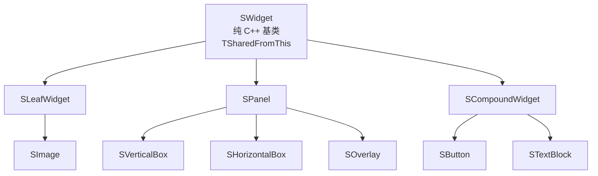

> [← 返回 UE全解析主索引]([[00-UE全解析主索引|UE全解析主索引]])

# UE-Slate-源码解析：Slate UI 运行时

## 模块定位

- **UE 模块路径**：`Engine/Source/Runtime/SlateCore/`、`Engine/Source/Runtime/Slate/`
- **Build.cs 文件**：`SlateCore.Build.cs`、`Slate.Build.cs`
- **核心依赖**：
  - **SlateCore**：`Core`、`CoreUObject`、`InputCore`、`Json`、`TraceLog`、`ApplicationCore`（条件）
  - **Slate**：`Core`、`CoreUObject`、`InputCore`、`Json`、`SlateCore`、`ImageWrapper`、`ApplicationCore`（条件）

> **分工定位**：SlateCore 是 UI 基础设施层（Widget 基类、几何、事件、渲染抽象），Slate 是业务框架层（具体控件库、应用运行时、文本布局、Docking）。两者共同构成 UE 的纯 C++ UI 系统，编辑器与 UMG 的运行时均建立在其上。

---

## 接口梳理（第 1 层）

### 公共头文件地图

#### SlateCore（基础设施）

| 头文件 | 核心类/结构 | 职责 |
|--------|------------|------|
| `Public/Widgets/SWidget.h` | `SWidget` | 所有 Slate Widget 的抽象基类，定义 Tick、Paint、事件处理、焦点、布局、失效更新 |
| `Public/Widgets/SLeafWidget.h` | `SLeafWidget` | 无子节点的叶子 Widget 基类（如 SImage、STextBlock） |
| `Public/Widgets/SPanel.h` | `SPanel` | 可包含多个子 Widget 的布局面板基类 |
| `Public/Widgets/SCompoundWidget.h` | `SCompoundWidget` | 单槽复合 Widget 基类，自带 `ChildSlot`，大多数自定义控件继承于此 |
| `Public/Widgets/SWindow.h` | `SWindow` | 顶层窗口 Widget，对应 OS 窗口，同时继承 `FSlateInvalidationRoot` |
| `Public/Widgets/DeclarativeSyntaxSupport.h` | `SNew` / `SAssignNew` / `SLATE_BEGIN_ARGS` | Slate 的声明式构造语法宏 |
| `Public/Application/SlateApplicationBase.h` | `FSlateApplicationBase` | Slate 应用基类，提供窗口管理、焦点查询、命中测试接口 |
| `Public/Rendering/SlateRenderer.h` | `FSlateRenderer` | 抽象渲染器接口，管理 DrawBuffer、字体服务、视口 |
| `Public/Input/Events.h` | `FInputEvent`、`FPointerEvent`、`FKeyEvent` 等 | 输入事件结构体（带 USTRUCT 反射） |
| `Public/Styling/SlateWidgetStyle.h` | `FSlateWidgetStyle` | 样式基类，支持 USTRUCT 反射与序列化 |
| `Public/FastUpdate/WidgetProxy.h` | `FWidgetProxy` | Fast Path 失效系统中的轻量 Widget 代理 |
| `Public/FastUpdate/SlateInvalidationRoot.h` | `FSlateInvalidationRoot` | 快速路径更新的根节点 |

#### Slate（业务框架）

| 头文件 | 核心类/结构 | 职责 |
|--------|------------|------|
| `Public/Framework/Application/SlateApplication.h` | `FSlateApplication` | 具体应用类，负责 Tick、输入路由、菜单栈、模态窗口、DragDrop |
| `Public/Framework/SlateDelegates.h` | `FOnClicked`、`FOnTextChanged` 等 | 通用委托集合，用于控件事件绑定 |
| `Public/Framework/Commands/` | `FUICommandList`、`FInputChord` | 编辑器命令与输入绑定系统 |
| `Public/Framework/Docking/` | `FTabManager`、`SDockTab` | 编辑器 Tab/Docking 系统 |
| `Public/Framework/MultiBox/` | `FMultiBox`、`FToolBarBuilder` | 菜单/工具栏构建器 |
| `Public/Widgets/Input/` | `SButton`、`SCheckBox`、`SEditableText` | 输入控件库 |
| `Public/Widgets/Layout/` | `SBorder`、`SBox`、`SScrollBox`、`SSplitter` | 布局控件库 |
| `Public/Widgets/Views/` | `SListView`、`STreeView`、`STableRow` | 数据视图控件库 |

---

### 核心类体系

Slate 的 Widget 树是 **纯 C++ 对象树**，不走 UObject/GC 体系，基于 `TSharedRef`/`TSharedPtr` 管理生命周期：



> **关键洞察**：SWidget 不是 `UCLASS`，因此 Slate Widget 实例不参与 UObject 反射与 GC。样式数据（`FSlateBrush`、`FSlateColor`）和事件结构（`FPointerEvent`）才使用 `USTRUCT` + `UPROPERTY`。

---

### 声明式语法（宏驱动构造）

> 文件：`Engine/Source/Runtime/SlateCore/Public/Widgets/DeclarativeSyntaxSupport.h`，第 37~70 行

```cpp
// SNew 宏：创建 TSharedRef<WidgetType>
#define SNew( WidgetType, ... ) \
	MakeTDecl<WidgetType>( #WidgetType, __FILE__, __LINE__, RequiredArgs::MakeRequiredArgs(__VA_ARGS__) ) <<= TYPENAME_OUTSIDE_TEMPLATE WidgetType::FArguments()

// SLATE_BEGIN_ARGS：定义 FArguments 结构体
#define SLATE_BEGIN_ARGS( InWidgetType ) \
	public: \
	struct FArguments : public TSlateBaseNamedArgs<InWidgetType> \
	{ \
		typedef FArguments WidgetArgsType; \
		typedef InWidgetType WidgetType; \
		FORCENOINLINE FArguments()
```

常用参数宏：
- `SLATE_ATTRIBUTE(Type, Name)` — 声明可绑定属性（支持 BindSP/BindUObject/BindLambda）
- `SLATE_ARGUMENT(Type, Name)` — 声明纯值参数
- `SLATE_EVENT(DelegateType, Name)` — 声明事件委托
- `SLATE_SLOT_ARGUMENT(SlotType, Name)` — 支持子 Slot 的 `operator+` 语法

---

## 数据结构（第 2 层）

### SWidget 生命周期与内存

Slate Widget 的生命周期完全由 `TSharedRef` / `TSharedPtr` 控制，不经过 UObject 的 `NewObject` → `Initialize` 流程。典型构造方式：

```cpp
TSharedRef<SButton> MyButton = SNew(SButton)
    .Text(FText::FromString("Click Me"))
    .OnClicked(FOnClicked::CreateLambda([]() { return FReply::Handled(); }));
```

#### 构造三阶段

> 文件：`Engine/Source/Runtime/SlateCore/Private/Widgets/SWidget.cpp`，第 336~350 行

```cpp
void SWidget::SWidgetConstruct(const FSlateBaseNamedArgs& Args)
{
    SetEnabled(Args._IsEnabled);
    VisibilityAttribute.Assign(*this, Args._Visibility);
    RenderOpacity = Args._RenderOpacity;
    // ... 其他基础属性初始化
}
```

`SNew` 宏在 `DeclarativeSyntaxSupport.h` 中完成固定三阶段：
1. `SWidgetConstruct()` — 初始化通用属性（Visibility、RenderOpacity、Clipping）
2. `Construct(const FArguments& InArgs)` — 子类自定义初始化
3. `bIsDeclarativeSyntaxConstructionCompleted = true` — 标记构造完成

#### Tick 的触发条件

> 文件：`Engine/Source/Runtime/SlateCore/Private/Widgets/SWidget.cpp`，第 1439~1446 行

```cpp
if (HasAnyUpdateFlags(EWidgetUpdateFlags::NeedsTick))
{
    INC_DWORD_STAT(STAT_SlateNumTickedWidgets);
    MutableThis->Tick(DesktopSpaceGeometry, Args.GetCurrentTime(), Args.GetDeltaTime());
}
```

**Tick 嵌套在 Paint 内部执行**，触发条件是 `EWidgetUpdateFlags::NeedsTick` 标志位。默认构造时包含 `NeedsTick`，但许多容器类（如 `SBoxPanel`、`SOverlay`、`SImage`）会主动调用 `SetCanTick(false)` 以提升性能。

#### OnPaint 调用链

> 文件：`Engine/Source/Runtime/SlateCore/Private/Widgets/SWidget.cpp`，第 1579 行

```cpp
NewLayerId = OnPaint(UpdatedArgs, AllottedGeometry, CullingBounds, OutDrawElements, LayerId, ContentWidgetStyle, bParentEnabled);
```

外部统一调用的是 `SWidget::Paint()`（非虚），该方法在调用 `OnPaint()` 前后负责：执行 ActiveTimer 和 Tick、计算裁剪区、注册 HitTest 网格、管理 `PersistentState` 缓存、清理 `NeedsRepaint` 标志。

#### 析构流程

> 文件：`Engine/Source/Runtime/SlateCore/Private/Widgets/SWidget.cpp`，第 274~333 行

```cpp
SWidget::~SWidget()
{
    // 1. 注销所有 ActiveTimer
    if (bHasActiveTimers)
    {
        for (const TSharedRef<FActiveTimerHandle>& ActiveTimerHandle : ActiveTimersMetaData->ActiveTimers)
        {
            SlateApplication.UnRegisterActiveTimer(ActiveTimerHandle);
        }
    }
    // 2. Accessibility 清理
    SlateApplication.GetAccessibleMessageHandler()->OnWidgetRemoved(this);
    ClearSparseAnnotationsForWidget(this);

    // 3. 通知 InvalidationRoot 该 Widget 已被销毁
    if (FSlateInvalidationRoot* InvalidationRoot = FastPathProxyHandle.GetInvalidationRootHandle().GetInvalidationRoot())
    {
        InvalidationRoot->OnWidgetDestroyed(this);
    }

    // 4. 清理 CachedElementHandle
    FastPathProxyHandle = FWidgetProxyHandle();
    PersistentState.CachedElementHandle.RemoveFromCache();
}
```

---

### Slate 失效系统（Invalidation System）

#### FSlateInvalidationRoot 与 SWindow

> 文件：`Engine/Source/Runtime/SlateCore/Public/FastUpdate/SlateInvalidationRoot.h`，第 76 行

```cpp
class FSlateInvalidationRoot : public FGCObject, public FNoncopyable
{
    TUniquePtr<FSlateInvalidationWidgetList> FastWidgetPathList;
    TUniquePtr<FSlateInvalidationWidgetPreHeap> WidgetsNeedingPreUpdate;
    TUniquePtr<FSlateInvalidationWidgetPrepassHeap> WidgetsNeedingPrepassUpdate;
    TUniquePtr<FSlateInvalidationWidgetPostHeap> WidgetsNeedingPostUpdate;
    TArray<FSlateInvalidationWidgetHeapElement> FinalUpdateList;
};
```

**每个 `SWindow` 就是一个 `FSlateInvalidationRoot`**。它维护四棵堆/列表：
- `FastWidgetPathList`：窗口内所有 Widget 的轻量代理列表
- `WidgetsNeedingPreUpdate`：子顺序发生变化的 Widget
- `WidgetsNeedingPrepassUpdate`：需要重新 Prepass 的 Widget
- `WidgetsNeedingPostUpdate`：需要 Tick/Paint/Timer 更新的 Widget

#### FWidgetProxy — 轻量代理

> 文件：`Engine/Source/Runtime/SlateCore/Public/FastUpdate/WidgetProxy.h`，第 112~135 行

```cpp
class FWidgetProxy
{
public:
    FWidgetProxy(SWidget& InWidget);
    FUpdateResult Update(const FPaintArgs& PaintArgs, FSlateWindowElementList& OutDrawElements);

    FSlateInvalidationWidgetIndex Index;
    FSlateInvalidationWidgetIndex ParentIndex;
    FSlateInvalidationWidgetIndex LeafMostChildIndex;
    EInvalidateWidgetReason CurrentInvalidateReason;
    FSlateInvalidationWidgetVisibility Visibility;
};
static_assert(sizeof(FWidgetProxy) <= 32, "FWidgetProxy should be 32 bytes");
```

`FWidgetProxy` 是 `SWidget` 在失效系统中的**轻量代理**，大小严格控制为 **32 字节**。Fast Path 更新时，系统遍历 `FWidgetProxy` 数组而非完整的 `SWidget` 对象树，从而极大提升缓存命中率和更新效率。

#### EInvalidateWidgetReason — 精确失效原因

> 文件：`Engine/Source/Runtime/SlateCore/Public/Widgets/InvalidateWidgetReason.h`，第 13~30 行

```cpp
enum class EInvalidateWidgetReason : uint8
{
    None = 0,
    Layout = 1 << 0,           // 影响 DesiredSize，需要重新布局
    Paint = 1 << 1,            // 仅影响绘制，不影响尺寸
    Volatility = 1 << 2,       // 波动性发生变化
    ChildOrder = 1 << 3,       // 子项增删（隐含 Prepass + Layout）
    RenderTransform = 1 << 4,  // 渲染变换矩阵变化
    Visibility = 1 << 5,       // 可见性变化（隐含 Layout）
    AttributeRegistration = 1 << 6, // TSlateAttribute 绑定/解绑
    Prepass = 1 << 7,          // 需要递归重新计算子项 DesiredSize
};
```

不同原因触发不同深度的更新：`Paint` 只触发重绘；`Layout` 会触发 Prepass 并向上传播影响父级尺寸；`ChildOrder` 会导致 `InvalidationRoot` 重建 `FastWidgetPathList`。

#### TSlateAttribute — 自动失效属性

> 文件：`Engine/Source/Runtime/SlateCore/Public/Types/Attributes/SlateAttributeBase.inl`，第 257~270 行（概念位置）

```cpp
bool Set(ContainerType& Widget, const ObjectType& NewValue)
{
    const bool bIsIdentical = IdenticalTo(Widget, Value, NewValue);
    if (!bIsIdentical)
    {
        Value = NewValue;
        ProtectedInvalidateWidget(Widget, InAttributeType, GetInvalidationReason(Widget));
    }
    return !bIsIdentical;
}
```

`TSlateAttribute` 是 Slate 为 Invalidation 系统专门设计的属性容器。其自动失效机制分为两种：
1. **直接赋值（`Set`）**：新旧值比较，若不同则更新并调用 `ProtectedInvalidateWidget`，传入属性模板参数中指定的 `EInvalidateWidgetReason`
2. **绑定 Getter（`Bind`）**：每帧在 `ProcessAttributeUpdate()` 阶段拉取最新值，若发生变化同样返回对应的失效原因

---

## 行为分析（第 3 层）

### FSlateApplication::Tick 的完整流程

> 文件：`Engine/Source/Runtime/Slate/Private/Framework/Application/SlateApplication.cpp`，第 1591~1643 行

```cpp
void FSlateApplication::Tick(ESlateTickType TickType)
{
    float DeltaTime = GetDeltaTime();

    if (EnumHasAnyFlags(TickType, ESlateTickType::PlatformAndInput))
    {
        TickPlatform(DeltaTime);   // 平台消息 + 输入处理
    }

    if (EnumHasAnyFlags(TickType, ESlateTickType::Time))
    {
        TickTime();                // 更新 CurrentTime / DeltaTime
    }

    if (EnumHasAnyFlags(TickType, ESlateTickType::Widgets))
    {
        TickAndDrawWidgets(DeltaTime); // 核心：Prepass + Paint + 渲染提交
    }
}
```

#### TickAndDrawWidgets 与 DrawWindows

> 文件：`Engine/Source/Runtime/Slate/Private/Framework/Application/SlateApplication.cpp`，第 1716~1780 行

```cpp
void FSlateApplication::TickAndDrawWidgets(float DeltaTime)
{
    if (Renderer.IsValid())
    {
        Renderer->ReleaseAccessedResources(false);
    }

    PreTickEvent.Broadcast(DeltaTime);

    // 空闲检测：无输入、无 ActiveTimer 则跳过绘制
    if (!bAnyActiveTimersPending && bIsUserIdle && !bSynthesizedCursorMove)
    {
        // Slate 进入 Sleep 状态
    }
    else
    {
        FSlateNotificationManager::Get().Tick();
        DrawWindows(); // -> DrawPrepass -> PrivateDrawWindows -> Renderer->DrawWindows
    }

    PostTickEvent.Broadcast(DeltaTime);
    ++DrawId;
}
```

执行顺序：
1. **TickPlatform**：泵取 OS 消息、处理延迟输入事件、更新光标/工具提示/手势
2. **DrawPrepass**：对所有可见窗口执行 `SlatePrepass`，自顶向下计算每个 Widget 的 `DesiredSize` 和 `LayoutScale`
3. **PrivateDrawWindows**：遍历所有窗口，为每个窗口创建 `FSlateWindowElementList`，调用 `SWindow::PaintWindow`
4. **PaintWindow** 内部调用 `PaintInvalidationRoot`，决定走 **SlowPath**（重建 FastWidgetPathList 并全量 Paint）还是 **FastPath**（仅更新脏的 `FWidgetProxy`）
5. **Renderer->DrawWindows**：将所有窗口的绘制元素列表提交给渲染器

### Slate 与渲染线程的交互

> 文件：`Engine/Source/Runtime/SlateRHIRenderer/Private/SlateRHIRenderer.cpp`，第 334、1350 行（概念位置）

```cpp
// Game Thread：将绘制命令发送到渲染线程
ENQUEUE_RENDER_COMMAND(SlateDrawWindowsCommand)([this, DrawWindowsCommand = MoveTemp(DrawWindowsCommand)](FRHICommandListImmediate& RHICmdList)
{
    DrawWindows_RenderThread(RHICmdList, DrawWindowsCommand->Windows, DrawWindowsCommand->DeferredUpdates);
});

// Render Thread：使用 FRDGBuilder 构建 Slate 渲染图
void FSlateRHIRenderer::DrawWindows_RenderThread(FRHICommandListImmediate& RHICmdList, ...)
{
    FRDGBuilder GraphBuilder(RHICmdList, RDG_EVENT_NAME("Slate"), ERDGBuilderFlags::ParallelSetup | ERDGBuilderFlags::ParallelExecute);
    // ... 使用 FRDGBuilder 构建 Slate 渲染图
    GraphBuilder.Execute();
}
```

Slate 的 **Game Thread** 负责遍历 Widget 树并生成 `FSlateWindowElementList`。当所有窗口的绘制元素收集完毕后，通过 `ENQUEUE_RENDER_COMMAND(SlateDrawWindowsCommand)` 将整个绘制命令结构投递到 **Render Thread**。渲染线程入口使用 `FRDGBuilder`（Render Dependency Graph）并行地构建和执行 Slate 的绘制 Pass，最终呈现到屏幕。

### FSlateWindowElementList 与 DrawElements

> 文件：`Engine/Source/Runtime/SlateCore/Public/Rendering/DrawElements.h`，第 219~250 行（概念位置）

```cpp
class FSlateWindowElementList : public FNoncopyable
{
public:
    template<EElementType ElementType = EElementType::ET_NonMapped>
    TSlateDrawElement<ElementType>& AddUninitialized()
    {
        const bool bAllowCache = CachedElementDataListStack.Num() > 0 && ...;
        if (bAllowCache)
        {
            return AddCachedElement<ElementType>();
        }
        else
        {
            FSlateDrawElementMap& Elements = UncachedDrawElements;
            FSlateDrawElementArray<FSlateElementType>& Container = Elements.Get<(uint8)ElementType>();
            const int32 InsertIdx = Container.AddDefaulted();
            return Container[InsertIdx];
        }
    }
};
```

`FSlateWindowElementList` 是每个窗口在每一帧生成的一份**绘制元素列表**。它管理两类元素：
- **UncachedDrawElements**：普通绘制元素，按 `EElementType`（Box、Text、Line、Gradient、Viewport 等 14 种类型）分桶存储
- **CachedDrawElements**：针对 Fast Path 下未发生变化的 Widget，其绘制元素会被缓存到 `FSlateCachedElementData` 中，避免重复生成

---

## 与上下层的关系

### 下层依赖

| 下层模块 | 作用 |
|---------|------|
| `Core` / `CoreUObject` | 基础类型、反射（USTRUCT/UENUM）、智能指针、委托 |
| `InputCore` | 按键定义（`FKey`）、输入设备抽象 |
| `ApplicationCore` | 平台窗口抽象（`FGenericWindow`）、消息循环 |
| `ImageWrapper` | 图片解码（Slate brush 用的纹理资源） |
| `FreeType2` / `HarfBuzz` / `ICU` | 字体渲染、文本塑形、国际化 |
| `SlateRHIRenderer` | 为 Slate 提供 RHI 渲染后端，将 DrawElements 转换为 GPU 命令 |

### 上层调用者

| 上层模块 | 使用方式 |
|---------|---------|
| `UMG` | UMG 的 `UWidget` 在底层由 `SWidget` 实现（`TakeWidget()` 返回 `TSharedRef<SWidget>`）。`FWidgetRenderer`（位于 UMG 模块）负责将 Slate Widget 渲染到 RenderTarget，用于 3D WidgetComponent |
| `UnrealEd` | 编辑器全部 UI 基于 Slate 构建（`SEditorViewport`、`FAssetEditorToolkit` 等） |
| `LevelEditor` | 关卡编辑器主窗口 `SLevelEditor` 是纯 Slate 应用 |
| `StandaloneRenderer` | 为 Slate 提供 RHI 渲染后端 |

---

## 设计亮点与可迁移经验

1. **纯 C++ Widget 树 + 反射数据边界**：Slate 将"运行时对象树"（SWidget，纯 C++）与"可序列化数据"（USTRUCT 样式/事件）严格分离，避免了 UObject/GC 对高频 UI 对象的性能开销，同时保留了数据配置的灵活性。这对自研引擎的 UI 系统设计极具参考价值：底层 UI 节点可以不走反射，但样式/配置数据走反射+序列化。
2. **声明式构造语法**：通过 `SNew` + `SLATE_BEGIN_ARGS` 宏实现了类似 QML/XAML 的链式构造语法，兼顾了 C++ 的类型安全和 DSL 的表达能力。核心 trick 是利用 `TSlateDecl` + `operator <<=` 完成构造，非常值得学习。
3. **失效系统（Invalidation）是性能核心**：`FWidgetProxy`（32 字节）+ `FSlateInvalidationRoot` 的设计将每帧全量 Widget 树遍历转换为局部脏更新，这是 Slate 能够支撑复杂编辑器 UI 的关键。自研引擎若需支持大规模动态 UI，必须引入类似的"轻量代理 + 脏矩形/脏节点"机制。
4. **Tick 嵌套在 Paint 中**：Slate 没有独立的 Widget Tick 遍历，而是在 `Paint` 路径中按需调用 `Tick`，天然避免了"不可见控件仍在 Tick"的浪费。这比传统的"全局 Tick 列表"模型更节能。
5. **Game Thread 与 Render Thread 的严格分离**：Slate 在 Game Thread 生成 `FSlateWindowElementList`，通过 `ENQUEUE_RENDER_COMMAND` 投递到 Render Thread，由 `FRDGBuilder` 并行执行。这种"命令缓冲区 + 异步提交"模式是现代引擎 UI 渲染的标准范式。
6. **平台抽象与渲染解耦**：`FSlateRenderer` 将 UI 绘制命令与具体图形 API 解耦，使得 Slate 可以同时支持 RHI 后端、独立渲染器（如 SwRenderer）以及离屏渲染（`FWidgetRenderer` → RenderTarget）。
7. **输入路由的 WidgetPath 模型**：通过几何命中测试生成 `FWidgetPath`，再按路径进行事件冒泡，天然支持嵌套控件、Popup 层和模态窗口的输入拦截。

---

## 关键源码片段

### SWidget 基类声明

> 文件：`Engine/Source/Runtime/SlateCore/Public/Widgets/SWidget.h`

```cpp
class SLATECORE_API SWidget : public FSlateControlledConstruction, public TSharedFromThis<SWidget>
{
    virtual void Tick(const FGeometry& AllottedGeometry, const double InCurrentTime, const float InDeltaTime);
    virtual int32 OnPaint(const FPaintArgs& Args, const FGeometry& AllottedGeometry, ...) const = 0;
    virtual FReply OnMouseButtonDown(const FGeometry& MyGeometry, const FPointerEvent& MouseEvent) { return FReply::Unhandled(); }
};
```

### FSlateApplication::Tick 流程

> 文件：`Engine/Source/Runtime/Slate/Private/Framework/Application/SlateApplication.cpp`，第 1591~1643 行

```cpp
void FSlateApplication::Tick(ESlateTickType TickType)
{
    float DeltaTime = GetDeltaTime();
    if (EnumHasAnyFlags(TickType, ESlateTickType::PlatformAndInput)) { TickPlatform(DeltaTime); }
    if (EnumHasAnyFlags(TickType, ESlateTickType::Time)) { TickTime(); }
    if (EnumHasAnyFlags(TickType, ESlateTickType::Widgets)) { TickAndDrawWidgets(DeltaTime); }
}
```

### Slate 渲染线程提交

> 文件：`Engine/Source/Runtime/SlateRHIRenderer/Private/SlateRHIRenderer.cpp`

```cpp
ENQUEUE_RENDER_COMMAND(SlateDrawWindowsCommand)([this, DrawWindowsCommand = MoveTemp(DrawWindowsCommand)](FRHICommandListImmediate& RHICmdList)
{
    DrawWindows_RenderThread(RHICmdList, DrawWindowsCommand->Windows, DrawWindowsCommand->DeferredUpdates);
});
```

---

## 关联阅读

- [[UE-UnrealEd-源码解析：编辑器框架总览]] — 编辑器通用 Slate 框架
- [[UE-LevelEditor-源码解析：关卡编辑器]] — Slate 在关卡编辑器中的具体组装方式
- [[UE-UMG-源码解析：UMG 蓝图与控件]] — UMG 如何在 Slate 之上封装 UObject 层
- [[UE-专题：Slate 编辑器框架全链路]] — 从 ApplicationCore 到 LevelEditor 的完整链路

---

## 索引状态

- **所属 UE 阶段**：第四阶段 — 客户端运行时层
- **对应 UE 笔记**：UE-Slate-源码解析：Slate UI 运行时
- **本轮完成度**：✅ 第三轮（骨架扫描 + 血肉填充 + 关联辐射 已完成）
- **更新日期**：2026-04-17
