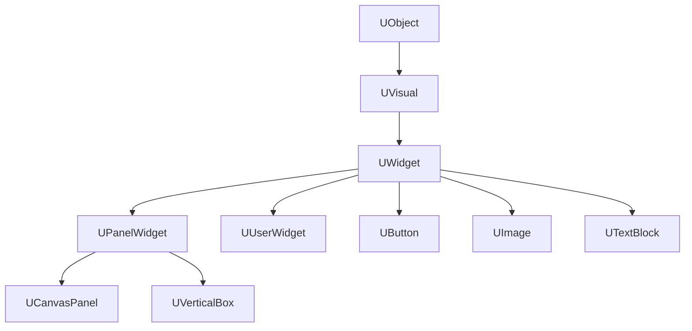
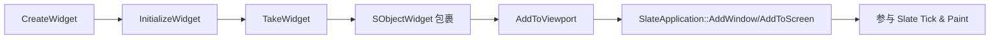

> [[00-UE全解析主索引|← 返回 UE全解析主索引]]

# UE-UMG-源码解析：UMG 蓝图与控件

## 模块定位

- **UE 模块路径**：`Engine/Source/Runtime/UMG/`
- **Build.cs 文件**：`UMG.Build.cs`
- **核心依赖**：`Core`、`CoreUObject`、`Engine`、`Slate`、`SlateCore`、`RenderCore`、`Renderer`、`RHI`、`InputCore`、`ApplicationCore`、`SlateRHIRenderer`（非 Server）
- **Public 依赖**：`FieldNotification`、`HTTP`、`MovieScene`、`MovieSceneTracks`、`PropertyPath`、`TimeManagement`

> **分工定位**：UMG（Unreal Motion Graphics）是 UE 的**可视化 UI 系统**。它在纯 C++ 的 Slate 框架之上封装了一层 UObject/Blueprint 抽象，让设计师可以通过蓝图编辑 UI，同时让 Slate 负责实际的布局、渲染和事件处理。

---

## 接口梳理（第 1 层）

### 公共头文件地图

| 头文件 | 核心类/结构 | 职责 |
|--------|------------|------|
| `Public/Components/Visual.h` | `UVisual` | UMG 元素最基类（Widget + Slot） |
| `Public/Components/Widget.h` | `UWidget` | 可见控件的 UObject 包装层，桥接 Slate |
| `Public/Components/PanelWidget.h` | `UPanelWidget` | 容器/面板基类，管理 Slots |
| `Public/Blueprint/UserWidget.h` | `UUserWidget` | 用户可扩展的蓝图控件根 |
| `Public/Blueprint/WidgetTree.h` | `UWidgetTree` | `UUserWidget` 的内部 UObject 层级 |
| `Public/Blueprint/WidgetBlueprintGeneratedClass.h` | `UWidgetBlueprintGeneratedClass` | 保存 WidgetTree 原型、动画、属性绑定 |
| `Public/Components/WidgetComponent.h` | `UWidgetComponent` | 3D/屏幕空间渲染组件 |
| `Public/Slate/SObjectWidget.h` | `SObjectWidget` | Slate 侧包装器，负责 GC 锚定与事件转发 |
| `Public/Slate/WidgetRenderer.h` | `FWidgetRenderer` | RenderTarget 绘制辅助 |
| `Public/Animation/WidgetAnimation.h` | `UWidgetAnimation` | UMG 动画资产 |
| `Public/FieldNotification/*.h` | FieldNotify 体系 | MVVM 绑定基础 |

### 核心类体系



> **关键洞察**：UMG 的 Widget 树是 **UObject 树**，与 Slate 的纯 C++ `TSharedRef<SWidget>` 树是**平行但独立**的两套层级。UMG 负责资产化、蓝图化、GC 管理；Slate 负责实际渲染和事件路由。

---

## 数据结构（第 2 层）

### UMG ↔ Slate 桥接机制

**核心链路：`TakeWidget` → `RebuildWidget` → `SObjectWidget`**

#### 1. RebuildWidget()

每个 `UWidget` 子类必须重写 `RebuildWidget()`，返回对应的原生 Slate 控件：

- `UButton` → `SButton`
- `UImage` → `SImage`
- `UTextBlock` → `STextBlock`
- `UUserWidget` → 递归构建 `WidgetTree->RootWidget` 的子树

#### 2. TakeWidget() / TakeWidget_Private()

> 文件：`Engine/Source/Runtime/UMG/Private/Components/Widget.cpp`

```cpp
TSharedRef<SWidget> UWidget::TakeWidget()
{
    // 首次调用或底层 Slate 已失效时重建
    TSharedPtr<SWidget> CachedWidget = GetCachedWidget();
    if (!CachedWidget.IsValid())
    {
        CachedWidget = RebuildWidget();
        // 若为 UUserWidget，额外用 SObjectWidget 包裹
        if (UUserWidget* UserWidget = Cast<UUserWidget>(this))
        {
            CachedWidget = SNew(SObjectWidget, UserWidget)
                [CachedWidget.ToSharedRef()];
        }
        SetCachedWidget(CachedWidget.ToSharedRef());
    }
    return CachedWidget.ToSharedRef();
}
```

#### 3. SObjectWidget — GC 锚定与事件转发

> 文件：`Engine/Source/Runtime/UMG/Public/Slate/SObjectWidget.h`，第 24~110 行

```cpp
class SObjectWidget : public SCompoundWidget, public FGCObject
{
    UMG_API virtual void AddReferencedObjects(FReferenceCollector& Collector) override;
    UMG_API virtual void Tick(const FGeometry& AllottedGeometry, const double InCurrentTime, const float InDeltaTime) override;
    UMG_API virtual int32 OnPaint(...) const override;
    UMG_API virtual FReply OnMouseButtonDown(...) override;
    // ... 大量 Slate 事件转发

protected:
    TObjectPtr<UUserWidget> WidgetObject;
};
```

`SObjectWidget` 是 **UMG ↔ Slate 的关键桥接**：
- 实现 `FGCObject::AddReferencedObjects`，持有对 `UUserWidget*` 的强引用
- 只要 Slate 树中仍存在该 `SObjectWidget`，对应的 `UUserWidget` 就不会被 GC 回收
- 转发 Slate 生命周期：Tick → `UUserWidget::Tick`、Paint → `OnPaint`、各种输入事件 → Blueprint 事件

### UUserWidget 生命周期

| 阶段 | 行为 |
|------|------|
| **创建** | `CreateWidget<T>()` 新建 `UUserWidget` UObject |
| **初始化** | `UWidgetBlueprintGeneratedClass::InitializeWidget()` 执行 `BindWidget`、属性绑定、动画绑定 |
| **Slate 构建** | 第一次 `TakeWidget()` → `RebuildWidget()` 创建 Slate 侧；`UUserWidget` 被 `SObjectWidget`（FGCObject）引用，进入 GC 安全期 |
| **构造事件** | `OnWidgetRebuilt()` 触发 `NativePreConstruct()` / `NativeConstruct()`（对应 BP 事件 `PreConstruct`、`Construct`） |
| **存活** | Slate 层级持有 `SObjectWidget` 的 SharedPtr → `FGCObject` 持有 `UUserWidget` → UObject 不会被 GC |
| **销毁** | 从 Slate 层级移除后 `SObjectWidget` 析构，释放 GC 引用；`ReleaseSlateResources()` 清理 Slate 缓存；当 UObject 再无其他引用时由 GC 回收 |

### UWidgetComponent — 3D 世界中的 UMG

`UWidgetComponent` 继承自 `UMeshComponent`，将 UMG 渲染到：
- **World Space**：3D 世界中的一块平面上（如游戏中的全息屏幕）
- **Screen Space**：固定在屏幕空间（如 HUD）

内部通过 `FWidgetRenderer` 将 Slate Widget 绘制到 `UTextureRenderTarget2D`，再将 RenderTarget 作为材质贴图应用到 Mesh 上。

---

## 行为分析（第 3 层）

### UUserWidget::AddToViewport 的完整流程



1. `CreateWidget<T>(World, Class)` → `NewObject<UUserWidget>`
2. `Widget->Initialize()` → 执行 `BindWidget`、属性绑定、动画列表初始化
3. `Widget->AddToViewport()` → 调用 `TakeWidget()` 获取 `TSharedRef<SWidget>`
4. 若为 `UUserWidget`，外层包裹 `SObjectWidget`
5. `SlateApplication` 将该 Widget 加入窗口/视口层级，开始参与每帧的 `TickAndDrawWidgets`

### UMG 动画系统

> 文件：`Engine/Source/Runtime/UMG/Public/Animation/WidgetAnimation.h`

`UWidgetAnimation` 是基于 `UMovieScene` 的动画资产，关键特性：
- 在 Widget Blueprint 中编辑，与 Sequencer 共享底层轨道系统
- 运行时通过 `UUMGSequencePlayer` 播放
- 支持 `PlayAnimation`、`StopAnimation`、`PauseAnimation`、`SetPlaybackSpeed`
- 动画事件通过 `FWidgetAnimationDynamicEvent` 绑定

### Field Notification（MVVM 绑定基础）

> 文件：`Engine/Source/Runtime/UMG/Public/FieldNotification/FieldNotificationDeclaration.h`

UE 5.1+ 引入的 `INotifyFieldValueChanged` 接口，允许 UMG 属性变更时主动通知 Slate/蓝图绑定方，减少每帧 polling：

```cpp
UCLASS()
class UMyViewModel : public UObject, public INotifyFieldValueChanged
{
    UE_FIELD_NOTIFICATION_DECLARE_CLASS_DESCRIPTOR_INTERNAL(UMyViewModel)
    // ...
};
```

这是 UMG 向 MVVM 架构演进的关键基础设施。

---

## 与上下层的关系

### 下层依赖

| 下层模块 | 作用 |
|---------|------|
| `Slate` / `SlateCore` | UMG 的底层渲染与事件系统 |
| `RenderCore` / `Renderer` / `RHI` / `SlateRHIRenderer` | RenderTarget 渲染、3D Widget 的材质贴图 |
| `MovieScene` / `MovieSceneTracks` | UMG 动画的 Sequencer 底层 |
| `InputCore` | 输入键定义 |

### 上层调用者

| 上层模块 | 使用方式 |
|---------|---------|
| `Gameplay 项目代码` | 通过 `CreateWidget` + `AddToViewport` 创建和显示 UI |
| `Editor` | UMG Editor 在编辑器中预览和调试 Widget Blueprint |

---

## 设计亮点与可迁移经验

1. **UObject 层 + Slate 层的双层架构**：UMG 将"可资产化、可蓝图化的 UObject 树"与"高性能的纯 C++ Slate 树"严格分离。UObject 负责配置和逻辑，Slate 负责渲染和事件。这种分离是自研引擎 UI 系统设计的经典范式。
2. **SObjectWidget 的 GC 桥接模式**：通过 `SCompoundWidget + FGCObject` 的组合，让非 GC 的 Slate 对象能够安全地持有 UObject 引用。只要 Slate 树存活，UObject 就不会被 GC。这是 UObject/GC 系统与非 GC 子系统交互的通用解决方案。
3. **TakeWidget / RebuildWidget 的延迟构造**：UMG Widget 在创建时并不立即生成 Slate 侧，而是等到第一次 `TakeWidget()` 调用时才延迟构建。这避免了不必要的 Slate 对象创建，也支持在 Widget 初始化完成后再生成底层控件。
4. **WidgetComponent 的 RenderTarget 渲染**：UMG 不仅能做 2D HUD，还能通过 `FWidgetRenderer` 渲染到 RenderTarget 再贴到 3D Mesh 上。这种"UI 先渲染到纹理，再作为普通材质使用"的模式，是游戏内嵌屏幕、全息投影等效果的通用实现方式。
5. **Field Notification 替代轮询**：传统的 UMG 属性绑定依赖每帧 polling（如 `GetHealth()`），Field Notify 让数据层可以主动推送变更。这对复杂 HUD 的性能优化至关重要，也是现代 UI 框架（如 WPF/Compose）的标配能力。

---

## 关键源码片段

### SObjectWidget 声明

> 文件：`Engine/Source/Runtime/UMG/Public/Slate/SObjectWidget.h`，第 24~110 行

```cpp
class SObjectWidget : public SCompoundWidget, public FGCObject
{
    SLATE_DECLARE_WIDGET_API(SObjectWidget, SCompoundWidget, UMG_API)
    UMG_API void Construct(const FArguments& InArgs, UUserWidget* InWidgetObject);
    UMG_API virtual void AddReferencedObjects(FReferenceCollector& Collector) override;
    UMG_API virtual void Tick(const FGeometry& AllottedGeometry, const double InCurrentTime, const float InDeltaTime) override;
    UMG_API virtual int32 OnPaint(...) const override;
protected:
    TObjectPtr<UUserWidget> WidgetObject;
};
```

### UWidget::TakeWidget 核心逻辑

> 文件：`Engine/Source/Runtime/UMG/Private/Components/Widget.cpp`

```cpp
TSharedRef<SWidget> UWidget::TakeWidget()
{
    TSharedPtr<SWidget> CachedWidget = GetCachedWidget();
    if (!CachedWidget.IsValid())
    {
        CachedWidget = RebuildWidget();
        if (UUserWidget* UserWidget = Cast<UUserWidget>(this))
        {
            CachedWidget = SNew(SObjectWidget, UserWidget)
                [CachedWidget.ToSharedRef()];
        }
        SetCachedWidget(CachedWidget.ToSharedRef());
    }
    return CachedWidget.ToSharedRef();
}
```

---

## 关联阅读

- [[UE-Slate-源码解析：Slate UI 运行时]] — UMG 的底层纯 C++ UI 框架
- [[UE-Engine-源码解析：相机与视锥剔除]] — WidgetComponent 3D 渲染与相机系统的关系
- [[UE-MovieScene-源码解析：Sequencer 与过场动画]] — UMG 动画的 Sequencer 底层

---

## 索引状态

- **所属 UE 阶段**：第四阶段 — 客户端运行时层 / 4.4 玩法运行时与同步
- **对应 UE 笔记**：UE-UMG-源码解析：UMG 蓝图与控件
- **本轮完成度**：✅ 第三轮（骨架扫描 + 血肉填充 + 关联辐射 已完成）
- **更新日期**：2026-04-17
