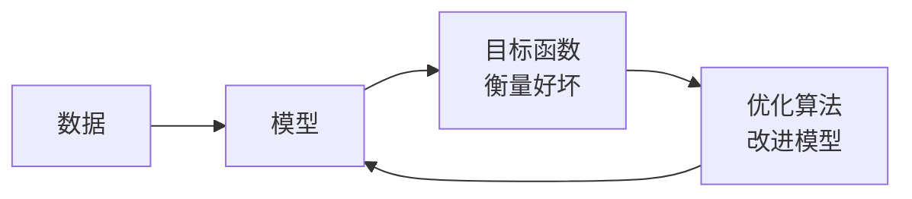

> [[索引|← 返回 人工智能索引]]

# 引言：从编程到学习

## 核心思想：为什么需要机器学习？

传统编程的局限：很多任务无法用规则明确描述。

> 识别图片中的猫：你能描述"猫的规则"吗？耳朵形状？毛色？这些规则既复杂又不准确。

机器学习的思路：**不是告诉计算机怎么做，而是给它大量例子，让它自己从数据中总结规律。**

```
传统编程：规则 + 数据 → 输出
机器学习：数据 + 输出 → 规则（模型）
```

### 生动案例：唤醒词识别

麦克风每秒采集约 44000 个样本，每个样本是声波振幅的测量值——没有任何规则能把这些数字直接映射到"Hey Siri"这个词。

解决方案：收集大量带标签的音频，训练一个灵活的参数化模型，让数据自己"教"出识别规则。

**训练过程（4 步循环）：**

1. 随机初始化参数，模型基本没有"智能"
2. 获取一批数据样本（音频片段 + 是/否标签）
3. 调整参数，使模型在这些样本上表现更好
4. 重复 2、3，直到满意为止

> [!tip] 用数据编程
> 我们没有写唤醒词识别器，而是写了一个"会学习的程序"。这种方式叫做**用数据编程**（programming with data）。

---

## 机器学习的四个关键组件



### 1. 数据（Data）

- 机器学习的"燃料"，没有数据什么都做不了
- 数据集由**样本**（sample）组成，每个样本由**特征**（feature）描述，并有一个**标签**（label）
- **数据质量同样关键**："Garbage in, garbage out"——数据有偏，模型就有偏
  - 例：用历史招聘数据训练简历筛选模型，可能无意中固化了过去的偏见

> [!warning] 数据偏见的真实风险
> 若训练皮肤癌识别模型时数据集从未包含深色皮肤，模型就会对这类人群束手无策。数据的代表性是关键。

### 2. 模型（Model）

- 一个将输入（特征）映射到输出（预测）的数学函数
- 模型有**参数**，学习的过程就是调整参数的过程
- **模型族**：通过操作参数生成的所有不同程序的集合

### 3. 目标函数（Objective Function）

- 衡量模型预测有多好（或多差）的**度量标准**
- 也叫**损失函数**（loss function）
- 学习 = 最小化目标函数

> [!question]- 为什么平方误差（MSE）是最常见的损失函数？
> **平方误差**（Mean Squared Error）是最常见的回归损失函数，原因如下：
>
> **1. 数学上的良好性质**
> - **处处可微**：导数简单 $\frac{d}{dy}(y - \hat{y})^2 = 2(y - \hat{y})$，便于梯度下降优化
> - **凸函数**：对于线性模型保证存在全局最优解
>
> **2. 统计理论基础——最大似然估计**
>
> 当假设噪声服从**高斯分布**时，最小化 MSE 等价于最大似然估计（MLE）：
> $$y = f(x; \theta) + \epsilon, \quad \epsilon \sim \mathcal{N}(0, \sigma^2)$$
>
> 最大化似然 $\Leftrightarrow$ 最小化平方误差。这是 MSE 最本质的统计合理性。
>
> **3. 对大误差的惩罚**
>
> 平方会**放大**大误差的影响，使模型优先修正严重偏离的预测：
>
> | 误差 | 绝对误差 | 平方误差 |
> |------|----------|----------|
> | 1 | 1 | 1 |
> | 5 | 5 | **25** |
> | 10 | 10 | **100** |
>
> **4. 几何意义**
>
> MSE 对应欧几里得距离（L2 范数），在几何空间中有清晰的解释——寻找最接近目标向量的投影。
>
> **什么时候不用 MSE？**
> - **异常值多** → 用 MAE（绝对误差），MSE 对异常值过于敏感
> - **分类问题** → 用交叉熵（Cross-Entropy），衡量概率分布差异
> - **需要鲁棒性** → 用 Huber Loss（结合 MSE 和 MAE 的优点）

> [!question]- 疑惑：目标函数是什么意思？
> **原始疑惑**：在机器学习中，我们需要定义模型的优劣程度的度量，这个度量在大多数情况是"可优化"的，这被称之为*目标函数*（objective function）。这句话到底啥意思？我理解的函数是有能把某个输入转化为输出的功能性单位，为什么这能被称为目标函数？
>
> ---
>
> **解答**：你的理解完全正确——函数确实是"把输入变成输出"的东西。目标函数也是这样，只不过：
>
> - **输入**：模型的参数 $\theta$（比如神经网络的所有权重）
> - **输出**：一个数值，表示"模型现在有多差"
>
> $$L(\theta) = \text{某种衡量预测误差的计算}$$
>
> 例如：模型预测猫的概率是 0.3，实际是猫（标签=1），损失 $= |1 - 0.3| = 0.7$，越大说明越差。
>
> 为什么说"可优化"？因为它是关于参数 $\theta$ 的数学函数，有严格的数学方法（梯度下降）来找到让它最小的参数值——不是凭感觉调参，而是有保证的。
>
> **一句话总结**：目标函数 = 把"模型参数"变成"误差分数"的函数，学习 = 找让这个分数最低的参数。

**训练集 vs 测试集：**

- **训练集**：用来拟合模型参数
- **测试集**：用来评估模型泛化能力
- **过拟合**（overfitting）：在训练集上表现很好，但不能推广到测试集——就像模拟考试 100 分，真正考试却不及格

### 4. 优化算法（Optimization Algorithm）

- 最常用：**梯度下降**（Gradient Descent）
- 沿着目标函数下降最快的方向调整参数，就像下山时沿最陡的坡走

---

## 关键概念解析

### 特征（Feature）与协变量（Covariate）

> [!question]- 疑惑：为什么样本由"特征"或"协变量"组成？
> **原始疑惑**：为什么样本会有叫特征或协变量的属性组成？为何如此定义？
>
> ---
>
> **解答**：这是两个来自不同领域的同义词，描述同一件事：
>
> - **特征**（feature）：机器学习的叫法
> - **协变量**（covariate）：统计学的叫法——这些变量与目标变量**协同变化**（co-vary），比如收入高的人往往学历也高
>
> **为什么要有这个概念？** 现实中的任何对象（图片、邮件、病人）都可以用一组数值来描述，这组数值就是特征。只有把世界"数字化"，模型才能处理。
>
> 通常把一个样本的所有特征排成一个向量：$\mathbf{x} = [x_1, x_2, \ldots, x_d]$

### 标签（Label）

- 我们想要预测的目标值
- 分类任务：离散的类别（猫/狗，垃圾邮件/正常邮件）
- 回归任务：连续的数值（房价、温度）

> [!question]- 疑惑：为什么预测的是"特殊属性"？
> **原始疑惑**：为什么要预测的是一个特殊的属性，难道不是符合要求和不符合要求输出不同的值吗？怎么又变成特殊的属性了？
>
> ---
>
> **解答**：你说的"符合要求=1、不符合=0"完全正确，这就是标签！两种说法描述的是同一件事。
>
> 书里说"预测一个特殊的属性"，是因为：一个样本有很多属性（年龄、身高、学历……），其中**有一个是我们想预测的目标**，这个就叫"特殊属性"，即标签。
>
> 举例——判断垃圾邮件：
> - 普通属性（特征）：发件人、主题词、正文词频……→ 作为输入
> - 特殊属性（标签）：是否为垃圾邮件（0 或 1）→ 作为预测目标
>
> 书用"属性"这个更通用的词，是因为标签不总是 0/1，有时是连续数值（比如预测明天气温 23.5°C），所以统一叫"属性"。

### 独立同分布（i.i.d.）

> [!question]- 疑惑：什么是独立同分布？
> **原始疑惑**：什么叫独立同分布？为什么大多数样本遵循独立同分布？
>
> ---
>
> **解答**：**独立同分布**（i.i.d.）= **独立**（Independent）+ **同分布**（Identically Distributed）
>
> #### 同分布：大家来自同一个"池子"
>
> 想象一个装满球的箱子，每种颜色的球有固定比例（这就是一个"分布"）。
> 你每次从里面随机抓一个球，这个过程就是"从同一分布采样"。
>
> 数据集里的每条样本，都应该是从**同一个真实世界规律**（分布）中随机抽出的。
> - 训练集和测试集的猫咪照片，都来自"现实世界的猫咪照片"这个分布 ✓
> - 用晴天的照片训练，在雨天测试 → 分布不同，模型会失效 ✗
>
> #### 独立：每次抽样互不影响
>
> 抓出第1个球之后，**放回**再抓第2个，两次抽样互不影响，这就是"独立"。
>
> 如果样本之间有关联（比如时间序列数据，今天的股价依赖昨天），就不独立了。
>
> #### 为什么大多数情况下假设 i.i.d.？
>
> 1. **数学方便**：i.i.d. 假设让很多理论推导成为可能，是机器学习理论的基础
> 2. **现实近似**：随机采集的数据通常近似满足 i.i.d.（比如随机抽取的用户评论）
> 3. **简化假设**：即使不完全满足，i.i.d. 也是一个合理的起点
>
> **不满足 i.i.d. 的情况**：时间序列（股价）、自然语言（句子里词之间有依赖）、医院不同科室的数据（分布不同）——这些需要特殊处理。

---

## 机器学习问题的类型

### 监督学习（Supervised Learning）

有标签数据，学习从特征到标签的映射。

| 问题类型 | 标签类型 | 例子 |
|---------|---------|------|
| **回归**（Regression） | 连续数值 | 预测房价、气温 |
| **分类**（Classification） | 离散类别 | 猫/狗、垃圾邮件识别 |
| **标注**（Tagging） | 多个标签 | 图片/文章打多个标签 |
| **搜索** | 排序 | 搜索引擎结果排序 |
| **推荐系统** | 相关性分数 | 商品/电影推荐 |
| **序列学习** | 序列 | 机器翻译、语音识别 |

#### 回归（Regression）

标签是**连续数值**，目标是让预测值尽量接近真实值。

> [!example] 生活中早就用过回归
> 你让管道工修下水道，3 小时收 350 美元；朋友雇同一个管道工 2 小时收 250 美元。你心算：上门费 50 美元，每小时 100 美元——你已经不知不觉完成了线性回归！

判断是否是回归问题的经验法则：凡是问"**有多少**"的问题，大概率是回归。

#### 分类（Classification）

标签是**离散类别**，模型输出的是每个类别的**概率**，而不是硬判断。

> [!example] 毒蘑菇的决策
> 分类器输出"这个蘑菇是死帽蕈的概率为 0.2"。
> - 吃它的损失 = $0.2 \times \infty + 0.8 \times 0 = \infty$
> - 扔掉的损失 = $0.2 \times 0 + 0.8 \times 1 = 0.8$
>
> 最常见的类别不一定是最终决策的类别——**风险和收益**同样重要！

- **二项分类**（binomial）：两个类别（猫/狗、是/否）
- **多项分类**（multiclass）：多个类别（手写数字 0-9）
- **层次分类**（hierarchical）：类别之间有从属关系，不同错误代价不同（把狮子狗误认为雪纳瑞 vs. 误认为恐龙）

#### 多标签分类（Multi-label Classification）

类别之间**不互斥**，一个样本可以同时属于多个类别。

> 技术博客的标签："机器学习"、"Python"、"云计算"——一篇文章可能同时命中 5-10 个标签。

#### 序列学习（Sequence Learning）

输入和/或输出是**可变长度的序列**：

- **标记与解析**：给文本序列标注属性（命名实体识别）
- **语音识别**：音频序列 → 文字（输出比输入短）
- **文字转语音**：文字 → 音频（输出比输入长）
- **机器翻译**：一种语言序列 → 另一种语言序列（顺序也可能改变）

---

### 无监督学习（Unsupervised Learning）

没有标签，自己发现数据结构。

| 方法 | 核心任务 | 例子 |
|------|---------|------|
| **聚类**（Clustering） | 发现天然分组 | 按浏览行为给用户分群 |
| **主成分分析**（PCA） | 用少量参数捕捉数据主要变化 | 用身高/肩宽等少数尺寸描述人体形状 |
| **因果关系/概率图模型** | 发现变量之间的根本原因 | 房价、污染、犯罪、地理位置的关联 |
| **生成对抗网络**（GAN） | 学习数据分布，生成新样本 | 生成逼真人脸、驰骋斑马图像 |

---

### 与环境交互：在线学习 vs 离线学习

大多数监督/无监督学习是**离线学习**（offline learning）：预先收集数据，训练完成后不再与环境交互。

但现实中有时需要**智能体**（agent）主动与环境互动，并影响环境：
- 环境会记住之前的行为吗？
- 环境会随时间变化吗？（**分布偏移** distribution shift）
- 环境是否对抗性的？（垃圾邮件发送者会绕过过滤器）

---

### 强化学习（Reinforcement Learning）

智能体通过与环境交互，靠**奖励/惩罚**信号学习策略。

```
智能体 --动作(action)-→ 环境
       ←-观察(observation)--
       ←-奖励(reward)-------
```

**核心挑战：**

- **学分分配**（credit assignment）：哪些行为导致了最终奖励？（就像复盘升职原因）
- **部分可观测性**：当前观测未必包含完整状态信息
- **探索 vs 利用**（explore vs exploit）：坚守当前最优策略，还是尝试未知的可能更好策略？

**强化学习的特殊情形：**

| 名称 | 场景 |
|------|------|
| 马尔可夫决策过程（MDP） | 环境完全可观测 |
| 上下文赌博机（contextual bandit） | 状态不依赖之前动作 |
| 多臂赌博机（multi-armed bandit） | 无状态，只有未知回报的动作集合 |

> [!example] 著名案例
> - AlphaGo 下围棋（2016 年击败世界冠军）
> - 深度 Q 网络（DQN）仅用视觉输入打败人类玩雅达利游戏

---

## 深度学习的崛起

### 历史背景

深度学习并非突然出现。从伯努利（1654）、高斯（1777）的统计工具，到 Fisher（1890）的线性判别分析，再到图灵（1912）的计算理论、Hebb（1904）的神经学习规则——深度学习站在几个世纪的肩膀上。

神经网络曾在 1995 年前后停滞不前，因为**数据稀缺**且**计算昂贵**。核方法、决策树等算法彼时更有竞争力。

### 为什么大约 2010 年后深度学习爆发？

| 年代 | 数据规模 | 内存 | 算力（浮点/秒） |
|------|---------|------|--------------|
| 1970 | 100（鸢尾花） | 1 KB | 100 KF（Intel 8080） |
| 1990 | 10 K（OCR） | 10 MB | 10 MF（Intel 80486） |
| 2010 | 10 G（广告） | 1 GB | 1 TF（Nvidia C2050） |
| 2020 | 1 T（社交网络） | 100 GB | 1 PF（Nvidia DGX-2） |

三大驱动力：
1. **数据**：互联网产生了海量数据
2. **算力**：GPU 让大规模并行计算普及化
3. **算法**：Dropout、注意力机制、GAN、分布式训练……

### 近十年关键突破

- **Dropout**（2014）：向网络注入噪声，对抗过拟合
- **注意力机制**（2014）：不需要记住整个序列，只存指向关键状态的"指针"
- **GAN**（2014）：用可微算法代替采样器，生成逼真图像
- **分布式训练**：1024 块 GPU 协同，ResNet-50 训练时间从数天降至 7 分钟内

深度学习框架演进：Caffe/Torch/Theano → TensorFlow/Keras/MXNet → PyTorch/JAX

---

## 深度学习的特点

```
浅层模型（传统ML）：特征工程 + 简单模型
深度学习：        原始数据 → 多层自动学习特征 → 输出
```

1. **端到端训练**（End-to-End）：整个系统联合优化，而非分模块手工调参
2. **表示学习**（Representation Learning）：自动学习数据的多层次特征表示
   - 靠近输入的层：低级细节（边缘、纹理）
   - 靠近输出的层：高级抽象概念（"猫脸"、"情绪"）
3. **处理不定长数据**：相比传统 ML，深度学习天然适合文本、音频、视频等变长输入
4. **打破领域壁垒**：同一套工具统一了计算机视觉、NLP、语音、医学信息学

---

## 深度学习的成功案例

- **智能语音助手**：Siri、Alexa、Google Assistant 的语音识别达到人类水平
- **图像识别**：ImageNet Top-5 错误率从 2010 年的 28% 降至 2017 年的 2.25%
- **游戏 AI**：DeepBlue（国际象棋）、AlphaGo（围棋）、Libratus（扑克）
- **自动驾驶**：特斯拉、Waymo 的部分自主驾驶能力
- **科学研究**：机器人、计算生物学、粒子物理、天文学的突破

---

## 总结

```
机器学习的本质：
数据 → 用模型拟合 → 用目标函数衡量好坏 → 用优化算法改进 → 循环
```

深度学习是机器学习的一个强大子集，通过多层神经网络自动学习特征表示，在图像、语言、语音等领域取得了突破性进展。

> [!abstract] 小结（原文）
> - 机器学习：让计算机从数据经验中提高性能，结合了统计学、数据挖掘和优化
> - 表示学习：自动寻找数据的合适表示方式；深度学习是多层次的表示学习
> - 深度学习取代了手工特征工程 + 浅层模型的传统范式
> - 数据爆炸 + GPU 算力 + 开源框架共同推动了近十年的深度学习革命

---

## 练习思考

1. 你正在编写的代码里，哪些部分的**设计选择**可以交给机器学习来做？哪些地方用了启发式规则？
2. 你遇到过哪些问题：有大量样本，却很难写出自动化规则？这些很可能是深度学习的用武之地。
3. 如果把 AI 看作新工业革命，**算法和数据**的关系是什么？类似蒸汽机和煤吗？根本区别是什么？
4. 端到端训练还可以在哪些领域应用？物理？工程？计量经济学？

---

*参考：[动手学深度学习 - 引言](https://zh.d2l.ai/chapter_introduction/index.html)*
