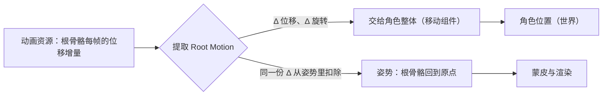

> [[Notes/动画系统/索引|← 返回 动画系统索引]]

# RootMotion：动画驱动移动

> [!todo] 本篇核心问题
> 位移来自动画（Root Motion）还是来自速度？两者怎么取舍，混用为什么会脚滑/瞬移？

> [!tip] 先回答一个更实际的问题：需要懂多深？
> 做角色移动时，你真正需要拎清的是三件事：
> 1. **Root Motion 的物理含义**：它不是"更高级的移动方式"，而是**把动画里根骨骼的位移，从『骨骼的局部变换』升级成『整个角色的位移』**。
> 2. **升上去之后必须把这份位移从姿势里扣掉**——不扣就是双倍位移。这是实现 Root Motion 最容易错的一步。
> 3. **它和速度驱动谁说了算，必须在项目开始前定死**，因为这件事决定手感、决定网络同步方案，而且两种模式混着开的症状（脚滑、窜出去）看起来很像，排查方向却完全不同。
>
> 至于引擎里位移具体由哪个模块、在哪一步交到移动组件手上的（`FRootMotionMovementParams`、那一串应用链路），属于落地细节，收在文末「参考实现」——不知道完全不影响你判断该用哪种方案。

## 为什么需要解决这个问题

角色要跑起来。这件事看起来毫无争议，但动手时立刻撞上一个选型：**位移该由谁算出来？**

**做法一：速度驱动。** 代码给移动组件一个速度（比如 3 m/s）和朝向，角色被推着走；动画只是一段**原地跑的循环**——美术把角色的脚"钉"在原点，只有上半身和腿在动。走多远、走多快，全由代码说了算。

**做法二：动画驱动（Root Motion）。** 动画文件里**真的包含位移**：美术在动画里让角色往前走了 2 米，脚掌落地的瞬间正好落在该落的位置；运行时把这段位移提取出来，让角色按动画里的走法走。位移由动画说了算，代码只负责"要不要播这段动画"。

两条路都能让角色跑起来，但选错会得到两种肉眼可见的坏结果。

**第一种：脚滑。** 速度驱动时，代码的速度和动画的步频是**两套各自独立的数字**。假设代码速度设成 3 m/s，而动画里的跑步循环其实是按 2.5 m/s 的步幅做的——每秒钟角色被推着走 3 米，脚只在原地"划"了 2.5 米的距离。表现就是**脚在地上打滑**：脚向后蹬的时候地面纹丝不动，脚落地的那一帧人已经往前多滑了一截。反过来把速度调慢，就变成"人走得太慢、脚在地上刨得飞快"。**这就是"脚滑"的经典表现，也是几乎所有 3D 项目第一周就会撞上的问题。**

**第二种：瞬移。** 如果两种模式不小心同时开着——代码给了速度，动画自己也带位移——位移就被算了两遍。表现是角色移动速度明显超预期，或者每次切到一段带位移的动画时"蹭"地一下窜出去。

更要命的是：**这两种症状看起来很像（都是"人走得不自然"），排查方向却完全不同**——脚滑要去比"代码速度 vs 动画步频"，窜出去要去查"是不是两个位移源叠加了"。所以这一篇要做的不只是介绍 Root Motion，而是**把两个位移源的关系讲清楚，让你能一眼分辨症状属于哪一种**。

## 直观理解：动画师在场景里留了一串脚印

用一个贯穿全篇的比喻。

**美术做一段"向前走"的动画时，其实是在一个空场景里带着角色走了一趟。** 角色每一步踩在哪儿、脚落地的那一刻身体前进了多少、重心怎么前后挪——这些是**一起调出来的**。动画文件忠实地记录了这一趟：包括根骨骼从起点挪到终点的那段位移（这就是 Root Motion），也包括每一根骨头相对于根骨骼的姿势。

**根骨骼**（Root Bone）是骨骼层级的顶端——通常是角色的原点骨骼，或者一根专门名叫 `root`、只有位移没有姿势的骨骼。回看 [[Notes/动画系统/旋转与变换基础/变换层级与复合变换#层级遍历：世界变换是"从上往下"算的|变换层级篇]] 讲过的事实：所有子级的世界变换都是从根骨骼往下算的，**根一动，整棵树全动**。这正是 Root Motion 能驱动角色整体位移的机制基础。

于是问题就变成了：**这串脚印要不要用？**

- **不用**（速度驱动）：把脚印擦掉，动画只保留"腿在动"的部分，角色交给代码推着走。好处是代码完全掌控；代价是"脚步"和"前进距离"这两件本来一起调好的事，被人为拆开了。
- **用**（Root Motion）：把脚印捡起来，交给角色的整体位移；同时，**把这串脚印从姿势里擦掉**——因为脚印已经是"整个角色往前走"了，如果还留在根骨骼的局部变换里，就会在下一次层级连乘时**再走一遍**。



数据流位置：本篇处在动画链路**最下游、也是唯一一处"姿势反过来影响角色"的一站**。前几篇里姿势是纯粹的消费品——从下往上一直流到蒙皮（[[Notes/动画系统/蒙皮与骨骼网格/蒙皮矩阵：从骨骼姿势到顶点变形|蒙皮矩阵]]），只影响角色自己长什么样。Root Motion 打破了这个单向性：**姿势里的一个分量被提出来，反向去驱动角色的世界变换**。它的输入是"这份姿势里根骨骼走了多少"，输出是"角色整体该走多少"，外加一个被扣掉位移的姿势。

## 核心机制

### 一句话直觉：把位移"升级"到角色层级

Root Motion 的全部内容可以压成一句话：

> **把动画里根骨骼的位移，从「骨骼的局部变换」，升级成「整个角色的位移」——并且原来的那份要扣掉。**

注意这里有两个动作，缺一不可：

1. **提取**：算出根骨骼**这一帧相对上一帧**的位移增量（平移 + 旋转），交给角色整体。
2. **扣除**：把同一份增量从姿势里拿走，让根骨骼在姿势里回到起点。

第一步很好理解——毕竟位移就该往前推着角色走。第二步才是真正容易漏的，也是本节的另一半。

### 为什么必须"扣掉"（最容易错的一步）

先看**不扣**会发生什么。根骨骼的局部变换是**会参与层级连乘**的（见 [[Notes/动画系统/旋转与变换基础/变换层级与复合变换#复合：父节点的"外部世界"作用到子节点身上|复合变换]]）：根骨骼的世界变换 = 角色整体变换 × 根骨骼局部变换。于是这份位移被用了两次：

- 第一次：提取到角色整体上，角色往前走了 2 米；
- 第二次：它还在根骨骼的局部变换里，角色往前走了 2 米之后，**网格上的根骨骼又相对角色偏移了 2 米**。

结果是**身体比角色原点跑得更快**：角色以双倍速度前进（视觉上像开了加速），而模型还相对角色原点"漂"到了前面——用调试器看就是**模型的脚已经跑到胶囊体外面去了**，碰撞和渲染对不上。

**为什么扣掉是对的？** 因为"走两米"这件事在物理上只发生一次。提取它是为了让**角色**走这两米；扣除它是为了不让**网格**再走一遍。所以代码长这样（表达结构，不求可运行）：

```cpp
// flags: -O0 -g

// 从根骨骼前后两帧的局部变换里，取出这一帧的"位移增量"
struct RootMotionDelta {
    Vec3 Translation;   // 这一帧往哪走了多远（角色空间）
    Quat Rotation;      // 这一帧转了多大角度（转身动作靠它）
};

RootMotionDelta ExtractRootMotion(const Transform& PrevRootLocal,
                                  const Transform& CurrRootLocal) {
    RootMotionDelta d;
    d.Translation = CurrRootLocal.Translation - PrevRootLocal.Translation;
    d.Rotation    = PrevRootLocal.Rotation.Inverse() * CurrRootLocal.Rotation;
    return d;
}

// 提取之后必须做的第二件事：把这份位移从姿势里扣掉
// 不扣 → 网格再走一遍 → 角色以双倍速度前进、模型相对原点漂移
void StripRootMotion(Transform& RootLocal, const RootMotionDelta& d) {
    RootLocal.Translation -= d.Translation;
    RootLocal.Rotation     = d.Rotation.Inverse() * RootLocal.Rotation;
}
```

读这两段代码抓三点：① 位移增量是**相对上一帧**算的，不是绝对位置——动画循环播到一半时根骨骼在世界里在哪，跟这段动画无关；② 旋转增量用"前帧的逆乘后帧"得到（四元数乘法顺序见 [[Notes/动画系统/旋转与变换基础/四元数的几何意义与运算#边界与坑|四元数的边界与坑]]），先乘逆就是"退回上一帧的朝向再转过去"；③ `StripRootMotion` 是这个机制里最容易整段漏掉的一步——**没有它，提取代码会表现成"移动变快"而不是"报错"，所以特别容易被误判成速度参数调大了。**

> [!warning]- 想深究：为什么扣除在数值上是"近似的"
> 严格说，"提取 → 扣除 → 再沿层级连乘"这条路径和"直接把根骨骼的世界位移搬到角色上"并不完全等价——根骨骼在这里是绕着**自己的原点**被处理的，而它承担的职责其实是**角色的原点**。当根骨骼原点与角色原点不重合、或者根骨骼既带位移又带旋转时，两者的结果会有微小差异。
> **工程上的处理方式是让它们重合**：约定根骨骼落在角色脚下、尽量只带平移不带旋转（转身交给专门的一根骨骼）。这样这条近似就变得无害。不必纠结推导，记住约定即可。

### 为什么需要它：一致性的价值

扣掉之后，Root Motion 换来了什么？答案只有一句话：**位移与姿势的一致性**。

回看那个比喻：脚印和姿势是**一起调的**。动画师做出"脚落地"的那一帧时，角色前进了多少、重心压在哪儿、上身怎么前倾，是**设计好的一个整体**。速度驱动做不到这点，因为**代码不知道美术的脚步节奏**：代码只知道"3 m/s"，它不知道这 2.5 m/s 的动画在第 0.4 秒时脚应该落地。

一致性在"普通跑步"上还只是脚滑这种观感问题，但在下面这几类动作里会直接决定成败：

- **翻滚、闪避**：角色在地上滚了一圈，必须**恰好**滚出一个身位。滚多滚少都会穿模或者滚不到位置。
- **攀爬、翻越**：手抓在悬崖边缘的那一刻，身体必须**正好**贴到那个点。差几厘米就是手插进石头里。
- **必杀技位移、处决动作**：动作是成套编排的，人物走到哪、刀砍到哪，是一整个编排。
- **走位极其讲究的格斗 / 动作游戏**：距离即玩法。谁在什么帧进到攻击距离内，是竞技性的核心，不能交给一个独立的速度参数。

这些场合的共同点是：**动作本身包含"身体必须在某个时刻到达某个位置"的硬约束**，而只有动画自己知道这个时刻是什么。所以结论就清楚了：

> **需要精确脚步匹配 / 精确位移的动作 → Root Motion。**
> **需要代码完全掌控移动的场合（玩家输入响应、物理驱动、网络同步）→ 速度驱动。**

### 混用会出现什么：两种症状怎么分辨

现实项目里很少有人纯用一种。真正需要掌握的是"混用时会发生什么，以及怎么分辨"。

**症状一：脚滑（速度驱动 + 步频不匹配）。**

这是**最常见**的问题，而它的正解本身**就是一种混用**：让动画的播放速率随速度缩放（`PlayRate = 代码速度 / 动画的设计速度`，调法见 [[Notes/动画系统/动画状态机与动画图/动画同步：过渡时机与步伐对齐#步频与速度绑定：脚滑的另一半原因|动画同步篇]]）。

这正是 Root Motion 值得留意的地方：**用速度驱动时，你和"动画本身走多快"之间只隔着一个 PlayRate**；一旦这段动画改用 Root Motion，播放速率就变成了位移的**乘数**（PlayRate 1.2 → 这段位移也变成 1.2 倍）。而绑定速率是速度驱动下最常见的一个优化——**把两种位移源混在同一条角色上时，这个"速度 → PlayRate → 位移"的回路会让角色跑得比设计速度更快，且越接近满速越明显**。这条症状之所以难查，是因为它和"位移被算了两遍"长得一模一样，分辨方法见下一条。

而且 PlayRate 有天花板：**它只能缩放"快慢"，改不了"落点"**。一旦速度变化大到需要不同的步幅（走 vs 跑 vs 冲刺），就不是踩快一点能解决的了——这时要么换更细的混合空间（[[Notes/动画系统/混合空间与Additive/混合空间：布局与插值|混合空间]]），要么在这一类动作上改用 Root Motion。

**症状二：瞬移 / 窜出去（位移被算了两遍）。**

同时开着 Root Motion 和代码速度，第一天就会撞上。表现有两种，很好分辨：

- **整体速度超预期**：角色明显比设计速度跑得快，调整速度参数也压不住（因为另一半位移来自动画）。
- **切换瞬间窜一下**：从"有位移的动画"切到"无位移的动画"（或者反向）时，位置"蹭"地跳一下——因为位移源在切换的那一刻突然接上了或断开了。

这一类问题的排查方向很明确：**先确认位移由谁负责，把另一个关掉**，而不是去调速度参数。

**症状三：网络同步的代价（必须懂，决策相关）。**

这条最容易被忽略，但它往往**直接决定项目的架构选择**。

Root Motion 的位移来自**动画播放到哪儿了**。看一眼[[Notes/动画系统/动画播放与混合/动画播放器：生命周期与时间模型|播放器]]那一条 `t += Δt × PlayRate` 就知道：动画的时间进度是**每帧在游戏逻辑里推**的，位移要等这一帧的姿势算完、根骨骼这一帧走到哪儿确定了，才能交给移动组件。这带来两个后果：

1. **同一帧内，动画要排在移动之前算**。动画的时间推进和姿势求值必须整体早于移动更新——不是"晚一步拿到结果"这么轻，而是**这一天有多少帧、每帧有多大，动画说了算**。手感上的代价是：输入、碰撞、位置修正这些环节都得排在动画后面，起步、转身那一下会"黏"一点。这个延迟不大，但在强调响应速度的动作游戏里能被感知到。
2. **不好做客户端预测**。网络游戏里客户端为了掩盖延迟，会**预测**自己的移动（先按输入算着走，等服务器回包再纠正）。速度驱动的移动很好预测——输入 + 速度就是个确定的算式。但 Root Motion 的位移依赖**动画状态机当前在放哪段动画**，而状态机又依赖服务器同步过来的状态——**预测成了循环依赖**，一旦预测错了，纠正就是一次显式的位置回拉（玩家看到自己"被拽回去"）。

所以工业界的常见做法是：

> **多数网络游戏的角色移动用速度驱动，只在"本地表现型动作"（翻滚、处决、一次性的位移技能）上局部用 Root Motion**；或者反过来——**用 Root Motion 在本地算出位移，再把结果作为数据进行同步**，让服务器只认"结果位移"而不认"动画状态"。

### 应用形式的几个开关（知道即可）

提取出来的位移不必照单全收，实践中常按需裁剪。这些开关都在"提取 → 应用"这一步上，**知道有得选就行**，具体参数由引擎暴露：

- **只取水平位移**：忽略 Z 轴。跑步、翻滚这类贴地动作，如果动画里带了点上下起伏（重心的自然起伏），全盘接受会让角色一会儿悬空一会儿陷地——把 Z 过滤掉，垂直方向交给物理或者代码。
- **只取旋转**：只提取转身角度，位移仍然由代码控制。适合"原地急转 180°"这种动作。
- **按比例缩放**：把位移整体乘一个系数（`RootMotionScale`）。常用于"这段动画的位移太大，缩一半"。
- **只取一部分**：位移不喂给角色，而是喂给别的目标（比如把位移转成"击退距离"）。

这几个选项合在一起说明了一件事：**Root Motion 不是全有全无的二选一，而是一份可以裁剪的位移数据**。

### 边界与坑

- **没扣掉根骨骼位移**：最常见的实现错误。结果是双倍位移 + 模型相对角色原点漂移（调试器里看，脚跑到胶囊体外面）。表现像"速度调大了"，误导排查方向。
- **根骨骼选错**：用一根带旋转的骨骼（比如骨盆）当 root。提取出来的旋转增量会变成"角色整体跟着翻转"——角色跑着跑着整个人翻滚过来。约定：**根骨骼只承担平移，且落在角色脚下**。
- **动画末尾根骨骼回到了起点**：循环动画里如果根骨骼做了来回位移（走两步、退回原位再循环），提取出来就是"走两步退两步"，角色原地鬼打墙。**循环的移动动画必须让根骨骼单调前进**；"回到原点"这件事应该发生在**循环重启的那一帧之外**——具体做法是让循环段本身位移单调，不要在段内做补偿。
- **位移增量按帧算，和帧率 / 播放速率绑定**：提取的是"这一帧相对上一帧"的差，所以**播放速率一变，单位时间提取出的位移也跟着变**——PlayRate 本质上是位移的一个乘数。把 PlayRate 和速度绑定的项目（为了防脚滑的常见做法）一旦在这段动画上开了 Root Motion，就会得到一个"速度 → PlayRate → 位移"的正反馈：角色跑得比代码设定的更快，而且**越接近满速越明显**，症状和"位移被算了两遍"几乎一样。分辨方法是**把 PlayRate 固定成 1 再测一遍**——如果速度就正常了，问题在这里，而不是位移被重复计入。
- **角色被整体缩放后位移不匹配**：角色被放大 2 倍，动画里那 2 米位移在世界里变成 4 米。缩放角色时位移尺度要一起检查。
- **切换动画时的位移跳变**：从"有位移"切到"无位移"（或反向）时，如果提取没有淡出，位置会跳一下。工程上的处理是让位移也参与过渡（transition 期间按权重混合两个位移源），而不是硬切。
- **零位移动画**：待机、瞄准这些动画根骨骼本来就不动，提取结果恒为 0（或者极小）。如果代码无条件把提取结果套用，会引入持续的微小位移累积——**漂移**就是这么来的。可以给提取加一个小死区，或者干脆在这些动画上把提取关掉。
- **动画缺根骨骼**：资产没有符合约定的 root 骨骼时，提取会退化成取错骨骼（或者取到 0）。导入新角色时值得先看一眼骨骼树顶端是什么。

## 参考实现（UE）

| 引擎 | 对应模块/数据结构 | 具体体现 |
| :--- | :--- | :--- |
| UE | `FRootMotionMovementParams` | 提取出来的位移参数包：`bHasRootMotion`（是否有效）、`RootMotionTransform`（含平移与旋转）、以及 `Accumulate` / `AccumulateWithBlend` 这一族"把多段位移合成一份"的方法。这是"提取 → 交给角色"这一步的数据载体，在动画求值结束时被填充 |
| UE | 动画资产侧的提取接口 | 动画序列按"上一帧时间 → 当前帧时间"取这一段位移（资产上另有"是否启用位移提取"与"当前帧把根骨骼锁回哪个姿势"两个开关）；Montage 则按槽位轨道分段提取——正是本篇"相对上一帧的差"的落地 |
| UE | `ERootMotionMode`（`UAnimInstance::RootMotionMode`） | 位移由谁负责的开关，取值为"不提取""提取但不应用""从所有动画提取""只从 Montage 提取"。**项目级决策就落在这个枚举上**——注释里明确写着"从所有动画提取不适合联机" |
| UE | 姿势解压阶段对根骨骼的"锁回"（`FRootMotionReset`） | 本篇说的"扣除"在 UE 里不是一个后置的减法，而是**在解算姿势时就地完成的**：姿势解压的最后一步，若该资产启用了位移提取，就把姿势里根骨骼的变换直接设回参考姿势（或动画首帧、或单位值，取决于资产上的锁定方式）。所以"扣除"这一步在 UE 里天然不会被漏掉，而自研运行时如果没做这一步，症状就是本篇说的双倍位移 |
| UE | `USkeletalMeshComponent::ConsumeRootMotion` → 移动组件 | 位移的接收端：移动组件在**做移动之前**先把动画 tick 一遍、把这一帧的位移取走并累加，然后在移动求解里把这份位移换算成速度与朝向（下落时垂直分量仍归重力管）。提取的时机因此是"移动的一部分"，而不是"移动之后的额外一步"——见 [[Notes/UE/第四阶段-客户端运行时层/UE-Engine-源码解析：IK、Motion Matching 与 RootMotion\|UE IK / Motion Matching / RootMotion]] 与 [[Notes/UE/第八阶段-跨领域专题/UE-专题：动画评估管线\|UE 动画评估管线专题]] |
| UE | 位移的时长与累积方式 | 单位时间提出多少位移，由动画时间推进的速度决定（本篇「边界与坑」里那条正反馈的来源）；提取出来的位移包自身也有独立的缩放入口，实践中用来把"调步频"和"调位移幅度"两个旋钮分开 |
| UE | 位移在降频求值下的插值 | 远处角色降频更新时，位移不能跟着一起顿——位移包上有一个按时间比例插值的入口，配合"提前一点求值"的模式，让位移在跳过的那些帧之间仍然补得上 |
| UE | 骨骼层级与参考姿势 | "根骨骼动则全身动"依赖 `FReferenceSkeleton` 定义的单根层级；根骨骼位置约定（落在脚下、只带平移）是资产规范——见 [[Notes/UE/第四阶段-客户端运行时层/UE-Engine-源码解析：骨骼与重定向\|UE 骨骼与重定向]] |

**一句话点评**：UE 把这条链路拆成"提取（动画侧，产出 `FRootMotionMovementParams`）→ 扣除（姿势解压时把根骨骼锁回）→ 应用（移动组件侧）"三段，正好对应本篇的三个必须懂的点。值得注意的是它把"用不用 Root Motion"做成了一个**按动画资产可配的开关**（`ERootMotionMode`、以及每个资产上的启用项），这印证了本篇的立场——这不是二选一的架构，而是可以按动作逐段决定的粒度。

## 一句话总结

Root Motion 就是把动画里根骨骼的位移**从"骨骼的局部变换"升级成"整个角色的位移"**，同时把这份位移从姿势里扣掉（不扣就双倍位移、模型漂移）；它换来的是位移与姿势的一致性——脚步、重心、前进距离本来就是一起调的，所以翻滚、攀爬、精确走位这类"身体必须在对的时刻到对的位置"的动作值得用它，而玩家输入响应、物理驱动、网络同步这些需要代码完全掌控的场合仍应交给速度驱动；两者混用的典型症状是脚滑（步频不匹配，用 PlayRate 随速度缩放来解）与窜出去（位移算了两遍），分辨它们靠的是"先问位移由谁负责"。

---

**下一篇**：[[Notes/动画系统/动画状态机与动画图/动画状态机：状态与转移|动画状态机：状态与转移]]——播放、混合、位移都讲完了，但"当前该播哪一段"这件事还没有人管。角色从待机到起步、从奔跑到急停，中间那一串切换由谁决定、凭什么决定，就是动画状态机要回答的问题。
