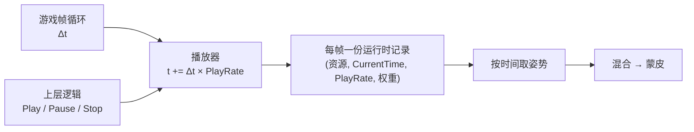

> [[Notes/动画系统/索引|← 返回 动画系统索引]]

# 动画播放器：生命周期与时间模型

> [!todo] 本篇核心问题
> Play/Stop/Pause 的时间推进规则？One-shot 和 Loop 分别怎么维护？

## 为什么需要解决这个问题

前面几篇都在回答同一件事：**给定一个时间 t，这一刻的姿势怎么算出来**——按 t 找到前后两个关键帧、插值（[[Notes/动画系统/旋转与变换基础/四元数插值：Slerp与归一化|Slerp 与归一化]]）、把局部旋转级联成世界变换（[[Notes/动画系统/旋转与变换基础/变换层级与复合变换|变换层级与复合变换]]）。但那个 t 是别人递进来的，笔记里默认它已经在那儿了。

真实项目里，**t 从哪来、谁在推它、什么时候把它归零**，是一件独立的事，而且是最容易出事故的一环。看一个每天都可能发生的小场景：

> 角色正在跑，撞墙掉血，播受击动画。
> 跑步动画要停在哪？受击动画放完之后要回到哪？

这里一句轻描淡写的"播放受击"背后藏着三个决定：

1. **跑步动画那一刻的 t 还推不推**。继续推，跑步姿势一直在变；停下来，跑步姿势就地冻住。受击只有上半身、下半身还在跑（[[Notes/动画系统/动画播放与混合/按骨骼混合与Mask|按骨骼混合与 Mask]]）时，这个决定直接决定下半身的腿是"还在迈步"还是"像被点了穴"。
2. **受击动画放完的那一刻，时间停在末尾还是回到开头**。停在末尾，角色就永远摆着挨打那一下的姿势；回到开头，角色会**"啪"地弹回第一帧**。
3. **受击动画放完由谁接手**。播放器只会告诉你"我放完了"，接下来切回跑步是**状态机**（[[Notes/动画系统/动画状态机与动画图/动画状态机：状态与转移|动画状态机]]）的事，播放器不负责。

三件事都归一个角色管：**动画播放器（Anim Player）**——有的引擎叫动画实例（Anim Instance），有的叫播放轨道（Track），本质是同一件事：**每个正在被播放的动画，都有一份运行时的播放状态，播放器负责推进它、并报告它的生命周期事件。**

> [!tip] 先说清楚：本篇需要懂多深
> **必须懂**（不知道就会写出错代码、或看不出 bug）：
> 1. **三个状态的时间语义**——Play / Pause / Stop 各自对 t 做什么，以及"恢复"该用哪个动作。
> 2. **时间怎么推进**——`t += Δt × PlayRate`；Δt 是变长的，PlayRate 可以为负为 0。
> 3. **Loop 靠取模回绕**：跨越末尾的那一帧要拆成两段。
> 4. **One-shot 到达末尾后停在末尾，并发出"完成"事件**——这是"动作放完能接逻辑"的全部机制基础。
>
> **知道即可**（一句话价值，不展开）：长时间播放的浮点误差累积；通知在跳帧时可能丢失、也可能因为记录被移除而一起没了。
>
> **可以不知道**：`fmod` 与取模的符号差异、跨末尾那一帧的精确插值做法——收在折叠区块。

## 直观理解：播放器是一台唱机，"姿势"是唱针底下那一段声音

用一个贯穿全篇的比喻。

**一段动画资源是一张唱片。** 唱片上刻着一条随位置变化的波形——位置就是时间 t，波形就是那一刻的**姿势**（Pose）：角色身上每一根骨骼此刻的位置和朝向（骨骼是一个没有长度的坐标架，详见 [[Notes/动画系统/角色资产与骨骼基础/骨骼的本质：从骨架到 Skeleton 资产|骨骼的本质：从骨架到 Skeleton 资产]]）。唱片本身是**只读**的：它有固定长度（`Length`，单位秒），从头到尾刻好了，播放不会改变它分毫。

**播放器是一台唱机。** 它只记三件事：**唱针现在读到了哪儿**（`CurrentTime`）、**唱片转多快**（`PlayRate`）、**转到底时怎么办**（`bLoop`）。

唱机对"推时间"这件事的全部逻辑，压缩成一行：

```text
每帧：唱针往前挪  Δt × 转速
```

于是"Play / Pause / Stop"这三个词，在唱机上各对应一个**具体的机械动作**：

- **Play**：把唱针**拨回开头**，然后开始转。（不是"继续转"——这是最容易记错的一点。）
- **Pause**：让转盘**停下**，唱针**留在原地**。再按 Play，从原地接着放。
- **Stop**：让转盘停下，**并且把唱针拨回开头**，同时把唱机从"正在放"的名单里划掉。

数据流位置：本篇处在动画链路的**最上游**——它在[[Notes/动画系统/动画数据与采样/按时间取姿势：帧查找与插值|按时间取姿势]]之前，是"决定用哪个 t 去取姿势"的那一站。输入端是游戏的帧循环（`Δt`）和上层逻辑（Play/Stop 指令），输出端是**每帧一组 `(动画资源, t, 权重)`**——下一站才是按这个 t 去取姿势、按权重混合（[[Notes/动画系统/动画播放与混合/姿势混合：加权与跨渐变|姿势混合：加权与跨渐变]]）。



## 核心机制

### 一份播放状态：五个字段

先把数据结构摆出来。每一个"正在播（或被暂停）的动画"在播放器里都对应这么一条记录：

```cpp
// flags: -O0 -g

// 一段动画的运行时播放状态。资源本身（关键帧数据）是只读的，不在这里
struct AnimPlayerState {
    const AnimClip* Clip;        // 只读资源：关键帧曲线 + Length
    float  CurrentTime;          // 唱针：此刻读到第几秒
    float  PlayRate;             // 转速：可以为负（倒放）、可以为 0（冻结）
    bool   bLoop;                // 转到底时：绕回开头，还是停下
    bool   bPlaying;             // 唱盘是否在转（Pause/Stop 时为 false）
    float  BlendWeight;          // 这份记录在最终姿势里占多少（下一篇展开）

    // One-shot 放完后停留的位置：末尾
    // CurrentTime == Clip->Length 就是"已放完、停在末尾"的静息态
};
```

读这张表要抓住一个分工：**`bPlaying` 管"转不转"，`CurrentTime` 管"在哪儿"，两者独立。** 正因为独立，才可能出现"停着但停在中间（Pause）"和"停着且回到开头（Stop）"这两种截然不同的状态——它们看起来都是"不动"，语义却相反。

### 状态转移：三个动作各自对 t 做什么

现在把三个动作对 `CurrentTime` 和 `bPlaying` 的影响逐条列清。这里用一张**状态转移表**：

| 动作 | `bPlaying` | `CurrentTime` | 语义 |
| :--- | :--- | :--- | :--- |
| **Play** | → true | **→ 0**（重新开始） | 从头播放 |
| **Pause** | → false | **保持不动** | 停在这儿，留着待会儿接着放 |
| **Stop** | → false | **→ 0** | 收工，从名单里移除 |
| **Resume**（Pause 之后 Play） | → true | 保持不动 | 从暂停处继续 |
| **Seek(t)** | 不变 | → t | 直接跳到某一时刻 |

这张表里最要命的一格是 **Play 会把 t 归零**。它带来一个反直觉的后果：**"暂停"和"恢复"不是一对对称操作。** Pause 保留 t，但恢复用的那个动作也叫 Play，而 Play 的语义是"从头播"——所以真正对称的一对是 Pause / **Resume**，而 Resume 只是"把 `bPlaying` 置回 true、**不碰 `CurrentTime`**"的一个变体。很多自研运行时干脆把它实现成同一个函数加一个参数：

```cpp
// flags: -O0 -g

// 三种"启动"意图，差别只在 t 归不归零
void Play  (AnimPlayerState& s) { s.CurrentTime = 0.f; s.bPlaying = true; }  // 从头
void Resume(AnimPlayerState& s) {                    s.bPlaying = true; }  // 接着
void Pause (AnimPlayerState& s) {                    s.bPlaying = false; } // 留住 t
void Stop  (AnimPlayerState& s) { s.CurrentTime = 0.f; s.bPlaying = false; }
```

**视觉后果对照**（这是调动画时真正会看到的东西）：

- 把 Resume 误写成 Play → **"暂停再恢复，动作跳回开头"**。走近路时按了 Pause、再恢复，角色突然回到迈第一步的姿势。
- 把 Pause 误写成 Stop → 恢复时同样是跳回开头，还会多一次"抖动"。
- 把 Stop 误写成 Pause → 你以为动画已经不参与求值了，实际它**还挂在待求值列表里继续贡献权重**，表现为"A 动画已经停了，姿势里却还有它的影子"。

> [!warning] Stop 与 Pause 的第三个区别：还在不在名单里
> 时间语义之外，Stop 通常还会**把这条记录从本帧的待求值列表里摘掉**，Pause 则保留（只是 `bPlaying = false`）。所以 Pause 的动画**依然参与混合**——它冻在某一帧的姿势上，仍在往最终姿势里贡献权重。这正是"上半身受击、下半身冻结在跑步某一帧"能成立的原因：那条跑步记录的 t 不动了，但它还在混合。

### 时间推进：一行代码里的三个决定

状态只能决定"转不转"，真正把 t 推走的是每一帧的这一行：

```cpp
// flags: -O0 -g

void Tick(AnimPlayerState& s, float DeltaTime) {
    if (!s.bPlaying) return;               // Pause / Stop：一行都不执行
    s.CurrentTime += DeltaTime * s.PlayRate;
    // ……回绕 / 收尾，见下一节
}
```

这一行里有三个决定，每个都有看得见的后果：

**① `DeltaTime` 是变长的，不是固定的。** 它来自游戏主循环——两个相邻帧之间真实流逝了多久。它随帧率波动：稳 60 帧时约 16.7ms，卡一下可能变成 200ms。**这意味着 t 的推进天然不匀速**，播放器无法假设"每帧走一样远"。所有基于 t 的逻辑（回绕、通知、到达末尾）都必须容忍"这一帧跨得特别远"。

**② `PlayRate` 可以是负数或 0。**

| `PlayRate` | 效果 | 什么时候用 |
| :--- | :--- | :--- |
| `> 1` | 快放 | 加速奔跑、动作被速度驱动 |
| `1` | 正常 | 默认 |
| `0 ~ 1` | 慢放 | 慢动作、蓄力、过场 |
| `0` | **完全冻结** | 定格表情、暂停演出 |
| `< 0` | **倒放** | 反着走动画（如起身 → 倒地反着用） |

注意 **`PlayRate == 0` 和 `Pause` 看起来一样（都不动），但语义完全不同**：Pause 是"暂时停，待会儿从这儿继续"，PlayRate 归零是"正常播放，只是速度为零"——它仍然在推进、回绕、触发通知，你甚至可以把它从 0 慢慢调到 1 做"变速启动"。用错的后果是**你以为暂停了，实际上通知还在照常触发**。

**③ 长时间纯靠累加会漂移。** `CurrentTime` 是一串浮点加法累出来的，误差会一点点堆积；同时如果上层为了性能偶尔"跳帧"（一帧里补推好几帧的量），漂移更明显。表现是：播了半小时的待机动画，和源文件的节拍**慢慢对不上了**。这条只需要知道结论——**别把 `CurrentTime` 当成精确的物理量去和某个固定值做 `==` 比较**，判断"是否到末尾"要用"跨过"而不是"等于"。

### 循环：靠取模回绕，不靠插值

如果动画是循环的（走路、跑步、待机），t 走到 `Length` 之后不能一直涨下去，得绕回开头：

```cpp
// flags: -O0 -g

// 朴素版：走到末尾就回绕
if (s.bLoop) {
    s.CurrentTime = std::fmod(s.CurrentTime, s.Clip->Length);
}
```

这一行是循环动画的全部秘密——**循环不是一个"功能"，而是一次取模**。但朴素版有一个**看得见的坑**，就藏在"最后一次跨越末尾的那一帧"里。

设想跑步动画长 1 秒，某一帧 `CurrentTime` 从 0.97 推进到 1.03。这一帧**跨过了末尾**。朴素版取模后 `CurrentTime = 0.03`，于是这一帧渲染出来的姿势是**开头的姿势**——中间那 0.06 秒（从 0.97 经末尾、绕回 0.03 的那段）**整段被吃掉了**。

表现在屏幕上：**循环接缝处"啪"地跳一下**——步子的节拍每一圈都错一点，跑久了越看越别扭。步子越快、帧率越低，这一下越明显（步子慢、帧率高时跨过的量很小，肉眼几乎看不出，所以这个 bug 常常在"低帧率 + 快速动作"时才暴露）。

正确做法是**把这一帧拆成两段**：先走完到末尾的那一小段（0.97 → 1.0），剩下的量（0.03）从 0 接着走。

```cpp
// flags: -O0 -g

// 正确版：跨越末尾时，把这一帧拆成"收尾段 + 开头段"
void Advance(AnimPlayerState& s, float DeltaTime) {
    if (!s.bPlaying) return;

    const float Length = s.Clip->Length;
    s.CurrentTime += DeltaTime * s.PlayRate;

    if (s.bLoop) {
        if (s.CurrentTime >= Length) {
            // 余量按 Length 回绕，落到新一圈的位置上
            // 注意不能用 fmod 一刀切，否则"跨末尾那一帧"的姿势会被直接跳到开头
            s.CurrentTime -= Length;         // 单次跨越足够小时这一行就等价于"拆两段"
            // 若一帧跨过整段（见"边界与坑"），这里要改成 while 或 clamp
            OnLoopWrapped(s);                // 通知上层"刚过了一圈"（可选）
        }
    } else {
        // One-shot：停在末尾，不绕回去
        if (s.CurrentTime >= Length) {
            s.CurrentTime = Length;
            s.bPlaying    = false;
            OnFinished(s);                   // 关键：报告"放完了"
        }
    }
}
```

对"只跨一次末尾"的常见情形，`CurrentTime -= Length` 与"拆两段播"在**时间上**是等价的（1.03 − 1.0 = 0.03，正是第二段该走到的位置）。差别在于：真正严格的实现会**在这一帧里把两段姿势都取出来混合一次**（末尾 → 开头的插值），让接缝处的姿势连续；而只改 `CurrentTime` 的话，这一帧直接用了新一圈的姿势，仍然有**一帧的跳变**。步子快、帧率低时，这一帧的跳变恰好落在脚落地的那一下，肉眼能看见。

> [!note]- 想深究：`fmod` 的符号与"跨过末尾那一帧"的精确处理
> `std::fmod` 对负数是"向零取整"，所以倒放（`PlayRate < 0`）导致 `CurrentTime < 0` 时，`fmod(-0.03, 1.0)` 得到 `-0.03` 而不是 `0.97`——**倒放的循环必须自己补一次 `+= Length`**，或者改用数学意义上的取模 `(t % L + L) % L`。
> 至于"跨末尾那一帧精确插值"，工业实现的做法是：回绕时记录"跨过了多少"，这一帧先按句尾取一次姿势、再按句首取一次姿势，两者之间按跨过的比例做一次插值。知道有这么回事即可，日常排查"循环接缝跳帧"时记住**先去查回绕逻辑，而不是去查插值逻辑**——姿势采样那一站是无辜的。

### One-shot：时间停在末尾，并发出一个"完成"事件

Loop 和 One-shot 的区别，用唱机的话说就是：**Loop 的唱片是环形带，One-shot 是直的**。

- **Loop**：时间永远被回绕，**永不结束**，也不需要任何"完成"通知。
- **One-shot**（受击、开火、死亡、翻滚这类只播一次的动画）：时间到达末尾后**停在末尾**，把 `bPlaying` 置为 false，然后**触发一次"播放完成"事件**。

这句"停在末尾"是理解后面一切的关键。到达末尾时 t 恰好等于 `Length`，按这个 t 取姿势得到的是**最后一帧**——所以 **One-shot 放完的静息状态就是"摆着最后一帧的姿势不动"**。没有外力干预，角色会永远保持这个姿势。

于是就有了那个每个项目都会问一次的决策：

> **死亡动画放完，角色是躺在地上不动，还是要淡出？**

- **保持最后一帧**：最省事，但**必须有人来接管**。死亡动画最后一帧是"倒地"姿势，那么角色会一直躺着——这正是我们想要的；但如果这段 One-shot 是"受击后仰"、最后一帧是仰头，那角色就会**永远仰着头**，除非状态机切走。实践中，One-shot 放完若无人接管，常见的表现是**角色卡在最后一个动作上像被冻住**。
- **淡出（Fade Out）**：让这份记录的权重在两三百毫秒内从 1 降到 0，同时让另一个动画（通常是循环的待机或移动）的权重升上来。这**也是状态机/混合器的活**，播放器只负责把"我放完了"这个信号交出去。

所以播放器与上层逻辑之间有一个明确的**契约**：

```cpp
// flags: -O0 -g

// 播放器只负责"报告"，怎么接手是上层的事
void OnFinished(const AnimPlayerState& s) {
    // 这份记录此刻的状态：bPlaying == false, CurrentTime == Length
    // 姿势仍停留在最后一帧，且（在被移除前）仍以 BlendWeight 参与混合
    NotifyOwner(s.Clip, EAnimEvent::Finished);
}
```

上层的典型写法是：收到 `Finished` → 决定下一步（切回移动状态 / 播死亡保持帧 / 淡出到待机）。**"淡出需要另一个动画接管"这件事没有例外**——不接管，权重掉到 0 之后就没有任何动画在提供姿势，角色会退回**参考姿势（Reference Pose / Bind Pose，多数项目就是 T-Pose）**显示出来。这是排查"动作播完角色突然变成 T-Pose"的第一嫌疑点。

### 通知：挂在时间轴上的事件（知道即可，但很有用）

动画除了姿势，还可以在时间轴上挂一些**时间点事件**——脚步落地时放音效、攻击第 0.4 秒开判定框、弓弦松手那一下生成粒子。这类东西统称**通知（Notify / Event / AnimNotify）**：一条 `(时间点, 事件类型, 参数)` 记录。

它的判定逻辑只有一句，但这一句就能解释一个高频 bug：

> **通知的触发条件不是 `CurrentTime == 通知点`，而是"这一帧的 `[旧 t, 新 t]` 区间跨过了通知点"。**

因为 t 按 `Δt` 往前跳（不是一帧一帧挪 1/60 秒），所以当 `Δt` 特别大时——加载卡顿、断点、编辑器里拖拽时间轴——**这一帧的区间可能一次跨过好几个通知点**。如果实现是"跨过后只触发最后一个"，之前的脚步声就丢了。

实践中会顺手做两件事：给 `Δt` 设一个上限（clamp，比如不超过 0.1 秒），以及在跨过的通知点里**全部触发**而不是只触发最后一个。

还有一件事比"丢通知"更值得留意：**通知不是在推进时间的那一行代码里立刻执行的，而是先攒进一个待派发队列，等这一帧的姿势全部算完、骨骼变换都定下来之后，才统一派发。** 工业实现这么做有它的道理：通知的回调里可能读骨骼位置（脚落地时喷尘、生成脚步声），姿势没算完就读，拿到的是上一帧的位置；回调还可能直接切动画、甚至销毁角色，放在求值中途执行会把姿势数据搞乱。所以顺序被刻意排成"**先算完姿势 → 再派发通知**"。

代价是这条规矩：**如果这一帧里这条记录已经被停掉、被移出待求值列表，它攒下的通知可能就一起没了。** 对一个"播完即走"的 One-shot 来说这几乎没影响（放完了本来也没剩什么要放的）；但如果你写的是"**在一个动作中途手动停掉它，然后指望它的收尾通知（比如收刀的音效、关闭判定框）照常触发**"，那一帧的通知很可能就静默丢了。这也是排查"音效偶尔不响"时容易被忽略的一段：**先去确认那条动画在那一帧是不是已经被停了**，再怀疑音效系统。

## 边界与坑

- **`Length == 0`（单帧动画）**：循环回绕要除以 `Length`，直接就除零了，`CurrentTime` 变成 `NaN`——之后所有插值和混合都跟着 `NaN`，表现是**角色整个消失或飞成一团**。兜底很简单：`Length <= 0` 时直接按 One-shot 处理（停在唯一那一帧）。单帧动画在项目里并不罕见（一帧的"死亡保持"帧、一帧的表情）。
- **`PlayRate == 0` 且 `bLoop`**：播放器认为自己在正常播放（`bPlaying == true`），t 却一动不动——看起来就是卡住。**排查"动画不动"时，先看 `PlayRate`，再看 `bPlaying`**，最后才怀疑资源。
- **`Δt` 过大**：卡顿后一帧 2 秒，而动画只有 1 秒——一次推进直接跨过整段。表现是**"这段动画根本没看见播"**（Loop 的话是少转了一圈，One-shot 的话是立刻触发 `Finished`）。**修法是给 `Δt` 上 clamp，而不是给动画加长度。**
- **倒放 + 循环**：`CurrentTime < 0` 时 `fmod` 给负数（见折叠区块），要自己补一圈；否则唱针直接跑到 -0.03，取姿势取到资源外，落到"钳制到第一帧"，表现为**倒放一圈后卡在第一帧**。
- **`Length == 0` 之外的另一个除零**：`PlayRate` 用于反推"还剩多少时间"时（如 `Remaining = (Length - CurrentTime) / PlayRate`），`PlayRate == 0` 会除零。需要这种估算时先判零。
- **多个动画同时在播**：同一时刻往往有好几条播放记录（移动 + 受击 + Additive 呼吸），每条都有自己的 t 和**权重**。播放器只保证"每条记录的 t 是对的"，**"这些姿势怎么合成一个"是下一站的事**——这里只需要知道，权重为 0 的记录在数学上等于不存在，但**仍然会参与一次求值**（性能上值得剔除）。
- **多个角色在播同一段动画时相位可能对不上**：两个敌人一起跑步，很可能一个迈左腿、一个迈右腿，看起来"同步却又不同步"。这不是播放器的 bug，而是每条记录的 t 各推各的、起始相位也不同。这正是 [[Notes/动画系统/动画状态机与动画图/动画同步：过渡时机与步伐对齐|动画同步：过渡时机与步伐对齐]] 要处理的事。
- **`CurrentTime` 浮点误差**：不要用 `==` 判断是否到达末尾，用 `>=`；也不要指望它对得上音频的精确采样点。通知的判定同理——判"跨过"而不是"等于"。

## 参考实现（UE）

| 引擎 | 对应模块/数据结构 | 具体体现 |
| :--- | :--- | :--- |
| UE | `UAnimInstance`（动画实例） | 就是本篇的"播放器"：每个角色实例持有一份动画实例，负责每帧推进时间、驱动求值——入口是 `UAnimInstance::UpdateAnimation`，见 [[Notes/UE/第四阶段-客户端运行时层/UE-AnimGraphRuntime-源码解析：动画图与BlendSpace\|UE 动画图与 BlendSpace]] |
| UE | `FAnimTickRecord`（单条动画的运行时记录） | 对应本篇的 `AnimPlayerState`：按 `TimeAccumulator`（时间累加器）推进、`PlayRateMultiplier` 控速、`bLooping` 控回绕、`EffectiveBlendWeight` 控混合占比——求值管线里"按时间取姿势"这一站的输入，见 [[Notes/UE/第八阶段-跨领域专题/UE-专题：动画评估管线\|UE 动画评估管线专题]] |
| UE | `FAnimMontageInstance`（蒙太奇实例） | 管理 One-shot 型的分段播放：一次播放一条"段"（Section），走到段的末尾**把位置钳在末尾**、把 `bPlaying` 置为 false，并挂起一个"Montage 已结束"的回调——即本篇的"停在末尾 + 发出完成事件"，见 [[Notes/UE/第四阶段-客户端运行时层/UE-AnimGraphRuntime-源码解析：动画图与BlendSpace\|UE 动画图与 BlendSpace]] |
| UE | `UAnimSequenceBase` / `FAnimNotifyEvent` | 通知（Notify）的资产侧定义与运行时判定：一次推进给出"旧 t → 新 t"的区间，从这里取区间内跨过的全部通知，再交给动画实例统一派发 |

UE 的三层分工值得留意：**`UAnimInstance` 管整个角色的时间推进（播放器），`FAnimTickRecord` 管单条动画的 t（唱针记录），`FAnimMontageInstance` 管"一次性的分段播放 + 完成回调"（One-shot 语义）**。本篇讲的三个概念，在 UE 里是三块分开的代码——这也说明它们确实是三个独立的问题。

有一个细节值得单独点出来，因为它常被读成引擎的缺陷：**这些播放接口并不都长成"Play 一律把 t 归零"的样子。** 蒙太奇走的是 `UAnimInstance::Montage_Pause()` / `Montage_Resume()` 这对独立接口，语义就是"从当前位置接着走"（对比同样存在的 `Montage_Play()`——它才是从头播的那个）；而资产播放节点走的是时间累加器（`TimeAccumulator`）——**它们记的是"累计走了多少"，而不是"现在在第几秒"**，循环回绕发生在"累计量换算成播放位置"的那一步，而不是去改一个 `CurrentTime` 字段。这说明本篇讲的那条纪律是**接口语义纪律、不是数学纪律**：引擎可以换一种数据结构把两者区分开，但只要你手上的 API 把"从头播"和"接着播"合并成了一个 `Play`，就一定会在某个傍晚踩中"暂停再恢复，动作跳回开头"。

## 一句话总结

播放器不生产姿势，它只维护"每段动画播到第几秒"：**Play 会归零、Pause 留住 t、Stop 归零并退场**，时间按 `t += Δt × PlayRate` 推进；**Loop 靠取模回绕，One-shot 到末尾就停下并发出"完成"事件**——而"放完之后谁来接手"，永远不是播放器的责任。

---

**下一篇**：[[Notes/动画系统/动画播放与混合/姿势混合：加权与跨渐变|姿势混合：加权与跨渐变]]——现在每条播放记录都有自己的 t 和权重了，接下来回答：这些姿势怎么按权重合成一个，Crossfade 又怎么让两条记录在几百毫秒内交换权重而看不出"啪"地一跳。
