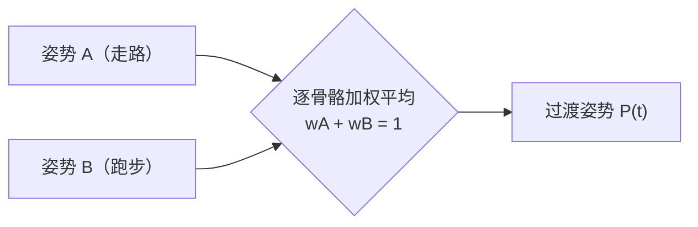

> [[Notes/动画系统/索引|← 返回 动画系统索引]]

# 姿势混合：加权与跨渐变

> [!todo] 本篇核心问题
> 两个姿势怎么加权平均？Crossfade 如何避免「啪」地跳变？

## 为什么需要解决这个问题

调角色移动时几乎一定会撞上这个场景：角色从走路切到跑步。两段动画都做得不错，但切换的那一瞬间，腿**「啪」地跳到了另一个姿势**——像视频剪辑的硬切，上一帧还是走路的步幅，下一帧整条腿已经摆到跑步的位置。

玩家说不出哪里不对，只会觉得「这游戏动作很廉价」。角色也像被瞬间重设了一遍：上半身的轻微前倾、手臂的摆幅、重心的位置，全部同一时刻换掉，身体没有任何「调整过去」的过程。

所以要的不是「切换」，而是**在几百毫秒内平滑地过渡过去**。这件事就叫**混合（Blend）**，而过渡的时长写在参数上，调它就是调手感。

## 直观理解：一本逐页对齐的翻页动画

用一个贯穿全篇的比喻。

**一个姿势（Pose）就是翻页动画的一页纸。** 翻页动画的每一页上，都画着整个角色此刻的完整样子——一根手指弯曲多少、脖子偏了多少，全都画齐了。**少画一个部位，那一页就不成立。** 动画求值（按时间从动画数据里取出当前位置的样子）的产物就是这样一页纸，混合的输入和输出也都是这样一页纸。

这张纸上「一根手指弯曲多少、脖子偏了多少」，其实就是**每根骨骼各自的位置和朝向**——所以这个比喻背后藏着一个前提：**角色身上得先有一副骨架撑着**。如果「骨骼」对你还是个模糊的词，先花两分钟看一眼 [[Notes/动画系统/角色资产与骨骼基础/骨骼的本质：从骨架到 Skeleton 资产|骨骼的本质：从骨架到 Skeleton 资产]]。一句话版本是：**游戏里的骨骼不是骨头，而是一个没有长度的坐标架**；角色身上挂着一串这样的坐标架，组成树状层级，动其中一根，它下面的整条手臂跟着走。后面的蒙皮（把网格顶点绑到骨骼上跟着变形）和本篇的混合，都建立在这串坐标架之上，两者都不改变它的结构。

本篇不重复讲骨骼，只交代一件后面马上要用的事：**骨骼数量在运行时是固定的**，所以一份姿势总是「所有骨骼各来一份、一根不多一根不少」——这正是下一节「混合按索引配对」那条规矩的由来。

于是「走路切跑步」的硬切，就相当于**把翻页动画从走路的某一页直接接到跑步的某一页**——画面当然会跳。而混合要做的是：**在两张纸之间补出中间纸**。补法很朴素——每根骨骼的每个数值，取两张纸对应数值的加权平均：

> 甲占七成、乙占三成，就把两页上同一根骨骼的位置各取七成和三成加起来。
> 过渡刚开始时甲占十成，一路挪到乙占十成，中间就长出了一串过渡纸。

这个「各占几成」的数字，就是本篇的第二个主角：**权重（Weight）**，很多引擎里叫 **Alpha**。权重从 0 走到 1 的那个过程，就是 **Crossfade（跨渐变）**——fade 是「淡入淡出」，cross 是「两边交叠着换」：不是先淡出一边再淡入另一边，而是**同一时刻两边各占一部分**。



数据流位置：本篇正是动画链路「采样 → **混合** → 后处理 → 蒙皮 → 渲染」里**混合站**的主角。上游的"采样"是照着每一路自己的播放进度 `t` 去动画数据里取值（各路互不知情、各取各的），到了混合站，**几路各拿一份完整的姿势交到这里**，由本篇把它们揉成一份——所以混合站的输入是"姿势各自取好、权重已经算好"，输出仍是**一整份姿势**，才交给后处理与蒙皮。上游 [[Notes/动画系统/旋转与变换基础/变换层级与复合变换|变换层级与复合变换]] 定义了「一个姿势」的数据含义，前面几篇解决了单根骨骼怎么插值；本篇负责把**两份完整的姿势**合成一份，下游再交给蒙皮去拉顶点。

## 核心机制

### 姿势是什么：一整份「所有骨骼的局部变换」

先把输入输出的形状定死。

一个**姿势（Pose）**，就是**所有骨骼的局部变换**的一个完整快照——一根都不能少。每根骨骼存的是它**相对于父骨骼**的位置、旋转、缩放（不是相对世界原点；这也是它必须按树逐级复合才能得到世界位置的原因），这些量打包成一份 `Transform`。整份姿势就是这些 `Transform` 按骨骼索引排成的一个定长数组（第 3 项永远是第 3 号骨骼）：

```cpp
// flags: -O0 -g

// 一个姿势 = 每根骨骼一份局部变换，按骨骼索引一一对齐
// 所谓"混合两个姿势"，其实就是把两个这样的数组逐项配起来算
struct Pose {
    std::vector<Transform> BoneLocals;  // 大小 = 骨架骨骼数
};
```

「按索引一一对齐」这件事是全部混合的前提，也是后面「骨骼缺失」那个坑的根源：混合**不看你手上拿的是不是同一段动画**，它只认「第 i 项配第 i 项」。两根骨骼的索引一错位，混出来的就是怪东西。

顺便说清楚两个容易混的概念：**姿势是某一瞬间的一张快照，动画是很多张快照按时间排成的序列**。所以「两个姿势做混合」在时间上只影响当前这一帧；一个持续进行的过渡（Crossfade）是**每一帧都在重新混一次**，权重逐帧推进。

### 混合：逐骨骼、逐分量的加权平均

公式只有一行，而且是对每根骨骼、每个分量都做一遍：

```text
Pose_result[i] = Pose_A[i] * wA + Pose_B[i] * wB
```

三个分量的处理方式**并不一样**，这是混合里最容易写错的地方：

```cpp
// flags: -O0 -g

// 逐骨骼混合：位置和缩放直接 Lerp，旋转必须走四元数插值
Transform BlendBone(const Transform& a, const Transform& b, float wB) {
    const float wA = 1.0f - wB;

    Transform out;
    out.Translation = a.Translation * wA + b.Translation * wB;  // 位置：直接 Lerp
    out.Scale       = a.Scale       * wA + b.Scale       * wB;  // 缩放：直接 Lerp

    // 旋转：必须在单位球面上插值，且先做"就近"符号检查
    Quat qb = b.Rotation;
    if (Dot(a.Rotation, qb) < 0.0f)     // 两张处方单隔了大半圈：把 b 取负
        qb = -qb;                       // q 与 -q 是同一个旋转，取负没有副作用
    out.Rotation = Slerp(a.Rotation, qb, wB);

    return out;
}
```

**旋转那一行是整个混合里决策价值最高的一行。** 四元数有一对描述同一旋转的「双重覆盖」（`q` 与 `-q`）——两个源动画单独播放时各自都正常，一旦它们恰好一个落在这半球、一个落在对面那一半球，插值就会**绕大半圈**。表现是混合过程中角色**朝向突然翻转 / 抽搐一下**，像脖子被人拧了一把。这是调混合时最神秘的一类 bug，因为**两个输入动画分开看都是对的**，问题只出现在两者相加的那一刻。

细节（为什么点积能判断远近、`dot < 0` 的完整来龙去脉）在前面已经写透了，此处只落实规矩：[[Notes/动画系统/旋转与变换基础/四元数插值：Slerp与归一化#旋转直接按数平均，错在哪|Slerp 与归一化]] 与 [[Notes/动画系统/旋转与变换基础/四元数的几何意义与运算#彩蛋：q 和 -q 是同一张处方单|q 和 -q 是同一张处方单]]。

> [!note]- 想深究：为什么位置和旋转要用两把不同的刀
> 位置是普通三维坐标，连线上的每个中间点都是合法位置；旋转是必须待在单位球面上的量，直接平均会离开球面（混进缩放，表现为角色中途「发胖」），还会沿弦变速。完整对比见 [[Notes/动画系统/旋转与变换基础/四元数插值：Slerp与归一化#混合站里的分工|混合站里的分工]]。**不读不影响使用**——你只要记住「旋转查符号、位置缩放直接混」这条分工即可。

### 权重的约束：必须归一化，以及 Σw = 0 时会发生什么

上面代码里 `wA = 1 - wB` 是**手动保证**了 `wA + wB = 1`。真实项目里参与混合的往往不止两个姿势（比如 [[Notes/动画系统/混合空间与Additive/混合空间：布局与插值|混合空间]] 用四个采样点、**再加**一路叠加动画），权重是各玩各的，于是引擎会在混合前把它们统一除一遍：

```cpp
// flags: -O0 -g

// 归一化：把所有权重除以其总和，保证 Σw = 1
void BlendPoses(const std::vector<Pose>& poses,
                const std::vector<float>&  weights,
                Pose& out) {
    float sum = 0.0f;
    for (float w : weights) sum += w;

    // 除零兜底：所有权重都是 0 时，直接沿用上一帧姿势（或退化为等权）
    if (sum < 1e-6f) { /* 绝不能让 sum 当除数 */ return; }

    for (size_t i = 0; i < poses.size(); ++i) {
        const float w = weights[i] / sum;   // 归一化后才是真正参与的系数
        Accumulate(out, poses[i], w);
    }
}
```

**为什么非归一化不可**：这是最反直觉的一处——权重是 `(0.5, 0.5)` 却没除总和时，结果**不是「各取一半」，而是整体打对折**：两份姿势各按 0.5 加进去，加起来的总量只有 1 份的一半，相当于把角色缩到一半大小、位置也挪到半路。表现是过渡途中人物大小不对，或者位置一点点偏出去，过渡结束才「弹」回正确位置。

**Σw = 0 是另一个更凶险的边界**：除零得到 `inf` 或 `NaN`，这一帧整个姿势变成 NaN，**角色会整帧消失或一闪一闪**。触发条件通常很隐蔽，两个典型来源是**骨骼 Mask**（按骨骼划分、只让一部分骨骼参与某路混合的开关，见[[Notes/动画系统/动画播放与混合/按骨骼混合与Mask|按骨骼混合与 Mask]]）和[[Notes/动画系统/混合空间与Additive/Additive动画：叠加与增量姿势|Additive 动画]]：身体 Mask 和它的反向 Mask 各算一份权重、或者某路动画被挂在两个状态上，平时加起来都刚好正常，只在两路同时归零的那几帧发作。排查「角色偶尔闪一下 / 偶尔不见」时，这是一个高价值检查点。

### Crossfade：让权重随时间走过去

有了混合能力，切换动画就只是「让权重动起来」。

从 `A` 过渡到 `B` 时，令 `wA` 从 1 线性降到 0、`wB` 从 0 线性升到 1，过渡时长通常取 **0.1 ~ 0.3 秒**。太短等于硬切，太长角色会「飘」——跑步切走路时，过渡超过半秒会有明显的脚不属于自己的感觉。

然后就撞上真正的关键，也是本篇最值钱的一条经验：**混得到，不等于混得对。**

走路是 1 秒一步，跑步是 0.6 秒一步。两段动画的时间轴互不相同，如果**让它们从各自的起点开始混合**，过渡期间两条腿会各走各的节拍——走路那一路按 1 秒一拍的节奏落地，跑步那一路按 0.6 秒一拍的节奏落地，两者完全不重合。混出来的中间姿势里，两条腿的姿势量**随机错配**：明明是「左脚在前、右脚在后」的中间步，混出来的却是「两脚几乎同时落地」，甚至「同手同脚」——手臂和腿摆到了同一侧。画面看起来**两只脚几乎同时落地、步子乱掉**（玩家俗称「鬼步」「滑步」），角色像一只在冰上扑腾的鸭子。而这一切的根源只是**两段动画的播放进度对不上**，跟混合公式一点关系都没有。

修法不是调混合，而是**先解决时间**：让参与混合的几段动画**共享一个归一化进度**，而不是各跑各的。过渡开始时把 B 的播放进度挪到与 A 当前相位最匹配的位置（A 的左脚刚落地，就把 B 也拨到左脚刚落地那一帧），之后两边按同一个进度一起走，混出来的中间帧才是合理的中间步。这套机制通常叫**步频对齐 / Sync Group（同步组）**。

**所以「走路切跑步顺不顺」的决定权，其实不在这篇的混合公式手里，而在相位对齐手里**——它是必须懂的一条：混合只负责按权重揉，**相位对齐负责让被揉的两份东西对得上**。更完整的一套（什么时候允许切、相位差多少算「对得上」、受击/起跳这类没有步伐相位的动画怎么处理）在 [[Notes/动画系统/动画状态机与动画图/动画同步：过渡时机与步伐对齐|动画同步：过渡时机与步伐对齐]] 展开。

### 加性混合：与线性混合的一点区别

上面讲的都是**线性混合（Lerp Blend）**：A 和 B 互相取代，总权重和恒为 1，两边此消彼长。

还有另一种用法叫**加性混合（Additive）**：在基础姿势 A 之上，**加**一份偏差姿势——呼吸的起伏、受击时的抖动、瞄准时的身体偏移都是这个形态。区别一句话：**线性混合问「A 和 B 各占多少」，Additive 问「在 A 的基础上加多少」**。它不受 `Σw = 1` 约束，也因此容易出现叠加过量、姿势「爆炸」的问题。

细节留到专篇：[[Notes/动画系统/混合空间与Additive/Additive动画：叠加与增量姿势|Additive 动画：叠加与增量姿势]]。

## 边界与坑

- **权重和为 0** → 归一化时除零，整帧姿势 NaN，**角色消失或闪烁**。引擎需要一个「全零就退化为等权」的兜底，排查角色间歇性消失时值得一看。
- **权重和不为 1** → 姿势量整体缩放，过渡途中人物大小不对，过渡结束才弹回来。
- **旋转没做 `dot < 0` 检查** → 混合时朝向突然翻转、抽搐。**两个输入动画单独看都正常**，问题只在两者相加的那一刻出现——这是最难查的一类混合 bug。
- **过渡权重走直线** → 过渡的起步和收尾各「顿」一下，美术会反馈「切换有点生硬」。把权重曲线换成缓入缓出的 `smoothstep`（`t*t*(3-2t)`）即可，是最便宜的一处手感提升——过渡速度在两端都趋于 0，角色是「转过去」而不是「被推过去」。
- **两段动画的相位没对齐就混** → 两腿节拍错位，出现「两只脚同时落地」「同手同脚」的鬼步／滑步。混得再平滑也救不回来，因为错的是**两者对不上**，不是混合方式。过渡前先对齐步频。
- **某个动画里缺骨骼** → 混合按索引配对，缺失的那一项只能保持参考姿势（[[Notes/动画系统/角色资产与骨骼基础/骨骼的本质：从骨架到 Skeleton 资产#Skeleton 资产里到底存了什么|参考姿势]]）。数据流里多出来的骨骼会被**原样透传**，于是两路混合后多出来的骨骼仍是 Walk 的摆动值，不匹配就会**抖动**；数据流里少掉的骨骼则永远停在参考姿势，表现为**「混合时某个部位僵直不动」**。排查「换装后胳膊不动了」「加了新骨骼后混出怪姿势」时，先看两路姿势的骨骼数是否一致。
- **混合两个差异极大的姿势**（比如站立 vs 趴下）→ 中间帧会出现**不可能的姿势**：腿穿进身体里、手臂穿过躯干。两根肢体的位置取平均，得到的位置在解剖上根本不成立。教训是**不该混合的东西别混**——实际工程中更常见的做法是用[[Notes/动画系统/动画状态机与动画图/动画状态机：状态与转移|状态机]]先切到姿势相近的状态，再让混合去磨掉最后那点跳变。
- **权重恰好为 0 的那一路仍然会被求值**（大多数实现如此）→ 性能上不划算，动画图的求值顺序与此有关；但对结果没有影响，属于「知道即可」。

## 参考实现（UE）

| 引擎 | 对应模块/数据结构 | 具体体现 |
| :--- | :--- | :--- |
| UE | `FAnimationRuntime::BlendPosesTogether` / `BlendTwoPosesTogether` | 逐骨骼加权混合的落地实现，内部即有「位置缩放 Lerp、旋转按四元数插值并按长度归一化权重」的分工；后一组还有按骨骼过滤（`EBlendPosesPerBoneFilterFlags`）的变体，用来切换是否走快速路径（跳过部分归一化与数学分支） |
| UE | `FAnimationRuntime::LerpPoses` | 「A 到 B 按 alpha 插值」的极简形态，就是本篇那一行加权平均公式的直接对应物 |
| UE | `FAnimNode_BlendListBase` / `FAnimNode_TransitionResult` | 动画图里负责多路混合与状态过渡的节点：权重数组由节点持有，过渡期间逐帧推进，权重和为零的情形对应上面的除零兜底——见 [[Notes/UE/第四阶段-客户端运行时层/UE-AnimGraphRuntime-源码解析：动画图与BlendSpace\|UE 动画图与 BlendSpace]] |
| UE | `FCompactPose` | 混合的输入输出姿势容器（紧凑数组，按骨骼索引对齐）；骨骼数不一致时的处理与「缺失骨骼回退到参考姿势」都在这一层——见 [[Notes/UE/第八阶段-跨领域专题/UE-专题：动画评估管线\|UE 动画评估管线专题]] |

## 一句话总结

混合就是「逐骨骼加权平均」：位置和缩放直接 Lerp，旋转必须走四元数插值并先做 `dot < 0` 的就近检查；权重必须先归一化——权重和不为 1 会让姿势整体缩水，`Σw = 0` 更会让姿势变 NaN、角色消失；Crossfade 让权重从 1 走到 0 完成过渡，但**真正决定过渡自然不自然的是相位对齐**：步频不同的两段动画不对齐进度就混，看到的是「两只脚同时落地」的鬼步。

---

**下一篇**：[[Notes/动画系统/动画播放与混合/按骨骼混合与Mask|按骨骼混合与 Mask]]——刚才是整份姿势一起混，下一步把颗粒度收到骨骼级别：让上半身打枪、下半身继续走路。
