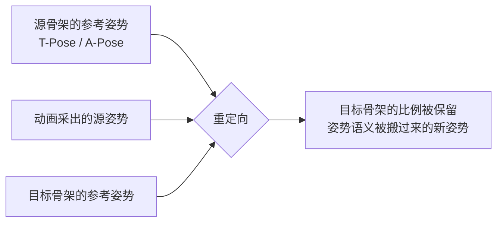

> [[Notes/动画系统/索引|← 返回 动画系统索引]]

# 动画重定向：一套动画复用到不同骨架

> [!todo] 本篇核心问题
> 一套动画资产，怎么复用到骨骼比例、骨架结构不同的角色身上？

## 为什么需要解决这个问题

美术花了两周，给主角做了一套跑步动画：身高 1.8 米，腿长 90 厘米，肩膀很宽。策划看了很满意，说"这个跑步动作挺好，给人形 NPC 也套上吧"——NPC 身高 1.6 米，腿长 78 厘米，肩膀更窄。

听着像复制一个文件的事，实际上手你会发现**每一帧都是事故**：

- 两条手臂**穿进胸口**；膝盖**往后折**，折成了人腿不可能达到的角度。
- 脚**踩进地面**，或者反过来**悬在半空**——腿短了 12 厘米，而动画里跨出去的步幅还是按 90 厘米的腿量出来的。
- 两条手臂还会**被拉长或压短**——小臂本该 21 厘米，播放动画时却变成了 25 厘米。

四个事故看着分散，根子是同一件事：**动画数据是按"源角色"的身材写死的**。

要理解这一点，得先回忆一下动画文件里到底存了什么。游戏角色身上唯一真实存在的东西是**顶点**——一堆空间点；而驱动这些顶点变形的那套"关节坐标架"，在动画数据里就是一根根**骨骼**（它不是骨头，是个没有长度的坐标架，详见 [[Notes/动画系统/角色资产与骨骼基础/骨骼的本质：从骨架到 Skeleton 资产|骨骼的本质]]）。

按 [[Notes/动画系统/旋转与变换基础/变换层级与复合变换#局部变换长什么样：一个三分量结构体|局部变换的三个分量]]，一根骨骼存的是一个**局部变换**——相对父骨骼的平移、旋转、缩放。其中动画真正在改的几乎只有**旋转**一个分量：每帧给每根骨骼一个"相对父级的朝向"。这些旋转值被美术在**主角身上**调出来的，它们回答的问题是"主角这条 25 厘米的小臂，相对大臂该转到什么角度"。

那么问题来了：**这套描述是比例无关的吗？** 看起来好像可以——旋转只是个角度，跟骨头多长没关系。这个直觉对了一半，也正是重定向全部麻烦的来源。这一篇就沿着"为什么不能直接套 → 怎么让它能套 → 套完还剩什么问题"这条线走。

## 直观理解：一份照着模特身材裁好的纸样

用一个贯穿全篇的比喻。

想象服装厂里有一份**照着模特身材裁好的纸样**——模特肩宽 48 厘米、臂长 60 厘米。现在要拿这份纸样给另一个人做衣服：肩宽 42、臂长 54。

纸样上每一片布**都是"相对于上一片"标注的**："从这里往外 30 度斜下，接一块 25 厘米长的布"。所以纸样有两个层次的信息：

1. **弯折的角度**（"斜下 30 度"）——这是**姿势**，是这份纸样真正的价值。
2. **每一段的长度**（"25 厘米"）——这是**照着模特量的尺寸**，对新人毫无意义。

直接照抄纸样，两件事同时出错：**布片长度照抄**（新人的小臂被做成了模特的 25 厘米），**弯折角度也照抄**（新人的身材比例不同，照搬的角度落下去就不对了）。

那正确的做法长什么样？**先量一份新人的标准站姿**（手臂水平张开、双脚并拢），把纸样上的每一处弯折都改写成"相对新人标准站姿偏了多少度"；再按新人和模特的**身材比例**，把每段的长度换算过来。最后裁剪出来整体轮廓一致、落在新人自己身上。

**重定向（Retargeting）** 干的就是这件事。而上面那份"标准站姿"，在动画里有个正式名字：**参考姿势（Reference Pose）**——就是美术绑骨骼时摆的那个基准姿势，业界主流是 **T-Pose**（双臂水平张开成 T 字形）和 **A-Pose**（双臂斜下约 45°，像字母 A）。记住这个词，下面反复要用。



数据流位置：重定向**不是动画链路里的独立一站**，它是**横切在采样站上的一道加工**。动画采样的输出（源骨架比例下的一张姿势），在流向下游混合之前被换算成目标骨架比例下的姿势；换算完了，后面的混合、IK、蒙皮全都不需要知道它经历过这一步。

## 核心机制

### 陷阱一：平移分量里藏着骨骼长度

前面说动画只改旋转——那平移分量呢？它**不是每帧变的，但它确实存在**，而且里面就写着骨骼长度。

按 [[Notes/动画系统/旋转与变换基础/变换层级与复合变换#局部变换长什么样：一个三分量结构体|局部变换的三个分量]]，一根骨骼的 `Translation` 是"相对父级原点的偏移"，对绝大多数骨骼来说这个值**从建模那天起就定死了，等于这根骨头有多长**：小臂骨骼的 Translation 是 25 厘米。

那如果目标骨架的小臂只有 21 厘米，直接套会发生什么？两种做法都是错的：

- **照抄 25 厘米**：目标骨架的小臂骨骼被撑到 25 厘米——**手肘位置整体外移，手臂比身体还长**，也会连带把手指推出合理位置。
- **照抄"零平移"**：骨骼全部塌到父级原点上——**整条手臂缩成一团**，比第一种更难看。

正确的做法只有一个：**按源、目标两侧这根骨头的长度比来缩放**（21 / 25 = 0.84）。这就是"缩放模式"这类重定向参数在做的事。

看代码。注意这段代码的立场：它**不消费"源动画里的平移值"**，而是自己从两根参考姿势里量出长度——因为动画里的平移值就是源骨骼长度，量出来更直接也更稳：

```cpp
// flags: -O0 -g

// 把源骨架比例下的一个姿势，换算到目标骨架比例下
struct RawBone {
    Transform Local;             // 局部变换：平移 + 旋转（+缩放）
    int32    Parent;             // 父骨骼索引，-1 表示根
};

struct RetargetMap {
    int32 SourceBone;            // 源骨骼索引
    int32 TargetBone;            // 源骨骼 → 目标骨骼 的对齐结果（靠名字匹配，见下一节）
    bool  bScaleTranslation;     // 平移要不要跟随比例（通常是"要"，手/脚这类末端见"边界与坑"）
};

// 输入：源姿势、源参考姿势、目标参考姿势（后两者都是各自的 T-Pose）
// 输出：目标骨架比例下的姿势
void RetargetPose(const std::vector<RawBone>& SrcPose,
                  const std::vector<RawBone>& SrcRef,
                  const std::vector<RawBone>& TargetRef,
                  const std::vector<RetargetMap>& Maps,
                  std::vector<RawBone>& OutPose)
{
    for (const RetargetMap& m : Maps) {
        const int32 s = m.SourceBone;

        // ① 旋转：动画把骨骼转到了什么朝向，记录成"相对源参考姿势的偏移"
        Quat Delta = SrcRef[s].Local.Rotation.Inverse() * SrcPose[s].Local.Rotation;

        // ② 叠加到目标骨架自己的参考姿势上 —— 注意：姿势就是这么变成"比例无关"的
        Quat Out = TargetRef[m.TargetBone].Local.Rotation * Delta;

        // ③ 平移：按两根骨头各自的长度比缩放（21cm / 25cm）
        Vec3 SrcLen = SrcRef[s].Local.Translation;
        Vec3 DstLen = TargetRef[m.TargetBone].Local.Translation;
        Vec3 Scale  = m.bScaleTranslation ? ComponentDivide(DstLen, SrcLen) : Vec3{1, 1, 1};

        OutPose[m.TargetBone].Local.Translation = SrcPose[s].Local.Translation * Scale;
        OutPose[m.TargetBone].Local.Rotation    = Out;
    }
}
```

抓两个点：**② 那一行是整篇笔记的核心**——"目标参考姿势 × 偏移"把源角色的绝对朝向换成了**相对自己标准姿势的偏移**，这一步做完，姿势才真正跟身材脱钩；**③ 里的比值是个向量**（三轴各除一次），因为严格的做法是让骨骼的长度和朝向都跟着目标走，一除就带出了下面那个"朝向对齐"的坑。

### 陷阱二：姿势是"绝对朝向"，跟身材绑死

刚才第 ② 步里藏着一个前提没交代。

前面第 ① 步算出的 `Delta` 是"相对**源**参考姿势偏了多少"。如果直接把这份偏移乘到**目标**的参考姿势上，隐含的要求是：**两边的参考姿势长得一样"意思"**。

问题在于它俩经常不一样。前面说过 T-Pose 和 A-Pose 描述的都是"没有动作的站立"，但**手臂朝向差了 45°**。

于是：

- 源骨架是 **T-Pose**，目标骨架是 **A-Pose**。动画里"手臂水平抬起"这条偏移被原样加到 A-Pose 上——**结果整个动作的手臂部分整体歪了 45°**，看上去像角色一直夹着胳膊。
- 更隐蔽的情况：**两边都是 T-Pose，但源角色肩膀宽**。主角在 T-Pose 下手臂本来就往外张得多一点，动画里"手臂自然下垂"的偏移量里已经含了这份外张；NPC 肩膀窄，照抄这份偏移——**手臂插进躯干**。这就是开篇那个"手穿胸口"。

所以在叠加之前，得多做一次**朝向对齐**：比较源、目标参考姿势里**同一根骨骼的朝向**，算出一个让它们重合的修正旋转，作用在偏移上。修正完，偏移的语义才真的等价。

```cpp
// flags: -O0 -g

// 两个骨架的参考姿势（T-Pose / A-Pose）朝向不一致时，先把这一差补掉
// 不做这一步的后果：源是 T-Pose、目标是 A-Pose 时，整套动作的手臂部分整体歪 45°
Quat AlignReference(const Quat& SrcRefRot, const Quat& DstRefRot) {
    return DstRefRot.Inverse() * SrcRefRot;
}
```

### 陷阱三：找不到对应骨骼，就先别谈重定向

前面两节都在假定"我知道源骨骼 `upperarm_l` 该对应目标骨架的哪一根"。这个假定本身才是重定向最容易崩的地方。

跨角色的动画复用，**同一套骨骼命名规范是硬前提**：源和目标的骨骼都用 `upperarm_l` / `upperarm_r` / `thigh_l` 这类统一命名，重定向系统才可能把两边对齐。业界常见的命名约定有 **UE 的 Mannequin 命名**（`_l` / `_r` 后缀区分左右）和 **Mixamo 的命名**（`mixamorig:LeftArm` 这类前缀式）。

由此得到一条在项目里必须记住的纪律：**给骨骼改名是重定向的杀手**。一个名字对不上，那根骨骼就落回"保持参考姿势"（也就是**僵住不动**）；如果名字对错位了，那就是一根手指的动画被套到了另一根手指上——一个看上去像"某根手指抽搐"的诡异 bug。

顺带一提，一个成功的对齐**不需要重定向在运行时现算**：工具链往往在导入期就把"源骨骼 → 目标骨骼"的对照表算出来存下，运行时只是查表。表是手工配的没什么不好，配得准比自动猜得准更值钱。

### 顺序上的陷阱：是先转朝向，还是先转位置

到这里，第二节那个"比值是个向量"要兑现了。

把平移按比例缩放，听起来是"乘个系数"这么简单的事，但**这个比例是表达在哪一帧坐标系里的**，决定了算出来的位置对不对：

- 源骨架的 T-Pose 里，手臂**水平向右**伸出，肩膀到手臂的向量大约是 `(25, 0, 0)` 厘米；
- 目标骨架的 T-Pose 里，手臂**斜下 45°**，同一个向量是 `(15, 0, -15)` 厘米。

如果只按"长度"缩放、不处理方向，源骨架平移的方向会被照搬到目标上——目标角色的手臂在 A-Pose 下伸出的方向本该是斜下 45°，却按水平方向摆放，**整个肩膀的朝向都是错**。

所以顺序必须是这样，一步都不能反：

1. **先把源平移向量旋转到目标的参考朝向**（方向对齐）——这一步就是前面 `AlignReference` 那个修正旋转在平移上的作用；
2. **再按两侧骨骼长度比缩放**（长度对齐）——只调长度，不改方向。

两根骨头的朝向从"不重合"变成"重合"，这件事还有一个**必须承认的代价**：如果两边参考姿势下骨骼的朝向相差很大（比如 T-Pose 对 A-Pose，差 45°），那"对齐"这个动作**必然要把某个东西扭一下**——或者扭源动画，或者扭目标参考姿势。无论扭哪边，**都会在旋转分量上留下一点误差**。这是数学上的必然，不是实现 bug。

### 收尾：脚还是得单独治

上面三步做完，姿势语义是对的、比例是对的了，但**脚多半还是没贴地**。

原因不复杂：跑步动画里膝盖抬起的高度、脚落地时的角度，都是美术**望着主角的腿长定**出来的。腿短了 12 厘米，同样的膝盖弯曲角度跨出去的步幅就是不一样——**脚要么踩进地面，要么悬在半空**。这是"相对姿势偏移"这套方案天生解决不了的部分，因为它描述的是"关节怎么弯"，而不是"脚落在哪"。

工程上的标准收尾是**脚部 IK**：把脚的位置当成已知目标（踩在地面上），反推整条腿的姿势。一句话就够了，细节留给 [[Notes/动画系统/逆向运动学/FABRIK与脚部IK|FABRIK 与脚部 IK]]——重定向负责"姿势搬家"，"脚钉在地面上"是 IK 的活。

## 边界与坑

- **骨骼数量不一样**。源骨架一只手有 20 根手指骨（每指三节 + 掌骨），目标骨架是低模 NPC，整只手只有 5 根。对齐表里**没配上的源骨骼直接忽略**（它的动画数据被丢弃）；**目标侧的骨骼找不到来源就保持参考姿势**（僵住不动）。所以"某个角色手指不会动"是设计内的表现，不是 bug。
- **手和脚的平移不该跟着比例缩放**。手掌、脚掌这类骨骼，它们的 Translation 描述的是手掌有多长，而不是"从父级往外伸多远"——它们的长度该由目标骨架自己说了算。**把它们的平移缩放关掉，通常比开着更自然**，这正是重定向参数里"逐骨骼设置缩放模式"的用武之地。
- **平移缩放要一整套骨骼统一设置**。骨骼长度是按比例缩放过的，如果某根骨骼的缩放设错了，动作会**一跳一跳**；而如果某根骨骼上残留着非 1 的缩放，它会顺着层级往下污染整条子链（见 [[Notes/动画系统/旋转与变换基础/变换层级与复合变换#缩放的污染：父节点一缩放，整条子链都遭殃|缩放的污染]]）。
- **比例差太大时，重定向必然不完美**。层高 2 米半的怪物套人类的跑步动画，手臂再怎么对齐也是别扭的；给四足生物套人形动画更是根本不成立——骨架拓扑对不上，没有任何参数能救。**这类情况该做的是另做一套动画，不是调参数**。
- **逐角色微调是常规流程的一部分**。重定向参数（缩放模式、朝向对齐、每根骨骼的额外偏移）本来就是留给美术逐角色调的。同一套动画套到 5 个 NPC 上，通常需要 5 份微调配置——这不是没做好，这是它的工作方式，**别把它当成 bug 去查**。

> [!note]- 想深究：为什么朝向对齐一定会留下误差
> 对齐两步在数学上是两个不同的旋转：**把源平移向量转到目标平移向量的方向**（这一步会真正改变骨骼朝向），和**按长度比缩放**（只改长短不改方向）。当两侧参考姿势的骨骼朝向差 θ，第一步就要引入一个 θ 大小的旋转修正。对于手臂、手指这类参考姿势方向差异大的骨骼，这份修正会让"同样的动作在目标身上看起来不太一样"；对于大腿这种两侧方向基本一致的骨骼，修正量接近 0，几乎无感。**这是"用一套动画描述两种身体"必须付的代价，不是实现缺陷**——不知道这条不影响你调重定向参数，但能让你在面对"某些骨骼总是差一点"时不去瞎找 bug。

## 参考实现（UE）

| 引擎 | 对应模块/数据结构 | 具体体现 |
| :--- | :--- | :--- |
| UE | `USkeleton` / `FReferenceSkeleton` | 保存骨骼层级与**参考姿势**（T-Pose/A-Pose）；`AnimRetargetSources` 以 `FName → FReferencePose` 存多套源姿势（如 `"Male_TPose"`），供不同体型角色对齐——正文「陷阱二：姿势是绝对朝向」的落地形态，见 [[Notes/UE/第四阶段-客户端运行时层/UE-Engine-源码解析：骨骼与重定向\|UE 骨骼与重定向]] |
| UE | `EBoneTranslationRetargetingMode`（`Skeleton.h`） | **逐骨骼**选择平移的处理方式：`Animation`（照抄）、`Skeleton`（用目标骨架固定长度）、`AnimationScaled`（按参考姿势比例缩放）、`AnimationRelative`（源/目标参考姿势之差作为 Additive）、`OrientAndScale`（同时做朝向对齐与长度缩放）。这就是正文「先转朝向、再缩长度」以及"手掌脚掌单独设"的那两个开关 |
| UE | `FSkeletonRemapping` / `FBoneContainer::GetRetargetSourceCachedData` | 骨骼名对齐结果（源骨骼索引 → 目标骨骼索引）与 `OrientAndScale` 的预计算缓存：首次评估时比对源/目标参考姿势，为每根骨骼算出 `DeltaRotation`（`FQuat::FindBetweenNormals`）与 `Scale`，之后直接查缓存 |
| UE | `FAnimationRuntime::RetargetBoneTransform` | 运行时把上述缓存应用到采出来的姿势上，按每根骨骼的 Retargeting Mode 决定平移分量怎么算——正文代码里那个 `if (m.bScaleTranslation)` 分支的工业版本 |
| UE | IK Rig / Retargeter 工具链（`IKRig` 插件） | 编辑器侧的重定向资产：手工描述源/目标骨架的对齐关系并配套一条 IK 链，本质上就是把「命名对齐 + 朝向/长度对齐 + IK 收尾」三步固化成可复用的资产，对应正文「逐角色微调是常规工作流」 |
| UE | 采样阶段的接入点 | 重定向发生在姿势被采出来之后、进入动画图混合之前，见 [[Notes/UE/第八阶段-跨领域专题/UE-专题：动画评估管线\|UE 动画评估管线专题]] |

## 一句话总结

动画数据里直接存着源角色的骨骼长度与绝对朝向，所以不能整套照搬；做法是**靠命名把两边骨骼对齐**，把动画换算成**相对参考姿势的偏移**再叠加到目标自己的参考姿势上，平移按**两段骨骼的长度比**缩放、必要时先做一次**朝向对齐**，最后用**脚部 IK** 把脚钉回地面。它是一套近似方案，逐角色微调是它的正常工作方式。

---

**下一篇**：🔴 核心链路到这里走完——数据怎么存、怎么采、怎么重定向，姿势怎么混、状态机怎么切，脚怎么落地，都各就各位了。接下来进 🟡 常用进阶块，先看 [[Notes/动画系统/动画状态机与动画图/分层状态机与骨骼分区|分层状态机与骨骼分区]]：单一状态机不够用的时候，怎么让上半身和下半身各管各的。
