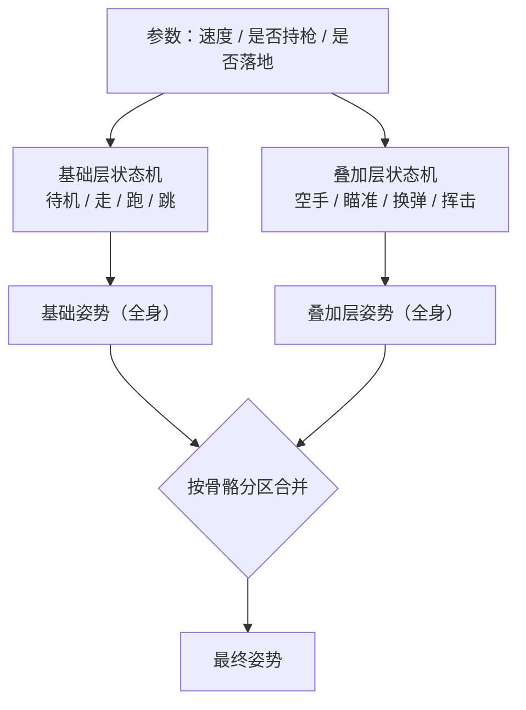

> [[Notes/动画系统/索引|← 返回 动画系统索引]]

# 分层状态机与骨骼分区

> [!todo] 本篇核心问题
> Full Body / Upper Body 双状态机如何分区并在最终姿势里叠加？

## 为什么需要解决这个问题

先回顾上一站的成果。角色要一边走路一边开枪，做法是：走路动画跑完整全身，再把开枪动画的**上半身**盖到它上面，腿部不参与覆盖——这就是按骨骼 Mask 混合，[[Notes/动画系统/动画播放与混合/按骨骼混合与Mask|按骨骼混合与 Mask]] 已经把它讲透了。

（先钉死一个词：这里的"**骨骼（Bone）**"指的是骨架里的一根根关节，一根骨骼就是一个带原点、带朝向的坐标架，没有长度也没有粗细——游戏里"骨头的长度"其实存在子关节相对父关节的偏移量里。不熟悉的话先看 [[Notes/动画系统/角色资产与骨骼基础/骨骼的本质：从骨架到 Skeleton 资产|骨骼的本质：从骨架到 Skeleton 资产]]。）

能跑起来，但立刻撞上第二个问题，而且它比第一个更难缠：

**上半身的动作不止一个。** 角色可能空手、持枪瞄准、换弹、近战挥击——这些动作之间也要来回切。而下半身的动作是另一套：待机、走、跑、跳、蹲行。**两套切换逻辑毫不相干**：换弹什么时候结束，取决于动画播完没有；跑步什么时候开始，取决于玩家推杆。把它们塞进同一个状态机，你会得到这样的状态表：

```text
待机·空手      待机·瞄准      待机·换弹      待机·挥击
走·空手        走·瞄准        走·换弹        走·挥击
跑·空手        跑·瞄准        跑·换弹        跑·挥击
跳·空手        跳·瞄准        跳·换弹        跳·挥击
```

4 个上半身状态 × 4 个下半身状态 = **16 个组合状态**，而且**每一对之间的转移都得单独写一遍**——"跑·空手 → 走·瞄准"和"跑·瞄准 → 走·空手"在你的状态图上是两条完全不同的连线，哪怕它们在做同一件事。再加一个动作就翻一倍；策划随口说一句"再加个蹲"，你就得重画整张图。

这就是组合爆炸。真正的病根是：**两个本来无关的维度，被强行塞进了一个状态空间**。上半身切不切换，和下半身切不切换，本来可以各管各的。

**分层状态机（Layered State Machine）** 就是把这一个平面状态机拆成几个互不干扰的状态机——**姿势（Pose）** 就是此刻全身每根骨骼各自的变换，一份姿势就是一副骨架当前的样子。本篇要回答两件事：拆完之后，几份姿势怎么叠成一份，以及**骨骼该按什么规则分给各层**。

## 直观理解：两个人各管一半的乐队

用乐团来打比方。

一个状态机，就像**一个指挥要盯全团**。现在你要求鼓手（下半身）按 4 拍走节奏，同时小号（上半身）随时按指挥的另一个手势切换曲子。如果只有一个指挥、只有一份总谱，他必须为"鼓手打第几拍 × 小号吹哪支曲"的每一个组合，预先写好一份单独的乐谱——这就是上面那 16 个状态。

分层之后，改成**设两个指挥**：

- **基础层指挥（Base Layer）** 只盯鼓和低音，谱子上写的是节奏和行进，不管旋律；
- **叠加层指挥（Override Layer）** 只盯小号，谱子上写的是旋律，并且明确规定**"我绝不改鼓的节奏"**。

两个人各看各的谱、各管各的人，**谁切换都不会卡住对方**。合奏时怎么保证不打架？靠一条极简的规矩：**谁的乐器谁负责**——小号的声音覆盖上去，鼓的声音照旧保留。

这条"谁的乐器谁负责"的规矩，就是**骨骼分区**。分层状态机看着像个架构概念，其实落到底只有一句话：**每层跑自己的状态机求出一条完整姿势，最后按骨骼归属把上层的结果盖到下层上去——盖，用的正是上一站的 Mask**。



数据流位置：本篇站在动画链路**「状态机 / 混合」这一站的上层**。上一层（[[Notes/动画系统/动画状态机与动画图/动画图：节点与求值序|动画图：节点与求值序]]）回答"一张图里的节点按什么顺序求值"，本篇则把一个图推广成**几条并行的求值线，最后汇成一条**。输入是玩家和玩法参数，输出是一份完整的最终姿势，交给后面的 IK 与蒙皮。

## 核心机制

### 层的两种角色：基础层与叠加层

一个分层配置里，**只有一个基础层，其余都是叠加层**。

**基础层（Base Layer，也叫 Full Body Layer）** 负责全身——它自己就是一条完整姿势的生产线，输出一份**全身都不缺的姿势**（所有骨骼都有值）。移动、跳跃、受击倒地这类牵扯重心和脚步的动作都在这一层，因为全身都要跟着动。

换句话说，**基础层的输出和"没有分层时"的状态机输出是同一种东西**，是一份可以直接交给蒙皮的完整姿势。叠加层则不是——它输出的那份姿势天生缺一块，离开基础层就没法用。

**叠加层（Override Layer）** 比如上半身层，也输出一份姿势，但它只对**自己负责的那部分骨骼**有发言权，别的地方一律听基础层的。

关键的一步是合并。合并的规则一句话：**逐骨骼地挑**——这根骨骼归叠加层，就用叠加层的值；归基础层，就用基础层的值；在地带交界处，按过渡带宽做个混合（上例中"腰"的过渡带就是几根脊柱骨，层权重取 0 和 1 之间的值）。下例中"这根骨骼归谁管"用的是骨骼在数组里的位置——**下标**。

```cpp
// flags: -O0 -g

// 叠加层的权重曲线：0 = 完全听基础层，1 = 完全用叠加层
// 腰部过渡带上取中间值，曲线越缓过渡越软
float LayerWeight(int boneIndex);

// 把叠加层盖到基础姿势上：逐骨骼挑，边界处混合
void ApplyLayer(Pose& base, const Pose& overlay) {
    for (int i = 0; i < base.BoneCount(); ++i) {
        float w = LayerWeight(i);
        if (w <= 0.f) continue;         // 这根骨骼根本不归上层管

        // w == 1 是硬覆盖（上半身），0 < w < 1 是交界处的过渡（腰）
        base.Bones[i] = Blend(base.Bones[i], overlay.Bones[i], w);
    }
}
```

这里就是上层与 Mask 的连接点：**`LayerWeight` 本质上就是一张 Mask**，只不过它不只有 0 和 1，还允许中间值。逐骨骼怎么加权、旋转分量为什么不能直接平均（要 Slerp），[[Notes/动画系统/动画播放与混合/按骨骼混合与Mask|按骨骼混合与 Mask]] 已经讲过，本篇不再重复。所以可以这样记：**分层状态机等于"每个层各自跑一套状态机"，再在出口处接一个 Mask 混合**——「分层」是新增的部分，「混合」是复用的旧零件。

### 求值顺序：为什么基础层必须先跑

合并需要"基础姿势"当输入，所以顺序是死的：**基础层先求值，叠加层后求值，最后合并**。

顺序反了会出什么事？如果让叠加层先跑，它拿不到基础姿势，只能在**自己的默认姿势**上做混合——而所谓的默认姿势，就是骨架资产里那份**参考姿势（Reference Pose）**，也就是建模时角色摆的那个基准姿势，常见的就是双臂水平张开的 T-Pose。于是腿部的姿势根本不由基础层决定，而是**退回 T-Pose**。画面上就是：上半身开枪正常，但**角色双腿"咔"地立正站直，脚底板也不跟着走了**。这不是精度问题，是数据流断了一截。

层与层之间并列（两个叠加层谁也不依赖谁）时，先后无所谓；但**基础层永远是第一个**。

### 每层有自己的参数：分层的真正好处

层的价值不在于省了画图，而在于**两套逻辑彻底解耦**。具体落到三条：

- **各读各的参数**。基础层读速度、是否落地；叠加层读是否持枪、开火扳机、换弹进度。上半身层永远不需要知道"速度是 300 还是 600"——那是下半身的事。
- **各自独立调试**。上半身姿势别扭时，只调上半身那层，下半身的整套状态机**一个字都不用碰**，也就不会把已经调好的脚步声和脚步节奏改坏。
- **各自的转移条件互不干扰**。"换弹播完了"这条转移，不需要任何条件去描述"此时我正在跑还是在走"——因为**状态空间里压根没有这个维度**。这就是组合爆炸被消掉的机制：不同层的状态数变成相加，而不是相乘——上面那张 16 格的表，分层之后塌缩成 4 + 4 = **8 个状态**，再多加一个动作也只是 +1。

### 骨骼分区：分界线画在哪

接下来是动手时必定要回答的问题：**哪根骨骼归哪一层？**

最常见的做法是**按层级子树切**：挑一根"分界骨骼"（行业里习惯叫 **spine 分界**，通常落在脊柱最下面一节，如 `spine_01`），**它和它的全部子孙归叠加层，它上面的祖先归基础层**。

为什么按子树切而不是一根根挑？因为骨骼是层级结构，**只要祖先归基础层，这条链的根就在基础层手里**——腰不动，上半身怎么转都在腰的上方晃，不会把整体位置带跑。反过来一根根挑，很容易挑出一组"祖先在下层、子孙在上层"的骨骼，那基本必然出问题（见下节的骨盆坑）。

还有一条**必须记住的硬规矩**：

> [!warning] 根骨骼、骨盆（Hips）必须由基础层驱动
> 根骨骼管整个角色的位置，骨盆是全身所有骨骼的祖先（腿从它分出去，脊柱也从它分出去）。它们归基础层，是"上半身层只管上半身"这句话能成立的前提。
>
> 一旦上半身层也接管了骨盆，就会出现那个很吓人的现象：**角色一边走路一边开枪，人却在整体飘移、或者朝向莫名其妙地转**——因为**骨盆是整棵树的老大**，它的变换会传给全身，包括那两条本该由基础层驱动的腿。上层给骨盆加的那点"瞄准的小幅度扭动"，被放大成了**全身的位移和旋转**。

交界处（腰）通常留一条 1~3 根骨骼宽的过渡带。带太窄，上下半身之间会有肉眼可见的"折痕"，腰像被掰断；带太宽，上半身的动作会渗到腿上，走路看起来"半身不遂"。这也解释了为什么分界骨骼一般不选脊柱最上面那节——腰需要一点缓冲空间。

### 层数：两三层就够

实践里大多数角色用 **2~4 层**：基础层承包移动，上半身层承包战斗动作，再留一个**叠加层专门放呼吸、受击抖动、武器后坐**这类"整段叠加上去的偏差"。再多就属于架构奢侈了——每多一层，就多一整趟图求值，也**多一个可能的两层重叠、边界穿帮的地方**。

关于层数带来的开销，属于"知道即可"：每层都是完整的动画图求值，层数增加时开销近似线性增长。真到性能吃紧，也基本轮不到在这里省——**先压缩动画数据、再做骨骼 LOD 更划算**（见 [[Notes/动画系统/扩展话题速览/动画性能速览：压缩 LOD 与并行求值|动画性能速览]]）。

## 边界与坑

- **两层都想控制同一根骨骼** → 结果**取决于求值顺序，不由你决定**，表现是"这个部位的动作时有时无、换台机器上就变了"。排查办法：把所有层的骨骼集合打印出来做交集，交集中除了腰部过渡带那几根，不应有别的骨骼。
- **层的 Mask 跟骨架对不上**（换了骨架、重定向到另一个角色之后）→ **上半身动作错位**，或者干脆整个上半身没反应——Mask 是按骨骼名或索引去圈骨骼的，名字对不上，圈出来的集合就是空的或错的（这个坑和 [[Notes/动画系统/动画播放与混合/按骨骼混合与Mask|Mask 篇]]是同一个，换骨架后务必重验每层的骨骼清单）。
- **上下半身的动画相位不同步** → 走路时上半身在瞄准，脚步和上半身那点自然晃动**不同拍**，看起来像两个人拼起来的。多数情况下这不是 bug，是"本来就没人要求这两段动画对齐"；但**当玩法要求动作必须在固定节拍上咬合**（比如跑动中开枪，枪口起伏必须跟着脚步沉浮走）时，就需要额外做同步——那是下一篇的主题。
- **层数失控** → 调试成本随层数上涨，而且"到底是谁把这块骨头改成这样的"会变成排查噩梦。

（"上层接管骨盆"那条，上面「骨骼分区」的 [!warning] 已经展开过，不再重复。）

## 参考实现（UE）

| 引擎 | 对应模块/数据结构 | 具体体现 |
| :--- | :--- | :--- |
| UE | `FAnimNode_LayeredBoneBlend` | 就是本篇"叠加层盖到基础姿势上"的落地节点：`LayerSetup` 数组里每个元素带一个 `FBranchFilter`（**一根骨骼名 + `BlendDepth`，沿层级子树往下圈**——正是上文的"按子树切"），另有一个 `FInputBlendPose` 描述腰部过渡带；`bMeshSpaceRotationBlend` 决定旋转混合是否在参考骨架空间做（避免上下层朝向基准不同导致的扭转） |
| UE | 动画图编辑器资产（`UAnimGraphNode_StateMachineBase` / Sub-Graph） | 分层在资产层面对应"图里并列摆几个状态机、再用 Layered Blend 收口"。每个状态机节点内部维护自己独立的状态与转移表，与本文"每层各读各的参数"一致。见 [[Notes/UE/第四阶段-客户端运行时层/UE-AnimGraphRuntime-源码解析：动画图与BlendSpace\|UE 动画图与 BlendSpace]] |
| UE | 姿势容器 `FCompactPose` | 逐骨骼"挑一个值"操作的载体；层合并就是在同一个 Pose 上按权重改写一部分骨骼，见 [[Notes/UE/第八阶段-跨领域专题/UE-专题：动画评估管线\|UE 动画评估管线专题]] |

## 一句话总结

分层状态机解决的是一件事：**当两套切换逻辑彼此无关时，别把它们乘进同一个状态空间**——给每层一个独立的状态机和自己的一套参数，基础层先跑出完整姿势，叠加层再按骨骼分区（根部与骨盆必须留给基础层）把自己的结果盖上去，而"盖"这一步用的还是上一站那个 Mask。

---

**下一篇**：[[Notes/动画系统/动画状态机与动画图/动画同步：过渡时机与步伐对齐|动画同步：过渡时机与步伐对齐]]——分层解决了"两套逻辑各管各的"，但也埋下了一个新麻烦：两个层各放各的动画，时间线彼此无关，跑动中开枪就会看出上下一颠一颠对不上拍。下一步看怎么让它们在切换和运行时"对上步伐"。
