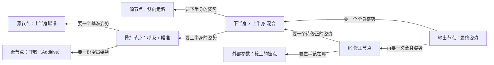

> [[Notes/动画系统/索引|← 返回 动画系统索引]]

# 动画图：节点与求值序

> [!todo] 本篇核心问题
> 动画图节点如何组织？最终姿势沿什么拓扑序求值、Pose 如何传递

## 为什么需要解决这个问题

上一篇[[Notes/动画系统/动画状态机与动画图/动画状态机：状态与转移|《动画状态机：状态与转移》]]解决的是"**当前该放哪段动画**"：它手里攥着一个状态，输出一段基础动画。可一位真实角色的最终姿势**从来不是"一段动画"**。

看一个很普通的镜头：角色端着枪侧向移动。你拆开它的最终姿势会发现，里面叠着好几个人各自负责的东西——

- 状态机选出的**基础动画**：播放"侧向走路"，给出全身的大致姿态；
- **下半身**单独跟一份步伐数据走，保证脚步和地面速度对得上；
- **上半身**被一份瞄准数据拽着，胸口和手臂朝准星方向；
- 在这一切之上还压着一条**呼吸**：幅度只有一两度，但一旦漏掉，角色就"僵"得像塑料模特；
- 最后，**左手要精确贴在枪上**——这件事没法靠上面的叠加碰巧做对，必须有一步专门"反推手臂该摆在哪"的修正。

关键问题不是"这五件事各自怎么做"，而是：**它们谁先谁后、谁盖在谁头上？**

顺序不是风格问题，是**结果对错**的问题。把呼吸叠在下半身之前，它会被步行数据抹掉一半，角色该有的起伏没了；把瞄准叠在 IK 之前，左手先被拽到枪上、再被瞄准层整体拉偏，手就从枪上滑开了。可这套顺序又不能写死——换个角色、换把武器、甚至同一角色的不同武器槽位，层的数量和顺序都不一样。

所以硬编码一条 `走路 → 呼吸 → IK` 的流水线是走不远的。真实需求是：**让策划／美术能在编辑器里自己拼这张顺序表**，而运行时只负责按这张表把姿势算出来。承载这件事的结构就是**动画图（Animation Graph）**——一张由节点和连线组成的有向图，姿势沿着连线流，最后汇到一个出口。

## 直观理解：一个反向追问的流水车间

用一条真实装配线打比方，但注意它和普通流水线是**反着转**的。

车间里摆着一堆工位，每个工位面前贴着一张说明牌，牌上写的都是同一句话：

> **"给我若干半成品，我还你一个半成品。"**

这句话是整个动画图的宪法。采样工位递进来一串参数（哪段动画、播到第几秒），递出去一个姿势；混合工位收两个姿势和一个 0~1 的权重，递出去一个姿势；IK 工位收一个姿势和一只目标手的位置，递出去修正过的姿势。**没有任何工位挑食**——正因为每个工位吃的和吐的都是同一种东西（姿势），它们才能任意串联、任意换位，甚至可以重复用同一个工位的产物。这张"所有工位输入输出同类型"的性质，是动画图敢叫"图"而不是"一条固定的线"的全部原因。

第二个设定：**最终出口只有一个**。整条线的最末端站着质检员，他手里是最终要交付的姿势，而半成品仓库（那些采样工位）有几十个，绝大多数在中途就被合并掉了。

于是**车间是按订单倒着跑的**：



质检员先问"谁给我这个全身姿势"，被问到的混合工位说"我要下半身和上半身各一份"，再往上问……**需求一层层往上游传，半成品再一层层往下游回**。这就是本篇的核心：**求值是从输出节点出发、沿着连线逆流回溯的**。

顺手就能看出这张图的一个好处：右上角那个"呼吸"工位，是回溯到"叠加节点"时才被点名的。**假如某个分支根本没接到订单流里，它这一帧连开工都不会开工**——图里画着它，但它不花钱。

数据流位置：本篇处在动画链路中**"裁决"与"混合"之间的那一站**——上游是状态机（它决定往哪个源节点喂参数），下游是混合、IK 与[[Notes/动画系统/蒙皮与骨骼网格/蒙皮矩阵：从骨骼姿势到顶点变形|蒙皮矩阵]]。本篇不生产姿势，它决定的是"**这一帧会有哪些姿势被算出来、以什么顺序合成一个**"。

## 核心机制

### 节点的本质：姿势进，姿势出

先说清楚"姿势"这个反复出现的词。一根骨骼这一瞬间的朝向和位置，叫做它的变换（见[[Notes/动画系统/旋转与变换基础/变换层级与复合变换#局部变换长什么样：一个三分量结构体|变换层级：局部变换是什么]]）；**整个骨架所有骨骼的变换打包在一起，就是一份姿势（Pose）**。可以把姿势理解成一张表：行是骨骼，列是变换。以后说"一个节点输出一个姿势"，意思就是"它交出一整张这样的表"。

动画图里的节点，全部遵守同一个约定：

```cpp
// flags: -O0 -g

// 所有节点共享的接口：吃若干姿势（加上节点自己的参数），吐一个姿势
struct AnimNode {
    // 上游节点，在图中是"输入连线"；数量随节点类型而变
    std::vector<AnimNode*> Inputs;

    // 每帧被下游"要"的时候调用一次：把输入拉齐，算出自己的输出
    virtual Pose Evaluate(const EvalContext& ctx) = 0;

    // 本帧是否已经算过 —— 共享分支只算一次的关键，下文展开
    bool  bEvaluatedThisFrame = false;
    Pose  CachedPose;            // 代价：每个节点都要持有一整份姿势
};
```

按"它拿参数做什么"来分，日常在编辑器里拖出来的节点其实只有几种角色，而**每一种都能用上面那句宪法解释**：

- **源节点**：不接收姿势输入，只接收参数（哪段动画、播到第几秒、播放速率）。它去[[Notes/动画系统/动画数据与采样/按时间取姿势：帧查找与插值|按时间取姿势]]，吐出一份姿势。图里所有姿势的源头都在这里。
- **混合节点**：接收两路或多路姿势加一组权重，按每根骨骼加权平均，吐一份。这是[[Notes/动画系统/动画播放与混合/姿势混合：加权与跨渐变|姿势混合]]那套规则在节点里的封装——注意它逐骨骼还要区分旋转用 Slerp、位置缩放用 Lerp（见[[Notes/动画系统/旋转与变换基础/四元数插值：Slerp与归一化#Slerp：沿大圆弧，匀速|Slerp 沿大圆弧匀速]]）。
- **状态机节点**：外观上也是一类节点，但它内部装着一整个小世界——若干状态、若干转移、当前活跃状态。**对外它只是"吃参数、吐姿势"的黑盒**，这正是状态机能被当积木嵌进图里的原因。
- **修改节点**：接收一份姿势，就地改造它——IK 修正、挂点／骨骼变换、曲线驱动的姿态微调都属于这一类。它不改"骨骼数量"，只改"某些骨骼的变换"。
- **输出节点**：整张图的唯一终点。它不做计算，只是把上游的姿势交给运行时，作为这一帧的结果。

注意这个分类只描述了**节点的角色**，没有描述"图长什么样"。图长什么样由连线决定，而连线可以任意组合——这也是为什么同一个引擎里能长出千奇百怪的动画图。至于"图该怎么分层组织、状态机该嵌在哪一层"，属于[[Notes/动画系统/动画状态机与动画图/分层状态机与骨骼分区|分层状态机与骨骼分区]]的内容，本篇只管**已经连好的图怎么算**。

### 求值序：从唯一的出口往上拉

现在来看整篇最重要的那条认知。

如果把图当成"数据从中流过"的管道，最自然的想法是**从源头往下推**：所有源节点先算，算完喂给下游，下游再算……排出所有节点的先后顺序（这就是拓扑序），挨个执行。

可是回到车间的比喻：源头有几十个，出口只有一个。从源头推，意味着你**默认每个源头这一帧都要开工**。但图是活的——策划把某个分支从输出节点上摘掉了、状态机切到了一个不走这条分支的状态、某个混合节点的权重被压到 0，那个分支上的源节点就在**白算**。一份姿势是几百根骨骼的变换，白算一次不便宜。

所以真实实现是反过来的：**从输出节点开始，递归地向上游索要输入**。这套做法叫 **pull-based（拉取式）求值**——下游不等着上游推，而是主动"拉"。

```cpp
// flags: -O0 -g

// 拉取式求值：出口主动向上游索要输入，递归回溯
Pose Evaluate(AnimNode* node, const EvalContext& ctx) {
    // ① 已经算过就直接交货 —— 见下一节"共享节点只算一次"
    if (node->bEvaluatedThisFrame)
        return node->CachedPose;

    // ② 先向上游逐个索要输入：这一步天然把依赖关系排好了
    std::vector<Pose> ins;
    for (AnimNode* up : node->Inputs)
        ins.push_back(Evaluate(up, ctx));

    // ③ 自己的活：源节点去采样，混合节点去加权，IK 节点去修正……
    node->CachedPose          = node->Combine(ins, ctx);
    node->bEvaluatedThisFrame = true;
    return node->CachedPose;
}

// 一帧的起点：整张图唯一的出口
Pose EvaluateGraph(AnimGraph& g, const EvalContext& ctx) {
    return Evaluate(g.OutputNode, ctx);
}
```

这段二十行的骨架里有三件事值得停下来看：

**第一，求值顺序不用你排。** 递归本身就是顺序：`Evaluate` 想算自己，必须先拿到所有输入；想拿输入，就得先把上游算完。**"从输出节点回溯"这条路走出来的顺序，就是这张图的一个合法拓扑序**，而且只包含真正用得上的那些节点。如果用"从源头推"，你得先做一次完整的图遍历来排顺序，还得额外判断哪些节点是活的——这正是 pull 比 push 省事的地方。

**第二，没连上的分支一分钱不花。** 回溯只会走到"被输出节点间接依赖"的节点。图里挂着一个试验性的分支？只要它没接到活路上，这一帧它就是个摆设。这条性质直接解释了调动画时常见的现象：**接上一个很重的分支，帧率会明显掉，因为它的整条上游链这一帧真的被算了一遍**；而把一个分支从活路上摘下来（比如状态机切到了不走它的状态），开销会立刻降下去。这意味着**图的连线拓扑和每帧开销是一一对应的**——调节点参数（哪怕把权重调到 0）不会让分支省钱，改连线才会。

**第三，方向和骨骼层级是反的。** 这个对比值得单独记住：

| | [[Notes/动画系统/旋转与变换基础/变换层级与复合变换#层级遍历：世界变换是"从上往下"算的\|骨骼层级的世界变换]] | 动画图的求值 |
| :--- | :--- | :--- |
| 起点 | 唯一的**根**骨骼 | 唯一的**输出节点** |
| 方向 | 从根往下**推**（父级算完给子级用） | 从出口往上**拉**（下游向上游要） |
| 顺序由什么决定 | 骨骼树的父级关系 | 图的连线依赖 |
| 每一步在算什么 | 同一份姿势里，**骨骼之间**的级联 | 一张图里，**姿势之间**的合成 |

左边是"一份姿势内部"的算术，右边是"多份姿势之间"的算术——两者都会遍历一棵树／一张图，但一个自上而下、一个自下而上。**把这两个方向搞混，就是后面"求值顺序错误"那个坑的来源。**

### 节点缓存：共享分支只算一次

再看骨架里的第 ① 步。它看起来像个小优化，其实是**必须**的，因为图不是树——**一个节点的输出可以被多个下游同时用到**。

举个会真实出现的例子：某个"待机"源节点，既喂给一个混合节点去和走路混合，又喂给一个修正节点去做轻微的姿态偏移。两路都依赖它——于是它会出现在回溯路径的两个不同位置上。如果求值不做去重，这份待机姿势会被采样两次：采样一次要翻关键帧、做插值，几百根骨骼的工作量翻倍，而结果**一模一样**。更糟的是，源节点往往带着时间状态（"当前播放到第几秒"），两路被求值的先后不同，读到的可能是**略微不同的时间点**，合成出来的姿势在细节上对不齐——明明是同一次采样，两路却各自算出了细微不同的结果。

所以节点需要两样东西：一个**"本帧是否已求值"的标记**，一份**缓存下来的输出姿势**。骨架里 `bEvaluatedThisFrame` 和 `CachedPose` 就是干这个的。

**"本帧"三个字是这条优化的边界。** 缓存只在一次求值过程内有效，下一帧必须全部作废重算——因为参数变了、时间推进了，姿势也就变了。

这也是**为什么动画图必须能识别"共享"**：因为一旦某条链被两处引用，去重就从"优化"变成了"正确性"。

### 姿势缓存的代价：每个节点一份全身数据

上一节听起来是白赚的优化——但缓存不是免费的，它的账单是**内存**。

一份姿势是"每根骨骼一个变换"。几百根骨骼，一根就是一个四元数（16 字节）加一个位置和一个缩放（各 12 字节），**一根骨骼大约 40 字节**：200 根骨骼一份姿势 ≈ 8 KB。单个节点存一份还好，但一个真实角色的动画图动辄几十个节点——**8 KB × 40 个节点 = 320 KB，一个角色一帧的姿势缓存**。屏幕上若有几十个角色，这个数字直接变成几十 MB，而且每一帧都在读写它（带宽也是钱）。

于是实践里出现了几条分工明确的应对：

- **只缓存会被多处引用的节点**。大图里有一多半节点只有一个下游——它们算完就立刻被下游消费掉，输出不会再用第二次，缓存纯属浪费。这类节点可以"算完即走"，不占位置。
- **姿势以"引用／共享"的方式传递**。如果某个节点只是把上游的姿势原样转交（输出节点就是这样），那它交出去的应当是指向同一份数据的**引用**，而不是一次深拷贝——拷贝一份 8 KB 的姿势本身就有成本。
- **合并写、避免反复分配**。逐节点新建姿势对象会导致每帧几十次堆分配；工程上通常预分配一池姿势缓冲并复用它。

这三条合起来，就解释了一个新手容易困惑的现象：**为什么引擎里的姿势不是普通的 `std::vector<Transform>` 数组**。它得是一个特殊容器——要能表达"这份姿势是被共享的"、"这份姿势的这份缓存可以省掉"，还要控制分配。**拷贝一份姿势，可能就够贵了**，所以整个动画系统的接口都小心地避免无谓拷贝。

> [!note]- 想深究：姿势对象还可以更省
> 除了"共享引用"和"只缓存热点节点"，还有一条更激进的路线：**不把姿势存成"每根骨骼的局部变换数组"，而是把求值本身变成一棵表达式树**，到真正要用的时候（写蒙皮矩阵、做 IK）才逐骨骼按需算——这样中间结果根本不需要落成完整姿势。
> 这个方向属于内部实现细节，**不知道完全不影响调动画**；但它解释了为什么不同引擎的姿势对象长得差别很大。

### 一帧里的时机：动画图和蒙皮不在一个线程上

求值完成的姿势要送去蒙皮，最后上传给 GPU。它们的时机不一样：

**动画图求值通常在游戏线程上做**，因为它要读的参数（速度、是否开火、准星方向）都是游戏逻辑正在改的东西。**蒙皮计算常被丢给工作线程**——它只是"拿姿势里的世界变换去压顶点"，没有游戏逻辑依赖，天然适合并行。最后蒙皮结果打包上传 GPU。

这条链路解释了两件你会遇到的怪事：

- **"为什么改了参数，角色要慢半拍才动？"** 因为这一帧的图已经算完了，你的修改（大概率来自同一帧稍后的逻辑）要等下一帧的求值才被读到。
- **性能分析时该看哪个线程？** 动画图的耗时挂在游戏线程，蒙皮的耗时挂在工作线程。把两者搞混，你会优化错对象——详细的一帧分工见[[Notes/动画系统/求值管线/一帧动画求值管线|一帧动画求值管线]]。

**多线程求值**顺带提一句：图的不同分支之间**彼此独立**（它们只共享那些已经算好的上游姿势），理论上是天然的并行单位；但合并节点必须等**所有**输入就绪才能开工。所以并行粒度受图的"宽度"影响——话讲到这里为止，展开在[[Notes/动画系统/扩展话题速览/动画性能速览：压缩 LOD 与并行求值|动画性能速览]]。

### 图的形状决定了开销的脾气

把上面几条串起来，会得到一个很实用的直觉：

- **图很深**（一条长链，节点一个接一个串下去）：每个节点都要等上一个算完，**延迟叠加**，而且全局只有一处能并行。哪怕每个节点都很轻（比如一个只做微小姿态偏移的修正节点），几十个串起来，总开销也会变得可观。
- **图很宽**（很多条分支并行，最后汇进一个混合节点）：分支之间互不等待，**并行度高**；合并节点要等所有输入，但那份等待里各分支已经在同时干活了。

所以"多路并行混合"的图（宽）往往比"层层叠加修正"的图（深）更便宜。调图结构时，**把一个深链拆成并行分支再合并，常常比优化单个节点更有效**。

## 边界与坑

- **求值顺序错误：读到上一帧的姿势。** 如果某个节点依赖了"本帧还没被拉取到"的节点，它读到的只能是缓存里那帧的残留。表现是**某些姿势永远慢一帧**：角色拐弯时，瞄准的胸口比脚下的身体晚一拍；或者游戏最初的几帧姿势是空的、角色摊成 T 字，几帧后才正常。排查这类问题的入手点永远是"这个节点的上游有没有被真正接到活路上"。
- **环形依赖：递归直接跑不完。** 编辑器通常会在连线时就禁止成环，但**动态连图**（运行时按条件重建节点、或脚本改引用）绕过了这层保护。一旦 A 要 B 的姿势、B 要 A 的，拉取式求值会无限递归——表现是**卡死或爆栈**，而不是报出一个动画错误。改成环之前先想清楚数据流方向。
- **某个分支没产出有效姿势**。上游是空姿势（没接输入、采样失败、骨骼数量对不上）时，混合节点会拿到一份"没料的"输入。此时权重要么全部落空，要么总和不再为 1——**逐骨骼加权时就得处理除零**，否则得到 NaN，表现是顶点乱飞、模型整块崩掉或消失。归一化的细节见[[Notes/动画系统/动画播放与混合/姿势混合：加权与跨渐变|姿势混合：加权与跨渐变]]。防御方式很朴素：混合前剔除权重为 0 的输入；若有效权重总和为 0，直接原样返回基础姿势，别去算平均。
- **参数未初始化：开局一瞬间姿势不对。** 图的参数（速度、朝向、混合权重）在角色刚生成时都是默认值（多半是 0）。第一次求值读到全 0，会算出一份**谁都没想要**的姿势——比如两路混合权重都是 0、或者状态机还没收到"进入"的参数。表现就是"**进入游戏的瞬间角色姿势怪怪的，过几帧自己好了**"。这不是 bug 而是初始化顺序问题，值得在角色生成时就主动喂一帧真实参数。
- **权重为 0 的输入仍然被求值**。这一条和"没连上的分支不花钱"很容易被混为一谈，其实是两件事：**没连上 = 不会回溯到它，零成本**；**连上了但权重是 0 = 仍然会被回溯、被采样、被缓存，只是合成时乘了个 0**。想让一个分支真正不花钱，得把连线摘掉，光靠调权重不行。
- **共享链上重复求值的隐性浪费**。图不像树，一个节点的输出常常被多处引用。没有"本帧已算"标记时，这条链会被算第二遍——采样翻倍，而且带时间状态的源节点两路可能读到不同时刻，合成出细节对不齐的姿势。
- **骨架对不上：一份"零骨骼"的姿势混进图里**。两个分支连到同一个混合节点、但它们来自**骨骼数量不同的骨架**（换了 mesh、或者某条链上的骨骼被剔掉了）时，逐骨骼加权会在短的那份上越界，或者悄悄留下一堆没人负责的骨骼。表现和"姿势为空"类似：部分肢体不动、或者整块模型塌到原点。混合前确认两边骨骼数一致，是比除零兜底更前置的一道检查。

## 参考实现（UE）

UE 把上面这套机制拆成了"编辑器里的节点图"和"运行时的节点对象"两层，并把求值切成四个阶段——这正好是"拉取式求值 + 缓存"的一种工程化写法：

| 引擎 | 对应模块/数据结构 | 具体体现 |
| :--- | :--- | :--- |
| UE | `UAnimGraphNode_Base`（编辑器侧）→ `FAnimNode_Base`（运行时侧） | 编辑器里连的每个节点在运行时都有一个对应的节点对象；`FAnimNode_Base` 是所有节点的基类，就是本篇那句"姿势进、姿势出"的宪法。见 [[Notes/UE/第四阶段-客户端运行时层/UE-AnimGraphRuntime-源码解析：动画图与BlendSpace\|UE 动画图与 BlendSpace]] |
| UE | `FAnimNode_Base` 的四个阶段：`Initialize_AnyThread` / `CacheBones_AnyThread` / `Update_AnyThread` / `Evaluate_AnyThread` | 求值被切成"初始化 → 缓存骨骼索引 → 更新状态（本帧在播什么、权重多少）→ 产出姿势"四步，与拉取式求值天然契合：更新阶段大多只依赖节点自己，评估阶段才真正合成姿势。见 [[Notes/UE/第八阶段-跨领域专题/UE-专题：动画评估管线\|UE 动画评估管线专题]] |
| UE | `FAnimInstanceProxy` | 动画实例的"求值期代理"，持有节点链与本次求值的上下文；动画图不在游戏线程直接操作角色对象，而是通过这个代理在求值阶段访问——本篇"游戏线程求值、工作线程蒙皮"的落地形态 |
| UE | `FPoseContext` / `FComponentSpacePoseContext` | 就是本篇的"姿势对象"：前者是局部空间姿势（每根骨骼的局部变换），后者是组件空间姿势。**分成两个上下文这件事本身，就说明姿势是特殊容器而不是普通变换数组**——空间、骨骼数量、缓存归属都被它管着 |
| UE | 节点共用的数据结构 | 节点里持有姿势输入（`FPoseLink` / `FComponentSpacePoseLink` 之类的连线对象）与内部缓存姿势缓冲；共享分支的"本帧是否已算"由评估流程保证，见 [[Notes/UE/第四阶段-客户端运行时层/UE-Engine-源码解析：骨骼与重定向\|UE 骨骼与重定向]] |

一句话点评：UE 的四个阶段把"求值"进一步拆细了，但**骨架没变**——仍然是从唯一的输出节点出发、沿连线向上游索要、每个节点拿着自己的缓存算一次。差异只在"哪些工作放在更新阶段、哪些放在评估阶段"，这是工程上的空间／时间权衡。

## 一句话总结

动画图是一张"每个节点都吃若干姿势、吐一个姿势"的有向图，出口唯一而源头众多；因此求值是**从输出节点出发、沿连线向上游拉取**的——回溯走出的顺序天然就是一个只包含活节点的拓扑序，没接上活路的分支一分钱不花。共享分支靠"本帧已算"标记加姿势缓存只算一次，而代价是每个缓存节点都要持有一整份全身姿势——这也正是引擎里姿势必须是特殊容器、而非普通变换数组的原因。

---

**下一篇**：[[Notes/动画系统/动画状态机与动画图/分层状态机与骨骼分区|分层状态机与骨骼分区]]——图能按任意顺序把姿势叠起来，可"上半身一套、下半身另一套"这种需求需要的不是顺序，而是**分工**：同一个骨架上的不同骨骼，由不同状态机分别负责。下一篇看这件事怎么在图里落地。
