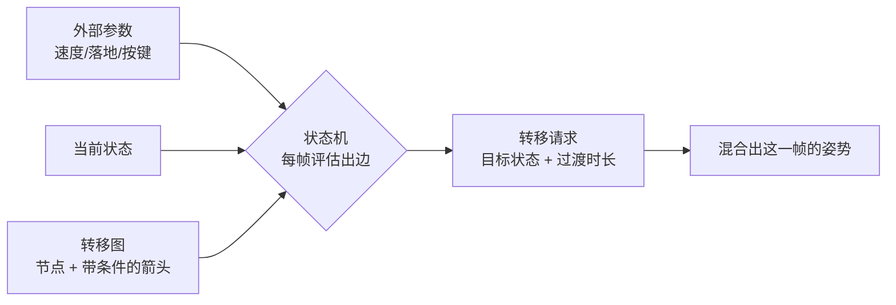

> [[Notes/动画系统/索引|← 返回 动画系统索引]]

# 动画状态机：状态与转移

> [!todo] 本篇核心问题
> 状态机为什么能管理动画切换？转移条件怎么判定，为什么有时切不动、有时乱跳？

> [!tip] 先回答一个更实际的问题：需要懂多深？
> 调角色动画时你对"状态机"的全部需求是：
> 1. **知道「状态 = 在放哪段动画、转移 = 满足什么条件就切」这两个概念**，以及为什么用它比自己写 if-else 强（图能一眼看全，策划也能参与讨论）。
> 2. **知道出边有优先级**——新加的转移不生效，九成是排在了后面被挡住。
> 3. **知道"切不动"和"乱跳"各有固定的几个原因**，能照着清单排查。
> 4. **知道转移自带一段过渡时长（Crossfade）**，这个参数纯手感，长了迟滞、短了生硬。
>
> 至于状态机内部怎么存、怎么遍历求值、中断抢占的细节规则，知道"有这回事"即可——真出问题时有调试工具和状态机图可看，不需要背下来。
>
> 另外，本篇是这本笔记里少数**不需要任何前置概念**的篇目：状态和转移都能用大白话讲清。只是它下游的机制要读起来顺，需要先知道两个词——**姿势**（一份"这一刻每根骨骼各自摆在哪"的完整描述，状态机选出来的正是它）和**骨骼**（一套逐级相接的坐标架，一份姿势就是每根骨骼一个变换）。这两个词一句话说不完，本篇用到的两处会给链接；真要先把地基钉死，读 [[Notes/动画系统/角色资产与骨骼基础/骨骼的本质：从骨架到 Skeleton 资产|骨骼的本质：从骨架到 Skeleton 资产]]。

## 为什么需要解决这个问题

到这里，动画链路已经能干活了：一段动画能在播放器里跑起来（[[Notes/动画系统/动画播放与混合/动画播放器：生命周期与时间模型|动画播放器：生命周期与时间模型]]），两段动画之间能靠混合平滑过渡（[[Notes/动画系统/动画播放与混合/姿势混合：加权与跨渐变|姿势混合：加权与跨渐变]]）。

但**"什么时候切、切到哪"这个决定，谁来做？**

最朴素的做法是 if-else：

```cpp
// flags: -O0 -g

if (isDead)          Play(Death);
else if (isAttacking) Play(Attack);
else if (!onGround)   Play(Jump);
else if (moveSpeed > 300) Play(Run);
else                 Play(Idle);
```

五条分支还行。可一旦加上"受击""翻滚""落地硬直""起跳预备""技能 A/B/C""蹲行"……**这段判断会膨胀到几百行嵌套**，而且立刻出现三个无解的痛苦：

- **改一处、崩一处**。你为了修"受击后该回到 Idle"动了第三行，结果把翻滚的返回逻辑弄坏了——因为所有分支挤在一个函数里互相看不见。
- **没人能看懂全貌**。策划问"角色从攻击切到死亡会经过哪几步？"你只能把代码从头读一遍，边读边在脑子里画。
- **状态是隐式的**。当前"在干什么"只体现为"上一帧调用了 `Play` 的哪一段"，没有地方能显示它、也拦不住非法的切换（比如从"死亡"直接切到"跑步"）。

**状态机（State Machine，简称 FSM / Finite State Machine）就是把这件事从代码里搬到数据里、从隐式变成显式。**

它只说两件事：**状态**——"当前在干什么"，每个状态绑定一段动画；**转移**——"满足什么条件就从 A 走到 B"。这两样东西画出来就是一张图：节点是状态，箭头是转移，**所有可能的切换路径一眼可见**。策划能指着图跟你讨论，程序改动也变成"加一个节点、加一条箭头"，而不是"在第 47 行再插一个 if"。

代价是引入了一个新东西要学——转移条件怎么写、多条件谁优先、切不动怎么查。这就是本篇剩下的内容。

## 直观理解：一块状态板，和一块每帧擦掉重写的草稿板

用一个贯穿全篇的比喻。

想象角色身上挂着一块**状态板**，板子背面永久印着一张**转移图**（从哪个状态能去哪个状态、各要什么条件），正面则写着一行字：**当前状态**。整块板子每帧只做一件事：

```text
① 读当前状态那一行字（比如 Idle）
② 找到它所有的出边，按顺序逐条问："你的条件成立吗？"
③ 第一条回答"成立"的箭头胜出 —— 把板子上的字改写成它的目标状态
④ 把草稿板擦干净，等下一帧
```

"当前状态"这一行字，是整台机器**唯一记住的东西**。角色的坐标、速度都变过几十次了，状态机完全不关心——它只看这一行字，以及草稿板上那些参数（速度、是否落地、有没有按下攻击键）。

草稿板上那些参数还有一层讲究值得现在点破：**它们全是从角色身上量出来的数字**，比如速度、是否落地、体力、距离——状态机只读不写。而像"攻击键刚按下的这一帧"这类一次性输入，写法上就是另一件事了（它要求"按下"这个动作本身被人看见并转告转移，而不只是问"键现在是不是按着"），细节见 [[Notes/动画系统/动画状态机与动画图/动画图：节点与求值序#节点的本质：姿势进，姿势出|动画图：参数怎么被送进图里]]。

由此立刻能推出两个反直觉、但每天都会撞上的性质：

- **同一帧里多条出边的条件都成立时，只有第一条算数**——"出边"就是画在某个状态上的**箭头**，每条箭头都是"从这里出发的一条候选转移"，顺序就是它们的排列次序。这就是"我明明加了转移，为什么没生效"的头号原因。
- **条件在什么时候被采样，决定了你会不会切不动**。草稿板上的参数值是谁、什么时候写上去的，直接决定了条件是真还是假——如果写上去的是**上一帧的旧值**，你看到的就会是"明明满足了却不切"。

数据流位置：本篇处在动画链路的**裁决站**——采样站交上来的是"若干个候选姿势"，混合站能把这些姿势揉在一起，而状态机决定**这帧到底揉哪几个**。它的输入是三个东西：当前状态、这张转移图、以及一组外部参数；输出是一份**转移请求**（切到哪个状态、用什么时长过渡、从第几秒开始播），交给下一个环节去执行。它不动任何一根骨骼的姿势数据（每根骨骼该摆在哪，是[[Notes/动画系统/动画数据与采样/按时间取姿势：帧查找与插值|采样]]和[[Notes/动画系统/动画播放与混合/姿势混合：加权与跨渐变|混合]]那两站算出来的），只决定"该放谁"——**这是在数据流上"发号施令"而不是"搬砖"的一站**。



## 核心机制

### 状态机由什么构成

先看一眼这台机器在数据层长什么样，只列必需的四样。先给结论：**一台状态机就是一张"带条件的箭头表"**——每个状态带一串"在什么条件下去哪"的箭头，外加一个"现在站在哪"的编号。这四样都有，状态机就能跑：

```cpp
// flags: -O0 -g

struct Transition {
    int   TargetState;      // 箭头指向哪个状态
    int   StartTimeMs;      // 从目标动画的第几毫秒接上（一般填 0 = 从头播）
    ConditionList Conditions; // 条件：若干条判断的组合，例如 速度 > 300、已落地、攻击键按下
};
// 上面刻意没放"过渡时长"：过渡是混合站的活，状态机只负责说切到哪。
// 时长跟着转移走，是为了让画两条从 A 出发、条件不同的箭头时，
// 能给它们各自配一段手感不同的过渡——放哪层完全看实现（见 [参考实现] 的表）。

struct State { ... };      // 见下
struct StateMachine { ... };

// 一个状态在数据里是"三件事"：
//   1. 一个编号   —— 转移的 TargetState 指向的就是它
//   2. 一个入口   —— 它吐出来的姿势从哪来，多数情况就是"某段动画"；
//                    这个入口也可以是另一台状态机（见下面「复合状态」）
//   3. 一串出边   —— 从它出发的箭头，数组下标即优先级
// "循环""播放速率"这些字段不属于状态机，属于入口那一头（播放器 / 采样站）。
```

四样东西各有明确职责，缺一样都会立刻出问题：

| 概念 | 回答的问题 | 弄错的后果 |
| :--- | :--- | :--- |
| **状态（State）** | 角色现在"在干什么"？ | 少一个状态，就有一种情况无处可去（某段动画永远放不出来） |
| **转移（Transition）** | 满足什么条件就离开这个状态？ | 条件写错 → 切不动或乱跳（下面两节） |
| **初始状态（Initial State）** | 进入这台机器时先站在哪？ | 没有它，角色在加载完的第一帧无姿势可放，会**闪一下 T-pose 或默认姿势** |
| **出边顺序（Priority）** | 多个条件同时成立时听谁的？ | 顺序错 → 最想走的那条永远被压住 |

（表里最后一行说的是`Priority`，代码里并没有这么个字段——**它就是数组的排列次序本身**。下面「纪律一」讲这件事。）

> [!note] 复合状态：状态里还能再塞一台状态机
> 状态里绑的不一定是"一段动画"，也可以**是另一台状态机**——这叫**复合状态（Composite State）**。它的价值在于把"细节"包起来：上层只关心"角色在战斗"，战斗内部还有 Idle / Attack / Dodge 的流转，切出去时整包一起换掉。分层状态机（见 [[Notes/动画系统/动画状态机与动画图/分层状态机与骨骼分区|分层状态机与骨骼分区]]）是它的进阶形态。本篇只需要知道"状态可以嵌套"这一件事。

### 为什么状态机适合这件事

把上面那句"状态机让所有切换路径显式可见"再说透一点，因为它正是状态机存在的理由。

**"角色在干什么"本来就是离散的、互斥的。**

速度是连续的——0.1、5.7、312.9 都合法，你不能按速度值去索引动画。但"角色处于哪个运动模式"是离散的：站着 / 走 / 跑 / 跳，**只能处在其中一个**。不可能既"在跑"又"在跳"——如果玩法真需要（边跑边射击），那要么合成一个新状态，要么用分层状态机把上半身单独管起来，而不是承认"两个状态同时成立"。有限个离散状态，配上"满足条件就换一个状态"，正好是状态机能表达的**有限组合**。

**更关键的是可视化带来的协作价值。**

if-else 版本的"所有切换路径"是隐式的：只有读完整个函数才知道角色可能从哪到哪。而状态机把它变成一张图之后，三件事同时变简单了：

- **讨论**：策划能直接说"这里要加一条从落地到翻滚的箭头"，不用翻译成代码；
- **排查**：角色卡住了，把运行时状态画在图上，一眼能看出它卡在哪个节点、哪条出边的条件没亮；
- **兜底**：没画出箭头的切换**根本不存在**——这等于自动帮你挡住了"从死亡切到跑步"这种非法跳转。

所以状态机不只是"组织代码的方式"，它是一份**关于角色行为的、可以给非程序员看的契约**。这也是为什么大多数引擎的动画系统里，它是一等公民而不是可选工具。

### 转移的判定：草稿板上的三条纪律

这一节是本篇的核心。上面比喻里的"每帧扫一遍出边"听起来很干净，但落到项目里，"为什么它不切"几乎全部来自下面三条纪律里被违反的那一条。

#### 纪律一：出边按顺序求值，第一条命中的赢

每个状态的出边是一个**有序列表**。每帧从第一条开始问，问到第一条条件成立的，就立刻切过去，**后面的不再检查**。

这个顺序是真的存在数据里的，不是编辑器里的排版：出边在数据里就是**一个数组**，"优先级"就是**数组下标**。所以它不需要额外的字段（代码里也没有 `Priority` 这个成员），调整顺序就是调整数组里元素的先后。

看看这个状态的真实排布：

```cpp
// flags: -O0 -g

// 某状态的出边列表（自上而下即优先级）
// 1. → Death    : HP <= 0
// 2. → Attack   : bAttackPressed
// 3. → Jump     : !bGrounded
// 4. → Run      : Speed > 300
// 5. → Idle     : Speed < 100
```

`Death` 排在最前，是因为"死了还要放攻击动画"是明显的 bug；`Attack` 排在 `Jump` 前，是因为原地按攻击键不该被判定成起跳。**顺序本身就是一条业务规则**，它不是实现细节。

现在你遇到"角色在跑步中按攻击键没反应"——排查思路就很具体了：不是条件写错，而是**上面有一条更早的出边把这一帧截胡了**（比如 `!bGrounded` 因为脚部 IK 的浮点误差偶尔为真）。把出边的当前命中情况打到日志或调试视图上，"谁截了胡"自己就跳出来了。

> [!warning] 最常见的自伤：新加的转移排在了后面
> 给一个已有状态追加出边时，绝大多数编辑器默认把新箭头**追加到列表末尾**。于是"我明明加了这条转移，条件也确实满足了"，但它前面那条老转移天天命中，新箭头永远轮不上。**加转移之后回头确认一次优先级**——这是本篇最省时间的一条建议。

#### 纪律二：条件在固定时机采样，采样的是"那一刻的值"

状态机不会实时监听条件变化，它是**每帧在一个固定时机**统一评估。这个时机很关键：

- 如果评估发生在**这一帧的参数已经更新之后**，那么"速度刚过 300"这一帧立刻就能切；
- 如果参数是更早（比如物理模拟后、输入处理前）写进去的缓存值，那么你拿到的其实是**上一帧的速度**，切换会整体晚一帧——晚一帧你感觉不到，但排查时常常因此把正确的条件误判成"没生效"。

由此得到排查"切不动"的**第一优先级动作**：**先确认条件里引用的那个变量，每帧真的有人在更新它。** 这是实战里最高频的原因——条件本身一字不差，但那个变量是三周前留下的返回值，早就不再刷新了，于是条件恒为假，表现是"这条转移像是根本不存在"。

转移请求发出之后的第二件事，是"什么时候生效"：

- 通常**立即生效**，新状态从混合的 0 时刻起步；
- 也可以配置成**等当前动画播到某个点**再切（比如等攻击挥完的 60%，或等脚落地）。那个"点"不是你自己挑的某一帧，而是动画自己报出来的一个**事件标记**——动画数据在时间轴上打的小旗子。这类"等关键点"的转移机制留到 [[Notes/动画系统/动画状态机与动画图/动画同步：过渡时机与步伐对齐|动画同步：过渡时机与步伐对齐]] 讲，本篇只需要知道"转移不一定立刻落地"。

#### 纪律三：有些条件永远等不到，有些来回满足

"切不动"剩下的原因基本都在下面这张清单里，按遇到频率排：

- **等一个永远播不完的动画**。条件写成"当前动画播完（has finished）"，但那个状态的动画被设成了**循环**——它永远没有"播完"这个瞬间，角色就永远困在里面。这是"死亡后无法重生""蓄力永远蓄不满"这类卡死的经典成因。
- **被冷却时间挡住**。很多实现给转移配了**冷却（Cooldown）**——切过去之后的一段时间内，这条转移不许再触发，防止 100ms 内来回切。冷却没走完时转移会被直接忽略，表现是"按下第一次生效，连按第二次没反应"。
- **条件引用了不存在的变量/参数**。改名、删参数之后遗留的条件会**静默地恒为假**（编辑器不一定报错），表现同样是"这条转移永远不生效"。
- **优先级被前面的转移挡住**（纪律一）。
- **参数没更新**（纪律二）。

对照这张清单排查，比盯着条件表达式本身有效率得多——因为**问题通常不在条件里，而在条件之外**。

### 振荡：条件在边界上打摆子

"切不动"的另一面是更扎眼的故障：**角色在走路和跑步之间疯狂闪烁**。

成因可以直接从纪律一的机制里推出来。假设你写了两条符合直觉的条件：

```text
Walk → Run : Speed > 300
Run  → Walk : Speed < 300
```

角色加速到 301：切进 Run。Run 状态里播放的跑步动画让角色提速，某个瞬间速度掉到 299（减速带、上坡、帧间抖动都会导致）——**上一帧刚得到的结论"我在跑步"，这一帧立刻被推翻**。于是切回 Walk；Walk 一放，速度又回到 301，再切 Run……

速度在 300 附近每抖一下，角色就换一次状态。因为**过渡时长通常只有 0.1~0.2 秒**（下面「转移的混合」一节会细讲），肉眼看到的是角色姿势在走路和跑步之间高频横跳——**画面像抽帧一样闪**，玩家会觉得"角色疯了"。

根因不是数学错，而是**系统的两个方向用了同一个阈值**：进入和退回的分界线重合，在分界线附近，任何微小噪声都会被放大成一次完整的状态切换。

修法是给两个方向**错开阈值**，也就是**滞后（Hysteresis）**：

```text
Walk → Run : Speed > 300      ← 进入阈值，高
Run  → Walk : Speed < 250      ← 退回阈值，比进入阈值低一截
```

中间那 50 的区间里，两条条件都不成立，当前状态就**稳定地保持住**——速度在 280 附近抖动时，它既不会进 Run 也不会回 Walk，角色安安静静地跑着或走着。

这个 50 就是**死区（Dead Zone，也叫迟滞带）**。它的取值是纯手感活：太小挡不住抖动，太大则响应迟钝（速度掉到 260 了还在放跑步动画，看起来像脚在打滑）。**实践上按"参数在一帧内的正常波动幅度"来定**，比如取 10~15%。

同一招能治一大类"反复横跳"，因为**凡是"某条件成立就过去、不成立就回来"的成对转移，都在边界上有同一个隐患**：

| 成对转移 | 故障表现 | 死区怎么留 |
| :--- | :--- | :--- |
| 速度 > 300 进 Run / < 300 回 Walk | 走路跑步高频闪烁 | 进入 300、退回 250 |
| 落地进 Land / 离地进 Jump | 贴地奔跑时角色不断抽跳 | 落地判定用持续帧数或速度上限，不只用一次碰撞 |
| 体力 > 0 进 Run / 体力耗尽回 Walk | 体力 0 附近反复切换 | 恢复阈值留一截（低于 20% 不许进 Run） |
| 距离 < X 进攻击 / > X 退出 | 在 X 附近原地抽搐 | 攻击一旦开始就锁住，退出条件只在动画播完后评估 |

> [!note]- 想深究：滞后在控制论里叫什么
> 带死区的双阈值开关在控制论里叫 **Schmitt 触发器**（施密特触发器）——一个电子电路，用正反馈把"模糊的输入"整形为"干净的两态输出"。它与状态机振荡的关系是"同一个问题的两种说法"，不读不影响你调动画。你要记住的只有一句：**成对的条件转移必须留死区。**

### 转移的混合：切换不是瞬间替换

"切到 Run"不等于"这一帧立刻换成跑步姿势"。如果真是这样，每次切换都会看到姿势**"啪"地跳一下**——这正是 [[Notes/动画系统/动画播放与混合/姿势混合：加权与跨渐变|姿势混合：加权与跨渐变]] 解决的问题，状态机只是把它的执行时机安排好了。

分工是这样的：纪律一、二、三管的全是**判断**——"该不该切、切到哪"；判断完之后，状态机只发出一份**转移请求**（切到哪个状态、用多长的过渡、从第几秒接上），真正的姿势替换交给混合站去执行。**状态机负责发号施令，混合站负责搬砖**——这就是裁决站和混合站的分工。

所以每条转移都会带一个**过渡时长（Transition Duration）**，在那段时间里，新状态的动画与旧状态的动画做一次 **Crossfade**（交叉渐变：旧姿势权重从 1 掉到 0，新姿势从 0 涨到 1）。

过渡时长怎么定，是一句手感结论：

- **太短（< 0.1s）**：切得生硬，像镜头硬切，动作有明显的顿挫；
- **太长（> 0.4s）**：操作迟滞——玩家松开方向键，角色还在往前滑着走完那段过渡，"按了键半天才动"。

典型的做法是**按转移的性质分档**：同方向的走→跑这类姿态接近的切换用 0.1~0.2 秒；Idle↔Attack 这类差异大的切换可以给到 0.25 秒；而**跳跃、受击这类要求"立刻响应"的转移，用接近 0 的时长**——玩家要的是那一瞬间的反馈。

### 边界与坑

- **死锁**：进入某个状态后，没有任何出边的条件能成立 → 角色永远卡在那儿。最典型的误配是"死亡状态被设成没有出边，但复活逻辑没接管"——表现为**角色死了就再也活不过来**。给每个状态都画好出口，是配置工作里的硬要求。
- **转移指向了不存在的目标**：改名、删状态、复制资产之后，箭头会指向一个空目标。表现是**切换时角色姿势保持不变，或退回初始状态**——排查时先看图的完整性，别去查条件。
- **自转移的语义不统一**：转移到自己（常用于"重新攻击一次"）在不同实现里可能是**重新播放**（重置时间从第 0 秒开始），也可能是**什么都不做**（当前状态等于目标状态，直接忽略）。误用它最常见的表现是**动画卡在第一帧**——因为时间被反复重置。要用自转移达成"重播"时，先确认实现语义。
- **条件里引用了不存在的参数**：恒为假，静默失效，表现是"这个转移永远不生效"。
- **同一帧连跳多级**：转移图里如果有一条长链（Idle → Jump → Fall 都同帧成立），有些实现会在一帧内一路走到底，于是**中间状态的动画一帧都没放**，看起来像凭空闪了一下。几乎所有实现都给这个行为设了上限（有的默认只允许 3 步），但**别把"一帧能连跳几级"当成设计工具**——真出现"一帧之内从 Idle 穿过 Jump 窜到 Fall"，先查这三条出边的条件是不是写得太松。
- **参数没更新**：见纪律二。这是"切不动"的头号原因，优先查。
- **过渡时长设成 0**：等价于硬切，姿势会跳变；除非是刻意要"瞬时反馈"，否则别用。
- **每帧求值成本**：每帧都要遍历当前状态的所有出边。单个状态机的开销并不大，但**状态多、条件里带复杂查询（求和、距离、曲线采样）时**开销会累积。做法是给参数做缓存、避免在条件里调昂贵的函数。这条知道即可，真到性能瓶颈通常也不是状态机先撞墙。

## 参考实现（UE）

| 引擎 | 对应模块/数据结构 | 具体体现 |
| :--- | :--- | :--- |
| UE | `FAnimNode_StateMachine` | 运行时状态机节点，对应本篇的 `StateMachine`：持有一份状态列表、`CurrentState`（那块状态板上的字）、当前状态已停留时长，以及这一帧有没有找到合法转移。它挂在动画图里，每帧评估后把"要不要切、切去哪"交给后续求值 |
| UE | `FBakedAnimationStateMachine`（`AnimStateMachineTypes.h`） | 资产的烘焙形态：`InitialState` + `States` + `Transitions` 三件套，正对本篇"初始状态 / 状态表 / 转移表"；运行时也是**最多一次处理 `MaxTransitionsPerFrame`（默认 3）条转移**，不是"一帧只评估一次"——这是本篇「边界与坑」里那条的准确说法 |
| UE | `FBakedAnimationState` 里的 `Transitions`（元素类型 `FBakedStateExitTransition`） | 某个状态的出边数组，源码注释写得很直白：**"already in priority order"**——优先级就是数组顺序，没有单独的优先级字段 |
| UE | `FAnimationTransitionBetweenStates`（`AnimStateMachineTypes.h`） | 本篇"带过渡时长的有向边"：`PreviousState` / `NextState` / `CrossfadeDuration` / `MinTimeBeforeReentry`（就是我们说的冷却一类的规则）/ `BlendMode` / `LogicType`。**过渡时长挂在转移上而不是状态上**，所以从同一个状态出发的两条箭头可以配不同的过渡手感 |
| UE | `FAnimNode_TransitionResult` | 转移条件在动画图里的载体：条件本身也是一棵小的求值节点树，其布尔输出决定这条边能不能走 |
| UE | 同步与过渡分组（`SyncGroup` / sync marker） | 让"等动画播到某个点再切"成为可能的一层，见 [[Notes/动画系统/动画状态机与动画图/动画同步：过渡时机与步伐对齐\|动画同步：过渡时机与步伐对齐]] 的参考实现 |
| UE | 状态机节点的求值 | `FAnimNode_StateMachine` 每次执行解析当前状态，必要时在旧状态与新状态之间做 **Blend（Crossfade）**：在 UE 里状态机节点自己就能完成这次混合，不需要额外的混合节点——也就是本篇那句"状态机只负责发号施令"的分工，在 UE 里被合并进了同一个节点 |

映射来源：[[Notes/UE/第四阶段-客户端运行时层/UE-AnimGraphRuntime-源码解析：动画图与BlendSpace|UE 动画图与 BlendSpace]]（`FAnimNode` 体系与动画图四阶段生命周期）、[[Notes/UE/第四阶段-客户端运行时层/UE-AnimationCore-源码解析：动画系统总览|UE AnimationCore 动画系统总览]]（状态机在这套动画抽象里的位置）、[[Notes/UE/第八阶段-跨领域专题/UE-专题：动画评估管线|UE 动画评估管线专题]]（状态机在整条求值链里何时被跑）。

## 一句话总结

状态机把"什么时候切、切到哪"从散落的 if-else 变成一张显式的图——**状态是"在放哪段动画"，转移是"满足什么条件就走这条带顺序的箭头"**；出边按优先级取第一条命中的，条件在固定时机采样，所以"切不动"几乎总出在条件之外（参数没更新、被优先级挡住、等一个永远播不完的循环动画），而"乱跳"是成对转移共用了同一个阈值，救法是给两个方向错开阈值留出死区；切换本身永远走一段可调时长的 Crossfade，那是纯手感参数。

---

**下一篇**：[[Notes/动画系统/动画状态机与动画图/动画图：节点与求值序|动画图：节点与求值序]]——状态机决定了"这帧该放谁"，但它只是图里的一个节点。这个姿势还要和瞄准偏移、呼吸叠加、后处理节点拼在一起，最终姿势沿什么顺序算出来，就是下一篇要理清的事。
