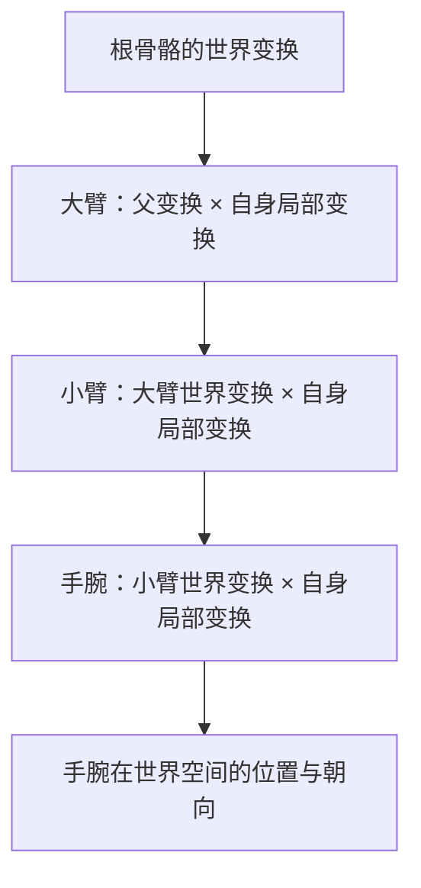

> [[Notes/动画系统/索引|← 返回 动画系统索引]]

# 变换层级与复合变换

> [!todo] 本篇核心问题
> 手腕的局部旋转如何级联成世界位置？`position × rotation × scale` 顺序为什么不能乱？

> [!tip] 先回答一个更实际的问题：需要懂多深？
> 调动画时你对"变换层级"的全部需求是：
> 1. **知道每一级骨骼存的是"相对父级的局部变换"**，引擎会把它们连乘成世界变换——你不需要手写这个连乘。
> 2. **知道 `T→R→S`（先缩放、再旋转、最后平移）的顺序是语法，不是风格**——写反了骨头会飞。
> 3. **知道缩放是个会"污染子级"的分量**——父骨骼一旦带非均匀缩放，整条子链都会歪。
>
> 至于矩阵怎么展开、为什么必须是这个顺序（推导部分），收在折叠区块里——不看完全不影响调动画。

## 为什么需要解决这个问题

想象一次很常见的调试：角色待机时手的位置不对，手腕穿进了大腿。你打开骨骼调试视图，看到手腕骨骼上挂着一个旋转值，心想"我把这个值改大一点，手就该往外抬"。

改完，手确实动了——但动的**方向和幅度完全不是你想的那样**，它还顺带把整条小臂带偏了。

原因在于：**你在手腕骨骼上改的那个数字，根本不是手腕在世界里的朝向。** 它只是一个"相对父级（小臂）的偏差"。手腕真正在世界里朝哪儿，取决于小臂朝哪儿、大臂朝哪儿、肩膀朝哪儿、直到根骨骼和角色的整体变换——**一路叠加下来的结果**。

这套"一路叠加"的规则，就是变换层级。它带来两个日常都会撞上的问题：

- **改一个局部值，世界位置的变化很难在脑子里推算**——因为它们之间隔着好几层父级。
- **叠加顺序不能随便定**。位置、旋转、缩放三个分量，谁先作用、父级的缩放要不要影响子级，顺序一乱，模型会以肉眼可见的方式崩坏：骨头错位、模型被拉长压扁、手飞到身体外面。

所以这一篇要回答两件事：**局部变换怎么一步步变成世界变换**，以及**这套复合的规则里，哪几条是绝对不能搞错的**。

## 直观理解：俄罗斯套娃 + 一个只会执行命令的搬运工

用一个贯穿全篇的比喻。

**每根骨骼都是一个套娃。** 它内部装着自己相对于父级的三个分量——"我离父级多远（T，平移）"、"我相对父级转了多少角度（R，旋转）"、"我被父级拉大/压小了多少钱（S，缩放）"。这三样东西合起来，叫做这根骨骼的**局部变换**（Local Transform）。

**父级的变换，是子级的"外部世界"。** 套娃摆在大套娃里：大套娃挪到哪儿、朝哪转，里面小套娃的**绝对位置和朝向就跟着变**，但小套娃自己记录的那三个分量**一个字都没改**。这就是骨骼层级最核心的性质——**改父不改子，但子会跟着动**。

现在来看执行顺序。想象有一个**只会照着命令单干活的搬运工**，命令单上写着三行字：

```text
① 放大   —— 按 S 拉伸
② 旋转   —— 按 R 转过去
③ 平移   —— 按 T 挪过去
```

他永远**从上往下照着做**，绝不跳步。这个"从上往下"的顺序，就是本篇要说清楚的核心。名字叫 **TRS**，因为缩写正是 **T**ranslation、**R**otation、**S**cale 里三个字母——注意读法：**描述顺序时习惯从右往左念**（先 Scale、再 Rotation、最后 Translation），因为矩阵写法是 `T · R · S`，**靠近点的先作用**。



数据流位置：本篇处在动画链路的**最上游、也是最底层的一站**——它不生产姿势，但**所有姿势数据的含义都由它定义**。前面三篇讲的旋转（[[Notes/动画系统/旋转与变换基础/四元数的几何意义与运算|四元数的几何意义与运算]]）和插值（[[Notes/动画系统/旋转与变换基础/四元数插值：Slerp与归一化|Slerp 与归一化]]）处理的是**单根骨骼**的旋转分量；本篇把多根骨骼串起来，回答"这些局部值如何级联成世界位置"。下一站 [[Notes/动画系统/蒙皮与骨骼网格/蒙皮矩阵：从骨骼姿势到顶点变形|蒙皮矩阵]] 就是拿本篇算出的世界变换去拉顶点。

## 核心机制

### 局部变换是什么：一个三分量的结构体

一根骨骼的局部变换（Local Transform），就是三个分量打包：

```cpp
// flags: -O0 -g

// 一根骨骼的局部变换：描述"相对父级"的三个分量
// 注意：不是世界空间的值，离开父级就没意义
struct Transform {
    Vec3 Translation;   // 相对父级原点的偏移
    Quat Rotation;      // 相对父级坐标系的朝向（用四元数存，理由见前几篇）
    Vec3 Scale;         // 相对父级的拉伸（通常是 1,1,1）
};
```

三个分量各有分工，**它们回答的是三个不同的问题**：

| 分量 | 回答的问题 | 常见取值 | 动画里谁在改它 |
| :--- | :--- | :--- | :--- |
| Translation | 我离父级原点有多远？ | 骨骼长度（如小臂 25cm） | 几乎不变（骨骼长度固定）；**根骨骼例外**，Root Motion 改的就是它 |
| Rotation | 我相对父级的朝向偏了多少？ | 每帧都在变 | **动画的主要产物**——关键帧、混合、IK 输出的都是它 |
| Scale | 我被拉伸了多少？ | `(1,1,1)` | 极少动；一旦非 1，就要当心（见下文"缩放的污染"） |

**关键认知：动画系统 99% 的工作量都在 `Rotation` 这一个分量上。** Translation 是建模时就定死的骨骼长度，Scale 基本不动。所以"调动画"这件事，本质是**每帧给每根骨骼的 Rotation 赋新值**，然后交给引擎去连乘。

这也解释了一个新手常见困惑：为什么我在动画里改的不是"手在世界里的位置"？因为**你手上能改的只有局部量**——想知道它最终去了哪，必须把整条链算一遍。

### 复合：父级的"外部世界"作用到子级身上

现在回答核心问题：**给定父级的局部变换、子级的局部变换，怎么算出子级在世界里的样子？**

先说结论，只有一句：**子级的世界变换 = 父级的世界变换 × 子级的局部变换**。

但"×"到底做了什么？这就是搬运工那三行命令单。把父级的变换作用到子级的局部变换上，规则是**按 T→R→S 的顺序执行**（读作"先 S、再 R、最后 T"）：

1. **先应用缩放**：父级的缩放，会被施加到子级上——子级离父级越远，被拉得越开。
2. **再应用旋转**：父级转了多少，子级整体跟着转多少。
3. **最后应用平移**：把转好、缩好的子级，挪到父级的世界位置。

为什么必须是这个顺序？关键在一句容易被忽略的事实：**数学上的旋转，永远绕"自己的原点"转**。平移一旦发生，子级就偏离了原点；此时再来一次旋转，**它偏离原点的这段距离也会跟着被转**——子级就不是在原地改朝向，而是绕父级画了个圈甩出去。

把两条路并排看就清楚了：

| 顺序 | 发生了什么 | 结果 |
| :--- | :--- | :--- |
| **S → R → T**（正确） | 子级还站在自己原点时先被缩放、被旋转——**转的是朝向，不是位置**；转完再被整体搬到父级那边 | 朝向变了、相对父级的距离没变 |
| **T → R → S**（错误） | 子级先被搬离原点，紧接着父级的旋转作用上来，**把这段偏移也一起转掉** | 子级绕父级画圈飞出去 |

用"低头"这个动作确认一遍：脖子（父）不动，头（子）要低头。正确做法是**头在自己的位置原地转**——位置不变，只有朝向变，脖子和头的距离保持原样。顺序错了，头会先跑到脖子上，然后被脖子带着**绕脖子的原点甩出去**。这就是模型上"骨头飞出去"的经典表现。

> [!note]- 想深究：为什么矩阵写成 T·R·S
> 因为矩阵是**从右往左作用**在点上：`T·R·S·v` 读作"先对 v 做 S，再做 R，最后做 T"。所以"写作 `T·R·S`"和"执行顺序 S→R→T"说的是一回事，只是读法方向相反。本篇只需要记住**执行顺序**：先缩放、再旋转、最后平移。

对应的代码骨架（表达结构，不求可运行）：

```cpp
// flags: -O0 -g

// 把子级的局部变换，挂到父级的世界变换上
// 顺序是语法不是风格：先缩放、再旋转、最后平移
Transform Compose(const Transform& parent, const Transform& child) {
    Transform out;

    // ① 缩放：父级缩放传递下来（细节见"缩放的污染"）
    out.Scale = parent.Scale * child.Scale;

    // ② 平移不能直接用子级的 Translation：
    //    子级的位置要先被自己的缩放影响，再经历父级的缩放与旋转
    out.Translation = parent.Translation
                    + parent.Rotation.Rotate(parent.Scale * child.Translation);

    // ③ 旋转：父子朝向直接复合（四元数乘法，先做的写右边）
    out.Rotation = parent.Rotation * child.Rotation;
    return out;
}
```

读这段代码，重点抓**第二行 `Translation`**——它是整个函数里唯一"反直觉"的地方：

子级记录的 Translation 是"离父级多远"，但这个"多远"**必须先用缩放量过一遍、再用旋转转过去**，最后才加上父级的世界位置。三个动作一个都不能少，顺序一个都不能换。

> [!note]- 想深究：为什么平移那一项要这么写
> 因为子级的 Translation 表达的是"在**父级坐标系**里，我从父级原点到我这儿的向量"。要把它变成世界空间的偏移量，就得把这个**向量**交给父级的变换处理一遍——先按父级缩放拉长（`parent.Scale * child.Translation`），再按父级旋转掰转方向（`parent.Rotation.Rotate(...)`），最后加上父级自己的世界位置。这也正是"顺序不能乱"的代数根源：**平移项里嵌着缩放和旋转**，它们天然要先算。不知道这一条，照样能调动画；但哪天要自己写一个变换函数，这里是最容易错的地方。

### 缩放的污染：为什么父级一缩放，整条子链都遭殃

上一节里，缩放看起来只是"顺手乘一下"，无害。但它有个**会传染的脾气**，而且是新手最容易踩、表现最吓人的一个坑。

**父级的缩放会继承给子级，并且逐级累积。** 骨骼长度本来是建模定死的（小臂 25cm），但父级一旦被放大 2 倍，子级这根"25cm"在世界里就变成了 50cm——**子级自己记录的数字没变，它在世界里的长度却变了**。

这带来两种典型事故：

- **非均匀缩放（三轴比例不一样）会让子级歪掉**。父级被拉成 `(2, 1, 1)`（只在 X 方向拉长），子级哪怕自己没做任何旋转，也会被**斜着掰**——因为"拉伸"和"旋转"在数学上不交换：先转再拉 ≠ 先拉再转。表现就是**骨骼变形、模型在拉扁的那个方向上诡异倾斜**。
- **累积缩放会让数值崩坏**。父级 2 倍、子级 2 倍、再往下 2 倍……没几级下来，位置数值就会冲到浮点精度不够用的量级，模型开始抖动、顶点乱飞。

**实用结论（记住这几条就够）：**

- **骨骼的 Scale 保持 `(1,1,1)`**。它本该是建模时烘进网格的东西，不该在动画里当参数用。
- **要做"模型整体放大"**，请用**根骨骼或角色 Actor 的缩放**，别去动中间层骨骼。
- **美术修改骨骼 Scale 后，务必检查动画表现**——很多"这个动画在别的角色上就崩了"的疑难杂症，根源就是某根骨骼上残留了一个非 1 的 Scale。

> [!warning] 缩放的继承在理论上是错的（但别改）
> 严格来说，"父级缩放直接传给子级"在处理**旋转 + 非均匀缩放**组合时会得到数学上不正确的变形——这也是渲染器里"Non-Uniform Scale + Rotation"警告的由来。
> **但你不用管这个**。工程上的处理方式是：约束美术不要用非均匀缩放，而不是在引擎里修正它。知道"这东西有限制、别碰"就够了。

### 层级遍历：世界变换是"从上往下"算的

最后回答一个动手时必然会问的问题：**这么多骨骼，引擎按什么顺序算它们的变换？**

答案是**从上往下**（父级先、子级后）——因为算子级需要父级的世界变换，父级没算完，子级就没材料。这就是一次树的**先序遍历**：

```cpp
// flags: -O0 -g

// 骨骼层级的世界变换传播：父级算完才能算子级
void UpdateWorldTransforms(Skeleton& skel, int rootIndex) {
    std::vector<int> stack{ rootIndex };

    while (!stack.empty()) {
        int i = stack.back();
        stack.pop_back();

        const Transform& parentWorld =
            (skel.bones[i].parent < 0)     // 根骨骼没有父级
                ? Transform::Identity()
                : skel.bones[skel.bones[i].parent].World;

        skel.bones[i].World = Compose(parentWorld, skel.bones[i].Local);

        for (int child : skel.bones[i].children)
            stack.push_back(child);        // 子级等父级算完，再入栈
    }
}
```

这段代码解释了两件日常会遇到的事情：

- **为什么改根骨骼（或角色整体位置）能带动全身**：因为所有子级的世界变换都是从根开始往下算的，根一动，整棵树全动。这正是 Root Motion 能让角色整体位移的机制基础（见 [[Notes/动画系统/动画播放与混合/RootMotion：动画驱动移动|Root Motion：动画驱动移动]]）。
- **为什么改一根中间骨骼，只影响它的子孙**：层级里的"分支"是独立的，改小臂不会影响另一条腿。

## 边界与坑

- **顺序反了**：`T→R→S` 是语法。写成"先平移再旋转"，子级会绕父级原点**画圈飞出去**（模型上表现为骨头错位、模型散架）。
- **父级缩放污染**：骨骼 Scale 保持 `(1,1,1)`；要做整体缩放就动根骨骼／Actor，别动中间层。
- **非均匀缩放 + 旋转 = 歪斜**：美术扫过非均匀缩放的骨骼后，务必检查动画——这是"同一套动画换个角色就崩"的高频元凶。
- **浮动误差累积**：层级越深，连乘的浮点误差越大。深层骨骼（如手指）的微小抖动常来源于此，量级通常可接受，但值得知道有这么回事。
- **缺失／重命名骨骼**：动画数据按名字或索引去匹配骨骼，层级对不上时，局部变换会退化成恒等（不动）或错位。存盘改骨骼名之前，先确认所有引用它的动画资产。
- **零缩放**：某根骨骼 Scale 为 0 时，它及其所有子级会被整个"压扁到不可见"——排查"模型某块不见了"时值得一看。

## 参考实现（UE）

| 引擎 | 对应模块/数据结构 | 具体体现 |
| :--- | :--- | :--- |
| UE | `FTransform` / `TTransform`（`Math/Transform.h`） | 就是本篇的"局部变换"三分量结构：`Translation` / `Rotation`（`FQuat`）/ `Scale3D`，见 [[Notes/UE/第二阶段-基础层/UE-Core-源码解析：数学库与 SIMD\|UE Core 数学库与 SIMD]] |
| UE | `FTransform::Multiply` / `operator*` | 复合的落地实现（内部即 `T·R·S` 顺序，并处理缩放传递）；`FTransform::Inverse` 用于把世界空间量反解回局部空间（IK／重定向常用） |
| UE | 参考姿势与骨骼层级 | 骨骼参考姿势以 `TArray<FTransform>` 存储，父级索引定义层级；世界变换沿链表向下传播，见 [[Notes/UE/第四阶段-客户端运行时层/UE-Engine-源码解析：骨骼与重定向\|UE 骨骼与重定向]] |
| UE | 后期求值中的变换传播 | 动画图求值完成后，姿势里各骨骼的局部变换沿层级组合出组件空间姿态，见 [[Notes/UE/第八阶段-跨领域专题/UE-专题：动画评估管线\|UE 动画评估管线专题]] |

## 一句话总结

每根骨骼只存"相对父级"的三个分量（平移、旋转、缩放），世界变换靠"父级世界变换 × 自身局部变换"逐级连乘得到；这个连乘的执行顺序固定为**先缩放、再旋转、最后平移**——顺序反了骨头就会飞——而缩放是会传给子级的传染性分量，所以骨骼上它该永远保持 `(1,1,1)`。

---

**下一篇**：[[Notes/动画系统/动画数据与采样/动画数据的本质：关键帧与采样|动画数据的本质：关键帧与采样]]——地基打完了（旋转怎么算、怎么插值、怎么级联），接下来看这些旋转值在磁盘和内存里究竟长什么样。
