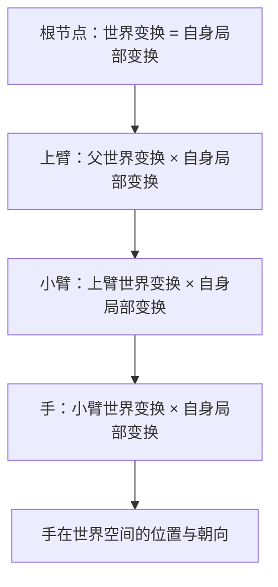

> [[Notes/动画系统/索引|← 返回 动画系统索引]]

# 变换层级与复合变换

> [!todo] 本篇核心问题
> 手腕的局部旋转如何级联成世界位置？`position × rotation × scale` 顺序为什么不能乱？

> [!tip] 先回答一个更实际的问题：需要懂多深？
> 调动画时你对"变换层级"的全部需求是：
> 1. **知道每个节点存的都是"相对于父节点的偏差"，不是它在世界里的绝对位置**，引擎会把这条链连乘成世界变换——你不需要手写这个连乘。
> 2. **知道 `T→R→S`（先缩放、再旋转、最后平移）的顺序是语法，不是风格**——顺序反了，抬个手手会绕着肩膀画大圈。
> 3. **知道缩放是个会"污染整条子链"的分量**——父节点一旦带非均匀缩放，下面的东西全歪。
> 4. **知道这套运算有反方向**——可以从世界位置倒推出局部值，做吸附、IK、重定向全靠它。
>
> 至于矩阵怎么展开、为什么必须是这个顺序（推导部分），收在折叠区块里——不看完全不影响调动画。

## 为什么需要解决这个问题

先不聊角色，聊一件更普通的事。

你在引擎里摆一个台灯：底座放在桌面上，灯杆插在底座上，灯罩挂在灯杆顶端。你想让灯罩对着书页，于是转动灯杆——结果**灯罩跟着飞到屋子另一头去了**？这当然不会发生。现实中灯罩只会跟着灯杆一起挪，因为它本来就长在灯杆上。

问题来了：**计算机要怎么知道这一点？** 如果引擎只给每个零件记"它在世界里的位置和朝向"，那么每次你挪一下底座，都得重新算灯杆、灯罩的新世界位置；转灯杆时还得自己算出灯罩该怎么跟着转。零件一多，这套逻辑立刻崩掉。现实中真正成立的关系是：**灯罩的朝向是"相对灯杆"的，灯杆的位置是"相对底座"的，底座才是相对桌面（世界）的。** 每个零件只记两样东西——自己长在谁身上、自己相对它偏了多少，其余全由这套关系**推**出来。

这就是**层级变换**（Hierarchical Transform，把物体组织成"父子树"、每个节点只记录相对父节点的变换），也叫**场景图**（Scene Graph，描述"谁挂在谁身上"的树形结构）。它不是动画特有的东西：太阳系的月亮绕地球转，你公司的组织架构、文件系统的目录树，都是同一个形状。

**"动画系统"里恰好也有这么一棵树。** 角色的身体天然长成层级：肩带着上臂、上臂带着小臂、小臂带着手。于是"动画"这件事被压缩成一个极简的说法：

> **每帧给树上的每个节点赋一组新的数值，然后重算整棵树的世界位置。**

那么"调动画"时你会撞上的真实问题就有了：

- 你在手腕上改的那个数字，**根本不是手腕在世界里的朝向**，它只是一个"相对小臂的偏差"。手真正在哪，取决于小臂、上臂、肩膀、直到根节点一路叠加的结果——**改一个局部值，世界位置的变化很难在脑子里推算**。
- 叠加的**顺序不能随便定**。平移、旋转、缩放三个分量谁先作用，顺序一乱，模型会以肉眼可见的方式崩坏：抬手时手不是原地抬起，而是绕着肩膀画了个大圈甩出去。
- 还有一种你一定会撞上、但很容易想当然的错：**"那世界位置不都是父级往下算出来的吗？我想把枪吸到手上，总不能让手去凑枪吧？"** 事实上这套运算反过来一样成立——世界位置可以倒推回局部值，而吸附、IK、重定向全靠这个反方向。

> [!tip] 三个词先钉死，后面全篇都靠它们
> - **节点**：树上的一个环节，对应动画里的一个关节位置。它记的是"我相对父节点偏了多少"，不是它在世界里的绝对位置。
> - **姿势（Pose）**：某一瞬间，**整棵树上每个节点各是什么变换**——把这些局部变换拼成一整份，就得到角色此刻的完整造型。**动画的每一帧产出的就是一份姿势。**
> - **世界空间与局部空间**：同一件事有两种量法。**世界空间**以场景原点为基准，是"东西真实落在哪儿"的答案；**局部空间**以某个父节点为基准，是"它相对上一级偏了多少"的答案。同一个姿势，在两套空间里的数字完全不同——本篇讲的就是这两套数字怎么互相换算。

所以这一篇要回答三件事：**局部变换怎么一步步变成世界变换**、**这套复合里哪几条规则绝对不能搞错**、以及**这条链怎么从世界倒着走回去**。

## 直观理解：从手到天花板的那条链

用一个贯穿全篇的比喻，先不引入任何游戏术语。

**抬起一只手，指着天花板。** 现在问：你的手此刻"朝上"这件事，是谁决定的？

拆开看：手腕相对小臂只是延长出去、没有额外弯折；小臂相对上臂有一个固定的夹角；上臂的朝向相对肩膀固定；肩膀相对你的躯干基本不动；躯干朝哪，取决于你整个人面朝哪、站在哪儿。**你从来没有在脑子里算过"手在房间坐标系的绝对朝向"**——你只是想"抬手"，然后这条链自上而下自己就成立了。

这就是层级变换的全部直觉：**每个关节只记"我相对上一级偏了多少"，绝对朝向是自上而下推出来的。**

套用到计算机里，有两句话要记牢（后面每一节都在展开它们）：

**一、每个节点内部装的是三个分量，不是"位置"。** 它记录"我离父节点多远（平移 Translation）"、"我相对父节点转了多少（旋转 Rotation）"、"我被父节点拉大了多少（缩放 Scale）"。这三样打包起来，叫这个节点的**局部变换**（Local Transform）——local 就是"局部的、相对父级的"，离开父级它没有意义。

**二、父节点的变换，是子节点的"外部世界"。** 父节点挪到哪儿、朝哪转，子节点的**绝对位置和朝向就跟着变**，而子节点自己记的那三个数字**一个字都没改**。这个性质一句话概括：**改父不改子，但子会跟着动**——台灯转动灯杆，灯罩飞出去，就是这条性质失效的样子。

> [!tip] 后面反复出现的几个词，一次交代清楚
> - **复合（Compose）**：把"父节点的变换"和"子节点的变换"合成一个。本篇后面说的"复合"、"连乘"，都是这一件事——**每一级都做一次同样的合成，从根一路做到叶子**。
> - **插槽（Socket）／挂件**：不是树上的新节点，而是**挂在某根节点上的一个额外锚点**——武器、特效、挂饰都挂在这儿。它复用宿主节点的变换，所以宿主一动，挂件就跟着动。

关于执行顺序，想象有一个**只会照着命令单干活的搬运工**，命令单上写着三行：

```text
① 放大   —— 按 Scale 拉伸
② 旋转   —— 按 Rotation 转过去
③ 平移   —— 按 Translation 挪过去
```

他永远**从上往下照着做**，绝不跳步。这个"从上往下"的顺序就是本篇要说清楚的核心，名字叫 **TRS**——因为它正是 **T**ranslation、**R**otation、**S**cale 三个词的缩写。注意读法：**描述时习惯从右往左念**（先 Scale、再 Rotation、最后 Translation），因为矩阵写法是 `T · R · S`，**越靠右的越先作用在点上**。



数据流位置：本篇处在动画链路的**最上游、也是最底层的一站**——它不生产姿势，但**所有姿势数据的含义都由它定义**。前面三篇讲的旋转（[[Notes/动画系统/旋转与变换基础/四元数的几何意义与运算|四元数的几何意义与运算]]）和插值（[[Notes/动画系统/旋转与变换基础/四元数插值：Slerp与归一化|Slerp 与归一化]]）处理的都是**单个节点**的旋转分量；本篇把这些分量串起来，回答"它们如何级联成世界位置"。

但这里有个本篇**故意不讲**的问题：这棵树在游戏里到底长什么样？节点是"骨头"这种实体，还是只是一个坐标系？为什么资产要拆成 Skeleton（骨架资产——只管运动需要的信息：骨骼名字、层级、基准姿势）和 Mesh（网格资产——只管外形：顶点、材质）两份？——那是下一篇 [[Notes/动画系统/角色资产与骨骼基础/骨骼的本质：从骨架到 Skeleton 资产|骨骼的本质：从骨架到 Skeleton 资产]] 的事。**你现在拿到的是与具体领域无关的层级数学，它对台灯、对太阳系、对角色同样成立**；读完下一篇你会把"骨骼"这个词和这棵树对上号。

## 核心机制

### 局部变换长什么样：一个三分量结构体

一个节点的局部变换，就是三个分量打包：

```cpp
// flags: -O0 -g

// 一个节点的局部变换：描述"相对父节点"的三个分量
// 注意：不是世界空间的值，离开父节点就没意义
struct Transform {
    Vec3 Translation;   // 相对父节点原点的偏移
    Quat Rotation;      // 相对父节点坐标系的朝向（用四元数存，理由见前几篇）
    Vec3 Scale;         // 相对父节点的拉伸（通常是 1,1,1）
};
```

三个分量回答的是三个不同的问题：

| 分量 | 回答的问题 | 常见取值 | 动画里谁在改它 |
| :--- | :--- | :--- | :--- |
| Translation | 我离父节点有多远？ | 骨架里就是骨骼长度（如小臂 25cm）；台灯里就是"灯杆插在底座哪儿" | 几乎不变；**根节点例外**，角色整体位移改的就是它 |
| Rotation | 我相对父节点转了多少？ | 每帧都在变 | **动画的主要产物**——关键帧、混合、IK 输出的都是它 |
| Scale | 我被拉伸了多少？ | `(1,1,1)` | 极少动；一旦不是 1，就要当心（见下文"缩放的污染"） |

**值得记住的一条比例**：这套结构里 99% 的变动量都在 `Rotation` 一个分量上。Translation 是建模/摆场景时就定死的偏移，Scale 基本保持 1。所以"调动画"的本质就是**每帧给每个节点的 Rotation 赋新值，然后交给引擎自上而下连乘**。

这也解释了一个新手常见困惑：为什么我在动画里改的不是"手在世界里的位置"？因为**你手上能改的只有局部量**——想知道它最终去了哪，必须把整条链算一遍。

### 复合：父节点的"外部世界"作用到子节点身上

现在回答核心问题：**给定父节点的世界变换、子节点的局部变换，怎么算出子节点在世界里的样子？**

结论只有一句：**子节点的世界变换 = 父节点的世界变换 × 子节点的局部变换**。

但"×"到底做了什么？这就是搬运工那三行命令单。把父节点的变换作用到子节点身上，规则是**按 T→R→S 执行**（读作"先 S、再 R、最后 T"）：

1. **先缩放**：父节点的缩放会施加到子节点上——子节点离父节点越远，被拉得越开。
2. **再旋转**：父节点转了多少，子节点整体跟着转多少。
3. **最后平移**：把已经转好、缩好的子节点，挪到父节点的世界位置。

**为什么必须是这个顺序？** 关键在一句容易被忽略的事实：**数学上的旋转，永远绕"自己的原点"转**。平移一旦发生，子节点就偏离了原点；此时再来一次旋转，**它偏离原点的这段距离也会被一起转掉**——子节点就不是在原地改朝向，而是绕着父节点画了个大圈甩出去。

用"抬手臂"这个动作确认一遍：肩膀（父）不动，手（子）要从"垂下"变成"抬起"——正确做法是**手在自己的位置原地转**，位置不变、只有朝向变，肩膀到手的距离保持原样。顺序错了会怎样？手先被搬到肩膀那儿，然后被肩膀带着**绕肩膀画一个大圈**再落到目标位置——肉眼看就是"手不是抬起来的，是甩过去的"，中间还会划出一道弧线把手臂穿进身体里。同理，低头时头会先跑到脖子上、再绕脖子的原点甩出去；走路时脚如果被这样处理，每一步都是"腿先整体飞出去再折回来"。这就是模型上"骨头飞出去"的经典表现——不是数值崩了，是顺序错了。

把两条路并排看：

| 顺序 | 发生了什么 | 结果 |
| :--- | :--- | :--- |
| **S → R → T**（正确） | 子节点还站在自己原点时先被缩放、被旋转——**转的是朝向，不是位置**；转完再整体平移到父节点那边 | 朝向变了、相对父节点的距离没变 |
| **T → R → S**（错误） | 子节点先被搬离原点，紧接着父节点的旋转作用上来，**把这段偏移也一起转掉** | 子节点绕父节点画圈飞出去 |

> [!note]- 想深究：为什么矩阵写成 T·R·S
> 因为矩阵是**从右往左作用**在点上的：`T·R·S·v` 读作"先对 v 做 S，再做 R，最后做 T"。所以"写作 `T·R·S`"和"执行顺序 S→R→T"说的是一回事，只是读法方向相反。本篇只需要记住**执行顺序**：先缩放、再旋转、最后平移。
>
> 这一条不知道完全不影响调动画——你从来不会手写这个连乘。它唯一的价值是：哪天你要自己写一个变换函数，或者读到"变换顺序"的报错时，知道坑在哪。

对应的代码骨架（表达结构，不求可运行）：

```cpp
// flags: -O0 -g

// 把子节点的局部变换，挂到父节点的世界变换上
// 顺序是语法不是风格：先缩放、再旋转、最后平移
Transform Compose(const Transform& parentWorld, const Transform& childLocal) {
    Transform out;

    // ① 缩放：父节点缩放向下传递（细节见"缩放的污染"）
    out.Scale = parentWorld.Scale * childLocal.Scale;

    // ② 平移：子节点的 Translation 不能直接搬过来——
    //    它要先被父节点的缩放拉长、再被父节点的旋转掰转方向，最后才加上父节点的世界位置
    out.Translation = parentWorld.Translation
                    + parentWorld.Rotation.Rotate(parentWorld.Scale * childLocal.Translation);

    // ③ 旋转：父子朝向直接复合（四元数乘法，先做的写在乘号右边）
    out.Rotation = parentWorld.Rotation * childLocal.Rotation;
    return out;
}
```

读这段代码重点抓**算 `Translation` 的那两行**——它是整个函数里唯一"反直觉"的地方：子节点记录的 Translation 是"离父节点多远"，但这个"多远"**必须先被父节点的缩放拉长、再被父节点的旋转掰转方向**，最后才加上父节点的世界位置。少做一个，或调换其中任意两步，结果都错。

> [!note]- 想深究：为什么平移那一项要这么写
> 因为子节点的 Translation 表达的是"在**父节点坐标系**里，从父节点原点到我这儿的那个向量"。要把它变成世界空间的偏移量，就得把这个**向量**交给父节点的变换处理一遍——先按父节点缩放拉长（`parentWorld.Scale * childLocal.Translation`），再按父节点旋转掰转方向（`Rotate(...)`），最后加上父节点自己的世界位置。
>
> 这也正是"顺序不能乱"的代数根源：**平移项里嵌着缩放和旋转**，它们天然要先算。

### 世界变换 → 局部变换：这条链能倒着走

上一节一直在讲"父节点往下推"。但真实开发里有大量需求是**反方向**的：你手上已经有一个"世界空间里的目标"，却必须把它换算成某个节点身上的局部值，才能塞进动画系统。

三个你一定会遇到的场景：

- **挂件吸附**。程序给了一个世界空间的抓取点，你要把武器摆到手上。武器是挂在手这个节点下的，所以你**不能直接设它的世界位置**——必须算出"相对于手，武器该往上偏多少、转多少"。
- **IK**。策划给的是世界空间的目标（脚要踩在这块石头上、手要按住这个把手），而动画系统里每一根节点的旋转是局部量。不换算，"脚踩石头"这个需求根本落不进姿势数据里。这条链怎么被用来反推整条手臂/腿的转角，见 [[Notes/动画系统/逆向运动学/逆向运动学：从末端反推骨骼姿势|逆向运动学：从末端反推骨骼姿势]]。
- **重定向**。把源角色（矮个子）的姿势搬到目标角色（高个子）身上时，两边骨架比例不同，必须在"世界空间姿势"和"各自骨架的局部空间"之间来回换算——见 [[Notes/动画系统/动画数据与采样/动画重定向：一套动画复用到不同骨架|动画重定向：一套动画复用到不同骨架]]。

换算方法只有一行——把父节点的世界变换**"反过来"乘上去**：

```cpp
// flags: -O0 -g

// 已知子节点在世界空间的目标，反推"它相对父节点该是多少"
// Inverse() 是逆变换：撤销一次变换，把坐标系"倒回去"
Transform WorldToLocal(const Transform& parentWorld, const Transform& childWorld) {
    return parentWorld.Inverse() * childWorld;   // 注意：乘法不可交换，Inverse 必须在左边
}
```

为什么这样就对了？回到搬运工的比喻：**"父节点的世界变换"是一份已经被执行过的操作记录，`Inverse()` 就是这份记录的反向操作**——撤销平移、撤销旋转、撤销缩放。子节点的世界状态被撤销掉父节点的那部分影响，剩下的自然就是"它自己相对父节点的偏差"。整个推导到此为止，矩阵求逆怎么展开、四元数怎么取共轭，都是引擎的事。

> [!warning] 三条动手时最容易错的地方
> - **`Inverse()` 必须在左边**。变换复合不可交换：`A⁻¹·B`（把 B 换算进 A 的坐标系）和 `B·A⁻¹`（完全不同的东西）不是一回事。写反了，武器会出现在手上的镜像位置或者干脆飞出画面。
> - **反推出来的通常是"那一刻的姿态"，不是"固定的绑定关系"**。吸到手上的武器需要每帧重算，它跟手之间没有永久关系。
> - **父节点缺失就没有反推可言**。父节点不存在（骨骼被 LOD 裁掉、名字对不上）时，父节点那一项要么算不出、要么是错的，反推结果是瞬移到原点或者直接变成无效值让挂件整个消失——这类"某个挂件在某些角色上突然不见了"的问题，第一嫌疑就是父子关系没接上。

一句话记住这段：**正向是"父算子"，反向是"从目标倒推子节点的局部值"，两者合起来才凑成一个闭环**。只会正向，你只能做"摆好姿势看结果"；会了反向，才能做"给定结果反推姿势"——IK、吸附、重定向全都站在这一行上。

### 缩放的污染：父节点一缩放，整条子链都遭殃

上一节里缩放看起来只是"顺手乘一下"，无害。但它有个**会传染的脾气**，是新手最容易踩、表现最吓人的一个坑。

**父节点的缩放会继承给子节点，并且逐级累积。** 骨架里骨骼长度本来是建模定死的（小臂 25cm），但父节点一旦被放大 2 倍，这根"25cm"在世界里就变成了 50cm——**子节点自己记录的数字没变，它在世界里的长度却变了**。

这带来两种典型事故：

- **非均匀缩放（三轴比例不一样）会让子节点整体歪掉**。父节点被拉成 `(2, 1, 1)`（只在 X 方向拉长），子节点哪怕自己一点没转，也会被**斜着掰**——因为"拉伸"和"旋转"在数学上不交换：先转再拉 ≠ 先拉再转。视觉表现就是**角色骨骼变形、整个造型在拉扁的方向上诡异倾斜**，换个角色用同一套动画时尤其明显。
- **累积缩放会让数值崩坏**。父节点 2 倍、子节点 2 倍、再往下 2 倍……没几级下来，位置数值就冲到单精度浮点不够用的量级，模型开始抖动、顶点乱飞。

**实用结论（记住这几条就够）：**

- **节点上的 Scale 保持 `(1,1,1)`**。它本该是建模阶段烘进网格的东西，不该在动画里当参数用。
- **要做"模型整体放大"**，请用**根节点或角色 Actor 的缩放**，别去动中间层。
- **美术改过某根骨骼的 Scale 后，务必回归检查动画表现**——"这套动画在这个角色上正常、换到那个角色就崩了"的疑难杂症，高频元凶就是某根骨骼上残留了一个非 1 的 Scale。

> [!warning] 缩放的继承在理论上是错的（但别想着去修）
> 严格来说，"父级缩放直接传给子级"在处理**旋转 + 非均匀缩放**的组合时会得到数学上不正确的变形——这也是渲染器里"Non-Uniform Scale + Rotation"警告的由来。
> **但你不必深究**。工程上的处理方式是约束美术不要用非均匀缩放，而不是在引擎里修正它。知道"这东西有限制、别碰"就够了。

### 层级遍历：世界变换是"从上往下"算的

最后回答一个动手时必然会问的问题：**这么多节点，引擎按什么顺序算它们的变换？**

答案是**从上往下**（父节点先、子节点后）——因为算子节点需要父节点的世界变换，父节点没算完，子节点就没有材料。这就是一次树的**先序遍历**（depth-first：从头出发、一路往深处走到叶子，再回头处理下一个分支）：

```cpp
// flags: -O0 -g

// 层级上的世界变换传播：父节点算完才能算子节点
void UpdateWorldTransforms(Hierarchy& tree, int rootIndex) {
    std::vector<int> stack{ rootIndex };

    while (!stack.empty()) {
        int i = stack.back();
        stack.pop_back();

        const Transform& parentWorld =
            (tree.nodes[i].parent < 0)          // 根节点没有父节点
                ? Transform::Identity()
                : tree.nodes[tree.nodes[i].parent].World;

        tree.nodes[i].World = Compose(parentWorld, tree.nodes[i].Local);

        for (int child : tree.nodes[i].children)
            stack.push_back(child);             // 子节点等父节点算完，再入栈
    }
}
```

这段代码解释了四件日常会遇到的事情：

- **为什么改根节点（或角色整体位置）能带动全身**：所有子节点的世界变换都是从根开始往下算的，根一动，整棵树全动。这正是 Root Motion 能让角色整体位移的机制基础（见 [[Notes/动画系统/动画播放与混合/RootMotion：动画驱动移动|Root Motion：动画驱动移动]]）。
- **为什么改一根中间节点，只影响它的子孙**：层级里的"分支"是互相独立的，改小臂不会影响另一条腿。
- **为什么"从世界倒推局部"必须放在遍历之后**：只有父节点这一帧的世界变换已经算出来，`Inverse()` 才有东西可撤。很多吸附/IK 的时序 bug 就是把反推写在了遍历之前。
- **为什么深层的微小抖动查不出来源**：误差是沿这条链一级级累积下来的，层级越深越明显。

## 边界与坑

- **顺序反了**：`T→R→S` 是语法。写成"先平移再旋转"，子节点会绕父节点原点**画圈飞出去**（抬手时手绕肩膀划大弧、低头时头绕脖子甩出去）。
- **父节点缩放污染**：节点 Scale 保持 `(1,1,1)`；要做整体缩放就动根节点／Actor，别动中间层。
- **非均匀缩放 + 旋转 = 歪斜**：美术扫过非均匀缩放的骨骼后务必回归检查——这是"同一套动画换个角色就崩"的高频元凶。
- **反向求解写反了乘法顺序**：`Inverse()` 必须在左边。写反会得到镜像或错位的挂件位置，而且不会报错，只是"看着不对"。
- **父节点缺失**：层级对不上时，局部变换会退化成恒等（不动）或错位，反向求解则直接失效。改骨骼名字之前，先确认所有引用它的动画资产。
- **零缩放**：某节点 Scale 为 0 时，它及其所有子节点会被整个"压扁到不可见"——排查"模型某块不见了"时值得一看。更麻烦的是：这个节点自己的世界变换会变得**不可逆**（除零），任何依赖"从世界倒推回局部"的操作在它身上都会失效，表现为挂件瞬移到原点、顶点算出 NaN 让整块模型消失。
- **零平移**：子节点 Translation 为 0 意味着它和父节点原点重合。这本身合法（很多节点就是这样），但会让"旋转"看起来变成"绕自己转"——这时它和父节点的朝向关系才是唯一的信息。
- **浮点误差累积**：层级越深，连乘的浮点误差越大，缩放也会被反复相乘而慢慢漂离 1。深层节点（如手指）的微小抖动常来源于此，量级通常可接受，但值得知道有这么回事。

## 参考实现（UE）

| 引擎 | 对应模块/数据结构 | 具体体现 |
| :--- | :--- | :--- |
| UE | `FTransform` / `TTransform`（`Math/Transform.h`） | 就是本篇的"局部变换"三分量结构：`Translation` / `Rotation`（`FQuat`）/ `Scale3D`，见 [[Notes/UE/第二阶段-基础层/UE-Core-源码解析：数学库与 SIMD\|UE Core 数学库与 SIMD]] |
| UE | `FTransform::Multiply` / `operator*` | 复合的落地实现（内部即 `T·R·S` 顺序并处理缩放传递）；**反向求解就是 `FTransform::Inverse()` 与 `InverseTransformPosition` / `InverseTransformVector` 这一类接口**——后者直接吃掉一个世界空间的点或向量，吐回局部空间的值，做吸附和 IK 时用的就是它 |
| UE | `FReferenceSkeleton::RawRefBonePose` / `FinalRefBonePose`（`TArray<FTransform>` + 父级索引） | 骨骼层级与参考姿势的存储形态，世界变换沿父级索引向下传播，见 [[Notes/UE/第四阶段-客户端运行时层/UE-Engine-源码解析：骨骼与重定向\|UE 骨骼与重定向]] |
| UE | `FNodeHierarchyData` / `FNodeHierarchyWithUserData` | `AnimationCore` 里更通用的"名字 + 父级 + `TArray<FTransform>`"层级抽象，配套 `GetLocalTransform` / `GetGlobalTransform` 一对接口，正反两个方向都在这里，见 [[Notes/UE/第四阶段-客户端运行时层/UE-AnimationCore-源码解析：动画系统总览\|UE AnimationCore 动画系统总览]] |
| UE | 求值中的变换传播 | 动画图求值完成后，姿势里各骨骼的局部变换沿层级组合出**组件空间**姿态（组件空间 = 以角色 Actor 为原点的坐标系，介于"骨骼自己的局部空间"与"世界空间"之间；对动画求值来说它就是本篇说的那个"最终世界变换"）——见 [[Notes/UE/第八阶段-跨领域专题/UE-专题：动画评估管线\|UE 动画评估管线专题]] |

## 一句话总结

每个节点只存"相对父节点"的三个分量（平移、旋转、缩放），世界变换靠"父节点世界变换 × 自身局部变换"逐级连乘得到，执行顺序固定为**先缩放、再旋转、最后平移**——顺序反了，抬手会变成绕肩膀画大圈；而缩放是会传给子节点并逐级累积的传染性分量，所以节点上它该永远保持 `(1,1,1)`。同一条式子反着用（父世界变换的逆 × 世界目标）就能从世界倒推局部值，吸附、IK、重定向都建在这一行上。

---

**下一篇**：[[Notes/动画系统/角色资产与骨骼基础/骨骼的本质：从骨架到 Skeleton 资产|骨骼的本质：从骨架到 Skeleton 资产]]——层级这件事已经讲透了，但它一直是个抽象的"节点树"。下一步要问的是：游戏里的这棵树到底由什么构成，为什么资产里要把它和网格分成两份文件？
