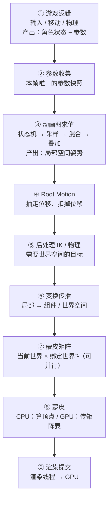

> [[Notes/动画系统/索引|← 返回 动画系统索引]]

# 一帧动画求值管线

> [!todo] 本篇核心问题
> 从动画求值到蒙皮到渲染提交，一帧内按什么顺序走？

> [!tip] 先回答一个更实际的问题：需要懂多深？
> 这一篇是收尾，不引入任何新概念，只做一件事：把前面十几篇拆开的零件**装回一条时间轴**。你需要的只有三样：
> 1. **一张按帧内顺序排列的清单**——知道有哪几站、每站谁负责。
> 2. **每一步"依赖上一步的什么"**——顺序不是规矩，是被依赖关系逼出来的。
> 3. **一条贯穿全线的线索：空间转换**。这条线索的第一步是一个地基概念，先把它钉死：一根骨骼每帧算出来的变换（"相对父级偏了多少、转了多大角度"）叫**局部空间**下的变换；同一根骨骼在角色体内的位置，叫**组件空间**；再乘上角色自己摆在场景里的那个变换，才是**世界空间**。从局部到世界那一串连乘发生在管线中间，也正是本篇要讲清、"顺序为什么不能换"的根据。
>
> 至于并行、缓存、线程之间的交接，属于落地细节，本篇只讲到"知道即可"，深入的部分指向 [[Notes/动画系统/扩展话题速览/动画性能速览：压缩 LOD 与并行求值|动画性能速览]]。

## 为什么需要解决这个问题

先看两个真实会发生的疑问。

**疑问一**：你调了 IK 的参数，脚在斜坡上贴得好好的，姿势肉眼可见地变了——但角色的碰撞胶囊体纹丝不动，站在斜坡里的还是**平地上那个位置**。

**疑问二**：动画里手明明已经握到武器挂点上了，画面上武器还是飘在手外面半掌的位置；或者反过来，手穿进了武器里。

这两个问题的答案不在任何单个机制里，而在一句话上：**它发生在管线的哪一站，以及它的产物最后有没有被下游用上。** 胶囊体没变，是因为改胶囊体是**游戏逻辑**的事，而 IK 是**后处理**——后处理只改姿势，不回头改游戏状态。手和武器对不上，是因为武器挂点**读的是另一条路径上的时间点**，它和手的姿势不是在同一站取的值。

也就是说：你手上的每个机制（采样、混合、状态机、IK、Root Motion、蒙皮）都只是**一个零件**。零件不会自己排队，是运行时按固定顺序把它们端出来的。而**这个顺序几乎不能换**——每一步都在消费上一步刚算出来的东西。把顺序记反了，你会在排查时去查一个根本轮不到它的环节。

所以本篇的任务很纯粹：**把一帧从头到尾走一遍，标出每一站的输入、输出、以及它为什么必须站在那儿。**

## 直观理解：流水线工厂，每一站都在等上一站的半成品

把一帧想象成一次**从原料到成品的流水线**，一天（一帧）跑一趟。

原料是"这一帧角色做了什么"——玩家按了前进、速度变成了 3 m/s、脚下踩到了斜坡。成品是屏幕上的像素。

中间有九站：

1. 决策站（游戏逻辑）：决定角色这一帧要去哪、播什么。
2. 参数站：把决策翻译成动画系统能读的参数。
3. 姿势站（动画图求值）：把所有动画片段揉成**一份姿势**。
4. 位移站（Root Motion）：从姿势里抽走角色的位移，交给角色本体。
5. 修正站（后处理：IK、物理）：在姿势上做最后的修正。
6. 空间站（变换传播）：把逐级相对的局部变换连乘成世界变换。
7. 矩阵站（蒙皮矩阵）：算出每根骨骼"相对绑定姿势跑了多远"。
8. 变形站（蒙皮）：把顶点拽到位。
9. 提交站（渲染线程）：交给 GPU 画出来。

这个比喻里最要紧的一条是：**每一站的半成品形状不一样，所以不能插队。** 第 5 站的 IK 要问"脚该踩在世界上的哪个点"，而这个问题只有在第 4 站把角色挪走之后才有正确答案；第 6 站的连乘需要一份"完整且已经修正过的局部变换清单"。这就是"顺序不能换"的全部理由——不是规矩，是**数据依赖**。

再给一条贯穿全线的线索：**每一站产出的数据，处于不同的坐标空间。**

| 站 | 产出物所在的空间 |
| :--- | :--- |
| 决策站 / 参数站 | 无姿势，是游戏状态与数值参数 |
| 姿势站 | **局部空间**（每根骨骼相对父级的变换） |
| 位移站 | 局部空间（但根骨骼那条被扣掉了） |
| 修正站 | **组件空间**——IK 的目标点在世界里，先换算到这一层才能动手。**这是唯一一个"求值出来是局部、修正却需要世界"的错位站，也是本条管线最容易出顺序错误的地方** |
| 空间站 | **世界空间 / 组件空间** |
| 矩阵站 / 变形站 | 世界（蒙皮矩阵本身是"位移量"，顶点回到模型空间后被拽出去） |
| 提交站 | 裁剪空间（后面是投影矩阵的事，与动画无关了） |

「**数据什么时候从局部空间变成世界空间**」这件事，就是判断一个机制在哪一站的最快方法。IK 用世界空间的目标 → 它必须待在空间转换那一站的**位置上或之前**；蒙皮矩阵用世界变换 → 它必须待在空间转换**之后**。

## 核心机制：一帧的九站

### 第 1 站 · 游戏逻辑：决定这一帧要什么

玩家按下 W，输入系统把"前进"这个意图交给角色的移动组件；移动组件解速度、做碰撞、把角色挪到新位置；物理模拟跑完，角色的速度、朝向、脚下的地面高度都有确定的取值。**这一切都发生在动画被求值之前**——动画是"表现层"，它表现的对象必须先存在。

这一站的产出有两样：**角色的游戏状态**（位置、速度、是否在空中），以及**一串动画参数**（速度 3.2 m/s、方向偏右 15°、是否持枪、是否受击）。参数之后怎么变成姿势，正是 [[Notes/动画系统/混合空间与Additive/数据驱动动画：参数到姿势|数据驱动动画]] 讲的事。

### 第 2 站 · 参数收集：本帧唯一的参数快照

参数被写进这个角色的动画运行时（每个角色一份的参数集合），然后**就定住了**。

这一站短到容易被忽略，但它是整条管线上一个非常重要的时间点：**动画求值期间读到的参数，永远是这个快照。** 如果你在动画求值跑到一半时改了速度参数（比如从回调里改），这次求值**看不到**——它要等下一帧的快照。这解释了一类很难查的"参数改了没反应"：不是没生效，是生效在下一帧。

### 第 3 站 · 动画图求值：把一堆动画片段揉成一份姿势

这是最重的一站，也是前面笔记覆盖最多的一站。它内部还有固定的先后关系：

1. **状态机先决定"放哪几段"**。当前应该播跑步还是起跳？该不该开始过渡到落地？这一步只做决策，不碰数据（[[Notes/动画系统/动画状态机与动画图/动画状态机：状态与转移|动画状态机：状态与转移]]）。
2. **采样把每段动画在它自己的时间点上取成一张姿势表**。一张姿势表 = 这个片段在此刻的"每根骨骼的局部变换"（[[Notes/动画系统/动画数据与采样/按时间取姿势：帧查找与插值|按时间取姿势：帧查找与插值]]）。
3. **沿图的拓扑从输出端往上拉**。因为一个混合节点的输出需要它的所有输入先算完，求值只能从叶子往根走——这就是"求值序"（[[Notes/动画系统/动画状态机与动画图/动画图：节点与求值序|动画图：节点与求值序]]）。
4. **混合：把多张姿势表按权重合成一张**。旋转走四元数插值、位置缩放走线性插值，每根骨骼各算各的（[[Notes/动画系统/动画播放与混合/姿势混合：加权与跨渐变|姿势混合：加权与跨渐变]]）；"哪根骨骼参与混合"由 Mask 决定，没参与的直接沿用基础姿势（[[Notes/动画系统/动画播放与混合/按骨骼混合与Mask|按骨骼混合与 Mask]]）。
5. **Additive 叠加**：在基础姿势之上加一份"增量"——呼吸的起伏、受击的晃动（[[Notes/动画系统/混合空间与Additive/Additive动画：叠加与增量姿势|Additive 动画：叠加与增量姿势]]）。

**这一站的产出：一份局部空间的姿势。**

> [!important] 最容易记错的一点：这里还没有世界变换
> 姿势表里**没有任何一个世界坐标**。每根骨骼只记着"我相对父级偏了多少、转了多大角度"——因为这就是动画数据本身的样子（回看 [[Notes/动画系统/旋转与变换基础/变换层级与复合变换|变换层级与复合变换]]）。整条链路上，"局部 → 世界"的那次连乘**发生在后面**，而且是单独的一站。
>
> 记错这一点的直接后果：你会以为 IK 能在第 3 站里直接"把手放到世界里的某处"，或者以为混合出来的姿势已经带着世界位置了——两个都是错的。

### 第 4 站 · Root Motion：先挪人，再谈脚踩在哪

如果位移由动画驱动，这一站做两件事：从根骨骼这一帧的位移里**提取**出角色的位移增量，交给角色本体；再把同一份增量从姿势里**扣掉**（[[Notes/动画系统/动画播放与混合/RootMotion：动画驱动移动|Root Motion：动画驱动移动]]）。

**顺序要点：它必须在姿势求值之后、后处理之前。** 理由很硬：

- 在姿势求值**之后**——位移是姿势算出来的，姿势还没算完就没有位移可提；
- 在后处理（IK）**之前**——因为 IK 要解决的是"脚踩在**世界上的哪个点**"，而"角色现在站在哪"这件事，在这一站之后才是最终的。换句话说，**IK 的目标点是世界空间的，它必须知道角色已经走到了哪。**

这一条是全篇最值得记住的"顺序不能换"的例子，它在坑里还有一个更具体的恶果，见下文。

### 第 5 站 · 后处理：在姿势上做最后的修正

IK、骨骼修改器、曲线驱动、部分物理（布娃娃与动画的混合）都在这一站（[[Notes/动画系统/逆向运动学/逆向运动学：从末端反推骨骼姿势|逆向运动学：从末端反推骨骼姿势]]）。它们做的是同一类事：**不改变"播的是哪段动画"，只把已经算好的姿势掰得更贴合环境**——脚贴地面、手扶墙、头看向目标。

**这一站的姿势通常已经处在组件空间 / 世界空间。** 原因只有一个：IK 的目标（地面高度、武器握点、视线目标）是拿世界坐标给的。要在世界空间里把一个点对齐，最自然的做法就是先把姿势换算到世界空间再动手。

于是这里出现一个**空间的往返**：求值出来的是局部空间，后处理需要组件空间，有些实现会在后处理做完后再把结果转回局部空间（这样渲染侧只需要知道"局部姿势 + 角色变换"），有些则直接输出组件空间姿势交给下游。两种做法都真实存在，**你不需要背哪一种**；要记住的只有一条：**IK 需要世界空间的目标，这个需求决定了空间转换必须发生在它之前。**

### 第 6 站 · 变换传播：局部 → 世界

把所有骨骼的局部变换，沿层级从根往下连乘成世界变换——一次树的先序遍历，父级算完子级才有材料（[[Notes/动画系统/旋转与变换基础/变换层级与复合变换#层级遍历：世界变换是"从上往下"算的|层级遍历]]）。

这一站看起来只是"乘一堆矩阵"，但它其实是整条管线的**分水岭**：在这之前，数据是"相对父级的偏差"；在这之后，数据是"在世界里的位置"。动画数据本身在两边的含义完全不同，这也是为什么 IK 的目标点和动画里的数值对不上时，第一件事是确认"你手上的数在哪个空间"。

### 第 7 站 · 蒙皮矩阵：骨骼跑了多远

对每根骨骼算 `BoneWorld_current × BoneWorld_bind⁻¹`（[[Notes/动画系统/蒙皮与骨骼网格/蒙皮矩阵：从骨骼姿势到顶点变形|蒙皮矩阵：从骨骼姿势到顶点变形]]）。那个逆矩阵是加载时算一次的常量，所以每根骨骼每帧只有**一次矩阵乘法**。

**这一站可以并行**：每根骨骼的蒙皮矩阵只依赖它自己的世界变换和它自己的绑定逆矩阵，**骨骼之间毫无关系**。几百根骨骼可以拆给多个工作线程并行算完。这也是整条链路上第一个天然的并行点。

### 第 8 站 · 蒙皮：把顶点拽到位

顶点变形。有多条路，选哪条决定了这一站的开销落在哪儿。

**CPU 蒙皮**：在工作线程里把几万个顶点都算一遍，再把算好的顶点位置上传给 GPU。适合顶点数不多、或者 CPU 侧还需要这份顶点数据的场合（比如某些物理、碰撞、程序化生成的顶点属性）。

**GPU 蒙皮（主流）**：CPU 只准备一张**骨骼矩阵表**（每根骨骼一个 3×4 矩阵，通常几十到几百个），整批上传给 GPU，几万个顶点的变形在**顶点着色器**里做（[[Notes/动画系统/蒙皮与骨骼网格/顶点权重与蒙皮算法|顶点权重与蒙皮算法]] 里的 LBS 加权求和就是着色器里那个循环）。

> [!important] GPU 蒙皮成为主流的根本原因：上传量的量级差
> 两条路要往显存里送的东西**根本不是一类东西**：
>
> | | 上传的内容 | 规模 |
> | :--- | :--- | :--- |
> | CPU 蒙皮 | **顶点数据**（算完的位置，还有法线、切线） | 几万个顶点 × 每顶点多份属性 |
> | GPU 蒙皮 | **骨骼矩阵表** | 几百个矩阵 |
>
> 差**两个数量级**。CPU 蒙皮每帧要把几万个顶点的结果搬过总线，带宽就成了瓶颈；GPU 蒙皮每帧只搬几百个矩阵，然后让 GPU 自己去算那几万次本来就很擅长算的乘加。所以"把蒙皮丢给 GPU"不是取舍问题，是数量级问题。

由此派生的一个机制值得知道（**知道即可**）：顶点着色器很难优雅地接受"每个角色各不相同的一个数组"，所以业界常见的做法是把**多个角色的骨骼矩阵拼进同一张纹理或同一个缓冲**，再让每个实例去偏移取自己那一段。这就是"骨骼矩阵纹理"这类做法的由来——它是为了配合 GPU 的取数方式，而不是什么新算法。

### 第 9 站 · 渲染提交：交给 GPU

网格（顶点缓冲、索引缓冲、材质）+ 骨骼矩阵表一起进渲染线程，绘制。到这里，动画系统的工作全部结束——**它交付的不是像素，是"一组带着骨骼矩阵的网格"**。

**这里有一次线程交接，也是很多"慢一帧"怪事的来源**：动画求值发生在**游戏线程**，绘制发生在**渲染线程**。两个线程并行跑帧，中间靠一份数据交接。渲染线程拿到的是**上一帧求值出来的姿势**——这就是为什么改动画参数看起来"慢半拍"、为什么快速动作时能看到微小的滞后。

> [!note]- 想深究：这一站的半成品长什么样
> 除了骨骼矩阵表，交给渲染的还有：这次绘制用哪个 LOD 的网格、哪些材质分区、以及这个角色的变换。这些属于**骨骼网格资产的组织方式**（索引缓冲、材质分区、SkeletalMesh 与 Skeleton 的分工），是下一篇 [[Notes/动画系统/蒙皮与骨骼网格/骨骼网格的数据组织|骨骼网格的数据组织]] 的话题。**不看完全不影响本篇**——你只需要知道"交付物是网格 + 矩阵表"。

### 收束：这张地图怎么用

回头看开头那两个疑问，现在能一句话定位了：

- **"改了 IK，姿势变了但碰撞体没变"** → IK 在第 5 站，它只改姿势。碰撞胶囊体是第 1 站游戏逻辑的资产，管线**从第 1 站一路向下**，姿势从来不回头改游戏状态（唯一的例外是 Root Motion 那条"反向"的路）。想让胶囊体贴合斜坡，得在游戏逻辑那一站做，而不是指望 IK 自动生效。
- **"手的位置和武器挂点对不上"** → 武器的挂点是**另一条路径**上取的值，它的时间点、空间、以及是否经过后处理，都和手的姿势不一定一致。先确认双方各自在第几站、在哪个空间取的数，再谈修正。

## 并行与延迟（必须懂，因为它解释现象）

**为什么动画有延迟。** 游戏线程求值 → 渲染线程使用，中间隔着一次交接。帧率与动画更新率不一致（动画 30Hz、渲染 120Hz）时，同一份姿势会被渲染多帧。表现有两种，需要分开看：

- **姿势被重复使用** → 动作有**台阶感**（每几帧才动一次）。这是采样率问题，判断方法在 [[Notes/动画系统/动画数据与采样/按时间取姿势：帧查找与插值#一个常见误判：卡顿 ≠ 插值不对|卡顿 ≠ 插值不对]] 里写得比本篇细。
- **交接晚了一帧** → 表现**滞后**：快速转身、急停时角色像是"跟着你慢半拍"，姿势追上输入总晚一帧。

**什么能并行，什么不能。**

| 能并行 | 为什么 |
| :--- | :--- |
| 不同角色的动画求值 | 角色之间没有数据依赖 |
| 同一动画图的不同分支 | 叶子节点之间互不依赖（合并节点要等它的输入） |
| 蒙皮矩阵计算 | 每根骨骼独立 |
| CPU 蒙皮的顶点计算 | 每个顶点独立 |
| CPU 蒙皮与 GPU 蒙皮的不同角色 | 互不依赖 |

| 不能并行 | 为什么 |
| :--- | :--- |
| 同一角色的求值链 | 后一站消费前一站的产物（IK 要 Root Motion 的结果、蒙皮矩阵要世界变换） |
| 蒙皮之前的任何"姿势改写" | 都在同一份姿势数据上做原地修改 |

**实践中常见的优化顺序**（知道即可）：先做**距离剔除**（远处角色降更新频率，甚至隔帧更新），再做**骨骼 LOD**（远处角色只用上半身骨骼求值），最后才是**并行求值**。顺序有道理——剔除和 LOD 是"少算"，并行是"分摊算"，前者永远更便宜。细节留给 [[Notes/动画系统/扩展话题速览/动画性能速览：压缩 LOD 与并行求值|动画性能速览]]。

## 边界与坑

- **~={red}IK 跑在 Root Motion 之前 → 移动时脚在地面上滑=~**。这是"顺序不能换"最有说服力的例子。IK 解算时用的是**旧的**角色位置，它把脚对齐到了"上一帧角色所在的地面点"；紧接着角色被 Root Motion 挪走了，脚却还停在原地。表现就是**移动时脚被地面拖着滑**，而且是"角色走得越快、滑得越明显"。看到这个症状，先去确认这两站的先后，而不是去调 IK 的迭代次数。

- **蒙皮用的骨骼矩阵是上一帧的 → 模型滞后、拖影**。上传骨骼矩阵的时刻没对齐（上传的是上一帧求值的结果，或者渲染线程读到的还是旧矩阵），快速动作时能看到模型和挂点之间有**错位**，快速转身时像有一层"拖影"。和上一条的区别是：这条**静止时完全正常**，一动才露馅。

- **多个系统同时改同一根骨骼 → 结果取决于执行顺序**。IK、物理、曲线驱动都往同一根骨骼上写值，谁最后写谁说了算。表现是**抖动**或者"偶发姿势错误"（同样的输入，有时正常有时不对——因为线程调度的先后不固定）。工程上的做法是给它们排定固定顺序，或者让它们各写各的属性（一个写旋转、一个写平移）。

- **动画更新频率低于渲染帧率 → 动作有顿感**。同一姿势渲染多次。这不是 bug，是采样率的台阶；判断方法和缓解手段见上面提到的《按时间取姿势》那一节。

- **角色被剔除后姿势没更新，重新出现时跳变**。屏幕外不更新是为了省钱，但重新可见的那一帧如果直接沿用旧姿势，会看到角色**"啪"地弹到正确姿势**。修法是：重新可见时立即求值一次，或者让被剔除的角色也以极低频率维持更新。

- **~={red}参数在错误的时间点被改 → 改了没反应，或者反应慢一帧=~**。第 2 站的快照是本帧唯一的读入点。求值中途改参数，本帧看不到；跨线程改还没同步完的参数，可能读到一半旧一半新。排查"参数改了没生效"时，先问"我是在快照之前改的吗"。

- **零权重 / 权重全零的姿势分支仍然参与求值**。权重为 0 的分支在数学上等于不存在，但它**照样会被求值一遍**（[[Notes/动画系统/动画播放与混合/动画播放器：生命周期与时间模型|动画播放器]] 里提过这一条）。这是性能上的白花，也是"我明明把权重调成 0 了但状态机还在报错"这类现象的来源。

## 参考实现（UE）

| 引擎 | 对应模块/数据结构 | 具体体现 |
| :--- | :--- | :--- |
| UE | `USkeletalMeshComponent::TickAnimation` / `TickAnimInstances` | 第 1~2 站的入口：游戏线程上的 tick 推进各动画实例，必要时先重建 `RequiredBones`（[[Notes/UE/第八阶段-跨领域专题/UE-专题：动画评估管线\|UE 动画评估管线专题]]） |
| UE | `UAnimInstance::UpdateAnimation`（→ `NativeUpdateAnimation` / `BlueprintUpdateAnimation`） | 第 2 站的参数收集：蓝图与 Native 在这里把游戏状态写进动画实例。这一阶段在 Game Thread 上执行，正是"参数快照点"的落地 |
| UE | `FAnimInstanceProxy::UpdateAnimation` / `EvaluateAnimation`（`Update_AnyThread` / `Evaluate_AnyThread`） | 第 3 站：Proxy 把评估所需状态复制成纯数据结构，使姿势求值可以在工作线程执行；节点按 `FPoseLink` 递归求值，产出 `FCompactPose`（局部空间）与 `FBlendedCurve` |
| UE | `FAnimNode_SkeletalControlBase::EvaluateComponentSpace_AnyThread` → `FCSPose` | 第 5 站的落地：先把 `FCompactPose` 转成组件空间的 `FCSPose`，再调用 `AnimationCore::SolveTwoBoneIK` / `SolveFabrik` 等纯数学求解，最后按 `ActualAlpha` 混回姿势——"IK 需要世界空间目标"这条依赖就体现在这里（[[Notes/UE/第四阶段-客户端运行时层/UE-Engine-源码解析：IK、Motion Matching 与 RootMotion\|UE IK / Motion Matching / RootMotion]]） |
| UE | `FRootMotionMovementParams` / `UAnimInstance::PostUpdateAnimation` / `USkeletalMeshComponent::ConsumeRootMotion` | 第 4 站：位移在评估期间被提取进 Proxy，评估结束后同步回游戏线程，由移动组件消费 |
| UE | `USkeletalMeshComponent::RefreshBoneTransforms` → `FinalizePoseEvaluationResult` / `FillComponentSpaceTransforms` | 第 6 站：把局部姿势沿层级填充为组件空间的 `SpaceBases`；这一站也是并行评估任务的分发点（`DispatchParallelEvaluationTasks`） |
| UE | `FSkeletalMeshObjectGPUSkin` + 骨骼矩阵纹理 | 第 7~9 站：CPU 侧准备蒙皮矩阵并上传为骨骼矩阵纹理，顶点在顶点着色器里变形；权重输入是 `FSkinWeightVertexBuffer`（[[Notes/UE/第四阶段-客户端运行时层/UE-Engine-源码解析：骨骼与重定向\|UE 骨骼与重定向]]） |

**一句话点评**：UE 把这条链路切得很清楚——**Game Thread 负责"状态"（Update、参数、Root Motion 消费），Worker Thread 负责"姿势"（Evaluate），渲染线程负责"顶点"**，三者之间靠 `FAnimInstanceProxy` 和 `FRootMotionMovementParams` 这类纯数据结构交接。本篇讲的九站，在 UE 里对应 `TickPose/TickAnimation` → `UpdateAnimation` → `EvaluateAnimation` → `FillComponentSpaceTransforms` → 骨骼矩阵上传这一条调用链，结构几乎一一对应。

## 一句话总结

一帧的动画是这样走的：游戏逻辑产生状态与参数 → 参数被快照 → 动画图求值出一份**局部空间**的姿势 → Root Motion 把位移抽给角色并从姿势里扣掉 → 后处理在**组件/世界空间**里把姿势修好（IK 必须在这一站之后才拿得到正确的角色位置）→ 局部变换连乘成世界变换 → 每根骨骼算出蒙皮矩阵 → 顶点被拽到位（主流是把矩阵表丢给 GPU 算）→ 交给渲染线程绘制。**每一步都在消费上一步刚算出来的东西，所以顺序不能换**；而"数据此刻在局部空间还是世界空间"就是判断一个机制该待在哪一站的最快方法。

---

**下一篇**：[[Notes/动画系统/扩展话题速览/动画性能速览：压缩 LOD 与并行求值|动画性能速览：压缩 LOD 与并行求值]]——至此动画系统的核心链路已经完整走通，接下来只剩一个问题：这套东西在几百个角色的场景里怎么跑得动。
