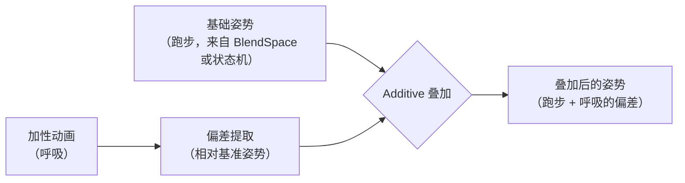

> [[Notes/动画系统/索引|← 返回 动画系统索引]]

# Additive动画：叠加与增量姿势

> [!todo] 本篇核心问题
> Additive 只叠加增量不替换基础动画，增量怎么算？为什么叠出来姿势会爆炸？

> [!info] 读前必备
> 本篇默认你已经知道**姿势**和**参考姿势**这两个词，它们的地基在 [[Notes/动画系统/角色资产与骨骼基础/骨骼的本质：从骨架到 Skeleton 资产|骨骼的本质：从骨架到 Skeleton 资产]]。
> 一句话版本：**姿势（Pose）** 是某一瞬间**每根骨骼各在哪、朝哪**的一份完整快照；**参考姿势（Reference Pose，也叫绑定姿势 / Bind Pose）** 是建模时角色摆的那个标准姿势（通常是 T-Pose），它是所有动画的"零点"。

## 为什么需要解决这个问题

到此为止，我们讲的混合都是**取代式**的：输入 A 和 B，按权重算出"两者的平均"，权重相加为 1。走路淡入跑步，是跑步一点点**取代**走路——权重此消彼长，合起来永远等于 1。

（这里的"权重"和姿势数据的形状，[[Notes/动画系统/动画播放与混合/姿势混合：加权与跨渐变|姿势混合：加权与跨渐变]] 已经讲透了；忘了的话回看一眼再回来。）

但有一类需求根本不是取代，而是**在原有基础上加东西**：

角色在跑，同时要有**呼吸起伏**；被子弹打中时要有**受击抖动**；一边瞄准一边有**手部微晃**；开枪瞬间要有**后坐力**。这些全都是"跑步照跑，另外再叠一点偏差上去"。

一、**多个**姿势才能算出平均；Additive 只有**一个**输入姿势，它按强度系数加在**一份已经算好的姿势**上。所以两者必须是**上下串联的两级，不是可以互相替换的两种做法**：先用取代式混合（含混合空间）从多段动画里选出一个基础姿势，再用 Additive 把呼吸、瞄准、受击这些"附加层"加上去。也正因为它是往上叠的最后一道工序，它的**输入输出都是一份完整姿势**，位置和 Mask、IK 这些机制完全兼容，可以自由前后摆放。

二、取代式混合是**有损**的，这恰恰是 Additive 存在的理由——**混进去的每一家都会把别人稀释一点**。

举个具体的：基础姿势是"跑步"（手臂大幅摆动），呼吸动画里角色是**站着的**（呼吸通常在静止站姿上制作），两者各占一半。取代式的加权平均会把抬起的腿按一半的量算，**腿抬不起来、步幅缩水**，角色像在滑步；更要命的是**基础动画做得越有个性，越经不起这么稀释**——两个动作差异越大，混出来的东西越像一摊泥。Additive 要的效果是"跑步一点不动，额外再叠一点偏差上去"，只有"叠加"这件事本身能做到，而且它**叠加多少只取决于 Alpha，跟基础动画是什么无关**。

## 直观理解：表情贴纸，不是照片叠化

用贯穿全篇的比喻。

取代式混合像**照片叠化**：两张照片透明度互补地叠在一起，一张多一分，另一张就淡一分，最后只能看到一张"中间照片"。

Additive 像**表情贴纸**：底图（跑步）原封不动，你贴上一张贴纸，贴纸本身**不包含一张完整的人**，它只画了"嘴角上扬一点、眼睛眯一点"——也就是**相对于一张标准脸，这张贴纸偏移了多少**。贴在笑脸上得到大笑，贴在哭脸上得到哭笑不得，但底图永远清晰。

这正是 Additive 的全部精髓：**你要维护的不是"呼吸这段动画"，而是"呼吸相对于某个标准姿势偏移了多少"**。底图越不受影响，效果越自然。

**数据流位置**：Additive 不新增数据流中的一站，它就在混合站内部，是**混合方式**的另一个分支——取代式混合走"加权平均"，Additive 走"取偏差 + 加回去"。输入端是两个姿势（基础姿势 + 加性动画），输出端仍是一个姿势，交给后面的 IK 后处理和蒙皮（后处理与蒙皮这两站做什么，见 [[Notes/动画系统/蒙皮与骨骼网格/蒙皮矩阵：从骨骼姿势到顶点变形|蒙皮矩阵：从骨骼姿势到顶点变形]]）。



## 全流程的分工

要理解后面所有的坑，得先知道一件常被忽略的事：**Additive 不是运行时单独实现的机制，它由制作端和运行时两端共同完成**。

- **制作端（美术在 DCC 里做动画时）**：决定"呼吸这段动画是相对什么做的"，也就是从哪一张脸开始 K 帧。这一步决定了后面所有偏差的**含义**。DCC 就是 Maya / Blender / MotionBuilder 这类做动画的软件，K 帧就是"在某时间点上打一个关键帧"。
- **运行时（引擎里）**：把加性动画按自己的复合规则"撤销"掉基准姿势，得到偏差量，再按系数加回基础姿势。运行时**没有能力弥补制作端的基准选错**——它拿到的只是一个姿势，无从分辨这个姿势的基准本该是什么。

记住这个分工，后面讲"姿势爆炸"时，你会发现四个原因里有一半发生在你平时根本不看的那一端。

## 核心机制

### 偏差是什么：旋转用"撤销复合"，平移用差值

先看数据结构。姿势是一组骨骼变换，每根骨骼有三个分量（记不清的话回看 [[Notes/动画系统/旋转与变换基础/变换层级与复合变换|变换层级与复合变换]]）：

```cpp
// flags: -O0 -g

struct Transform {
    Vec3 Translation;
    Quat Rotation;   // 模长必须为 1，见 Slerp 篇
    Vec3 Scale;
};
```

**偏差的定义**：一段 Additive 动画相对于它的**基准姿势（Base Pose / Ref Pose）**偏移了多少。"基准姿势"不是新东西，就是上面那份参考姿势（T-Pose）或这段动画自己选定的某一帧——先记住"偏差总得有个参照物，这个参照物就是基准姿势"，下一节专门讲怎么选。它的目标是让"叠加"能满足一条式子：

```text
最终姿势 = 基础姿势（按各分量的复合规则）作用上 增量
```

这里的"作用"不是逐分量加法，而是**每个分量按自己的复合规则**把增量复合上去。这带来一个真会踩的坑：

| 分量 | 复合规则 | 偏差怎么算 | 怎么加回去 | 用错了会怎样 |
| :--- | :--- | :--- | :--- | :--- |
| 平移 | 加法 | `Delta = 加性姿势.T − 基准.T` | `基础.T + Alpha × Delta` | （减法用在平移上是对的） |
| 缩放 | 逐轴乘法 | `Delta = 加性姿势.S / 基准.S` | 逐轴相乘 | 缩放退化，模型局部发胖/压扁 |
| **旋转** | **乘法（四元数复合）** | **`Delta = 基准.R⁻¹ × 加性姿势.R`** | **`基础.R × Delta`** | **旋转明显起来后，动作方向完全不对、幅度对不上，大角度时彻底崩坏** |

**为什么旋转必须用乘法？** 因为旋转的复合本身就是乘法——这是 [[Notes/动画系统/旋转与变换基础/四元数的几何意义与运算#第一招：复合 —— 两个旋转先后做|复合（两个旋转先后做）]] 那条规则。"偏差"这个词在旋转上的精确含义是**相对旋转**：从基准朝向出发，还得再转多少才能到达加性动画的朝向。求它的办法就是刚才那条规则的逆用——**撤销（乘基准的逆）**，也就是同一篇里的 [[Notes/动画系统/旋转与变换基础/四元数的几何意义与运算#第二招：撤销 —— 共轭与逆|撤销（共轭与逆）]]。

平移那边则相反：位置的复合本来就是加法，"从 A 点挪到 B 点"的偏差就是差值 `B − A`。

**这条不是学术洁癖，它会直接咬人。** 有人图省事，把旋转的偏差也写成 `Delta = 加性.R − 基准.R`（四个分量各减一下），叠回去的时候再用加法。小角度时它看起来"差不多能用"——因为小角度下旋转近似线性，差值近似等于相对旋转；但一旦俯仰幅度大起来（呼吸做成明显的挺胸、后坐力做得猛一点），**旋转的"偏离量"是个非线性量，减法给出的是一个既不守恒模长、方向也偏了的四元数**，叠上去就得到：手臂朝反方向拐、肩部拧成一个不属于任何动画的角度、大幅动作时整段姿势崩坏。**记住口诀：旋转"撤销"用乘逆，平移"撤销"用相减。**

对应的代码骨架（表达结构，不求可运行）：

```cpp
// flags: -O0 -g

// 提取偏差：把"加性动画姿势"换算成"相对基准姿势偏移了多少"
Transform ExtractDelta(const Transform& Ref, const Transform& Additive) {
    Transform d;
    // 旋转：撤销基准，得到相对旋转（乘逆，不是相减）
    d.Rotation    = Ref.Rotation.Inverse() * Additive.Rotation;
    // 平移：位置的复合是加法，偏差就是差值
    d.Translation = Additive.Translation - Ref.Translation;
    // 缩放：逐轴除法（工程上 Scale 通常恒为 (1,1,1)，这里保留是为了不丢信息）
    d.Scale       = Additive.Scale / Ref.Scale;
    return d;
}

// 叠加回去：按强度系数把偏差加在基础姿势上
// 注意 Alpha 对旋转不能是"逐分量乘"，必须是插入（见下节）
Transform Apply(const Transform& Base, const Transform& Delta, float Alpha) {
    Transform out;
    out.Rotation    = Base.Rotation * Quat::Slerp(Quat::Identity(), Delta.Rotation, Alpha);
    out.Translation = Base.Translation + Delta.Translation * Alpha;
    out.Scale       = Base.Scale * Lerp(Vec3(1,1,1), Delta.Scale, Alpha);
    return out;
}
```

### 基准姿势：偏差是"相对谁"的

偏差必须有参照物，这个参照物就是**基准姿势（Base Pose / Ref Pose）**。工业界常用的两种选择：

- **相对参考姿势（Reference Pose，也就是绑定姿势 / Bind Pose、T-Pose）**：偏差含义是"这根骨骼相对标准姿势转了多少"。这个姿势的定义与作用见 [[Notes/动画系统/角色资产与骨骼基础/骨骼的本质：从骨架到 Skeleton 资产#Skeleton 资产里到底存了什么|参考姿势是什么]]。**好处是通用**——任何基础动画、任何角色的任何姿势都能往上叠，因为全世界共用一个参照物；代价是它会把角色往 T-Pose 那边拽一点（解释见下面那段"加性动画缩水"）。这也是绝大多数引擎和资源包的默认做法。
- **相对这段动画自己的第一帧（通常写作 `AnimFirstFrame`）**：偏差含义是"相对这段动画的起始姿势偏了多少"。好处是叠加时更"纯"——不会把角色的当前姿势往 T-Pose 拉。

**这里有两个真会咬人的坑，都出在这一步上。**

**坑一：基准选错，整段动画作废。** 做 Additive 动画时，**必须在 DCC 里先把基础姿势设成"参考姿势"或"第一帧"，然后才在这个基础上 K 帧**。不做这一步，你的动画文件里存的就是一份**以静止站姿为基准**的绝对姿势，运行时却会拿**参考姿势**（或第一帧）去当基准提取偏差——**基准错了，算出来的偏差就差了一整个大角度**。

它为什么最难自查？因为**资产里看不出任何异常**：你在 DCC 里打开呼吸动画，它就是一段正常的呼吸；扔进引擎，叠到跑步上之后角色突然歪了 20°~90°，你会先去怀疑跑得不对、怀疑遮罩配错了，最后才想到这一步。**Additive 全流程里最容易出错、也最难自查的一环，就在制作端的这一步操作上。**

**坑二：贴近 180° 姿态的加性动画会"缩水"。** 这一条不常被提起，但挺脏。

偏差是**相对**的量：同样"把手臂抬 10°"的偏差，叠在手臂朝下 10° 和手臂朝上 10° 两个基础姿势上，结果并不一样。极端情况下，当基础姿势转到**接近这个偏差的 180° 反向**时，插值无法判断该往哪边靠近，偏差几乎叠不进去——表现是：**某段加性动画在大部分情况下都正常，唯独在某个特定动作或朝向时"缩水、甚至完全没效果"**。

它和坑一都出在"基准与基础姿势的关系"上，但**症状不同**：坑一是**到处都歪**，坑二只在**基础姿势贴近那个临界姿态**时才露出马脚。

### 为什么必须有强度系数，以及旋转的系数怎么用

偏差提取出来后，很少原样 100% 叠上去。更需要的是**强度系数（Alpha / Weight）**，因为 Additive 用得最多的场景恰恰是**动态变化**的：受击抖动应该是"挨打瞬间叠满、0.3 秒内衰减到 0"。

于是问题来了：**旋转的偏差该怎么按系数缩放？**

直觉上最容易写的是"四个分量各乘 Alpha"，**这是错的**。它和 [[Notes/动画系统/旋转与变换基础/四元数插值：Slerp与归一化|Slerp 篇]]里"旋转不能直接对四个分量做平均"是同一个病：

- 四元数的四个分量**不是线性量**，逐分量乘 Alpha 得到的东西**模长不再等于 1**。模长不为 1 的后果见 [[Notes/动画系统/旋转与变换基础/四元数的几何意义与运算#边界与坑|四元数边界与坑]]：它是"旋转 + 缩放"的混合体。表现就是**角色在中途"发胖"**——受击抖动衰减的过程中，身体像被吹了一下，然后缩回去。
- 即使事后归一化把模长拉回 1，得到的角度也不是你想要的线性衰减：角度的变化**先慢后快或者先快后慢**，手感上是"抖动一下子闪没"而不是平滑衰减。

正确做法只有一条：**把旋转的缩放当成一次插值**——从"无旋转"（四元数单位元 `(1,0,0,0)`）插到"偏差旋转"，插值参数就是 Alpha。小角度可以用 Nlerp，但 Slerp 的匀速在这里更划算（一次 `acos` + 两次 `sin`，相比整条求值链微不足道），因为偏差旋转往往不小。

还有一条容易忽略的性质：**这种插值是"沿最短弧"走的**，把 Alpha 从 0 拉到 1 是**连续**经过中间姿态的。还是有问题：逐分量乘 Alpha 在 Alpha 靠近 0 时同样会让四元数向原点收缩，方向在数值上变得不稳定（`q` 与 `−q` 是同一姿态但差一个符号，见 [[Notes/动画系统/旋转与变换基础/四元数的几何意义与运算#彩蛋：q 和 -q 是同一张处方单|q 和 -q 是同一张处方单]]），表现就是**受击衰减到快结束时身体突然抖一下、扭一下**。用一次 Slerp 就完全绕开了这个问题。

### 姿势为什么会爆炸：四个原因与它们各自看得见的症状

现在回答本篇的第二个核心问题。加到"爆炸"，无非四种病根，**每一种的症状长得都不一样，可以据此反推是哪一个**。

**原因一：同一个增量被叠了两遍（累积）**

最典型的是"叠加后的姿势又被当成基础姿势，再叠一次"。比如把 Additive 节点串了两级，或者一个姿势在多条分支配线上都被加了同一个呼吸偏差。

旋转的复合是乘法，**叠两次 = 转两次**。呼吸的挺胸本来偏 5°，叠两遍就是 10°；后坐力偏 20°，叠两遍就是 40°。表现是**动作幅度翻倍、关节转到不可能的角度**——手腕翻到反关节、脖子拧过头，而且**动作一做大就崩得越明显**（因为偏差角度越大，复合两次的差距越大）。

诊断特征：**动作的"形"是对的，只是幅度不对**，把强度系数调成一半就正常了——那就是它。

**原因二：基准姿势不匹配（跨界搬运）**

加性动画的基准是 A，却被叠到以 B 为基准的基础姿势上。算出来的偏差是**两个不匹配的东西之差**——它既不是"A 到该动画的偏移"，也不是你想要的任何东西。

这是 **"从别的项目、别的模型搬来的 Additive 动画用不了"的根本原因**：动作本身没坏，坏的是**基准对不上**。症状是**角色整体姿势歪一个大角度、或者骨骼完全错位**，而且**跟基础动画无关**——你换成待机、换成走路，它都一样歪，甚至待机时也歪。这是它和原因一最好区分的特征：**原因一的错是"随动作放大"，原因二的错是"恒定地歪在同一个方向上"。**

**原因三：基准姿势本身带了错误**

就是上文说的"美术忘了设参考姿势"。症状和原因二一样（整体歪、错位），但**来源不同**：原因二是资产从外面搬进来的，原因三是自己项目里做出来的。区分办法是**去看 DCC 里这段动画的基准设置**，而不是去调引擎参数——这条排查路径不搞清楚，你会在引擎里白折腾一整天。

**原因四：平移增量未做偏移量补偿（换骨架时）**

平移的偏差是差值 `加性姿势.T − 基准.T`，这个差值里**包含骨骼长度本身**。如果加性动画的基准和基础动画的参考姿势在**骨骼长度/位置上不一致**（换骨架、换体型、改过绑定），那差值里就混进了一份"骨骼长度差"，被当成偏差叠上去。

症状非常有辨识度：**模型被拉长、手变长、个子变高**，而且**沿骨骼链越往末端越明显**（手指最惨）。注意它和"缩放污染"（见 [[Notes/动画系统/旋转与变换基础/变换层级与复合变换#缩放的污染：父节点一缩放，整条子链都遭殃|缩放的污染]]）表现相似，但**检查 Scale 分量是好的**——长度是从平移里跑出来的。此时的正解通常是启用**平移重定向**之类的处理，把"骨骼长度差"从偏差里扣掉（也就是不提取平移增量这条捷径，见下节）。

> [!tip] 快速排错顺序
> 看症状反推，比一条条试参数快得多：
>
> | 症状 | 大概率原因 |
> | :--- | :--- |
> | 动作的形对、幅度不对；系数减半就正常 | 一 · 叠了两遍 |
> | 恒定地歪在同一个方向，换基础动画也一样 | 二 / 三 · 基准错了（去 DCC 查，不是调引擎） |
> | 模型被拉长，Scale 分量却是好的 | 四 · 平移没做补偿 |
> | 衰减过程中突然扭一下 / 中途发胖 | 旋转的强度系数写错了（逐分量乘） |

### 边界与坑

- **Alpha = 0**：应该完全不生效。注意"姿势里可能残留极小偏移"是浮点误差，通常量级远小于一个像素，忽略即可；但如果你的强度系数是**每帧连乘衰减**（如 `a *= 0.9`）而不是按时间线性插值，它会**永远逼近 0 却到不了 0**——看起来像"抖动没完全停下"，把系数改成按经过时间算就好。
- **Alpha 为负**：数学上完全合法，含义是**反向叠加**——叠一个"反向呼吸"就等于**减少呼吸的影响**，可以用来反向抵消某段动作。但它是把双刃剑：负系数下姿态在穿过 0 的过程中会经过基准姿势，过渡幅度不对时**模型会被明显拧坏**（往反关节方向拧）。要用就配好上下限。
- **Alpha > 1**：合法且有用（夸张后坐力），但**偏差角度越大，放大的非线性失真越明显**，实践中很少超过 1.3。
- **偏差旋转 ≈ 180°**：这是加性动画的"死角"。以参考姿势为基准时，偏差正好指向参考姿势的**反向**，`Slerp(Identity, Delta, Alpha)` 的最短弧不唯一，路径会跳；更常见的是像上面坑二说的那样**叠不进去、叠不到位**——表现为某段加性动画在某个特定基础动作上"缩水"。**要么换基准（改用第一帧基准），要么就把这个姿态从加性动画的覆盖范围里排除掉。**
- **骨骼缺失**：基础骨架没有这根骨骼时，增量无处可加，只能整根跳过——表现是（某些角色上）**"这个抖动完全没效果"**，而不是报错。
- **只在部分骨骼上叠加（Mask）**：这是最常用的做法——比如**只叠上半身**做呼吸，腿完全不受影响。遮罩（Mask）是一张"逐骨骼的权重表"：遮罩内的骨骼取 Alpha，遮罩外的取 0，划分方式见 [[Notes/动画系统/动画播放与混合/按骨骼混合与Mask|按骨骼混合与 Mask]]。
- **Root Motion 一般关掉**：如果加性动画里自带根骨骼位移（比如"向前趔趄一步"），**通常不提取它来驱动角色移动**。原因很直接——加性动画的定位是"姿态修正"，它的位移是装饰性的；一旦它驱动物理移动，受击抖动会变成"每帧把角色往前推一点"的抽搐。背景见 [[Notes/动画系统/动画播放与混合/RootMotion：动画驱动移动|Root Motion：动画驱动移动]]。
- **不提取平移增量（常用捷径）**：如果你的骨架会遇到重定向，或加性动画的平移本来就无关紧要（呼吸、抖动基本只需要旋转），**直接丢弃平移偏差**是最省心的做法——原因四会被釜底抽薪地消掉。代价是失去"受击时肩膀被撞得挪一下"这类细节。

> [!note]- 想深究：偏差的"三种基准空间"是引擎的私有分类，不读不影响
> 工业引擎（如 UE 的 `EAdditiveAnimationType`）会把基准空间分成三档：不叠加（`AAT_None`）、**局部空间基准**（`AAT_LocalSpaceBase`）、**网格空间旋转偏移**（`AAT_RotationOffsetMeshSpace`）。
>
> 前两种就是本篇讲的"相对谁"的问题——局部空间基准是**绑在父骨骼坐标系里**的偏差（父骨骼转，偏差跟着转），网格空间偏移则是**绑在角色整体坐标系里**的偏差（父骨骼转，偏差方向不动）。它影响的是同一个呼吸动画贴在"低头"和"抬头"的基础姿势上时，偏差会不会被父级的朝向带着转。
>
> 具体选哪一种、`AAT_RotationOffsetMeshSpace` 在什么场景下才需要，属于引擎资产配置细节，**不知道不影响你理解 Additive 的本质**。真遇到"叠加方向在肢体旋转后不对"的问题时，再去翻参考实现。

**最后，把 Additive 放回整个混合体系看**：取代式混合和 Additive 不是竞争关系，而是**上下串联**的两级——先用取代式混合（含 BlendSpace）从多段动画里选出一个基础姿势，再用 Additive 把呼吸、瞄准、受击这些"附加层"加上去。所以它天然是**叠加在已有姿势之上的最后一层（在某些引擎里还会排在同层级的 Mask 之后）**。也正因为如此，它的输入输出都是完整的姿势，位置和 Mask、IK 这些机制完全兼容，可以自由前后摆放。

## 参考实现（UE）

| 引擎 | 对应模块/数据结构 | 具体体现 |
| :--- | :--- | :--- |
| UE | `FAnimNode_ApplyAdditive` | Additive 节点的落地：一个基础姿势引脚 + 一个加性姿势引脚 + `Alpha`，输出叠加结果。UE 里它属于**姿势输入节点**这一类，只做混合，不做采样——见 [[Notes/UE/第四阶段-客户端运行时层/UE-AnimGraphRuntime-源码解析：动画图与BlendSpace\|UE 动画图与 BlendSpace]] |
| UE | `EAdditiveAnimationType`（`AAT_None` / `AAT_LocalSpaceBase` / `AAT_RotationOffsetMeshSpace`） | 上节折叠区块里说的"三种基准空间"；对应资产上的 **Additive Anim Type** 设置 |
| UE | `FAnimationRuntime::AccumulateAdditivePose` | "取偏差 + 加回基础姿势 + 按 Alpha 缩放"这条链路的实现；Alpha 为 0 时直接跳过（所谓 Additive Identity 姿势） |
| UE | `UAnimSequence::CreateAnimation` | Additive 资源的生成：按基准姿势算出偏差并烘进资产；配合 **Base Pose Type**（`ABPT_RefPose` 参考姿势 / `ABPT_AnimFrame` 指动画的某一帧 / `ABPT_LocalAnimFrame` 本动画自己的某一帧）选择基准——本篇那个"最容易出错的制作端步骤"在引擎里的落点 |
| UE | `UPoseAsset` 的 `bAdditivePose` / `BasePoseIndex` | 姿势资产也能以加性形式存储，基准用 `BasePoseIndex` 指定；换骨架时基准对齐的处理见 [[Notes/UE/第四阶段-客户端运行时层/UE-Engine-源码解析：骨骼与重定向\|UE 骨骼与重定向]] 里的 `RetargetSource` |
| UE | `FCompactPose::ResetToAdditiveIdentity` | "加性单位姿势"的表示——所有骨骼回到"无偏差"状态，是 Additive 链路的干净起点（`FCompactPose` 即 UE 里的一份紧凑姿势），见 [[Notes/UE/第八阶段-跨领域专题/UE-专题：动画评估管线\|UE 动画评估管线专题]] |

## 一句话总结

Additive 叠加的不是姿势而是**偏差**——旋转用"乘基准的逆"求出相对旋转再乘回基础姿势，平移用差值相加，两者规则不同，用错了动作方向就是错的；偏差必须有基准姿势，而这个基准由**美术在 DCC 里的那一步设置**决定，运行时无力回天；姿势"爆炸"的四个原因——**叠了两遍、基准不匹配、基准本身做错、平移没做补偿**——各有各的可见症状，看症状就能反推病根。

---

**下一篇**：[[Notes/动画系统/逆向运动学/逆向运动学：从末端反推骨骼姿势|逆向运动学：从末端反推骨骼姿势]]——混合空间与 Additive 解决的是"如何把已有动画组合出想要的姿势"，但它们都只能产出"看起来对"的姿势；下一步处理的是**硬约束**：脚必须踩在这个坡面上，手必须扶住这根管子，已知末端位置反推整条链的转角。
